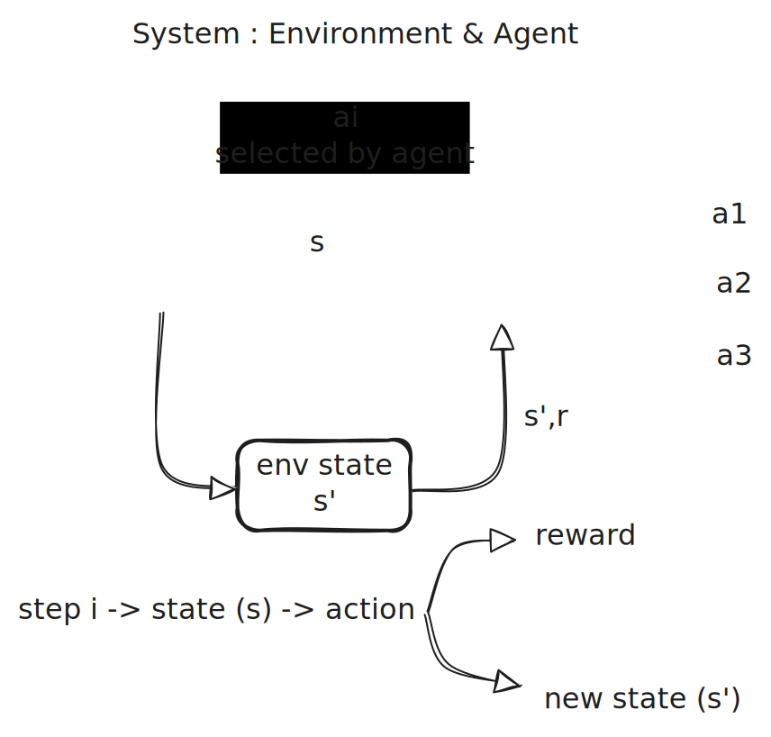
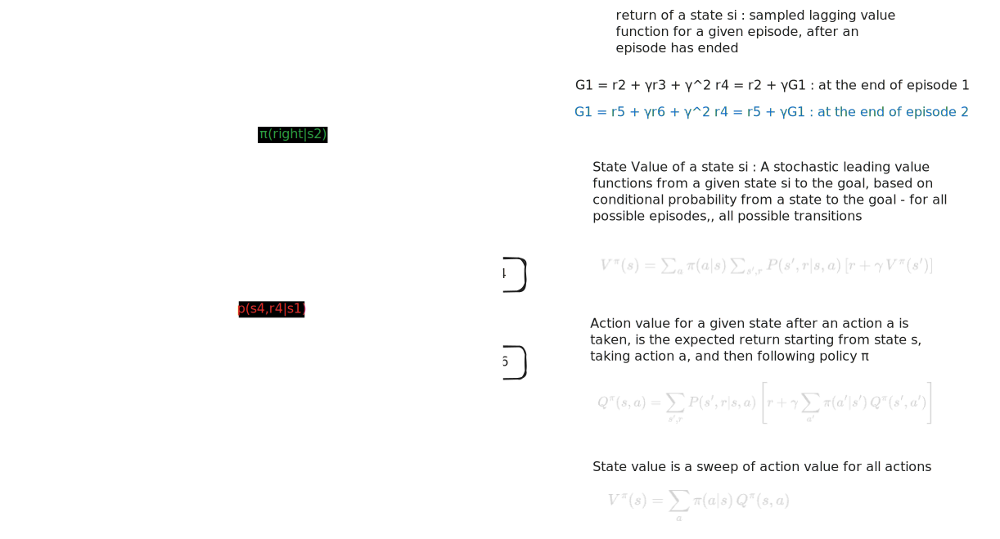

author: Samrat Kar
summary: Introduction to Reinforcement Learning
id: drl-1-intro
categories: drl
environments: Web
status: Published

# A journey into the world of RL by Samrat Kar 
## An introduction of the context
1. RL is a **system** of two entities : **environment** and **agent**. Environment has the ability to present out to the agent its condition which is known as **state**. agent interacts with the environment by observing the state and using this information to select an **action**. The environment accepts the action, and transitions to the next state. it then returns the next state and a reward to the agent. this cycle from state -> action -> reward & new state , is known as a step. Multiple such steps stitched together to form **episode**. An episode defines a series of states. that series of states is known as **trajectory**. the cycle repeats until the environment terminates, for example with the problem is solved. the agent's action producing function is known as **policy**. formally the mapping from state to action is known as policy. An action will change the environment, and affect what an agent observes and does next. **An action changes the environment and what the agent observes and does next.**
the exchange between agent and environment unfolds in time - therefore it can be thought of a sequential decision making process.

2. RL solves **sequential decision** making problems.
3. RL is a specialized learning method (closest to nature and the way learning works in the living world), where the following happens - 
   - the agent senses the environment (S)
   - based on the state values sensed by the agent, it takes some action, that changes the environment state again (A)
   - this agent is long term goal directed. it looks for maximizing a goal - which is a numerical value of reward signals being accumulated by the agent as a fallout of its actions (G)
4. **un-supervised learning and RL** - unlike unsupervised learning, RL does not look for underlying patters in a data set. It's sole job is to maximize rewards. 
5. **supervised learning and RL** - unlike supervised learning, RL does not need pre-existing supervisor who would prescribe what to be done and what not in terms of training data set or labels. RL agents learn things in run-time using sole interaction with the environment.  
6. RL problems have an **objective**, which is the sum of rewards received by an agent. **An agent's goal is to maximize the objective by selecting good actions**. i.e - fine tuning the policy.
7. **policy** - it is a mapping of all states in the states space of the environment to the action (or a probability distribution of the actions). 
Formally:         
  - Deterministic policy: $\pi(s) = a$ -- for every state $s \in \mathcal{S}$, it specifies one action                  
  - Stochastic policy: $\pi(a|s)$ -- for every state $s \in \mathcal{S}$, it gives a probability distribution over all actions.          
Key point: a policy is a **complete recipe** -- it tells the agent what to do in any state it might find itself in, regardless of which episode or trajectory it's in. It's defined over the full state space, not tied to a particular episode.
A trajectory/episode is just one realization -- a sequence of states the agent happened to visit by following the policy. The policy itself exists for states the agent hasn't even visited yet.
1. there is always an **objective**. reach an objective involves taking many actions in sequence. each action changing the environment.
2. example of balancing a flag pole. `slm-lab run --render`
3. environment : 
   - states
   - rewards for each state
   - model dynamics / transition probability - conditional probability distribution of state transition and rewards given an action is taken in a given state - $P(s',r|s,a)$
   - obstruction : states with negative / low rewards
   - objective 
4.  agent : 
   - policy : function that maps state to action : for stochastic cases it would be conditional probability of actions, given a state - $\pi(a|s)$
   - action : the current state is changed, and a reward is received.
5.   agent and environment are mutually exclusive
6.    $(s_t, a_t, r_t)$ control loop : experience.
7.     the control loop can repeat forever theoretically. However, they terminate after reaching a terminal state or a max number of steps t = T. time horizon from t=0 to t=T is known as an episode.
8.    a trajectory is a sequence of experiences in an episode : $\tau = (s_0,a_0,r_0), (s_1,a_1,r_1), (s_2,a_2,r_2), . . ., (s_T, a_T, r_t)$
9.    an agent typically needs several episodes to come up with a good policy. agent's objective is to fine tune its policy to get the maximum return.

## Formulating a problem as an MDP
A Markov Decision Process (MDP) is a mathematical framework used to model decision-making problems where outcomes are partly random and partly under the control of a decision-maker. An MDP is defined by the following components:
1. **States $S$**: A set of all possible states in the environment.
2. **Actions $A$**: A set of all possible actions that the agent can take.
3. **Transition Probability $P(s'|s,a)$**: The probability of transitioning to state $s'$ given that the agent is in state $s$ and takes action $a$.
4. **Reward Function $R(r|s,a)$**: The probability of receiving reward $r$ given that the agent is in state $s$ and takes action $a$.
5. **Discount Factor $\gamma$**: A factor between 0 and 1 that represents the importance of future rewards compared to immediate rewards.

### The Objective of an MDP
The goal of an agent in an MDP is to learn a policy $\pi(a|s)$ that maximizes the expected cumulative reward over time. The Bellman equation is a fundamental recursive relationship that describes the value of a state or action in terms of the expected rewards and the values of subsequent states or actions. Solving an MDP typically involves finding an optimal policy that maximizes the expected cumulative reward, which can be achieved through various algorithms such as dynamic programming, Monte Carlo methods, and temporal difference learning.

### Settings

In dynamic programming, we assume the finite MDP is fully known:

$$
\mathcal{M} = \left(\mathcal{S}, \mathcal{A}, \pi(a \mid s), p(s', r \mid s, a), \gamma\right)
$$

In plain English, this means:

- the environment is modeled as an MDP $\mathcal{M}$
- $\mathcal{S}$ is the set of all states
- $\mathcal{A}$ is the set of all actions
- $\pi(a \mid s)$ is the policy that maps states to actions
- $p(s', r \mid s, a)$ is the conditional probability of getting next state $s'$ and reward $r$, given current state $s$ and action $a$
- $\gamma \in [0,1)$ is the discount factor used to discount future rewards


Once the MDP model $\mathcal{M}$ is known, dynamic programming uses it to compute long-term return estimates. These are the state-value function $V_\pi(s)$ and the action-value function $Q_\pi(s,a)$. 

For policy evaluation, the state-value function is:

$$
V^{\pi}(s) = \sum_a \pi(a \mid s)\sum_{s',r} p(s', r \mid s, a)\left[r + \gamma V^{\pi}(s')\right]
$$

For action values:

$$
Q^{\pi}(s,a) = \sum_{s',r} P(s', r \mid s, a)\left[r + \gamma \sum_{a'} \pi(a' \mid s') Q^{\pi}(s', a')\right]
$$

$$Q^{\pi}(s,a) = \sum_{s',r} P(s',r \mid s,a)\left[r + \gamma V^{\pi}(s')\right]$$

## Value functions 
### Return $G_i$
**return - a retrospective approach - one episode at a time** : the discounted cumulative reward from time step $t$ to the **end of the episode**. $$G_t = R_{t+1} + \gamma R_{t+2} + \gamma^2 R_{t+3} + \dots = \sum_{k=0}^{T-t-1} \gamma^k R_{t+k+1}$$ where $\gamma \in [0,1]$ is the discount factor. $\gamma$ controls how much the agent values future rewards vs immediate rewards. $\gamma = 0$ makes the agent greedy (only cares about immediate reward), $\gamma = 1$ makes the agent far-sighted (values all future rewards equally).
$G_t$ is a random variable — even for a single trajectory, the rewards depend on actions sampled from $\pi(a|s)$ and transitions sampled from $P(s',r|s,a)$. The computed value of $G_t$ is a single realization of this random variable. Its expected value, expanding the probabilities explicitly: $$E_\pi[G_t | S_t = s] = \sum_{a} \pi(a|s) \sum_{s',r} P(s',r|s,a) \left[r + \gamma \, E_\pi[G_{t+1} | S_{t+1} = s']\right]$$ This is exactly $V^\pi(s)$ — the expected return is the state value function.
Recursive form: $$G_t = R_{t+1} + \gamma \, G_{t+1}$$ with $G_T = 0$. The return at time $t$ equals the immediate reward plus the discounted return from the next step.

### State value function $V^\pi(s)$
**state value function** $V^\pi(s)$ : the expected return starting from state $s$ and following policy $\pi$. $$V^\pi(s) = E_\pi [G_t | S_t = s] = E_\pi \left[\sum_{k=0}^{T-t-1} \gamma^k R_{t+k+1} \mid S_t = s\right]$$
**expanding the expectation** — the agent picks action $a$ with probability $\pi(a|s)$, then the environment transitions to state $s'$ with reward $r$ with probability $P(s',r|s,a)$. The future return from $s'$ is still an expectation: $$V^\pi(s) = \sum_{a} \pi(a|s) \sum_{s',r} P(s',r|s,a) \left[r + \gamma \, E_\pi[G_{t+1} | S_{t+1} = s']\right]$$
**recursive form (Bellman equation for $V^\pi$)** : $$V^\pi(s) = \sum_{a} \pi(a|s) \sum_{s',r} P(s',r|s,a) \left[r + \gamma \, V^\pi(s')\right]$$. The value of a state equals the expected immediate reward plus the discounted value of the next state, averaged over all actions (weighted by policy) and all possible transitions.

### Action Value function $Q^\pi(s,a)$
**action Value function** $Q^\pi(s,a)$ : the expected return starting from state $s$, taking action $a$, and then following policy $\pi$. $$Q^\pi(s,a) = E_\pi [G_t | S_t = s, A_t = a] = E_\pi \left[\sum_{k=0}^{T-t-1} \gamma^k R_{t+k+1} \mid S_t = s, A_t = a\right]$$
**expanding the expectation** — the action $a$ is already given, so we only sum over the environment dynamics. The environment transitions to state $s'$ with reward $r$ with probability $P(s',r|s,a)$. The future return from $s'$ is still an expectation: $$Q^\pi(s,a) = \sum_{s',r} P(s',r|s,a) \left[r + \gamma \, E_\pi[G_{t+1} | S_{t+1} = s']\right]$$
**recursive form (Bellman equation for $Q^\pi$)** : $$Q^\pi(s,a) = \sum_{s',r} P(s',r|s,a) \left[r + \gamma \sum_{a'} \pi(a'|s') \, Q^\pi(s',a')\right]$$. The value of taking action $a$ in state $s$ equals the expected immediate reward plus the discounted action value at the next state, averaged over the next action chosen by the policy.

## Relationships between the value functions

1.  **state and action value**: $V^\pi(s) = \sum_{a} \pi(a|s) \, Q^\pi(s,a)$ — the state value is the expected action value over all actions weighted by the policy.
2.  **return before vs after an episode** : before the episode plays out, the return from state $s$ is unknown — it depends on what actions the policy will take and how the environment will respond. The best we can say is the *expected* return, which is $$V^\pi(s) = E_\pi[G_t | S_t = s]$$. **This is a prediction.** After the episode completes, we have the actual rewards $R_{t+1}, R_{t+2}, \dots, R_T$ and can compute the **realized return**: $$G_t = \sum_{k=0}^{T-t-1} \gamma^k R_{t+k+1}$$. **This is a single sample of the random variable $G_t$ after the episode has completed**.
3.  **timeline of what is available when** :
   - **during an episode** : rewards $R_{t+1}$ are observed step by step, but $G_t$ is not yet available — we don't know the future rewards. The only thing we can work with is a prediction: $V^\pi(s)$ or $Q^\pi(s,a)$, but these require either a learned value function (from prior episodes) or known dynamics $P(s',r|s,a)$ to solve the Bellman equations.
   - **after the episode** : all rewards are known. We compute $G_t$ backwards from the terminal state using $G_t = R_{t+1} + \gamma \, G_{t+1}$ with $G_T = 0$. This gives a single realized sample of return for every time step in the episode.
   - **after many episodes** : we accumulate many samples of $G_t$ for each state. Averaging these samples gives an estimate of $V^\pi(s)$ — this is Monte Carlo.

### One episode is not enough for $V^\pi(s)$ and $Q^\pi(s,a)$ : 
even with a fixed policy, both $\pi(a|s)$ and $P(s',r|s,a)$ are stochastic. From the same state $s$, different episodes produce different trajectories with different rewards, giving different $G_t$ values. One episode gives one sample — one roll of the dice. The true $V^\pi(s)$ is the average over *all possible trajectories* from $s$, not the return from any single one. One episode would only be sufficient if both the policy and the environment were fully deterministic — then every trajectory from state $s$ would be identical, and a single $G_t$ would equal $V^\pi(s)$ exactly.

### monte carlo estimation 

if we run many episodes and collect the realized return $G_t$ every time we visit state $s$, the average of those realized returns converges to the true state value: $$V^\pi(s) \approx \frac{1}{N(s)} \sum_{i=1}^{N(s)} G_t^{(i)}$$ where $N(s)$ is the number of times state $s$ was visited and $G_t^{(i)}$ is the realized return from the $i$-th visit. This is the **Monte Carlo method** — it estimates the expected value by averaging samples. It requires no knowledge of $P(s',r|s,a)$ (model-free), only completed episodes. The same idea applies to $Q^\pi(s,a)$: collect realized returns every time action $a$ is taken in state $s$, and average them: $$Q^\pi(s,a) \approx \frac{1}{N(s,a)} \sum_{i=1}^{N(s,a)} G_t^{(i)}$$

## Environment 



**[environment in work](https://github.com/samratkar/drl/blob/main/1-introduction/env.ipynb)**

## From random actions to optimal policy — the dynamic programming transition

### The random agent baseline ([random actions agent](https://github.com/samratkar/drl/blob/main/1-introduction/env.ipynb))

In `env.ipynb`, the agent picks actions uniformly at random: `action = env.action_space.sample()`. There is no learning, no memory, no strategy. The policy is:
$$\pi(a|s) = \frac{1}{|\mathcal{A}|} \quad \forall \, s, a$$

This is useful as a baseline to observe what the environment looks like — what states are visited, what rewards come back, how episodes end. But the returns are poor. In Taxi-v3, for example, the random agent almost never delivers the passenger before the 200-step truncation. Every episode accumulates step penalties (-1 per step) and illegal-action penalties (-10), ending with deeply negative returns. The agent has no way to improve because it never uses the information it collects.

**What is missing:** the agent needs a mechanism to evaluate how good its current behavior is, and then change its behavior to be better.

### The dynamic programming agent ([dynamic programming implementation](https://github.com/samratkar/drl/blob/main/1-introduction/dynamic-prog/dynamic_programming_case_study.ipynb))

Dynamic programming solves this by exploiting the **full environment model** $P(s',r|s,a)$. Unlike the random agent that must *run* episodes to see what happens, DP can *compute* what would happen under any policy without taking a single step.

The algorithm — **policy iteration** — works in a loop:

**Step 1 — Policy Evaluation: how good is the current policy?**
Start with the same uniform random policy as `env.ipynb`. Compute $V^\pi(s)$ for every state by solving the Bellman equation. (See the detailed section below: "Sweeps, episodes, and solving the Bellman equation" for a full explanation of how this is solved and what sweeps are.)

This tells us the expected return from every state *if we keep following the current policy*. For the initial uniform policy on the 3x3 grid, all V values are negative — the random policy is bad.

**Step 2 — Q from V: compare individual actions**
$V^\pi(s)$ tells us how good a *state* is, but to improve the policy we need to compare *actions*. Convert V to Q:
$$Q^\pi(s,a) = \sum_{s',r} P(s',r|s,a)\left[r + \gamma V^\pi(s')\right]$$
Now for each state, we can see which action leads to the highest expected return. This is the critical bridge — Q breaks down the state value into per-action values so we can identify which actions are better than others.

**Step 3 — Policy Improvement: shift probability to the best action**
For each state, find $\argmax_a Q^\pi(s,a)$ — the action(s) with the highest Q value. Build a new policy that puts most probability mass on those actions:
- Best action(s) get probability $\frac{1-\epsilon}{|\text{best actions}|} + \frac{\epsilon}{|\mathcal{A}|}$
- Other actions get just $\frac{\epsilon}{|\mathcal{A}|}$ (exploration floor)

This is no longer uniform — the policy now *prefers* actions that lead to higher returns.

**Step 4 — Repeat** until the greedy actions stop changing (the policy is stable).

## $V^\pi$, $Q^\pi$ vs $V^*$, $Q^*$ — the value of *a* policy vs the value of *the best* policy

### Under a specific policy $\pi$

**$V^\pi(s)$** is the value of state $s$ under **one specific policy** $\pi$. Every policy has its own $V^\pi$. The uniform random policy has one (with poor values). A policy that always goes RIGHT has a different one. An epsilon-greedy policy after some improvement has yet another one. $V^\pi$ answers: "how good is state $s$ if I follow *this particular* policy?"

**$Q^\pi(s,a)$** is the value of taking action $a$ in state $s$ and then following policy $\pi$ from there. It answers a finer question: "how good is it to take *this specific action* in this state, and then follow $\pi$?" The relationship between them:
$$V^\pi(s) = \sum_a \pi(a|s) \, Q^\pi(s,a)$$
The state value is just the average of the action values, weighted by the policy. $V^\pi$ tells you how good a state is overall; $Q^\pi$ breaks that down per action so you can compare them.

### Under the optimal policy $\pi^*$

**$V^*(s)$** is the value of state $s$ under **the best possible policy**:
$$V^*(s) = \max_\pi V^\pi(s)$$

Among all possible policies, there exists one (the optimal policy $\pi^*$) whose $V^\pi$ is the highest at every state. That $V^\pi$ is $V^*$. It satisfies the **Bellman optimality equation for state values**:
$$V^*(s) = \max_a \sum_{s',r} P(s',r|s,a)\left[r + \gamma V^*(s')\right]$$

**$Q^*(s,a)$** is the value of taking action $a$ in state $s$ and then following the **optimal policy** from there:
$$Q^*(s,a) = \sum_{s',r} P(s',r|s,a)\left[r + \gamma V^*(s')\right]$$

It satisfies the **Bellman optimality equation for action values**:
$$Q^*(s,a) = \sum_{s',r} P(s',r|s,a)\left[r + \gamma \max_{a'} Q^*(s',a')\right]$$

The relationship between $V^*$ and $Q^*$ is:
$$V^*(s) = \max_a Q^*(s,a)$$

This is the key equation — the optimal state value is simply the best action value available. Once you have $Q^*$, the optimal policy falls out trivially: $\pi^*(s) = \argmax_a Q^*(s,a)$ — just pick the action with the highest $Q^*$ in every state.

### Why $Q^*$ matters more than $V^*$ in practice — definition vs learning

The *definition* of $Q^*$ references the model: $Q^*(s,a) = \sum_{s',r} P(s',r|s,a)[r + \gamma \max_{a'} Q^*(s',a')]$. But you don't need to *use* that equation to *learn* $Q^*$. Q-learning does this instead: the agent takes action $a$ in state $s$, observes what actually happens (gets reward $r$, lands in $s'$), and updates:
$$Q(s,a) \leftarrow Q(s,a) + \alpha [r + \gamma \max_{a'} Q(s',a') - Q(s,a)]$$
No $P(s',r|s,a)$ anywhere. The agent doesn't sum over all possible next states weighted by their probabilities. It uses the **one transition it actually experienced** — the single $r$ and $s'$ it observed. The environment's stochasticity is handled implicitly through repeated sampling over many episodes.

### How Q-learning implicitly reconstructs the probability distribution

The $\max$ in Q-learning is over **actions at the next state**, not over episodes:
$$Q(s,a) \leftarrow Q(s,a) + \alpha [r + \gamma \max_{a'} Q(s',a') - Q(s,a)]$$
The $\max_{a'}$ asks: "at the next state $s'$, which action has the highest Q value right now?" It's picking the best action within a single update, not comparing across episodes.

The implicit probability reconstruction happens through something different — there is **one single Q table that persists across all episodes**. Every episode's every step writes into the same table. So $Q(s_4, \text{RIGHT})$ is not "the Q value from episode 37" — it's the accumulated result of every time the agent was in state 4, took RIGHT, and observed what happened.

Say the environment dynamics for state 4, action RIGHT are:
- 80% chance → land in $s_5$, reward = -1
- 10% chance → slip to $s_1$, reward = -1
- 10% chance → slip to $s_7$, reward = -1

DP computes this explicitly: $Q(s_4, \text{RIGHT}) = 0.8 \times (-1 + \gamma V(s_5)) + 0.1 \times (-1 + \gamma V(s_1)) + 0.1 \times (-1 + \gamma V(s_7))$

Q-learning doesn't know these probabilities. But over many episodes, the same Q entry accumulates updates from sampled transitions:

```
Episode 1:  s4, RIGHT → lands in s5  → nudges Q(s4, RIGHT) toward (-1 + γ max Q(s5, ·))
Episode 5:  s4, RIGHT → lands in s7  → nudges Q(s4, RIGHT) toward (-1 + γ max Q(s7, ·))
Episode 12: s4, RIGHT → lands in s5  → nudges Q(s4, RIGHT) toward (-1 + γ max Q(s5, ·))
Episode 20: s4, RIGHT → lands in s5  → nudges Q(s4, RIGHT) toward (-1 + γ max Q(s5, ·))
Episode 31: s4, RIGHT → lands in s1  → nudges Q(s4, RIGHT) toward (-1 + γ max Q(s1, ·))
...
```

After hundreds of episodes, ~80% of the updates used $s' = s_5$, ~10% used $s' = s_1$, ~10% used $s' = s_7$ — because that's how the environment actually behaves. The accumulated Q value converges to the same weighted average that DP computes explicitly, not because anyone computed the probabilities, but because **the environment sampled them at the correct frequencies and all those samples landed in the same persistent Q entry**.

The learning rate $\alpha$ ensures each sample makes a small correction rather than overwriting the previous estimate. If Q were reset every episode, this wouldn't work — you'd lose all the accumulated frequency information. The single persistent Q table across all episodes is what makes the implicit probability reconstruction possible.

This is also why Q-learning needs many episodes to converge — it needs enough samples for the sampled frequencies to approximate the true probabilities. DP gets the exact answer in sweeps because it reads $P(s',r|s,a)$ directly. Q-learning gets an approximate answer that improves with more samples.

**The Q-learning algorithm in code:**

```python
# One single Q table — persists across ALL episodes
Q = np.zeros((num_states, num_actions))

for episode in range(num_episodes):
    state = env.reset()
    done = False

    while not done:
        # Pick action: epsilon-greedy (explore vs exploit)
        if np.random.random() < epsilon:
            action = np.random.randint(num_actions)     # explore: random action
        else:
            action = np.argmax(Q[state])                 # exploit: best known action

        # Take action, observe ONE transition (no model needed)
        next_state, reward, done = env.step(action)

        # Q-learning update: use max over next actions (off-policy)
        # This single line is where learning happens.
        # - reward and next_state are the ONE sampled transition
        # - max Q[next_state] evaluates the best action (greedy/optimal policy)
        # - alpha controls how much this single sample nudges the accumulated Q
        Q[state, action] += alpha * (
            reward + gamma * np.max(Q[next_state]) - Q[state, action]
        )

        state = next_state

    # Q is NOT reset here — it carries forward to the next episode.
    # This is critical: the accumulated Q values across episodes
    # implicitly reconstruct the probability-weighted expectations.
```

Notice: `Q` is allocated once before all episodes and never reset. Every `env.step(action)` returns one sampled $(r, s')$ — the agent never sees $P(s',r|s,a)$. Over many episodes, the same `Q[state, action]` entry is updated by transitions sampled at their true frequencies, converging to $Q^*$.

Now contrast this with $V^*$. Even if you somehow learned $V^*$ perfectly, you'd be stuck at **decision time**. To act, you need to pick the best action at each state. That means answering: "if I take action $a$ in state $s$, what state do I end up in, and what's the value there?" That requires knowing $P(s',r|s,a)$ — the model. With $Q^*$, this problem disappears — $Q^*(s,a)$ already has the answer baked in for each action. Just pick $\argmax_a Q^*(s,a)$.

| | **Learning** | **Acting (picking actions)** |
|---|---|---|
| **$V^*$** | Requires the model (value iteration) | Also requires the model to compare actions |
| **$Q^*$** | Model-free (Q-learning — uses sampled transitions) | Model-free (just $\argmax_a Q^*(s,a)$) |

$Q^*$ is model-free at both stages. $V^*$ needs the model at both stages. This is why Q-learning was such a breakthrough — it made the entire pipeline model-free.

### The difference between the Bellman expectation and optimality equations

| | **Bellman expectation** (for $\pi$) | **Bellman optimality** (for $\pi^*$) |
|---|---|---|
| **State values** | $V^\pi(s) = \sum_a \pi(a\|s) \sum_{s',r} P(\dots)[r + \gamma V^\pi(s')]$ | $V^*(s) = \max_a \sum_{s',r} P(\dots)[r + \gamma V^*(s')]$ |
| **Action values** | $Q^\pi(s,a) = \sum_{s',r} P(\dots)[r + \gamma \sum_{a'} \pi(a'\|s') Q^\pi(s',a')]$ | $Q^*(s,a) = \sum_{s',r} P(\dots)[r + \gamma \max_{a'} Q^*(s',a')]$ |
| **Over actions** | Averages using $\pi(a\|s)$ — the policy is fixed | Takes $\max$ — asks "what if I pick the best?" |
| **What it computes** | Value of a given policy | Value of the best possible policy |

**Policy iteration** is the process of finding $V^*$ and $Q^*$ — start with some policy $\pi$, compute $V^\pi$ (policy evaluation), derive $Q^\pi$, improve $\pi$ by acting greedily w.r.t. $Q^\pi$ (policy improvement), repeat. Each cycle gives a better policy with higher values. When $V^\pi$ stops changing, you've reached $V^\pi = V^*$, $Q^\pi = Q^*$, and $\pi = \pi^*$.

## Sweeps, episodes, and solving the Bellman equation

### The Bellman equation is a system of simultaneous equations

The Bellman equation for policy evaluation is:

$$V^\pi(s) = \sum_a \pi(a|s) \sum_{s',r} P(s',r|s,a)\left[r + \gamma V^\pi(s')\right]$$

The same $V^\pi$ appears on both sides. This is not an update rule — it is a **statement of what the true values must satisfy**. For $n$ states, this is $n$ equations with $n$ unknowns — one equation per state, one unknown value per state. Every state's value depends on other states' values simultaneously.

**Concrete example — the 3x3 grid under the uniform random policy ($\pi(a|s) = 0.25$ for all $a$):**

The grid has 9 states (0 through 8). State 8 is the goal (terminal, value = 0). That leaves 8 unknowns: $V(s_0)$ through $V(s_7)$. Each state's Bellman equation says: "my value = weighted average over actions of [reward + $\gamma$ × value of next state]."

For state 0 (top-left corner), the equation looks like:
$$V(s_0) = 0.25 \times [\text{UP transitions}] + 0.25 \times [\text{RIGHT transitions}] + 0.25 \times [\text{DOWN transitions}] + 0.25 \times [\text{LEFT transitions}]$$

Each action term expands into the stochastic outcomes. For example, the RIGHT action from state 0:
- With probability 0.8: go to $s_1$, reward $= -1$ → contributes $0.8 \times (-1 + \gamma \, V(s_1))$
- With probability 0.1: stay at $s_0$ (slip), reward $= -1$ → contributes $0.1 \times (-1 + \gamma \, V(s_0))$
- With probability 0.1: go to $s_3$ (slip), reward $= -1$ → contributes $0.1 \times (-1 + \gamma \, V(s_3))$

When you write out all 8 equations fully, you get something like:
$$V(s_0) = c_0 + \gamma \, [a_{00} \, V(s_0) + a_{01} \, V(s_1) + a_{03} \, V(s_3) + \dots]$$
$$V(s_1) = c_1 + \gamma \, [a_{10} \, V(s_0) + a_{11} \, V(s_1) + a_{12} \, V(s_2) + a_{14} \, V(s_4) + \dots]$$
$$V(s_2) = c_2 + \gamma \, [\dots]$$
$$\vdots$$
$$V(s_7) = c_7 + \gamma \, [\dots V(s_8) \dots]$$

where each $c_i$ is the expected immediate reward for state $i$ (a known number from the model), and each $a_{ij}$ is the probability of transitioning from state $i$ to state $j$ under the policy (also known from the model). Every $V(s_i)$ appears in multiple equations — they are all coupled. You cannot solve for $V(s_0)$ alone without knowing $V(s_1)$ and $V(s_3)$, which in turn depend on other states.

This is a standard **system of linear equations** — the kind you see in linear algebra.

### Solving method 1: direct matrix inversion (small state spaces)

Since the Bellman equation is linear in $V$, the entire system can be written as one matrix equation:

$$\mathbf{V}^\pi = \mathbf{R}^\pi + \gamma \, \mathbf{P}^\pi \, \mathbf{V}^\pi$$

where:
- $\mathbf{V}^\pi$ is the column vector of state values (the 8 unknowns)
- $\mathbf{R}^\pi$ is the column vector of expected immediate rewards per state (known from the model)
- $\mathbf{P}^\pi$ is the $n \times n$ state transition matrix under policy $\pi$, where entry $P^\pi_{ij}$ is the probability of going from state $i$ to state $j$ when following policy $\pi$ (known from the model)

Rearranging:
$$\mathbf{V}^\pi - \gamma \, \mathbf{P}^\pi \, \mathbf{V}^\pi = \mathbf{R}^\pi$$
$$(\mathbf{I} - \gamma \, \mathbf{P}^\pi) \, \mathbf{V}^\pi = \mathbf{R}^\pi$$
$$\mathbf{V}^\pi = (\mathbf{I} - \gamma \, \mathbf{P}^\pi)^{-1} \, \mathbf{R}^\pi$$

One matrix inversion, done. All values computed in one shot. No iteration, no sweeps. This is the purest reading of Bellman — solve the simultaneous equations directly. For our 3x3 grid with 9 states, this is a 9×9 matrix inversion, perfectly feasible. The matrix $(\mathbf{I} - \gamma \, \mathbf{P}^\pi)$ is always invertible when $\gamma < 1$ because the eigenvalues of $\gamma \mathbf{P}^\pi$ are all less than 1 in magnitude.

**Why don't we always do this?** Matrix inversion is $O(n^3)$. For 9 states, that's $729$ operations — trivial. For 1,000 states, it's $10^9$ — slow but possible. For 1,000,000 states (common in real problems), it's $10^{18}$ — completely infeasible. You'd also need to store an $n \times n$ matrix in memory, which for a million states is $10^{12}$ entries.

### Solving method 2: iterative sweeps (large state spaces)

Instead of solving the system directly, we can use an iterative approach: start with a guess $V(s) = 0$ for all states, apply the Bellman equation to compute new values, and repeat until the values stop changing.

**What is a sweep?**

A **sweep** is one pass through every state in the state space, applying the Bellman equation once to each state. In code:

```python
for s in range(num_states):        # loop over every state
    V[s] = bellman_backup(s, V)    # apply the equation using current V
```

This is purely computation — reading from the model $P(s',r|s,a)$ and doing math. No agent is walking around. No actions are being taken in the environment. No rewards are being collected. Nobody interacts with the environment. The environment isn't even "running" — we're just reading its model (the transition probabilities) and computing.

**Why is one sweep not enough?**

After one sweep, every state's value was computed using its neighbors' values — but those neighbors' values were also wrong (they were 0 at the start). The result after one sweep is *less wrong* than the initial guess, but not correct.

Think of the simultaneous equations: $V(s_0)$ depends on $V(s_1)$ which depends on $V(s_4)$ which depends on $V(s_7)$ which depends on the goal reward. In one sweep, state 0's update uses state 1's old value (0), which knows nothing about the goal yet. It takes multiple sweeps for the goal's information to propagate backwards through the chain of dependencies.

**Why does repeating sweeps converge?**

Each sweep shrinks the error by a factor of $\gamma$. The update is $V(s) = r + \gamma V(s')$. The reward $r$ comes from the model (correct). The error is only in $V(s')$, and it gets multiplied by $\gamma < 1$. So if your estimate of $V(s')$ is off by 10, that error contributes only $\gamma \times 10 = 9$ (for $\gamma = 0.9$) to $V(s)$. The error shrinks every sweep:

- After sweep 1: error $\leq E_0 \times \gamma$
- After sweep 2: error $\leq E_0 \times \gamma^2$
- After sweep $k$: error $\leq E_0 \times \gamma^k$
- ...approaches 0 as $k \to \infty$

This is the **contraction mapping** property. No matter what initial guess you start with ($V = 0$, $V = 1000000$, anything), the error shrinks every sweep. The Banach fixed-point theorem guarantees: (1) a unique solution $V^\pi$ exists, and (2) the iterative procedure converges to it.

**When do we stop?**

In our `policy_evaluation()` code, we track `delta` — the largest absolute change to any state's value during one sweep. When `delta` drops below `theta` (set to $10^{-8}$), we declare convergence: no state's value is changing meaningfully anymore.

For the 3x3 grid with $\gamma = 0.9$ and $\theta = 10^{-8}$, policy evaluation converges in roughly 150 sweeps when evaluating the uniform policy. After policy improvement, evaluating the improved policy takes a similar number of sweeps. The outer policy iteration loop converges in just 2 rounds — but each round's policy evaluation does ~150 inner sweeps.

### What is an episode, and why is it fundamentally different from a sweep?

An **episode** is an agent **interacting** with the environment: start in some state, take actions according to a policy, receive rewards, transition to new states, repeat until a terminal state or step limit. The agent *experiences* the environment — it doesn't know the transition probabilities, it just observes what happens.

The fundamental difference:

| | **Sweep (DP)** | **Episode (MC / TD)** |
|---|---|---|
| **What happens** | Loop through every state, compute Bellman equation from the model | Agent walks through the environment, taking actions and observing outcomes |
| **Requires model $P(s',r\|s,a)$?** | Yes — reads the model directly | No — learns from observed transitions |
| **Agent interaction** | None — pure computation | Yes — the agent acts and the environment responds |
| **States visited** | All states, every sweep | Only states the agent happens to visit |
| **When values update** | All states updated in each sweep | Only visited states update |
| **Source of information** | Known transition probabilities | Sampled experience (rewards, next states) |

DP has **sweeps, not episodes**. There is no agent running around. DP knows the full model, so it just sits and computes. Think of it as solving a system of equations by repeated substitution, not by running experiments.

MC and TD have **episodes** (or steps within episodes). The agent doesn't know the model — it must actually run the environment, collect experience, and learn from what it observes.

This is the core tradeoff: DP is exact and efficient per sweep (it updates every state using the true model), but requires knowing the model. MC/TD don't need the model, but they only learn about states the agent actually visits, and the learning is noisy because it's based on sampled experience rather than exact expectations.

### Summary: the two levels of iteration in policy iteration

Policy iteration has two nested loops:

**Outer loop — policy iteration rounds (2 rounds for the 3x3 grid):**
1. Evaluate current policy → get $V^\pi$ (calls `policy_evaluation`)
2. Improve policy → get new $\pi'$ (calls `policy_improvement`)
3. If $\pi'$ = $\pi$, stop (policy is stable). Otherwise, set $\pi = \pi'$ and go to step 1.

**Inner loop — sweeps inside policy evaluation (~150 sweeps per round for the 3x3 grid):**
1. Initialize $V(s) = 0$ for all states
2. Sweep: apply Bellman equation to every state, track `delta` (largest change)
3. If `delta < theta`, return $V$. Otherwise, sweep again.

The "Iteration 0" and "Iteration 1" in the notebook output are the **outer** loop (policy iteration rounds). The ~150 sweeps inside each `policy_evaluation` call are the **inner** loop — previously invisible because the code didn't print the count.

## How the strategy improves — the 3x3 grid example - via Dynamic Programming

[Working demo of a DP agent solving the 3x3 grid](https://samratkar.github.io/assets/drl/webinars/dp-qlearning/src/dynamic_programming_game.html)

The grid has state 0 (top-left) as start and state 8 (bottom-right, G) as goal. Step reward is -1, goal reward is +10.

**Iteration 0 — evaluating the uniform policy:**
| | Col 0 | Col 1 | Col 2 |
|---|---|---|---|
| Row 0 | -5.92 | -5.02 | -3.77 |
| Row 1 | -5.02 | -3.14 | 0.25 |
| Row 2 | -3.77 | 0.25 | G |

All values are negative or near zero. The random policy wanders aimlessly, accumulating -1 penalties. Q values are computed, and for state 0, Q shows that RIGHT and DOWN (both -5.60) are better than UP and LEFT (both -6.25). This makes sense — RIGHT and DOWN move toward the goal. The policy is updated: RIGHT and DOWN get high probability in state 0.

**Iteration 1 — evaluating the improved policy:**
| | Col 0 | Col 1 | Col 2 |
|---|---|---|---|
| Row 0 | 2.71 | 4.35 | 6.22 |
| Row 1 | 4.35 | 6.46 | 8.93 |
| Row 2 | 6.22 | 8.93 | G |

All values are now **positive**. The improved policy reaches the goal reliably enough that the +10 goal reward outweighs the step penalties. The greedy actions haven't changed from iteration 0 — the policy is already stable. Convergence in just 2 iterations.

The final policy points every state toward the goal:
```
+---+---+---+
|>v | v | v |
+---+---+---+
| > |>v | v |
+---+---+---+
| > | > | G |
+---+---+---+
```

### The key transition: why DP works where the random agent cannot

| | Random agent (env.ipynb) | DP agent (dynamic-prog/) |
|---|---|---|
| **Policy** | Fixed uniform $\pi(a\|s) = 1/\|\mathcal{A}\|$ | Iteratively improved toward optimal |
| **Uses model $P(s',r\|s,a)$?** | No — just samples actions and observes | Yes — computes exact expectations |
| **Learning** | None — same policy forever | Policy evaluation + improvement loop |
| **Requires episodes?** | Yes — must run the environment | No — plans entirely from the model |
| **Limitation** | No improvement possible | Requires knowing the full model |

The random agent in `env.ipynb` gives us the **floor** — what happens with zero intelligence. Dynamic programming gives us the **ceiling** for this MDP — the optimal policy computed exactly from the known model. The gap between them is what learning algorithms (Monte Carlo, TD, Q-learning) try to close *without* knowing $P(s',r|s,a)$.

## Monte Carlo Estimation [monte carlo implementation](https://github.com/samratkar/drl/blob/main/1-introduction/montecarlo/monte_carlo_case_study.ipynb)

### The problem: DP needs the full model, but what if we don't have it?

Dynamic programming computes exact expectations using $P(s',r|s,a)$. But in most real problems, the agent doesn't know the environment dynamics — it can only *interact* with the environment and observe what happens. Monte Carlo bridges this gap: it estimates $V^\pi(s)$ and $Q^\pi(s,a)$ from **actual episode experience** rather than from a known model.

Recall from point 8 in the Value Functions section:
$$V^\pi(s) \approx \frac{1}{N(s)} \sum_{i=1}^{N(s)} G_t^{(i)}$$

This is the core idea — run many episodes, collect the realized return $G_t$ every time a state is visited, and average them. The law of large numbers guarantees convergence to the true expectation.

### How Monte Carlo control works — learning from complete episodes

The [Monte Carlo case study](https://github.com/samratkar/drl/blob/main/1-introduction/montecarlo/monte_carlo_case_study.ipynb) implements **first-visit on-policy MC control** on the same 3x3 grid-world. The algorithm:

**1. Initialize** — $Q(s,a) = 0$ for all state-action pairs. Start with a uniform random policy (same as `env.ipynb`).

**2. Generate an episode** — follow the current policy to produce a trajectory:
$$\tau = (s_0, a_0, r_1), (s_1, a_1, r_2), \dots, (s_T, a_T, r_T)$$

This is exactly what `env.ipynb` does — but now we *use* the returns instead of just logging them.

**3. Compute returns backwards** — after the episode ends, walk backwards through the trajectory:
$$G_t = r_{t+1} + \gamma \, G_{t+1} \quad \text{with } G_T = 0$$

**4. First-visit update** — for each $(s_t, a_t)$ that appears for the first time in the episode, add $G_t$ to a running average:
$$Q(s_t, a_t) \leftarrow \text{average of all } G_t \text{ samples for } (s_t, a_t)$$

**5. Improve the policy** — rebuild an epsilon-greedy policy from the updated Q values:
- Best action gets probability $\frac{1-\epsilon}{|\text{best}|} + \frac{\epsilon}{|\mathcal{A}|}$
- Other actions get $\frac{\epsilon}{|\mathcal{A}|}$

**6. Repeat** for many episodes (7000 in the case study), decaying epsilon from 0.25 to 0.02.

## How the policy improves — from random to near-optimal using Monte Carlo

The training snapshots show the progression:

**Episode 1** — Q values are all zero, policy is random. The agent stumbles around just like the random agent in `env.ipynb`.

**Episode 10** — after just a few episodes, states near the goal already have meaningful Q values. State 5 (one step above goal) learns $V \approx 10.0$ quickly because any episode that reaches state 5 and goes DOWN gets +10. The policy near the goal is already correct.

**Episode 100** — the near-optimal policy is largely established. Q values propagate backwards from the goal: state 7 learns RIGHT is good (leads to goal), state 4 learns DOWN is good (leads to state 7), and so on. The policy reads:
```
+---+---+---+
| > | > | v |
+---+---+---+
| v | v | v |
+---+---+---+
| ^ | > | G |
+---+---+---+
```

**Episode 7000** — final converged Q values:

| State | UP | RIGHT | DOWN | LEFT | Best Action | V(s) |
|-------|-----|-------|------|------|-------------|------|
| 0 | 0.91 | **2.85** | 2.10 | 1.38 | RIGHT | 2.85 |
| 1 | 2.72 | **4.97** | 4.21 | 1.81 | RIGHT | 4.97 |
| 2 | 4.39 | 4.57 | **7.05** | 3.18 | DOWN | 7.05 |
| 3 | 1.08 | 3.75 | **4.92** | 1.95 | DOWN | 4.92 |
| 4 | 3.17 | 6.21 | **7.13** | 2.39 | DOWN | 7.13 |
| 5 | 4.55 | 7.23 | **9.49** | 5.32 | DOWN | 9.49 |
| 6 | 3.57 | **7.06** | 4.07 | 3.43 | RIGHT | 7.06 |
| 7 | 5.47 | **9.90** | 6.91 | 4.59 | RIGHT | 9.90 |
| 8 | 0.00 | 0.00 | 0.00 | 0.00 | (goal) | 0.00 |

The final policy consistently reaches the goal in 3-4 steps with return ~7:
```
s0 --RIGHT--> s1 --RIGHT--> s2 --DOWN--> s5 --DOWN--> s8 (return = 7)
```

## Monte Carlo vs random agent — what changed?

The random agent and the early MC agent start from the same place — uniform random actions. The difference is what happens *after* each episode:

| | Random agent (env.ipynb) | Monte Carlo agent |
|---|---|---|
| **After an episode** | Logs returns to CSV, learns nothing | Computes $G_t$, updates $Q(s,a)$ averages |
| **Policy across episodes** | Never changes — always uniform | Gradually shifts probability toward better actions |
| **Episode returns** | Consistently poor (deep negatives in Taxi) | Improve over time as policy improves |
| **Requires model $P$?** | No | No — model-free, learns from experience only |

The random agent computes returns but throws them away. The MC agent *uses* them to update Q, which updates the policy, which generates better episodes, which produce better return estimates — a virtuous cycle.

### Why MC is better than random but not as clean as DP

**Better than random** — MC actually learns. After enough episodes, the agent discovers which actions lead to high returns and favors them. The 3x3 grid goes from random wandering to near-optimal navigation.

**Noisier than DP** — compare the MC Q values to the DP Q values:

| State | DP $Q^*(s, \text{best})$ | MC $Q(s, \text{best})$ | Difference |
|-------|--------------------------|------------------------|------------|
| 0 | 2.77 | 2.85 | +0.08 |
| 4 | 6.62 | 7.13 | +0.51 |
| 7 | 9.19 | 9.90 | +0.71 |

MC values are close but not exact — they are **sample averages**, not exact expectations. With more episodes, they would converge closer to the DP values. The remaining gap comes from:
- **Finite samples** — 7000 episodes is a lot, but not infinite
- **Epsilon-soft policy** — MC evaluates the epsilon-soft policy (with exploration), not the purely greedy one, so its V values reflect occasional random exploration steps
- **High variance** — full-episode returns depend on the entire trajectory; one bad slip early in the episode affects the return for every state visited

**The tradeoff**: DP is exact but needs the model. MC is approximate but only needs episodes. This is the fundamental model-based vs model-free divide.

## Temporal Difference Methods — improving on Monte Carlo

### The two limitations of Monte Carlo

MC is model-free and learns from experience — a big step up from DP's requirement of knowing $P(s',r|s,a)$. But it has two structural weaknesses:

**1. Must wait for the episode to end.** MC computes returns backwards from the terminal state: $G_t = r_{t+1} + \gamma G_{t+1}$. This means no learning happens *during* the episode — the agent must finish the entire trajectory before it can update any Q value. For environments with long episodes (or continuing tasks that never terminate), this is a serious problem.

**2. High variance.** The return $G_t$ depends on every reward from step $t$ all the way to the end. A single unlucky slip early in the episode contaminates the return for every state visited before it. More steps in the trajectory means more sources of randomness compounding into $G_t$.

### The key insight: what if we don't wait?

Recall the MC update for Q:
$$Q(s_t, a_t) \leftarrow Q(s_t, a_t) + \alpha \left[ G_t - Q(s_t, a_t) \right]$$

The target is $G_t$ — the *actual* complete return, which requires waiting until the episode ends.

Now recall the Bellman equation:
$$Q^\pi(s,a) = \sum_{s',r} P(s',r|s,a)\left[r + \gamma V^\pi(s')\right]$$

This says the value of taking action $a$ in state $s$ equals the immediate reward plus the discounted value of the next state. DP uses this with the known model. But what if we use it with *samples* instead?

After taking one step — observing $r_{t+1}$ and $s_{t+1}$ — we already have a one-step estimate of the return:
$$r_{t+1} + \gamma V(s_{t+1})$$

We don't know the true $V(s_{t+1})$, but we have our current *estimate* of it. This is called **bootstrapping** — using an estimate to update another estimate. This is the core idea of temporal difference learning.

## Bootstrapping walkthrough — how estimates build on estimates - in Temporal Difference

The natural question is: where does $V(s_{t+1})$ come from if we haven't learned anything yet? The answer: **we initialize all values to zero (a wrong guess), and the real reward signal gradually corrects them, one state at a time, rippling backwards from the goal.**

Walk through it on the 3x3 grid $\alpha = 0.1$, $\gamma = 0.9$, all $V$ initialized to 0:

```
[s0] [s1] [s2]         V = [0, 0, 0, 0, 0, 0, 0, 0, 0]
[s3] [s4] [s5]
[s6] [s7] [s8=G]
```

**Phase 1 — the goal's neighbors learn first.**

The agent stumbles around randomly and eventually reaches state 7, then moves RIGHT to the goal:

> **Step:** $s_7 \xrightarrow{\text{RIGHT}} s_8$ , reward = +10, done

TD target = $r + \gamma \times V(s_8) = 10 + 0.9 \times 0 = 10$

$$V(s_7) \leftarrow 0 + 0.1 \times (10 - 0) = 1.0$$

```
V = [0, 0, 0, 0, 0, 0, 0, 1.0, 0]
```

State 7 is no longer zero. It saw one real reward (+10) and updated. The estimate is far from the true value, but it encodes real information: "something good happens after state 7."

Similarly, another episode reaches state 5 and goes DOWN to the goal:

> **Step:** $s_5 \xrightarrow{\text{DOWN}} s_8$ , reward = +10, done

$$V(s_5) \leftarrow 0 + 0.1 \times (10 - 0) = 1.0$$

```
V = [0, 0, 0, 0, 0, 1.0, 0, 1.0, 0]
```

**Phase 2 — the signal propagates one hop backwards.**

Now state 4 transitions to state 7 (which already has $V = 1.0$):

> **Step:** $s_4 \xrightarrow{\text{DOWN}} s_7$ , reward = -1

TD target = $-1 + 0.9 \times V(s_7) = -1 + 0.9 \times 1.0 = -0.1$

$$V(s_4) \leftarrow 0 + 0.1 \times (-0.1 - 0) = -0.01$$

```
V = [0, 0, 0, 0, -0.01, 1.0, 0, 1.0, 0]
```

State 4 learned a small signal — not from the goal directly, but from state 7's estimate. The value is slightly negative because the -1 step cost dominates the small discounted estimate. But as $V(s_7)$ gets updated more (growing toward its true value), state 4's estimate will improve too.

**Phase 3 — repeated visits refine the estimates.**

After many more episodes, state 7 is visited repeatedly from different trajectories. Each visit nudges $V(s_7)$ closer to the true value:

> Visit 2: $V(s_7) \leftarrow 1.0 + 0.1 \times (10 - 1.0) = 1.9$
> Visit 3: $V(s_7) \leftarrow 1.9 + 0.1 \times (10 - 1.9) = 2.71$
> Visit 4: $V(s_7) \leftarrow 2.71 + 0.1 \times (10 - 2.71) = 3.439$
> ...and so on, approaching the true value.

As $V(s_7)$ grows, the next time state 4 transitions to state 7:

> **Step:** $s_4 \xrightarrow{\text{DOWN}} s_7$ , reward = -1, $V(s_7) = 2.71$

TD target = $-1 + 0.9 \times 2.71 = 1.439$

$$V(s_4) \leftarrow -0.01 + 0.1 \times (1.439 - (-0.01)) = 0.1349$$

State 4 just jumped from slightly negative to positive — the improving estimate of state 7 pulled it up.

**Phase 4 — the chain reaches state 0.**

The same process continues: state 1 learns from state 4's improving estimate, state 0 learns from state 1's improving estimate. Each state doesn't need to "see" the goal — it only needs to see one step ahead to a state whose estimate is already partially correct.

```
Goal (+10) → V(s7) corrected → V(s4) corrected → V(s1) corrected → V(s0) corrected
                              → V(s5) corrected → V(s2) corrected → V(s0) corrected
```

**The contrast:**

| Method | How does state 0 learn about the +10 goal reward? |
|---|---|
| **MC** | Agent must walk all the way from $s_0$ to $s_8$ in one episode. Then $G_0 = r_1 + \gamma r_2 + \dots + \gamma^k \times 10$ is computed backwards. The entire trajectory is needed. |
| **DP** | Computes $V(s_0)$ from $V(s_1)$ and $V(s_3)$ using the known model $P(s',r\|s,a)$. No experience needed, but requires knowing every transition probability. |
| **TD** | State 0 learns from state 1's estimate, which learned from state 4's estimate, which learned from state 7's estimate, which learned from the actual +10. Each link is one real observed transition. No model needed, no complete episode needed. |

This is why bootstrapping works despite starting from wrong guesses — the real reward signal at the goal is the anchor, and it propagates backwards through the chain of estimates, one step at a time, getting more accurate with every visit.

## TD(0) prediction — learning V step by step

The simplest TD method updates the state value after every single step:
$$V(s_t) \leftarrow V(s_t) + \alpha \left[ r_{t+1} + \gamma V(s_{t+1}) - V(s_t) \right]$$

Compare this to MC:

| | MC | TD(0) |
|---|---|---|
| **Target** | $G_t$ (complete return) | $r_{t+1} + \gamma V(s_{t+1})$ (one-step estimate) |
| **When it updates** | After the episode ends | After every step |
| **What it uses for future value** | Actual future rewards | Current estimate $V(s_{t+1})$ |
| **Bootstrapping** | No | Yes |
| **Bias** | Unbiased (uses real returns) | Biased (estimate depends on current V) |
| **Variance** | High (entire trajectory) | Lower (only one step of randomness) |

The quantity $\delta_t = r_{t+1} + \gamma V(s_{t+1}) - V(s_t)$ is called the **TD error** — it measures how surprising the transition was relative to what we expected.

## From TD prediction to TD control — SARSA and Q-learning

[Working demo of a TD agent solving the 3x3 grid](https://samratkar.github.io/assets/drl/webinars/dp-qlearning/src/q_learning_game.html)

### Why TD prediction ($V$) is not enough for control

TD(0) learns $V^\pi(s)$ — the state value under the current policy. But as discussed in the "$V^\pi$, $Q^\pi$ vs $V^*$, $Q^*$" section, $V$ alone is not actionable. To pick the best action, you need to compare actions — and with $V$ alone, that requires the model $P(s',r|s,a)$ to figure out which action leads to which next state. Since the whole point of TD is to be model-free, learning $V$ defeats the purpose. We need $Q(s,a)$ instead — it tells us the value of each action directly, so we can just pick $\argmax_a Q(s,a)$.

This is why TD *control* methods learn $Q$ rather than $V$.

### On-policy vs off-policy — which policy's values are you learning?

This is a fundamental distinction, separate from the $V$ vs $Q$ choice:

**On-policy** = learn the value of the policy you are currently following (including its exploration). The policy you use to **act** (behavior policy) and the policy you **evaluate** (target policy) are the same.

**Off-policy** = learn the value of a *different* (usually better) policy than the one you are following. The behavior policy (what you actually do) and the target policy (what you are evaluating) are different.

### SARSA — on-policy TD control (learns $Q^\pi$)

The agent takes action $a_t$ in state $s_t$, observes $r_{t+1}$ and $s_{t+1}$, then picks the *next action* $a_{t+1}$ from its current policy, and updates:
$$Q(s_t, a_t) \leftarrow Q(s_t, a_t) + \alpha \left[ r_{t+1} + \gamma Q(s_{t+1}, a_{t+1}) - Q(s_t, a_t) \right]$$

The name comes from the quintuple used in the update: $(S_t, A_t, R_{t+1}, S_{t+1}, A_{t+1})$.

SARSA is **on-policy** because the target uses $Q(s_{t+1}, a_{t+1})$ — the value of the action **actually taken** by the current policy at the next state. So SARSA learns $Q^\pi$ — the action values of the policy it is actually following, including its exploration. If the policy explores with epsilon-greedy and sometimes stumbles into bad states, SARSA's Q values reflect that risk.

### Q-learning — off-policy TD control (learns $Q^*$)

Instead of using the action the policy *would* take next, it uses the *best possible* action at the next state:
$$Q(s_t, a_t) \leftarrow Q(s_t, a_t) + \alpha \left[ r_{t+1} + \gamma \max_{a'} Q(s_{t+1}, a') - Q(s_t, a_t) \right]$$

Q-learning is **off-policy** because the target uses $\max_{a'} Q(s_{t+1}, a')$ — the value of the **best** action, not the action actually taken. The agent explores with epsilon-greedy (behavior policy), but learns about the greedy policy (target policy). These are two different policies. This separation means Q-learning converges to $Q^*$ (the optimal action values) regardless of how the agent explores, as long as all state-action pairs are visited sufficiently.

### The key difference: what do the Q values reflect?

| | **SARSA (on-policy)** | **Q-learning (off-policy)** |
|---|---|---|
| **What it learns** | $Q^\pi$ — action values of the current epsilon-greedy policy | $Q^*$ — action values of the optimal policy |
| **Target in update** | $Q(s_{t+1}, a_{t+1})$ — the action actually taken next | $\max_{a'} Q(s_{t+1}, a')$ — the best action, regardless of what was taken |
| **Behavior policy** | Epsilon-greedy | Epsilon-greedy |
| **Target policy** | Same epsilon-greedy (on-policy) | Greedy / optimal (off-policy) |
| **Q values account for exploration?** | Yes — if exploration causes falls, Q values reflect it | No — Q values reflect optimal behavior, ignoring exploration |

**Cliff walking example:** In the classic cliff walking environment, SARSA learns the **safe path** away from the cliff edge because it knows its own epsilon-greedy policy sometimes explores randomly — and a random step near the cliff means falling in. SARSA's Q values account for that risk. Q-learning learns the **optimal path** along the cliff edge because it evaluates the greedy policy which never explores — it doesn't account for the epsilon-random steps. However, during actual execution with epsilon-greedy, Q-learning's agent occasionally falls off the cliff, getting lower online reward than SARSA despite having learned the "better" policy.

### Connection to TD(0) prediction

TD(0) prediction (learning $V^\pi$) is inherently **on-policy** — it learns the state values of whatever policy the agent is following. But as discussed, $V^\pi$ is not actionable without the model. This is why TD control methods switched to learning $Q$ instead:

| | What it learns | On/off-policy | Model needed to act? |
|---|---|---|---|
| **TD(0) prediction** | $V^\pi$ (state values of current policy) | On-policy | Yes — $V$ alone can't pick actions |
| **SARSA** | $Q^\pi$ (action values of current policy) | On-policy | No — $\argmax_a Q^\pi(s,a)$ |
| **Q-learning** | $Q^*$ (action values of optimal policy) | Off-policy | No — $\argmax_a Q^*(s,a)$ |

The progression: TD(0) prediction showed that model-free bootstrapping works. SARSA applied it to $Q$ instead of $V$, making it actionable. Q-learning went further — by evaluating the optimal policy instead of the current one, it learns $Q^*$ directly, converging to optimal behavior regardless of how the agent explores.

## Why TD is an improvement over MC

Consider the 3x3 grid-world. Under MC, if the agent takes 30 steps to reach the goal in one episode, the return for state 0 includes all 30 rewards compounded together. One bad slip at step 15 affects the return estimate for state 0. Under TD, state 0's Q value is updated using only the immediate reward and the estimate of the next state — the slip at step 15 only directly affects the states near step 15.

| | MC | TD |
|---|---|---|
| **Updates per episode** | One batch at the end | One after every step |
| **Can learn during episode** | No | Yes |
| **Works for continuing (non-episodic) tasks** | No | Yes |
| **Variance** | High — depends on full trajectory | Lower — depends on one transition |
| **Bias** | None — uses real returns | Some — bootstraps from estimates |
| **Sample efficiency** | Lower — needs many complete episodes | Higher — learns from every step |
| **Model required** | No | No |

The bias-variance tradeoff is the key: MC is *unbiased* but *high variance*, TD is *biased* but *lower variance*. In practice, the lower variance of TD often leads to faster convergence, making it the more practical choice for most problems.

## The progression so far

| Method | Model needed? | Learns from | Updates when | Key limitation |
|--------|--------------|-------------|--------------|----------------|
| **Random agent** | No | Nothing | Never | No learning at all |
| **DP** | Yes — full $P(s',r\|s,a)$ | Model computation | Full sweeps | Must know the environment |
| **Monte Carlo** | No | Complete episodes | End of episode | High variance, must wait for episode end |
| **TD (SARSA / Q-learning)** | No | Single transitions | Every step | Biased estimates (bootstrap) |

Each method relaxes a constraint of the previous one. DP needs the model — MC drops that. MC needs complete episodes — TD drops that. The next step is implementing these TD methods on the same grid-world to see how they compare in practice.

