# Policy Gradient Methods & Proximal Policy Optimization (PPO)
## Complete Lecture & Lab Study Notes

> **Course Reference:** Reinforcement Learning & Deep RL  
> **Textbook Foundations:** Sutton & Barto (2018) *Ch. 13* | Graesser & Keng (2019) *Ch. 6 & 7* | Schulman et al. (2017) *PPO Paper*  
> **Companion Lectures:** [Lecture 9: Policy Gradient Methods](file:///c:/github/drl/barto-sutton-graesser-keng/lecture9-policy-gradient/lecture9-policy-gradient.md) & [Lecture 10: Proximal Policy Optimization](file:///c:/github/drl/barto-sutton-graesser-keng/lecture10-ppo/lecture10-ppo.md)

---

# Table of Contents
1. [Sheet 1: Value-Based vs. Policy-Based Methods](#sheet-1-value-based-vs-policy-based-methods)
2. [Sheet 2: The Policy Gradient Theorem & Derivation](#sheet-2-the-policy-gradient-theorem--derivation)
3. [Sheet 3: REINFORCE (Monte Carlo Policy Gradient)](#sheet-3-reinforce-monte-carlo-policy-gradient)
4. [Sheet 4: REINFORCE with Baseline & Unbiased Proof](#sheet-4-reinforce-with-baseline--unbiased-proof)
5. [Sheet 5: Policy Parameterizations (Softmax & Gaussian)](#sheet-5-policy-parameterizations-softmax--gaussian)
6. [Sheet 6: One-Step Actor-Critic (TD Online Learning)](#sheet-6-one-step-actor-critic-td-online-learning)
7. [Sheet 7: Advantage Actor-Critic (A2C) & Parallel Rollouts](#sheet-7-advantage-actor-critic-a2c--parallel-rollouts)
8. [Sheet 8: Generalized Advantage Estimation (GAE) & Bias-Variance](#sheet-8-generalized-advantage-estimation-gae--bias-variance)
9. [Sheet 9: Policy Gradients for Continuing Tasks (Average Reward)](#sheet-9-policy-gradients-for-continuing-tasks-average-reward)
10. [Sheet 10: Multi-Algorithm 3-State MDP Solved Case Study](#sheet-10-multi-algorithm-3-state-mdp-solved-case-study)
11. [Sheet 11: The Step Size Problem & Advantage Estimation Summary](#sheet-11-the-step-size-problem--advantage-estimation-summary)
12. [Sheet 12: The Probability Ratio & Importance Sampling](#sheet-12-the-probability-ratio--importance-sampling)
13. [Sheet 13: Proximal Policy Optimization (PPO) & Clipped Objective](#sheet-13-proximal-policy-optimization-ppo--clipped-objective)
14. [Sheet 14: Deep-Dive: PPO Clipping Mechanics & Asymmetry](#sheet-14-deep-dive-ppo-clipping-mechanics--asymmetry)
15. [Sheet 15: Shannon Entropy Exploration Bonus & Architecture](#sheet-15-shannon-entropy-exploration-bonus--architecture)
16. [Sheet 16: Complete End-to-End PPO Algorithm & PyTorch Code](#sheet-16-complete-end-to-end-ppo-algorithm--pytorch-code)
17. [Sheet 17: Master Summary & Algorithm Comparison Matrix](#sheet-17-master-summary--algorithm-comparison-matrix)

---

# Sheet 1: Value-Based vs. Policy-Based Methods

### 1. Introduction & Paradigms
* **Value-Based Methods (DQN, Sarsa, Q-Learning):**
  * Learn the state-action value function $Q(s,a)$ or state-value function $V(s)$.
  * Select actions *indirectly* via greedy maximization:
    $$\pi(s) = \arg\max_{a \in \mathcal{A}} Q(s, a)$$
* **Policy-Based Methods (Policy Gradients):**
  * Parameterize the policy directly as a function $\pi_{\theta}(a \mid s) = P(A_t = a \mid S_t = s, \theta)$.
  * Optimize policy parameters $\theta \in \mathbb{R}^d$ via **gradient ascent** on the expected cumulative return $J(\theta)$.


---

### 2. Why Use Policy Gradients over Value-Based Methods?

| Key Advantage | Explanation & Real-World Example |
| :--- | :--- |
| **1. Continuous Action Spaces** | DQN requires computing $\arg\max_a Q(s,a)$ over all actions. For continuous control (robotics joint torques, car steering angles in $[-180^\circ, +180^\circ]$), $\arg\max$ over an infinite set is computationally intractable. Policy networks directly output distribution parameters like mean $\mu(s)$ and standard deviation $\sigma(s)$. |
| **2. True Stochastic Policies** | Q-learning always converges to a deterministic policy. In imperfect-information or adversarial games (Rock-Paper-Scissors, Poker), a deterministic agent is easily exploited. Policy gradients naturally learn optimal stochastic distributions (e.g., $33\% / 33\% / 33\%$). |
| **3. Smooth, Stable Updates** | In Q-learning, a tiny change in a single Q-value can cause the $\arg\max$ to abruptly jump to a totally different action. In policy gradients, gradient updates smoothly shift action probabilities $\pi_\theta(a \mid s)$. |
| **4. Production Efficiency** | Once training is complete, the Critic / value network can be completely discarded. At inference time, only the lightweight Policy network is executed. |

---

### 3. Comparison Matrix: Value-Based vs. Policy-Based

| Feature | Value-Based Methods (DQN, Sarsa) | Policy-Based Methods (REINFORCE, PPO) |
| :--- | :--- | :--- |
| **Primary Target** | $Q^*(s, a)$ or $V^*(s)$ | Optimal Policy $\pi^*(a \mid s)$ |
| **Action Selection** | Greedy / $\epsilon$-greedy over $Q(s, a)$ | Direct probability sampling $A \sim \pi_{\theta}(\cdot \mid S)$ |
| **Action Space** | Discrete (Small, finite action sets) | Discrete **and** Continuous (Infinite actions) |
| **Policy Type** | Deterministic (near greedy) | True Stochastic or Deterministic |
| **Optimization Loss** | Bellman Temporal Difference MSE | Performance Gradient Ascent $\nabla_{\theta} J(\theta)$ |
| **Convergence** | Can diverge with function approximation | Guaranteed local convergence via gradient ascent |

> **Key Takeaway:** Policy Gradients bypass value maximization and directly optimize policy weights $\theta$ using gradient ascent, natively handling continuous actions and stochastic policies.

---

# Sheet 2: The Policy Gradient Theorem & Derivation

### 1. The Optimization Objective
Let an environment rollout trajectory be $\tau = (s_0, a_0, r_1, s_1, a_1, \dots, s_{T-1}, a_{T-1}, r_T, s_T)$.  
The performance objective $J(\theta)$ is defined as the expected cumulative return:
$$J(\theta) = \mathbb{E}_{\tau \sim \pi_{\theta}} [R(\tau)] = \sum_{\tau} P(\tau; \theta) R(\tau)$$

Our goal is to perform gradient ascent on policy parameters $\theta$:
$$\theta_{t+1} = \theta_t + \alpha \nabla_{\theta} J(\theta)$$

---

### 2. The Analytical Gradient & The Roadblock

$$\nabla_{\theta} J(\theta) = \nabla_{\theta} \sum_{\tau} P(\tau; \theta) R(\tau) = \sum_{\tau} \nabla_{\theta} P(\tau; \theta) R(\tau)$$

> [!CAUTION]
> **The Roadblock:** In practical reinforcement learning, the number of possible trajectories $\tau$ is infinite or astronomically large. We cannot compute this sum directly; we must estimate it via sampling: $\mathbb{E}[f(\tau)] \approx \frac{1}{N} \sum_{i=1}^N f(\tau_i)$.  
> However, $\nabla_{\theta} P(\tau; \theta)$ is **not** a valid probability distribution because:
> 1. It can be negative (probabilities cannot be negative).
> 2. It sums to zero: $\sum_\tau \nabla_\theta P(\tau; \theta) = \nabla_\theta \sum_\tau P(\tau; \theta) = \nabla_\theta(1) = 0$.  
> Therefore, we cannot sample trajectories from $\nabla_{\theta} P(\tau; \theta)$ directly!

---

### 3. Step-by-Step Mathematical Derivation

#### Step 1: The Likelihood Ratio / Log-Derivative Trick
Using standard calculus:
$$\frac{d}{dx} \ln(x) = \frac{1}{x} \implies \nabla_{\theta} \ln P(\tau; \theta) = \frac{\nabla_{\theta} P(\tau; \theta)}{P(\tau; \theta)} \implies \nabla_{\theta} P(\tau; \theta) = P(\tau; \theta) \nabla_{\theta} \ln P(\tau; \theta)$$

Substituting this identity back into the gradient sum:
$$\nabla_{\theta} J(\theta) = \sum_{\tau} P(\tau; \theta) \Big[ \nabla_{\theta} \ln P(\tau; \theta) R(\tau) \Big] = \mathbb{E}_{\tau \sim \pi_{\theta}} \Big[ \nabla_{\theta} \ln P(\tau; \theta) R(\tau) \Big]$$
*Now $P(\tau; \theta)$ is outside the gradient, converting the expression into an expectation sampleable via simulation!*

#### Step 2: Eliminating Unknown Environment Transition Dynamics
The probability of generating trajectory $\tau$ is:
$$P(\tau; \theta) = P(s_0) \prod_{t=0}^{T-1} \pi_{\theta}(a_t \mid s_t) P(s_{t+1} \mid s_t, a_t)$$

Taking the natural logarithm transforms products into sums:
$$\ln P(\tau; \theta) = \ln P(s_0) + \sum_{t=0}^{T-1} \ln \pi_{\theta}(a_t \mid s_t) + \sum_{t=0}^{T-1} \ln P(s_{t+1} \mid s_t, a_t)$$

Taking the gradient $\nabla_{\theta}$ with respect to policy parameters $\theta$:
* Initial state distribution does not depend on $\theta$: $\nabla_{\theta} \ln P(s_0) = \mathbf{0}$
* Environment transition physics do not depend on $\theta$: $\nabla_{\theta} \ln P(s_{t+1} \mid s_t, a_t) = \mathbf{0}$

$$\nabla_{\theta} \ln P(\tau; \theta) = \sum_{t=0}^{T-1} \nabla_{\theta} \ln \pi_{\theta}(a_t \mid s_t)$$

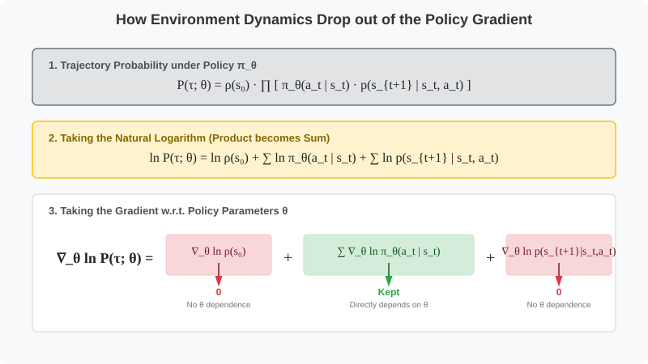

---

### 4. The Policy Gradient Theorem Formulation

$$\nabla_{\theta} J(\theta) = \mathbb{E}_{\tau \sim \pi_{\theta}} \left[ \sum_{t=0}^{T-1} \nabla_{\theta} \ln \pi_{\theta}(a_t \mid s_t) R(\tau) \right]$$

* **Key Outcome:** Unknown environment dynamics $P(s_{t+1} \mid s_t, a_t)$ completely drop out. We only calculate the gradient of our own parameterized policy $\nabla_\theta \ln \pi_\theta(a_t \mid s_t)$.

---

# Sheet 3: REINFORCE (Monte Carlo Policy Gradient)

### 1. Mathematical Formulation & Update Rule
In REINFORCE (Sutton & Barto Sec. 13.3), future expected returns are estimated by the **actual observed Monte Carlo return** $G_t = \sum_{k=t+1}^{T} \gamma^{k-t-1} R_k$:

$$\theta \leftarrow \theta + \alpha \gamma^t G_t \nabla_{\theta} \ln \pi_{\theta}(A_t \mid S_t)$$

$$\begin{aligned}
\theta &\leftarrow \text{Current Policy Parameters} \\
\alpha &> 0 \quad \text{(Learning Rate Step Size)} \\
\gamma^t &\in (0, 1] \quad \text{(Discount Factor Tracker)} \\
G_t &\leftarrow \text{Observed Return from time step } t \text{ to end of episode } T \\
\nabla_{\theta} \ln \pi_{\theta}(A_t \mid S_t) &\leftarrow \text{Score Function (Direction in parameter space to increase probability of } A_t\text{)}
\end{aligned}$$

---

### 2. REINFORCE Algorithm Flow & Pseudocode

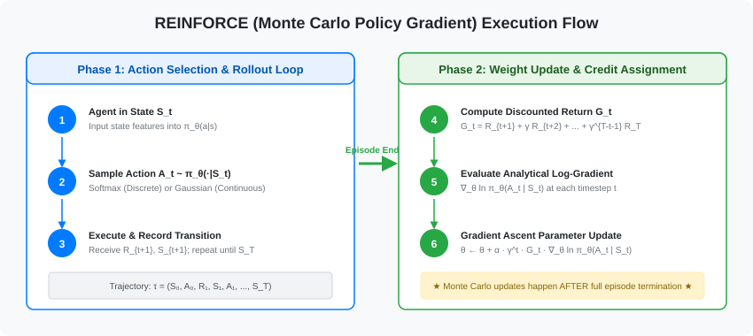

$$
\begin{array}{l}
\textbf{Algorithm: REINFORCE (Monte Carlo Policy Gradient)} \\
\hline
\textbf{Input:} \text{ a differentiable policy parameterization } \pi_{\theta}(a \mid s) \\
\textbf{Parameters:} \text{ step size } \alpha > 0, \text{ discount factor } \gamma \in [0, 1] \\
\textbf{Initialize:} \text{ policy parameter weights } \theta \in \mathbb{R}^d \\
\\
\textbf{Loop forever (for each episode):} \\
\quad \textbf{Phase 1: Action Selection (Rollout)} \\
\quad \text{Generate an episode } S_0, A_0, R_1, \dots, S_{T-1}, A_{T-1}, R_T \text{ following } \pi_{\theta}: \\
\quad \quad \bullet \text{ Discrete: compute preferences } h(S_t, a, \theta) \xrightarrow{\text{softmax}} \pi_{\theta}(a \mid S_t) \text{ and sample } A_t \\
\quad \quad \bullet \text{ Continuous: compute } \mu(S_t, \theta), \sigma(S_t, \theta) \text{ and sample } A_t \sim \mathcal{N}(\mu, \sigma^2) \\
\\
\quad \textbf{Phase 2: Weight Update (Learning)} \\
\quad \textbf{Loop for each step of the episode } t = 0, 1, \dots, T-1: \\
\qquad G_t \leftarrow \sum_{k=t+1}^{T} \gamma^{k-t-1} R_k \\
\qquad \theta \leftarrow \theta + \alpha \gamma^t G_t \nabla_{\theta} \ln \pi_{\theta}(A_t \mid S_t)
\end{array}
$$

---

### 3. Solved Numerical Example (REINFORCE Step-by-Step)

#### Environment Setup
* Actions: $\mathcal{A} = \{a_1, a_2\}$. Linear preference model: $h(s, a, \theta) = \theta_a^T \mathbf{x}(s)$.
* State feature vector: $\mathbf{x}(S_0) = \begin{bmatrix} 1.0 \\ 2.0 \end{bmatrix}$.
* Initial parameter weights: $\theta_{a_1} = \begin{bmatrix} 0.1 \\ -0.2 \end{bmatrix}, \quad \theta_{a_2} = \begin{bmatrix} -0.1 \\ 0.2 \end{bmatrix}$.
* Hyperparameters: $\alpha = 0.2, \quad \gamma = 0.9$.
* Sample rollout trajectory from $S_0$ choosing $A_0 = a_1$: rewards observed $R_1 = 2, R_2 = 1, R_3 = 5$ (Length $T=3$).

#### Step-by-Step Execution:
1. **Compute Cumulative Return $G_0$:**
   $$G_0 = R_1 + \gamma R_2 + \gamma^2 R_3 = 2 + 0.9(1) + (0.9)^2(5) = 2 + 0.9 + 4.05 = 6.95$$

2. **Compute Preferences and Probabilities at $S_0$:**
   $$h(S_0, a_1) = [0.1, -0.2] \begin{bmatrix} 1.0 \\ 2.0 \end{bmatrix} = 0.1 - 0.4 = -0.3$$
   $$h(S_0, a_2) = [-0.1, 0.2] \begin{bmatrix} 1.0 \\ 2.0 \end{bmatrix} = -0.1 + 0.4 = +0.3$$
   $$\pi_{\theta}(a_1 \mid S_0) = \frac{e^{-0.3}}{e^{-0.3} + e^{0.3}} = \frac{0.7408}{0.7408 + 1.8221} \approx 0.289, \quad \pi_{\theta}(a_2 \mid S_0) = 0.711$$

3. **Compute Softmax Log-Gradient for Chosen Action $A_0 = a_1$:**
   $$\nabla_{\theta_{a_1}} \ln \pi_{\theta}(a_1 \mid S_0) = (1 - \pi_{\theta}(a_1 \mid S_0))\mathbf{x}(S_0) = (1 - 0.289)\begin{bmatrix} 1.0 \\ 2.0 \end{bmatrix} = \begin{bmatrix} 0.711 \\ 1.422 \end{bmatrix}$$
   $$\nabla_{\theta_{a_2}} \ln \pi_{\theta}(a_1 \mid S_0) = -\pi_{\theta}(a_2 \mid S_0)\mathbf{x}(S_0) = -0.711 \begin{bmatrix} 1.0 \\ 2.0 \end{bmatrix} = \begin{bmatrix} -0.711 \\ -1.422 \end{bmatrix}$$

4. **Update Parameter Weights:**
   $$\theta_{a_1} \leftarrow \begin{bmatrix} 0.1 \\ -0.2 \end{bmatrix} + (0.2)(1.0)(6.95)\begin{bmatrix} 0.711 \\ 1.422 \end{bmatrix} = \begin{bmatrix} 0.1 \\ -0.2 \end{bmatrix} + \begin{bmatrix} 0.988 \\ 1.977 \end{bmatrix} = \begin{bmatrix} 1.088 \\ 1.777 \end{bmatrix}$$
   $$\theta_{a_2} \leftarrow \begin{bmatrix} -0.1 \\ 0.2 \end{bmatrix} + (0.2)(1.0)(6.95)\begin{bmatrix} -0.711 \\ -1.422 \end{bmatrix} = \begin{bmatrix} -0.1 \\ 0.2 \end{bmatrix} - \begin{bmatrix} 0.988 \\ 1.977 \end{bmatrix} = \begin{bmatrix} -1.088 \\ -1.777 \end{bmatrix}$$

> [!WARNING]
> **The High Variance Limitation of REINFORCE:** Because $G_t$ accumulates stochastic transitions across the entire episode, returns exhibit extreme variance. A brilliant early move will be penalized if the agent encounters an unlucky stochastic trap 50 steps later!

---

# Sheet 4: REINFORCE with Baseline & Unbiased Proof

### 1. Update Formulation & The Advantage
To reduce gradient variance, we subtract an action-independent baseline $b(S_t)$ (typically the learned state-value $\hat{v}(S_t, \mathbf{w})$):

$$\theta_{t+1} = \theta_t + \alpha \gamma^t \underbrace{\Big( G_t - \hat{v}(S_t, \mathbf{w}) \Big)}_{\text{Advantage } \delta_t} \nabla_{\theta} \ln \pi_{\theta}(A_t \mid S_t)$$
$$\mathbf{w}_{t+1} = \mathbf{w}_t + \beta \underbrace{\Big( G_t - \hat{v}(S_t, \mathbf{w}) \Big)}_{\text{Prediction Error } \delta_t} \nabla_{\mathbf{w}} \hat{v}(S_t, \mathbf{w})$$

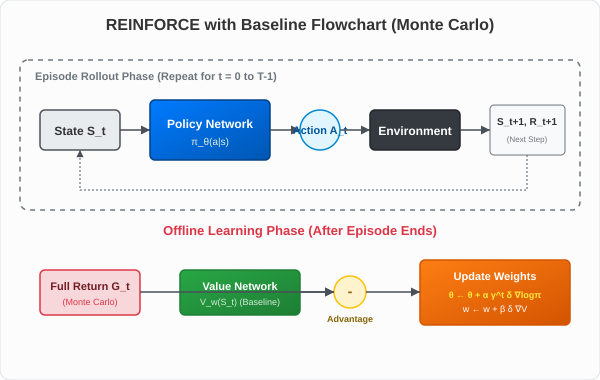

---

### 2. Proof of Unbiased Baseline (Zero Expectation Contribution)
**Theorem:** For any baseline function $b(s)$ that does not depend on action $a$, the expected gradient contribution of the baseline is **identically zero**:

$$\mathbb{E}_{A \sim \pi_{\theta}} \Big[ b(s) \nabla_{\theta} \ln \pi_{\theta}(A \mid s) \Big] = \mathbf{0}$$

#### Proof:
$$\begin{aligned}
\mathbb{E}_{A \sim \pi_{\theta}} \Big[ b(s) \nabla_{\theta} \ln \pi_{\theta}(A \mid s) \Big] &= \sum_{a \in \mathcal{A}} \pi_{\theta}(a \mid s) b(s) \nabla_{\theta} \ln \pi_{\theta}(a \mid s) && \text{[By definition of Expectation]} \\
&= \sum_{a \in \mathcal{A}} \pi_{\theta}(a \mid s) b(s) \frac{\nabla_{\theta} \pi_{\theta}(a \mid s)}{\pi_{\theta}(a \mid s)} && \text{[Log derivative identity]} \\
&= \sum_{a \in \mathcal{A}} b(s) \nabla_{\theta} \pi_{\theta}(a \mid s) && \text{[}\pi_\theta(a \mid s)\text{ cancels out]} \\
&= b(s) \sum_{a \in \mathcal{A}} \nabla_{\theta} \pi_{\theta}(a \mid s) && \text{[}b(s)\text{ is independent of } a\text{]} \\
&= b(s) \nabla_{\theta} \left[ \sum_{a \in \mathcal{A}} \pi_{\theta}(a \mid s) \right] && \text{[Swap gradient and summation]} \\
&= b(s) \nabla_{\theta} [ 1 ] && \text{[Probabilities sum to 1]} \\
&= b(s) \cdot \mathbf{0} = \mathbf{0} \quad \blacksquare
\end{aligned}$$

*Conclusion: Baseline subtraction reduces gradient variance without introducing any mathematical bias.*

---

# Sheet 5: Policy Parameterizations (Softmax & Gaussian)

### 1. Side-by-Side Comparison

| Feature | Softmax Policy (Discrete) | Gaussian Policy (Continuous) |
| :--- | :--- | :--- |
| **Action Space** | Finite discrete: $a \in \{1, 2, \dots, k\}$ | Infinite continuous vectors: $a \in \mathbb{R}^m$ |
| **Example Domains** | CartPole, Gridworld, Atari Pong | LunarLanderContinuous, Robotics Arm |
| **Network Output Heads** | Preference logits $h(s, a, \theta)$ | Mean $\mu(s, \theta_\mu)$ & Log-Std $\eta(s, \theta_\sigma)$ |
| **Action Distribution** | Categorical / Softmax | Normal Gaussian $\mathcal{N}(\mu(s), \sigma(s)^2)$ |
| **Sampling Rule** | $A_t \sim \text{Categorical}(\text{Softmax}(\mathbf{h}))$ | $A_t = \mu(s) + \sigma(s) \cdot \epsilon, \quad \epsilon \sim \mathcal{N}(0, 1)$ |
| **Reparameterization** | Not required (discrete) | Required for gradient propagation |


---

### 2. Gaussian Parameterization in Detail

$$\pi_{\theta}(a \mid s) = \frac{1}{\sigma(s, \theta) \sqrt{2\pi}} \exp \left( -\frac{(a - \mu(s, \theta))^2}{2\sigma(s, \theta)^2} \right)$$

* **Why output Log-Standard Deviation $\eta(s) = \ln \sigma(s)$?**  
  Standard deviation $\sigma$ must always be strictly positive ($\sigma > 0$). By predicting $\eta(s) \in \mathbb{R}$, we set $\sigma(s) = \exp(\eta(s)) > 0$ unconditionally.
* **Analytical Gaussian Log-Gradients:**
  $$\nabla_{\theta_{\mu}} \ln \pi_{\theta}(a \mid s) = \frac{a - \mu(s)}{\sigma(s)^2} \nabla_{\theta_{\mu}} \mu(s)$$
  $$\nabla_{\theta_{\sigma}} \ln \pi_{\theta}(a \mid s) = \left( \frac{(a - \mu(s))^2}{\sigma(s)^2} - 1 \right) \nabla_{\theta_{\sigma}} \eta(s)$$

---

### 3. Numerical Walkthrough of Gaussian Policy Update

Assume current policy has $\mu(s) = 5.0, \sigma(s) = 2.0$ (so $\sigma^2 = 4.0$), and observes advantage $\delta = +0.5$:
* **Case 1: Sampled action is above the mean ($a = 7.0$):**
  * $\nabla_\mu \ln \pi = \frac{7.0 - 5.0}{4.0} = +0.5 \implies$ Mean $\mu$ shifts right (increases toward 7.0).
  * $\nabla_\sigma \ln \pi = \frac{(7.0 - 5.0)^2}{4.0} - 1 = 0 \implies \sigma$ remains unchanged (action is exactly $1\sigma$ away).
* **Case 2: Sampled action is far outlier ($a = 9.0$):**
  * $\nabla_\mu \ln \pi = \frac{9.0 - 5.0}{4.0} = +1.0 \implies$ Mean $\mu$ shifts strongly right.
  * $\nabla_\sigma \ln \pi = \frac{(9.0 - 5.0)^2}{4.0} - 1 = +3.0 \implies \sigma$ increases (broadens exploration to cover high-reward region).
* **Case 3: Sampled action is close to mean ($a = 5.5$):**
  * $\nabla_\mu \ln \pi = \frac{5.5 - 5.0}{4.0} = +0.125 \implies$ Mean $\mu$ shifts slightly right.
  * $\nabla_\sigma \ln \pi = \frac{(5.5 - 5.0)^2}{4.0} - 1 = -0.9375 \implies \sigma$ decreases (narrows distribution to exploit precise mean).

---

# Sheet 6: One-Step Actor-Critic (TD Online Learning)

### 1. The Division of Labor

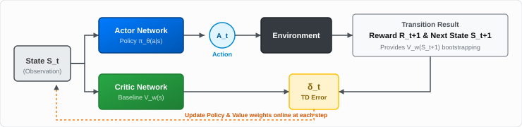

* **The Actor $\pi_{\theta}(a \mid s)$:** Selects actions in the environment (the policy decision maker).
* **The Critic $\hat{v}(s, \mathbf{w})$:** Evaluates state quality using 1-step TD bootstrapping (the update guide).

---

### 2. Update Rules & Algorithm

$$\delta_t = R_{t+1} + \gamma \hat{v}(S_{t+1}, \mathbf{w}) - \hat{v}(S_t, \mathbf{w})$$
$$\mathbf{w} \leftarrow \mathbf{w} + \beta \delta_t \nabla_{\mathbf{w}} \hat{v}(S_t, \mathbf{w}) \quad \text{(Critic Value Update)}$$
$$\theta \leftarrow \theta + \alpha I \delta_t \nabla_{\theta} \ln \pi_{\theta}(A_t \mid S_t) \quad \text{(Actor Policy Update, where } I = \gamma^t\text{)}$$

$$
\begin{array}{l}
\textbf{Algorithm: One-Step Actor-Critic (Episodic Online)} \\
\hline
\textbf{Initialize:} \text{ state } S_0, \text{ policy weights } \theta \in \mathbb{R}^d, \text{ value weights } \mathbf{w} \in \mathbb{R}^k, \text{ step sizes } \alpha > 0, \beta > 0 \\
\textbf{Loop forever (for each episode):} \\
\quad \text{Initialize state } S \\
\quad I \leftarrow 1.0 \\
\quad \textbf{Loop while } S \text{ is not terminal:} \\
\qquad \text{Sample action } A \sim \pi_{\theta}(\cdot \mid S) \\
\qquad \text{Execute } A, \text{ observe reward } R, \text{ next state } S' \\
\qquad \delta \leftarrow R + \gamma \hat{v}(S', \mathbf{w}) - \hat{v}(S, \mathbf{w}) \quad \text{(if } S' \text{ is terminal, } \hat{v}(S', \mathbf{w}) \doteq 0\text{)} \\
\qquad \mathbf{w} \leftarrow \mathbf{w} + \beta \delta \nabla_{\mathbf{w}} \hat{v}(S, \mathbf{w}) \\
\qquad \theta \leftarrow \theta + \alpha I \delta \nabla_{\theta} \ln \pi_{\theta}(A \mid S) \\
\qquad I \leftarrow \gamma I \\
\qquad S \leftarrow S'
\end{array}
$$

* **Advantage:** Learns **online step-by-step** without waiting for episode termination; handles continuing tasks.
* **Bottleneck:** High Critic Bias early in training if initial value predictions $\hat{v}(s, \mathbf{w})$ are noisy.

---

# Sheet 7: Advantage Actor-Critic (A2C) & Parallel Rollouts

### 1. The Three Core Pillars of A2C

1. **Multi-Step Lookahead (GAE):** Replaces 1-step TD with multi-step rollouts to trade off bias and variance.
2. **Synchronous Parallel Workers ($N$):** Runs $N$ independent environments in parallel to break data correlation.
3. **Batched GPU Matrix Passes:** Aggregates $N \times T$ transitions to execute efficient GPU optimization.

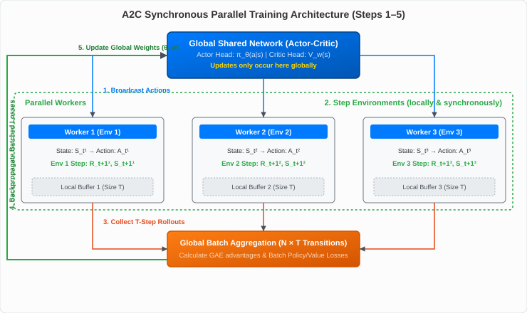

---

### 2. Spatial Parallelization ($N$) vs. Temporal Horizon ($T$)

| Aspect | Spatial Workers ($N$) | Temporal Horizon ($T$) / GAE ($\lambda$) |
| :--- | :--- | :--- |
| **Dimension** | Multiple parallel environment instances | Sequential timesteps along one trajectory stream |
| **Role** | Decorrelates training data & increases throughput | Controls Bias-Variance trade-off of advantage targets |
| **Aggregation Rule** | Gradients averaged across workers: $\nabla J = \frac{1}{N} \sum_{i=1}^N \nabla J^{(i)}$ | TD errors exponentially summed: $\hat{A}_t = \sum_{l=0}^{T-t-1} (\gamma\lambda)^l \delta_{t+l}$ |

> **Key Rule of Parallel Execution:** Workers do not maintain independent neural networks. There is only **one central set of master weights ($\theta, \mathbf{w}$)**. Workers serve as parallel data engines. Worker 1's advantage is computed strictly from Worker 1's trajectory.

---

# Sheet 8: Generalized Advantage Estimation (GAE) & Bias-Variance

### 1. Mathematical Definition
Let the 1-step TD errors along a rollout trajectory be:
$$\delta_t^V = R_{t+1} + \gamma V(S_{t+1}) - V(S_t)$$

Generalized Advantage Estimation $\text{GAE}(\gamma, \lambda)$ is the exponentially weighted sum:
$$A_t^{\text{GAE}(\gamma, \lambda)} = \sum_{l=0}^{\infty} (\gamma \lambda)^l \delta_{t+l}^V = \delta_t^V + (\gamma \lambda) \delta_{t+1}^V + (\gamma \lambda)^2 \delta_{t+2}^V + \dots$$

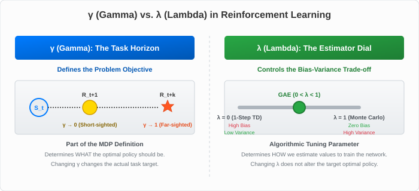

---

### 2. Numerical Example: GAE Calculation Across a 3-Step Trajectory
* Trajectory: $S_0 \xrightarrow{R_1=2} S_1 \xrightarrow{R_2=1} S_2 \xrightarrow{R_3=5} S_3 \text{ (Terminal)}$.
* Critic Values: $V(S_0)=4, V(S_1)=6, V(S_2)=5, V(S_3)=0$.
* Hyperparameters: $\gamma = 0.9, \lambda = 0.8 \implies \gamma\lambda = 0.72$.

1. **Compute 1-step TD Errors:**
   $$\delta_0^V = R_1 + \gamma V(S_1) - V(S_0) = 2 + 0.9(6) - 4 = 2 + 5.4 - 4 = +3.4$$
   $$\delta_1^V = R_2 + \gamma V(S_2) - V(S_1) = 1 + 0.9(5) - 6 = 1 + 4.5 - 6 = -0.5$$
   $$\delta_2^V = R_3 + \gamma V(S_3) - V(S_2) = 5 + 0.9(0) - 5 = 5 + 0 - 5 = 0.0$$

2. **Compute GAE Advantage $A_0^{\text{GAE}}$:**
   $$A_0^{\text{GAE}} = \delta_0^V + (\gamma\lambda)\delta_1^V + (\gamma\lambda)^2\delta_2^V = 3.4 + 0.72(-0.5) + (0.72)^2(0) = 3.4 - 0.36 = \mathbf{+3.04}$$

* **Comparison:**
  * **Monte Carlo Advantage:** $G_0 = 2 + 0.9(1) + (0.9)^2(5) = 6.95 \implies A_0^{MC} = 6.95 - 4 = \mathbf{+2.95}$
  * **1-Step TD Advantage:** $\delta_0^V = \mathbf{+3.40}$
  * *GAE ($+3.04$) smoothly balances between TD ($+3.40$) and MC ($+2.95$).*

---

# Sheet 9: Policy Gradients for Continuing Tasks (Average Reward)

### 1. Why Discounting Breaks in Continuing Tasks
In continuing tasks running indefinitely ($T \to \infty$), setting $\gamma=1$ leads to infinite returns $\sum R_t \to \infty$. Conversely, applying discounting $\gamma < 1$ creates an objective mismatch: it focuses all capacity on the start state $S_0$, ignoring the long-term stationary distribution $d_\pi(s)$ where the agent spends $99.99\%$ of its lifetime.

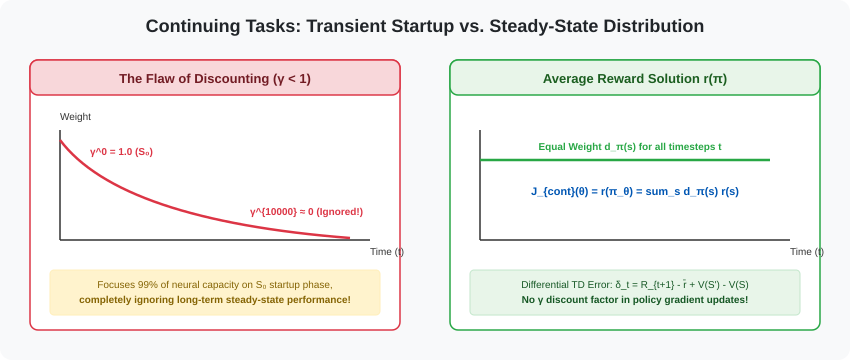

---

### 2. The Average Reward Formulation $r(\pi)$

$$J_{\text{continuing}}(\theta) \doteq r(\pi_{\theta}) = \lim_{h \to \infty} \frac{1}{h} \sum_{t=1}^h \mathbb{E}[R_t \mid S_0, A_{0:t-1} \sim \pi_{\theta}] = \sum_{s \in \mathcal{S}} d_{\pi}(s) \sum_{a \in \mathcal{A}} \pi_{\theta}(a \mid s) \sum_{s', r} p(s', r \mid s, a) r$$

* **Differential Value Function:** $v_{\pi}(s) = \mathbb{E}_{\pi} \left[ \sum_{k=t+1}^{\infty} (R_k - r(\pi)) \mid S_t = s \right]$
* **Differential TD Error:** $\delta_t = R_{t+1} - \bar{R}_t + \hat{v}(S_{t+1}, \mathbf{w}) - \hat{v}(S_t, \mathbf{w})$
  *(where average reward rate $\bar{R}$ is updated via $\bar{R} \leftarrow \bar{R} + \eta \delta_t$)*
* **Policy Gradient Theorem for Continuing Problems:**
  $$\nabla_{\theta} J_{\text{continuing}}(\theta) = \mathbb{E}_{\pi} \Big[ q_{\pi}(S_t, A_t) \nabla_{\theta} \ln \pi_{\theta}(A_t \mid S_t) \Big] \quad \text{(No } \gamma^t \text{ discount factor!)}$$

---

# Sheet 10: Multi-Algorithm 3-State MDP Solved Case Study

### 1. The 3-State MDP & The "Bad Luck" Trajectory
* **State $S_0$ Choices:**
  * **Action $a_1$ (Optimal, Expected Return $= +5.4$):** Transitions to $S_1$ ($R=0$). From $S_1$, $80\%$ chance of Goal ($R=+10$), $20\%$ chance of Trap ($R=-10$).
  * **Action $a_2$ (Suboptimal, Expected Return $= +2.0$):** Transitions to Terminal ($R=+2$).
* **The "Bad Luck" Episode:** Agent selects optimal action $a_1$, but hits the $20\%$ trap fluke:
  $$\tau = (S_0, a_1, R_1=0, S_1, a, R_2=-10, S_{\text{terminal}}), \quad \gamma = 0.9$$
* **Critic Baseline Values:** $V(S_0) = +5.0, \quad V(S_1) = +6.0, \quad V(S_{\text{term}}) = 0$.

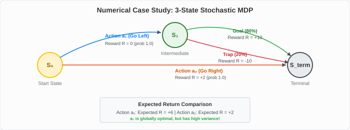

---

### 2. Multi-Algorithm Update Response at Step $S_0$

| Algorithm | Advantage Target Calculation | Action $a_1$ Probability Update | Assessment & Credit Assignment |
| :--- | :--- | :--- | :--- |
| **1. REINFORCE** | $G_0 = 0 + 0.9(-10) = -9.0$ | **DECREASES** (Penalized by $-9.0\alpha$) | Blindly penalizes optimal action due to Monte Carlo trap variance. |
| **2. REINFORCE w/ Baseline** | $A_0 = G_0 - V(S_0) = -9 - 5 = -14.0$ | **DECREASES** (Penalized by $-14.0\alpha$) | Severe penalty because observed return ($-9$) was far below baseline ($+5$). |
| **3. One-Step Actor-Critic** | $\delta_0 = 0 + 0.9(6) - 5 = \mathbf{+0.4}$ | **INCREASES** (Reinforced by $+0.4\alpha$!) | **Correct Credit Assignment!** Recognizes $S_1$ is good on average; isolates trap to step 2. |
| **4. A2C (GAE $\lambda=0.95$)** | $A_0^{\text{GAE}} = 0.4 + 0.855(-16) = -13.28$ | **DECREASES** (Weighted near MC) | High $\lambda$ introduces trajectory variance to eliminate critic bias. |
| **5. PPO** | Clipped surrogate $\min(r A, \text{clip} \cdot A)$ | **BUFFERED / BOUNDED** | Bounded update ensures high variance advantage cannot crash the policy. |

---

# Sheet 11: The Step Size Problem & Advantage Estimation Summary

### 1. The Two Fatal Bottlenecks of Policy Gradients
1. **Destructive Policy Collapse:** Updates scaled directly by advantages $\theta \leftarrow \theta + \alpha A_t \nabla \ln \pi$ can take excessively large steps. This completely alters state visitation $d_\pi(s)$, causing policy entropy to collapse and performance to plummet irreversibly.
2. **Sample Inefficiency (Batch Reject Cycle):** Advantages $A^{\pi_{\text{old}}}(s,a)$ are intrinsically dependent on the collecting policy. After a single gradient step, advantages become obsolete. Reusing the batch violates on-policy expectations and causes divergence.

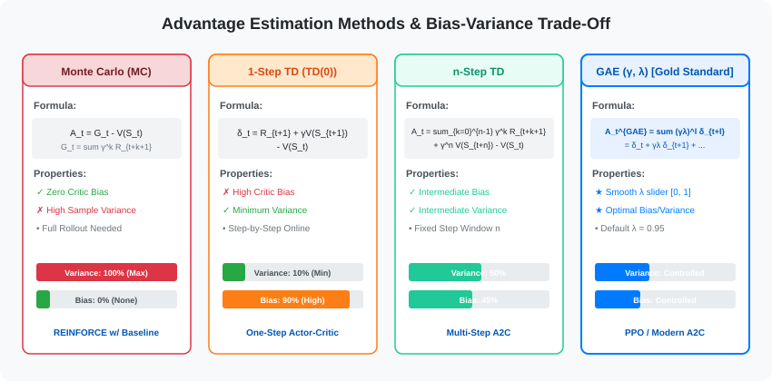

---

### 2. Four Advantage Estimators Summary

| Estimator | Target Formula | Advantage Expression ($A_t$) | Bias | Variance |
| :--- | :--- | :--- | :--- | :--- |
| **Monte Carlo** | $G_t = \sum_{k=0}^{\infty} \gamma^k R_{t+k+1}$ | $A_t^{MC} = G_t - V(S_t)$ | Zero | Extremely High |
| **1-Step TD** | $R_{t+1} + \gamma V(S_{t+1})$ | $A_t^{TD(0)} = R_{t+1} + \gamma V(S_{t+1}) - V(S_t)$ | High | Extremely Low |
| **$n$-Step TD** | $\sum_{k=0}^{n-1} \gamma^k R_{t+k+1} + \gamma^n V(S_{t+n})$ | $A_t^{(n)} = \text{Target} - V(S_t)$ | Moderate | Moderate |
| **GAE ($\lambda$)** | $A_t^{\text{GAE}} + V(S_t)$ | $A_t^{\text{GAE}} = \sum_{l=0}^{\infty} (\gamma\lambda)^l \delta_{t+l}^V$ | Tunable | Tunable |

---

# Sheet 12: The Probability Ratio & Importance Sampling

### 1. The Probability Ratio $r_t(\theta)$
To enable multiple epochs of gradient descent on the same batch of rollout data, we define the **Importance Sampling Ratio**:

$$r_t(\theta) = \frac{\pi_{\theta}(a_t \mid s_t)}{\pi_{\theta_{\text{old}}}(a_t \mid s_t)}$$

* $\pi_{\theta_{\text{old}}}$: Frozen policy that originally collected the rollout batch.
* $\pi_{\theta}$: Current active policy being optimized over multiple mini-batch epochs.
* **Initial State:** At epoch 0, $\theta = \theta_{\text{old}} \implies r_t(\theta) = 1.0$.

---

### 2. Conservative Policy Iteration (CPI) Objective

$$L^{CPI}(\theta) = \hat{\mathbb{E}}_t \left[ r_t(\theta) \hat{A}_t \right] = \hat{\mathbb{E}}_t \left[ \frac{\pi_{\theta}(a_t \mid s_t)}{\pi_{\theta_{\text{old}}}(a_t \mid s_t)} \hat{A}_t \right]$$

#### Gradient Equivalence at $\theta = \theta_{\text{old}}$:
$$\nabla_{\theta} L^{CPI}(\theta) \Big|_{\theta=\theta_{\text{old}}} = \hat{\mathbb{E}}_t \left[ \frac{\nabla_{\theta} \pi_{\theta}(a_t \mid s_t)}{\pi_{\theta_{\text{old}}}(a_t \mid s_t)} \hat{A}_t \right] \Big|_{\theta=\theta_{\text{old}}} = \hat{\mathbb{E}}_t \left[ \frac{\nabla_{\theta} \pi_{\theta}(a_t \mid s_t)}{\pi_{\theta}(a_t \mid s_t)} \hat{A}_t \right] = \hat{\mathbb{E}}_t \Big[ \nabla_{\theta} \ln \pi_{\theta}(a_t \mid s_t) \hat{A}_t \Big] = \nabla_{\theta} L^{PG}(\theta)$$

> [!NOTE]
> **Why not use $\ln r_t(\theta)$?**  
> If we took $\ln r_t(\theta) = \ln \pi_\theta(a \mid s) - \ln \pi_{\theta_{\text{old}}}(a \mid s)$, taking the gradient $\nabla_\theta$ causes $\ln \pi_{\theta_{\text{old}}}$ to vanish (derivative $= 0$). That destroys the importance sampling denominator, removing the mathematical correction for subsequent epochs.

---

# Sheet 13: Proximal Policy Optimization (PPO) & Clipped Objective

### 1. The PPO Clipped Surrogate Objective
To prevent $r_t(\theta)$ from deviating excessively from $1.0$, PPO clips the ratio inside a trust region $[1-\epsilon, 1+\epsilon]$ (typically $\epsilon = 0.2$):

$$L^{CLIP}(\theta) = \hat{\mathbb{E}}_t \left[ \min \Big( r_t(\theta) \hat{A}_t, \, \text{clip}(r_t(\theta), 1-\epsilon, 1+\epsilon) \hat{A}_t \Big) \right]$$

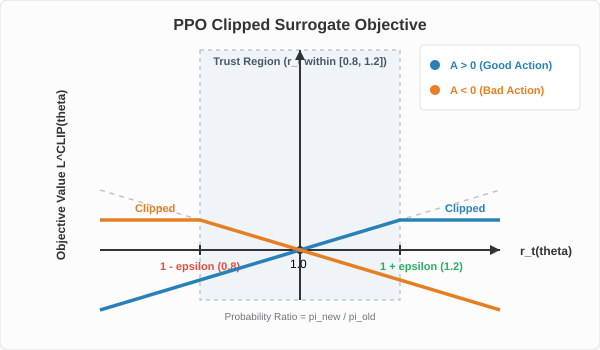

---

### 2. PPO Clipping Decision Table

| Advantage ($\hat{A}_t$) | Probability Ratio ($r_t$) | Unclipped Term ($r_t \hat{A}_t$) | Clipped Term ($\text{clip} \cdot \hat{A}_t$) | Objective Value | Active Gradient? |
| :--- | :--- | :--- | :--- | :--- | :--- |
| **Good Action ($A > 0$)** | $1.0 \le r_t \le 1+\epsilon$ | $1.1 A$ | $1.1 A$ | **$1.1 A$** | **YES** (continue reinforcing) |
| **Good Action ($A > 0$)** | $r_t > 1+\epsilon$ ($> 1.2$) | $1.4 A$ | $1.2 A$ | **$1.2 A$** | **NO** (gradient $= 0$, caps update) |
| **Bad Action ($A < 0$)** | $1-\epsilon \le r_t \le 1.0$ | $0.9 A$ | $0.9 A$ | **$0.9 A$** | **YES** (continue discouraging) |
| **Bad Action ($A < 0$)** | $r_t < 1-\epsilon$ ($< 0.8$) | $0.6 A$ (e.g. $-3.0$) | $0.8 A$ (e.g. $-4.0$) | **$0.8 A$** ($-4.0$) | **NO** (gradient $= 0$, caps update) |

---

# Sheet 14: Deep-Dive: PPO Clipping Mechanics & Asymmetry

### 1. Why is Clipping Asymmetric?
* **Core Question:** Why is the $A > 0$ curve only clipped on the right ($r > 1.2$), while $A < 0$ is only clipped on the left ($r < 0.8$)?
* **Answer:** It is a direct mathematical consequence of the **pessimistic minimum** operator:

$$\begin{aligned}
\textbf{Case 1: Favorable Policy Shift} &\implies \text{Update is Clipped} \\
\bullet \quad A > 0, r > 1.2 &: \min(1.5 A, 1.2 A) = 1.2 A \quad \text{(Capped; prevents greedy over-confidence)} \\
\bullet \quad A < 0, r < 0.8 &: \min(0.5(-10), 0.8(-10)) = \min(-5.0, -8.0) = -8.0 \quad \text{(Capped; prevents over-penalizing)} \\
\\
\textbf{Case 2: Unfavorable Policy Mistake} &\implies \text{Update Remains Unclipped!} \\
\bullet \quad A < 0, r = 1.5 &: \min(1.5(-10), 1.2(-10)) = \min(-15.0, -12.0) = \mathbf{-15.0} \quad \text{(Unclipped!)}
\end{aligned}$$

* **Result:** If the policy accidentally moves in the wrong direction, clipping is bypassed, providing a massive gradient to pull the policy back to safety.

---

# Sheet 15: Shannon Entropy Exploration Bonus & Architecture

### 1. Shannon Entropy from First Principles
Entropy $H(\pi(\cdot \mid s))$ measures policy randomness across discrete action space $\mathcal{A}$:
$$H(\pi(\cdot \mid s)) = -\sum_{a \in \mathcal{A}} \pi(a \mid s) \ln \pi(a \mid s)$$

* **Deterministic Policy ($\pi = [1.0, 0.0]$):** $H = -(1.0 \ln 1.0 + 0) = \mathbf{0.0}$ *(Zero exploration; vulnerable to local optima)*
* **Uniform Policy ($\pi = [0.5, 0.5]$):** $H = -(0.5 \ln 0.5 + 0.5 \ln 0.5) = \ln 2 \approx \mathbf{0.693}$ *(Max exploration)*

---

### 2. Complete Shared Architecture & Joint Loss

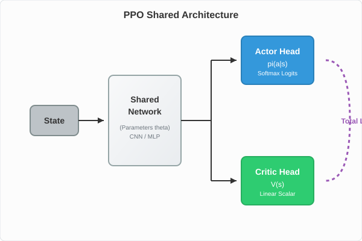

$$L^{\text{TOTAL}}(\theta) = L^{CLIP}(\theta) - c_1 L^{VF}(\theta) + c_2 S[\pi_{\theta}](s)$$

$$\begin{aligned}
L^{CLIP}(\theta) &\leftarrow \text{Clipped Surrogate Actor Objective } [\textbf{MAXIMIZE}] \\
- c_1 L^{VF}(\theta) &\leftarrow \text{Mean Squared Error Value Target Loss } [\textbf{MINIMIZE: } -\text{ sign}] \\
+ c_2 S[\pi_{\theta}](s) &\leftarrow \text{Shannon Entropy Exploration Bonus } [\textbf{MAXIMIZE: } +\text{ sign}]
\end{aligned}$$

---

# Sheet 16: Complete End-to-End PPO Algorithm & PyTorch Code

### 1. Execution Pipeline

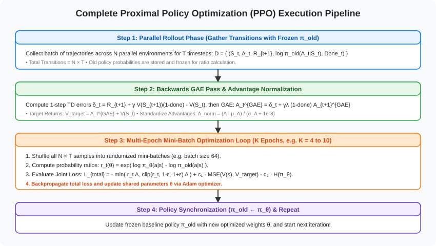

---

### 2. PyTorch Training Step Implementation

```python
import torch
import torch.nn as nn
import torch.optim as optim

class PPOActorCritic(nn.Module):
    """Shared feature extractor with separate policy and value heads."""
    def __init__(self, state_dim, action_dim):
        super().__init__()
        self.actor = nn.Sequential(
            nn.Linear(state_dim, 64), nn.Tanh(),
            nn.Linear(64, 64), nn.Tanh(),
            nn.Linear(64, action_dim), nn.Softmax(dim=-1)
        )
        self.critic = nn.Sequential(
            nn.Linear(state_dim, 64), nn.Tanh(),
            nn.Linear(64, 64), nn.Tanh(),
            nn.Linear(64, 1)
        )
        
    def forward(self, state):
        return self.actor(state), self.critic(state)

def ppo_update_epoch(model, optimizer, states, actions, old_log_probs, 
                     advantages, returns, eps_clip=0.2, c1=0.5, c2=0.01):
    # Normalize advantages to stabilize training variance
    advantages = (advantages - advantages.mean()) / (advantages.std() + 1e-8)
    
    probs, state_values = model(states)
    dist = torch.distributions.Categorical(probs)
    new_log_probs = dist.log_prob(actions)
    entropy = dist.entropy().mean()
    
    # Numerically stable ratio in log-space: r_t = exp(log π_new - log π_old)
    ratios = torch.exp(new_log_probs - old_log_probs)
    
    # Clipped Surrogate Objective
    surr1 = ratios * advantages
    surr2 = torch.clamp(ratios, 1.0 - eps_clip, 1.0 + eps_clip) * advantages
    actor_loss = -torch.min(surr1, surr2).mean()
    
    # Critic Value Function Loss (MSE)
    critic_loss = nn.MSELoss()(state_values.squeeze(-1), returns)
    
    # Total Combined Loss
    total_loss = actor_loss + c1 * critic_loss - c2 * entropy
    
    optimizer.zero_grad()
    total_loss.backward()
    optimizer.step()
```

---

# Sheet 17: Master Summary & Algorithm Comparison Matrix

| Feature / Metric | REINFORCE | REINFORCE w/ Baseline | One-Step Actor-Critic | Advantage Actor-Critic (A2C) | Proximal Policy Optimization (PPO) |
| :--- | :--- | :--- | :--- | :--- | :--- |
| **Pioneering Reference** | Williams (1992) / SB 13.3 | Sutton & Barto 13.4 | Sutton & Barto 13.5 | Mnih et al. (2016) | Schulman et al. (OpenAI 2017) |
| **Critic / Baseline** | None | Learned $\hat{v}(s, \mathbf{w})$ | Learned $\hat{v}(s, \mathbf{w})$ | Learned $\hat{v}(s, \mathbf{w})$ | Learned $\hat{v}(s, \mathbf{w})$ (Shared backbone) |
| **Advantage Target** | Full Return $G_t$ | Baseline Return $G_t - \hat{v}(S_t)$ | 1-Step TD $\delta_t$ | $n$-Step or $\text{GAE}(\gamma, \lambda)$ | $\text{GAE}(\gamma, \lambda)$ Target |
| **Update Frequency** | End of Episode | End of Episode | Online step-by-step | Batched $N \times T$ Rollouts | Multi-Epoch Mini-Batch on $N \times T$ |
| **Data Efficiency** | 1 SGD step per batch | 1 SGD step per batch | 1 update per transition | 1 SGD step per batch | **4–10 SGD Epochs per batch** |
| **Critic Bias** | Zero (Unbiased) | Zero (Unbiased) | High Bias | Low & Controlled (GAE) | Low & Controlled (GAE) |
| **Sample Variance** | Extremely High | High | Very Low | Moderate & Stable | Very Low & Bounded |
| **Stability Guard** | None | Baseline subtraction | Small step size $\alpha$ | Parallel decorrelation | **Clipped Objective $[1-\epsilon, 1+\epsilon]$** |
| **Action Spaces** | Discrete / Continuous | Discrete / Continuous | Discrete / Continuous | Discrete / Continuous | Discrete / Continuous |

---

### Core Formula Reference Card

$$
\begin{array}{l}
\textbf{1. Policy Gradient Theorem:} & \nabla_{\theta} J(\theta) = \mathbb{E}_{\tau \sim \pi_{\theta}} \left[ \sum_{t=0}^{T-1} \nabla_{\theta} \ln \pi_{\theta}(A_t \mid S_t) R(\tau) \right] \\
\textbf{2. Unbiased Baseline:} & \mathbb{E}_{A \sim \pi_{\theta}} \left[ b(S_t) \nabla_{\theta} \ln \pi_{\theta}(A_t \mid S_t) \right] = \mathbf{0} \\
\textbf{3. 1-Step TD Error:} & \delta_t = R_{t+1} + \gamma \hat{v}(S_{t+1}, \mathbf{w}) - \hat{v}(S_t, \mathbf{w}) \\
\textbf{4. GAE Advantage:} & A_t^{\text{GAE}(\gamma, \lambda)} = \sum_{l=0}^{\infty} (\gamma\lambda)^l \delta_{t+l}^V \\
\textbf{5. Probability Ratio:} & r_t(\theta) = \frac{\pi_{\theta}(a_t \mid s_t)}{\pi_{\theta_{\text{old}}}(a_t \mid s_t)} = \exp\Big( \ln\pi_{\theta}(a_t \mid s_t) - \ln\pi_{\theta_{\text{old}}}(a_t \mid s_t) \Big) \\
\textbf{6. PPO Clipped Objective:} & L^{CLIP}(\theta) = \hat{\mathbb{E}}_t \left[ \min\Big( r_t(\theta)\hat{A}_t, \, \text{clip}(r_t(\theta), 1-\epsilon, 1+\epsilon)\hat{A}_t \Big) \right]
\end{array}
$$
