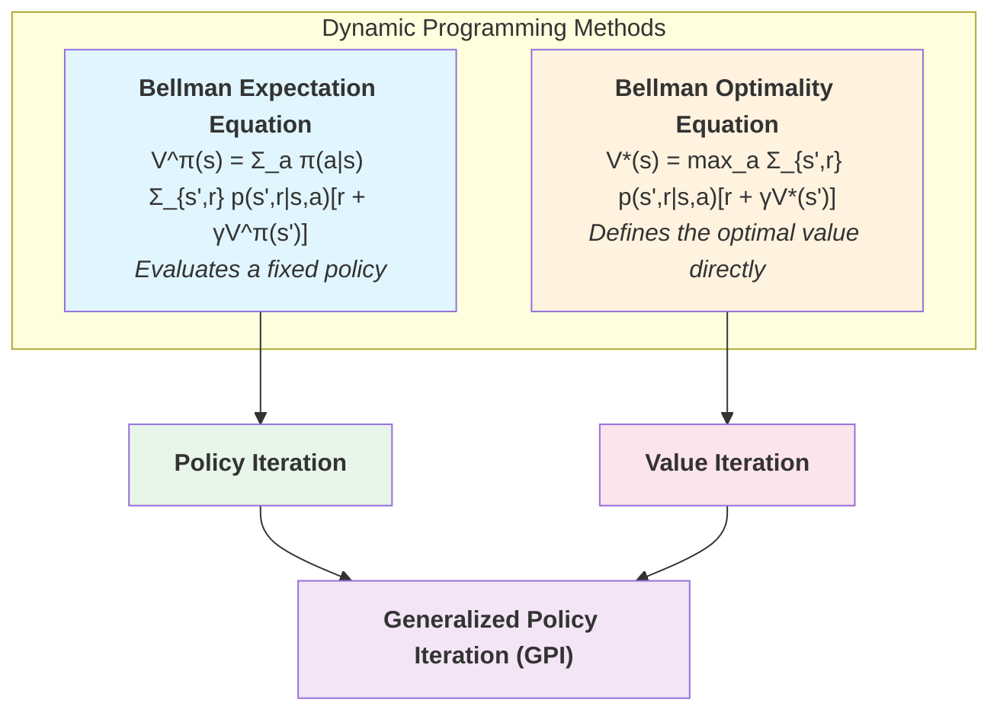
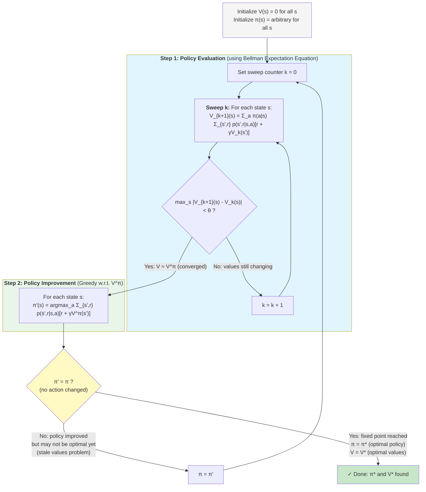
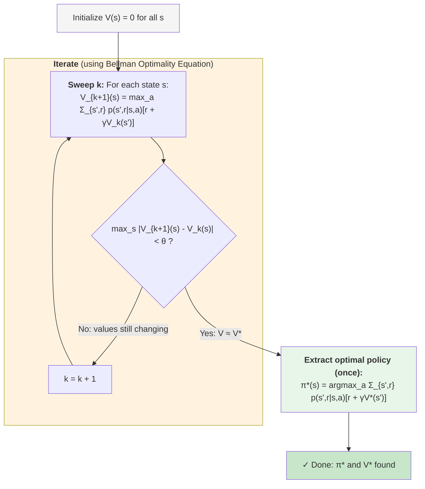
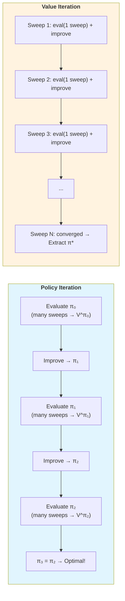
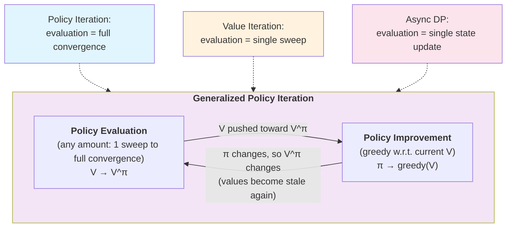
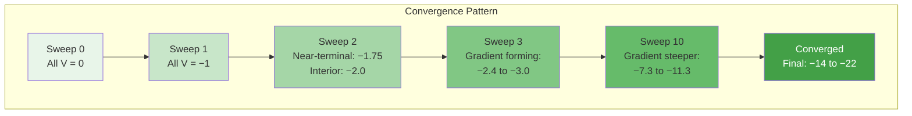

# Quiz 3: Gridworld Value Analysis — Random vs. Optimal Policy

**Course:** Deep Reinforcement Learning (MTech)
**Total Marks:** 1.0 (4 questions x 0.25 marks each)
**Reference:** Sutton & Barto, *Reinforcement Learning: An Introduction*, 2nd ed. (Example 4.1)

---

## Dynamic Programming Overview

### The Big Picture: How DP Methods Relate



---

### Policy Iteration: Full Process



**Key insight:** Policy evaluation runs **many sweeps** to converge $V$ before each improvement step. This makes each improvement well-informed but each iteration expensive.

---

### Value Iteration: Full Process



**Key insight:** Value iteration = **1 sweep of evaluation + improvement combined** per iteration. It directly applies the Bellman **optimality** operator (with max), so no explicit policy is maintained during iteration. The policy is extracted only at the end.

---

### Policy Iteration vs. Value Iteration: Side-by-Side



| Aspect | Policy Iteration | Value Iteration |
|--------|-----------------|-----------------|
| **Equation used** | Bellman Expectation (evaluation) + greedy (improvement) | Bellman Optimality (both at once) |
| **Evaluation sweeps per round** | Many (until convergence) | Exactly 1 |
| **Explicit policy maintained?** | Yes, updated each round | No, extracted at the end |
| **Total outer iterations** | Few (policy converges fast) | Many (values converge slowly) |
| **Total sweeps overall** | Often fewer total sweeps | Often more total sweeps |
| **Best for** | Small-medium state spaces | When full evaluation is too expensive |

---

### Generalized Policy Iteration (GPI)



Policy iteration and value iteration are both **special cases** of GPI — they differ only in **how much evaluation** is done before each improvement:

- **Policy Iteration:** Full evaluation (many sweeps until $V \approx V^\pi$)
- **Value Iteration:** Minimal evaluation (1 sweep)
- **Async DP:** Even less (update a single state, then improve)

All GPI methods converge to $V^*$ and $\pi^*$ because evaluation and improvement keep pushing toward each other — evaluation makes $V$ accurate for the current $\pi$, and improvement makes $\pi$ greedy for the current $V$. When both stabilize, optimality is reached.

> **Terminology note:** GPI stands for **Generalized** Policy Iteration, not "General Policy Iteration." It is **not** a specific algorithm or flowchart — it is an **umbrella concept** describing any DP method that interleaves evaluation and improvement in any proportion. The word "Generalized" means it **generalizes over** all possible combinations of evaluation and improvement. Policy Iteration, Value Iteration, and Async DP are all concrete algorithms that fall under the GPI umbrella. You can even invent your own GPI variant (e.g., "do 3 sweeps of evaluation, then improve") and it will converge — GPI guarantees this as long as both processes keep running.
>
> | Method | How much evaluation before improvement? | GPI? |
> |--------|----------------------------------------|------|
> | **Policy Iteration** | Full convergence (many sweeps until $\Delta < \theta$) | Yes — the "most evaluation" extreme |
> | **Value Iteration** | Exactly 1 sweep | Yes — the "least evaluation with full state coverage" extreme |
> | **Async DP** | 1 single state update | Yes — the "least evaluation" extreme |
> | **Custom: 5 sweeps then improve** | 5 sweeps | Yes — a middle ground |
> | **Any mix** | Any amount > 0 | Yes — all are GPI |
>
> **Why does GPI always converge?** The two processes act as opposing forces that drive toward a shared fixed point:
> - Evaluation says: *"Your values are wrong for this policy, let me fix them"* → pushes $V$ toward $V^\pi$
> - Improvement says: *"Given these values, your policy is suboptimal, let me fix it"* → pushes $\pi$ toward $\text{greedy}(V)$
>
> Each process invalidates the other (improving $\pi$ makes $V$ stale; updating $V$ may reveal better actions). But the key insight is that both processes push in the **same direction** — toward $V^*$ and $\pi^*$. The only state where neither process wants to change anything is the optimal fixed point where $V = V^*$ and $\pi = \pi^*$.
>
> This is directly tested in **Quiz 2, Q6** — option (b) states "GPI requires that policy evaluation be run to convergence before each improvement step," which is **FALSE**. That describes only Policy Iteration, not GPI in general.

---

### The Curse of Dimensionality: Why DP Becomes Intractable (Quiz 2, Q7)

#### What Does "n State Variables Each Taking k Values" Mean?

In real-world problems, the state is not a single number — it is described by **multiple variables** (features/dimensions). Each variable can take a range of values. The total state space is the **Cartesian product** of all variable ranges.

$$|\mathcal{S}| = k^n \quad \text{(total states = values per variable}^{\text{number of variables)}}$$

#### Example 1: Robot in a Warehouse

Suppose a robot's state has $n = 4$ variables, each taking $k = 10$ values:

| Variable | Possible values | Count |
|----------|----------------|-------|
| x-position | 1, 2, ..., 10 | 10 |
| y-position | 1, 2, ..., 10 | 10 |
| Battery level | 1, 2, ..., 10 | 10 |
| Carrying item? | 0, 1, 2, ..., 9 (item types) | 10 |

A single state is a tuple like: (x=3, y=7, battery=5, item=2)

Total states = $10^4 = 10{,}000$

The robot has $m = 6$ actions: up, down, left, right, pick, place.

#### Example 2: Our 4×4 Gridworld

| Representation | Variables | Values per variable | Total states |
|---------------|-----------|-------------------|-------------|
| Single index | $n = 1$ | $k = 16$ (cell 0–15) | $16^1 = 16$ |
| Row + Column | $n = 2$ | $k = 4$ (0–3 each) | $4^2 = 16$ |

Same 16 states either way.

#### Example 3: How It Explodes

| Scenario | $n$ | $k$ | States ($k^n$) | Actions ($m$) |
|----------|-----|------|---------------|---------------|
| 4×4 gridworld | 2 | 4 | 16 | 4 |
| 10×10 grid with battery | 3 | 10 | 1,000 | 4 |
| Robot arm (6 joints, 100 angles each) | 6 | 100 | $10^{12}$ (1 trillion) | 6 |
| Go board (19×19, 3 states per cell) | 361 | 3 | $3^{361} \approx 10^{172}$ | ~361 |

#### Why Value Iteration Costs $O(k^n \cdot m \cdot k^n)$ Per Sweep

One sweep of value iteration does:

```
For each state s:                          ← k^n states
    For each action a:                     ← m actions
        For each possible next state s':   ← k^n next states
            sum += p(s', r | s, a) × [r + γ × V(s')]
        V_new(s) = max over actions of these sums
```

**Step-by-step cost for the warehouse robot ($k=10, n=4, m=6$):**

| Loop level | Count | What it does |
|-----------|-------|-------------|
| Outer: each state $s$ | $10^4 = 10{,}000$ | Visit every possible (x, y, battery, item) |
| Middle: each action $a$ | $6$ | Try up, down, left, right, pick, place |
| Inner: each next state $s'$ | $10^4 = 10{,}000$ | Look up $p(s'|s,a)$ and $V(s')$ |

Total operations per sweep = $10{,}000 \times 6 \times 10{,}000 = 600{,}000{,}000$ (600 million)

For the robot arm: $10^{12} \times 6 \times 10^{12} = 6 \times 10^{24}$ — completely impossible.

#### Why the Inner Loop Over All $k^n$ Next States?

This is the part that surprises most people. Why do we sum over **all** possible next states?

Because the transition model $p(s'|s,a)$ is a **probability distribution over all states**. In the general case, taking action $a$ in state $s$ could land you in **any** next state with some probability.

**In the gridworld** this seems wasteful — moving "right" from (1,1) always goes to (1,2), so only 1 next state matters. But DP handles the **general** case:

| Environment | Next states per (s, a) | Why |
|-------------|----------------------|-----|
| Deterministic gridworld | 1 | Action always leads to same cell |
| Stochastic gridworld (slippery ice) | 4 | Intended direction 70%, each other direction 10% |
| Warehouse robot | Many | Battery might drain randomly, item might slip, bumps might push robot |
| General MDP | Up to $k^n$ | Any transition is possible in theory |

The Bellman equation requires summing over **all** $s'$:

$$V(s) = \max_a \sum_{\mathbf{all}\ s'} \sum_r p(s',r|s,a)\left[r + \gamma\, V(s')\right]$$

Even if most $p(s'|s,a) = 0$, the algorithm doesn't know which ones are zero without checking. In the **worst case**, every next state has nonzero probability, giving $O(k^n)$ per action per state.

#### Practical Consequence: Why We Need Approximation

| State space size | Feasibility of exact DP |
|-----------------|------------------------|
| $< 10^6$ | Feasible on a modern computer |
| $10^6$ to $10^9$ | Feasible with sparse transitions (skip zero-probability next states) |
| $> 10^9$ | **Intractable** — need function approximation (neural networks, etc.) |

This is precisely why **deep** RL exists — methods like DQN, policy gradient, and actor-critic replace the exact value table with a neural network that **approximates** $V(s)$ or $Q(s,a)$, avoiding the need to enumerate all states.

---

### ε-Soft Policies, ε-Greedy, and Entropy (Quiz 2, Q10)

#### What Is an ε-Soft Policy?

An **ε-soft** policy is any policy that assigns at least $\varepsilon / |\mathcal{A}|$ probability to **every** action in every state. The "soft" means "no hard zeros" — every action always has some chance of being selected.

$$\pi(a|s) \geq \frac{\varepsilon}{|\mathcal{A}|} \quad \text{for all actions } a \text{ and all states } s$$

For example, with 4 actions and $\varepsilon = 0.2$, every action must get at least $0.2 / 4 = 5\%$ probability.

#### ε-Greedy Is One Specific ε-Soft Policy

An ε-greedy policy is the **most greedy** policy you can make while still being ε-soft. It puts the minimum required probability on non-best actions and dumps everything else on the best action:

- Best action gets: $1 - \varepsilon + \varepsilon/|\mathcal{A}|$
- Every other action gets: $\varepsilon / |\mathcal{A}|$ (the minimum allowed)

But there are many other ε-soft policies. Here's a comparison (4 actions, $\varepsilon = 0.2$):

| Policy | Action 1 | Action 2 | Action 3 | Action 4 | ε-soft? | Description |
|--------|----------|----------|----------|----------|---------|-------------|
| ε-greedy (action 1 is best) | 85% | 5% | 5% | 5% | **Yes** — min is 5% = ε/4 | As greedy as allowed |
| Spread out | 30% | 25% | 25% | 20% | **Yes** — min is 20% > 5% | More exploratory |
| Fully uniform | 25% | 25% | 25% | 25% | **Yes** — min is 25% > 5% | Maximum exploration |
| Deterministic | 100% | 0% | 0% | 0% | **No** — has 0% < 5% | Fully greedy, not soft |
| Nearly greedy | 95% | 3% | 1% | 1% | **No** — has 1% < 5% | Below minimum |

#### Why On-Policy MC Control Is Optimal Only Among ε-Soft Policies

On-policy MC control **uses the same ε-greedy policy for both acting and learning**. The agent must keep exploring (giving $\geq \varepsilon/|\mathcal{A}|$ to every action) to ensure all state-action pairs are visited. This exploration is baked into the policy — it cannot be removed.

This means the learned policy is handicapped. Consider state (0,1) in our gridworld, one step left of terminal (0,0):

| Policy type | What happens | Expected value |
|-------------|-------------|---------------|
| **Optimal (fully greedy)** | Go Left 100% → reach terminal in 1 step | $-1$ |
| **ε-greedy (ε=0.2)** | Go Left 85%, but 15% of the time wander away | Worse than $-1$ |

The ε-greedy policy **can never** assign 100% to Left. It's forced to waste 5% on each of the three wrong directions. So it can never achieve the truly optimal value.

**What it CAN do** is find the best policy **within the ε-soft class** — i.e., given the constraint that you must always explore at least this much, what's the best you can do? That's what on-policy MC control converges to.

**Analogy:** It's like finding the fastest runner wearing a 5kg backpack. The winner is the best among backpack-wearers, but not the fastest runner overall. The ε-exploration is the backpack — a handicap that on-policy methods cannot remove.

**How to get the truly optimal policy?** Use **off-policy** methods (e.g., off-policy MC control, Q-learning). These use a separate exploratory behavior policy $b$ (with the backpack) to collect data, while learning a target policy $\pi$ (without the backpack) that can be fully greedy.

#### What Is Entropy? (And Why Option (d) Is Wrong)

**Entropy** measures how spread out (random) a probability distribution is:

$$H(\pi) = -\sum_a \pi(a|s) \log \pi(a|s)$$

| Policy (4 actions) | Probabilities | Entropy | Interpretation |
|-------------------|---------------|---------|---------------|
| Deterministic | 100%, 0%, 0%, 0% | 0 (minimum) | No randomness — fully certain |
| ε-greedy (ε=0.2) | 85%, 5%, 5%, 5% | 0.61 | Mostly certain, little randomness |
| Slightly spread | 40%, 30%, 20%, 10% | 1.28 | Moderate randomness |
| Fully uniform | 25%, 25%, 25%, 25% | 1.39 (maximum) | Maximum randomness |

**Why "entropy above a threshold" ≠ "ε-soft":**

These are two different constraints. Entropy measures the **overall spread**, while ε-soft constrains the **minimum per action**. They can disagree:

| Policy | Probabilities | Entropy | ε-soft (ε=0.2)? | Why they disagree |
|--------|---------------|---------|-----------------|-------------------|
| High entropy but not ε-soft | 50%, 50%, 0%, 0% | 1.0 (high) | **No** — has zeros | Spread across 2 actions, but ignores 2 others |
| Low entropy but ε-soft | 85%, 5%, 5%, 5% | 0.61 (low) | **Yes** — min is 5% | Concentrated on 1 action, but no zeros |
| High entropy and ε-soft | 25%, 25%, 25%, 25% | 1.39 (max) | **Yes** — min is 25% | Both criteria satisfied |

A policy can have high entropy by spreading probability over **some** actions while assigning zero to others — this is not ε-soft. Conversely, a policy can have low entropy by being very focused on one action while giving a tiny (but nonzero) amount to every action — this IS ε-soft.

Option (d) in Quiz 2 Q10 says "all stochastic policies with entropy above a threshold." This is wrong because:
1. High entropy doesn't guarantee every action gets nonzero probability
2. On-policy MC control's constraint is about **minimum per-action probability** (ε-soft), not overall spread (entropy)
3. The convergence guarantee specifically relies on every action being tried at every state, which ε-soft guarantees but entropy doesn't

---

### Why Exploration Is Essential in MC Control (Quiz 2, Q11)

#### The Problem: MC Can Only Improve What It Has Seen

MC control works by:
1. Run an episode using the current policy
2. For each (state, action) pair visited in the episode, update $Q(s,a)$ using the observed return
3. Improve the policy: at each state, pick the action with the highest $Q(s,a)$
4. Repeat

The critical issue: **if a (state, action) pair is never visited, its Q-value is never updated.** It stays at its initial value (usually 0), and the policy may be wrong at that state forever.

#### Concrete Example: Getting Stuck Without Exploration

Imagine state $s$ has 4 actions. Early on, the agent tries Left and gets reward +5. The greedy policy now always picks Left, so the other actions are **never tried**:

| Action | $Q(s, a)$ | Times visited | True value (unknown to agent) |
|--------|-----------|---------------|-------------------------------|
| Left | +5 | 12 | +5 |
| Right | 0 (initial) | 0 | **+100** ← much better! |
| Up | 0 (initial) | 0 | +2 |
| Down | 0 (initial) | 0 | −3 |

The greedy policy picks Left (highest Q = +5) forever. Right's Q stays at 0 because it's never tried. The agent **never discovers** that Right gives +100.

This is the **exploration-exploitation dilemma**:
- **Exploitation:** pick the best known action (Left at +5) → safe but possibly suboptimal
- **Exploration:** try unknown actions (Right, Up, Down) → risky but might discover something better

Without forced exploration, MC control gets **trapped** at the first decent action it finds.

#### Solution 1: Exploring Starts

Every episode begins at a **randomly chosen** (state, action) pair. This forces every pair to be a starting point eventually:

| Episode | Forced start | What happens |
|---------|-------------|-------------|
| 1 | $(s, \text{Left})$ | Observe return from Left, update $Q(s, L)$ |
| 2 | $(s, \text{Right})$ | Observe return from Right, update $Q(s, R)$ → discovers +100! |
| 3 | $(s', \text{Up})$ | Different state explored |
| 4 | $(s, \text{Down})$ | Observe return from Down, update $Q(s, D)$ |
| ... | random | Eventually all pairs are covered |

After enough episodes:

| Action | $Q(s, a)$ | Times visited | Agent now knows |
|--------|-----------|---------------|-----------------|
| Left | +5.1 | 250 | Good, but not the best |
| Right | +99.7 | 248 | **Best action!** |
| Up | +1.8 | 251 | Mediocre |
| Down | −3.2 | 251 | Bad |

Policy switches to Right. Problem solved.

**Limitation:** Exploring starts assumes you can start an episode from any (state, action) pair. In practice, this is often impossible — you can't tell a self-driving car "start in the middle of an intersection going backwards," or tell a robot "start with your arm in this exact position holding this exact object."

#### Solution 2: ε-Soft Policy

Instead of being 100% greedy, always give every action at least $\varepsilon / |\mathcal{A}|$ probability:

| Action | Greedy policy (gets stuck) | ε-greedy policy (explores) |
|--------|---------------------------|---------------------------|
| Left (best so far) | 100% → always chosen | 85% → usually chosen |
| Right (untried) | **0% → never tried!** | 5% → occasionally tried |
| Up (untried) | **0% → never tried!** | 5% → occasionally tried |
| Down (untried) | **0% → never tried!** | 5% → occasionally tried |

Now every action gets tried occasionally. Even though Right is only chosen 5% of the time, over thousands of episodes it will be tried hundreds of times. The agent will discover that Right gives +100 and shift the ε-greedy distribution to favor Right:

| Action | Updated ε-greedy |
|--------|-----------------|
| Right (now known best) | 85% |
| Left | 5% |
| Up | 5% |
| Down | 5% |

#### Why "Infinitely Often" Matters

The mathematical condition is that every (state, action) pair must be visited **infinitely often** in the limit. One visit isn't enough because MC estimates are averages — they need many samples to converge:

| Visits to $(s, \text{Right})$ | $Q$ estimate | True value | Error |
|-------------------------------|-------------|------------|-------|
| 1 | +120 (got lucky) | +100 | 20% off |
| 10 | +95 | +100 | 5% off |
| 100 | +99.3 | +100 | 0.7% off |
| 1000 | +100.1 | +100 | 0.1% off |
| $\infty$ | +100 (converged) | +100 | 0% |

This is the **law of large numbers** — averages converge to the true expected value as the number of samples grows. Without infinite visits, Q-values are noisy estimates, and the policy may be wrong due to noise rather than true inferiority.

#### What Happens With vs. Without Exploration: Full Comparison

| Aspect | No exploration (greedy) | Exploring starts | ε-soft policy |
|--------|------------------------|-----------------|---------------|
| Visits all (s, a) pairs? | **No** — only visits what the greedy policy selects | **Yes** — forced random starts | **Yes** — every action has nonzero probability |
| Can get stuck? | **Yes** — locks onto first decent action | No | No |
| Converges to optimal? | **No** — only among visited pairs | Yes (among all policies) | Yes (among ε-soft policies only) |
| Practical? | Easy but broken | Often impossible (can't choose start states) | Easy and practical |
| Used in practice? | Rarely alone | Theoretical mainly | **Very common** |

#### Why Each Wrong Answer in Q11 Is Wrong

**(a) "To ensure the value function converges faster"** — Wrong. Exploration actually makes convergence **slower**, not faster. Every time the agent explores a bad action, it "wastes" an episode that could have been spent refining the good action's estimate. Exploration is about **correctness** (converging to the right answer), not **speed** (converging quickly).

**(c) "To reduce the variance of return estimates"** — Wrong. Exploration doesn't reduce variance — if anything, it increases variance by sampling different actions with different returns. What reduces variance is **more visits to the same (state, action) pair**, which is a consequence of running more episodes, not of exploration itself.

**(d) "To ensure that episodes terminate in finite time"** — Wrong. Episode termination is a property of the **environment** (reaching a terminal state), not the **policy**. A greedy policy terminates just as well as an exploratory one — the environment determines when episodes end, not how the agent explores.

---

### On-Policy vs Off-Policy MC and Importance Sampling (Quiz 2, Q12 & Q13)

#### On-Policy vs Off-Policy: The Core Difference

In **on-policy**, the same policy does both jobs — exploring and learning. In **off-policy**, two separate policies divide the work:

| | On-policy MC | Off-policy MC |
|--|-------------|---------------|
| **Who explores?** | Policy π (the one we're improving) | Behavior policy $b$ (a separate, exploratory policy) |
| **Who do we learn about?** | Same policy π | Target policy π (a separate, greedy policy) |
| **Example** | You learn to cook by trying random recipes yourself | You watch a YouTube chef ($b$), but figure out what YOU would do differently (π) |
| **Exploration constraint** | π must be ε-soft (forced to explore) | Only $b$ needs to explore; π can be fully greedy |
| **Optimality** | Best among ε-soft policies only (Q10) | Can learn the truly optimal policy |

#### Why Off-Policy Exists

Recall from Q10 and Q11: on-policy MC forces the learning policy π to explore (ε-soft). This means π can never be fully greedy, so it's only optimal among ε-soft policies — not globally optimal.

Off-policy solves this by using **two separate policies**:

- **Behavior policy $b$**: ε-greedy, random, or any exploratory policy — its job is to collect data by trying lots of different actions
- **Target policy π**: fully deterministic and greedy — the policy we actually want to learn and deploy

The agent **acts** using $b$ (explores freely) but **updates** Q-values as if π were acting. This way π can be fully optimal without ever needing to explore itself.

#### The Problem: The Data Doesn't Match the Target Policy

Here's the catch. The episodes were generated by $b$, not π. The data is **biased** — actions that $b$ likes are over-represented, and actions that $b$ avoids are under-represented.

**Example:** Suppose at some state, $b$ goes Left 80% and Right 20%, but π would go Left 30% and Right 70%.

| Action | $b$ takes it | π would take it | Mismatch |
|--------|-------------|-----------------|----------|
| Left | 80% | 30% | Over-represented in data |
| Right | 20% | 70% | Under-represented in data |

If we naively average the returns from $b$'s episodes, we'd over-weight Left outcomes and under-weight Right outcomes — giving us $b$'s values, not π's values.

We need to **correct** for this mismatch. That's what **importance sampling** does.

#### Importance Sampling: Correcting the Bias

The idea is simple: weight each episode's return by how much more (or less) likely it was under π compared to $b$.

For a trajectory from time $t$ to terminal time $T$:

$$\rho_{t:T-1} = \prod_{k=t}^{T-1} \frac{\pi(A_k|S_k)}{b(A_k|S_k)}$$

At each step, we ask: "How much more likely would π have chosen this action compared to $b$?" Then we multiply all these ratios together.

**Step-by-step example:** 3-step episode, 2 actions (Left/Right)

| Step | Action taken by $b$ | $b$'s probability | π's probability | Step ratio |
|------|--------------------|--------------------|-----------------|-----------|
| 0 | Left | 0.5 | 0.9 | 0.9 / 0.5 = **1.8** |
| 1 | Right | 0.5 | 0.1 | 0.1 / 0.5 = **0.2** |
| 2 | Left | 0.5 | 0.9 | 0.9 / 0.5 = **1.8** |

$$\rho = 1.8 \times 0.2 \times 1.8 = 0.648$$

**Interpretation:** This trajectory is 64.8% as likely under π as under $b$. So we scale this episode's return by 0.648 — it counts for less because π wouldn't have taken these exact actions as often.

Another example — trajectory that π strongly favors:

| Step | Action taken | $b$'s prob | π's prob | Ratio |
|------|-------------|-----------|---------|-------|
| 0 | Right | 0.2 | 0.9 | 4.5 |
| 1 | Right | 0.2 | 0.9 | 4.5 |

$$\rho = 4.5 \times 4.5 = 20.25$$

This trajectory counts **20× more** because π would have taken these actions much more often than $b$ did.

#### Ordinary Importance Sampling

The simplest approach: average the **weighted returns**:

$$V(s) = \frac{1}{N} \sum_{i=1}^{N} \rho_i \cdot G_i$$

where $N$ = number of episodes starting from $s$, $\rho_i$ = importance ratio for episode $i$, $G_i$ = return from episode $i$.

**Properties:**
- **Unbiased** — on average, it gives the correct answer: $\mathbb{E}[\rho \cdot G] = V^\pi(s)$
- **High variance** — individual estimates can be wildly off

#### Why Ordinary IS Has High Variance (Quiz 2, Q12 Answer)

The ratio $\rho$ is a **product** over all steps. Products can explode or collapse:

| Scenario | Per-step ratios | Product $\rho$ | What happens |
|----------|----------------|----------------|-------------|
| Policies mostly agree | 1.1, 0.9, 1.0, 1.1 | ≈ 1.1 | Fine — small correction |
| One big disagreement | 1.1, 0.9, **10.0**, 1.1 | ≈ 10.9 | This episode counts 10× — dominates the average |
| Long episode, small disagreements | 1.5 × 20 steps | $1.5^{20} \approx 3{,}325$ | One episode counts 3,325× — completely dominates! |
| π would never take that action | 1.1, 0.9, **0.0**, 1.1 | 0 | Entire episode thrown away — wasted data |

**Numerical example showing the variance problem:**

Suppose we have 5 episodes from state $s$:

| Episode | Return $G_i$ | Ratio $\rho_i$ | Weighted $\rho_i \cdot G_i$ |
|---------|-------------|----------------|---------------------------|
| 1 | +10 | 1.2 | +12 |
| 2 | +8 | 0.8 | +6.4 |
| 3 | +12 | **3{,}325** | **+39{,}900** |
| 4 | +9 | 1.5 | +13.5 |
| 5 | +11 | 0.3 | +3.3 |

$$V(s) = \frac{12 + 6.4 + 39{,}900 + 13.5 + 3.3}{5} = \frac{39{,}935.2}{5} = 7{,}987$$

The true value might be around +10, but episode 3's enormous weight ($\rho = 3{,}325$) makes the estimate 7,987. One episode completely ruined the average. That's extreme variance.

#### Weighted Importance Sampling (Quiz 2, Q13 Answer) — Detailed Explanation

The key difference between ordinary and weighted IS is **what you divide by**.

**Ordinary IS:** divide by the **number of episodes** ($N$)

$$V(s) = \frac{\rho_1 G_1 + \rho_2 G_2 + \cdots + \rho_N G_N}{N}$$

**Weighted IS:** divide by the **sum of the weights** ($\sum \rho_i$)

$$V(s) = \frac{\rho_1 G_1 + \rho_2 G_2 + \cdots + \rho_N G_N}{\rho_1 + \rho_2 + \cdots + \rho_N}$$

**Why this matters — worked example with 3 episodes:**

| Episode | Return $G$ | Weight $\rho$ | Weighted return $\rho \cdot G$ |
|---------|-----------|--------------|-------------------------------|
| 1 | +10 | 1.0 | 10 |
| 2 | +8 | 1.0 | 8 |
| 3 | +12 | **1000** | **12,000** |

Episode 3 has $\rho = 1000$ because $b$ took a very unlikely path that π would strongly prefer.

**Ordinary IS:**

$$V = \frac{10 + 8 + 12{,}000}{3} = 4{,}006$$

Dividing by 3 (number of episodes). Episode 3 completely dominates. The estimate is wildly off from the true value (~10).

**Weighted IS:**

$$V = \frac{10 + 8 + 12{,}000}{1.0 + 1.0 + 1000} = \frac{12{,}018}{1002} \approx 12.0$$

Dividing by the sum of weights (1002). Episode 3 has high weight, but the denominator **scales with it**. It can't blow up the average.

**Same calculation with the 5-episode example from earlier:**

| Episode | Return $G_i$ | Ratio $\rho_i$ | Weighted $\rho_i \cdot G_i$ |
|---------|-------------|----------------|---------------------------|
| 1 | +10 | 1.2 | +12 |
| 2 | +8 | 0.8 | +6.4 |
| 3 | +12 | 3,325 | +39,900 |
| 4 | +9 | 1.5 | +13.5 |
| 5 | +11 | 0.3 | +3.3 |

Ordinary IS: $\frac{39{,}935.2}{5} = 7{,}987$ — wildly off

Weighted IS: $\frac{39{,}935.2}{1.2 + 0.8 + 3{,}325 + 1.5 + 0.3} = \frac{39{,}935.2}{3{,}328.8} \approx 12.0$ — reasonable

**Analogy: House price voting**

Three people estimate the value of a house. Each person has a "credibility weight":
- Person 1 (weight 1): "It's worth ₹100k"
- Person 2 (weight 1): "It's worth ₹80k"
- Person 3 (weight 1000): "It's worth ₹120k"

**Ordinary IS** = give each person one vote, but multiply their answer by their weight:

$$\frac{1 \times 100k + 1 \times 80k + 1000 \times 120k}{3} = 40{,}060k$$

Absurd — Person 3's weight makes the average meaningless.

**Weighted IS** = give each person votes **proportional** to their weight:

$$\frac{1 \times 100k + 1 \times 80k + 1000 \times 120k}{1 + 1 + 1000} = \frac{120{,}180k}{1002} \approx 120k$$

Person 3 has more influence (1000 votes vs 1), but their influence is **proportional**, not overwhelming. The result stays in a reasonable range.

#### Why Weighted IS Is Biased (But That's OK)

With just **1 episode**, weighted IS always gives:

$$V = \frac{\rho_1 \cdot G_1}{\rho_1} = G_1$$

The $\rho$ cancels out completely! You just get the raw return, as if no importance correction happened at all. That's **biased** — you're treating $b$'s experience as if it were π's experience.

With **2 episodes** where $\rho$ values differ, the cancellation is only partial — some correction happens, but it's imperfect. Still biased, but less so.

With **many episodes**, the different $\rho$ values create a proper weighted distribution, and the estimate converges to the correct value. The bias **shrinks to zero** as $N \to \infty$.

| Number of episodes | Ordinary IS | Weighted IS |
|-------------------|-------------|-------------|
| 1 | Correct on average (unbiased) but could be 4,006 or 0.001 — wildly unstable | Always returns $G_1$ — biased but stable |
| 10 | Still high variance from occasional extreme $\rho$ | Low variance, small bias remaining |
| 100 | Variance still a problem with long episodes | Bias nearly gone, variance low |
| $\infty$ | Correct | Correct |

#### Comparison Summary

| | Ordinary IS | Weighted IS |
|--|-------------|-------------|
| **Formula** | $\frac{1}{N}\sum \rho_i G_i$ (divide by count) | $\frac{\sum \rho_i G_i}{\sum \rho_i}$ (divide by sum of weights) |
| **Bias** | **Unbiased** | **Biased** (but bias → 0 as $N \to \infty$) |
| **Variance** | **High** (can be infinite) | **Low** (weights are normalized) |
| **One extreme $\rho$** | Destroys the estimate | Gets normalized away |
| **With 1 episode** | $\rho \cdot G$ — could be anything | $G$ — ignores correction entirely |
| **Preferred in practice?** | Rarely | **Almost always** |

The trade-off: weighted IS introduces a small bias (it's not perfectly accurate with few samples), but the bias shrinks to zero as more episodes are collected, and the variance is dramatically lower. In practice, **weighted IS is almost always preferred** because a tiny temporary bias is a far smaller problem than estimates that swing between 0 and 7,987.

#### Summary: The Full Picture of MC Methods

```
MC Methods
├── On-Policy MC
│   ├── Uses same policy for acting and learning
│   ├── Policy must be ε-soft (explore)
│   ├── Optimal among ε-soft policies only (Q10)
│   └── Needs exploring starts or ε-soft for coverage (Q11)
│
└── Off-Policy MC
    ├── Behavior policy b (explores) ≠ Target policy π (greedy)
    ├── Can learn truly optimal policy
    ├── Needs importance sampling to correct data mismatch
    ├── Ordinary IS: unbiased but high variance (Q12)
    ├── Weighted IS: low variance but slightly biased (Q13)
    └── Coverage assumption: π(a|s) > 0 ⟹ b(a|s) > 0 (Q14)
```

---

### Convergence of V: How Values Evolve in the 4×4 Gridworld

The following shows how $V(s)$ converges during **policy evaluation** of the random policy ($\gamma = 1$, $r = -1$):

**Sweep 0 (initialization):**

| | Col 0 | Col 1 | Col 2 | Col 3 |
|-------|-------|-------|-------|-------|
| **Row 0** | 0 (T) | 0 | 0 | 0 |
| **Row 1** | 0 | 0 | 0 | 0 |
| **Row 2** | 0 | 0 | 0 | 0 |
| **Row 3** | 0 | 0 | 0 | 0 (T) |

**Sweep 1:** Each non-terminal state gets $V(s) = -1 + 0.25 \times [\text{sum of neighbors' old values}] = -1$

| | Col 0 | Col 1 | Col 2 | Col 3 |
|-------|-------|-------|-------|-------|
| **Row 0** | 0 (T) | −1.0 | −1.0 | −1.0 |
| **Row 1** | −1.0 | −1.0 | −1.0 | −1.0 |
| **Row 2** | −1.0 | −1.0 | −1.0 | −1.0 |
| **Row 3** | −1.0 | −1.0 | −1.0 | 0 (T) |

**Sweep 2:** States near terminals see some 0-valued neighbors; interior states see all −1 neighbors.

| | Col 0 | Col 1 | Col 2 | Col 3 |
|-------|-------|-------|-------|-------|
| **Row 0** | 0 (T) | −1.75 | −2.0 | −2.0 |
| **Row 1** | −1.75 | −2.0 | −2.0 | −2.0 |
| **Row 2** | −2.0 | −2.0 | −2.0 | −1.75 |
| **Row 3** | −2.0 | −2.0 | −1.75 | 0 (T) |

**Sweep 3:**

| | Col 0 | Col 1 | Col 2 | Col 3 |
|-------|-------|-------|-------|-------|
| **Row 0** | 0 (T) | −2.4 | −2.9 | −3.0 |
| **Row 1** | −2.4 | −2.9 | −3.0 | −2.9 |
| **Row 2** | −2.9 | −3.0 | −2.9 | −2.4 |
| **Row 3** | −3.0 | −2.9 | −2.4 | 0 (T) |

**Sweep 10:**

| | Col 0 | Col 1 | Col 2 | Col 3 |
|-------|-------|-------|-------|-------|
| **Row 0** | 0 (T) | −7.3 | −10.2 | −11.3 |
| **Row 1** | −7.3 | −9.6 | −10.6 | −10.4 |
| **Row 2** | −10.2 | −10.6 | −9.6 | −7.3 |
| **Row 3** | −11.3 | −10.4 | −7.3 | 0 (T) |

**Converged (sweep ∞):**

| | Col 0 | Col 1 | Col 2 | Col 3 |
|-------|-------|-------|-------|-------|
| **Row 0** | 0 (T) | −14 | −20 | −22 |
| **Row 1** | −14 | −18 | −20 | −20 |
| **Row 2** | −20 | −20 | −18 | −14 |
| **Row 3** | −22 | −20 | −14 | 0 (T) |



**What to observe:**
1. **Information propagates outward from terminals** — cells near (0,0) and (3,3) get useful information first
2. **Each sweep, information travels one cell further** — sweep $k$ can only "see" terminals up to $k$ steps away
3. **Center cells converge last** — they are farthest from both terminals, so it takes the most sweeps for terminal information to reach them
4. **Values are always monotonically decreasing** — each sweep makes values more negative (or keeps them the same) because we're accumulating more $-1$ costs
5. **The grid is symmetric** about the main diagonal — because the two terminals are at opposite corners and the random policy is symmetric

---

## Gridworld Setup (Common to Both Questions)

Consider a $4 \times 4$ gridworld with **two terminal states** at diagonally opposite corners — top-left $(0,0)$ and bottom-right $(3,3)$. The agent can move up, down, left, or right. Moves that would take the agent off the grid leave the state unchanged. Every transition yields a reward of $-1$ and the discount factor is $\gamma = 1$.

```
 T  .  .  .
 .  .  .  .
 .  .  .  .
 .  .  .  T
```

---

## Questions

**Q1.** Under the **equiprobable random policy** (each action chosen with probability $0.25$), policy evaluation is run to convergence. Which non-terminal cells will have the **most negative** state values?

(a) The corner cells $(0,3)$ and $(3,0)$, because they are farthest from terminal states by Manhattan distance
(b) The center cells $(1,1)$, $(1,2)$, $(2,1)$, $(2,2)$, because a random walk starting there takes the most expected steps to reach any terminal
(c) The cells adjacent to terminal states, because they receive $-1$ reward most frequently
(d) All non-terminal cells have the same value since the policy treats all actions equally

---

**Q2.** Now suppose we run **policy improvement** and obtain the optimal (greedy) policy, where the agent always moves toward the nearest terminal state. Under this optimal policy, which non-terminal cells will have the **most negative** state values?

(a) The center cells $(1,1)$, $(1,2)$, $(2,1)$, $(2,2)$, because they are in the middle of the grid
(b) The cells along the anti-diagonal — $(0,3)$, $(3,0)$, $(1,2)$, $(2,1)$ — because they are equidistant from both terminal states and have the largest minimum Manhattan distance of $3$
(c) The corner cells $(0,3)$ and $(3,0)$ only, because corners have fewer movement options
(d) The cells adjacent to terminal states, because every step incurs a $-1$ reward

---

**Q3.** The **policy improvement theorem** states that if $q_\pi(s, \pi'(s)) \geq v_\pi(s)$ for all states $s$, then $v_{\pi'}(s) \geq v_\pi(s)$ for all states. The greedy policy $\pi'(s) = \arg\max_a q_\pi(s,a)$ satisfies this condition. **Why** does proving that $\pi'$ is better at a single action (one step) guarantee it is better over the entire trajectory (all future steps)?

(a) Because the discount factor $\gamma < 1$ makes future steps negligible, so only the first step matters
(b) Because $\pi'$ is defined greedily **at every state simultaneously**, so the one-step improvement argument applies at each subsequent state in the chain, and unrolling these inequalities across all future steps proves $v_{\pi'}(s) \geq v_\pi(s)$
(c) Because after one step of improvement, the agent switches back to $\pi$, so only the first step needs to be better
(d) Because the policy improvement theorem requires running $\pi'$ to completion and comparing total returns with $\pi$

---

**Q4.** The policy improvement theorem guarantees that $v_{\pi'}(s) \geq v_\pi(s)$ for all states — meaning $\pi'$ is at least as good as $\pi$ everywhere. Since $\pi'$ is better at every state, **why does this NOT guarantee that $\pi'$ is the optimal policy?** Why do we need to repeat evaluation and improvement in a loop (policy iteration)?

(a) Because $\pi'$ only improves the first action; subsequent actions still follow $\pi$
(b) Because the discount factor $\gamma$ causes the improvement to decay over time
(c) Because $\pi'$ was constructed greedily using $v_\pi$ (the old policy's values), and once we switch to $\pi'$, the state values change — actions that looked best under $v_\pi$ may no longer be best under $v_{\pi'}$
(d) Because the policy improvement theorem is only an approximation and does not guarantee exact improvement

---

## Answer Key

| Q  | Answer |
|----|--------|
| 1  | (b)    |
| 2  | (b)    |
| 3  | (b)    |
| 4  | (c)    |

---

## Detailed Working

### Key Principle

With $\gamma = 1$ and $r = -1$ for every step, the value of any state equals:

$$V(s) = -\mathbb{E}[\text{number of steps to reach a terminal state from } s]$$

The more steps the agent takes on average, the more negative the value.

---

### Q1: Random Policy — Detailed Working

Under the equiprobable random policy, the agent moves up, down, left, or right each with probability $0.25$. This is essentially a **random walk** on the grid.

**Bellman equation for each state:**

$$V(s) = \sum_{a \in \{U,D,L,R\}} 0.25 \times [-1 + V(s')]$$

$$V(s) = -1 + 0.25 \times [V(s'_U) + V(s'_D) + V(s'_L) + V(s'_R)]$$

where $s'_a$ is the next state after taking action $a$ (or $s$ itself if the move hits a wall).

**Example: Solving for state $(0,1)$**

Actions from $(0,1)$:
- Up → hits wall, stays at $(0,1)$
- Down → goes to $(1,1)$
- Left → goes to $(0,0)$ which is terminal, $V = 0$
- Right → goes to $(0,2)$

$$V(0,1) = -1 + 0.25 \times [V(0,1) + V(1,1) + 0 + V(0,2)]$$

**Example: Solving for state $(1,1)$ (center-adjacent)**

Actions from $(1,1)$:
- Up → $(0,1)$
- Down → $(2,1)$
- Left → $(1,0)$
- Right → $(1,2)$

$$V(1,1) = -1 + 0.25 \times [V(0,1) + V(2,1) + V(1,0) + V(1,2)]$$

This creates a system of 14 simultaneous linear equations (14 non-terminal states). Solving this system (via iterative policy evaluation or direct matrix solution) yields the converged values:

**Converged value table under the random policy:**

| | Col 0 | Col 1 | Col 2 | Col 3 |
|-------|-------|-------|-------|-------|
| **Row 0** | **0** (T) | −14 | −20 | −22 |
| **Row 1** | −14 | −18 | −20 | −20 |
| **Row 2** | −20 | −20 | −18 | −14 |
| **Row 3** | −22 | −20 | −14 | **0** (T) |

**Verification of $(0,1)$:**

$$V(0,1) = -1 + 0.25 \times [V(0,1) + V(1,1) + V(0,0) + V(0,2)]$$
$$-14 = -1 + 0.25 \times [(-14) + (-18) + 0 + (-20)]$$
$$-14 = -1 + 0.25 \times (-52)$$
$$-14 = -1 + (-13) = -14 \quad \checkmark$$

**Verification of $(1,1)$:**

$$V(1,1) = -1 + 0.25 \times [V(0,1) + V(2,1) + V(1,0) + V(1,2)]$$
$$-18 = -1 + 0.25 \times [(-14) + (-20) + (-14) + (-20)]$$
$$-18 = -1 + 0.25 \times (-68)$$
$$-18 = -1 + (-17) = -18 \quad \checkmark$$

**Observations:**

| Region | Cells | Values | Interpretation |
|--------|-------|--------|---------------|
| Adjacent to terminals | $(0,1)$, $(1,0)$, $(2,3)$, $(3,2)$ | $-14$ | Random walk escapes relatively quickly near an exit |
| Center cells | $(1,1)$, $(1,2)$, $(2,1)$, $(2,2)$ | $-18$ to $-20$ | **Most negative interior values** — random walk gets trapped bouncing around |
| Anti-diagonal corners | $(0,3)$, $(3,0)$ | $-22$ | **Most negative overall** — far from both terminals AND cornered against walls |
| Anti-diagonal mid | $(1,2)$, $(2,1)$ | $-20$ | Also very negative — equidistant from both terminals |

**Why center/anti-diagonal cells are worst:** Under a random walk, the agent has no preference for direction. Center cells are surrounded on all four sides by other non-terminal cells, so the random walk diffuses aimlessly. The wall-bouncing effect at corners and edges actually makes $(0,3)$ and $(3,0)$ even worse — the agent keeps bumping into walls, wasting steps, while being maximally far from both terminals.

---

### Q2: Optimal (Greedy) Policy — Detailed Working

After policy improvement, the agent always picks the action that moves toward the **nearest** terminal state. Under this deterministic optimal policy, the value of each state is simply:

$$V^*(s) = -\min(d_1(s),\ d_2(s))$$

where $d_1(s)$ is the Manhattan distance from $s$ to terminal $(0,0)$ and $d_2(s)$ is the Manhattan distance to terminal $(3,3)$.

**Distance calculation for every cell:**

| Cell | $d_1$ = dist to $(0,0)$ | $d_2$ = dist to $(3,3)$ | $\min(d_1, d_2)$ | $V^*(s)$ |
|------|------------------------|------------------------|-------------------|----------|
| $(0,0)$ | 0 | 6 | 0 | **0** (T) |
| $(0,1)$ | 1 | 5 | 1 | $-1$ |
| $(0,2)$ | 2 | 4 | 2 | $-2$ |
| $(0,3)$ | 3 | 3 | **3** | $\mathbf{-3}$ |
| $(1,0)$ | 1 | 5 | 1 | $-1$ |
| $(1,1)$ | 2 | 4 | 2 | $-2$ |
| $(1,2)$ | 3 | 3 | **3** | $\mathbf{-3}$ |
| $(1,3)$ | 4 | 2 | 2 | $-2$ |
| $(2,0)$ | 2 | 4 | 2 | $-2$ |
| $(2,1)$ | 3 | 3 | **3** | $\mathbf{-3}$ |
| $(2,2)$ | 4 | 2 | 2 | $-2$ |
| $(2,3)$ | 5 | 1 | 1 | $-1$ |
| $(3,0)$ | 3 | 3 | **3** | $\mathbf{-3}$ |
| $(3,1)$ | 4 | 2 | 2 | $-2$ |
| $(3,2)$ | 5 | 1 | 1 | $-1$ |
| $(3,3)$ | 6 | 0 | 0 | **0** (T) |

**Optimal policy value grid:**

| | Col 0 | Col 1 | Col 2 | Col 3 |
|-------|-------|-------|-------|-------|
| **Row 0** | **0** (T) | $-1$ | $-2$ | $\mathbf{-3}$ |
| **Row 1** | $-1$ | $-2$ | $\mathbf{-3}$ | $-2$ |
| **Row 2** | $-2$ | $\mathbf{-3}$ | $-2$ | $-1$ |
| **Row 3** | $\mathbf{-3}$ | $-2$ | $-1$ | **0** (T) |

The most negative value is $-3$, occurring at the **anti-diagonal** cells: $(0,3)$, $(1,2)$, $(2,1)$, $(3,0)$.

**Why these cells are worst:** These four cells are each exactly $3$ steps from **both** terminals — there is no "closer" terminal to exploit. Every other cell has at least one terminal within $1$ or $2$ steps.

**Optimal policy arrows (showing which terminal the agent heads toward):**

```
  T    ←    ←    ↓ or ←
  ↑    ↑/←  ↓/→   ↓
  ↑    ↑/←  ↓/→   ↓
  → or ↑  →    →    T
```

Cells on the anti-diagonal have **tied** distances, so multiple optimal actions exist (both directions are equally good).

---

### Comparison Summary

| Aspect | Random Policy | Optimal Policy |
|--------|--------------|----------------|
| **Most negative cells** | $(0,3)$, $(3,0)$ at $-22$; center at $-18$ to $-20$ | Anti-diagonal at $-3$ |
| **Least negative non-terminal cells** | $(0,1)$, $(1,0)$, $(2,3)$, $(3,2)$ at $-14$ | $(0,1)$, $(1,0)$, $(2,3)$, $(3,2)$ at $-1$ |
| **Value range** | $-14$ to $-22$ (spread of $8$) | $-1$ to $-3$ (spread of $2$) |
| **Why center is bad/not bad** | Random walk gets trapped — no directional bias to escape | Center cells are only $2$ steps from nearest terminal |
| **Why anti-diagonal is worst** | Far from both terminals + wall-bouncing wastes steps | Equidistant from both terminals — no closer exit exists |
| **Key insight** | Movement is undirected → distance from exits + topology matters | Movement is directed → only shortest-path distance matters |

---

### Q3: Why Policy Improvement Works — Detailed Working

#### The Common Misconception

It's easy to misread the policy improvement theorem as: *"try $\pi'$ for one step, follow $\pi$ after that, and if it's better, switch."* This is **not** what happens. The agent fully switches to $\pi'$ at every state. The one-step argument is a **proof technique**, not the algorithm's behavior.

#### Setup

We have a current policy $\pi$ with known values $v_\pi(s)$ and $q_\pi(s,a)$.

We construct a new greedy policy:

$$\pi'(s) = \arg\max_a q_\pi(s, a) \quad \text{for ALL states } s$$

This means $\pi'$ picks the best action (according to $\pi$'s evaluation) **at every state**, not just the starting state.

#### What $q_\pi(s, \pi'(s)) \geq v_\pi(s)$ Really Means

- $v_\pi(s)$: expected return if you follow $\pi$ from state $s$ forever
- $q_\pi(s, \pi'(s))$: expected return if you take $\pi'$'s action **once**, then follow $\pi$ forever

Since $\pi'$ picks the $\arg\max$:

$$q_\pi(s, \pi'(s)) = \max_a q_\pi(s,a) \geq q_\pi(s, \pi(s)) = v_\pi(s)$$

This holds trivially — the best action is at least as good as the action $\pi$ would have chosen.

#### The Chain of Inequalities (The Actual Proof)

Start with the one-step result:

$$v_\pi(s) \leq q_\pi(s, \pi'(s))$$

Expand $q_\pi(s, \pi'(s))$ using the definition of the action-value function:

$$= \mathbb{E}\left[R_{t+1} + \gamma\, v_\pi(S_{t+1}) \mid S_t = s, A_t = \pi'(s)\right]$$

Now, at $S_{t+1}$, we can apply the **same inequality** again because $\pi'$ is greedy at **every state**:

$$v_\pi(S_{t+1}) \leq q_\pi(S_{t+1}, \pi'(S_{t+1}))$$

Substitute this back:

$$v_\pi(s) \leq \mathbb{E}\left[R_{t+1} + \gamma\, q_\pi(S_{t+1}, \pi'(S_{t+1}))\right]$$

Expand $q_\pi(S_{t+1}, \pi'(S_{t+1}))$ again:

$$= \mathbb{E}\left[R_{t+1} + \gamma\, R_{t+2} + \gamma^2\, v_\pi(S_{t+2})\right]$$

Apply the same inequality at $S_{t+2}$, then $S_{t+3}$, and so on:

$$v_\pi(s) \leq \mathbb{E}\left[R_{t+1} + \gamma R_{t+2} + \gamma^2 R_{t+3} + \cdots \mid S_t = s, \pi'\right]$$

$$v_\pi(s) \leq v_{\pi'}(s)$$

#### Why This Works: A Step-by-Step Walkthrough

Consider a simple 3-state chain: $A \to B \to C \to$ terminal.

| Step | What the proof does | Inequality |
|------|-------------------|-----------|
| At $A$ | $\pi'$ picks a better action than $\pi$ at $A$ | $v_\pi(A) \leq q_\pi(A, \pi'(A))$ |
| At $B$ | $\pi'$ picks a better action than $\pi$ at $B$ too | $v_\pi(B) \leq q_\pi(B, \pi'(B))$ |
| At $C$ | $\pi'$ picks a better action than $\pi$ at $C$ too | $v_\pi(C) \leq q_\pi(C, \pi'(C))$ |
| Combined | Better at A + better at B + better at C = better overall | $v_\pi(A) \leq v_{\pi'}(A)$ |

The chain works because $\pi'$ is defined greedily **at every state simultaneously**. If $\pi'$ only improved one state, the chain would break.

#### Why Each Wrong Answer is Wrong

**(a) "Because $\gamma < 1$ makes future steps negligible"** — Wrong. The theorem works even with $\gamma = 1$ (as in our gridworld example). Gamma ensures convergence of policy evaluation, but the improvement theorem relies on the greedy construction, not discounting.

**(c) "After one step, the agent switches back to $\pi$"** — Wrong. This describes $q_\pi(s, \pi'(s))$, which is one term in the proof, not the actual execution. The agent fully commits to $\pi'$.

**(d) "Requires running $\pi'$ to completion"** — Wrong. The whole point of the theorem is that we **don't** need to evaluate $\pi'$. We prove $\pi'$ is better using only $\pi$'s value function, which we already computed.

#### Analogy

Imagine you have a route to work (policy $\pi$). Someone gives you better turn-by-turn directions (policy $\pi'$) — not just a better first turn, but a better choice **at every intersection**. You don't need to drive the entire new route to know it's better. If every single turn is at least as good as your old turn, the whole route must be at least as good. That's the policy improvement theorem.

---

### Q4: Why "Better" Does Not Mean "Optimal" — Detailed Working

#### The Core Issue

The policy improvement theorem proves:

$$v_{\pi'}(s) \geq v_\pi(s) \quad \text{for all } s$$

This is a **relative** guarantee — $\pi'$ is better than $\pi$. It is **not** an absolute guarantee that $\pi'$ is the best possible policy. The reason is subtle but fundamental.

#### The Stale Values Problem

$\pi'$ was constructed by:

$$\pi'(s) = \arg\max_a q_\pi(s, a)$$

The key issue: $q_\pi(s,a)$ answers the question *"take action $a$ at state $s$, then follow $\pi$ forever."* But after we switch to $\pi'$, the agent doesn't follow $\pi$ anymore — it follows $\pi'$. The values $v_\pi$ and $q_\pi$ are **stale** the moment we adopt $\pi'$.

#### Concrete Example: Why One Round Is Not Enough

Consider a 4-state environment with actions Left (L) and Right (R):

```
[Start] --L--> [A] --L--> [Goal +10]
   |                         ^
   +------R--> [B] ---R-----+
```

- From Start: L → A (reward 0), R → B (reward 0)
- From A: L → Goal (reward +10), R → Goal (reward +2)
- From B: L → Goal (reward +3), R → Goal (reward +8)
- $\gamma = 1$

**Round 1: Start with a bad policy $\pi_0$**

$\pi_0$: always go Left at every state.

Policy evaluation gives:
- $v_{\pi_0}(\text{Start}) = 0 + 0 + 10 = 10$ (Start →L→ A →L→ Goal: 0 + 0 + 10)
- $v_{\pi_0}(A) = 10$ (A →L→ Goal: +10)
- $v_{\pi_0}(B) = 3$ (B →L→ Goal: +3)

Now compute $q_{\pi_0}$ to build $\pi_1$:
- $q_{\pi_0}(\text{Start}, L) = 0 + v_{\pi_0}(A) = 10$
- $q_{\pi_0}(\text{Start}, R) = 0 + v_{\pi_0}(B) = 3$
- $q_{\pi_0}(A, L) = 10$, $q_{\pi_0}(A, R) = 2$
- $q_{\pi_0}(B, L) = 3$, $q_{\pi_0}(B, R) = 8$

Greedy policy $\pi_1$:
- At Start: $\arg\max(10, 3) = L$ → go to A
- At A: $\arg\max(10, 2) = L$ → go to Goal (+10)
- At B: $\arg\max(3, 8) = R$ → go to Goal (+8)

$\pi_1$'s path from Start: Start →L→ A →L→ Goal = reward **10**.

**Is $\pi_1$ optimal? Let's check.**

Re-evaluate with $\pi_1$:
- $v_{\pi_1}(A) = 10$ (A →L→ Goal)
- $v_{\pi_1}(B) = 8$ (B →R→ Goal) ← **changed from 3 to 8!**
- $v_{\pi_1}(\text{Start}) = 0 + v_{\pi_1}(A) = 10$

**Round 2: Build $\pi_2$ from $v_{\pi_1}$**

- $q_{\pi_1}(\text{Start}, L) = 0 + v_{\pi_1}(A) = 10$
- $q_{\pi_1}(\text{Start}, R) = 0 + v_{\pi_1}(B) = 8$

$\pi_2$ at Start: $\arg\max(10, 8) = L$ → same as before. No change. $\pi_2 = \pi_1$.

In this case, $\pi_1$ happened to be optimal. But notice what happened:

**The critical insight: $v_{\pi_0}(B) = 3$ was stale.** Under $\pi_0$, $B$'s value was 3 (because $\pi_0$ went Left from B, getting +3). But $\pi_1$ fixed B's action to Right, making $B$'s true value 8. When we re-evaluated, $B$'s value jumped from 3 to 8. If the gap had been larger, it could have **flipped** the decision at Start.

#### A Case Where the Decision Actually Flips

Modify the example slightly:

- From A: L → Goal (reward +5), R → Goal (reward +2)
- From B: L → Goal (reward +1), R → Goal (reward +9)

**Round 1 with $\pi_0$ (always Left):**

Evaluation:
- $v_{\pi_0}(A) = 5$, $v_{\pi_0}(B) = 1$

Build $\pi_1$:
- $q_{\pi_0}(\text{Start}, L) = 0 + 5 = 5$
- $q_{\pi_0}(\text{Start}, R) = 0 + 1 = 1$
- At Start: pick L → go to A ✓
- At A: $\arg\max(5, 2) = L$ ✓
- At B: $\arg\max(1, 9) = R$ ← fixed!

$\pi_1$'s path: Start →L→ A →L→ Goal = reward **5**

**Round 2: Re-evaluate $\pi_1$**

- $v_{\pi_1}(A) = 5$
- $v_{\pi_1}(B) = 9$ ← **jumped from 1 to 9!**

Build $\pi_2$:
- $q_{\pi_1}(\text{Start}, L) = 0 + 5 = 5$
- $q_{\pi_1}(\text{Start}, R) = 0 + 9 = 9$
- At Start: pick R → **go to B now!** ← **DECISION FLIPPED**

$\pi_2$'s path: Start →R→ B →R→ Goal = reward **9** ✓ (optimal)

**What happened:**
1. $\pi_0$ (always Left) scored B as 1 — very low
2. $\pi_1$ fixed B's local action (L→R), but still routed Start through A, because B **looked bad** under the old values
3. Only after re-evaluation revealed B's true value (9) did $\pi_2$ **reroute Start through B**

$\pi_1$ was **better** than $\pi_0$ (it fixed B), but **not optimal** (it still sent Start to A). The stale values from $\pi_0$ made B look worse than it really was under $\pi_1$.

#### Why Policy Iteration Must Loop

| Iteration | What happens | Why needed |
|-----------|-------------|------------|
| Evaluate $\pi_k$ | Compute true values $v_{\pi_k}$ for current policy | The values from the previous round are stale |
| Improve to $\pi_{k+1}$ | Pick greedy actions w.r.t. fresh $v_{\pi_k}$ | Greedy w.r.t. accurate values = better decisions |
| Repeat | Until $\pi_{k+1} = \pi_k$ | Only when no action changes is the policy optimal |

The loop converges because:
1. Each improvement is guaranteed to be at least as good (policy improvement theorem)
2. The number of deterministic policies is finite ($|\mathcal{A}|^{|\mathcal{S}|}$)
3. Strictly improving + finite policies = must terminate at the optimal policy

#### Why Each Wrong Answer for Q4 is Wrong

**(a) "$\pi'$ only improves the first action"** — Wrong. As shown in Q3, $\pi'$ improves actions at **every** state. The issue isn't coverage of states — it's that the values used to pick those actions were computed under $\pi$, not $\pi'$.

**(b) "Discount factor causes improvement to decay"** — Wrong. Gamma has nothing to do with why multiple rounds are needed. Even with $\gamma = 1$, the stale-values problem exists.

**(d) "The theorem is only an approximation"** — Wrong. The policy improvement theorem is exact: $v_{\pi'}(s) \geq v_\pi(s)$ is a rigorous mathematical guarantee, not an approximation. The limitation is that "better" ≠ "best".

#### Analogy

Think of a GPS that re-routes you. Your old route (policy $\pi$) avoids highway B because there used to be construction (low value under $\pi$). The GPS improves your local turns ($\pi'$), including fixing the highway B section. But it still routes you through highway A at the start, because **at the time of planning**, B looked bad. Only after driving the new route and discovering B is now fast (re-evaluation) does the GPS **next time** reroute you through B entirely ($\pi''$). Each re-route is better, but it takes multiple updates to fully propagate the improved information.
