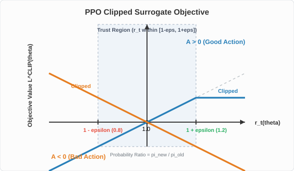
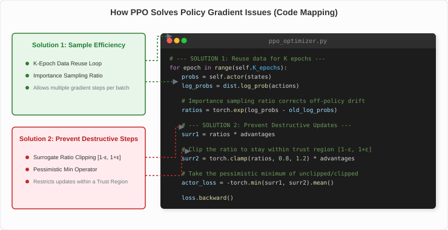
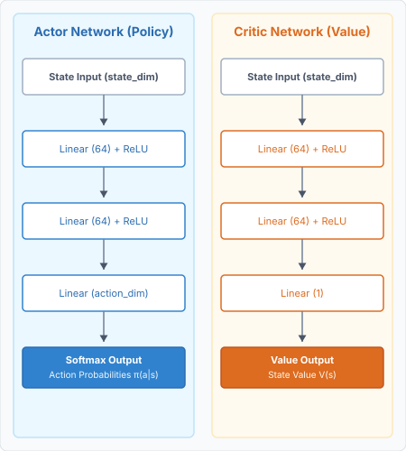
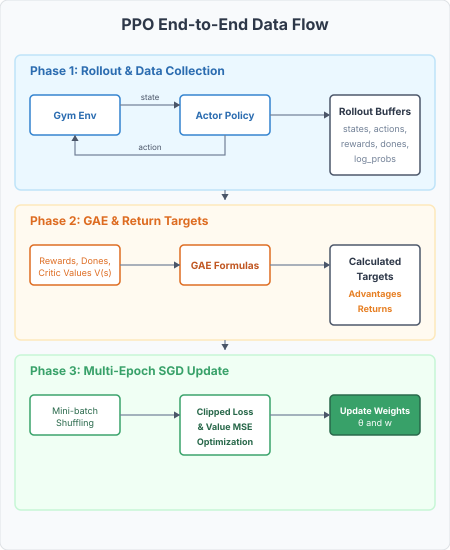

# Lecture 10: Proximal Policy Optimization (PPO)

*Reference: Graesser, L., & Keng, W. L. (2019). Foundations of Deep Reinforcement Learning. Chapters 6 & 7.*
*Reference: Schulman, J., Wolski, F., Dhariwal, P., Radford, A., & Klimov, O. (2017). [Proximal Policy Optimization Algorithms](https://arxiv.org/abs/1707.06347).*

## 1. The Step Size Problem in Policy Gradients

In our previous lecture on Policy Gradients (REINFORCE and Actor-Critic), we learned how to update the policy weights $\theta$ using the Advantage function:
$$ \theta_{t+1} = \theta_t + \alpha A(S_t, A_t) \nabla_{\theta} \ln \pi(A_t \mid S_t, \theta) \tag{Sutton and Barto Eq. 13.8 / Graesser and Keng Ch. 6} $$

To contrast how different policy gradient methods configure their networks, targets, and updates, the following table summarizes REINFORCE, REINFORCE with Baseline, and Actor-Critic (1-Step TD):

| Algorithm | Active Networks | Target | Predicted (Baseline) | TD Error / Advantage ($A_t$) | Update Rules ($\theta$ and $\mathbf{w}$) |
| :--- | :--- | :--- | :--- | :--- | :--- |
| **REINFORCE** | Policy $\pi(a \mid s, \theta)$ | $G_t$ <br> *(Monte Carlo return)* | None | $G_t$ | $\theta \leftarrow \theta + \alpha \gamma^t G_t \nabla_{\theta} \ln \pi(A_t \mid S_t, \theta)$ |
| **REINFORCE with Baseline** | Policy $\pi(a \mid s, \theta)$<br>State-Value $\hat{v}(s, \mathbf{w})$ | $G_t$ <br> *(Monte Carlo return)* | $\hat{v}(S_t, \mathbf{w})$ | $G_t - \hat{v}(S_t, \mathbf{w})$ | $\theta \leftarrow \theta + \alpha \gamma^t (G_t - \hat{v}(S_t, \mathbf{w})) \nabla_{\theta} \ln \pi(A_t \mid S_t, \theta)$<br>$\mathbf{w} \leftarrow \mathbf{w} + \beta (G_t - \hat{v}(S_t, \mathbf{w})) \nabla_{\mathbf{w}} \hat{v}(S_t, \mathbf{w})$ |
| **Actor-Critic (1-Step TD)** | Policy $\pi(a \mid s, \theta)$<br>State-Value $\hat{v}(s, \mathbf{w})$ | $R_{t+1} + \gamma \hat{v}(S_{t+1}, \mathbf{w})$ <br> *(1-step TD bootstrapped)* | $\hat{v}(S_t, \mathbf{w})$ | $R_{t+1} + \gamma \hat{v}(S_{t+1}, \mathbf{w}) - \hat{v}(S_t, \mathbf{w})$ <br> *(TD error $\delta_t$)* | $\theta \leftarrow \theta + \alpha I \delta_t \nabla_{\theta} \ln \pi(A_t \mid S_t, \theta)$ *(where $I = \gamma^t$)*<br>$\mathbf{w} \leftarrow \mathbf{w} + \beta \delta_t \nabla_{\mathbf{w}} \hat{v}(S_t, \mathbf{w})$ |
| **A2C (n-Step or GAE)** | Policy $\pi(a \mid s, \theta)$<br>State-Value $\hat{v}(s, \mathbf{w})$ | $V_{\text{target}}$ <br> *(n-step or GAE value target)* | $\hat{v}(S_t, \mathbf{w})$ | $A_t^{(n)}$ or $A_t^{\text{GAE}}$ <br> *(n-step return / GAE advantage)* | $\theta \leftarrow \theta + \alpha \gamma^t A_t \nabla_{\theta} \ln \pi(A_t \mid S_t, \theta)$<br>$\mathbf{w} \leftarrow \mathbf{w} + \beta (V_{\text{target}} - \hat{v}(S_t, \mathbf{w})) \nabla_{\mathbf{w}} \hat{v}(S_t, \mathbf{w})$ |

### 1.1 Advantage Estimation & Generalized Advantage Estimation (GAE)

In policy gradient algorithms, the **Advantage function** $A(s, a) = Q(s, a) - V(s)$ measures how much better taking action $a$ is compared to the expected performance in state $s$. Using the advantage instead of raw returns significantly reduces gradient variance while maintaining policy unbiasedness.

There are four primary ways to estimate the advantage function:

#### A. Monte Carlo Advantage (REINFORCE with Baseline)
Here, we use the actual discounted returns $G_t$ collected from the rollout:
$$ A_t^{MC} = G_t - V(S_t) $$
where $G_t = \sum_{k=0}^{T-t-1} \gamma^k R_{t+k+1}$ is the cumulative discounted reward.
* **Properties:** Unbiased (since it relies on actual returns), but has extremely high variance because a single trajectory is highly noisy.

#### B. 1-Step Temporal Difference (TD) Advantage (Actor-Critic)
We bootstrap the future returns using the Critic's state-value estimates:
$$ A_t^{TD(0)} = R_{t+1} + \gamma V(S_{t+1}) - V(S_t) $$
Notice that this is exactly the TD error $\delta_t^V$ of the Critic network.
* **Properties:** Very low variance (since it uses a single step and a smooth value function estimate), but has high bias if the Critic's value network is inaccurate.

#### C. $n$-Step TD Advantage
We extend the step count before bootstrapping to trade off bias and variance:
$$ A_t^{(n)} = \sum_{k=0}^{n-1} \gamma^k R_{t+k+1} + \gamma^n V(S_{t+n}) - V(S_t) $$
* **Properties:** By adjusting $n$, we control the balance: smaller $n$ acts like TD(0) (low variance, high bias), while larger $n$ acts like Monte Carlo (high variance, low bias).

#### D. Generalized Advantage Estimation (GAE)
GAE ($\lambda$) takes an exponentially weighted average of all $n$-step advantages. Let the 1-step TD errors at each time step be:
$$ \delta_t^V = R_{t+1} + \gamma V(S_{t+1}) - V(S_t) $$
The GAE advantage at timestep $t$ is defined as:
$$ A_t^{\text{GAE}(\gamma, \lambda)} = \sum_{l=0}^{\infty} (\gamma \lambda)^l \delta_{t+l}^V = \delta_t^V + \gamma \lambda \delta_{t+1}^V + (\gamma \lambda)^2 \delta_{t+2}^V + \dots $$
where $\lambda \in [0, 1]$ is a hyperparameter that controls the exponential decay weight:
* **If $\lambda = 0$:** The summation collapses to $A_t^{\text{GAE}} = \delta_t^V$ (exactly the **1-Step TD Advantage**).
* **If $\lambda = 1$:** The terms expand and simplify to $A_t^{\text{GAE}} = \sum_{l=0}^{\infty} \gamma^l R_{t+l+1} - V(S_t)$ (exactly the **Monte Carlo Advantage**).
* **If $0 < \lambda < 1$:** GAE acts as a slider, providing a robust intermediate advantage estimate that optimizes the bias-variance tradeoff.

---

#### Numerical Example: Advantage Calculations
Let's consider a short trajectory of length $T = 3$ (timesteps $t=0, 1, 2$) inside an environment:
* **Rewards:** $R_1 = 2$, $R_2 = 1$, $R_3 = 5$
* **Critic Estimates:** $V(S_0) = 4$, $V(S_1) = 6$, $V(S_2) = 5$, $V(S_3) = 0$ (terminal state)
* **Hyperparameters:** $\gamma = 0.9$, $\lambda = 0.8$

Let's compute the advantage at timestep $t=0$ using each method:

1. **Monte Carlo Return & Advantage:**
   * Calculate cumulative return $G_0$:
     $$ G_0 = R_1 + \gamma R_2 + \gamma^2 R_3 = 2 + 0.9(1) + 0.9^2(5) = 2 + 0.9 + 4.05 = 6.95 $$
   * MC Advantage:
     $$ A_0^{MC} = G_0 - V(S_0) = 6.95 - 4 = 2.95 $$

2. **1-Step TD Advantage:**
   * Compute TD Error at $t=0$:
     $$ A_0^{TD(0)} = R_1 + \gamma V(S_1) - V(S_0) = 2 + 0.9(6) - 4 = 2 + 5.4 - 4 = 3.4 $$

3. **2-Step TD Advantage:**
   * Compute 2-Step estimate:
     $$ A_0^{(2)} = R_1 + \gamma R_2 + \gamma^2 V(S_2) - V(S_0) = 2 + 0.9(1) + 0.9^2(5) - 4 = 2 + 0.9 + 4.05 - 4 = 2.95 $$

4. **Generalized Advantage Estimation (GAE):**
   * First, calculate individual 1-step TD errors ($\delta_t^V$) for all timesteps:
     $$ \delta_0^V = R_1 + \gamma V(S_1) - V(S_0) = 2 + 0.9(6) - 4 = 3.4 $$
     $$ \delta_1^V = R_2 + \gamma V(S_2) - V(S_1) = 1 + 0.9(5) - 6 = -0.5 $$
     $$ \delta_2^V = R_3 + \gamma V(S_3) - V(S_2) = 5 + 0.9(0) - 5 = 0 $$
   * Compute GAE Advantage $A_0^{\text{GAE}}$:
     $$ A_0^{\text{GAE}} = \delta_0^V + (\gamma\lambda)\delta_1^V + (\gamma\lambda)^2\delta_2^V $$
     $$ \gamma\lambda = 0.9 \times 0.8 = 0.72 $$
     $$ A_0^{\text{GAE}} = 3.4 + 0.72(-0.5) + 0.72^2(0) = 3.4 - 0.36 = 3.04 $$

---

However, standard Policy Gradient methods suffer from two massive problems:
1. **Destructive Updates:** The learning rate $\alpha$ dictates the "step size". In supervised learning, if you take a step that is too large, the loss might temporarily spike, but you can recover on the next batch. In RL, the data you train on is generated by your policy. If a large step size accidentally destroys a good policy, the agent starts acting randomly. It will then generate *terrible data*, causing the network to learn terrible things. The agent falls off a cliff and never recovers.
2. **Sample Inefficiency:** 
     * **The Mathematical Reason:** The policy gradient theorem calculates the expectation over trajectories sampled from the *current* policy $\pi_\theta$:
       $$ \nabla J(\theta) = \mathbb{E}_{\tau \sim \pi_{\theta}} \left[ \sum_{t=0}^{T-1} A(S_t, A_t) \nabla_{\theta} \log \pi_{\theta}(A_t \mid S_t) \right] $$
     * **The Waste Cycle:** Suppose your simulator collects a batch of $10,000$ steps of transitions using policy parameters $\theta_{\text{old}}$. You perform **one single gradient step** to update the parameters to $\theta_{\text{new}}$. Now, the active policy has changed ($\pi_{\theta_{\text{new}}} \neq \pi_{\theta_{\text{old}}}$). 
     * **Why We Discard Data:** If you run a second gradient update on the same $10,000$ transitions, the actions in that data reflect the choice probabilities of $\theta_{\text{old}}$, not the new policy $\theta_{\text{new}}$. The expectation breaks, leading to highly biased, mathematically incorrect gradients. Consequently, in standard policy gradients (like REINFORCE and Actor-Critic), **you must discard the entire batch of data after just one update step** and run the simulator again to collect fresh on-policy transitions.
     * **Contrast with Supervised Learning:** In supervised image classification, you can reuse the same training set over hundreds of epochs (epochs = reusing data). In standard RL, you can only run **one epoch per batch of transitions**, which is extremely slow if environment simulations are computationally expensive.
     * **Contrast with Q-Learning (Off-Policy):** Off-policy value-based methods (like DQN) do not suffer from this because they solve the Bellman equation, which is a consistency condition that holds regardless of which policy collected the transitions. This allows DQN to reuse past data millions of times from a **Replay Buffer**.
      * **The Policy Obsolescence Problem (A2C vs. Classic AC vs. PPO):**
        Why does this "waste cycle" or "reject cycle" happen, and how does it differ across frameworks?
        * **Classic Step-by-Step Actor-Critic (Online):** 
          * **How it works:** Parameters are updated after every single transition $(s_t, a_t, r_{t+1}, s_{t+1})$. The subsequent action $a_{t+1}$ is sampled using the newly updated policy $\theta_{t+1}$.
          * **The Obsolescence/Waste:** There is no *batch* of transitions to discard since updates are immediate. However, each individual transition is used for exactly **one gradient step** before being thrown away. We cannot store transitions in a replay buffer to run multiple gradient updates on them later because the policy is changing at every step; any subsequent updates on those past transitions would be off-policy.
        * **Batch-Mode Actor-Critic (e.g., A2C):** 
          * **How it works:** For neural network efficiency and stability, A2C collects a batch of transitions (e.g., $10,000$ steps across parallel environments) using a frozen policy $\theta_{\text{old}}$. It performs **one single gradient step** to update the parameters to $\theta_{\text{new}}$, and then collects the next batch using $\theta_{\text{new}}$.
          * **The Obsolescence/Waste:** This is where the **Batch Reject Cycle** is in full effect. Once the policy updates to $\theta_{\text{new}}$ after the first optimizer step, the batch of $10,000$ transitions is immediately rendered obsolete. We cannot run multiple epochs of SGD on the same batch of data because the actions in that batch reflect the choice probabilities of $\theta_{\text{old}}$, not the new policy $\theta_{\text{new}}$. Running another gradient step using the standard policy gradient loss:
            $$ \theta \leftarrow \theta + \alpha A_t \nabla_{\theta} \ln \pi_{\theta}(A_t \mid S_t) $$
            assumes on-policy data and would result in highly biased, mathematically incorrect gradients that can cause the policy to diverge.
        * **How PPO Solves It:** 
          PPO is essentially batch-mode Actor-Critic (A2C) with a corrected loss function. It resolves the obsolescence problem using two key mechanisms:
          1. **Importance Sampling Ratio:** It replaces $\ln \pi_{\theta}(a \mid s)$ with the probability ratio $r_t(\theta) = \frac{\pi_{\theta}(a \mid s)}{\pi_{\theta_{\text{old}}}(a \mid s)}$. This ratio mathematically adjusts the gradient step to correct for the fact that the transitions were sampled from the old policy $\theta_{\text{old}}$, turning an off-policy update into a valid on-policy equivalent.
          2. **Clipping:** Because the importance sampling estimator becomes highly unstable if $\theta$ drifts too far from $\theta_{\text{old}}$, PPO clips $r_t(\theta)$ to a safe range (usually $[1-\epsilon, 1+\epsilon]$).
          Together, these allow PPO to run **multiple epochs (typically 4 to 10 SGD passes) on the exact same batch of transitions** before discarding it, solving the batch reject cycle and significantly boosting sample efficiency.

---

## 2. The Probability Ratio

To fix sample inefficiency, we want to update the network *multiple times* (multiple epochs) using the same batch of data. To appreciate how this is done mathematically, let's contrast the traditional policy gradient objective with the new surrogate objective.

### 1. Traditional Policy Gradient Objective
In standard policy gradient methods (like REINFORCE and A2C), the objective function maximized via gradient ascent is:
$$ L^{PG}(\theta) = \hat{\mathbb{E}}_t [ \log \pi_{\theta}(a_t \mid s_t) A_t ] $$

* **The Limitation:** This objective assumes the transitions were sampled directly from the *current* active policy $\pi_\theta$. If we perform a gradient step and change $\theta$, we can no longer run another gradient step on $L^{PG}(\theta)$ using the same data because the expectation is no longer valid.

---

### 2. The Surrogate Objective (with Probability Ratio)
To allow multiple gradient steps on the same batch of data, we define the **Probability Ratio**, $r_t(\theta)$:
$$ r_t(\theta) = \frac{\pi_{\theta}(a_t \mid s_t)}{\pi_{\theta_{\text{old}}}(a_t \mid s_t)} \tag{Graesser and Keng Page 174 / PPO Paper} $$

* $\pi_{\theta_{\text{old}}}$ is the probability of the action when the data was originally gathered (the old frozen policy parameters).
* $\pi_{\theta}$ is the probability of the action under the *current* updated policy parameters.
* **Initial State:** When training starts, $\pi_{\theta} = \pi_{\theta_{\text{old}}}$, so the ratio $r_t(\theta) = 1.0$.
* **Ratio Dynamics:** If the updated policy increases the probability of the action, $r_t > 1$. If it decreases it, $r_t < 1$.

We then rewrite the objective using this ratio:
$$ L^{CPI}(\theta) = \hat{\mathbb{E}}_t [ r_t(\theta) A_t ] \tag{Graesser and Keng Eq. 7.32 / PPO Paper Eq. 1} $$

*(CPI stands for Conservative Policy Iteration)*

---

### Why this works: The Connection between $L^{PG}$ and $L^{CPI}$
You might ask: *Why are we allowed to swap the log-likelihood for a probability ratio?* 

If we take the derivative of both objectives with respect to $\theta$ and evaluate them at the start of the update (when $\theta = \theta_{\text{old}}$), they yield the **exact same gradient**:
$$ \nabla_{\theta} L^{CPI}(\theta) \Big|_{\theta=\theta_{\text{old}}} = \hat{\mathbb{E}}_t \left[ \frac{\nabla_{\theta} \pi_{\theta}(a_t \mid s_t)}{\pi_{\theta_{\text{old}}}(a_t \mid s_t)} A_t \right] \Big|_{\theta=\theta_{\text{old}}} = \hat{\mathbb{E}}_t \left[ \frac{\nabla_{\theta} \pi_{\theta}(a_t \mid s_t)}{\pi_{\theta}(a_t \mid s_t)} A_t \right] = \hat{\mathbb{E}}_t [ \nabla_{\theta} \log \pi_{\theta}(a_t \mid s_t) A_t ] = \nabla_{\theta} L^{PG}(\theta) $$

* **First step:** For the very first gradient step, maximizing $L^{CPI}$ gives the exact same update as $L^{PG}$.
* **Subsequent steps:** For any subsequent steps (epochs) on the same batch where $\theta \neq \theta_{\text{old}}$, the ratio $r_t(\theta)$ uses **importance sampling** to automatically correct for the fact that the data was collected under the older policy $\theta_{\text{old}}$.

---

### Deep Dive: Why not just take the log of the ratio?
A common point of confusion is: *If the traditional policy gradient objective used $\log \pi_{\theta}(a_t \mid s_t)$, why doesn't $L^{CPI}$ use $\log r_t(\theta)$?*

There are two key reasons why we must use the raw ratio $r_t(\theta)$ instead of its logarithm:

1. **Importance Sampling Definition:**
   The goal of $L^{CPI}$ is to estimate the performance of the new policy $\pi_\theta$ using data sampled from the old policy $\pi_{\theta_{\text{old}}}$. 
   Mathematically, changing the base distribution of an expectation via Importance Sampling requires multiplying by the raw ratio of target/proposal probabilities:
   $$ \mathbb{E}_{x \sim P} [ f(x) ] = \mathbb{E}_{x \sim Q} \left[ \frac{P(x)}{Q(x)} f(x) \right] $$
   Taking the logarithm $\log \left( \frac{P(x)}{Q(x)} \right)$ is not a mathematically valid importance sampling weight.

2. **Logarithm Destroys the Correction Term:**
   If we did take the log of the ratio, the objective would become:
   $$ L_{\text{log\_ratio}}(\theta) = \hat{\mathbb{E}}_t [ \log r_t(\theta) A_t ] = \hat{\mathbb{E}}_t [ (\log \pi_{\theta}(a_t \mid s_t) - \log \pi_{\theta_{\text{old}}}(a_t \mid s_t)) A_t ] $$
   When we take the gradient with respect to the active parameters $\theta$, the $\log \pi_{\theta_{\text{old}}}(a_t \mid s_t)$ term behaves as a constant and drops out (its derivative is $0$).
   Therefore, the gradient of the log-ratio objective is:
   $$ \nabla_{\theta} L_{\text{log\_ratio}}(\theta) = \hat{\mathbb{E}}_t [ \nabla_{\theta} \log \pi_{\theta}(a_t \mid s_t) A_t ] $$
   This is exactly the traditional policy gradient update $\nabla_{\theta} L^{PG}(\theta)$. It completely removes the $\pi_{\theta_{\text{old}}}$ denominator, leaving us with **no correction term** for subsequent gradient steps when $\theta \neq \theta_{\text{old}}$. The gradient remains uncorrected, bringing back the exact same sample inefficiency and bias we set out to solve.

**However:** If we maximize $L^{CPI}(\theta)$ without constraint over multiple epochs, the ratio $r_t(\theta)$ will grow infinitely large for positive advantages, leading to extremely large, destructive updates. This brings us to the need for clipping!

---

## 3. The PPO Clipped Surrogate Objective

In 2017, John Schulman et al. at OpenAI introduced **Proximal Policy Optimization (PPO)** in the paper, [Proximal Policy Optimization Algorithms](https://arxiv.org/abs/1707.06347). The genius of PPO is to use the Probability Ratio, but explicitly **clip** it so the policy cannot change too much in a single update.

PPO defines a "Trust Region" around the old policy, usually bounded by a hyperparameter $\epsilon = 0.2$. The ratio $r_t$ is not allowed to move outside the range $[1-\epsilon, 1+\epsilon]$.

$$ L^{CLIP}(\theta) = \mathbb{E} [ \min( r_t(\theta) A_t, \text{clip}(r_t(\theta), 1-\epsilon, 1+\epsilon) A_t ) ] \tag{Graesser and Keng Eq. 7.34 / PPO Paper Eq. 7} $$

By taking the **minimum** between the unclipped and clipped versions, PPO creates a completely pessimistic lower bound.



### Detailed Explanation of the Clipping Graph

The graph above illustrates how the clipped surrogate objective, $L^{CLIP}(\theta)$, varies as a function of the probability ratio, $r_t(\theta)$, for two distinct scenarios:

1. **Axes and Labels:**
   * **X-Axis ($r_t(\theta)$):** Represents the probability ratio $\frac{\pi_{\theta}(a_t \mid s_t)}{\pi_{\theta_{\text{old}}}(a_t \mid s_t)}$. The origin of the update sits at $1.0$ (where the new policy is identical to the old policy).
   * **Y-Axis ($L^{CLIP}(\theta)$):** Represents the surrogate objective value that the optimizer seeks to maximize. Higher values are better.
   * **The Shaded Trust Region:** The shaded area between $r_t \in [1-\epsilon, 1+\epsilon]$ (typically $[0.8, 1.2]$) represents the **Trust Region**. Inside this zone, the policy hasn't changed too much, so the objective is identical to the unclipped surrogate objective (no clipping is active, and the gradient is fully active).

2. **Scenario 1: Advantage is Positive ($A_t > 0$, blue curve):**
   * This is a "good action" that we want to encourage.
   * The dotted line shows the unclipped objective $r_t A_t$, which increases linearly as the action probability rises.
   * The solid blue line shows the PPO objective. Once $r_t$ exceeds $1+\epsilon$ ($1.2$), the objective flatlines at a constant value of $(1+\epsilon)A_t$. 
   * **Gradient Impact:** Outside the trust region ($r_t > 1.2$), the objective is flat (its slope/gradient is zero). The optimizer has no incentive to make this action even more likely, preventing destructive policy changes.

3. **Scenario 2: Advantage is Negative ($A_t < 0$, orange curve):**
   * This is a "bad action" that we want to discourage.
   * The dotted line shows the unclipped objective $r_t A_t$ (which decreases linearly, becoming more negative, as $r_t$ increases).
   * The solid orange line shows the PPO objective. Notice that for $r_t < 1-\epsilon$ ($0.8$), the objective is flatlined at $(1-\epsilon)A_t$.
   * **Gradient Impact:** Once the probability ratio drops below $0.8$, the gradient becomes zero, preventing the policy from dropping the action probability too aggressively.
   * **Correction Behavior ($r_t > 1.0$):** If the ratio increases above $1.0$ (meaning we accidentally made a bad action *more* likely), the curve follows the unclipped line downwards. Because we take the **minimum**, the objective penalizes the policy heavily, forcing a strong gradient that pulls the ratio back toward $1.0$.

---

### How the Clipping Works:
To understand the clipping mechanism in detail, let's analyze how the objective function behaves for both positive and negative advantages (assuming $\epsilon = 0.2$):

#### Scenario A: The Action was Good ($A_t > 0$)
Since it is a good action, we want to increase its probability. The ratio $r_t(\theta)$ starts rising above $1.0$.
* **When $r_t(\theta) \le 1.2$:** 
  * Both the unclipped term ($r_t A_t$) and clipped term ($\text{clip} \cdot A_t$) are equal. 
  * The minimum of the two is $r_t(\theta) A_t$. 
  * **Result:** The gradient is active, and the optimizer continues to increase the probability of this action.
* **When $r_t(\theta) > 1.2$:** 
  * The unclipped term is $r_t A_t$ (which is $> 1.2 A_t$).
  * The clipped term limits $r_t$ to $1.2$, yielding $1.2 A_t$.
  * We take the minimum: $\min(r_t A_t, 1.2 A_t) = 1.2 A_t$.
  * **Result:** Since the objective is now a flat constant ($1.2 A_t$), its derivative with respect to $\theta$ is **exactly 0**. The optimizer stops getting any gradient for this action, preventing it from greedily over-updating and destroying the policy.

#### Scenario B: The Action was Bad ($A_t < 0$)
Since it is a bad action, we want to decrease its probability. The ratio $r_t(\theta)$ starts dropping below $1.0$. Note that because $A_t$ is negative, multiplying it by a smaller ratio makes it a *larger* (less negative) number.
* **When $r_t(\theta) \ge 0.8$:** 
  * The unclipped term is $r_t A_t$ (e.g., $0.9 \times -5 = -4.5$).
  * The clipped term is also $r_t A_t$.
  * The minimum of the two is $r_t(\theta) A_t$.
  * **Result:** The gradient is active, and the optimizer continues to decrease the probability of this bad action.
* **When $r_t(\theta) < 0.8$:** 
  * The unclipped term is $r_t A_t$ (e.g., $0.6 \times -5 = -3.0$).
  * The clipped term limits $r_t$ to $0.8$, yielding $0.8 A_t$ (e.g., $0.8 \times -5 = -4.0$).
  * We take the minimum: $\min(-3.0, -4.0) = -4.0$.
  * **Result:** The objective is capped at $0.8 A_t$. The gradient becomes **exactly 0**, preventing the policy from dropping the action probability too aggressively.

#### The Correction Exception (Why we take the `min`):
What happens if the policy moves in the **wrong direction**? For example, the advantage is negative ($A_t < 0$), but the optimizer accidentally updates the policy such that the action becomes *more* likely ($r_t$ increases to $1.5$).
* Unclipped term: $1.5 \times -5 = -7.5$
* Clipped term: $1.2 \times -5 = -6.0$
* Minimum: $\min(-7.5, -6.0) = -7.5$ (unclipped!)

Because we take the minimum, the objective reverts to the unclipped term. This yields a strong gradient that pulls the policy back in the correct direction.

#### Why is clipping asymmetric (only on one side of each curve)?
You might wonder: *Why is the blue curve ($A > 0$) only clipped on the right side ($r_t > 1.2$), and the orange curve ($A < 0$) only clipped on the left side ($r_t < 0.8$)? Why not clip both sides of both curves?*

This asymmetry is a direct consequence of the **pessimistic minimum** operator:
$$ L^{CLIP}(\theta) = \min( r_t A_t, \text{clip}(r_t, 1-\epsilon, 1+\epsilon) A_t ) $$

1. **For $A_t > 0$ (Good Action) when $r_t < 0.8$:**
   * The unclipped term is $r_t A_t$ (e.g., $0.6 A_t$).
   * The clipped term is locked at $(1-\epsilon) A_t = 0.8 A_t$.
   * Since $A_t > 0$, the unclipped value is smaller ($0.6 A_t < 0.8 A_t$).
   * The `min` operator selects the unclipped term: $r_t A_t$.
   * **Result:** No clipping occurs on this side. We want the gradient to remain active so the optimizer can pull the policy back up (since the probability of a good action was accidentally decreased).

2. **For $A_t < 0$ (Bad Action) when $r_t > 1.2$:**
   * The unclipped term is $r_t A_t$ (e.g., $1.4 \times -5 = -7.0$).
   * The clipped term is capped at $(1+\epsilon) A_t = 1.2 A_t$ (e.g., $1.2 \times -5 = -6.0$).
   * Since $A_t < 0$, the unclipped value is more negative, hence smaller ($-7.0 < -6.0$).
   * The `min` operator selects the unclipped term: $r_t A_t$.
   * **Result:** No clipping occurs on this side. We want the gradient to remain active so the optimizer can pull the policy back down (since the probability of a bad action was accidentally increased).

In short, **we only clip updates that change the policy in the favorable direction (increasing good actions or decreasing bad actions).** If the policy changes in the unfavorable direction (making a good action less likely, or a bad action more likely), we do not clip; we let the full gradient act to correct the mistake immediately.

---

### PPO Clipping Summary Reference

| Advantage ($A_t$) | Ratio ($r_t$) | Unclipped ($r_t A_t$) | Clipped ($\text{clip} \cdot A_t$) | Minimum (PPO Objective) | Active Gradient? |
| :--- | :--- | :--- | :--- | :--- | :--- |
| **Positive ($> 0$)** | $1.0 \to 1.2$ | $1.1 A_t$ | $1.1 A_t$ | **$1.1 A_t$** | **Yes** (keep increasing probability) |
| **Positive ($> 0$)** | $> 1.2$ | $1.4 A_t$ | $1.2 A_t$ | **$1.2 A_t$** | **No** (gradient is 0, stops update) |
| **Negative ($< 0$)** | $1.0 \to 0.8$ | $0.9 A_t$ | $0.9 A_t$ | **$0.9 A_t$** | **Yes** (keep decreasing probability) |
| **Negative ($< 0$)** | $< 0.8$ | $0.6 A_t$ (e.g. $-3$) | $0.8 A_t$ (e.g. $-4$) | **$0.8 A_t$** | **No** (gradient is 0, stops update) |

### Visualizing the Solutions in Code

To understand how PPO implements these two critical improvements, look at the diagram below showing how **Sample Efficiency** and **Destructive Updates** map directly onto lines of Python code:



---

### Python Code Implementation (PPO Update)
Here is the concrete PyTorch code snippet for a PPO update step. Notice the comments highlighting exactly where **Sample Efficiency** is achieved and where **Destructive Updates** are prevented:

```python
def ppo_update(actor, critic, optimizer, states, actions, old_log_probs, advantages, returns, eps_clip=0.2, K_epochs=4):
    # Convert inputs to PyTorch tensors
    states_t = torch.FloatTensor(states)
    actions_t = torch.LongTensor(actions)
    old_log_probs_t = torch.FloatTensor(old_log_probs) # Frozen old probabilities
    advantages_t = torch.FloatTensor(advantages)
    returns_t = torch.FloatTensor(returns) # GAE returns target

    # Normalize advantages to stabilize training variance
    advantages_t = (advantages_t - advantages_t.mean()) / (advantages_t.std() + 1e-8)

    # =========================================================================
    # SOLUTION 1: SAMPLE EFFICIENCY
    # Instead of discarding data immediately, we run a loop for K_epochs over
    # the SAME batch of transitions. Standard Actor-Critic uses K_epochs = 1.
    # =========================================================================
    for epoch in range(K_epochs):
        # 1. Get current policy distributions for the same states
        probs = actor(states_t)
        dist = torch.distributions.Categorical(probs)
        log_probs = dist.log_prob(actions_t)
        entropy = dist.entropy()
        
        state_values = critic(states_t).squeeze(-1)

        # Calculate the probability ratio r_t(θ) using Importance Sampling
        # r_t = Current Probabilities / Old Probabilities
        ratios = torch.exp(log_probs - old_log_probs_t)

        # =========================================================================
        # SOLUTION 2: PREVENT DESTRUCTIVE UPDATES
        # We clip the ratio to [1 - eps, 1 + eps] and take the pessimistic minimum.
        # This keeps the policy from shifting too far from the old policy in one step.
        # =========================================================================
        surr1 = ratios * advantages_t
        surr2 = torch.clamp(ratios, 1.0 - eps_clip, 1.0 + eps_clip) * advantages_t
        
        # Clipped surrogate objective (Negative for gradient descent)
        actor_loss = -torch.min(surr1, surr2).mean()

        # Critic Value Loss (MSE between prediction V(s) and GAE return target)
        critic_loss = 0.5 * nn.MSELoss()(state_values, returns_t)

        # Combined Loss with entropy exploration bonus
        total_loss = actor_loss + 0.5 * critic_loss - 0.01 * entropy.mean()

        # Perform backpropagation and update parameters
        optimizer.zero_grad()
        total_loss.backward()
        optimizer.step()
```

---

## 4. The Complete PPO Architecture

In practice, PPO is implemented as an Actor-Critic architecture where the Actor and Critic share a neural network backbone to extract features (like a CNN processing pixels), but split into two separate output heads.


Because they share a network, we must combine their losses into one single Total Loss function that PPO optimizes during its multi-epoch SGD:

$$ L^{TOTAL} = L^{CLIP}(\theta) - c_1 L^{VF}(\theta) + c_2 S(\pi_{\theta}) \tag{PPO Paper Eq. 9} $$

1. **$L^{CLIP}$**: The Clipped Surrogate Objective (We want to maximize this).
2. **$L^{VF}$**: The Value Function Loss (usually MSE between the Critic's prediction $V(s)$ and the true return. We want to minimize this, hence the minus sign).
3. **$S(\pi_{\theta})$**: The Entropy Bonus. Entropy is a measure of randomness. By adding this bonus, we reward the network for keeping the action probabilities slightly random, which prevents premature convergence and encourages **exploration**.

### The PPO Training Loop
```python
Initialize shared network weights θ
For iteration = 1, 2, ...
    # 1. Gather Data
    Run policy π_old in environment for T timesteps
    Compute Advantages A_t for all timesteps using GAE (Generalized Advantage Estimation)
    
    # 2. Optimize
    For epoch = 1 to K:
        Shuffle the T timesteps into mini-batches
        For each mini-batch:
            Calculate ratio r_t = π_θ(a|s) / π_old(a|s)
            Calculate L_CLIP using min(r_t * A, clip(r_t, 1-ε, 1+ε) * A)
            Calculate Value Loss (MSE of Critic)
            Calculate Entropy Bonus
            
            # Gradient Ascent on Total Loss
            θ = θ + α * ∇(L_CLIP - c1*L_VF + c2*Entropy)
            
    # 3. Update Old Policy
    π_old = π_θ
```


## 5. Practical Implementation & Jupyter Notebook

For a hands-on Python demonstration of Proximal Policy Optimization (PPO), you can inspect and execute the complete interactive case study in:
* **[Policy Gradients Case Study Notebook](../lecture9-policy-gradient/assets/policy_gradients_demonstration.ipynb)**

This notebook contains the complete PyTorch implementation of PPO (clipped objective, shared network backbone with separate Actor/Critic heads, GAE advantage estimation, value function loss, and entropy bonus) trained on Gymnasium's `CartPole-v1` environment alongside standard policy gradient methods for direct performance comparison.

Below is the complete, self-contained, end-to-end training pipeline. It ties together the Actor/Critic models, the Gymnasium rollout loop, the Generalized Advantage Estimation (GAE) calculation, and the PPO update function.

---

### Step 1: Neural Network Architectures
The Actor and Critic are defined as separate feed-forward neural networks in PyTorch. The Actor outputs action probabilities (policy $\pi$), while the Critic predicts state values $V(s)$.

<table>
<tr>
<td valign="top" width="55%">

<pre><code class="language-python">import torch
import torch.nn as nn
import torch.optim as optim
import numpy as np
import gymnasium as gym

class Actor(nn.Module):
    """The Policy Network: outputs a probability distribution over actions."""
    def __init__(self, state_dim, action_dim):
        super(Actor, self).__init__()
        self.net = nn.Sequential(
            nn.Linear(state_dim, 64),
            nn.ReLU(),
            nn.Linear(64, 64),
            nn.ReLU(),
            nn.Linear(64, action_dim),
            nn.Softmax(dim=-1)
        )
        
    def forward(self, state):
        return self.net(state)


class Critic(nn.Module):
    """The Value Network: estimates state value V(s)."""
    def __init__(self, state_dim):
        super(Critic, self).__init__()
        self.net = nn.Sequential(
            nn.Linear(state_dim, 64),
            nn.ReLU(),
            nn.Linear(64, 64),
            nn.ReLU(),
            nn.Linear(64, 1)
        )
        
    def forward(self, state):
        return self.net(state)</code></pre>

</td>
<td valign="top" width="45%" align="center">

<strong>Actor &amp; Critic Network Architectures</strong><br/><br/>


</td>
</tr>
</table>

---

### Step 2: GAE Computation Helper
Once the rollout phase completes, we compute Generalized Advantage Estimation (GAE) and target returns. This is done backwards in time, using the rewards and the Critic's state values.

```python
def compute_gae(rewards, dones, values, next_value, gamma=0.99, lmbda=0.95):
    """Computes Generalized Advantage Estimation (GAE) and value targets."""
    advantages = []
    gae = 0
    
    for i in reversed(range(len(rewards))):
        next_non_terminal = 1.0 - dones[i]
        
        # Determine the V(s') value
        if i == len(rewards) - 1:
            next_val = next_value
        else:
            next_val = values[i + 1]
            
        # TD Error (delta) = reward + γ * V(s_next) - V(s)
        delta = rewards[i] + gamma * next_val * next_non_terminal - values[i]
        
        # GAE = delta + γ * λ * GAE
        gae = delta + gamma * lmbda * next_non_terminal * gae
        advantages.insert(0, gae)
        
    # Return Target = Advantage + V(s)
    returns = np.array(advantages) + np.array(values)
    return advantages, returns
```

---

### Step 3: PPO Optimization Step
During the update phase, PPO converts the list of rollouts into PyTorch tensors. It shuffles the dataset and performs $K$ epochs of mini-batch gradient updates on the networks using the Clipped Surrogate Objective for the Actor and Mean Squared Error for the Critic.

```python
def ppo_update(actor, critic, actor_optimizer, critic_optimizer, 
               states, actions, old_log_probs, advantages, returns, 
               epochs=4, batch_size=64, eps_clip=0.2):
    """Performs multiple epochs of mini-batch gradient updates on collected data."""
    # Convert lists to PyTorch Tensors
    states_t = torch.FloatTensor(np.array(states))
    actions_t = torch.LongTensor(np.array(actions))
    old_log_probs_t = torch.FloatTensor(np.array(old_log_probs))
    advantages_t = torch.FloatTensor(np.array(advantages))
    returns_t = torch.FloatTensor(np.array(returns))

    # Normalize advantages to stabilize training variance
    advantages_t = (advantages_t - advantages_t.mean()) / (advantages_t.std() + 1e-8)

    dataset_size = len(states)
    
    for epoch in range(epochs):
        # Generate random indices for mini-batch training
        permutation = torch.randperm(dataset_size)
        
        for start_idx in range(0, dataset_size, batch_size):
            batch_indices = permutation[start_idx:start_idx + batch_size]
            
            b_states = states_t[batch_indices]
            b_actions = actions_t[batch_indices]
            b_old_log_probs = old_log_probs_t[batch_indices]
            b_advantages = advantages_t[batch_indices]
            b_returns = returns_t[batch_indices]

            # -------------------------------------------------------------
            # ACTOR UPDATE (Policy Optimization)
            # -------------------------------------------------------------
            probs = actor(b_states)
            dist = torch.distributions.Categorical(probs)
            log_probs = dist.log_prob(b_actions)
            entropy = dist.entropy().mean()

            # Calculate Probability Ratio r_t(θ)
            ratios = torch.exp(log_probs - b_old_log_probs)
            
            # PPO Clipped Surrogate Objective
            surr1 = ratios * b_advantages
            surr2 = torch.clamp(ratios, 1.0 - eps_clip, 1.0 + eps_clip) * b_advantages
            actor_loss = -torch.min(surr1, surr2).mean() - 0.01 * entropy

            # -------------------------------------------------------------
            # CRITIC UPDATE (Value Optimization)
            # -------------------------------------------------------------
            state_values = critic(b_states).squeeze(-1)
            critic_loss = 0.5 * nn.MSELoss()(state_values, b_returns)

            # Backpropagation
            actor_optimizer.zero_grad()
            actor_loss.backward()
            actor_optimizer.step()

            critic_optimizer.zero_grad()
            critic_loss.backward()
            critic_optimizer.step()
```

---

### Step 4: Main End-to-End Training Loop
Ties all of the components together. It initializes the Gymnasium environment, performs the step-by-step rollout phase, calls the GAE calculator, and feeds the outputs to the update phase.

<table>
<tr>
<td valign="top" width="55%">

<pre><code class="language-python">def train_ppo():
    env = gym.make('CartPole-v1')
    state_dim = env.observation_space.shape[0]
    action_dim = env.action_space.n

    # Networks & Optimizers
    actor = Actor(state_dim, action_dim)
    critic = Critic(state_dim)
    actor_optimizer = optim.Adam(actor.parameters(), lr=3e-4)
    critic_optimizer = optim.Adam(critic.parameters(), lr=1e-3)

    # Hyperparameters
    max_iterations = 50
    T = 2048                # Timesteps gathered per iteration
    gamma = 0.99            # Discount factor
    lmbda = 0.95            # GAE parameter

    for iteration in range(max_iterations):
        states, actions, rewards, dones, old_log_probs = [], [], [], [], []
        
        state, _ = env.reset()
        episode_reward = 0
        episode_rewards_list = []

        # -----------------------------------------------------------------
        # STEP 1: ROLLOUT PHASE (Interacting with the Gym environment)
        # -----------------------------------------------------------------
        for step in range(T):
            state_t = torch.FloatTensor(state)
            
            # Select action
            with torch.no_grad():
                action_probs = actor(state_t)
                dist = torch.distributions.Categorical(action_probs)
                action = dist.sample().item()
                log_prob = dist.log_prob(torch.tensor(action)).item()

            # Execute step in Gym
            next_state, reward, terminated, truncated, _ = env.step(action)
            done = terminated or truncated

            # Record transition
            states.append(state)
            actions.append(action)
            rewards.append(reward)
            dones.append(done)
            old_log_probs.append(log_prob)

            episode_reward += reward
            state = next_state
            
            if done:
                episode_rewards_list.append(episode_reward)
                episode_reward = 0
                state, _ = env.reset()

        # Evaluate values of all collected states using Critic
        with torch.no_grad():
            values = critic(torch.FloatTensor(np.array(states))).squeeze(-1).numpy()
            next_value = critic(torch.FloatTensor(state)).item()

        # -----------------------------------------------------------------
        # STEP 2: COMPUTE GAE & TARGET RETURNS
        # -----------------------------------------------------------------
        advantages, returns = compute_gae(rewards, dones, values, next_value, gamma, lmbda)

        # -----------------------------------------------------------------
        # STEP 3: OPTIMIZATION PHASE (Calling PPO Update)
        # -----------------------------------------------------------------
        ppo_update(
            actor=actor, 
            critic=critic, 
            actor_optimizer=actor_optimizer, 
            critic_optimizer=critic_optimizer, 
            states=states, 
            actions=actions, 
            old_log_probs=old_log_probs, 
            advantages=advantages, 
            returns=returns,
            epochs=4,
            batch_size=64,
            eps_clip=0.2
        )

        # Print training progress
        avg_reward = np.mean(episode_rewards_list) if len(episode_rewards_list) > 0 else 0
        print(f"Iteration {iteration+1:02d} | Avg Episode Reward: {avg_reward:.2f}")

    env.close()

if __name__ == "__main__":
    train_ppo()
```</pre>

</td>
<td valign="top" width="45%" align="center">

<strong>End-to-End PPO Data Flow</strong><br/><br/>


</td>
</tr>
</table>

---

## 6. Summary Comparison of Policy Gradient Methods

To help you synthesize these concepts, the table below compares all the policy gradient methods we have covered, highlighting their data collection pipelines, advantage sources, objective functions, update frequencies, and safety mechanisms:

| Dimension | REINFORCE | REINFORCE w/ Baseline | Actor-Critic (1-Step TD) | A2C (Advantage AC) | PPO (Proximal Policy Opt) |
| :--- | :--- | :--- | :--- | :--- | :--- |
| **Data Collection** | Episode-based (Batch of trajectories) | Episode-based (Batch of trajectories) | Online step-by-step (immediate) | Batch-mode (Rollout buffer size $T$) | Batch-mode (Rollout buffer size $T$) |
| **Advantage Source** | None (uses raw returns $G_t$) | Monte Carlo returns:<br/>$A_t^{MC} = G_t - V(s_t)$ | 1-Step TD error:<br/>$\delta_t = r_{t+1} + \gamma V(s_{t+1}) - V(s_t)$ | $n$-Step TD or GAE | Typically GAE ($\lambda$) |
| **Policy Objective** | $L^{PG}(\theta) = \hat{\mathbb{E}} [\log \pi_{\theta}(A_t \mid S_t) G_t]$ | $L^{PG}(\theta) = \hat{\mathbb{E}} [\log \pi_{\theta}(A_t \mid S_t) A_t^{MC}]$ | $L^{PG}(\theta) = \hat{\mathbb{E}} [\log \pi_{\theta}(A_t \mid S_t) \delta_t]$ | $L^{PG}(\theta) = \hat{\mathbb{E}} [\log \pi_{\theta}(A_t \mid S_t) A_t^{\text{GAE}}]$ | Clipped Surrogate:<br/>$\hat{\mathbb{E}} [\min(r_t A_t, \text{clip}(r_t) A_t)]$ |
| **Updates per Batch** | 1 Gradient step (1 epoch) | 1 Gradient step (1 epoch) | 1 Gradient step per transition | 1 Gradient step (1 epoch) | Multiple epochs (4–10 SGD passes) |
| **Sample Efficiency** | Very Low | Low | Low (but continuous updates) | Low (batch reject cycle) | High (reuses data safely via clipping) |
| **Safety Mechanism** | None (requires tiny learning rate $\alpha$) | None (requires tiny learning rate $\alpha$) | None (requires tiny learning rate $\alpha$) | None (requires small step sizes) | Clipped Probability Ratio:<br/>$r_t(\theta) \in [1-\epsilon, 1+\epsilon]$ |

---

## Practice Exercises

Ensure you master the mathematics of the PPO clipping function with these exercises:

- [Multiple Choice Questions (MCQs)](./assets/questions/mcqs.md)
- [Subjective Questions](./assets/questions/subjective.md)
- [Numerical Questions](./assets/questions/numericals.md)
- [Programming Questions](./assets/questions/programming.md)

*Solutions can be found in the [assets/questions/solutions/](./assets/questions/solutions/) folder.*
