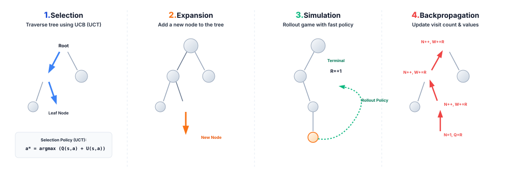
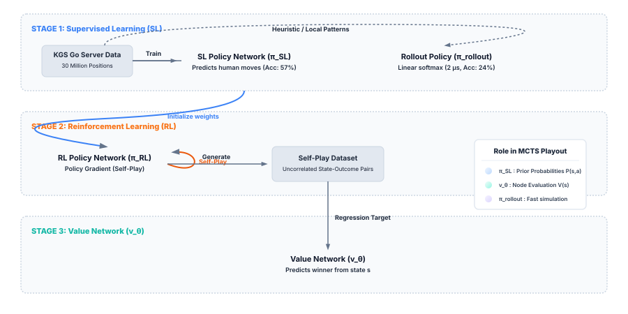
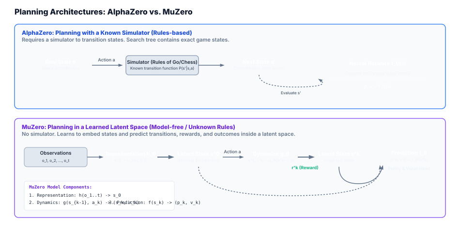
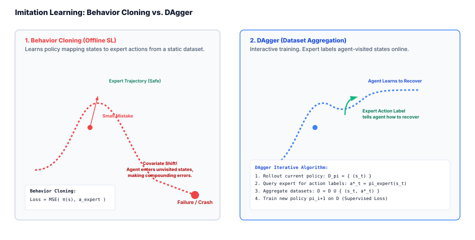
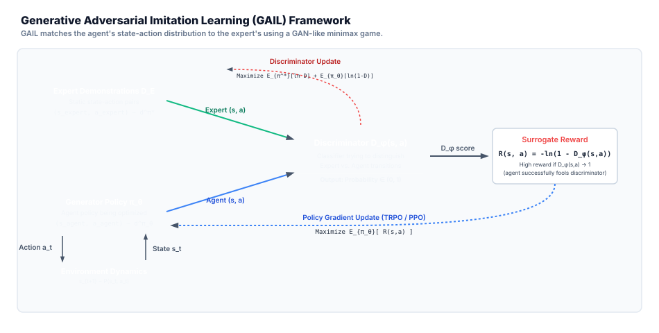

# Lecture 11: Combined Methods, Advanced Policy Gradients, and Model-Based RL

*Reference: Graesser, L., & Keng, W. L. (2019). Foundations of Deep Reinforcement Learning. Chapters 7, 8, & 9.*  
*Reference: Sutton, R. S., & Barto, A. G. (2018). Reinforcement Learning: An Introduction. Chapter 8.*  
*Reference: Silver, D., et al. (2016). "Mastering the game of Go with deep neural networks and tree search." Nature, 529(7587), 484-489.*

---

## 1. Combined Methods & Advanced Policy Gradients

Up to this point, we have explored purely value-based methods (DQN, Double DQN) and basic policy-based methods (REINFORCE). **Combined Methods** represent the union of these two paradigms. They simultaneously learn a policy (the **Actor**) and a value function (the **Critic**).

### 1.1 The Actor-Critic Family Recap
The core Actor-Critic update is driven by the Temporal Difference (TD) error:
$$ \delta_t = R_{t+1} + \gamma V(S_{t+1}, \mathbf{w}) - V(S_t, \mathbf{w}) $$
* The **Critic** updates its value parameters $\mathbf{w}$ to minimize this TD error (minimizing mean squared value error).
* The **Actor** updates its policy parameters $\theta$ in the direction of the gradient scaled by the critic's assessment:
  $$ \theta_{t+1} = \theta_t + \alpha \delta_t \nabla_{\theta} \ln \pi(A_t|S_t, \theta) $$

Modern combined methods extend this framework to handle complex, high-dimensional spaces, parallel environments, and trust regions.

```
                  ┌──────────────────────────────┐
                  │         Environment          │
                  └──────────────┬───▲───────────┘
                       State s   │   │ Action a
                                 │   │
                     ┌───────────▼───┴──────────┐
                     │          Actor           │◄┐
                     │     Policy π(a|s; θ)     │ │
                     └───────────┬──────────────┘ │
                                 │                │ TD Error δ
                                 │ Action         │ (Critique)
                                 │ Evaluation     │
                     ┌───────────▼──────────────┐ │
                     │          Critic          ├─┘
                     │    Value function V(s)   │
                     └──────────────────────────┘
```

### 1.2 Overview of Advanced Policy Gradient (PG) Methods

As discussed in [Lecture 10](file:///c:/github/drl/barto-sutton-graesser-keng/lecture10-ppo/lecture10-ppo.md), taking unconstrained policy gradient steps can lead to **performance collapse** if the step size is too large. Advanced PG methods solve this by wrapping updates in safety constraints:

1. **Trust Region Policy Optimization (TRPO)**
   * **Core Idea:** Restricts how much the policy can change in a single update by imposing a constraint on the Kullback-Leibler (KL) divergence between the old and new policy:
     $$ \mathbb{E}_{s \sim d_{\pi_{\theta_{old}}}} \left[ D_{KL} \left( \pi_{\theta_{old}}(\cdot|s) \,\big\|\, \pi_{\theta}(\cdot|s) \right) \right] \le \delta $$
   * **Optimization:** Uses second-order optimization (natural gradient computation involving the Fisher Information Matrix). While mathematically rigorous and guaranteed to achieve monotonic improvement, TRPO is computationally expensive due to the need to compute and invert the Hessian of the KL divergence.
2. **Proximal Policy Optimization (PPO)**
   * **Core Idea:** Achieves similar stability to TRPO but uses first-order optimization (standard stochastic gradient descent) with a clipped surrogate objective that penalizes moving the policy ratio $r_t(\theta) = \frac{\pi_{\theta}(a|s)}{\pi_{\theta_{old}}(a|s)}$ outside of $[1-\epsilon, 1+\epsilon]$.
3. **Deep Deterministic Policy Gradient (DDPG)**
   * **Core Idea:** An off-policy actor-critic method designed for continuous action spaces. Instead of outputting a distribution, the actor learns a deterministic policy $a = \mu(s|\theta)$. Because the policy is deterministic, exploration is achieved by adding noise (e.g., Ornstein-Uhlenbeck noise) to the chosen action.
4. **Soft Actor-Critic (SAC)**
   * **Core Idea:** An off-policy actor-critic method that incorporates **Entropy Regularization**. The objective function is modified to maximize both expected reward and policy entropy:
     $$ J(\theta) = \sum_{t=0}^{T} \mathbb{E}_{(s_t, a_t) \sim \rho_{\pi}} \left[ R(s_t, a_t) + \alpha \mathcal{H}(\pi(\cdot|s_t)) \right] $$
     where $\mathcal{H}(\pi(\cdot|s_t)) = -\sum_a \pi(a|s_t) \ln \pi(a|s_t)$ is the entropy, and $\alpha$ is the temperature parameter. Higher entropy prevents the policy from collapsing into a single deterministic action, promoting broad exploration and robust generalization.

---

## 2. Model-Based Reinforcement Learning

A fundamental dividing line in RL is between **Model-Free** and **Model-Based** algorithms. 

* **Model-Free RL** (DQN, PPO, SAC) learns directly from trials and errors in the environment. The agent has no concept of "what will happen next" until it actually takes the action.
* **Model-Based RL** maintains or learns a transition function $P(s'|s, a)$ and a reward function $R(s, a)$. The agent uses this model of the world to **plan** actions before executing them.

### 2.1 Why and When to Use Model-Based RL

| Metric / Scenario | Model-Free RL | Model-Based RL |
| :--- | :--- | :--- |
| **Sample Efficiency** | **Low**. Requires millions of interactions to extract policy gradients or value contours. | **High (10x - 100x)**. Can generate millions of "imagined" transitions offline without stepping in the real world. |
| **Computation Cost** | **Low during planning**. Decisions are a single forward pass through the policy network. | **High during planning**. Requires simulating many future paths (tree search or trajectory rollouts). |
| **Real-world Suitability** | Poor for physical systems (e.g., expensive robots, chemical plants) where failing is costly. | Excellent. The agent can "fail" in its simulated model to discover optimal behavior safely. |
| **Dependency** | Only requires state-action-reward-state transitions. | Requires an accurate model of the environment dynamics. |

### 2.2 Challenges of Model-Based RL
1. **Model Error Compounding (Trajectory Drift):** If the learned transition model $P(s'|s,a)$ has a tiny error (e.g., $1\%$), planning $10$ steps ahead compounds this error exponentially: $(0.99)^{10} \approx 0.90$ ($10\%$ error). By step $50$, the imagined states are completely detached from reality.
2. **High-Dimensional Complexity:** Building a transition model that predicts the next frame in a pixel-based video game is often significantly harder than simply learning to play the game.

### 2.3 The Dyna-Q Framework: Combining Free and Based RL
Sutton's **Dyna-Q** architecture shows how model-free and model-based learning can work in tandem.

```python
Initialize Q(s,a) and Model(s,a) for all s, a
Loop forever:
    1. s <- current state
    2. a <- epsilon-greedy(s, Q)
    3. Take action a, observe reward r and next state s'
    4. Model-Free Update:
       Q(s,a) <- Q(s,a) + alpha * [r + gamma * max_a' Q(s',a') - Q(s,a)]
    5. Model Update:
       Model(s,a) <- (r, s')  # Record transition
    6. Planning Loop (Model-Based):
       Loop N times:
          Select a random state s_sim from previously visited states
          Select a random action a_sim previously taken in s_sim
          r_sim, s'_sim <- Model(s_sim, a_sim)
          Q(s_sim, a_sim) <- Q(s_sim, a_sim) + alpha * [r_sim + gamma * max_a' Q(s'_sim, a') - Q(s_sim, a_sim)]
```

---

## 3. Revisit UCB-Based Action Selection

To plan effectively in a model-based environment, we cannot rely on purely random exploration ($\epsilon$-greedy). We need a principled way to explore promising states.

### 3.1 Multi-Armed Bandit UCB
Recall the **Upper Confidence Bound (UCB1)** action selection rule from Multi-Armed Bandits ([Lecture 2](file:///c:/github/drl/barto-sutton-graesser-keng/lecture2-mab/)):
$$ A_t \doteq \text{argmax}_a \left[ Q_t(a) + c \sqrt{\frac{\ln t}{N_t(a)}} \right] $$
* $Q_t(a)$ is the exploitation term (estimated value of action $a$).
* $c \sqrt{\frac{\ln t}{N_t(a)}}$ is the exploration term (uncertainty bonus).
* $t$ is the total number of steps taken across all actions, and $N_t(a)$ is the number of times action $a$ has been selected.
* As an action is selected, $N_t(a)$ increases, shrinking the uncertainty bonus. As other actions are selected, $t$ grows, slowly increasing the uncertainty bonus of unselected actions.

### 3.2 UCB Applied to Trees (UCT)
To use UCB in multi-step planning, we extend UCB1 to search trees. This is called the **UCT (Upper Confidence bounds applied to Trees)** formula. When deciding which child node to explore from state node $s$, we select the action $a$ that maximizes:
$$ \text{UCT}(s, a) = Q(s, a) + c \sqrt{\frac{\ln N(s)}{N(s, a)}} $$
* $Q(s, a)$ is the average reward returned from all simulations that went through state $s$ and action $a$.
* $N(s)$ is the total number of visits to parent node $s$.
* $N(s, a)$ is the number of times action $a$ has been selected from node $s$.

---

## 4. Monte Carlo Tree Search (MCTS)

**Monte Carlo Tree Search (MCTS)** is a model-based search algorithm that builds a decision tree iteratively to find the best moves. It does not require storing a global value table for all states; instead, it evaluates states on-the-fly by running simulated playouts using an environment model.

### 4.1 Why and When to Use MCTS
* **High Branching Factors:** Traditional minimax search with alpha-beta pruning (used in Chess) fails in games like Go because the branching factor is too large ($\approx 250$ vs $\approx 35$). We cannot search to a fixed depth. MCTS bypasses this by only expanding the most promising branches.
* **No Heuristic Evaluation Needed:** Minimax requires a hand-crafted state evaluation function. MCTS evaluates states by running random playouts to the very end of the game (terminal states), allowing it to work without any prior domain knowledge.

### 4.2 The MCTS Framework
MCTS operates by executing four sequential phases iteratively for a given search budget (time or iterations):



1. **Selection:** Starting at the root node (representing the current game state), we traverse down the tree by selecting child nodes that maximize the UCT score. We stop when we reach a **leaf node** (a node that has unexpanded legal actions).
2. **Expansion:** If the leaf node does not represent a terminal state, we select one of its unvisited actions, create a new child node, and append it to the tree.
3. **Simulation (Rollout):** From the newly created child node, we run a fast simulation (rollout) to the end of the game using a default rollout policy (e.g. choosing random legal actions). The game terminates, yielding an outcome/reward $R$ (e.g., $+1$ for a win, $-1$ for a loss).
4. **Backpropagation:** We traverse back up the selected path from the expanded node to the root. For each node on the path, we increment its visit count $N$ and update its cumulative action value $W$ using the rollout reward $R$.

### 4.3 Python Implementation of MCTS
Below is a modular Python implementation of a Monte Carlo Tree Search:

```python
import math
import random

class MCTSNode:
    def __init__(self, state, parent=None, action=None):
        self.state = state          # The game state
        self.parent = parent        # Parent node
        self.action = action        # Action that led to this state
        self.children = []          # List of child nodes
        self.visit_count = 0        # N(s)
        self.total_value = 0.0      # W(s)
        self.unexpanded_actions = state.get_legal_actions() # Unexplored actions

    @property
    def q_value(self):
        if self.visit_count == 0:
            return 0.0
        return self.total_value / self.visit_count

    def is_fully_expanded(self):
        return len(self.unexpanded_actions) == 0

    def is_terminal(self):
        return self.state.is_terminal()

def uct_select(node, c_param=1.414):
    """Selects the child with the highest UCT score."""
    best_score = -float('inf')
    best_child = None
    
    for child in node.children:
        # UCT = Q(s,a) + c * sqrt( ln(N(parent)) / N(child) )
        exploitation = child.q_value
        exploration = c_param * math.sqrt(math.log(node.visit_count) / child.visit_count)
        score = exploitation + exploration
        
        if score > best_score:
            best_score = score
            best_child = child
            
    return best_child

def mcts_search(root_state, iterations=1000):
    root_node = MCTSNode(state=root_state)
    
    for _ in range(iterations):
        # 1. Selection
        node = root_node
        while not node.is_terminal() and node.is_fully_expanded():
            node = uct_select(node)
            
        # 2. Expansion
        if not node.is_terminal():
            action = node.unexpanded_actions.pop()
            next_state = node.state.take_action(action)
            child_node = MCTSNode(state=next_state, parent=node, action=action)
            node.children.append(child_node)
            node = child_node # Simulate from this new node
            
        # 3. Simulation (Rollout)
        rollout_state = node.state
        while not rollout_state.is_terminal():
            actions = rollout_state.get_legal_actions()
            random_action = random.choice(actions)
            rollout_state = rollout_state.take_action(random_action)
        reward = rollout_state.get_reward() # Game outcome (e.g. +1, 0, -1)
        
        # 4. Backpropagation
        while node is not None:
            node.visit_count += 1
            node.total_value += reward
            node = node.parent
            
    # Return the action corresponding to the child with the highest visit count
    best_child = max(root_node.children, key=lambda c: c.visit_count)
    return best_child.action
```

---

## 5. Case Study: AlphaGo

DeepMind's **AlphaGo** (Silver et al., 2016) represents one of the greatest milestones in Artificial Intelligence. The game of Go has a board size of $19 \times 19$, resulting in a branching factor of $\approx 250$ (making exhaustive search impossible) and a state space of $3^{361} \approx 10^{170}$ states (more than the number of atoms in the observable universe).

AlphaGo conquered this complexity by combining **Deep Convolutional Neural Networks** with **Monte Carlo Tree Search (MCTS)**. The neural networks were used to prune the search tree: a policy network narrowed down which moves to explore, and a value network evaluated positions to limit search depth.

### 5.1 The Neural Network Components

AlphaGo utilizes three distinct networks:

1. **Supervised Learning (SL) Policy Network ($\pi_{SL}(a|s)$)**
   * **Training:** Trained on 30 million board positions from human expert games played on the KGS Go Server. It learns to predict human expert moves.
   * **Performance:** Achieved $57\%$ accuracy in predicting human moves.
   * **Role:** Used to initialize prior probabilities for actions in MCTS.
2. **Fast Rollout Policy ($\pi_{\text{rollout}}(a|s)$)**
   * **Training:** A simple linear model trained using local patterns and hand-crafted features.
   * **Performance:** Much lower accuracy ($24\%$), but extremely fast: takes only $2$ microseconds to compute a move, compared to $3$ milliseconds for the deep policy network.
   * **Role:** Used to run rapid simulations to the end of the game during the rollout phase of MCTS.
3. **Reinforcement Learning (RL) Policy Network ($\pi_{RL}(a|s)$)**
   * **Training:** Initialized with the weights of $\pi_{SL}$, then trained using policy gradient reinforcement learning by playing against previous versions of itself (Self-Play).
   * **Performance:** Won $80\%$ of its games against the SL policy network.
   * **Role:** Used to generate high-quality self-play games to train the Value Network.
4. **Value Network ($v_{\theta}(s)$)**
   * **Training:** Trained via regression to predict the expected outcome $z \in \{-1, +1\}$ (win/loss) of self-play games generated by the RL policy network.
   * **Overfitting Prevention:** To prevent overfitting (where consecutive board states in a game are highly correlated), the dataset was built by extracting only a single state from each of 30 million different self-play games.
   * **Role:** Used to evaluate leaf nodes in MCTS without running rollouts.

### 5.2 The Training Pipeline

The training of AlphaGo consists of three consecutive stages:



---

### 5.3 MCTS Integration in AlphaGo

During actual game playout, AlphaGo executes MCTS to determine the next move. The search tree is traversed, expanded, and updated using the neural networks:

#### A. Selection (PUCT Search)
Starting at the root, AlphaGo selects moves that maximize a variant of the predictor UCT formula (PUCT):
$$ a_t = \text{argmax}_a \left( Q(s, a) + u(s, a) \right) $$
$$ u(s, a) = c_{puct} P(s, a) \frac{\sqrt{N(s)}}{1 + N(s, a)} $$
* $P(s, a) = \pi_{SL}(a|s)$ is the prior probability of selecting action $a$ in state $s$ predicted by the **Supervised Learning Policy Network**. This ensures the search immediately focuses on human-like moves.
* $N(s, a)$ is the visit count. As action $a$ is visited more, $u(s,a)$ decreases, encouraging exploration of other actions with high prior probabilities.

#### B. Expansion & Evaluation
When a leaf node $s_L$ is reached, it is expanded. Rather than running a random rollout immediately, AlphaGo evaluates the state $s_L$ in two ways to get a robust evaluation:
1. **Value Network Evaluation:** The state is fed into the Value Network to estimate $v_{\theta}(s_L)$ (expected win probability).
2. **Fast Playout Simulation:** The fast rollout policy $\pi_{\text{rollout}}$ simulates the game from $s_L$ to the end to get an actual game outcome $z \in \{-1, +1\}$.

These two evaluations are combined using a mixing parameter $\lambda = 0.5$:
$$ V(s_L) = (1 - \lambda) v_{\theta}(s_L) + \lambda z $$

#### C. Backpropagation
The combined value $V(s_L)$ is propagated back up the search path. For each action edge $(s, a)$ traversed during selection:
* Visit count is incremented: $N(s, a) \leftarrow N(s, a) + 1$
* Action value is updated with the average evaluation:
  $$ Q(s, a) = \frac{1}{N(s, a)} \sum_{i=1}^{N(s, a)} V(s_L^{(i)}) $$

#### D. Action Selection for the Real Move
Once the search budget (e.g., 1600 rollouts) is exhausted, AlphaGo selects the move that has the **highest visit count** $N(\text{root}, a)$ (not the highest Q-value). Visit counts are far less sensitive to single anomalous rollout values, making them much more robust.

---

## 6. From AlphaGo to AlphaZero and MuZero

DeepMind's game-playing agents evolved rapidly from domain-specific systems using human data to general-purpose agents that learn entirely from scratch in learned models of the world.

### 6.1 AlphaZero: Learning from Self-Play without Human Data
While AlphaGo was a massive achievement, it relied heavily on human expert data ($\pi_{SL}$) to initialize prior probabilities and avoid starting with a completely random search. **AlphaZero** (Silver et al., 2017) simplified and generalized this pipeline to master Chess, Shogi, and Go using **zero** human expert games or domain knowledge.

#### Key Architectural Differences from AlphaGo:
1. **No Supervised Learning (SL) Initialization:** AlphaZero starts with completely random weights for both policy and value predictions. It learns solely through Reinforcement Learning (RL) self-play from step zero.
2. **Unified Neural Network:** Instead of separate policy and value networks, AlphaZero uses a single unified deep neural network $f_{\theta}(s)$ with dual output heads:
   * A policy head $\mathbf{p} = \pi(a|s, \theta)$ outputting action probabilities.
   * A value head $v = V(s, \theta)$ predicting game outcome $v \in [-1, +1]$.
3. **No Fast Rollout Policy:** AlphaZero completely discards the simulation (rollout) phase of MCTS. Instead of playing games to the end with a fast policy, it evaluates leaf nodes $s_L$ directly using its value head: $V(s_L) = v_{\theta}(s_L)$. This removes the need for hand-crafted heuristic rollout policies.
4. **MCTS as Policy Improver:** In AlphaZero, MCTS is not just used at decision time; it acts as the primary policy operator during training. Self-play games are played by running MCTS. The search outputs visit counts for actions, $\boldsymbol{\pi}_t$, which represents a stronger policy than the neural network's raw policy output $\mathbf{p}_t$. The network is trained to make its policy head $\mathbf{p}_t$ match the MCTS search distributions $\boldsymbol{\pi}_t$:
   $$ \text{Loss} = (z - v)^2 - \boldsymbol{\pi}^T \ln \mathbf{p} + c \|\theta\|^2 $$
   where $z \in \{-1, +1\}$ is the actual winner of the self-play game, and $c \|\theta\|^2$ is L2 weight regularization.

---

### 6.2 MuZero: Planning with a Learned Latent Model
Both AlphaGo and AlphaZero belong to the "known model" family of Model-Based RL. They plan by querying a simulator that knows the exact rules of the game (e.g. how a knight moves in chess or how stones are captured in Go). 

**MuZero** (Schrittwieser et al., 2020) represents a major breakthrough: it achieves superhuman performance in Go, Chess, Shogi, and Atari games **without being told the rules of the environment**. It learns a model of the dynamics inside a latent space and plans directly inside this learned model.



#### The Three Learned Networks of MuZero:
Instead of trying to reconstruct complete environment observations (like pixels in Atari, which is extremely difficult), MuZero only models the aspects of the environment that are critical for decision-making (rewards, values, and policies). It splits the model into three functions:

1. **Representation Function ($h_{\theta}$):**
   Encodes a sequence of historical observations $o_1, \dots, o_t$ into an initial internal latent state $s^0$:
   $$ s^0 = h_{\theta}(o_1, \dots, o_t) $$
2. **Dynamics Function ($g_{\theta}$):**
   Takes the current latent state $s^{k-1}$ and a candidate action $a_k$, and predicts the next latent state $s^k$ and the immediate reward $r^k$:
   $$ s^k, r^k = g_{\theta}(s^{k-1}, a_k) $$
   *(This allows the agent to roll out future steps purely in its mind/latent space, without using the real environment or knowing its rules).*
3. **Prediction Function ($f_{\theta}$):**
   Takes a latent state $s^k$ and outputs the policy probabilities $\mathbf{p}^k$ and value estimate $v^k$:
   $$ \mathbf{p}^k, v^k = f_{\theta}(s^k) $$

#### MCTS in MuZero (Planning inside the Latent Model):
During search, MuZero runs MCTS by traversing the tree entirely inside its latent representation:
* **Selection:** At step $k$, it traverses the latent tree by selecting actions that maximize the PUCT formula using the predicted policies $\mathbf{p}^k$ and values $v^k$.
* **Expansion (Virtual):** When expanding, it does not query the environment. Instead, it runs the **Dynamics Function** $g_{\theta}(s^{k-1}, a_k)$ to generate the next latent state $s^k$ and immediate reward $r^k$.
* **Evaluation (Virtual):** Once the new latent state $s^k$ is created, it is evaluated by the **Prediction Function** $f_{\theta}(s^k)$ to obtain policy logits $\mathbf{p}^k$ and value $v^k$. No rollouts are performed.
* **Backpropagation:** Visited counts and values are updated using the predicted values $v^k$ and the immediate rewards $r^k$ accumulated along the path.

---

## 7. Imitation Learning

In many real-world tasks, designing a reward function $R(s,a)$ is extremely difficult (e.g., how do you mathematically define a reward for "driving naturally" or "writing a polite email"?). **Imitation Learning (IL)** bypasses reward engineering by training the agent to mimic demonstrations provided by an expert (usually a human or a heavy planner).

### 7.1 Supervised Learning vs. Imitation Learning
A common point of confusion is: *Isn't imitation learning just standard supervised learning where states are inputs and expert actions are labels?*

While they share the same loss functions (e.g. cross-entropy for discrete actions, MSE for continuous actions), they differ fundamentally in their underlying data generation assumptions:

| Feature | Standard Supervised Learning | Imitation Learning (Interactive) |
| :--- | :--- | :--- |
| **Data Assumption** | **i.i.d.** (Independent and Identically Distributed) data. | **Non-i.i.d.** The agent's action at time $t$ determines the state at time $t+1$. |
| **Error Feedback** | Errors in prediction do not change future inputs. | Errors are **compounding**. A small mistake changes the state distribution. |
| **Distribution Shift** | Test data is assumed to come from the training distribution. | The agent is tested on states generated by its own policy, not the expert's. |

#### The Compounding Error Problem (Covariate Shift)
If an agent is trained via standard offline supervised learning on expert trajectories, it only learns what to do in states that the expert visited. However, at test time, the agent will inevitably make a small mistake. This mistake shifts the agent into a state that was never visited by the expert. 

Because this state is outside the training distribution, the agent's policy outputs a poor action, causing it to drift further away. The errors compound exponentially, quickly leading to a crash or failure.



---

### 7.2 Behavior Cloning
**Behavior Cloning (BC)** is the simplest form of imitation learning. It treats imitation purely as offline supervised learning.

#### The Behavior Cloning Algorithm:
1. Collect a static dataset of expert demonstrations: $\mathcal{D} = \{ (s_1, a_1), (s_2, a_2), \dots, (s_N, a_N) \}$ where actions $a_i$ are selected by the expert policy $\pi^*(s_i)$.
2. Train a policy $\pi_{\theta}$ using supervised learning to minimize a loss function (e.g. MSE for continuous actions, Cross-Entropy for discrete):
   $$ \theta^* = \text{argmin}_{\theta} \sum_{(s, a) \in \mathcal{D}} \mathcal{L}(\pi_{\theta}(s), a) $$

* **Limitation:** Highly vulnerable to covariate shift. It only works well in short-horizon tasks, or in environments where the error can be immediately corrected, or when the dataset is extremely large and covers almost all possible states.

---

### 7.3 DAgger (Dataset Aggregation)
To solve the covariate shift problem, Stéphane Ross et al. (2011) introduced **DAgger (Dataset Aggregation)**. DAgger is an iterative, interactive algorithm that gathers training data from the states that the *agent* actually visits, but uses the *expert* to label those states with the correct actions.

#### The DAgger Algorithm:

$$
\begin{array}{l}
\textbf{Initialize:} \text{ expert policy } \pi^*, \text{ dataset } \mathcal{D} \leftarrow \emptyset \\
\textbf{Train initial policy } \pi_1 \text{ by running Behavior Cloning on a set of expert trajectories } \mathcal{D}_{\text{init}} \\
\mathcal{D} \leftarrow \mathcal{D} \cup \mathcal{D}_{\text{init}} \\
\\
\textbf{Loop for iteration } i = 1, \dots, N: \\
\quad \text{Initialize trajectory list } \mathcal{D}_{\pi_i} \leftarrow \emptyset \\
\quad \text{Generate trajectories by running the current agent policy } \pi_i \text{ in the environment:} \\
\quad \quad \text{Observe states } S_0, S_1, \dots, S_T \\
\quad \textbf{For each observed state } S_t \text{ in the trajectories:} \\
\qquad \text{Query the expert to get the action it would have taken: } A^*_t \leftarrow \pi^*(S_t) \\
\qquad \text{Add the pair to the batch: } \mathcal{D}_{\pi_i} \leftarrow \mathcal{D}_{\pi_i} \cup \{ (S_t, A^*_t) \} \\
\quad \text{Aggregate datasets: } \mathcal{D} \leftarrow \mathcal{D} \cup \mathcal{D}_{\pi_i} \\
\quad \text{Retrain policy } \pi_{i+1} \text{ on the aggregated dataset } \mathcal{D} \text{ using supervised learning:} \\
\qquad \theta_{i+1} \leftarrow \text{argmin}_{\theta} \mathbb{E}_{(s, a) \in \mathcal{D}} [\mathcal{L}(\pi_{\theta}(s), a)]
\end{array}
$$

* **Why DAgger Works:** Because the trajectories are generated by the agent's own policy $\pi_i$, the training dataset $\mathcal{D}$ contains states that the agent visits when it makes mistakes. The expert labels then teach the agent **how to recover** from those mistakes back to the expert path, resolving the compounding error issue.
* **Limitation:** Requires an interactive expert that can be queried online during training. This is often impractical if the expert is a human who cannot sit and label thousands of states in real-time.

```python
# Conceptual Implementation of DAgger Loop
def train_dagger(env, expert_policy, epochs=10, steps_per_epoch=1000):
    # 1. Initialize dataset with expert demonstrations
    dataset = collect_expert_demonstrations(env, expert_policy, num_episodes=5)
    
    # 2. Initialize agent policy
    agent_policy = PolicyNetwork()
    agent_policy.train(dataset) # Initial Behavior Cloning
    
    for epoch in range(epochs):
        new_trajectories = []
        state, _ = env.reset()
        
        # 3. Roll out agent policy in the environment
        for _ in range(steps_per_epoch):
            # Select action using agent policy
            action = agent_policy.select_action(state)
            next_state, reward, terminated, truncated, _ = env.step(action)
            
            # Query the expert for the optimal action at the state visited by the agent
            expert_action = expert_policy.select_action(state)
            
            # Add state-expert_action pair to new dataset
            new_trajectories.append((state, expert_action))
            
            state = next_state
            if terminated or truncated:
                state, _ = env.reset()
                
        # 4. Aggregate dataset
        dataset.extend(new_trajectories)
        
        # 5. Retrain the policy on aggregated dataset
        agent_policy.train(dataset)
        
    return agent_policy
```

---

### 7.4 Inverse Reinforcement Learning (IRL)

In Behavior Cloning and DAgger, we assume the expert demonstrates actions, and we try to map states directly to those actions. However, these methods do not learn the *underlying goal* of the expert. **Inverse Reinforcement Learning (IRL)** (Ng and Russell, 2000) takes a different approach: instead of copying actions, it attempts to recover the unknown **reward function** $R^*(s,a)$ that the expert is optimizing. Once the reward function is recovered, the agent can solve the MDP using standard reinforcement learning (like Q-learning or PPO).

#### The Reward Ambiguity Problem
A fundamental challenge in IRL is that the mapping from demonstrations to reward functions is **underdetermined** (non-unique). There are infinitely many reward functions for which a given expert policy is optimal. 
* **Trivial Reward:** The reward function $R(s,a) = 0$ for all states and actions makes *every* policy optimal, including the expert's.
* **Constant Reward:** Adding or multiplying constant offsets doesn't change the preference order of trajectories.
* To address this ambiguity, modern methods like **Maximum Entropy IRL** (Ziebart et al., 2008) use information theory to select the reward function that makes the expert policy optimal while maximizing the entropy of the resulting trajectory distribution:
  $$ P(\tau) \propto \exp\left( \sum_{t} R(s_t, a_t) \right) $$

---

### 7.5 Generative Adversarial Imitation Learning (GAIL)

Standard IRL requires running a full Reinforcement Learning loop inside every optimization step to evaluate each candidate reward function, making it extremely computationally expensive. **Generative Adversarial Imitation Learning (GAIL)** (Ho and Ermon, 2016) bypasses this intermediate reward-learning step, framing imitation learning as a minimax game inspired by Generative Adversarial Networks (GANs).

In GAIL:
* **The Generator (Policy $\pi_{\theta}$):** Plays the role of the generator, attempting to produce state-action trajectories that look identical to the expert's demonstrations.
* **The Discriminator ($D_{\phi}(s, a)$):** Plays the role of the discriminator, attempting to classify whether a given state-action pair $(s,a)$ was generated by the expert (outputting a score close to 1) or by the agent (outputting a score close to 0).



#### GAIL Minimax Objective Function:
The policy $\pi_{\theta}$ and discriminator $D_{\phi}$ are trained to solve the following minimax optimization problem:
$$ \min_{\pi_{\theta}} \max_{D_{\phi}} \mathbb{E}_{\pi_{\theta}} [\ln(1 - D_{\phi}(s, a))] + \mathbb{E}_{\pi^*} [\ln D_{\phi}(s, a)] - \lambda \mathcal{H}(\pi_{\theta}) $$
where:
* $\mathbb{E}_{\pi^*} [\ln D_{\phi}(s, a)]$ is the expected log-likelihood of the discriminator correctly identifying expert transitions.
* $\mathbb{E}_{\pi_{\theta}} [\ln(1 - D_{\phi}(s, a))]$ is the expected log-likelihood of the discriminator identifying agent transitions.
* $\mathcal{H}(\pi_{\theta}) = \mathbb{E}[-\ln \pi_{\theta}(a|s)]$ is an entropy regularization term encouraging policy exploration.

#### Using Discriminator Outputs as Surrogate Rewards:
Once the discriminator is updated, we freeze it and use its output to define a surrogate reward function for the policy:
$$ R(s, a) = -\ln(1 - D_{\phi}(s, a)) $$
* If the agent takes a transition that looks highly expert-like, the discriminator outputs $D_{\phi}(s,a) \approx 1$. Consequently, $1 - D_{\phi}(s,a) \approx 0$, and the surrogate reward $-\ln(1 - D_{\phi}(s,a))$ becomes a large positive value.
* If the agent takes a bad transition, $D_{\phi}(s,a) \approx 0$, and the reward is close to $0$.
* The policy $\pi_{\theta}$ is then updated to maximize this reward using standard policy gradient methods (e.g. TRPO or PPO).

#### The GAIL Algorithm:

$$
\begin{array}{l}
\textbf{Input:} \text{ Expert demonstrations } \mathcal{D}_E \sim \pi^*, \text{ initial policy } \pi_{\theta_0}, \text{ discriminator } D_{\phi_0} \\
\textbf{Loop for iteration } i = 0, 1, 2, \dots: \\
\quad \text{1. Roll out policy } \pi_{\theta_i} \text{ in the environment to collect trajectories: } \mathcal{D}_{\text{agent}} \sim \pi_{\theta_i} \\
\quad \text{2. Update the discriminator parameter } \phi_i \text{ to } \phi_{i+1} \text{ by gradient ascent on:} \\
\qquad \mathbb{E}_{(s, a) \in \mathcal{D}_E} [\ln D_{\phi}(s, a)] + \mathbb{E}_{(s, a) \in \mathcal{D}_{\text{agent}}} [\ln(1 - D_{\phi}(s, a))] \\
\quad \text{3. Compute surrogate rewards for each step in } \mathcal{D}_{\text{agent}}: \\
\qquad R(s, a) = -\ln(1 - D_{\phi_{i+1}}(s, a)) \\
\quad \text{4. Update the policy parameter } \theta_i \text{ to } \theta_{i+1} \text{ using a policy gradient step (e.g., PPO/TRPO)} \\
\qquad \text{to maximize: } \mathbb{E}_{(s, a) \in \mathcal{D}_{\text{agent}}} [\nabla_{\theta} \ln \pi_{\theta}(a|s) \cdot Q_{R}(s, a)] + \lambda \nabla_{\theta} \mathcal{H}(\pi_{\theta})
\end{array}
$$

---

### 7.6 Applications of Imitation Learning

Imitation learning is widely used when environment interactions are costly or safety-critical, or when the optimal behavior is easy for a human to demonstrate but hard to define programmatically:

1. **Autonomous Vehicles:** Instead of writing complex heuristic rule-based systems for highway driving, Behavior Cloning and DAgger are used to map camera inputs directly to steering angles and acceleration values based on human driver datasets (e.g., NVIDIA's Dave-2 project).
2. **Robotic Manipulation:** Training robotic arms to perform complex tasks (e.g., folding laundry, peg-in-hole insertion, or surgical tasks) by demonstrating the movements via teleoperation or virtual reality.
3. **Large Language Models (RLHF Alignment):** Pre-training models via Supervised Fine-Tuning (SFT) is a direct application of Behavior Cloning (predicting the next token chosen by human writers). During RLHF (Reinforcement Learning from Human Feedback), a reward model is trained using human preferences (similar to IRL), which then guides the PPO policy alignment.
4. **Game Playing:** Using human gameplay recordings to bootstrap complex agents (like AlphaGo or OpenAI Five in Dota 2) before initiating reinforcement learning self-play.

## 8. Decision Transformers (DT)

The **Decision Transformer (DT)** (Chen et al., 2021) represents a paradigm shift in Offline Reinforcement Learning by discarding traditional DRL control loop architectures. Instead of using value estimation or policy gradients to maximize rewards, it reformulates RL as a **conditional sequence modeling problem** using a causal GPT-style Transformer.

### 8.1 First Principles of "Upside-Down RL"
To understand Decision Transformers, we must contrast their information flow with traditional reinforcement learning:

* **Traditional RL ("Forward Flow"):**
  1. The agent observes a state $S_t$.
  2. The policy selects an action $A_t = \pi(S_t)$.
  3. The environment returns a reward $R_{t+1}$.
  4. The model uses the reward to compute Value functions ($V$ or $Q$), estimating: *"What return will I get if I take action $A_t$ in state $S_t$?"*
  $$\text{State } S_t \xrightarrow{\pi} \text{Action } A_t \xrightarrow{\text{Env}} \text{Reward } R_{t+1}$$

* **Upside-Down RL ("Reverse Flow"):**
  1. The agent is prompted with a **target return** (desired future reward) $\hat{R}_t$.
  2. The agent observes a state $S_t$.
  3. The model maps the state and target return directly to an action: $A_t = \pi(S_t, \hat{R}_t)$.
  4. The model answers: *"What action do I need to take right now to achieve this target return?"*
  $$\langle \text{State } S_t, \text{Target Return } \hat{R}_t \rangle \xrightarrow{\pi} \text{Action } A_t$$

By conditioning the action generation on the desired return, we treat control as **conditioned sequence generation** (similar to how LLMs are prompted with a topic to generate a text paragraph).

### 8.2 DT Architecture and Trajectory Formulation
During training, DT is fed historical patient or agent trajectories represented as sequences of states, actions, and Returns-to-Go (RTG):

$$\tau = (\hat{R}_1, s_1, a_1, \hat{R}_2, s_2, a_2, \dots, \hat{R}_T, s_T, a_T)$$

* **Return-to-Go (RTG):** Defined as $\hat{R}_t = \sum_{t'=t}^{T} r_{t'}$, representing the remaining accumulated reward we want the agent to receive from step $t$ onward.
* **Embeddings:** Each element type ($s_t$, $a_t$, and $\hat{R}_t$) has its own dedicated projection layer (e.g., linear layers for continuous values, or MLP/CNN layers for complex states) to map them to a shared embedding dimension $d_{\text{model}}$.
* **Causal Self-Attention:** The embedded tokens are passed to a causal GPT-style self-attention network. Causal masking ensures that when predicting action $a_t$, the model can only attend to past inputs $(\hat{R}_1, s_1, a_1, \dots, \hat{R}_t, s_t)$.
* **Objective:** The model is trained offline in a supervised manner to predict the actions taken in the training dataset using cross-entropy loss (for discrete actions) or mean squared error (for continuous actions):
  $$\mathcal{L} = \sum_{t} \mathcal{D}_{\text{loss}}\left( \text{DT}(\hat{R}_1, s_1, a_1, \dots, s_t), a_t \right)$$

### 8.3 Comparison: DT vs. Other RL Concepts
The following table summarizes the conceptual differences between Decision Transformers, traditional DRL, Behavior Cloning, and Inverse RL:

| Dimension | Traditional DRL (e.g., DQN, PPO) | Behavior Cloning (BC) | Inverse RL (IRL) | Decision Transformer (DT) |
| :--- | :--- | :--- | :--- | :--- |
| **Primary Goal** | Maximize expected cumulative reward | Mimic the demonstrator's action distribution | Recover the underlying reward function $R^*(s,a)$ | Predict actions that achieve a targeted return |
| **Reward Role** | Environment feedback used to optimize policy/value | Ignored completely (not present in training) | Unknown; inferred from expert actions | Input prompt (Return-to-Go) conditioning behavior |
| **Optimization Method** | Dynamic Programming / Bellman Updates / Policy Gradients | Supervised learning (supervised action classification) | Minimax optimization / Alternating RL loops | Supervised sequence modeling (next-token prediction) |
| **Bootstrapping** | Yes (estimates $Q(s,a)$ based on $Q(s',a')$) | No | Yes (during the inner RL loop) | No (supervised learning, no value functions) |
| **Sensitivity to Bad Data** | Can learn from any data via exploratory trial-and-error | High (mimics bad actions in dataset indiscriminately) | Moderate (depends on quality of expert paths) | Low (can train on suboptimal data and filter it by targeting high returns) |

```
                       TRADITIONAL DRL ("Forward Flow")
              ┌─────────┐      Action a      ┌─────────────┐
              │  State  ├───────────────────►│ Value/Policy│
              └────▲────┘                    └──────┬──────┘
                   │                                │
                   └─────────── Reward r ───────────┘
                       
                       DECISION TRANSFORMER ("Upside-Down RL")
              ┌─────────┐
              │  State  ├──────────┐
              └─────────┘          ▼
                             ┌───────────┐   Action a
                             │  Causal   ├─────────────►
              ┌─────────┐    │Transformer│
              │ Target  ├──────────┘
              │ Return  │
              └─────────┘
```

---

## Practice Exercises

Test your understanding of MCTS, AlphaGo/AlphaZero/MuZero, and Imitation Learning (including IRL and GAIL) with these exercises:

- [Multiple Choice Questions (MCQs)](./assets/questions/mcqs.md)
- [Subjective Questions](./assets/questions/subjective.md)
- [Numerical Questions](./assets/questions/numericals.md)
- [Programming Questions](./assets/questions/programming.md)

*Solutions can be found in the [assets/questions/solutions/](./assets/questions/solutions/) folder.*


