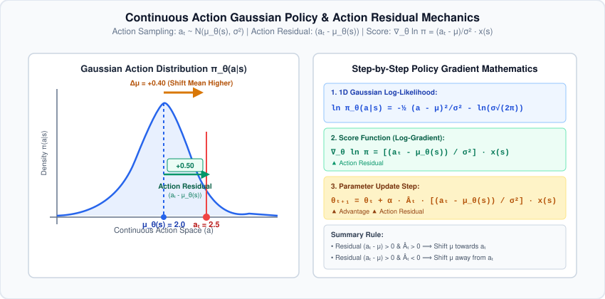
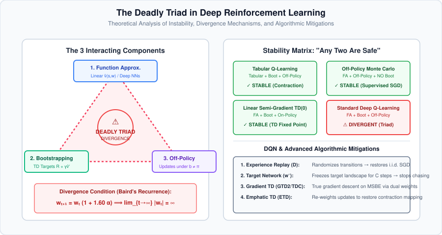
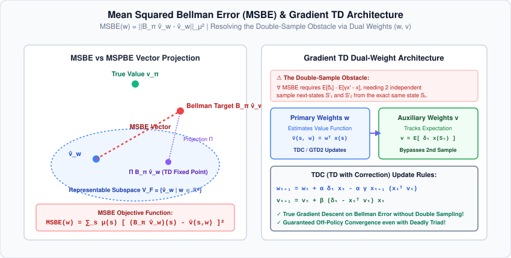
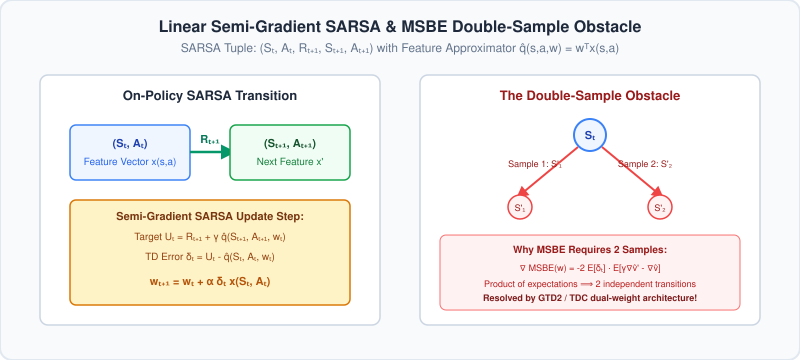
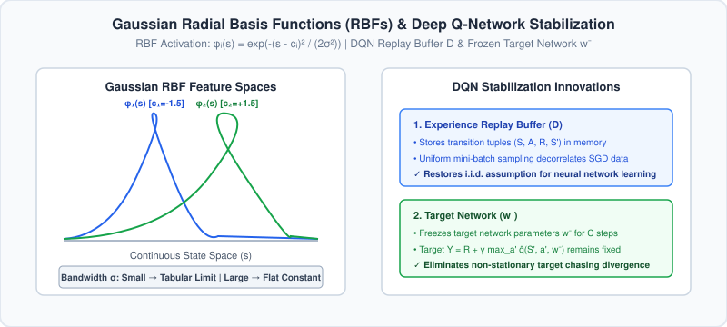
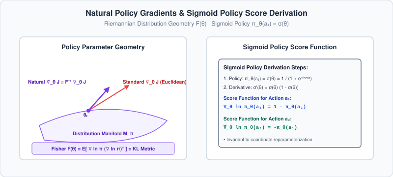
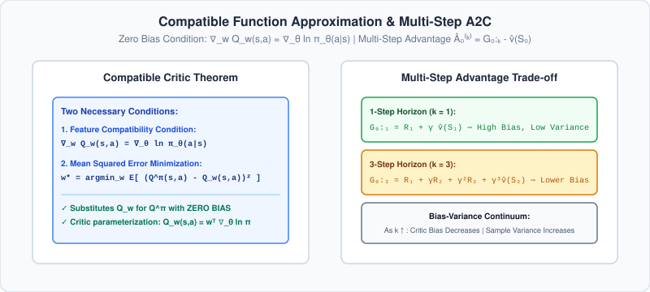

# Lecture 11: Combined Methods, Advanced Policy Gradients, and Model-Based RL

*Reference: Graesser, L., & Keng, W. L. (2019). Foundations of Deep Reinforcement Learning. Chapters 7, 8, & 9.*  
*Reference: Sutton, R. S., & Barto, A. G. (2018). Reinforcement Learning: An Introduction. Chapter 8.*  
*Reference: Silver, D., et al. (2016). "Mastering the game of Go with deep neural networks and tree search." Nature, 529(7587), 484-489.*

---

## 1. Combined Methods & Advanced Policy Gradients

Up to this point, we have explored purely value-based methods (DQN, Double DQN) and basic policy-based methods (REINFORCE). **Combined Methods** represent the union of these two paradigms. They simultaneously learn a policy (the **Actor**) and a value function (the **Critic**).

### 1.1 The Actor-Critic Family Recap
The core Actor-Critic update is driven by the Temporal Difference (TD) error:
$$ \delta_t = R_{t+1} + \gamma V(S_{t+1}, \mathbf{w}) - V(S_t, \mathbf{w}) $$
*Reference: Sutton & Barto (2018), Equation (12.6) / Graesser & Keng (2019), Equation (6.17)*

* The **Critic** updates its value parameters $\mathbf{w}$ to minimize this TD error (minimizing mean squared value error).
* The **Actor** updates its policy parameters $\theta$ in the direction of the gradient scaled by the critic's assessment:
  $$ \theta_{t+1} = \theta_t + \alpha \delta_t \nabla_{\theta} \ln \pi(A_t\mid S_t, \theta) $$
  *Reference: Sutton & Barto (2018), Equation (13.14)*

Modern combined methods extend this framework to handle complex, high-dimensional spaces, parallel environments, and trust regions.

```
                  ┌──────────────────────────────┐
                  │         Environment          │
                  └──────────────┬───▲───────────┘
                       State s   │   │ Action a
                                 │   │
                     ┌───────────▼───┴──────────┐
                     │          Actor           │◄┐
                     │     Policy π(a|s; θ)     │ │
                     └───────────┬──────────────┘ │
                                 │                │ TD Error δ
                                 │ Action         │ (Critique)
                                 │ Evaluation     │
                     ┌───────────▼──────────────┐ │
                     │          Critic          ├─┘
                     │    Value function V(s)   │
                     └──────────────────────────┘
```

### 1.2 Overview of Advanced Policy Gradient (PG) Methods

As discussed in [Lecture 10](file:///c:/github/drl/barto-sutton-graesser-keng/lecture10-ppo/lecture10-ppo.md), taking unconstrained policy gradient steps can lead to **performance collapse** if the step size is too large. Advanced PG methods solve this by wrapping updates in safety constraints:

1. **Trust Region Policy Optimization (TRPO)**
   * **The Optimization Problem:** TRPO solves the following constrained optimization problem to find the new policy parameters $\theta$:
     $$ \max_{\theta} \mathbb{E}_{s \sim d_{\pi_{\theta_{old}}}, a \sim \pi_{\theta_{old}}} \left[ \frac{\pi_{\theta}(a\mid s)}{\pi_{\theta_{old}}(a\mid s)} A_{\theta_{old}}(s, a) \right] $$
     $$ \text{subject to} \quad \mathbb{E}_{s \sim d_{\pi_{\theta_{old}}}} \left[ D_{KL} \left( \pi_{\theta_{old}}(\cdot\mid s) \,\big\|\, \pi_{\theta}(\cdot\mid s) \right) \right] \le \delta $$
     *Reference: Schulman et al. (2015), "Trust Region Policy Optimization"*
     
   * **Breaking Down the Expression:**
     * **Surrogate Objective:** The term $\mathbb{E} \left[ \frac{\pi_{\theta}(a\mid s)}{\pi_{\theta_{old}}(a\mid s)} A_{\theta_{old}}(s, a) \right]$ is a local approximation of the policy's expected return. If the advantage $A_{\theta_{old}}(s, a) > 0$, the objective encourages making the action probability ratio $r_t(\theta) = \frac{\pi_{\theta}(a\mid s)}{\pi_{\theta_{old}}(a\mid s)} > 1$ (i.e., making the action more likely).
     * **The Trust Region Constraint:** The KL divergence $D_{KL}(\pi_{old} \,\parallel\, \pi)$ measures the distance between the action probability distributions. The constraint enforces that the average change in policy behavior across states visited by the old policy does not exceed $\delta$ (typically a small value like $0.01$). 
     * **Why KL and not Parameter Distance ($\|\theta - \theta_{old}\|_2^2$)?** The mapping from parameter space $\theta$ to policy action space $\pi_{\theta}$ is highly non-linear. A tiny change in a single neural network parameter can drastically alter the action output (leading to catastrophic collapse), while a large change in another parameter might have zero effect. Constraining the KL divergence guarantees safety in *behavioral space*.

   * **Solving the Optimization (Natural Gradient & Conjugate Gradient):**
     To solve this efficiently, TRPO uses Taylor expansions around the current parameters $\theta_{old}$:
     1. **Linear Approximation of Objective:** approximated as $g^T (\theta - \theta_{old})$, where $g$ is the standard policy gradient.
     2. **Quadratic Approximation of KL Constraint:** approximated as $\frac{1}{2} (\theta - \theta_{old})^T H (\theta - \theta_{old}) \le \delta$, where $H$ is the **Fisher Information Matrix (FIM)** (the Hessian of the KL divergence).
     
     This yields the search direction $\Delta \theta \propto H^{-1} g$, known as the **Natural Policy Gradient**.
     
     Because computing and inverting the $D \times D$ Fisher matrix $H$ (where $D$ is the number of parameters, often $>10^5$) is computationally intractable ($O(D^3)$), TRPO uses the **Conjugate Gradient (CG)** algorithm to iteratively solve the linear system $H x = g$ for $x = H^{-1} g$ without explicitly forming or inverting $H$.
     
     Finally, because approximations are used, a **backtracking line search** is performed along the search direction to ensure the constraint is strictly satisfied ($\text{KL} \le \delta$) and the objective actually improves.
2. **Proximal Policy Optimization (PPO)**
   * **Core Idea:** Achieves similar stability to TRPO but uses first-order optimization (standard stochastic gradient descent) with a clipped surrogate objective that penalizes moving the policy ratio $r_t(\theta) = \frac{\pi_{\theta}(a\mid s)}{\pi_{\theta_{old}}(a\mid s)}$ outside of $[1-\epsilon, 1+\epsilon]$.
3. **Deep Deterministic Policy Gradient (DDPG)**
   * **Core Idea:** An off-policy actor-critic method designed for continuous action spaces. Instead of outputting a distribution, the actor learns a deterministic policy $a = \mu(s\mid \theta)$. Because the policy is deterministic, exploration is achieved by adding noise (e.g., Ornstein-Uhlenbeck noise) to the chosen action.
4. **Soft Actor-Critic (SAC)**
   * **Core Idea:** An off-policy actor-critic method that incorporates **Entropy Regularization**. The objective function is modified to maximize both expected reward and policy entropy:
     $$ J(\theta) = \sum_{t=0}^{T} \mathbb{E}_{(s_t, a_t) \sim \rho_{\pi}} \left[ R(s_t, a_t) + \alpha \mathcal{H}(\pi(\cdot\mid s_t)) \right] $$
     *Reference: Not in Sutton & Barto (2018) or Graesser & Keng (2019)*

     where $\mathcal{H}(\pi(\cdot\mid s_t)) = -\sum_a \pi(a\mid s_t) \ln \pi(a\mid s_t)$ is the entropy, and $\alpha$ is the temperature parameter. Higher entropy prevents the policy from collapsing into a single deterministic action, promoting broad exploration and robust generalization.

### 1.3 Continuous Action Parameterization & Action Residual Mechanics

In continuous action reinforcement learning (such as robotic joint control, autonomous steering, or continuous torque manipulation), an agent's policy cannot output discrete probability vectors. Instead, the policy network parameterizes a continuous probability distribution—most commonly a **1D Gaussian Distribution** $\pi_\theta(a \mid s) \sim \mathcal{N}(\mu_\theta(s), \sigma^2)$.



#### 1. The Gaussian Policy Parameterization
* **Mean Head $\mu_\theta(s)$:** A neural network (or linear feature vector $\mu_\theta(s) = \mathbf{w}^T \mathbf{x}(s)$) predicts the expected "intended" continuous action.
* **Exploration & Sampling:** During training, the agent samples an exploratory action $a_t$ from the normal distribution:
  $$ a_t \sim \mathcal{N}(\mu_\theta(s), \sigma^2) \implies a_t = \mu_\theta(s) + \sigma \cdot \epsilon, \quad \epsilon \sim \mathcal{N}(0, 1) $$
* **Inference / Deployment:** At test time, the agent acts deterministically by executing the mean action $\hat{a} = \mu_\theta(s)$.

#### 2. Derivation of Log-Likelihood & Score Function
The 1D Gaussian probability density function (PDF) is:
$$ \pi_\theta(a \mid s) = \frac{1}{\sigma \sqrt{2\pi}} \exp\left( -\frac{(a - \mu_\theta(s))^2}{2\sigma^2} \right) $$

Taking the natural logarithm yields the **Log-Likelihood Function**:
$$ \ln \pi_\theta(a \mid s) = -\frac{(a - \mu_\theta(s))^2}{2\sigma^2} - \ln(\sigma \sqrt{2\pi}) $$

To update policy parameters $\theta$ via policy gradient ascent, we compute the gradient with respect to $\theta$ (the **Score Function**):
$$ \nabla_\theta \ln \pi_\theta(a_t \mid s) = \nabla_\theta \left[ -\frac{(a_t - \mu_\theta(s))^2}{2\sigma^2} - \ln(\sigma \sqrt{2\pi}) \right] = \frac{a_t - \mu_\theta(s)}{\sigma^2} \nabla_\theta \mu_\theta(s) $$

For a linear mean $\mu_\theta(s) = \theta^T \mathbf{x}(s)$, where $\nabla_\theta \mu_\theta(s) = \mathbf{x}(s)$:
$$ \nabla_\theta \ln \pi_\theta(a_t \mid s) = \frac{a_t - \mu_\theta(s)}{\sigma^2} \mathbf{x}(s) $$

#### 3. What is the Action Residual?
The term $(a_t - \mu_\theta(s))$ is mathematically defined as the **Action Residual**:

$$ \text{Action Residual} \doteq a_t - \mu_\theta(s) = (\text{Executed Exploratory Action}) - (\text{Policy Predicted Mean Action}) $$

* **Statistical Interpretation:** Just as a residual in linear regression measures $\text{Observed} - \text{Predicted}$, the action residual measures how far the exploratory action sample $a_t$ deviated from the policy's central intention $\mu_\theta(s)$.
* **Scaling Role:** The term $\frac{1}{\sigma^2}$ scales the residual inversely proportional to variance. High variance ($\sigma^2$) decreases update sensitivity, while tight variance ($\sigma^2$) amplifies precision updates.

#### 4. How Policy Gradients Use the Action Residual to Predict & Adjust Actions
The Actor-Critic parameter update step combines the Advantage estimate $\hat{A}_t$ with the Action Residual:

$$ \theta_{t+1} = \theta_t + \alpha \cdot \hat{A}_t \cdot \left[ \frac{a_t - \mu_\theta(s)}{\sigma^2} \mathbf{x}(s) \right] $$

The table below outlines how the policy adjusts its mean action $\mu_\theta(s)$ based on the sign of the Action Residual and Advantage:

| Action Residual ($a_t - \mu_\theta(s)$) | Advantage ($\hat{A}_t$) | Parameter Update ($\Delta \theta$) | Action Prediction & Policy Adjustment |
| :---: | :---: | :---: | :--- |
| **Positive** ($a_t > \mu$) | **Positive** ($\hat{A}_t > 0$) | **Positive** ($\Delta \theta > 0$) | Action $a_t$ was **larger** than mean and produced a **good return**. Shift $\mu_\theta(s)$ **higher** towards $a_t$. |
| **Positive** ($a_t > \mu$) | **Negative** ($\hat{A}_t < 0$) | **Negative** ($\Delta \theta < 0$) | Action $a_t$ was **larger** than mean but produced a **poor return**. Shift $\mu_\theta(s)$ **lower** away from $a_t$. |
| **Negative** ($a_t < \mu$) | **Positive** ($\hat{A}_t > 0$) | **Negative** ($\Delta \theta < 0$) | Action $a_t$ was **smaller** than mean and produced a **good return**. Shift $\mu_\theta(s)$ **lower** towards $a_t$. |
| **Negative** ($a_t < \mu$) | **Negative** ($\hat{A}_t < 0$) | **Positive** ($\Delta \theta > 0$) | Action $a_t$ was **smaller** than mean but produced a **poor return**. Shift $\mu_\theta(s)$ **higher** away from $a_t$. |

#### 5. Concrete Hand-Calculated Numerical Example
* **State Feature:** $x(s) = 2.0$
* **Current Policy Parameter:** $\theta_0 = 1.0000 \implies \mu_{\theta_0}(s) = 1.0 \times 2.0 = 2.0000$
* **Fixed Variance:** $\sigma^2 = 0.25$
* **Executed Action:** $a_t = 2.5000$
* **Advantage Estimate:** $\hat{A}_t = +1.0000$
* **Learning Rate:** $\alpha = 0.10$

1. **Calculate Action Residual:**  
   $a_t - \mu_{\theta_0}(s) = 2.5000 - 2.0000 = \mathbf{+0.5000}$
2. **Compute Score Function:**  
   $\nabla_\theta \ln \pi_{\theta_0}(a_t \mid s) = \frac{+0.5000}{0.25} \times 2.0 = 2.0 \times 2.0 = \mathbf{4.0000}$
3. **Compute Parameter Shift & New Policy Mean:**  
   $\theta_1 = \theta_0 + \alpha \hat{A}_t \nabla_\theta \ln \pi_{\theta_0}(a_t \mid s) = 1.0000 + 0.10(+1.0000)(4.0000) = \mathbf{1.4000}$  
   New Mean Action: $\mu_{\theta_1}(s) = 1.4000 \times 2.0 = \mathbf{2.8000}$ (successfully shifted towards the beneficial action $2.5$).

---

## 2. Model-Based Reinforcement Learning

A fundamental dividing line in RL is between **Model-Free** and **Model-Based** algorithms. 

* **Model-Free RL** (DQN, PPO, SAC) learns directly from trials and errors in the environment. The agent has no concept of "what will happen next" until it actually takes the action.
* **Model-Based RL** maintains or learns a transition function $P(s'\mid s, a)$ and a reward function $R(s, a)$. The agent uses this model of the world to **plan** actions before executing them.

### 2.1 Why and When to Use Model-Based RL

| Metric / Scenario | Model-Free RL | Model-Based RL |
| :--- | :--- | :--- |
| **Sample Efficiency** | **Low**. Requires millions of interactions to extract policy gradients or value contours. | **High (10x - 100x)**. Can generate millions of "imagined" transitions offline without stepping in the real world. |
| **Computation Cost** | **Low during planning**. Decisions are a single forward pass through the policy network. | **High during planning**. Requires simulating many future paths (tree search or trajectory rollouts). |
| **Real-world Suitability** | Poor for physical systems (e.g., expensive robots, chemical plants) where failing is costly. | Excellent. The agent can "fail" in its simulated model to discover optimal behavior safely. |
| **Dependency** | Only requires state-action-reward-state transitions. | Requires an accurate model of the environment dynamics. |

### 2.2 Challenges of Model-Based RL
1. **Model Error Compounding (Trajectory Drift):** If the learned transition model $P(s'\mid s,a)$ has a tiny error (e.g., $1\%$), planning $10$ steps ahead compounds this error exponentially: $(0.99)^{10} \approx 0.90$ ($10\%$ error). By step $50$, the imagined states are completely detached from reality.
2. **High-Dimensional Complexity:** Building a transition model that predicts the next frame in a pixel-based video game is often significantly harder than simply learning to play the game.

### 2.3 The Dyna-Q Framework: Combining Free and Based RL
Sutton's **Dyna-Q** architecture shows how model-free and model-based learning can work in tandem.

```python
Initialize Q(s,a) and Model(s,a) for all s, a
Loop forever:
    1. s <- current state
    2. a <- epsilon-greedy(s, Q)
    3. Take action a, observe reward r and next state s'
    4. Model-Free Update:
       Q(s,a) <- Q(s,a) + alpha * [r + gamma * max_a' Q(s',a') - Q(s,a)]
    5. Model Update:
       Model(s,a) <- (r, s')  # Record transition
    6. Planning Loop (Model-Based):
       Loop N times:
          Select a random state s_sim from previously visited states
          Select a random action a_sim previously taken in s_sim
          r_sim, s'_sim <- Model(s_sim, a_sim)
          Q(s_sim, a_sim) <- Q(s_sim, a_sim) + alpha * [r_sim + gamma * max_a' Q(s'_sim, a') - Q(s_sim, a_sim)]
```

### 2.4 Deep Dive into the Dyna-Q Planning Loop

To understand how Dyna-Q bridges the gap between model-free and model-based methods, we must analyze steps 5 and 6 of the algorithm:

#### A. What is happening in the Planning Loop?
During each real-world time step, the agent interacts with the environment once:
1. It takes action $a$ in state $s$, gets reward $r$, and transitions to $s'$.
2. It performs a **direct model-free Q-learning update** (step 4).
3. It updates its internal **Model** (step 5) by saving this transition: $\text{Model}(s, a) \leftarrow (r, s')$. In a tabular environment, this model is a simple lookup table recording the reward and next state for each state-action pair.
4. **The Planning Loop (Step 6):** The agent halts real-world interaction and runs $N$ simulated steps in its "mind" (where $N$ is the planning budget). In each of the $N$ iterations:
   * It randomly selects a state $s_{\text{sim}}$ and action $a_{\text{sim}}$ that it has previously experienced in the real world.
   * It queries its learned model: $(r_{\text{sim}}, s'_{\text{sim}}) = \text{Model}(s_{\text{sim}}, a_{\text{sim}})$.
   * It performs a simulated Q-learning update on the value function $Q(s_{\text{sim}}, a_{\text{sim}})$ using the model's output.

#### B. Why is the Planning Loop important?
In a pure model-free algorithm (like standard Q-learning), when the agent receives a reward (e.g., reaching a goal state), the value update only propagates **one step backward** in the state-action space per episode. 
* For example, in a gridworld with 10 steps to the goal, the agent must complete the task 10 times to propagate the goal reward back to the starting state.
* The planning loop acts as a **computational accelerator**. When the agent reaches the goal, it immediately records the transition. During the planning loop, it randomly samples previous states. If it samples the state right before the goal, that state's Q-value increases. In the next iteration, if it samples the state two steps before the goal, that state's Q-value increases, and so on.
* This allows value updates to flow rapidly through the state space using *simulated experience* instead of requiring the agent to physically walk the gridworld multiple times.

#### C. How Planning Improves Model-Free Performance
1. **Sample Efficiency:** Physical environment interactions (e.g., a robot driving, a car steering) are slow, expensive, and wear down hardware. Querying a learned model (step 6) is a memory lookup that takes microseconds. By replacing physical trials with simulated planning, the agent extracts more value from each real-world sample.
2. **Decoupled Learning and Acting:** The agent does not need to wait for real transitions to update its policy. It can utilize idle compute time (e.g., between decisions) to simulate transitions and refine its value estimates.
3. **Faster Convergence:** With $N=50$ planning steps, the value function converges in significantly fewer real-world episodes compared to a model-free agent ($N=0$), which is blind to transition structure until it physically experiences it.

---

## 3. Revisit UCB-Based Action Selection

To plan effectively in a model-based environment, we cannot rely on purely random exploration ($\epsilon$-greedy). We need a principled way to explore promising states.

### 3.1 Multi-Armed Bandit UCB
Recall the **Upper Confidence Bound (UCB1)** action selection rule from Multi-Armed Bandits ([Lecture 2](file:///c:/github/drl/barto-sutton-graesser-keng/lecture2-mab/)):
$$ A_t \doteq \text{argmax}_a \left[ Q_t(a) + c \sqrt{\frac{\ln t}{N_t(a)}} \right] $$
*Reference: Sutton & Barto (2018), Equation (2.10)*

* $Q_t(a)$ is the exploitation term (estimated value of action $a$).
* $c \sqrt{\frac{\ln t}{N_t(a)}}$ is the exploration term (uncertainty bonus).
* $t$ is the total number of steps taken across all actions, and $N_t(a)$ is the number of times action $a$ has been selected.
* As an action is selected, $N_t(a)$ increases, shrinking the uncertainty bonus. As other actions are selected, $t$ grows, slowly increasing the uncertainty bonus of unselected actions.

### 3.2 UCB Applied to Trees (UCT)
To use UCB in multi-step planning, we extend UCB1 to search trees. This is called the **UCT (Upper Confidence bounds applied to Trees)** formula. When deciding which child node to explore from state node $s$, we select the action $a$ that maximizes:
$$ \text{UCT}(s, a) = Q(s, a) + c \sqrt{\frac{\ln N(s)}{N(s, a)}} $$
*Reference: Not explicitly in Sutton & Barto (2018) or Graesser & Keng (2019) (described conceptually in Sutton & Barto (2018), Section 8.11, p. 187)*

* $Q(s, a)$ is the average reward returned from all simulations that went through state $s$ and action $a$.
* $N(s)$ is the total number of visits to parent node $s$.
* $N(s, a)$ is the number of times action $a$ has been selected from node $s$.

---

## 4. Monte Carlo Tree Search (MCTS)

**Monte Carlo Tree Search (MCTS)** is a model-based search algorithm that builds a decision tree iteratively to find the best moves. It does not require storing a global value table for all states; instead, it evaluates states on-the-fly by running simulated playouts using an environment model.

### 4.1 Why and When to Use MCTS
* **High Branching Factors:** Traditional minimax search with alpha-beta pruning (used in Chess) fails in games like Go because the branching factor is too large ($\approx 250$ vs $\approx 35$). We cannot search to a fixed depth. MCTS bypasses this by only expanding the most promising branches.
* **No Heuristic Evaluation Needed:** Minimax requires a hand-crafted state evaluation function. MCTS evaluates states by running random playouts to the very end of the game (terminal states), allowing it to work without any prior domain knowledge.

### 4.2 The MCTS Framework
MCTS operates by executing four sequential phases iteratively for a given search budget (time or iterations):


1. **Selection:** Starting at the root node (representing the current game state), we traverse down the tree by selecting child nodes that maximize the UCT score. We stop when we reach a **leaf node** (a node that has unexpanded legal actions).
2. **Expansion:** If the leaf node does not represent a terminal state, we select one of its unvisited actions, create a new child node, and append it to the tree.
3. **Simulation (Rollout):** From the newly created child node, we run a fast simulation (rollout) to the end of the game using a default rollout policy (e.g. choosing random legal actions). The game terminates, yielding an outcome/reward $R$ (e.g., $+1$ for a win, $-1$ for a loss).
4. **Backpropagation:** We traverse back up the selected path from the expanded node to the root. For each node on the path, we increment its visit count $N$ and update its cumulative action value $W$ using the rollout reward $R$.

### 4.3 Python Implementation of MCTS
Below is a modular Python implementation of a Monte Carlo Tree Search:

```python
import math
import random

class MCTSNode:
    def __init__(self, state, parent=None, action=None):
        self.state = state          # The game state
        self.parent = parent        # Parent node
        self.action = action        # Action that led to this state
        self.children = []          # List of child nodes
        self.visit_count = 0        # N(s)
        self.total_value = 0.0      # W(s)
        self.unexpanded_actions = state.get_legal_actions() # Unexplored actions

    @property
    def q_value(self):
        if self.visit_count == 0:
            return 0.0
        return self.total_value / self.visit_count

    def is_fully_expanded(self):
        return len(self.unexpanded_actions) == 0

    def is_terminal(self):
        return self.state.is_terminal()

def uct_select(node, c_param=1.414):
    """Selects the child with the highest UCT score."""
    best_score = -float('inf')
    best_child = None
    
    for child in node.children:
        # UCT = Q(s,a) + c * sqrt( ln(N(parent)) / N(child) )
        exploitation = child.q_value
        exploration = c_param * math.sqrt(math.log(node.visit_count) / child.visit_count)
        score = exploitation + exploration
        
        if score > best_score:
            best_score = score
            best_child = child
            
    return best_child

def mcts_search(root_state, iterations=1000):
    root_node = MCTSNode(state=root_state)
    
    for _ in range(iterations):
        # 1. Selection
        node = root_node
        while not node.is_terminal() and node.is_fully_expanded():
            node = uct_select(node)
            
        # 2. Expansion
        if not node.is_terminal():
            action = node.unexpanded_actions.pop()
            next_state = node.state.take_action(action)
            child_node = MCTSNode(state=next_state, parent=node, action=action)
            node.children.append(child_node)
            node = child_node # Simulate from this new node
            
        # 3. Simulation (Rollout)
        rollout_state = node.state
        while not rollout_state.is_terminal():
            actions = rollout_state.get_legal_actions()
            random_action = random.choice(actions)
            rollout_state = rollout_state.take_action(random_action)
        reward = rollout_state.get_reward() # Game outcome (e.g. +1, 0, -1)
        
        # 4. Backpropagation
        while node is not None:
            node.visit_count += 1
            node.total_value += reward
            node = node.parent
            
    # Return the action corresponding to the child with the highest visit count
    best_child = max(root_node.children, key=lambda c: c.visit_count)
    return best_child.action
```

---

## 5. Case Study: AlphaGo

DeepMind's **AlphaGo** (Silver et al., 2016) represents one of the greatest milestones in Artificial Intelligence. The game of Go has a board size of $19 \times 19$, resulting in a branching factor of $\approx 250$ (making exhaustive search impossible) and a state space of $3^{361} \approx 10^{170}$ states (more than the number of atoms in the observable universe).

AlphaGo conquered this complexity by combining **Deep Convolutional Neural Networks** with **Monte Carlo Tree Search (MCTS)**. The neural networks were used to prune the search tree: a policy network narrowed down which moves to explore, and a value network evaluated positions to limit search depth.

### 5.1 The Neural Network Components

AlphaGo utilizes three distinct networks:

1. **Supervised Learning (SL) Policy Network ($\pi_{SL}(a\mid s)$)**
   * **Training:** Trained on 30 million board positions from human expert games played on the KGS Go Server. It learns to predict human expert moves.
   * **Performance:** Achieved $57\%$ accuracy in predicting human moves.
   * **Role:** Used to initialize prior probabilities for actions in MCTS.
2. **Fast Rollout Policy ($\pi_{\text{rollout}}(a\mid s)$)**
   * **Training:** A simple linear model trained using local patterns and hand-crafted features.
   * **Performance:** Much lower accuracy ($24\%$), but extremely fast: takes only $2$ microseconds to compute a move, compared to $3$ milliseconds for the deep policy network.
   * **Role:** Used to run rapid simulations to the end of the game during the rollout phase of MCTS.
3. **Reinforcement Learning (RL) Policy Network ($\pi_{RL}(a\mid s)$)**
   * **Training:** Initialized with the weights of $\pi_{SL}$, then trained using policy gradient reinforcement learning by playing against previous versions of itself (Self-Play).
   * **Performance:** Won $80\%$ of its games against the SL policy network.
   * **Role:** Used to generate high-quality self-play games to train the Value Network.
4. **Value Network ($v_{\theta}(s)$)**
   * **Training:** Trained via regression to predict the expected outcome $z \in \{-1, +1\}$ (win/loss) of self-play games generated by the RL policy network.
   * **Overfitting Prevention:** To prevent overfitting (where consecutive board states in a game are highly correlated), the dataset was built by extracting only a single state from each of 30 million different self-play games.
   * **Role:** Used to evaluate leaf nodes in MCTS without running rollouts.

### 5.2 The Training Pipeline

The training of AlphaGo consists of three consecutive stages:


---

### 5.3 MCTS Integration in AlphaGo

During actual game playout, AlphaGo executes MCTS to determine the next move. The search tree is traversed, expanded, and updated using the neural networks:

#### A. Selection (PUCT Search)
Starting at the root, AlphaGo selects moves that maximize a variant of the predictor UCT formula (PUCT):
$$ a_t = \text{argmax}_a \left( Q(s, a) + u(s, a) \right) $$
$$ u(s, a) = c_{puct} P(s, a) \frac{\sqrt{N(s)}}{1 + N(s, a)} $$
*Reference: Not in Sutton & Barto (2018) or Graesser & Keng (2019)*

* $P(s, a) = \pi_{SL}(a\mid s)$ is the prior probability of selecting action $a$ in state $s$ predicted by the **Supervised Learning Policy Network**. This ensures the search immediately focuses on human-like moves.
* $N(s, a)$ is the visit count. As action $a$ is visited more, $u(s,a)$ decreases, encouraging exploration of other actions with high prior probabilities.

#### B. Expansion & Evaluation
When a leaf node $s_L$ is reached, it is expanded. Rather than running a random rollout immediately, AlphaGo evaluates the state $s_L$ in two ways to get a robust evaluation:
1. **Value Network Evaluation:** The state is fed into the Value Network to estimate $v_{\theta}(s_L)$ (expected win probability).
2. **Fast Playout Simulation:** The fast rollout policy $\pi_{\text{rollout}}$ simulates the game from $s_L$ to the end to get an actual game outcome $z \in \{-1, +1\}$.

These two evaluations are combined using a mixing parameter $\lambda = 0.5$:
$$ V(s_L) = (1 - \lambda) v_{\theta}(s_L) + \lambda z $$
*Reference: Sutton & Barto (2018), Equation (16.4) (written as $v(s) = (1 - \eta) v_{\theta}(s) + \eta G$)*

#### C. Backpropagation
The combined value $V(s_L)$ is propagated back up the search path. For each action edge $(s, a)$ traversed during selection:
* Visit count is incremented: $N(s, a) \leftarrow N(s, a) + 1$
* Action value is updated with the average evaluation:
  $$ Q(s, a) = \frac{1}{N(s, a)} \sum_{i=1}^{N(s, a)} V(s_L^{(i)}) $$
  *Reference: Not in Sutton & Barto (2018) or Graesser & Keng (2019)*

#### D. Action Selection for the Real Move
Once the search budget (e.g., 1600 rollouts) is exhausted, AlphaGo selects the move that has the **highest visit count** $N(\text{root}, a)$ (not the highest Q-value). Visit counts are far less sensitive to single anomalous rollout values, making them much more robust.

---

## 6. From AlphaGo to AlphaZero and MuZero

DeepMind's game-playing agents evolved rapidly from domain-specific systems using human data to general-purpose agents that learn entirely from scratch in learned models of the world.

### 6.1 AlphaZero: Learning from Self-Play without Human Data
While AlphaGo was a massive achievement, it relied heavily on human expert data ($\pi_{SL}$) to initialize prior probabilities and avoid starting with a completely random search. **AlphaZero** (Silver et al., 2017) simplified and generalized this pipeline to master Chess, Shogi, and Go using **zero** human expert games or domain knowledge.

#### Key Architectural Differences from AlphaGo:
1. **No Supervised Learning (SL) Initialization:** AlphaZero starts with completely random weights for both policy and value predictions. It learns solely through Reinforcement Learning (RL) self-play from step zero.
2. **Unified Neural Network:** Instead of separate policy and value networks, AlphaZero uses a single unified deep neural network $f_{\theta}(s)$ with dual output heads:
   * A policy head $\mathbf{p} = \pi(a\mid s, 	heta)$ outputting action probabilities.
   * A value head $v = V(s, \theta)$ predicting game outcome $v \in [-1, +1]$.
3. **No Fast Rollout Policy:** AlphaZero completely discards the simulation (rollout) phase of MCTS. Instead of playing games to the end with a fast policy, it evaluates leaf nodes $s_L$ directly using its value head: $V(s_L) = v_{\theta}(s_L)$. This removes the need for hand-crafted heuristic rollout policies.
4. **MCTS as Policy Improver:** In AlphaZero, MCTS is not just used at decision time; it acts as the primary policy operator during training. Self-play games are played by running MCTS. The search outputs visit counts for actions, $\boldsymbol{\pi}_t$, which represents a stronger policy than the neural network's raw policy output $\mathbf{p}_t$. The network is trained to make its policy head $\mathbf{p}_t$ match the MCTS search distributions $\boldsymbol{\pi}_t$:
   $$ \text{Loss} = (z - v)^2 - \boldsymbol{\pi}^T \ln \mathbf{p} + c \|\theta\|^2 $$
   *Reference: Not in Sutton & Barto (2018) or Graesser & Keng (2019)*

   where $z \in \{-1, +1\}$ is the actual winner of the self-play game, and $c \|\theta\|^2$ is L2 weight regularization.

---

### 6.2 MuZero: Planning with a Learned Latent Model
Both AlphaGo and AlphaZero belong to the "known model" family of Model-Based RL. They plan by querying a simulator that knows the exact rules of the game (e.g. how a knight moves in chess or how stones are captured in Go). 

**MuZero** (Schrittwieser et al., 2020) represents a major breakthrough: it achieves superhuman performance in Go, Chess, Shogi, and Atari games **without being told the rules of the environment**. It learns a model of the dynamics inside a latent space and plans directly inside this learned model.


#### The Three Learned Networks of MuZero:
Instead of trying to reconstruct complete environment observations (like pixels in Atari, which is extremely difficult), MuZero only models the aspects of the environment that are critical for decision-making (rewards, values, and policies). It splits the model into three functions:

1. **Representation Function ($h_{\theta}$):**
   Encodes a sequence of historical observations $o_1, \dots, o_t$ into an initial internal latent state $s^0$:
   $$ s^0 = h_{\theta}(o_1, \dots, o_t) $$
   *Reference: Not in Sutton & Barto (2018) or Graesser & Keng (2019)*

2. **Dynamics Function ($g_{\theta}$):**
   Takes the current latent state $s^{k-1}$ and a candidate action $a_k$, and predicts the next latent state $s^k$ and the immediate reward $r^k$:
   $$ s^k, r^k = g_{\theta}(s^{k-1}, a_k) $$
   *Reference: Not in Sutton & Barto (2018) or Graesser & Keng (2019)*

   *(This allows the agent to roll out future steps purely in its mind/latent space, without using the real environment or knowing its rules).*
3. **Prediction Function ($f_{\theta}$):**
   Takes a latent state $s^k$ and outputs the policy probabilities $\mathbf{p}^k$ and value estimate $v^k$:
   $$ \mathbf{p}^k, v^k = f_{\theta}(s^k) $$
   *Reference: Not in Sutton & Barto (2018) or Graesser & Keng (2019)*

#### MCTS in MuZero (Planning inside the Latent Model):
During search, MuZero runs MCTS by traversing the tree entirely inside its latent representation:
* **Selection:** At step $k$, it traverses the latent tree by selecting actions that maximize the PUCT formula using the predicted policies $\mathbf{p}^k$ and values $v^k$.
* **Expansion (Virtual):** When expanding, it does not query the environment. Instead, it runs the **Dynamics Function** $g_{\theta}(s^{k-1}, a_k)$ to generate the next latent state $s^k$ and immediate reward $r^k$.
* **Evaluation (Virtual):** Once the new latent state $s^k$ is created, it is evaluated by the **Prediction Function** $f_{\theta}(s^k)$ to obtain policy logits $\mathbf{p}^k$ and value $v^k$. No rollouts are performed.
* **Backpropagation:** Visited counts and values are updated using the predicted values $v^k$ and the immediate rewards $r^k$ accumulated along the path.

---

## 7. Imitation Learning

In many real-world tasks, designing a reward function $R(s,a)$ is extremely difficult (e.g., how do you mathematically define a reward for "driving naturally" or "writing a polite email"?). **Imitation Learning (IL)** bypasses reward engineering by training the agent to mimic demonstrations provided by an expert (usually a human or a heavy planner).

> [!NOTE]
> **Interactive Implementation Notebook:**  
> For an end-to-end PyTorch and Gymnasium (`CartPole-v1`) implementation comparing Behavior Cloning (BC) and DAgger (Dataset Aggregation), check out the interactive Jupyter notebook:  
> 🔗 [Imitation Learning Demonstration Notebook (`imitation_learning_demonstration.ipynb`)](./assets/imitation_learning_demonstration.ipynb)

### 7.1 Supervised Learning vs. Imitation Learning
A common point of confusion is: *Isn't imitation learning just standard supervised learning where states are inputs and expert actions are labels?*

While they share the same loss functions (e.g. cross-entropy for discrete actions, MSE for continuous actions), they differ fundamentally in their underlying data generation assumptions:

| Feature | Standard Supervised Learning | Imitation Learning (Interactive) |
| :--- | :--- | :--- |
| **Data Assumption** | **i.i.d.** (Independent and Identically Distributed) data. | **Non-i.i.d.** The agent's action at time $t$ determines the state at time $t+1$. |
| **Error Feedback** | Errors in prediction do not change future inputs. | Errors are **compounding**. A small mistake changes the state distribution. |
| **Distribution Shift** | Test data is assumed to come from the training distribution. | The agent is tested on states generated by its own policy, not the expert's. |

#### The Compounding Error Problem (Covariate Shift)
If an agent is trained via standard offline supervised learning on expert trajectories, it only learns what to do in states that the expert visited. However, at test time, the agent will inevitably make a small mistake. This mistake shifts the agent into a state that was never visited by the expert. 

Because this state is outside the training distribution, the agent's policy outputs a poor action, causing it to drift further away. The errors compound exponentially, quickly leading to a crash or failure.


---

### 7.2 Behavior Cloning
**Behavior Cloning (BC)** is the simplest form of imitation learning. It treats imitation purely as offline supervised learning.

#### The Behavior Cloning Algorithm:
1. Collect a static dataset of expert demonstrations: $\mathcal{D} = \{ (s_1, a_1), (s_2, a_2), \dots, (s_N, a_N) \}$ where actions $a_i$ are selected by the expert policy $\pi^*(s_i)$.
2. Train a policy $\pi_{\theta}$ using supervised learning to minimize a loss function (e.g. MSE for continuous actions, Cross-Entropy for discrete):
   $$ \theta^* = \text{argmin}_{\theta} \sum_{(s, a) \in \mathcal{D}} \mathcal{L}(\pi_{\theta}(s), a) $$
   *Reference: Not in Sutton & Barto (2018) or Graesser & Keng (2019)*

* **Limitation:** Highly vulnerable to covariate shift. It only works well in short-horizon tasks, or in environments where the error can be immediately corrected, or when the dataset is extremely large and covers almost all possible states.

---

### 7.3 DAgger (Dataset Aggregation)
To solve the covariate shift problem, Stéphane Ross et al. (2011) introduced **DAgger (Dataset Aggregation)**. DAgger is an iterative, interactive algorithm that gathers training data from the states that the *agent* actually visits, but uses the *expert* to label those states with the correct actions.

#### The DAgger Algorithm:

$$
\begin{array}{l}
\textbf{Initialize:} \text{ expert policy } \pi^*, \text{ dataset } \mathcal{D} \leftarrow \emptyset \\
\textbf{Train initial policy } \pi_1 \text{ by running Behavior Cloning on a set of expert trajectories } \mathcal{D}_{\text{init}} \\
\mathcal{D} \leftarrow \mathcal{D} \cup \mathcal{D}_{\text{init}} \\
\\
\textbf{Loop for iteration } i = 1, \dots, N: \\
\quad \text{Initialize trajectory list } \mathcal{D}_{\pi_i} \leftarrow \emptyset \\
\quad \text{Generate trajectories by running the current agent policy } \pi_i \text{ in the environment:} \\
\quad \quad \text{Observe states } S_0, S_1, \dots, S_T \\
\quad \textbf{For each observed state } S_t \text{ in the trajectories:} \\
\qquad \text{Query the expert to get the action it would have taken: } A^*_t \leftarrow \pi^*(S_t) \\
\qquad \text{Add the pair to the batch: } \mathcal{D}_{\pi_i} \leftarrow \mathcal{D}_{\pi_i} \cup \{ (S_t, A^*_t) \} \\
\quad \text{Aggregate datasets: } \mathcal{D} \leftarrow \mathcal{D} \cup \mathcal{D}_{\pi_i} \\
\quad \text{Retrain policy } \pi_{i+1} \text{ on the aggregated dataset } \mathcal{D} \text{ using supervised learning:} \\
\qquad \theta_{i+1} \leftarrow \text{argmin}_{\theta} \mathbb{E}_{(s, a) \in \mathcal{D}} [\mathcal{L}(\pi_{\theta}(s), a)]
\end{array}
$$
*Reference: Not in Sutton & Barto (2018) or Graesser & Keng (2019)*

* **Why DAgger Works:** Because the trajectories are generated by the agent's own policy $\pi_i$, the training dataset $\mathcal{D}$ contains states that the agent visits when it makes mistakes. The expert labels then teach the agent **how to recover** from those mistakes back to the expert path, resolving the compounding error issue.
* **Limitation:** Requires an interactive expert that can be queried online during training. This is often impractical if the expert is a human who cannot sit and label thousands of states in real-time.

```python
# Conceptual Implementation of DAgger Loop
def train_dagger(env, expert_policy, epochs=10, steps_per_epoch=1000):
    # 1. Initialize dataset with expert demonstrations
    dataset = collect_expert_demonstrations(env, expert_policy, num_episodes=5)
    
    # 2. Initialize agent policy
    agent_policy = PolicyNetwork()
    agent_policy.train(dataset) # Initial Behavior Cloning
    
    for epoch in range(epochs):
        new_trajectories = []
        state, _ = env.reset()
        
        # 3. Roll out agent policy in the environment
        for _ in range(steps_per_epoch):
            # Select action using agent policy
            action = agent_policy.select_action(state)
            next_state, reward, terminated, truncated, _ = env.step(action)
            
            # Query the expert for the optimal action at the state visited by the agent
            expert_action = expert_policy.select_action(state)
            
            # Add state-expert_action pair to new dataset
            new_trajectories.append((state, expert_action))
            
            state = next_state
            if terminated or truncated:
                state, _ = env.reset()
                
        # 4. Aggregate dataset
        dataset.extend(new_trajectories)
        
        # 5. Retrain the policy on aggregated dataset
        agent_policy.train(dataset)
        
    return agent_policy
```

---

### 7.4 Inverse Reinforcement Learning (IRL)

In Behavior Cloning and DAgger, we assume the expert demonstrates actions, and we try to map states directly to those actions. However, these methods do not learn the *underlying goal* of the expert. **Inverse Reinforcement Learning (IRL)** (Ng and Russell, 2000) takes a different approach: instead of copying actions, it attempts to recover the unknown **reward function** $R^*(s,a)$ that the expert is optimizing. Once the reward function is recovered, the agent can solve the MDP using standard reinforcement learning (like Q-learning or PPO).

#### The Reward Ambiguity Problem
A fundamental challenge in IRL is that the mapping from demonstrations to reward functions is **underdetermined** (non-unique). There are infinitely many reward functions for which a given expert policy is optimal. 
* **Trivial Reward:** The reward function $R(s,a) = 0$ for all states and actions makes *every* policy optimal, including the expert's.
* **Constant Reward:** Adding or multiplying constant offsets doesn't change the preference order of trajectories.
* To address this ambiguity, modern methods like **Maximum Entropy IRL** (Ziebart et al., 2008) use information theory to select the reward function that makes the expert policy optimal while maximizing the entropy of the resulting trajectory distribution:
  $$ P(\tau) \propto \exp\left( \sum_{t} R(s_t, a_t) \right) $$
  *Reference: Not in Sutton & Barto (2018) or Graesser & Keng (2019)*

---

### 7.5 Generative Adversarial Imitation Learning (GAIL)

Standard IRL requires running a full Reinforcement Learning loop inside every optimization step to evaluate each candidate reward function, making it extremely computationally expensive. **Generative Adversarial Imitation Learning (GAIL)** (Ho and Ermon, 2016) bypasses this intermediate reward-learning step, framing imitation learning as a minimax game inspired by Generative Adversarial Networks (GANs).

In GAIL:
* **The Generator (Policy $\pi_{\theta}$):** Plays the role of the generator, attempting to produce state-action trajectories that look identical to the expert's demonstrations.
* **The Discriminator ($D_{\phi}(s, a)$):** Plays the role of the discriminator, attempting to classify whether a given state-action pair $(s,a)$ was generated by the expert (outputting a score close to 1) or by the agent (outputting a score close to 0).


#### GAIL Minimax Objective Function:
The policy $\pi_{\theta}$ and discriminator $D_{\phi}$ are trained to solve the following minimax optimization problem:
$$ \min_{\pi_{\theta}} \max_{D_{\phi}} \mathbb{E}_{\pi_{\theta}} [\ln(1 - D_{\phi}(s, a))] + \mathbb{E}_{\pi^*} [\ln D_{\phi}(s, a)] - \lambda \mathcal{H}(\pi_{\theta}) $$
*Reference: Not in Sutton & Barto (2018) or Graesser & Keng (2019)*

where:
* $\mathbb{E}_{\pi^*} [\ln D_{\phi}(s, a)]$ is the expected log-likelihood of the discriminator correctly identifying expert transitions.
* $\mathbb{E}_{\pi_{\theta}} [\ln(1 - D_{\phi}(s, a))]$ is the expected log-likelihood of the discriminator identifying agent transitions.
* $\mathcal{H}(\pi_{\theta}) = \mathbb{E}[-\ln \pi_{\theta}(a\mid s)]$ is an entropy regularization term encouraging policy exploration.

#### Using Discriminator Outputs as Surrogate Rewards:
Once the discriminator is updated, we freeze it and use its output to define a surrogate reward function for the policy:
$$ R(s, a) = -\ln(1 - D_{\phi}(s, a)) $$
*Reference: Not in Sutton & Barto (2018) or Graesser & Keng (2019)*

* If the agent takes a transition that looks highly expert-like, the discriminator outputs $D_{\phi}(s,a) \approx 1$. Consequently, $1 - D_{\phi}(s,a) \approx 0$, and the surrogate reward $-\ln(1 - D_{\phi}(s,a))$ becomes a large positive value.
* If the agent takes a bad transition, $D_{\phi}(s,a) \approx 0$, and the reward is close to $0$.
* The policy $\pi_{\theta}$ is then updated to maximize this reward using standard policy gradient methods (e.g. TRPO or PPO).

#### The GAIL Algorithm:

$$
\begin{array}{l}
\textbf{Input:} \text{ Expert demonstrations } \mathcal{D}_E \sim \pi^*, \text{ initial policy } \pi_{\theta_0}, \text{ discriminator } D_{\phi_0} \\
\textbf{Loop for iteration } i = 0, 1, 2, \dots: \\
\quad \text{1. Roll out policy } \pi_{\theta_i} \text{ in the environment to collect trajectories: } \mathcal{D}_{\text{agent}} \sim \pi_{\theta_i} \\
\quad \text{2. Update the discriminator parameter } \phi_i \text{ to } \phi_{i+1} \text{ by gradient ascent on:} \\
\qquad \mathbb{E}_{(s, a) \in \mathcal{D}_E} [\ln D_{\phi}(s, a)] + \mathbb{E}_{(s, a) \in \mathcal{D}_{\text{agent}}} [\ln(1 - D_{\phi}(s, a))] \\
\quad \text{3. Compute surrogate rewards for each step in } \mathcal{D}_{\text{agent}}: \\
\qquad R(s, a) = -\ln(1 - D_{\phi_{i+1}}(s, a)) \\
\quad \text{4. Update the policy parameter } \theta_i \text{ to } \theta_{i+1} \text{ using a policy gradient step (e.g., PPO/TRPO)} \\
\qquad \text{to maximize: } \mathbb{E}_{(s, a) \in \mathcal{D}_{\text{agent}}} [\nabla_{\theta} \ln \pi_{\theta}(a\mid s) \cdot Q_{R}(s, a)] + \lambda \nabla_{\theta} \mathcal{H}(\pi_{\theta})
\end{array}
$$
*Reference: Not in Sutton & Barto (2018) or Graesser & Keng (2019)*

---

### 7.6 Applications of Imitation Learning

Imitation learning is widely used when environment interactions are costly or safety-critical, or when the optimal behavior is easy for a human to demonstrate but hard to define programmatically:

1. **Autonomous Vehicles:** Instead of writing complex heuristic rule-based systems for highway driving, Behavior Cloning and DAgger are used to map camera inputs directly to steering angles and acceleration values based on human driver datasets (e.g., NVIDIA's Dave-2 project).
2. **Robotic Manipulation:** Training robotic arms to perform complex tasks (e.g., folding laundry, peg-in-hole insertion, or surgical tasks) by demonstrating the movements via teleoperation or virtual reality.
3. **Large Language Models (RLHF Alignment):** Pre-training models via Supervised Fine-Tuning (SFT) is a direct application of Behavior Cloning (predicting the next token chosen by human writers). During RLHF (Reinforcement Learning from Human Feedback), a reward model is trained using human preferences (similar to IRL), which then guides the PPO policy alignment.
4. **Game Playing:** Using human gameplay recordings to bootstrap complex agents (like AlphaGo or OpenAI Five in Dota 2) before initiating reinforcement learning self-play.

---

### 7.7 Step-by-Step Numerical Example: Behavior Cloning vs. DAgger

To build concrete intuition for how Behavior Cloning fails due to **Covariate Shift** and how **DAgger** resolves it, let's walk through a hand-calculated numerical example.

#### 1. Environment Setup (1D Continuous Driving)
Consider a 1D Lane-Centering Task:
* **State ($s$):** Vehicle lateral displacement $x \in [-10.0, +10.0]$ from lane center ($x = 0$).
* **Action ($a$):** Discrete steering direction $a \in \{0, 1\}$:
  - $a = 0 \implies$ Steer Left ($\Delta x = -1.0$)
  - $a = 1 \implies$ Steer Right ($\Delta x = +1.0$)
* **Target Expert Policy ($\pi^*$):** Always steers toward center $x = 0$:
  $$\pi^*(x) = \begin{cases} 0 \quad (\text{Steer Left}) & \text{if } x > 0 \\ 1 \quad (\text{Steer Right}) & \text{if } x \le 0 \end{cases}$$

#### 2. Policy Model Architecture
We use a 1-parameter logistic policy:
$$P_\theta(a=1 \mid x) = \sigma(w \cdot x) = \frac{1}{1 + e^{-w \cdot x}}$$
$$P_\theta(a=0 \mid x) = 1 - \sigma(w \cdot x) = \sigma(-w \cdot x)$$
where $\sigma(\cdot)$ is the sigmoid function. An optimal policy requires $w < 0$ so that positive displacement $x > 0$ yields action $a=0$ (steer left).

---

#### 3. Step 1: Initial Expert Demonstrations ($\mathcal{D}_{\text{init}}$)
The expert starts near center ($x_0 = 0.2$) and drives for 3 steps:
1. $t=0$: State $x_0 = +0.2 \implies$ Expert Action $a_0^* = 0$ (Steer Left). Next state $x_1 = 0.2 - 1.0 = -0.8$.
2. $t=1$: State $x_1 = -0.8 \implies$ Expert Action $a_1^* = 1$ (Steer Right). Next state $x_2 = -0.8 + 1.0 = +0.2$.
3. $t=2$: State $x_2 = +0.2 \implies$ Expert Action $a_2^* = 0$ (Steer Left). Next state $x_3 = +0.2 - 1.0 = -0.8$.

The collected offline dataset is:
$$\mathcal{D}_{\text{init}} = \{ (0.2, 0), \; (-0.8, 1), \; (0.2, 0) \}$$
> **Key Insight:** All training states lie in the narrow interval $x \in [-0.8, +0.2]$. States like $x = +3.0$ are **completely unobserved**.

---

#### 4. Step 2: Behavior Cloning (BC) Training Step
Assume initial weight $w_0 = 0.0$. We perform 1 step of gradient descent on sample $(s_0 = 0.2, a_0^* = 0)$:

* **Model Output at $x = 0.2$:**
  $$P(a=1 \mid 0.2) = \sigma(0.0 \cdot 0.2) = 0.5 \implies P(a=0 \mid 0.2) = 0.5$$
* **Cross-Entropy Loss:**
  $$\mathcal{L}_{CE} = -\ln P(a=0 \mid 0.2) = -\ln(0.5) \approx 0.6931$$
* **Loss Gradient $\nabla_w \mathcal{L}$:**
  $$\frac{\partial \mathcal{L}}{\partial w} = (P(a=1 \mid x) - \mathbb{I}(a^*=1)) \cdot x = (0.5 - 0) \cdot 0.2 = +0.10$$
* **Gradient Update ($\alpha = 5.0$):**
  $$w_1 = w_0 - \alpha \cdot \frac{\partial \mathcal{L}}{\partial w} = 0.0 - 5.0 \cdot (0.10) = -0.50$$

After training to convergence on $\mathcal{D}_{\text{init}}$, the learned weight is $w_{\text{BC}} = -1.50$.
* For $x = +0.2$: $P(a=0 \mid 0.2) = 1 - \sigma(-0.3) = 0.575 > 0.5 \implies$ Action $a=0$ (Correct!).
* For $x = -0.8$: $P(a=1 \mid -0.8) = \sigma(+1.2) = 0.768 > 0.5 \implies$ Action $a=1$ (Correct!).

---

#### 5. Step 3: Numerical Demonstration of Covariate Shift & Failure
Now we run the trained BC policy ($w_{\text{BC}} = -1.50$) in deployment. A sudden wind gust pushes the vehicle to $x_0 = +3.0$.

1. **At $x_0 = +3.0$ (Outside $\mathcal{D}_{\text{init}}$):**
   - Model prediction: $P(a=0 \mid 3.0) = \sigma(1.5 \cdot 3.0) = \sigma(4.5) = 0.989 \implies$ Steer Left ($a=0$).
   - Next state: $x_1 = 3.0 - 1.0 = +2.0$.
2. **At $x_1 = +2.0$:**
   - Suppose due to minor sensor noise or stochastic execution, the model outputs $a_1 = 1$ (Steer Right).
   - Next state: $x_2 = 2.0 + 1.0 = +3.0$.
3. **Compounding Error:**
   - At $x_2 = +3.0$, the agent continues making mistakes, driving states to $x_3 = 4.0 \to x_4 = 5.0 \to x_5 = 6.0$.
   - Because $x \ge 2.0$ was never seen during offline training, the BC agent lacks recovery data, causing **exponentially compounding state drift**.

---

#### 6. Step 4: Step-by-Step DAgger Update Fix
DAgger fixes covariate shift through interactive iteration:

1. **Agent Rollout:** The agent runs its policy $\pi_1$ and visits off-trajectory state $s_{\text{visited}} = +3.0$.
2. **Expert Query:** We query the expert for what action it would take at $s = +3.0$:
   $$\pi^*(3.0) = 0 \quad (\text{Steer Left})$$
3. **Dataset Aggregation:** We append the new recovery pair $(3.0, 0)$ to the dataset:
   $$\mathcal{D}_{\text{DAgger}} = \mathcal{D}_{\text{init}} \cup \{ (3.0, 0) \}$$
4. **Retraining on Aggregated Dataset:**
   - Training on $s = +3.0$ yields a huge gradient signal: $\frac{\partial \mathcal{L}}{\partial w} = (P(a=1 \mid 3.0) - 0) \cdot 3.0$.
   - The policy weight updates to a stronger recovery gain (e.g. $w_{\text{DAgger}} = -3.20$).
5. **Recovery Result:**
   $$P(a=0 \mid 3.0) = \sigma(3.2 \cdot 3.0) = \sigma(9.6) = 0.99993$$
   The agent now decisively steers left whenever it drifts into $x = +3.0$, completely eliminating compounding error!

> [!TIP]
> **Hands-On Code Implementation:**  
> To test Behavior Cloning, Covariate Shift, and DAgger on Gymnasium `CartPole-v1` with PyTorch, open the interactive notebook:  
> 🔗 [Imitation Learning Demonstration Notebook (`imitation_learning_demonstration.ipynb`)](./assets/imitation_learning_demonstration.ipynb)

---


## 8. Decision Transformers (DT)

The **Decision Transformer (DT)** (Chen et al., 2021) represents a paradigm shift in Offline Reinforcement Learning by discarding traditional DRL control loop architectures. Instead of using value estimation or policy gradients to maximize rewards, it reformulates RL as a **conditional sequence modeling problem** using a causal GPT-style Transformer.

> [!NOTE]
> **Interactive Implementation Notebook:**  
> For an end-to-end PyTorch and Gymnasium (`CartPole-v1`) implementation demonstrating Return-Conditioned sequence modeling ("Upside-Down RL") with a Decision Transformer, check out the interactive Jupyter notebook:  
> 🔗 [Decision Transformer Demonstration Notebook (`decision_transformer_demonstration.ipynb`)](./assets/decision_transformer_demonstration.ipynb)

### 8.1 First Principles of "Upside-Down RL"
To understand Decision Transformers, we must contrast their information flow with traditional reinforcement learning:

* **Traditional RL ("Forward Flow"):**
  1. The agent observes a state $S_t$.
  2. The policy selects an action $A_t = \pi(S_t)$.
  3. The environment returns a reward $R_{t+1}$.
  4. The model uses the reward to compute Value functions ($V$ or $Q$), estimating: *"What return will I get if I take action $A_t$ in state $S_t$?"*
  $$\text{State } S_t \xrightarrow{\pi} \text{Action } A_t \xrightarrow{\text{Env}} \text{Reward } R_{t+1}$$

* **Upside-Down RL ("Reverse Flow"):**
  1. The agent is prompted with a **target return** (desired future reward) $\hat{R}_t$.
  2. The agent observes a state $S_t$.
  3. The model maps the state and target return directly to an action: $A_t = \pi(S_t, \hat{R}_t)$.
  4. The model answers: *"What action do I need to take right now to achieve this target return?"*
  $$\langle \text{State } S_t, \text{Target Return } \hat{R}_t \rangle \xrightarrow{\pi} \text{Action } A_t$$

By conditioning the action generation on the desired return, we treat control as **conditioned sequence generation** (similar to how LLMs are prompted with a topic to generate a text paragraph).

### 8.2 DT Architecture and Trajectory Formulation
During training, DT is fed historical patient or agent trajectories represented as sequences of states, actions, and Returns-to-Go (RTG):

$$\tau = (\hat{R}_1, s_1, a_1, \hat{R}_2, s_2, a_2, \dots, \hat{R}_T, s_T, a_T)$$
*Reference: Not in Sutton & Barto (2018) or Graesser & Keng (2019)*

* **Return-to-Go (RTG):** Defined as $\hat{R}_t = \sum_{t'=t}^{T} r_{t'}$, representing the remaining accumulated reward we want the agent to receive from step $t$ onward.
* **Embeddings:** Each element type ($s_t$, $a_t$, and $\hat{R}_t$) has its own dedicated projection layer (e.g., linear layers for continuous values, or MLP/CNN layers for complex states) to map them to a shared embedding dimension $d_{\text{model}}$.
* **Causal Self-Attention:** The embedded tokens are passed to a causal GPT-style self-attention network. Causal masking ensures that when predicting action $a_t$, the model can only attend to past inputs $(\hat{R}_1, s_1, a_1, \dots, \hat{R}_t, s_t)$.
* **Objective:** The model is trained offline in a supervised manner to predict the actions taken in the training dataset using cross-entropy loss (for discrete actions) or mean squared error (for continuous actions):
  $$\mathcal{L} = \sum_{t} \mathcal{D}_{\text{loss}}\left( \text{DT}(\hat{R}_1, s_1, a_1, \dots, s_t), a_t \right)$$
  *Reference: Not in Sutton & Barto (2018) or Graesser & Keng (2019)*

### 8.3 Comparison: DT vs. Other RL Concepts
The following table summarizes the conceptual differences between Decision Transformers, traditional DRL, Behavior Cloning, and Inverse RL:

| Dimension | Traditional DRL (e.g., DQN, PPO) | Behavior Cloning (BC) | Inverse RL (IRL) | Decision Transformer (DT) |
| :--- | :--- | :--- | :--- | :--- |
| **Primary Goal** | Maximize expected cumulative reward | Mimic the demonstrator's action distribution | Recover the underlying reward function $R^*(s,a)$ | Predict actions that achieve a targeted return |
| **Reward Role** | Environment feedback used to optimize policy/value | Ignored completely (not present in training) | Unknown; inferred from expert actions | Input prompt (Return-to-Go) conditioning behavior |
| **Optimization Method** | Dynamic Programming / Bellman Updates / Policy Gradients | Supervised learning (supervised action classification) | Minimax optimization / Alternating RL loops | Supervised sequence modeling (next-token prediction) |
| **Bootstrapping** | Yes (estimates $Q(s,a)$ based on $Q(s',a')$) | No | Yes (during the inner RL loop) | No (supervised learning, no value functions) |
| **Sensitivity to Bad Data** | Can learn from any data via exploratory trial-and-error | High (mimics bad actions in dataset indiscriminately) | Moderate (depends on quality of expert paths) | Low (can train on suboptimal data and filter it by targeting high returns) |

```
                       TRADITIONAL DRL ("Forward Flow")
              ┌─────────┐      Action a      ┌─────────────┐
              │  State  ├───────────────────►│ Value/Policy│
              └────▲────┘                    └──────┬──────┘
                   │                                │
                   └─────────── Reward r ───────────┘
                       
                       DECISION TRANSFORMER ("Upside-Down RL")
              ┌─────────┐
              │  State  ├──────────┐
              └─────────┘          ▼
                             ┌───────────┐   Action a
                             │  Causal   ├─────────────►
              ┌─────────┐    │Transformer│
              │ Target  ├──────────┘
              │ Return  │
              └─────────┘
```

---

### 8.4 Step-by-Step Numerical Example: Decision Transformer Tokenization, Causal Attention, and Action Prediction

To gain detailed mathematical intuition for how a Decision Transformer processes trajectory tokens and uses **Return-to-Go (RTG)** conditioning to make action decisions, let's walk through a hand-calculated numerical example.

#### 1. Setup & Modality Embeddings
Consider a single timestep $t=1$ in a 1D continuous environment:
* **Target Return-to-Go Prompt:** $\hat{R}_1 = 10.0$
* **Observed State:** $s_1 = +2.0$
* **Action Space:** Discrete actions $a \in \{0, 1\}$ ($0$: Steer Left, $1$: Steer Right).
* **Model Dimension:** $d_{\text{model}} = 2$.

The modality linear projection matrices are:
$$\mathbf{W}_R = \begin{bmatrix} 0.5 \\ 0.0 \end{bmatrix}, \quad \mathbf{W}_s = \begin{bmatrix} 0.0 \\ 1.0 \end{bmatrix}$$

Computing the embedded tokens:
$$\mathbf{e}_{R_1} = \mathbf{W}_R \cdot \hat{R}_1 = \begin{bmatrix} 0.5 \cdot 10.0 \\ 0.0 \cdot 10.0 \end{bmatrix} = \begin{bmatrix} 5.0 \\ 0.0 \end{bmatrix}$$
$$\mathbf{e}_{s_1} = \mathbf{W}_s \cdot s_1 = \begin{bmatrix} 0.0 \cdot 2.0 \\ 1.0 \cdot 2.0 \end{bmatrix} = \begin{bmatrix} 0.0 \\ 2.0 \end{bmatrix}$$

The interleaved input sequence tokens are:
$$\mathbf{X} = [\mathbf{e}_{R_1}, \mathbf{e}_{s_1}] = \begin{bmatrix} 5.0 & 0.0 \\ 0.0 & 2.0 \end{bmatrix}^T$$

---

#### 2. Causal Self-Attention Computation
Let Query, Key, and Value projections be identity matrices $\mathbf{W}_Q = \mathbf{W}_K = \mathbf{W}_V = \mathbf{I}_2$:
* **Queries:** $\mathbf{Q}_1 = \begin{bmatrix} 5.0 \\ 0.0 \end{bmatrix}, \quad \mathbf{Q}_2 = \begin{bmatrix} 0.0 \\ 2.0 \end{bmatrix}$
* **Keys:** $\mathbf{K}_1 = \begin{bmatrix} 5.0 \\ 0.0 \end{bmatrix}, \quad \mathbf{K}_2 = \begin{bmatrix} 0.0 \\ 2.0 \end{bmatrix}$
* **Values:** $\mathbf{V}_1 = \begin{bmatrix} 5.0 \\ 0.0 \end{bmatrix}, \quad \mathbf{V}_2 = \begin{bmatrix} 0.0 \\ 2.0 \end{bmatrix}$

Scaling factor $\sqrt{d_k} = \sqrt{2} \approx 1.414$. Compute raw attention scores $\mathbf{S} = \frac{\mathbf{Q} \mathbf{K}^T}{\sqrt{d_k}}$:
* $S_{1,1} = \frac{\mathbf{Q}_1^T \mathbf{K}_1}{\sqrt{2}} = \frac{5.0 \cdot 5.0 + 0}{1.414} = \frac{25.0}{1.414} \approx 17.68$
* $S_{2,1} = \frac{\mathbf{Q}_2^T \mathbf{K}_1}{\sqrt{2}} = \frac{0 \cdot 5.0 + 2.0 \cdot 0}{1.414} = 0.0$
* $S_{2,2} = \frac{\mathbf{Q}_2^T \mathbf{K}_2}{\sqrt{2}} = \frac{0 + 2.0 \cdot 2.0}{1.414} = \frac{4.0}{1.414} \approx 2.83$

**Applying the Causal Mask:** Token 2 (state $s_1$) can attend to Token 1 ($\hat{R}_1$) and Token 2 ($s_1$).
Softmax weights over keys for Token 2:
$$A_{2,1} = \frac{e^{S_{2,1}}}{e^{S_{2,1}} + e^{S_{2,2}}} = \frac{e^{0}}{e^{0} + e^{2.83}} = \frac{1.0}{1.0 + 16.945} = \frac{1.0}{17.945} \approx 0.0557$$
$$A_{2,2} = \frac{e^{S_{2,2}}}{e^{S_{2,1}} + e^{S_{2,2}}} = \frac{16.945}{17.945} \approx 0.9443$$

---

#### 3. Attention Output & Action Logits Calculation
The contextualized representation for state token $s_1$ (Token 2) is:
$$\mathbf{Z}_2 = A_{2,1} \mathbf{V}_1 + A_{2,2} \mathbf{V}_2 = 0.0557 \begin{bmatrix} 5.0 \\ 0.0 \end{bmatrix} + 0.9443 \begin{bmatrix} 0.0 \\ 2.0 \end{bmatrix} = \begin{bmatrix} 0.2785 \\ 1.8886 \end{bmatrix}$$

Passing $\mathbf{Z}_2$ through the linear action prediction head $\mathbf{W}_{\text{act}} = \begin{bmatrix} 1.0 & -1.0 \\ -1.0 & 1.0 \end{bmatrix}$:
$$\mathbf{z} = \mathbf{W}_{\text{act}} \mathbf{Z}_2 = \begin{bmatrix} 1.0(0.2785) - 1.0(1.8886) \\ -1.0(0.2785) + 1.0(1.8886) \end{bmatrix} = \begin{bmatrix} -1.6101 \\ +1.6101 \end{bmatrix}$$

Action probabilities via Softmax:
$$P(a=1 \mid s_1, \hat{R}_1) = \frac{e^{1.6101}}{e^{-1.6101} + e^{1.6101}} = \sigma(1.6101 - (-1.6101)) = \sigma(3.2202) \approx 0.9616$$
$$P(a=0 \mid s_1, \hat{R}_1) = 1 - 0.9616 = 0.0384$$

> **Key Takeaway:** The model outputs action $a=1$ with high confidence ($96.16\%$) because the target return prompt $\hat{R}_1 = 10.0$ strongly conditions the causal self-attention layer to generate high-reward actions!

> [!TIP]
> **Hands-On Code Implementation:**  
> To test Return-Conditioned sequence modeling ("Upside-Down RL") with a PyTorch Decision Transformer on Gymnasium `CartPole-v1`, check out the interactive notebook:  
> 🔗 [Decision Transformer Demonstration Notebook (`decision_transformer_demonstration.ipynb`)](./assets/decision_transformer_demonstration.ipynb)

---

## 9. Real-World Applications & Algorithm Selection Guide

Choosing the right reinforcement learning algorithm depends on specific environment constraints: whether an environment model $P(s'\mid s,a)$ is known, whether the action space is discrete or continuous, sample efficiency requirements, safety/cost of real-world trial-and-error, and availability of expert demonstrations.

### 9.1 Comprehensive Algorithm Selection Matrix

The table below outlines when to use each algorithm, why to select it over alternatives, its primary real-world application domains, and key limitations:

| Algorithm / Family | Environment Model Requirement | Action & State Space | When to Use (Ideal Scenarios) | Why Choose This Model? (Key Advantage) | Primary Real-World Applications | Key Limitations |
| :--- | :--- | :--- | :--- | :--- | :--- | :--- |
| **Dynamic Programming (DP)** (Policy / Value Iteration) | **Known & Full** $P(s'\mid s,a)$ | Small Discrete | Complete transition dynamics & reward functions are known upfront; small state spaces. | Exact mathematical convergence guarantees with zero sample variance. | Traffic light signal optimization in grid networks, small inventory management, manufacturing scheduling. | Suffers from the "Curse of Dimensionality"; fails in large or continuous state spaces or model-free settings. |
| **Monte Carlo (MC)** | **Model-Free** | Discrete or Low-Dim Continuous | Episodic tasks with clear termination where full episode trajectories can be simulated without a model. | Simple to implement, unbiased return estimates, requires no bootstrapping or initial value estimates. | Blackjack/Poker strategy evaluation, episodic board games, customer churn intervention policies. | High variance; only works on episodic tasks; slow convergence due to delayed parameter updates. |
| **SARSA** (On-Policy TD) | **Model-Free** | Discrete / Function Approximated | Environments where safety during exploration is paramount and the agent must evaluate the current (imperfect) policy. | On-policy updating avoids aggressive risky moves during learning by accounting for exploration noise ($\epsilon$). | Robot navigation avoiding physical hazards during training, safe automated HVAC control, power grid balancing. | Slower convergence than off-policy methods; conservative optimal policy. |
| **Q-Learning / DQN / DDQN** | **Model-Free** | Discrete Action, High-Dim State (Pixels) | Complex perception environments (e.g., screen pixels) with discrete controls where off-policy data reuse is key. | Highly sample-efficient via Replay Buffers; learns the optimal action-value function directly. | Video games (Atari), discrete resource allocation, automated stock trading (buy/sell/hold), web ad targeting. | Fails on continuous action spaces; susceptible to Q-value overestimation (mitigated by DDQN); unstable with non-stationary data. |
| **REINFORCE** | **Model-Free** | Continuous or Discrete | Simple policy-based control tasks where direct action distributions are preferred over value functions. | Directly optimizes policy parameters $\theta$; handles continuous action distributions naturally. | Basic robotics joint torque control, simple automated parameter tuning, small recommendation systems. | High variance in gradient estimates; low sample efficiency; prone to local optima collapse. |
| **REINFORCE with Baseline** | **Model-Free** | Continuous or Discrete | Tasks where standard REINFORCE is too noisy/unstable but value-function bootstrapping is undesirable. | Subtracting a state-value baseline $V(s)$ dramatically reduces gradient variance without introducing bias. | Basic continuous robotic control, early automated dialogue policy learning, simple drone stabilization. | Still requires full episode trajectory rollouts before updating; sample inefficient. |
| **Actor-Critic (TD-based)** | **Model-Free** | Continuous or Discrete | Online/real-time learning tasks requiring low variance and step-by-step updates without waiting for episode completion. | Combines policy gradients (Actor) with TD bootstrapping (Critic) for low variance and online updates. | Real-time industrial process control, network packet routing, continuous robotic arm manipulation. | Critic bias can destabilize actor updates if value function approximator is inaccurate. |
| **A2C / A3C** (Advantage Actor-Critic) | **Model-Free** | Continuous or Discrete | High-throughput training leveraging parallel environment sampling on multi-core CPUs/GPUs. | Synchronous/asynchronous parallel workers decorrelate environment samples and stabilize policy gradients. | Autonomous driving simulators, complex multi-agent simulations, game AI (StarCraft micro, Mujoco locomotion). | High computational infrastructure requirement; sensitive to learning rate tuning. |
| **PPO / TRPO** | **Model-Free** | Continuous or Discrete | Complex real-world continuous control or fine-tuning tasks where training stability and safety are critical. | Trust region constraints (TRPO) or clipped surrogate objectives (PPO) prevent catastrophic policy collapse. | **RLHF in LLMs** (ChatGPT, Claude), bipedal robotics, autonomous flight control, complex locomotion. | TRPO is computationally heavy (matrix inversions); PPO requires careful hyperparameter tuning (clip threshold $\epsilon$). |
| **DDPG / SAC** | **Model-Free** | High-Dim Continuous Actions | Continuous robotic control requiring maximum sample efficiency through off-policy replay. | DDPG uses deterministic policy gradients; SAC incorporates entropy maximization for robust exploration. | Dexterous robotic hand manipulation, autonomous vehicle steering/braking, continuous industrial assembly line control. | DDPG can be hyper-sensitive to hyperparameters; SAC requires tuning the entropy temperature $\alpha$. |
| **MCTS** (Monte Carlo Tree Search) | **Known Simulator** | High Branching Discrete | Perfect-information decision trees with massive branching factors where exhaustive minimax search fails. | Heuristic-free tree expansion focusing only on high-UCT branches via Monte Carlo rollouts. | Chess, Go (AlphaGo), Shogi, tactical route planning, chemical synthesis pathway discovery. | High computational cost at decision time; requires a fast, accurate environment simulator. |
| **AlphaZero / MuZero** | **Known Rules (AlphaZero) / Learned Latent Dynamics (MuZero)** | High-Dim Discrete / Continuous | Superhuman game playing or complex planning tasks where environment dynamics are unknown or hard to code. | Plans entirely in latent space (MuZero) without rule definitions; unifies search with deep learning representation. | Superhuman board games, Atari without rules, video compression optimization (YouTube/VP9), TPU floorplanning. | Extremely compute-intensive to train (thousands of GPU/TPU hours); complex black-box architecture. |
| **Imitation Learning (BC / DAgger / GAIL)** | **Model-Free** (Requires Expert Demos) | Continuous or Discrete | Tasks where defining an explicit mathematical reward function $R(s,a)$ is difficult or dangerous. | Bypasses reward engineering by learning directly from expert trajectories or adversarial discriminators. | Autonomous vehicle driving (end-to-end steering), surgical robotics teleoperation, LLM Supervised Fine-Tuning (SFT). | BC suffers from covariate shift; DAgger requires interactive human experts; GAIL has adversarial GAN training instability. |
| **Decision Transformers (DT)** | **Offline Data** (No Simulator Needed) | Continuous or Discrete | Offline RL scenarios where environment exploration is forbidden, but large static trajectory datasets exist. | Casts RL as sequence modeling; avoids Bellman bootstrapping instabilities on out-of-distribution offline data. | Clinical treatment recommendation from electronic health records, offline industrial log optimization, trajectory generation. | Cannot discover novel strategies beyond training dataset distribution; inferencing transformers can be slow. |

---

### 9.2 Real-World Application Case Studies

#### 1. Autonomous Driving & Robotics
* **Primary Methods:** SAC, PPO, DAgger, GAIL.
* **Why:** Autonomous vehicles cannot use random exploration in the real world due to safety risks. They combine **Behavior Cloning / DAgger** on human driving datasets for initial steering control, followed by **PPO/SAC** in high-fidelity simulators (CARLA) with clipped updates to ensure smooth, stable maneuvers.

#### 2. Large Language Model Alignment (RLHF / RLAIF)
* **Primary Methods:** PPO, DPO (Direct Preference Optimization), Decision Transformers.
* **Why:** Human preferences cannot be captured by a simple closed-form reward function. First, **Behavior Cloning (SFT)** initializes the language model on expert responses. Then, a Reward Model is trained on human pairwise rankings. Finally, **PPO** optimizes the LLM to maximize predicted human approval while using a KL penalty to prevent the model from drifting too far from its original language capabilities.

#### 3. Game AI & Strategic Decision Making
* **Primary Methods:** MCTS, AlphaZero, MuZero, A2C/PPO.
* **Why:** Games like Go or Chess feature immense search spaces where evaluation heuristics fail. **AlphaZero** uses MCTS guided by neural network policy/value heads to achieve superhuman play without human bias, while **MuZero** extends this to pixel-based Atari games by learning environment dynamics implicitly in a latent vector space.

---

### 10. Multimedia Resources & Audio-Visual Materials

#### 10.1 Audio Podcast: Deep Dive into MCTS
Listen to an in-depth audio discussion exploring the mechanics of Monte Carlo Tree Search, UCT selection, and its integration with deep neural networks.

<audio controls style="width: 100%; margin-top: 10px; margin-bottom: 10px;">
  <source src="./assets/policy-gradient-methods-podcast.m4a" type="audio/mp4">
  Your browser does not support the audio element.
</audio>

* **Direct Link / Download:** [policy gradient methods podcast](./assets/policy-gradient-methods-podcast.m4a)

---

### 10.2 Video Lectures & Visualizations

#### 1. Monte Carlo Tree Search Overview MCTS
A comprehensive video presentation covering the four MCTS phases (Selection, Expansion, Simulation, Backpropagation) and rollout heuristics.

<video src="./assets/Monte_Carlo_Tree_Search.mp4" controls width="100%" style="border-radius: 8px; box-shadow: 0 4px 6px rgba(0,0,0,0.1); margin-top: 10px; margin-bottom: 10px;"></video>

* **Direct Link / Download:** [Monte Carlo Tree Search Video (`Monte_Carlo_Tree_Search.mp4`)](./assets/Monte_Carlo_Tree_Search.mp4)

---

### 10.3 Presentation Deck
* **Direct Link / Download:** [Illuminating MCTS Presentation Deck (`Illuminating_MCTS.pptx`)](./assets/Illuminating_MCTS.pptx)

---

## 11. Practice Exercises

Test your understanding of MCTS, AlphaGo/AlphaZero/MuZero, and Imitation Learning (including IRL and GAIL) with these exercises:

- [Multiple Choice Questions (MCQs)](./assets/questions/mcqs.md)
- [Subjective Questions](./assets/questions/subjective.md)
- [Numerical Questions](./assets/questions/numericals.md)
- [Programming Questions](./assets/questions/programming.md)

*Solutions can be found in the [assets/questions/solutions/](./assets/questions/solutions/) folder.*

---

## 12. Revision of Important Concepts

*Reference: Comprehensive Theoretical & Practical Revision Guide for Value Approximation, Off-Policy Stability, and Policy Optimization.*

This dedicated revision module synthesizes key theoretical foundations, stability guarantees, error objective functions, and practical numerical mechanics across advanced reinforcement learning. It establishes a complete, intuitive flow of concepts:
1. **System Stability & The Deadly Triad:** Why function approximation, bootstrapping, and off-policy learning interact to cause divergence, and how MSBE / Gradient TD resolve it.
2. **Linear Action-Value Approximation & SARSA Dynamics:** How linear approximators update weight vectors step-by-step during on-policy execution.
3. **Non-Linear Basis Representations & Deep Q-Learning Stability:** How non-linear features (RBFs) and DQN innovations (Replay Buffers, Target Networks) maintain stability.
4. **Natural Policy Gradients & Sigmoid Policy Score Mechanics:** How policies are parameterized in distribution space and optimized along Riemannian metrics.
5. **Compatible Function Approximation & Multi-Step Advantage Estimation:** How Actor-Critic architectures achieve zero critic bias and balance multi-step return trade-offs.

---

### 12.1 System Stability & The Deadly Triad Framework

*Reference: Sutton, R. S., & Barto, A. G. (2018). Reinforcement Learning: An Introduction. Chapter 11: "Off-policy Methods with Approximation", Section 11.3 (pp. 264-265).*

A foundational challenge in reinforcement learning theory is **The Deadly Triad**. When three specific algorithmic choices are combined simultaneously, the reinforcement learning algorithm can become unstable, causing value function estimates and weight parameters to **diverge exponentially to infinity** ($\lim_{t \to \infty} \|\mathbf{w}_t\| = \infty$).



#### 1. The Three Interacting Components

The Deadly Triad consists of the simultaneous combination of:

1. **Function Approximation:** Parameterizing value functions $\hat{v}(s, \mathbf{w}) \approx v_\pi(s)$ or $\hat{q}(s, a, \mathbf{w}) \approx q_\pi(s, a)$ using linear feature weights or deep neural networks to generalize across large continuous state spaces, rather than storing lookup tables.
2. **Bootstrapping:** Updating value targets using current estimated value predictions (such as Temporal Difference targets $R_{t+1} + \gamma \hat{v}(S_{t+1}, \mathbf{w}_t)$ in TD(0), SARSA, and Q-learning), rather than waiting for complete actual trajectory returns ($G_t$ in Monte Carlo).
3. **Off-Policy Learning:** Training a target policy $\pi$ using transition samples generated by a different behavior policy $b$ (e.g., Q-learning, $\epsilon$-greedy exploration, offline experience replay datasets), resulting in a mismatch between the update distribution and the target policy distribution.

#### 2. The "Any Two Are Safe" Theorem & Combination Matrix

A fundamental result in RL theory (*Sutton & Barto, 2018, p. 264*) states that combining **any two** of these three components is mathematically stable. Instability occurs **only when all three components are active at the same time**.

The table below provides a detailed breakdown of all four possible combinations, explaining the convergence properties, mathematical reasons, and standard algorithmic representatives for each:

| Combination Case | Active Components | Omitted Component | Representative Algorithms | Stability Status | Mathematical Reason & Convergence Mechanism |
| :--- | :--- | :--- | :--- | :---: | :--- |
| **Case 1: Tabular + Bootstrapping + Off-Policy** | Bootstrapping, Off-Policy | Function Approx. (Tabular Lookup) | Tabular Q-Learning, Tabular Off-Policy SARSA | **STABLE** (Guaranteed $Q^*$) | In lookup tables, state values are independent entries. The Bellman Optimality Operator $B^*$ is a strict $\gamma$-contraction mapping under the maximum norm $\|B^* Q_1 - B^* Q_2\|_\infty \le \gamma \|Q_1 - Q_2\|_\infty$. Fixed-point iteration is guaranteed to converge. |
| **Case 2: Func Approx + Off-Policy + NO Bootstrapping** | Func Approx., Off-Policy | Bootstrapping (Uses Monte Carlo $G_t$) | Off-Policy Monte Carlo, Importance-Sampled MC | **STABLE** (Supervised SGD) | Targets are actual sample returns $G_t$, which are fixed, independent random variables uncoupled from current weights $\mathbf{w}_t$. The update reduces to standard Supervised Mean Squared Error gradient descent. |
| **Case 3: Func Approx + Bootstrapping + On-Policy** | Func Approx., Bootstrapping | Off-Policy (On-Policy Sampling) | Linear Semi-Gradient TD(0), On-Policy SARSA | **STABLE** (Converges to TD Fixed Point $\mathbf{w}_\infty$) | Under on-policy state distribution $\mu(s)$, matrix $\mathbf{A} = \mathbb{E}_\mu [\mathbf{x}_t (\mathbf{x}_t - \gamma \mathbf{x}_{t+1})^T]$ is guaranteed positive definite ($\mathbf{y}^T \mathbf{A} \mathbf{y} > 0$), ensuring semi-gradient TD is a contraction mapping under weighted $L_2$ norm $\|\cdot\|_\mu$. |
| **Case 4: ALL THREE COMBINED (Deadly Triad)** | Func Approx., Bootstrapping, Off-Policy | NONE | Standard Deep Q-Learning (without replay/target nets) | **UNSTABLE / DIVERGENT** ($\|\mathbf{w}_t\| \to \infty$) | The semi-gradient projection operator is NOT a contraction under off-policy state distribution $d_b(s)$. Update matrix $\mathbf{A}_b = \mathbb{E}_{d_b} [\rho_t \mathbf{x}_t (\mathbf{x}_t - \gamma \mathbf{x}_{t+1})^T]$ is not positive definite, amplifying weights exponentially. |

#### 3. Step-by-Step Mathematical Explanation of Instability

To understand why the Deadly Triad causes divergence, consider linear function approximation $\hat{v}(s, \mathbf{w}) = \mathbf{w}^T \mathbf{x}(s)$.

1. **The Off-Policy Semi-Gradient Update:**  
   When updating under behavior policy distribution $d_b(s)$ with importance sampling ratio $\rho_t = \frac{\pi(A_t \mid S_t)}{b(A_t \mid S_t)}$, the semi-gradient TD update is:
   $$ \mathbf{w}_{t+1} = \mathbf{w}_t + \alpha \rho_t \left[ R_{t+1} + \gamma \mathbf{w}_t^T \mathbf{x}(S_{t+1}) - \mathbf{w}_t^T \mathbf{x}(S_t) \right] \mathbf{x}(S_t) $$

2. **Expected Weight System:**  
   Taking the expected value of the update over the behavior distribution $d_b$:
   $$ \mathbb{E}_{d_b} [\mathbf{w}_{t+1}] = \mathbf{w}_t + \alpha \left( \mathbf{b}_b - \mathbf{A}_b \mathbf{w}_t \right) = (I - \alpha \mathbf{A}_b) \mathbf{w}_t + \alpha \mathbf{b}_b $$
   where:
   $$ \mathbf{A}_b \doteq \mathbb{E}_{d_b} \left[ \rho_t \mathbf{x}_t (\mathbf{x}_t - \gamma \mathbf{x}_{t+1})^T \right], \quad \mathbf{b}_b \doteq \mathbb{E}_{d_b} [\rho_t R_{t+1} \mathbf{x}_t] $$

3. **Why On-Policy Works ($\mathbf{A}_\mu$ Positive Definite):**  
   Under on-policy distribution $\mu(s)$, the state transition probabilities satisfy stationarity ($d_\pi P_\pi = d_\pi$). For any non-zero vector $\mathbf{y}$:
   $$ \mathbf{y}^T \mathbf{A}_\mu \mathbf{y} = \sum_{s} \mu(s) (\mathbf{y}^T \mathbf{x}(s))^2 - \gamma \sum_{s} \mu(s) (\mathbf{y}^T \mathbf{x}(s)) \sum_{s'} P(s'\mid s) (\mathbf{y}^T \mathbf{x}(s')) > 0 $$
   Because $\gamma < 1$, the first positive squared term dominates the second cross term (by Cauchy-Schwarz), ensuring $\mathbf{A}_\mu$ is positive definite. All eigenvalues of $(I - \alpha \mathbf{A}_\mu)$ lie strictly inside the unit circle ($|\lambda| < 1$), guaranteeing stability and convergence to $\mathbf{w}_\infty = \mathbf{A}_\mu^{-1} \mathbf{b}_\mu$.

4. **Why Off-Policy Fails ($\mathbf{A}_b$ Indefinite / Negative Eigenvalues):**  
   Under off-policy behavior distribution $d_b(s)$, state visits no longer match target policy transition flows. As a result, $\mathbf{A}_b$ is **no longer guaranteed to be positive definite**. It can have negative real eigenvalues ($\lambda_i < 0$).
   When an eigenvalue of $\mathbf{A}_b$ is negative:
   $$ I - \alpha \mathbf{A}_b \text{ has an eigenvalue } (1 - \alpha \lambda_i) = (1 + \alpha |\lambda_i|) > 1 $$
   Applying this matrix iteratively causes the component of $\mathbf{w}_t$ along that eigenvector to grow by factor $(1 + \alpha |\lambda_i|)$ at every single step:
   $$ \mathbf{w}_t \sim (1 + \alpha |\lambda_i|)^t \mathbf{w}_0 \implies \lim_{t \to \infty} \|\mathbf{w}_t\| = \infty $$
   The weight vector diverges exponentially to infinity!

#### 4. Canonical Theoretical Counterexamples

Sutton & Barto and early RL researchers devised classic counterexamples demonstrating that Deadly Triad divergence occurs even in simple systems:

##### A. The Simple $w \to 2w$ 2-State Counterexample (*Sutton & Barto, p. 260*)
Consider a 2-state MDP $\mathcal{S} = \{s_1, s_2\}$ with scalar weight $w \in \mathbb{R}$:
* Feature mapping: $\mathbf{x}(s_1) = 1$, $\mathbf{x}(s_2) = 2 \implies \hat{v}(s_1, w) = w, \; \hat{v}(s_2, w) = 2w$.
* Transition: $s_1 \xrightarrow{R=0} s_2$ occurring off-policy with importance sampling ratio $\rho = 2.0$, discount factor $\gamma = 0.90$.

Semi-gradient TD update for $w_t$:
$$ w_{t+1} = w_t + \alpha \rho \left[ R + \gamma \hat{v}(s_2, w_t) - \hat{v}(s_1, w_t) \right] \nabla \hat{v}(s_1, w_t) $$
$$ w_{t+1} = w_t + \alpha (2.0) \left[ 0 + 0.90(2 w_t) - w_t \right] (1) = w_t + 2\alpha (1.80 w_t - w_t) = w_t (1 + 1.60 \alpha) $$
Since $(1 + 1.60 \alpha) > 1$ for any learning rate $\alpha > 0$, the recurrence yields $w_t = w_0 (1 + 1.60 \alpha)^t$, exploding to infinity.

##### B. Baird's 7-State Counterexample (*Sutton & Barto, pp. 261-262*)
A 7-state MDP where all rewards are zero ($R=0$), meaning true values $v_\pi(s) = 0$ are exactly representable by linear features. Despite exact representability, semi-gradient TD(0) under off-policy behavior policy diverges exponentially. Even DP semi-gradient expected updates diverge, proving that randomness/noise is not the cause—the cause is non-contraction under off-policy sampling.

##### C. Tsitsiklis & Van Roy Counterexample (*1997*)
Showed that even using full least-squares projection (Least Squares TD / LSTD) at each step diverges under off-policy sampling:
$$ w_k = \left( \frac{6 - 4\epsilon}{5} \gamma \right)^k w_0 \to \infty \quad \text{for } \gamma > 0.5 $$

#### 5. The Mean Squared Bellman Error (MSBE) & Gradient TD Algorithms

*Reference: Sutton, R. S., & Barto, A. G. (2018). Reinforcement Learning: An Introduction. Chapter 11, Section 11.4: "The Mean Squared Bellman Error" (pp. 268-275).*

When linear semi-gradient TD(0) fails under off-policy distributions (the Deadly Triad), standard semi-gradient updates no longer follow the gradient of any loss function. To achieve true stochastic gradient descent and guarantee convergence under off-policy sampling, we must formulate an explicit error objective function: **The Mean Squared Bellman Error (MSBE)**.



##### Mathematical Definition of MSBE
Let $B_\pi \hat{v}_{\mathbf{w}} = R^\pi + \gamma P^\pi \hat{v}_{\mathbf{w}}$ be the Bellman expectation operator. The **Mean Squared Bellman Error** ($MSBE(\mathbf{w})$) measures the squared norm of the Bellman error vector across states, weighted by distribution $\mu(s)$:

$$ MSBE(\mathbf{w}) \doteq \| B_\pi \hat{v}_{\mathbf{w}} - \hat{v}_{\mathbf{w}} \|_\mu^2 = \sum_{s \in \mathcal{S}} \mu(s) \left( \mathbb{E}_\pi \left[ R_{t+1} + \gamma \hat{v}(S_{t+1}, \mathbf{w}) \mid S_t = s \right] - \hat{v}(s, \mathbf{w}) \right)^2 $$

##### Comparative Analysis of Error Objectives in Function Approximation
Understanding how MSBE differs from other value function approximation error metrics is fundamental to RL theory:

| Error Objective | Name | Mathematical Definition | Computation / Estimation Property | Key Advantages & Disadvantages |
| :--- | :--- | :--- | :--- | :--- |
| **$\overline{VE}(\mathbf{w})$** | **Mean Squared Value Error** | $\sum_s \mu(s) [v_\pi(s) - \hat{v}(s, \mathbf{w})]^2$ | Requires true target values $v_\pi(s)$. | Direct distance to optimal $v_\pi(s)$; impossible to compute directly in model-free RL without Monte Carlo samples. |
| **$MSBE(\mathbf{w})$** | **Mean Squared Bellman Error** | $\| B_\pi \hat{v}_{\mathbf{w}} - \hat{v}_{\mathbf{w}} \|_\mu^2$ | Measures violation of the Bellman Equation. | Uses model-free Bellman targets $B_\pi \hat{v}$; requires two independent next-state samples per update (**Double-Sample Obstacle**). |
| **$MSPBE(\mathbf{w})$** | **Mean Squared Projected Bellman Error** | $\| \Pi B_\pi \hat{v}_{\mathbf{w}} - \hat{v}_{\mathbf{w}} \|_\mu^2$ | Projects Bellman target onto representable feature subspace $V_{\mathcal{F}}$. | Minimized at the TD Fixed Point $\mathbf{w}_\infty = \mathbf{A}^{-1}\mathbf{b}$; solvable with single-sample Gradient TD (GTD2 / TDC). |
| **$PBE(\mathbf{w})$** | **Projected Bellman Error** | $\Pi B_\pi \hat{v}_{\mathbf{w}} - \hat{v}_{\mathbf{w}}$ | Vector residual of projected Bellman target. | Equal to $\mathbf{0}$ at convergence ($\mathbf{w} = \mathbf{w}_\infty$). |

##### Deriving the Gradient of MSBE & The Double-Sample Obstacle
Differentiating $MSBE(\mathbf{w})$ with respect to parameter vector $\mathbf{w}$:

$$ \nabla_{\mathbf{w}} MSBE(\mathbf{w}) = -2 \sum_{s \in \mathcal{S}} \mu(s) \left( \mathbb{E}_\pi [R_{t+1} + \gamma \hat{v}(S_{t+1}, \mathbf{w}) \mid S_t = s] - \hat{v}(s, \mathbf{w}) \right) \nabla_{\mathbf{w}} \left( \mathbb{E}_\pi [R_{t+1} + \gamma \hat{v}(S_{t+1}, \mathbf{w})] - \hat{v}(s, \mathbf{w}) \right) $$

Simplifying into expectation notation (where $\delta_t = R_{t+1} + \gamma \mathbf{w}^T \mathbf{x}_{t+1} - \mathbf{w}^T \mathbf{x}_t$ is the TD error):

$$ \nabla_{\mathbf{w}} MSBE(\mathbf{w}) = -2 \, \mathbb{E}_{d_b} \left[ \delta_t \mathbf{x}_t \right] \cdot \mathbb{E}_{d_b} \left[ \gamma \mathbf{x}_{t+1} - \mathbf{x}_t \right]^T $$

* **The Double-Sample Obstacle:** Notice that $\nabla_{\mathbf{w}} MSBE(\mathbf{w})$ is the **product of two expectations**: $\mathbb{E}[\delta_t \mathbf{x}_t] \times \mathbb{E}[\gamma \mathbf{x}_{t+1} - \mathbf{x}_t]^T$.  
  To form an unbiased sample estimate of a product of expectations $\mathbb{E}[X] \cdot \mathbb{E}[Y]$, we need two independent random samples of the transition $S_t \to S_{t+1}^{(1)}$ and $S_t \to S_{t+1}^{(2)}$ from the *exact same state $S_t$*. In single-trajectory model-free RL, we only observe one transition $S_t \to S_{t+1}$, making a naive stochastic gradient update biased!

##### Resolution via Gradient TD Dual-Weight Architecture (GTD2 & TDC)
Gradient TD algorithms (Sutton et al., 2009) resolve the double-sample obstacle by introducing a **secondary auxiliary weight vector** $\mathbf{v} \in \mathbb{R}^d$ that acts as a memory filter to track $\mathbf{v} \approx \mathbb{E}[\delta_t \mathbf{x}_t]$.

###### GTD2 (Gradient TD 2)
GTD2 performs true stochastic gradient descent on MSPBE, updating dual weight vectors $(\mathbf{w}, \mathbf{v})$ at every step:
$$ \mathbf{w}_{t+1} = \mathbf{w}_t + \alpha \rho_t (\mathbf{x}_t - \gamma \mathbf{x}_{t+1}) (\mathbf{x}_t^T \mathbf{v}_t) $$
$$ \mathbf{v}_{t+1} = \mathbf{v}_t + \beta \rho_t (\delta_t - \mathbf{x}_t^T \mathbf{v}_t) \mathbf{x}_t $$

###### TDC (TD with Correction / GTD0)
TDC splits the MSBE gradient into a standard semi-gradient TD update plus an explicit correction term:
$$ \mathbf{w}_{t+1} = \mathbf{w}_t + \alpha \rho_t \delta_t \mathbf{x}_t - \alpha \gamma \rho_t \mathbf{x}_{t+1} (\mathbf{x}_t^T \mathbf{v}_t) $$
$$ \mathbf{v}_{t+1} = \mathbf{v}_t + \beta \rho_t (\delta_t - \mathbf{x}_t^T \mathbf{v}_t) \mathbf{x}_t $$

* **Guaranteed Convergence:** Both GTD2 and TDC are mathematically proven to converge to the TD fixed point $\mathbf{w}_\infty$ under any off-policy behavior distribution, completely eliminating the Deadly Triad divergence risk!

#### 6. Algorithmic Mitigations in Modern Deep RL

How do modern algorithms prevent Deadly Triad divergence in deep neural networks?

1. **Experience Replay Buffers (DQN / SAC):**  
   Storing past transition tuples $(S_t, A_t, R_{t+1}, S_{t+1})$ in buffer $\mathcal{D}$ and sampling mini-batches uniformly breaks temporal correlations and smooths out the behavior distribution $d_b(s)$, making updates act more like i.i.d. supervised gradient descent.

2. **Target Networks ($\mathbf{w}^-$ in DQN / DDQN / SAC):**  
   Fixing target network parameters $\mathbf{w}^-$ for $C$ steps (or using Polyak soft averaging $\mathbf{w}^- \leftarrow \tau \mathbf{w} + (1-\tau)\mathbf{w}^-$) removes non-stationary target chasing. This turns the target $R + \gamma \max_{a'} \hat{q}(S', a', \mathbf{w}^-)$ into a stationary regression target, breaking the bootstrapping feedback loop.

3. **Gradient TD Algorithms (GTD2 / TDC):**  
   Instead of semi-gradients, GTD algorithms perform **true gradient descent** on the Mean Squared Bellman Error ($MSBE(\mathbf{w}) = \|B_\pi \hat{v}_{\mathbf{w}} - \hat{v}_{\mathbf{w}}\|_\mu^2$). They introduce a secondary weight vector $\mathbf{v} \in \mathbb{R}^d$ to track $\mathbf{v} \approx \mathbb{E}[\delta_t \mathbf{x}_t]$, resolving the double-sample obstacle and guaranteeing convergence under any off-policy distribution.

4. **Emphatic TD (ETD):**  
   Re-weights semi-gradient TD updates using an emphasis weight $F_t = \rho_t F_{t-1} + i(S_t)$. This re-weighting warps the off-policy update distribution back into a matrix $\mathbf{A}_{ETD}$ that is guaranteed positive definite, restoring contraction guarantees.

5. **Averagers:**  
   Non-parametric function approximators (e.g., $k$-nearest neighbors, locally weighted regression) where predictions are convex combinations of stored targets ($\hat{v}(s) = \sum_i w_i Y_i$ with $\sum w_i = 1$). Averagers inherently satisfy the non-expansion property $\|B \hat{v}\|_\infty \le \|\hat{v}\|_\infty$, guaranteeing absolute stability even with bootstrapping and off-policy data.

#### 7. Real-World Industry Case Studies

##### A. Healthcare: Offline Clinical Treatment Policy Evaluation
* **Scenario:** Recommending medication dosages from historical Intensive Care Unit (ICU) patient records (e.g., MIMIC-III database).
* **Deadly Triad Risk:** Retrospective clinical data is strictly **off-policy** (collected by human doctors). Value function neural networks (**function approximation**) combined with TD bootstrapping (**bootstrapping**) can cause Q-values for untested drug dosages to explode, falsely predicting high survival rates for dangerous drug combinations.
* **Mitigation:** Healthcare systems use **Decision Transformers** (no bootstrapping) or **Off-Policy Importance Sampling with Target Networks**, enforcing safe policy constraints to ensure clinical safety.

##### B. Autonomous Driving Fleet Data Reuse
* **Scenario:** Training a central autonomous steering network using off-policy driving logs collected by thousands of human drivers.
* **Deadly Triad Risk:** Off-policy human trajectories combined with continuous Q-function approximators (SAC/DDPG) cause severe value overestimation on rare driving edge cases (e.g. near-collision trajectories).
* **Mitigation:** Companies use **Experience Replay Buffers** combined with **Double Q-learning (Clipping target Q-values $\min(Q_1, Q_2)$)** and **Conservative Q-Learning (CQL)** to penalize out-of-distribution actions.

##### C. Algorithmic High-Frequency Financial Trading
* **Scenario:** Training an automated trading agent on historical limit order book datasets to execute stock trades.
* **Deadly Triad Risk:** High-frequency market logs represent off-policy data. Standard Q-learning with deep NNs often predicts infinite arbitrage returns due to value divergence on rare market volatility spikes.
* **Mitigation:** Financial RL pipelines employ **Gradient TD (GTD2 / TDC)** algorithms and **Emphatic TD**, guaranteeing convergence of value estimates regardless of historical market regime shifts.

---

### 12.2 Linear Action-Value Approximation & Semi-Gradient SARSA Dynamics

Having established system stability guarantees under function approximation, we now examine the exact step-by-step weight updates of linear action-value approximators during on-policy execution.



#### 1. Comprehensive Theory & Mathematical Foundation
In continuous state-action spaces where state-action pairs $(s,a)$ cannot be represented as discrete lookup tables, we parameterize the action-value function linearly using a $d$-dimensional parameter vector $\mathbf{w} = [w_1, w_2, \dots, w_d]^T \in \mathbb{R}^d$ and feature mapping $\mathbf{x}(s,a) = [x_1(s,a), x_2(s,a), \dots, x_d(s,a)]^T \in \mathbb{R}^d$:

$$ \hat{q}(s, a, \mathbf{w}) \doteq \mathbf{w}^T \mathbf{x}(s, a) = \sum_{i=1}^d w_i x_i(s, a) = w_1 x_1(s,a) + w_2 x_2(s,a) + \dots + w_d x_d(s,a) $$

##### Derivation of the Gradient $\nabla_{\mathbf{w}} \hat{q}(s,a,\mathbf{w}) = \mathbf{x}(s,a)$
Taking the gradient vector of $\hat{q}(s,a,\mathbf{w})$ with respect to parameter vector $\mathbf{w}$ requires computing the partial derivative with respect to each component $w_j$:

$$ \frac{\partial \hat{q}(s,a,\mathbf{w})}{\partial w_j} = \frac{\partial}{\partial w_j} \left( \sum_{i=1}^d w_i x_i(s,a) \right) = \frac{\partial}{\partial w_j} \left( w_1 x_1(s,a) + \dots + w_j x_j(s,a) + \dots + w_d x_d(s,a) \right) $$

Since feature vector components $x_i(s,a)$ are fixed numbers for state-action pair $(s,a)$ and do not depend on $\mathbf{w}$, the derivative of all terms $i \ne j$ is zero:

$$ \frac{\partial \hat{q}(s,a,\mathbf{w})}{\partial w_j} = x_j(s,a) $$

Stacking all $d$ partial derivatives into a column vector yields the gradient:

$$ \nabla_{\mathbf{w}} \hat{q}(s, a, \mathbf{w}) \doteq \begin{bmatrix} \frac{\partial \hat{q}}{\partial w_1} \\ \frac{\partial \hat{q}}{\partial w_2} \\ \vdots \\ \frac{\partial \hat{q}}{\partial w_d} \end{bmatrix} = \begin{bmatrix} x_1(s,a) \\ x_2(s,a) \\ \vdots \\ x_d(s,a) \end{bmatrix} = \mathbf{x}(s,a) $$

Evaluating at current state-action pair $(S_t, A_t)$:
$$ \nabla_{\mathbf{w}} \hat{q}(S_t, A_t, \mathbf{w}_t) = \mathbf{x}(S_t, A_t) $$

##### Semi-Gradient Update Step
When an agent interacts with an environment on-policy, executing transition tuple $(S_t, A_t, R_{t+1}, S_{t+1}, A_{t+1})$, the Temporal Difference (TD) target $U_t$ is constructed using the bootstrapped estimate of the next state-action pair:

$$ U_t^{SARSA} \doteq R_{t+1} + \gamma \hat{q}(S_{t+1}, A_{t+1}, \mathbf{w}_t) $$

The semi-gradient SARSA weight update modifies $\mathbf{w}_t$ in the direction of the gradient of the predicted value:

$$ \mathbf{w}_{t+1} = \mathbf{w}_t + \alpha \left[ U_t^{SARSA} - \hat{q}(S_t, A_t, \mathbf{w}_t) \right] \nabla_{\mathbf{w}} \hat{q}(S_t, A_t, \mathbf{w}_t) = \mathbf{w}_t + \alpha \delta_t \mathbf{x}(S_t, A_t) $$

where $\delta_t = U_t^{SARSA} - \hat{q}(S_t, A_t, \mathbf{w}_t)$ is the scalar TD error.

#### 2. Pedagogical Numerical Problem & Step-by-Step Solution

**Problem Scenario:**  
Consider a robotic continuous control task where the action-value function is linearly parameterized by a 3-dimensional weight vector $\mathbf{w}_0 = [0.8000, -0.1000, 0.4000]^T$. The agent uses discount factor $\gamma = 0.90$ and step size $\alpha = 0.15$.

During execution, the agent collects an on-policy SARSA transition $(S_t, A_t, R_{t+1}, S_{t+1}, A_{t+1})$ with the following observed values:
* Current state-action feature vector: $\mathbf{x}(S_t, A_t) = [0.5000, 1.0000, 0.0000]^T$
* Immediate scalar reward: $R_{t+1} = +2.5000$
* Next state-action feature vector: $\mathbf{x}(S_{t+1}, A_{t+1}) = [0.0000, 0.5000, 1.0000]^T$

**Detailed Step-by-Step Solution:**

1. **Calculate Action-Value Predictions:**
   - $\hat{q}(S_t, A_t, \mathbf{w}_0) = \mathbf{w}_0^T \mathbf{x}(S_t, A_t) = (0.8000)(0.5000) + (-0.1000)(1.0000) + (0.4000)(0.0000) = 0.4000 - 0.1000 = \mathbf{0.3000}$
   - $\hat{q}(S_{t+1}, A_{t+1}, \mathbf{w}_0) = \mathbf{w}_0^T \mathbf{x}(S_{t+1}, A_{t+1}) = (0.8000)(0.0000) + (-0.1000)(0.5000) + (0.4000)(1.0000) = -0.0500 + 0.4000 = \mathbf{0.3500}$

2. **Compute SARSA Target $U_t$ and Semi-Gradient TD Error $\delta_t$:**
   - $U_t^{SARSA} = R_{t+1} + \gamma \hat{q}(S_{t+1}, A_{t+1}, \mathbf{w}_0) = 2.5000 + 0.90(0.3500) = 2.5000 + 0.3150 = \mathbf{2.8150}$
   - $\delta_t = U_t^{SARSA} - \hat{q}(S_t, A_t, \mathbf{w}_0) = 2.8150 - 0.3000 = \mathbf{+2.5150}$

3. **Compute Updated Parameter Vector $\mathbf{w}_1$:**
   - Gradient: $\nabla_{\mathbf{w}} \hat{q}(S_t, A_t, \mathbf{w}_0) = \mathbf{x}(S_t, A_t) = [0.5000, 1.0000, 0.0000]^T$
   - $\mathbf{w}_1 = \mathbf{w}_0 + \alpha \delta_t \mathbf{x}(S_t, A_t) = \begin{bmatrix} 0.8000 \\ -0.1000 \\ 0.4000 \end{bmatrix} + 0.15(+2.5150) \begin{bmatrix} 0.5000 \\ 1.0000 \\ 0.0000 \end{bmatrix}$
   - $\mathbf{w}_1 = \begin{bmatrix} 0.8000 \\ -0.1000 \\ 0.4000 \end{bmatrix} + \begin{bmatrix} 0.188625 \\ 0.377250 \\ 0.000000 \end{bmatrix} = \mathbf{\begin{bmatrix} 0.9886 \\ 0.2773 \\ 0.4000 \end{bmatrix}}$

---

### 12.3 Non-Linear Basis Representations & Deep Q-Learning Stability

Moving from linear approximators to non-linear state representations, continuous environments utilize Gaussian Radial Basis Functions (RBFs) and Deep Neural Networks.



#### 1. Comprehensive Theory & Mathematical Foundation

##### Gaussian Radial Basis Functions (RBFs)
For continuous state spaces $s \in \mathbb{R}$, non-linear feature maps $\mathbf{x}(s) = [\phi_1(s), \phi_2(s), \dots, \phi_k(s)]^T$ can be constructed using Gaussian kernels:

$$ \phi_i(s) \doteq \exp\left( -\frac{(s - c_i)^2}{2\sigma^2} \right) $$

where $c_i$ is the center of the $i$-th basis function and $\sigma$ is the shared bandwidth parameter.
* **Bandwidth Mechanics:**
  - *Narrow Bandwidth ($\sigma \to 0$):* Activations become highly localized delta-like peaks. Features do not overlap, causing the approximator to behave like a discrete lookup table (zero generalization, maximum state discrimination).
  - *Wide Bandwidth ($\sigma \to \infty$):* Activations flatten into broad constants ($\phi_i(s) \approx 1$). Overlapping features cause updates at state $s$ to affect distant states equally (maximum generalization, zero state discrimination).

##### Deep Q-Network (DQN) Stabilization Architecture
Deep neural networks violate linear convergence guarantees when combined with Temporal Difference bootstrapping. DQN resolves divergence using two core innovations:
1. **Experience Replay Buffer ($\mathcal{D}$):** Storing past transition tuples $(S_t, A_t, R_{t+1}, S_{t+1})$ in a large circular memory buffer and sampling uniform mini-batches breaks temporal correlations between consecutive steps, satisfying the independent and identically distributed (i.i.d.) assumption of stochastic gradient descent.
2. **Target Network ($\mathbf{w}^-$):** Periodically freezing target network parameters $\mathbf{w}^-$ for $C$ environment steps isolates the target $Y_t^{DQN} = R_{t+1} + \gamma \max_{a'} \hat{q}(S_{t+1}, a', \mathbf{w}^-)$ from current weight updates $\mathbf{w}$, converting non-stationary target chasing into a stable stationary regression problem.

#### 2. Pedagogical Numerical Problem & Step-by-Step Solution

**Problem Scenario:**  
Consider a 1D continuous state space $s \in [-3.0, +3.0]$. State features are extracted using a 2D Gaussian RBF feature vector $\mathbf{x}(s) = [\phi_1(s), \phi_2(s)]^T$ centered at $c_1 = -1.5000$ and $c_2 = +1.5000$ with fixed bandwidth $\sigma = 1.5000$.

Calculate the exact numerical feature vector representations $\mathbf{x}(s)$ for three evaluation states:
1. $s_A = -1.5000$
2. $s_B = 0.0000$
3. $s_C = +1.5000$

**Detailed Step-by-Step Solution:**

General formula: $\phi_i(s) = \exp\left(-\frac{(s - c_i)^2}{2(1.5)^2}\right) = \exp\left(-\frac{(s - c_i)^2}{4.5}\right)$

1. **State $s_A = -1.5000$:**
   - $\phi_1(-1.5) = \exp\left(-\frac{(-1.5 - (-1.5))^2}{4.5}\right) = \exp(0) = 1.0000$
   - $\phi_2(-1.5) = \exp\left(-\frac{(-1.5 - 1.5)^2}{4.5}\right) = \exp\left(-\frac{9.0}{4.5}\right) = \exp(-2.0) = 0.1353$
   - $\mathbf{x}(s_A) = \mathbf{\begin{bmatrix} 1.0000 \\ 0.1353 \end{bmatrix}}$

2. **State $s_B = 0.0000$:**
   - $\phi_1(0.0) = \exp\left(-\frac{(0.0 - (-1.5))^2}{4.5}\right) = \exp\left(-\frac{2.25}{4.5}\right) = \exp(-0.5) = 0.6065$
   - $\phi_2(0.0) = \exp\left(-\frac{(0.0 - 1.5)^2}{4.5}\right) = \exp\left(-\frac{2.25}{4.5}\right) = \exp(-0.5) = 0.6065$
   - $\mathbf{x}(s_B) = \mathbf{\begin{bmatrix} 0.6065 \\ 0.6065 \end{bmatrix}}$

3. **State $s_C = +1.5000$:**
   - $\phi_1(+1.5) = \exp\left(-\frac{(1.5 - (-1.5))^2}{4.5}\right) = \exp(-2.0) = 0.1353$
   - $\phi_2(+1.5) = \exp\left(-\frac{(1.5 - 1.5)^2}{4.5}\right) = \exp(0) = 1.0000$
   - $\mathbf{x}(s_C) = \mathbf{\begin{bmatrix} 0.1353 \\ 1.0000 \end{bmatrix}}$

---

### 12.4 Natural Policy Gradients & Sigmoid Policy Score Mechanics

Having analyzed value-based approximation, we turn to direct policy optimization, parameterizing policy distributions and taking steepest ascent steps along Riemannian metrics.



#### 1. Comprehensive Theory & Mathematical Foundation

##### Fisher Information Matrix & Riemannian Policy Geometry
Standard policy gradient updates $\theta_{t+1} = \theta_t + \alpha \nabla_\theta J(\theta)$ perform steepest ascent in Euclidean parameter space $\mathbb{R}^d$. However, equal steps in parameter space $\|d\theta\|_2$ can cause drastically unequal shifts in the resulting policy probability distribution $\pi_\theta$.

The **Fisher Information Matrix (FIM)** $F(\theta) \in \mathbb{R}^{d \times d}$ acts as the Riemannian metric tensor measuring local KL divergence distance between policy distributions:

$$ F(\theta) \doteq \mathbb{E}_{s \sim d^\pi, a \sim \pi_\theta} \left[ \nabla_\theta \ln \pi_\theta(a \mid s) \left( \nabla_\theta \ln \pi_\theta(a \mid s) \right)^T \right] $$

$$ D_{KL}(\pi_\theta \parallel \pi_{\theta + d\theta}) \approx \frac{1}{2} d\theta^T F(\theta) d\theta $$

The **Natural Policy Gradient** $\tilde{\nabla}_\theta J(\theta)$ solves for steepest ascent under a fixed KL divergence constraint, yielding:

$$ \tilde{\nabla}_\theta J(\theta) \doteq F(\theta)^{-1} \nabla_\theta J(\theta) \implies \theta_{t+1} = \theta_t + \alpha F(\theta_t)^{-1} \nabla_\theta J(\theta_t) $$

Natural policy gradients are **invariant to non-linear coordinate reparameterizations** of $\theta$, ensuring smooth policy updates regardless of parameter scaling.

##### Sigmoid Policy Score Function Derivation
For a discrete binary action space $\mathcal{A} = \{a_1, a_2\}$, a policy can be parameterized by scalar $\theta \in \mathbb{R}$ via the sigmoid activation function:

$$ \pi_\theta(a_1) = \sigma(\theta) = \frac{1}{1 + e^{-\theta}}, \quad \pi_\theta(a_2) = 1 - \pi_\theta(a_1) = \frac{e^{-\theta}}{1 + e^{-\theta}} $$

The derivative of the sigmoid function is $\sigma'(\theta) = \sigma(\theta)(1 - \sigma(\theta)) = \pi_\theta(a_1)(1 - \pi_\theta(a_1))$.

* **Score Function for $a_1$:**  
  $$ \nabla_\theta \ln \pi_\theta(a_1) = \frac{1}{\pi_\theta(a_1)} \nabla_\theta \pi_\theta(a_1) = \frac{\pi_\theta(a_1)(1 - \pi_\theta(a_1))}{\pi_\theta(a_1)} = \mathbf{1 - \pi_\theta(a_1)} $$

* **Score Function for $a_2$:**  
  $$ \nabla_\theta \ln \pi_\theta(a_2) = \frac{1}{1 - \pi_\theta(a_1)} \left( -\nabla_\theta \pi_\theta(a_1) \right) = \frac{-\pi_\theta(a_1)(1 - \pi_\theta(a_1))}{1 - \pi_\theta(a_1)} = \mathbf{-\pi_\theta(a_1)} $$

#### 2. Pedagogical Numerical Problem & Step-by-Step Solution

**Problem Scenario:**  
Consider an agent optimizing a sigmoid policy over action space $\mathcal{A} = \{a_1, a_2\}$ with initial parameter $\theta_0 = +0.4055$.  
Note that $\sigma(0.4055) \approx 0.6000 \implies \pi_{\theta_0}(a_1) = 0.6000$ and $\pi_{\theta_0}(a_2) = 0.4000$.

The agent observes empirical trajectory returns $G(a_1) = +5.0000$ and $G(a_2) = +2.0000$. The learning rate is $\alpha = 0.10$.

Calculate:
1. Numerical score function values $\nabla_\theta \ln \pi_{\theta_0}(a_1)$ and $\nabla_\theta \ln \pi_{\theta_0}(a_2)$.
2. Expected policy gradient $\nabla_\theta J(\theta_0)$.
3. Updated policy parameter $\theta_1$.

**Detailed Step-by-Step Solution:**

1. **Evaluate Score Functions at $\theta_0$:**
   - $\nabla_\theta \ln \pi_{\theta_0}(a_1) = 1 - \pi_{\theta_0}(a_1) = 1 - 0.6000 = \mathbf{+0.4000}$
   - $\nabla_\theta \ln \pi_{\theta_0}(a_2) = -\pi_{\theta_0}(a_1) = \mathbf{-0.6000}$

2. **Compute Expected Policy Gradient $\nabla_\theta J(\theta_0)$:**
   - $\nabla_\theta J(\theta_0) = \sum_{a \in \mathcal{A}} \pi_{\theta_0}(a) \nabla_\theta \ln \pi_{\theta_0}(a) G(a)$
   - $\nabla_\theta J(\theta_0) = \pi(a_1) \left[ \nabla_\theta \ln \pi(a_1) G(a_1) \right] + \pi(a_2) \left[ \nabla_\theta \ln \pi(a_2) G(a_2) \right]$
   - $\nabla_\theta J(\theta_0) = 0.6000 [(+0.4000)(+5.0000)] + 0.4000 [(-0.6000)(+2.0000)]$
   - $\nabla_\theta J(\theta_0) = 0.6000 [+2.0000] + 0.4000 [-1.2000] = 1.2000 - 0.4800 = \mathbf{+0.7200}$

3. **Compute Updated Parameter $\theta_1$:**
   - $\theta_1 = \theta_0 + \alpha \nabla_\theta J(\theta_0) = 0.4055 + 0.10(+0.7200) = 0.4055 + 0.0720 = \mathbf{+0.4775}$

---

### 12.5 Compatible Function Approximation & Multi-Step Advantage Estimation

Finally, we unify value function approximation and policy optimization within Actor-Critic architectures, establishing conditions for zero critic bias and evaluating multi-step advantage return targets.



#### 1. Comprehensive Theory & Mathematical Foundation

##### The Compatible Function Approximation Theorem
In Actor-Critic architectures, replacing the true return $Q^{\pi_\theta}(s,a)$ with a parameterized critic approximator $Q_{\mathbf{w}}(s,a)$ generally introduces gradient bias. The **Compatible Function Approximation Theorem** (*Sutton et al., 1999*) proves that $Q_{\mathbf{w}}(s,a)$ can replace $Q^{\pi_\theta}(s,a)$ with **zero bias in the policy gradient** if and only if two mathematical conditions hold:

1. **Compatibility Condition:** The critic gradient with respect to weight vector $\mathbf{w}$ equals the actor score function:
   $$ \nabla_{\mathbf{w}} Q_{\mathbf{w}}(s,a) = \nabla_\theta \ln \pi_\theta(a \mid s) $$
2. **Mean Squared Error Minimization:** Critic parameters $\mathbf{w}$ minimize the weighted mean squared error:
   $$ \mathbf{w}^* = \arg\min_{\mathbf{w}} \mathbb{E}_{s \sim d^\pi, a \sim \pi_\theta} \left[ \left( Q^{\pi_\theta}(s,a) - Q_{\mathbf{w}}(s,a) \right)^2 \right] $$

* **Structural Implication:** Integrating condition (1) reveals that a compatible critic must be linearly parameterized in the actor's score features: $Q_{\mathbf{w}}(s,a) = \mathbf{w}^T \nabla_\theta \ln \pi_\theta(a \mid s)$.

##### Multi-Step Advantage Actor-Critic ($k$-Step A2C)
Advantage Actor-Critic estimates the advantage function $\hat{A}_t^{(k)} = G_{t:t+k} - \hat{v}(S_t, \mathbf{w})$ using $k$-step bootstrapped return targets:

$$ G_{t:t+k} \doteq \sum_{i=0}^{k-1} \gamma^i R_{t+i+1} + \gamma^k \hat{v}(S_{t+k}, \mathbf{w}) $$

* **Bias-Variance Trade-off Analysis:**
  - *1-Step Horizon ($k=1$):* Target $G_{t:t+1} = R_{t+1} + \gamma \hat{v}(S_{t+1})$ heavily relies on value function $\hat{v}$. High critic bias (if $\hat{v}$ is inaccurate), but low sampling variance.
  - *Multi-Step Horizon ($k > 1$):* Target accumulates $k$ actual environment rewards before bootstrapping off $\hat{v}(S_{t+k})$. Relies less on critic $\hat{v}$ (**reducing critic bias**), but accumulating stochastic rewards **increases variance**.

#### 2. Pedagogical Numerical Problem & Step-by-Step Solution

**Problem Scenario:**  
A multi-step Advantage Actor-Critic agent uses discount factor $\gamma = 0.90$.  
The agent evaluates a trajectory segment with the following state-value estimates:  
$\hat{v}(S_0) = 2.0000, \; \hat{v}(S_1) = 3.0000, \; \hat{v}(S_2) = 4.0000, \; \hat{v}(S_3) = 8.0000$.

The observed rewards are: $R_1 = +1.0000, \; R_2 = +2.0000, \; R_3 = +4.0000$.

Calculate:
1. 1-step advantage estimate $\hat{A}_0^{(1)}$.
2. 2-step advantage estimate $\hat{A}_0^{(2)}$.
3. 3-step advantage estimate $\hat{A}_0^{(3)}$.

**Detailed Step-by-Step Solution:**

1. **Compute 1-Step Advantage Estimate ($\hat{A}_0^{(1)}$):**
   - $G_{0:1} = R_1 + \gamma \hat{v}(S_1) = 1.0000 + 0.90(3.0000) = 3.7000$
   - $\hat{A}_0^{(1)} = G_{0:1} - \hat{v}(S_0) = 3.7000 - 2.0000 = \mathbf{+1.7000}$

2. **Compute 2-Step Advantage Estimate ($\hat{A}_0^{(2)}$):**
   - $G_{0:2} = R_1 + \gamma R_2 + \gamma^2 \hat{v}(S_2) = 1.0000 + 0.90(2.0000) + (0.90)^2 (4.0000)$
   - $G_{0:2} = 1.0000 + 1.8000 + 0.81(4.0000) = 1.0000 + 1.8000 + 3.2400 = \mathbf{6.0400}$
   - $\hat{A}_0^{(2)} = G_{0:2} - \hat{v}(S_0) = 6.0400 - 2.0000 = \mathbf{+4.0400}$

3. **Compute 3-Step Advantage Estimate ($\hat{A}_0^{(3)}$):**
   - $G_{0:3} = R_1 + \gamma R_2 + \gamma^2 R_3 + \gamma^3 \hat{v}(S_3)$
   - $G_{0:3} = 1.0000 + 1.8000 + 3.2400 + 5.8320 = 11.8720$
   - $\hat{A}_0^{(3)} = G_{0:3} - \hat{v}(S_0) = 11.8720 - 2.0000 = \mathbf{+9.8720}$

4. **Bias-Variance Trade-off Analysis:**
   - *Increasing Step Horizon ($k=1 \to 3$):* Relies more on actual environment rewards ($R_1, R_2, R_3$) and less on approximate critic $\hat{v}$, **reducing critic bias**. However, accumulating multi-step stochastic rewards **increases variance**.

