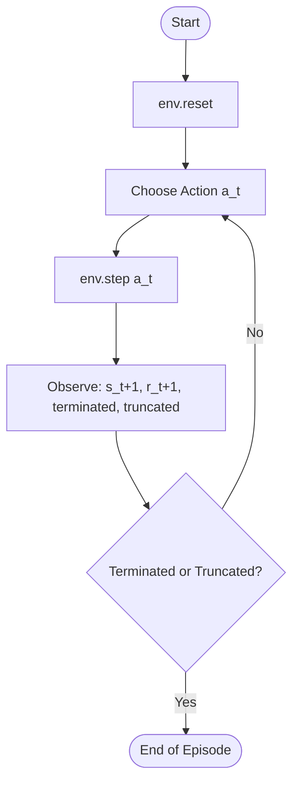

# Lecture 12: Practical DRL Implementation Frameworks (Gymnasium & SLM Lab)

In the theoretical study of Reinforcement Learning, we often assume clean mathematical formulations of state transitions, actions, and rewards. However, implementing these concepts in code requires robust, standardized software frameworks. 

This lecture covers the two primary reinforcement learning libraries used in the companion literature:
1. **Gymnasium** (formerly OpenAI Gym): The industry-standard API for defining and interacting with environments.
2. **SLM Lab**: A modular PyTorch framework designed by Laura Graesser and Wah Loon Keng to implement, evaluate, and scale deep RL algorithms.

---

## 1. Introduction to Gymnasium

**Gymnasium** is a maintained fork of OpenAI's pioneering `gym` library, hosted by the Farama Foundation. It serves as an **environment API**—it does not contain code for training agents or neural networks. Instead, it provides a clean, standardized wrapper around games, physics simulators, and custom tasks.

### 1.1 Core API and Lifecycle
Any Gymnasium-compatible environment implements a standard lifecycle:



#### Key API Methods:
1. `env = gym.make(env_id)`: Instantiates a pre-registered environment (e.g., `"CartPole-v1"`).
2. `observation, info = env.reset(seed=None)`: Resets the environment to its initial state.
3. `next_state, reward, terminated, truncated, info = env.step(action)`: Transitions the environment using the chosen action.
   * `terminated`: True if the agent reaches a terminal state (e.g., falling in a hole, winning a game).
   * `truncated`: True if the episode ends due to an external limit (e.g., maximum step limit reached).
4. `env.render()`: Visualizes the environment.
5. `env.close()`: Closes the environment windows and frees resources.

### 1.2 Space Types
To allow agents to inspect what actions they can take and what states they will receive, Gymnasium uses standardized space objects:
* **`Discrete(n)`**: A discrete space of $n$ integer actions or states $\{0, 1, \dots, n-1\}$.
* **`Box(low, high, shape)`**: A continuous multidimensional space bounded by `low` and `high`.
* **`Dict` / `Tuple`**: Structured spaces combining multiple discrete and continuous variables.

#### Example: Standard Gymnasium Interaction Loop
```python
import gymnasium as gym

# Create the environment
env = gym.make("CartPole-v1", render_mode="human")

# Reset the environment to begin
state, info = env.reset(seed=42)
total_reward = 0

for step in range(200):
    # Select a random action from the environment's action space
    action = env.action_space.sample()
    
    # Execute step
    next_state, reward, terminated, truncated, info = env.step(action)
    total_reward += reward
    
    # Check if episode is finished
    if terminated or truncated:
        print(f"Episode finished after {step+1} steps. Total Reward: {total_reward}")
        break
        
    state = next_state

env.close()
```

---

## 2. Introduction to SLM Lab

While Gymnasium handles the *environment*, **SLM Lab** (Single-agent Multi-agent Reinforcement Learning Lab) handles the *agent* and the *experimentation workflow*. Developed by Laura Graesser and Wah Loon Keng, it is the official companion codebase for the book *Foundations of Deep Reinforcement Learning*.

### 2.1 The Experimentation Hierarchy
SLM Lab structures RL research into a clear hierarchy to ensure reproducibility and clean hyperparameter sweeping:

1. **Session**: A single run of an agent training on an environment with a fixed random seed.
2. **Trial**: A group of sessions running the exact same configuration but with different random seeds. This allows the framework to compute average performance graphs with standard deviation bands, ensuring statistical significance.
3. **Experiment**: The top-level container, defined by a single configuration file. It can execute multiple trials to search across different hyperparameters (e.g., comparing learning rates $10^{-3}$ vs. $10^{-4}$).

### 2.2 Core Software Components
SLM Lab divides the agent-environment loop into distinct Python modules:
* **Agent**: The primary wrapper containing the `Algorithm` (e.g., DQN, PPO), the `Memory` (e.g., ReplayBuffer), and the neural network `Net`.
* **Env**: A wrapper around Gymnasium/Unity environments that normalizes states, actions, and rewards for the Agent.
* **Memory**: Experience storage buffers (e.g., `Replay`, `PrioritizedReplay`, `OnPolicyReplay`).
* **Net**: Modular PyTorch neural network subclasses (e.g., feedforward, recurrent, dueling heads).

---

## 3. Comparison: Gymnasium vs. SLM Lab

Understanding where Gymnasium ends and SLM Lab begins is crucial for deep reinforcement learning design:

| Feature | Gymnasium | SLM Lab |
| :--- | :--- | :--- |
| **Primary Focus** | Environment specification & standardization. | Agent algorithms, training, & hyperparameter search. |
| **Developer** | OpenAI (original), Farama Foundation (current). | Laura Graesser & Wah Loon Keng. |
| **Boilerplate Handler** | None. Only handles step-by-step simulator progression. | Handles neural network setup, logging, plotting, and training loops. |
| **Algorithms** | None. | Out-of-the-box PyTorch implementations (DQN, A2C, PPO, etc.). |
| **Control Logic** | User must write the training loop (`while not done: step()`). | Framework provides the control loop automatically via `Session.run_episode()`. |
| **Configuration** | Configured programmatically in Python code. | Configured via JSON "spec" files to ensure reproducibility. |

### How they fit together:
```
+-------------------------------------------------------------+
|                        SLM Lab                              |
|                                                             |
|  +--------------------+             +--------------------+  |
|  |       Agent        |             |    Session Loop    |  |
|  |                    |             |                    |  |
|  |  [Algorithm (PPO)] |             |  for episode in E: |  |
|  |  [Memory Buffer]   |  Surrogate  |    for step in T:  |  |
|  |  [PyTorch Net]     |   Rewards   |      ...           |  |
|  +---------+----------+             +---------+----------+  |
|            | Action                           ^             |
|            v                                  | State/Reward|
+------------+----------------------------------+-------------+
             |                                  |              
             |             Gymnasium            |              
             |      +--------------------+      |              
             +----->|  Environment API   |------+              
                    |  (e.g. CartPole)   |                     
                    +--------------------+                     
```

---

## 4. Major Implementations in the Laura Graesser Book

The book *Foundations of Deep Reinforcement Learning* walks through implementations of major DRL algorithms, mapping directly to modular components in the **`SLM-Lab`** repository.

Below is a reference guide mapping the book's chapters and sections to the actual code files inside the framework:

### Summary Matrix of Book Implementations

| Algorithm | Book Chapter & Section | SLM Lab Code Path | Key Implementation Focus |
| :--- | :--- | :--- | :--- |
| **REINFORCE** | Chapter 2, Sections 2.3–2.6 | [`slm_lab/agent/algorithm/reinforce.py`](https://github.com/kengz/SLM-Lab/blob/master/slm_lab/agent/algorithm/reinforce.py) | Policy gradient theorem, Monte Carlo return calculation, action log-probabilities. |
| **SARSA** | Chapter 3, Sections 3.2–3.4 | [`slm_lab/agent/algorithm/sarsa.py`](https://github.com/kengz/SLM-Lab/blob/master/slm_lab/agent/algorithm/sarsa.py) | On-policy temporal difference value iteration, epsilon-greedy action selection. |
| **DQN** | Chapter 4, Sections 4.2–4.5 | [`slm_lab/agent/algorithm/dqn.py`](https://github.com/kengz/SLM-Lab/blob/master/slm_lab/agent/algorithm/dqn.py) | Experience replay buffer, target network updates, Huber/MSE loss. |
| **DQN Improvements** | Chapter 5, Sections 5.2–5.5 | [`slm_lab/agent/algorithm/dqn.py`](https://github.com/kengz/SLM-Lab/blob/master/slm_lab/agent/algorithm/dqn.py) | Double DQN, Dueling DQN network heads, Prioritized Experience Replay (PER). |
| **Advantage Actor-Critic** | Chapter 6, Sections 6.2–6.6 | [`slm_lab/agent/algorithm/actor_critic.py`](https://github.com/kengz/SLM-Lab/blob/master/slm_lab/agent/algorithm/actor_critic.py) | Combined policy-value losses, n-step bootstrapping advantage calculation. |
| **PPO** | Chapter 7, Sections 7.2–7.6 | [`slm_lab/agent/algorithm/ppo.py`](https://github.com/kengz/SLM-Lab/blob/master/slm_lab/agent/algorithm/ppo.py) | Clipped surrogate objective, generalized advantage estimation (GAE). |

---

### 4.1 Detailed Breakdown of Code Implementations

#### A. REINFORCE (Chapter 2, Sections 2.3 - 2.6)
* **Mathematical Concept:** 
  $$ \theta_{t+1} \leftarrow \theta_t + \alpha G_t \nabla_{\theta} \ln \pi(A_t | S_t, \theta) $$
* **Code Implementation (`reinforce.py`):**
  * `class Reinforce(Algorithm)`: Subclasses the base algorithm class.
  * `train()`: Loops over the collected episode, computes discounted rewards $G_t$ backwards from the terminal state, and executes backpropagation on the loss:
    ```python
    policy_loss = -torch.mean(log_probs * gains)
    ```
  * `act(state)`: Feeds the state through the neural network to output probabilities, instantiates a PyTorch `Categorical` distribution, and samples an action.

#### B. Deep Q-Networks & Extensions (Chapters 4 & 5)
* **Mathematical Concept:** 
  $$ L(\theta) = \mathbb{E} \left[ \left( R + \gamma \max_{a'} Q(S', a'; \theta^-) - Q(S, A; \theta) \right)^2 \right] $$
* **Code Implementation (`dqn.py`):**
  * `class DQN(Algorithm)`: Manages the Q-Network and Target Network ($\theta^-$).
  * `train_step()`: Samples a batch from the replay buffer. Computes target values using the frozen target net, evaluates current state action-values using the online Q-net, and updates weights.
  * **Double DQN Support (Sec 5.2):** Switches action selection to the online network and action evaluation to the target network:
    ```python
    # Double DQN Target Calculation
    online_actions = self.net(next_states).argmax(dim=1)
    target_q = self.target_net(next_states).gather(1, online_actions)
    ```
  * **Dueling DQN Support (Sec 5.3):** Configured via network head selections, separating representation into State Value $V(s)$ and Action Advantage $A(s,a)$.

#### C. Advantage Actor-Critic (Chapter 6, Sections 6.2 - 6.6)
* **Mathematical Concept:**
  $$ L(\theta) = L_{\text{policy}}(\theta) + c_1 L_{\text{value}}(\theta) - c_2 \mathcal{H}(\pi_{\theta}) $$
* **Code Implementation (`actor_critic.py`):**
  * `class ActorCritic(Algorithm)`: Handles combined models (shared body with policy/value output heads) or separate models.
  * `train()`: Computes generalized n-step TD targets, estimates advantage $A(s,a) = Q(s,a) - V(s)$, and calculates the joint loss including policy entropy bonus.

---

## Practice Exercises

Test your understanding of DRL libraries and the book's implementations with these exercises:

- [Multiple Choice Questions (MCQs)](./assets/questions/mcqs.md)
- [Subjective Questions](./assets/questions/subjective.md)
- [Numerical Questions](./assets/questions/numericals.md)
- [Programming Questions](./assets/questions/programming.md)

*Solutions can be found in the [assets/questions/solutions/](./assets/questions/solutions/) folder.*
