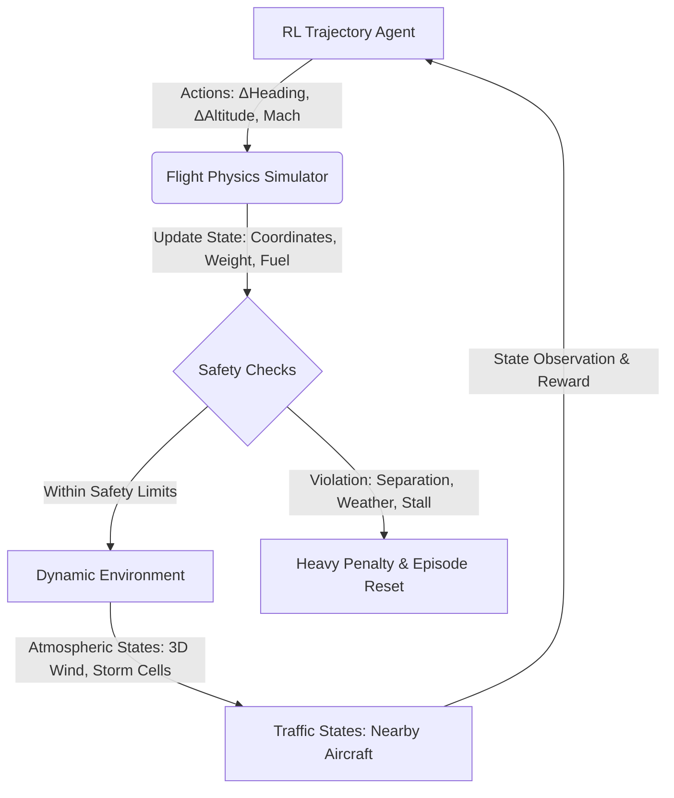

# Lecture 13: Reinforcement Learning in Aerospace and Airline Operations

In this lecture, we apply the foundational reinforcement learning concepts from Lectures 1–12 to a highly complex, real-world domain: **Airline Operations and Flight Trajectory Optimization**. Specifically, we will detail a problem statement for **Tactical 4D Trajectory-Based Operations (TBO) under Stochastic Wind and Dynamic Airspace Constraints (Tail Management)**, and then formally translate it into a Markov Decision Process (MDP) framework.

---

## 1. Domain Context & The Operational Challenge

Modern airline operations are subject to a complex, multi-dimensional optimization space where safety is paramount, but efficiency directly dictates profitability and environmental footprint. A single commercial flight must balance:
* **Fuel Efficiency & Carbon Emissions:** Jet fuel accounts for approximately 30% of airline operating costs. Minimizing fuel burn directly correlates with reduced $CO_2$ emissions.
* **Weather Dynamics:** Atmospheric conditions—specifically non-stationary wind fields (headwinds, tailwinds, crosswinds), jet streams, turbulence, and convective weather (thunderstorms)—dynamically alter the optimal route.
* **Air Traffic & Congestion:** Flight paths are constrained by Air Traffic Control (ATC), active airspace sectors, and the density of neighboring traffic, requiring conflict detection and resolution (CD&R).
* **Trajectory-Based Operations (TBO):** Moving from traditional waypoint-to-waypoint navigation to 4D Trajectories (3D spatial coordinates + time) where the aircraft must meet specific Arrival Time Agreements (ATAs) at predefined metering fixes.

### Tail Management vs. Fleet Management
* **Fleet Management (Strategic):** Focuses on network-wide scheduling, crew assignments, and aircraft routing over days/weeks.
* **Tail Management (Tactical):** Focuses on optimizing the real-time flight trajectory of a specific, individual aircraft (identified by its unique tail number) from gate to gate, adapting dynamically to local perturbations.

---

## 2. Detailed Problem Statement

### Objective
Design an autonomous flight trajectory optimization system for a single aircraft (Tail Management) that determines the optimal **lateral path** (heading changes), **vertical profile** (step climbs), and **speed schedule** (Mach number/cost index) in real-time. 

The objective is to minimize total trip cost (a combination of fuel consumption and arrival delay) while satisfying safety constraints: keeping a minimum separation from other traffic, avoiding convective weather cells, and adhering to the structural/aerodynamic limits of the aircraft.

### Environment & Constraints
1. **Dynamic Wind Field:** 3D wind vectors $\vec{w}(x,y,z,t)$ that vary with latitude, longitude, altitude, and time.
2. **Convective Weather Cells:** Non-stationary regions of storm activity modeled as stochastic, moving, impenetrable obstacles with varying altitudes.
3. **Air Traffic (Separation Assurance):** Surrounding aircraft that must not enter the protected zone around our aircraft (typically $5\text{ NM}$ laterally and $1000\text{ ft}$ vertically).
4. **Aircraft Dynamics:** Aerodynamic limits, drag polar curves, and fuel flow rates governed by atmospheric density, aircraft weight, thrust settings, and speed.

---

## 3. Markov Decision Process (MDP) Formulation

To apply the RL algorithms from Lectures 1–12, we formulate the tactical flight trajectory optimization problem as a discounted MDP defined by the tuple $\langle S, A, P, R, \gamma \rangle$.

### A. State Space ($S$)
The state vector $s_t \in S$ at time step $t$ must fully capture the kinematics of the aircraft, the status of the flight mission, and the relevant local environment:

$$s_t = \begin{bmatrix} s_{\text{kin}} & s_{\text{env}} & s_{\text{tfc}} & s_{\text{msn}} \end{bmatrix}^T$$

1. **Aircraft Kinematics ($s_{\text{kin}}$):**
   * Latitude and longitude: $(x_t, y_t)$
   * Altitude: $h_t$
   * True Airspeed (TAS): $V_{\text{tas}, t}$
   * Heading angle: $\psi_t$
   * Current aircraft mass: $m_t$ (decreases over time as fuel is burned)
2. **Environmental Conditions ($s_{\text{env}}$):**
   * Local wind vector: $\vec{w}_t = [w_x, w_y, w_z]$
   * Relative distance and bearing to the nearest convective weather cell boundary: $(d_{\text{storm}}, \theta_{\text{storm}})$
   * Turbulence intensity index: $I_{\text{turb}}$
3. **Airspace Traffic ($s_{\text{tfc}}$):**
   * Relative position and velocity vectors of the $N$ closest aircraft within a $50\text{ NM}$ radius: $(\Delta x_i, \Delta y_i, \Delta h_i, \Delta v_x, \Delta v_y, \Delta v_h)$ for $i \in \{1, \dots, N\}$.
4. **Mission Progress & Objectives ($s_{\text{msn}}$):**
   * Distance to destination airport: $d_{\text{dest}}$
   * Time remaining to scheduled arrival time: $\Delta t_{\text{sched}} = t_{\text{scheduled}} - t_{\text{current}}$
   * Remaining fuel reserve indicator: $F_{\text{reserve}} = m_{\text{fuel}} - m_{\text{required\_reserve}}$

### B. Action Space ($A$)
We can define the action space $a_t \in A$ in two ways depending on the algorithm type:

#### Option 1: Continuous Action Space (Suitable for Policy Gradient / Actor-Critic)
The agent outputs precise steering commands:

$$a_t = \begin{bmatrix} \phi_t & v_{z, t} & M_t \end{bmatrix}^T$$

* **Bank Angle ($\phi_t \in [-\phi_{\max}, \phi_{\max}]$):** Controls lateral heading changes.
* **Vertical Rate ($v_{z, t} \in [v_{z,\min}, v_{z,\max}]$):** Target rate of climb or descent.
* **Target Mach Number ($M_t \in [M_{\min}, M_{\max}]$):** Controls the speed profile.

#### Option 2: Discrete Action Space (Suitable for Value-Based / Q-Learning)
The agent selects from a finite set of tactical maneuvers:

$$a_t \in \{a_{\text{lateral}} \times a_{\text{vertical}} \times a_{\text{speed}}\}$$

* **Lateral ($a_{\text{lateral}}$):** $\{-5^\circ \text{ turn left}, \text{Maintain heading}, +5^\circ \text{ turn right}\}$
* **Vertical ($a_{\text{vertical}}$):** $\{\text{Climb } 2000\text{ ft (Step Climb)}, \text{Maintain altitude}, \text{Descend } 2000\text{ ft}\}$
* **Speed ($a_{\text{speed}}$):** $\{\text{Increase } 0.01\text{ Mach}, \text{Maintain speed}, \text{Decrease } 0.01\text{ Mach}\}$

### C. Transition Dynamics ($P$)
The state transitions $P(s_{t+1} \mid s_t, a_t)$ combine deterministic physics and stochastic weather/traffic updates:

1. **Deterministic Equations of Motion (Flight Dynamics):**
   * The new coordinates $(x_{t+1}, y_{t+1}, h_{t+1})$ are computed using the aircraft's airspeed $V_{\text{tas}}$ projected onto the heading $\psi$, adjusted by the wind vector $\vec{w}$.
   * The mass transition is deterministic based on engine fuel flow $\dot{m}_f$:
     $$m_{t+1} = m_t - \dot{m}_f(h_t, V_{\text{tas}, t}, T_t) \cdot \Delta t$$
     where thrust $T_t$ depends on drag $D(h, V_{\text{tas}}, m)$ and climb/descent angle.
2. **Stochastic Atmospheric Updates:**
   * Wind speeds $\vec{w}_{t+1}$ follow a Markovian spatial-temporal correlation model (e.g., Vector Autoregression over weather forecast grids).
   * Convective weather cell growth, dissipation, and trajectory are stochastic processes.
3. **Stochastic Traffic Behavior:**
   * Neighboring aircraft follow their own flight plans with localized variations, representing a stochastic environment.

### D. Multi-Objective Reward Function ($R$)
To balance efficiency, delays, and safety, we design a composite reward function:

$$R(s_t, a_t, s_{t+1}) = R_{\text{fuel}} + R_{\text{delay}} + R_{\text{safety}} + R_{\text{smooth}} + R_{\text{terminal}}$$

1. **Fuel Consumption Penalty ($R_{\text{fuel}}$):**
   $$R_{\text{fuel}} = -C_{\text{fuel}} \cdot \dot{m}_f \cdot \Delta t$$
   *Directly penalizes fuel burn. $C_{\text{fuel}}$ is a scaling coefficient.*

2. **Time and Delay Penalty ($R_{\text{delay}}$):**
   $$R_{\text{delay}} = -C_{\text{time}} \cdot \Delta t - C_{\text{delay\_penalty}} \cdot \max(0, t_{\text{current}} - t_{\text{scheduled}})$$
   *Penalizes flight duration and landing past the scheduled ETA.*

3. **Safety Violations (Hard Constraints) ($R_{\text{safety}}$):**
   * **Separation Loss:** If distance to any neighboring aircraft $d_i < 5\text{ NM}$ and vertical separation $\Delta h_i < 1000\text{ ft}$:
     $$R_{\text{conflict}} = -C_{\text{collision\_hazard}}$$
   * **Weather Penetration:** If aircraft coordinates overlap with active convective weather cells:
     $$R_{\text{weather}} = -C_{\text{storm\_penalty}}$$
   * **Flight Envelope Violation:** If airspeed violates structural speeds or stall margins ($V_{\text{stall}} < V_{\text{tas}} < V_{\text{mo}}$):
     $$R_{\text{envelope}} = -C_{\text{stall\_hazard}}$$

4. **Control Smoothness Penalty ($R_{\text{smooth}}$):**
   $$R_{\text{smooth}} = -C_{\text{chatter}} \cdot (|\phi_t - \phi_{t-1}| + |M_t - M_{t-1}|)$$
   *Prevents rapid, oscillatory maneuvers that cause passenger discomfort and engine wear.*

5. **Terminal Reward ($R_{\text{terminal}}$):**
   $$R_{\text{terminal}} = 
   \begin{cases} 
   +R_{\text{destination\_reached}} & \text{if reached destination airport safely} \\
   -R_{\text{crash\_penalty}} & \text{if environment terminated due to envelope/safety failure}
   \end{cases}$$

### E. Discount Factor ($\gamma$)
* **$\gamma \in [0.99, 0.999]$:** A value close to 1.0 is required because tactical flight trajectory planning is a long-horizon problem. Early actions (e.g., executing a lateral storm detour or performing an early step-climb to a higher altitude when fuel weight is reduced) have cumulative effects over hours of flight time.

---

## 4. Mapping the Formulation to Lectures 1–12 Algorithms

To solve this MDP, we leverage the theoretical foundations established across the preceding modules:

### 1. The Dynamic Programming Limitation (Lecture 3)
* **Concept:** DP methods like Policy Iteration and Value Iteration solve the Bellman optimality equation directly.
* **Why it fails here:** The transition dynamics $P(s_{t+1} \mid s_t, a_t)$ involving chaotic weather cell paths and multi-aircraft traffic are mathematically intractable to write analytically. Furthermore, the state space $S$ is continuous and high-dimensional, rendering tabular discretization impossible due to the **Curse of Dimensionality**. We must use model-free RL.

### 2. Value-Based Deep RL (Lecture 8: DQN / DDQN / PER)
* **Application:** If we model the action space discretely (discrete speed, altitude, and heading adjustments), we can apply **Double DQN (DDQN)** with **Dueling architectures** to map states to Q-values.
* **Prioritized Experience Replay (PER):** Critical events like near-miss separation conflicts or sudden storm cell formations occur rarely in a simulator. Standard experience replay would wash these out. PER ensures the agent trains intensively on these high-surprise, safety-critical transitions.

### 3. Policy Gradient & Actor-Critic (Lectures 9 & 10: PPO)
* **Application:** Continuous action spaces (precise bank angles and Mach numbers) require policy optimization. We parameterize a stochastic policy $\pi_\theta(a \mid s)$ (Actor) and a value function $V_\phi(s)$ (Critic).
* **The Necessity of PPO:** Commercial aircraft flight control cannot tolerate large, erratic changes in policy parameters (destructive updates) because a single bad step could cause the simulated aircraft to consistently stall or crash, destroying the data collection quality. PPO’s **clipped surrogate objective** guarantees stable, monotonic policy improvements.

### 4. Advanced & Multi-Agent Formulations (Lecture 11)
* **Continuous Control (SAC):** Soft Actor-Critic can be applied to maximize both the expected return (fuel efficiency) and policy entropy, ensuring the aircraft discovers alternative wind routing channels.
* **Multi-Agent RL (MARL):** In a fleet context, we can transition from tail management to joint airspace management. Each aircraft is an agent trying to maximize its own fuel efficiency (egoistic reward) while cooperatively interacting to maintain decentralized separation assurance, requiring coordination mechanisms like Dec-POMDPs.

---

## 5. Recommended Approach: Why PPO Suits Best

Among the formulations discussed, the **Continuous Action State MDP solved via Proximal Policy Optimization (PPO)** is the most suitable approach for tactical trajectory optimization. Here is a comparative justification:

### A. Why Continuous Actions (PPO) Outperform Discrete Actions (DQN)
1. **Chatter and Fuel Inefficiency:** Discretizing the steering control (e.g., heading changes in $\pm 5^\circ$ increments or speed changes in $\pm 0.01$ Mach steps) forces the aircraft to oscillate around the true optimal path. This path "chatter" increases aerodynamic drag, passenger discomfort, and engine wear, triggering high penalties in the smoothness reward ($R_{\text{smooth}}$).
2. **Smooth Flight Profiles:** Continuous action algorithms (like PPO) output direct Gaussian mean values for bank angle, vertical speed, and Mach number. This allows the agent to execute smooth, fine-grained curves and gradual altitude transitions, maximizing aerodynamic lift-to-drag ratios.

### B. Why PPO Outperforms Off-Policy Algorithms (DDPG / SAC)
1. **Safety Constraints and Policy Collapse:** In off-policy algorithms (like DDPG or SAC), the policy is updated using transition data collected by older policies stored in a replay buffer. While sample-efficient, this can lead to policy instability or collapse when the state distribution shifts. In flight control, a single highly unstable update could command a roll angle or airspeed that violates structural limits, ending training runs.
2. **The Clipped Trust Region:** PPO restricts the policy ratio $r_t(\theta) = \frac{\pi_\theta(a_t|s_t)}{\pi_{\theta_{\text{old}}}(a_t|s_t)}$ within $[1-\epsilon, 1+\epsilon]$. This trust region ensures that even when the network receives noisy gradients (common in turbulent conditions or near conflicts), the policy changes incrementally and safely, preserving the learned flight envelope stability.
3. **Training Stability in Stochastic Environments:** Winds and convective cells introduce highly stochastic transitions. Value-based methods (DQN) and off-policy actor-critics (DDPG) are prone to Q-value overestimation under high noise. PPO’s on-policy training, combined with Generalized Advantage Estimation (GAE) for variance reduction, handles the high stochasticity of flight routing more robustly.

### C. Recommended Implementation Strategy
To solve the tactical trajectory problem, the recommended approach is:
1. **Algorithm:** PPO (Actor-Critic) with shared feature extraction layers.
2. **State representation:** Normalize all values. Use relative vectors for target locations and threats (storms, traffic) rather than absolute coordinates to improve spatial generalization.
3. **Reward Shaping:** Start with a dominant weight on safety ($R_{\text{safety}}$ and $R_{\text{terminal}}$) to teach the agent to fly safely. Once the agent survives episodes consistently, decay the safety reward scaling slightly and increase the weight of efficiency ($R_{\text{fuel}}$) to fine-tune energy and delay optimization.

