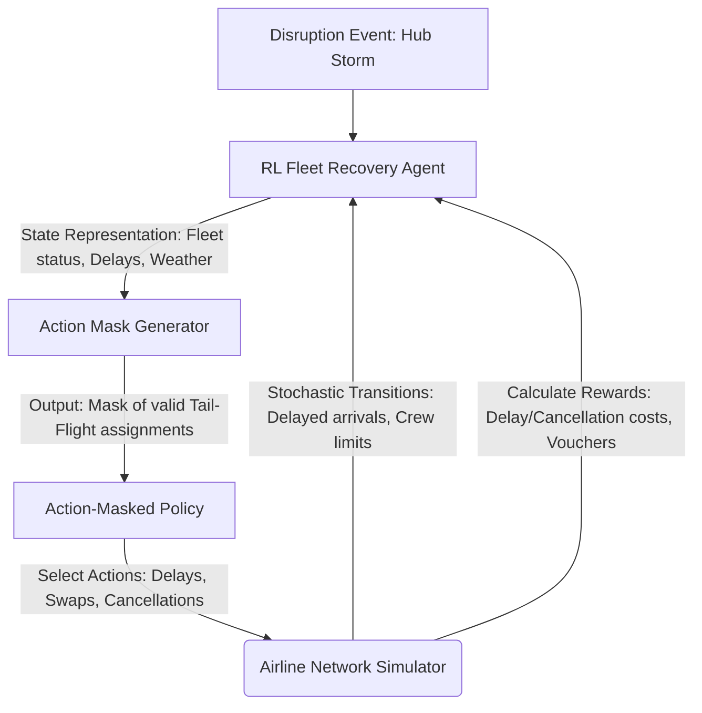

# Lecture 13.2: Reinforcement Learning in Fleet Management and Disruption Recovery

In this lecture, we transition from the micro-level control of a single aircraft (Tail Management, detailed in [Lecture 13.1](file:///c:/github/drl/barto-sutton-graesser-keng/lecture13-aero/lecture13.1-tail-mgmt.md)) to the macro-level optimization of an airline network: **Fleet Management and Tactical Disruption Recovery using Reinforcement Learning**.

---

## 1. Domain Context & The Operational Challenge

An airline's fleet schedule is a massive jigsaw puzzle. Months in advance, airlines solve the **Airline Scheduling Problem** using Mixed-Integer Linear Programming (MILP) or Column Generation to optimize flight pairings, tail assignments, and crew schedules. 

However, during daily operations, the schedule is constantly disrupted by:
* **Convective weather** causing airport capacity drops (e.g., ground delay programs).
* **Unscheduled maintenance** grounding aircraft (AOG - Aircraft on Ground).
* **Downstream delay propagation** (e.g., a delayed flight from Boston propagates crew/aircraft delays to Chicago, Dallas, and Los Angeles).

When these disruptions occur, the pre-planned schedule becomes infeasible. The airline enters **Disruption Recovery (Irregular Operations - IROPS)**. Fleet managers must make rapid decisions:
* Which flights should be delayed, and by how long?
* Which flights must be cancelled to prevent network-wide gridlock?
* How should aircraft be re-routed (tail swapping) to ensure they visit maintenance hubs as required by regulations?
* How can passenger misconnections and crew duty limit violations be minimized?

### Why Reinforcement Learning?
Traditional operations research (OR) solvers struggle with the dynamic disruption recovery problem because:
1. **Combinatorial Explosion:** The number of decision variables scales exponentially with the number of airports, aircraft, and flights.
2. **Slow Computation Time:** Solvers can take minutes or hours to find an optimal recovery plan. In live operations, decisions must be made in seconds.
3. **Stochasticity:** Solvers assume deterministic futures. RL agents can learn policies that are robust to stochastic weather duration and variable flight transit times.

---

## 2. Detailed Problem Statement

### Objective
Design an intelligent agent to solve the **Tactical Disruption Recovery and Tail Routing Problem**. The agent acts as a network controller. Given a fleet of $M$ aircraft (tails) and a set of scheduled flights $F$ across a network of $N$ airports, the agent dynamically swaps aircraft, delays departures, or cancels flights to minimize operational losses over a 24-to-48-hour recovery window.

### Operational Constraints
1. **Flow Conservation:** An aircraft can only fly a flight from airport $A$ if it has landed and completed turnaround procedures at airport $A$.
2. **Maintenance Compliance:** Every aircraft tail $m$ has a remaining airworthiness flight-hour limit $H_{\text{rem}, m}$. It must visit a designated maintenance station before $H_{\text{rem}, m} \le 0$.
3. **Airport Slot Limits:** Airports have hourly limits on departures and arrivals, which drop stochastically due to weather.
4. **Crew & Passenger Bounds:** Flight schedules must respect maximum crew duty times and minimize passenger missed connections.

---

## 3. Markov Decision Process (MDP) Formulation

We formulate the fleet recovery and tail routing task as an episodic, action-masked MDP: $\langle S, A, P, R, \gamma \rangle$.

### A. State Space ($S$)
The state space must capture the instantaneous network state at any decision epoch $t$:

$$s_t = \{ \mathcal{F}_t, \mathcal{M}_t, \mathcal{A}_t, \mathcal{P}_t \}$$

1. **Flight Schedule Status ($\mathcal{F}_t$):**
   * For each scheduled flight $f \in F$: Origin, Destination, Scheduled Departure Time ($t_{\text{dep}, f}$), Scheduled Arrival Time ($t_{\text{arr}, f}$), Status (Scheduled, Active, Delayed, Cancelled), and Current Delay ($d_f$).
2. **Aircraft Fleet Status ($\mathcal{M}_t$):**
   * For each tail $m \in \{1, \dots, M\}$: Current/expected airport location ($loc_m$), Expected Time of Availability ($t_{\text{avail}, m}$), Remaining flying hours until required maintenance ($H_{\text{rem}, m}$), Passenger seat capacity ($C_m$), and Aircraft sub-fleet type (e.g., Boeing 737-800 vs. Airbus A320).
3. **Airport Hub Status ($\mathcal{A}_t$):**
   * For each airport $a \in \{1, \dots, N\}$: Current departure capacity $C_{\text{dep}, a}(t)$, Arrival capacity $C_{\text{arr}, a}(t)$, weather indicators, and number of aircraft parked at gates.
4. **Passenger & Crew Connections ($\mathcal{P}_t$):**
   * Total passenger volume booked on disrupted legs, estimated count of connection violations, and crew duty time buffers remaining.

### B. Action Space ($A$)
Due to the combinatorial structure of matching tails to flights, we define a **multi-discrete action space** at each decision epoch (whenever a disruption occurs or a flight completes):

$$a_t = \begin{bmatrix} a_{\text{routing}} & a_{\text{schedule}} \end{bmatrix}^T$$

1. **Tail-to-Flight Routing ($a_{\text{routing}}$):**
   * Assign aircraft tail $m$ to flight $f$, swap tails $m_1$ and $m_2$, or route tail $m$ to a maintenance station (ferry flight or schedule-swapped flight).
2. **Schedule Adjustments ($a_{\text{schedule}}$):**
   * Delay departure of flight $f$ by $\Delta t \in \{15, 30, 60, 120\}$ minutes, or Cancel flight $f$.

#### The Critical Need for Action Masking
In fleet routing, the vast majority of actions are physically impossible (e.g., assigning an Airbus A320 tail that is physically in Miami to a flight departing in Denver in 10 minutes). To prevent the RL agent from wasting training steps exploring invalid actions, we implement an **Action Mask** $M(s_t) \in \{0, 1\}^{|A|}$. 
The policy network outputs logits for all actions, but invalid actions are set to $-\infty$ prior to the softmax layer:

$$\pi(a_i \mid s_t) = \frac{e^{z_i} \cdot M_i(s_t)}{\sum_{j} e^{z_j} \cdot M_j(s_t)}$$

### C. Transition Dynamics ($P$)
Transitions $P(s_{t+1} \mid s_t, a_t)$ model the evolution of the airline network:
1. **Deterministic Propagation:**
   * Adjusting departure times shifts the availability window of the aircraft tail and crew to the arrival airport.
   * Flying hours are decremented: $H_{\text{rem}, m} \leftarrow H_{\text{rem}, m} - \text{Block Time}(f)$.
2. **Stochastic Perturbations:**
   * Actual flight block times vary due to dynamic en-route wind vectors.
   * Ground delays are stochastic, driven by weather cell duration at destination hubs.

### D. Multi-Objective Cost-Based Reward ($R$)
The reward function is formulated as a negative cost (penalty minimization):

$$R(s_t, a_t) = - \left( W_{\text{cancel}} \cdot C_{\text{cancel}} + W_{\text{delay}} \cdot C_{\text{delay}} + W_{\text{pax}} \cdot C_{\text{pax}} + W_{\text{maint}} \cdot C_{\text{maint}} + W_{\text{ferry}} \cdot C_{\text{ferry}} \right)$$

1. **Cancellation Cost ($C_{\text{cancel}}$):** Sum of fixed cancellation penalties (highly weighted, e.g., $-\$20,000$ per flight).
2. **Delay Cost ($C_{\text{delay}}$):** Linear-quadratic penalty on cumulative delay minutes:
   $$C_{\text{delay}} = \sum_{f} \left( \alpha_1 \cdot d_f + \alpha_2 \cdot d_f^2 \right)$$
3. **Passenger Disruption Cost ($C_{\text{pax}}$):** Costs associated with missed connections, overnight hotel vouchers, and passenger compensation.
4. **Maintenance Violation Penalty ($C_{\text{maint}}$):** An astronomical penalty ($-\infty$) if $H_{\text{rem}, m} < 0$.
5. **Ferry Flights ($C_{\text{ferry}}$):** Fuel and crew costs incurred when flying an empty aircraft to rebalance the network.

### E. Discount Factor ($\gamma$)
* **$\gamma \in [0.95, 0.98]$:** Unlike single-aircraft trajectories that require long-term horizons, fleet schedules restart on a weekly or daily basis. The optimization focus is short-to-medium term (24–48 hours) until the schedule naturally resets or buffers absorb the delays.

---

## 4. Mapping the Formulation to Lectures 1–12 Algorithms

Solving a combinatorial scheduling problem with RL requires specific architectural choices from the lectures:

### 1. Action-Masked Policy Gradients (Lecture 10: PPO)
* **Application:** Standard policy gradient methods will fail because random exploration leads to a $99.9\%$ rate of invalid flight-assignment actions. Combining **Action Masking** with **PPO** ensures that the actor only computes policy updates over physically feasible schedules. PPO is selected because it preserves the network stability during schedule updates.

### 2. Dueling Double DQN (Lecture 8)
* **Application:** In a value-based setting, a **Dueling architecture** is highly beneficial. The State-Value head $V(s)$ estimates the overall congestion level and passenger backlog of the airline network. The Advantage head $A(s, a)$ evaluates the relative value of choosing a specific tail swap or flight cancellation. Double Q-learning prevents the overestimation of scheduling actions in stochastic weather scenarios.

### 3. Hierarchical RL (Lecture 11: Options / Goal-Conditioned RL)
* **Application:** The action space is too large for a single flat agent. We divide the fleet problem into a **Hierarchical RL (HRL)** structure:
  * **High-Level Agent (Manager):** Operates on a hourly timescale. It determines routing flow targets (e.g., "Send 3 aircraft from Chicago to Dallas to cover the flight demand").
  * **Low-Level Agent (Worker):** Operates on a minute-by-minute timescale. It takes the flow target as a goal and assigns specific tails to individual flights, ensuring maintenance limits are met.

---

## 5. Recommended Approach: Why Hierarchical Action-Masked PPO Suits Best

For fleet-wide tactical disruption recovery, a **Hierarchical Action-Masked Actor-Critic system solved via PPO** is the recommended framework.

### Why this approach?
1. **Saves Solvers from Combinatorial Complexity:** A standard flat network controller cannot scale to 500 flights and 100 aircraft. Hierarchical separation reduces the action space size of each agent to a manageable dimension.
2. **Handles Strict Operational Rules:** Action masking guarantees that the agent never attempts to route a Boeing 737 to a flight requiring an Airbus A320, or assign a tail that is physically in another city.
3. **Explores Robust Recovery Policies:** PPO provides stable exploration of schedule alternatives, discovering complex, non-obvious tail-swapping sequences that free up blocked gates and route aircraft to maintenance hubs before violating FAA limits.
