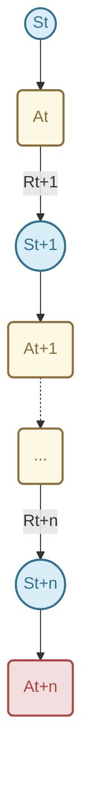
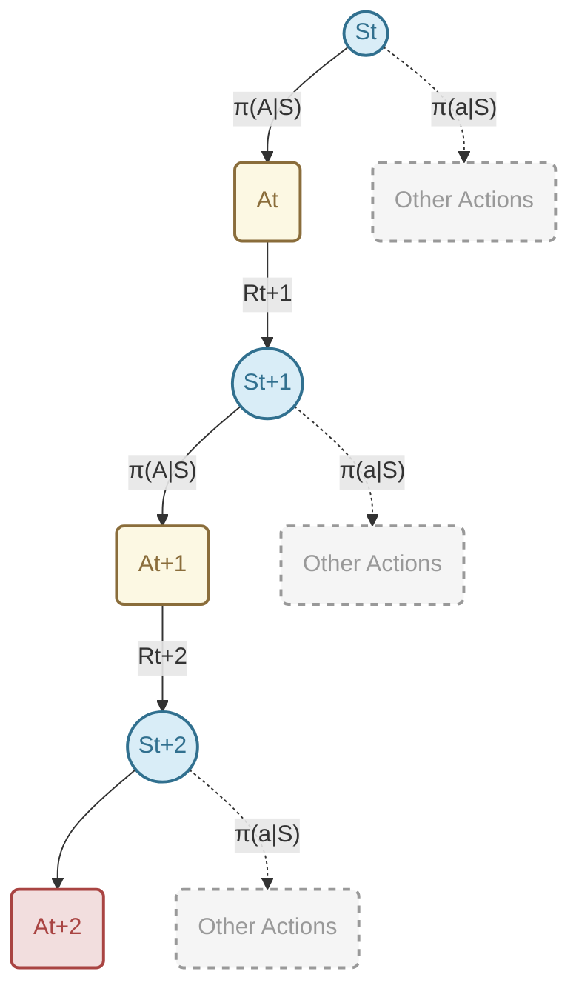
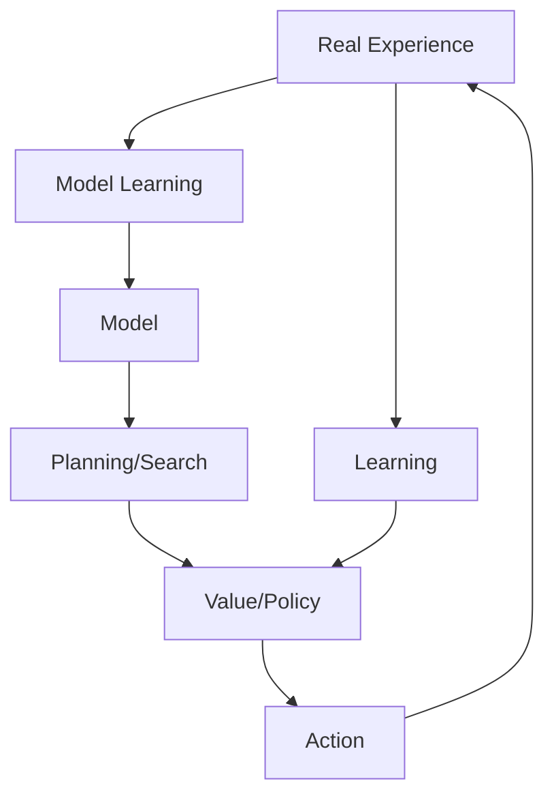

# Lecture 5: n-step Bootstrapping & Planning with Tabular Methods
**Date:** 2026-05-23  
**Reference:** Sutton & Barto, Chapters 7 & 8 (2nd Edition)

---

## Table of Contents
- [Lecture 5: n-step Bootstrapping \& Planning with Tabular Methods](#lecture-5-n-step-bootstrapping--planning-with-tabular-methods)
  - [Table of Contents](#table-of-contents)
- [Chapter 7: $n$-step Bootstrapping](#chapter-7-n-step-bootstrapping)
    - [7.1 Introduction: Bridging the Gap](#71-introduction-bridging-the-gap)
    - [7.2 From 1-step to $n$-step Returns](#72-from-1-step-to-n-step-returns)
      - [Visualizing Backup Diagrams](#visualizing-backup-diagrams)
    - [7.3 $n$-step TD Prediction](#73-n-step-td-prediction)
      - [Figure 7.2: 19-state Random Walk](#figure-72-19-state-random-walk)
    - [7.4 $n$-step Sarsa (Control)](#74-n-step-sarsa-control)
    - [7.5 $n$-step Off-policy Learning](#75-n-step-off-policy-learning)
      - [\*Per-decision Methods with Control Variates](#per-decision-methods-with-control-variates)
    - [7.6 The Tree Backup Algorithm](#76-the-tree-backup-algorithm)
    - [7.7 A Unifying Algorithm: $n$-step $Q(\sigma)$](#77-a-unifying-algorithm-n-step-qσ)
- [Chapter 8: Planning and Learning with Tabular Methods](#chapter-8-planning-and-learning-with-tabular-methods)
    - [8.1 Models and Planning](#81-models-and-planning)
    - [8.2 Dyna: Integrated Planning, Acting, and Learning](#82-dyna-integrated-planning-acting-and-learning)
      - [Figure 8.2: Dyna-Q Maze](#figure-82-dyna-q-maze)
    - [8.3 When the Model is Wrong](#83-when-the-model-is-wrong)
    - [8.4 Prioritized Sweeping](#84-prioritized-sweeping)
    - [8.5 Expected vs. Sample Updates](#85-expected-vs-sample-updates)
    - [8.6 Trajectory Sampling](#86-trajectory-sampling)
    - [8.7 Real-time Dynamic Programming (RTDP)](#87-real-time-dynamic-programming-rtdp)
    - [8.8 Planning at Decision Time](#88-planning-at-decision-time)
    - [8.11 Monte Carlo Tree Search (MCTS)](#811-monte-carlo-tree-search-mcts)
- [Summary: The Dimensions of Reinforcement Learning](#summary-the-dimensions-of-reinforcement-learning)
  - [Practice Exercises](#practice-exercises)

---

# Chapter 7: $n$-step Bootstrapping

n-step methods unify **Monte Carlo (MC)** and **Temporal-Difference (TD)** methods. Instead of updating based on just the next reward (1-step TD) or the entire episode (MC), we update based on $n$ steps of experience.

## 7.1 Introduction: Bridging the Gap

Before diving into $n$-step methods, let's briefly recall the two extreme approaches we've learned for Reinforcement Learning (RL):

1. **Monte Carlo (MC) Methods:** These methods learn from complete episodes. An update to a state or action value is only made after the episode finishes, using the *actual full return* $G_t$.
   - **Pros:** Unbiased estimate of the return.
   - **Cons:** High variance, requires episodic tasks, learning is slow (must wait for the end of the episode).
   
2. **Temporal Difference (TD) Learning / 1-Step Sarsa:** These methods update their estimates based on the very next state and its estimated value. They *bootstrap*. 
   - **Pros:** Can learn online (step-by-step), lower variance, works for continuing tasks.
   - **Cons:** Biased (initially), relies heavily on the accuracy of its current value estimates.

**The Big Question:** Why should we be forced to choose between looking exactly *1 step* ahead (TD) or looking *all the way to the end* (MC)? 

**The Answer ($n$-step bootstrapping):** We don't have to! We can choose any intermediate number of steps, say $n$. We can look 2 steps ahead, 5 steps ahead, or 10 steps ahead before bootstrapping. This creates a continuous spectrum between TD methods and Monte Carlo methods.

---

## 7.2 From 1-step to $n$-step Returns

Let's look at the "return" (the target we are trying to estimate) for different time horizons. 

*   **1-step return (TD):** $G_{t:t+1} = R_{t+1} + \gamma V_t(S_{t+1})$
*   **2-step return:** $G_{t:t+2} = R_{t+1} + \gamma R_{t+2} + \gamma^2 V_{t+1}(S_{t+2})$
*   **...**
*   **$n$-step return:** $G_{t:t+n} = R_{t+1} + \gamma R_{t+2} + \dots + \gamma^{n-1} R_{t+n} + \gamma^n V_{t+n-1}(S_{t+n})$
*   **Full return (MC):** $G_t = R_{t+1} + \gamma R_{t+2} + \dots + \gamma^{T-t-1} R_T$

Notice the pattern: An $n$-step return uses $n$ actual observed rewards, and then *bootstraps* (guesses) the rest of the return using the estimated value of the state we land in at step $n$. If $t+n \ge T$ (the end of the episode), the $n$-step return is simply the full MC return.

### Visualizing Backup Diagrams

Backup diagrams help us see how information flows backwards from future states to update a current state.

```mermaid
graph TD
    classDef state fill:#d9edf7,stroke:#31708f,stroke-width:2px,color:#31708f;
    classDef action fill:#fcf8e3,stroke:#8a6d3b,stroke-width:2px,color:#8a6d3b;
    classDef terminal fill:#dff0d8,stroke:#3c763d,stroke-width:2px,color:#3c763d;
    classDef bootstrap fill:#f2dede,stroke:#a94442,stroke-width:2px,color:#a94442;

    subgraph step1 [1-Step TD]
        S1((St)):::state --> A1(At):::action
        A1 -->|Rt+1| S2((St+1)):::bootstrap
    end
    
    subgraph stepn [n-Step TD]
        S1n((St)):::state --> A1n(At):::action
        A1n -->|Rt+1| S2n((St+1)):::state
        S2n --> A2n(At+1):::action
        A2n -->|Rt+2| S3n((St+2)):::state
        S3n --> A3n(At+2):::action
        A3n -->|Rt+3| S4n((St+3)):::bootstrap
    end

    subgraph stepmc [Monte Carlo]
        S1mc((St)):::state --> A1mc(At):::action
        A1mc -->|Rt+1| S2mc((St+1)):::state
        S2mc -.-> Amc(...):::action
        Amc -.-> STmc(Terminal):::terminal
    end
```


*(Red nodes indicate where bootstrapping occurs. Green nodes indicate a terminal state with no bootstrapping.)*

---

## 7.3 $n$-step TD Prediction

To estimate the state-value function $V(s)$ under a policy $\pi$, we use the $n$-step return as our target in the standard TD update rule:

$$V_{t+n}(S_t) \leftarrow V_{t+n-1}(S_t) + \alpha \big[ G_{t:t+n} - V_{t+n-1}(S_t) \big]$$

**Important Implementation Detail:** Notice the indices! We can't update $V(S_t)$ until we actually reach time $t+n$ (because we need to observe $n$ rewards). This means our algorithm must remember the last $n$ states, actions, and rewards in a buffer.

- **n=1:** Reduces to standard TD(0).
- **n=∞:** Reduces to Monte Carlo.
- **Error Reduction Property:** The n-step return is a better estimate of the true value than $V$ itself, with the error being reduced by at least $\gamma^n$.

### Algorithm: $n$-step TD for estimating $V \approx v_\pi$
```python
Initialize V(s) arbitrarily, V(terminal) = 0
Parameters: step size α ∈ (0, 1], n-step n > 0

Loop for each episode:
    Initialize and store S_0 (s_0 != terminal)
    T = ∞
    Loop for t = 0, 1, 2, ...:
        If t < T:
            Take action A_t according to policy π(·|S_t)
            Observe and store R_{t+1}, S_{t+1}
            If S_{t+1} is terminal:
                T = t + 1
        
        # τ is the time whose state's estimate is being updated
        τ = t - n + 1 
        If τ >= 0:
            Calculate n-step return:
            G = Σ_{i=τ+1}^{min(τ+n, T)} γ^{i-τ-1} R_i
            If τ + n < T:
                G = G + γ^n V(S_{τ+n}) # Bootstrap!
                
            V(S_τ) <- V(S_τ) + α[G - V(S_τ)]
            
    Until τ = T - 1
```

#### Figure 7.2: 19-state Random Walk
Intermediate values of $n$ (like $n=4$ or $n=8$) typically perform better than both 1-step TD and MC. This creates a "U-shaped" curve when plotting error against the step-size $lpha$.

```python
# From assets/n_step_td_random_walk.py
# Simulates Figure 7.2
```

---

## 7.4 $n$-step Sarsa (Control)

To actually find the optimal policy (control), we need action-values $Q(S, A)$ rather than state-values. We define the $n$-step return for action values exactly the same way, but we bootstrap with a $Q$-value at the end.

**$n$-step Action-Value Return:**
$$G_{t:t+n} = R_{t+1} + \gamma R_{t+2} + \dots + \gamma^{n-1} R_{t+n} + \gamma^n Q_{t+n-1}(S_{t+n}, A_{t+n})$$

**$n$-step Sarsa Update Rule:**
$$Q_{t+n}(S_t, A_t) \leftarrow Q_{t+n-1}(S_t, A_t) + \alpha \big[ G_{t:t+n} - Q_{t+n-1}(S_t, A_t) \big]$$

### The $n$-step Sarsa Backup Diagram


*(We estimate $Q(S_t, A_t)$ by taking $n$ steps, observing the rewards, and then bootstrapping with the estimated value of the $n$-th action $Q(S_{t+n}, A_{t+n})$)*

---

## 7.5 $n$-step Off-policy Learning

Remember off-policy learning? We want to evaluate a *target policy* $\pi$ while following a different *behavior policy* $b$. In Chapter 5 (MC), we used **Importance Sampling** to correct for the difference in probabilities between the two policies.

For $n$-step methods, we must do the same. If we take $n$ steps using policy $b$, the probability of that specific sequence of actions happening under policy $\pi$ might be vastly different.

We define the **Importance Sampling Ratio** for the $n$ steps from time $t$ to $t+n-1$:
$$\rho_{t:t+n-1} = \prod_{k=t}^{\min(t+n-1, T-1)} \frac{\pi(A_k|S_k)}{b(A_k|S_k)}$$

**Off-policy $n$-step Sarsa Update:**
$$Q_{t+n}(S_t, A_t) \leftarrow Q_{t+n-1}(S_t, A_t) + \alpha \rho_{t+1:t+n} \big[ G_{t:t+n} - Q_{t+n-1}(S_t, A_t) \big]$$

*Note:* If $\pi$ is greedy and $b$ is exploratory (e.g., $\epsilon$-greedy), the ratio $\rho$ will frequently be $0$ (whenever the behavior policy takes an exploratory action that the greedy target policy would never take). When $\rho=0$, learning on that sequence completely stops! This leads to high variance and slow learning. Is there a better way? Yes!

### *Per-decision Methods with Control Variates
A more sophisticated way to handle off-policy n-step learning that reduces variance by applying importance sampling to individual rewards rather than the whole return.

---

## 7.6 The Tree Backup Algorithm (Off-policy without Importance Sampling)

The Tree Backup Algorithm is a brilliant way to do off-policy learning over multiple steps *without* the high variance of importance sampling.

**The Core Idea:** Instead of just looking at the single trajectory actually taken by the agent, at every intermediate step, we factor in the *expected* value of all the actions we *didn't* take, weighted by their probability under the target policy $\pi$.

### The Tree Backup Diagram



*   At the "leaves" of the tree (the actions we didn't take), we use their current estimated $Q$-values.
*   For the main "trunk" of the tree (the action we actually took), we use the actual observed reward.
*   This is essentially extending **Expected Sarsa** to $n$ steps!

Because we are explicitly multiplying the values of the unselected actions by their probabilities under the target policy $\pi$, we are calculating the true expectation under $\pi$. We don't need to reweight the actual trajectory with an importance sampling ratio. 

---

## 7.7 A Unifying Algorithm: $n$-step $Q(\sigma)$

We now have two different ways to handle the intermediate steps in an $n$-step return:
1.  **Sample it:** Just take the value of the action actually chosen ($n$-step Sarsa).
2.  **Expect it:** Take the expected value over all possible actions (Tree Backup).

What if we want to mix them? Sutton and Barto introduce $n$-step $Q(\sigma)$. 

Let $\sigma_t \in [0, 1]$ be a parameter chosen at each time step $t$:
*   If **$\sigma_t = 1$**: We do full sampling (like Sarsa).
*   If **$\sigma_t = 0$**: We do full expectation (like Tree Backup / Expected Sarsa).

By varying $\sigma_t$ at each step, $Q(\sigma)$ unifies $n$-step Sarsa, Tree Backup, and Expected Sarsa into a single, highly generalized algorithm. We can dynamically decide whether to sample (which is fast but noisy) or to take the expectation (which is slower to compute but lower variance) step-by-step!

### Summary for Students

When deciding on a learning algorithm, remember these tradeoffs:
1. **Depth ($n$):** 1-step is too biased; MC ($\infty$-step) is too high variance. The optimal $n$ is usually an intermediate value (like $n=3$ or $n=4$).
2. **On-policy vs Off-policy:** Do you want to learn the policy you are currently executing (On-policy Sarsa) or learn the optimal policy while exploring safely (Off-policy)?
3. **Variance Reduction:** If doing Off-policy, Importance Sampling has huge variance. Tree Backup or Expected Sarsa are much safer, stable choices.

The beauty of $n$-step methods is that they give us the "knobs" ($n$ and $\sigma$) to tune our algorithm perfectly for the specific problem at hand!


# Chapter 8: Planning and Learning with Tabular Methods

This chapter integrates **learning** (from real experience) and **planning** (from simulated experience using a model).

### 8.1 Models and Planning
- **Distribution Model:** Provides the full probability distribution $p(s', r \mid s, a)$.
- **Sample Model:** Provides a single sample $(s', r)$ following the distribution.
- **Planning:** Any process that takes a model as input and produces or improves a policy.

### 8.2 Dyna: Integrated Planning, Acting, and Learning
**Dyna-Q** is the classic architecture where real experience is used to:
1. Update the value function (Learning).
2. Update the model (Model Learning).
3. Generate "imaginary" experience to update the value function (Planning).



#### Figure 8.2: Dyna-Q Maze
More planning steps ($n$) per real step lead to dramatically faster convergence in terms of the number of episodes.

### 8.3 When the Model is Wrong
If the environment is non-stationary, the model becomes stale.
- **Dyna-Q+:** Adds an exploration bonus $\kappa\sqrt{\tau}$ to the reward in planning, where $\tau$ is the time since a state-action pair was last tried. This encourages the agent to re-examine "old" transitions.

### 8.4 Prioritized Sweeping
Instead of sampling state-action pairs uniformly during planning, we prioritize those whose values are likely to change significantly (based on the magnitude of the TD error in previous updates).

### 8.5 Expected vs. Sample Updates
- **Expected updates (DP):** Compute a full expectation over all next states. Accurate but expensive as the branching factor $b$ increases.
- **Sample updates (TD):** Use a single sample. Cheaper and often more efficient when computation is the bottleneck.

### 8.6 Trajectory Sampling
Focuses planning on states that the agent is likely to actually visit by following its current policy, rather than updating all states in the state space uniformly.

### 8.7 Real-time Dynamic Programming (RTDP)
An on-policy trajectory-sampling version of value iteration. It converges to optimal values only for states that are reachable from the start states.

### 8.8 Planning at Decision Time
Planning can be done just-in-time when a decision is needed, rather than background planning.

### 8.11 Monte Carlo Tree Search (MCTS)
A powerful rollout algorithm that builds a tree of possible future trajectories, focusing on the most promising ones.
1. **Selection:** Traverse the tree to a leaf using a selection rule (e.g., UCB).
2. **Expansion:** Add one or more child nodes.
3. **Simulation:** Run a "rollout" to the end of the episode using a default policy.
4. **Backup:** Propagate the result back up the tree.

---

# Summary: The Dimensions of Reinforcement Learning

Part I of the book identifies the fundamental dimensions of RL methods:

| Dimension | Option A | Option B |
| :--- | :--- | :--- |
| **Update Type** | Sample (MC, TD) | Expected (DP) |
| **Bootstrapping** | No (MC) | Yes (TD, DP) |
| **Policy** | On-policy (Sarsa) | Off-policy (Q-learning) |
| **Horizon** | 1-step | n-step / Infinity (MC) |
| **Experience Source** | Real (Learning) | Simulated (Planning) |

The **Dyna** architecture and **n-step bootstrapping** are the key tools that allow us to navigate these dimensions and find the best algorithm for a given problem.

---

## Practice Exercises

Test your understanding of $n$-step bootstrapping and planning with these exercises:

- [Multiple Choice Questions (MCQs)](./assets/questions/mcqs.md)
- [Subjective Questions](./assets/questions/subjective.md)
- [Numerical Questions](./assets/questions/numericals.md)
- [Programming Questions](./assets/questions/programming.md)

*Solutions can be found in the [assets/questions/solutions/](./assets/questions/solutions/) folder.*

---
*Reference: Sutton, R. S., & Barto, A. G. (2018). Reinforcement Learning: An Introduction. MIT Press.*
