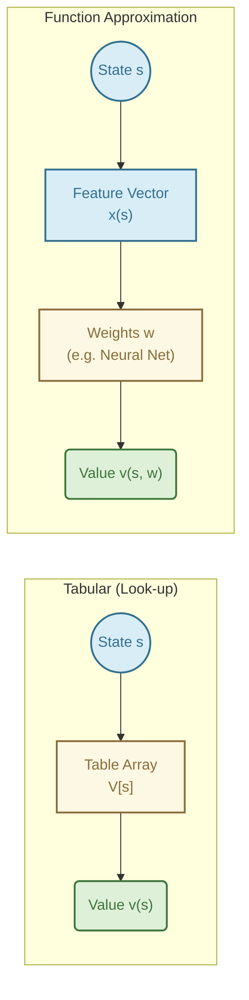

# Lecture 7: On-policy Prediction with Approximation

## 1. The Breaking Point of Tabular Methods

Up until now, we have used **Tabular Methods** (like standard Monte Carlo, SARSA, and Q-learning). In a tabular method, we keep a massive look-up table. For every single state $s$ (or state-action pair $(s,a)$), we have an exact, distinct entry in our table representing its value.

**Why this fails in the real world:**
1.  **The Curse of Dimensionality:** Imagine an agent learning to balance a bicycle. The state might consist of the bike's angle (continuous), velocity (continuous), and handlebar angle (continuous). A table cannot store infinite continuous values! Even if we discretize (e.g., 100 angles $\times$ 100 velocities $\times$ 100 handlebar angles = 1,000,000 states), the table becomes too large to fit in memory.
2.  **Lack of Generalization:** In a table, learning the value of State A tells the agent absolutely *nothing* about State B, even if State A and B are nearly identical. If you learn to balance a bike leaning $5.001^\circ$, you shouldn't have to relearn how to balance at $5.002^\circ$. Tabular methods cannot generalize.

### The Solution: Function Approximation
Instead of storing a table, we use a parameterized mathematical function to estimate the value. 

$$ \hat{v}(s, \mathbf{w}) \approx v_\pi(s) $$

Here, $\mathbf{w} \in \mathbb{R}^d$ is a weight vector. If $d \ll |\mathcal{S}|$ (the number of weights is much smaller than the number of states), updating the weights for one state automatically adjusts the estimated values of many other similar states! This provides the **generalization** we desperately need.



---

## 2. The Prediction Objective ($\overline{VE}$)

In tabular methods, we treated every state equally. In function approximation, we have fewer weights than states. **We cannot get the value of every state perfectly right.** If we adjust weights to improve the estimate for state A, we might slightly ruin the estimate for state B.

We need a metric to decide which states are most important to get right. We introduce the **Mean Squared Value Error ($\overline{VE}$)**:

$$ \overline{VE}(\mathbf{w}) \doteq \sum_{s \in \mathcal{S}} \mu(s) \big[ v_\pi(s) - \hat{v}(s, \mathbf{w}) \big]^2 $$

*   $v_\pi(s)$: The true value of the state.
*   $\hat{v}(s, \mathbf{w})$: Our estimated value.
*   $\mu(s)$: The **state distribution** (how often we visit state $s$). 

**Intuition:** We care more about minimizing the error in states we visit frequently (high $\mu(s)$) and we don't care much if we have high error in states we rarely or never visit.

---

## 3. Stochastic-gradient and Semi-gradient Methods

We want to find the weights $\mathbf{w}$ that minimize $\overline{VE}$. The standard tool from machine learning is **Stochastic Gradient Descent (SGD)**.

If we knew the *true* value $v_\pi(S_t)$, the standard SGD update rule to adjust the weights would be:

$$ \mathbf{w}_{t+1} \doteq \mathbf{w}_t + \alpha \big[ v_\pi(S_t) - \hat{v}(S_t, \mathbf{w}_t) \big] \nabla \hat{v}(S_t, \mathbf{w}_t) $$

*   $\alpha$: Step-size / learning rate.
*   $\big[ v_\pi(S_t) - \hat{v}(S_t, \mathbf{w}_t) \big]$: The error.
*   $\nabla \hat{v}$: The gradient (direction to change weights to increase the estimate).

### The "Semi-Gradient" Problem
In RL, we *don't know* the true $v_\pi(S_t)$. We must use a **target** $U_t$ as a substitute.

*   **Monte Carlo Target:** $U_t = G_t$ (the actual return). This is an unbiased estimate of $v_\pi(S_t)$. Using $G_t$ gives us true SGD.
*   **TD(0) Target:** $U_t = R_{t+1} + \gamma \hat{v}(S_{t+1}, \mathbf{w}_t)$. 

Notice the problem with TD(0): The target itself *depends* on the weights $\mathbf{w}_t$! True gradient descent requires the target to be independent of the weights we are updating. Because we ignore the gradient of the target, this is called **Semi-gradient descent**.

Semi-gradient methods are not guaranteed to converge as robustly as true SGD, but they learn much faster, can be online, and work for continuing problems.

---

## 4. Linear Methods

The simplest function approximator is a linear combination of features. For every state $s$, we define a feature vector $\mathbf{x}(s) = (x_1(s), x_2(s), \dots, x_d(s))^T$.

The value function is simply the dot product of the weights and features:

$$ \hat{v}(s, \mathbf{w}) \doteq \mathbf{w}^T \mathbf{x}(s) = \sum_{i=1}^d w_i x_i(s) $$

**Why use Linear Methods?**
1.  The gradient is trivial: $\nabla \hat{v}(s, \mathbf{w}) = \mathbf{x}(s)$.
2.  The Semi-gradient TD(0) update becomes wonderfully simple:
    $$ \mathbf{w}_{t+1} \doteq \mathbf{w}_t + \alpha \big[ R_{t+1} + \gamma \mathbf{w}_t^T \mathbf{x}(S_{t+1}) - \mathbf{w}_t^T \mathbf{x}(S_t) \big] \mathbf{x}(S_t) $$
3.  **Guarantee:** For linear methods, Semi-gradient TD(0) is mathematically guaranteed to converge to a unique global optimum (the TD fixed point). Complex neural networks do not have this guarantee!

---

## 5. Feature Construction

If linear methods are so great, how do we get the features $\mathbf{x}(s)$? We can't just feed raw continuous coordinates into a linear model and expect complex behavior. We need to construct clever features.

### 5.1 Polynomials
For a 2D state $s=(s_1, s_2)$, polynomial features of order 2 would be:
$\mathbf{x}(s) = (1, s_1, s_2, s_1 s_2, s_1^2, s_2^2)^T$
This allows the linear model to represent curves.

### 5.2 Coarse Coding
Imagine spreading circles (receptive fields) across the state space. A feature $x_i(s)$ is $1$ if the state $s$ falls inside circle $i$, and $0$ otherwise.


*   Because circles overlap, a single state activates multiple features.
*   Moving slightly changes maybe 1 or 2 features, providing smooth generalization.

### 5.3 Tile Coding
Tile coding is a highly computationally efficient form of coarse coding. Instead of random circles, we use overlapping grids (tilings).


*   A state $s$ falls into exactly one square (tile) per tiling. 
*   If we have 8 tilings, exactly 8 features will be $1$, and all others will be $0$.
*   This makes computing the dot product $\mathbf{w}^T \mathbf{x}(s)$ incredibly fast—we just sum the weights of the 8 active tiles! No need to multiply thousands of numbers.
*   Tile coding is the "gold standard" for linear function approximation in RL.

---

## 6. Selecting Step-Size Parameters ($\alpha$)

Choosing $\alpha$ in tabular TD was easy: just pick a small number like 0.1.
With function approximation, $\alpha$ is trickier because a single state activates multiple features.

If you use Tile Coding with $m$ tilings (meaning exactly $m$ features are always 1), a great rule of thumb for the learning rate is:

$$ \alpha = \frac{1}{m \cdot c} $$

Where $c$ is the fraction of the way you want to move towards the target in a single step (e.g., $c=10$ means moving 1/10th of the way to the target).

---

### 5.4 Fourier Basis
The Fourier basis is another linear feature construction method. Instead of using polynomials which can be unstable, it uses combinations of sine and cosine waves. It is excellent for continuous spaces where the value function is relatively smooth and periodic.

### 5.5 Radial Basis Functions (RBFs)
RBFs are the continuous counterpart to coarse coding. Instead of a feature being strictly $1$ or $0$ (inside or outside a circle), an RBF feature takes a continuous value between $0$ and $1$ based on the distance from the center of the feature.
Typically, a Gaussian function is used:
$x_i(s) = \exp\left(-\frac{||s - c_i||^2}{2\sigma_i^2}
ight)$
where $c_i$ is the center state of the feature and $\sigma_i$ is its width.

---

## 7. Non-linear Function Approximation: Artificial Neural Networks (ANNs)

While linear methods are mathematically well-understood and guarantee convergence for on-policy prediction, they are heavily restricted by the features we hand-craft for them.

**Artificial Neural Networks (ANNs)** are non-linear function approximators. 
- They automatically learn the features (in their hidden layers) directly from raw state data.
- They drop the convergence guarantees of linear methods (the $\overline{VE}$ landscape has many local optima).
- Despite losing guarantees, they are the foundation of **Deep Reinforcement Learning (Deep RL)** due to their unparalleled ability to handle raw, high-dimensional inputs like pixels or continuous audio.

---

## 8. Least-Squares TD (LSTD)

For linear methods, we saw that TD(0) updates weights incrementally towards the TD fixed point. 
**Least-Squares TD (LSTD)** is an algorithm that computes the TD fixed point *directly* instead of taking small steps $\alpha$.

- **Pros:** It extracts the maximum possible information from the data. It requires no step-size parameter $\alpha$.
- **Cons:** It requires computing and inverting a $d \times d$ matrix (where $d$ is the number of features). This takes $O(d^3)$ computation time, making it impossible for very large feature spaces (like massive tile codings).

---

## 9. Memory-based Function Approximation

Instead of updating a global set of weights $\mathbf{w}$, **memory-based** methods simply save the experiences (states and their returns/values) in memory.
When the agent needs to estimate the value of a *new* state, it queries the memory for the most similar saved states and averages their values.

- Examples: Nearest-neighbor, weighted average.
- This is a **lazy learning** approach. Computation happens at query time, not at learning time.

---

## 10. Kernel-based Function Approximation

Kernel methods are a mathematical generalization of memory-based methods. A **kernel function** $k(s, s')$ measures how similar state $s$ is to state $s'$.
The value of a state is estimated as a kernel-weighted average of the values of saved states. (RBFs can be used as kernel functions).

---

## 11. Looking Deeper at On-policy Learning: Interest and Emphasis

Sometimes we care more about getting the value right in some states than others, *independent* of how often we visit them.
- **Interest $I_t$:** A non-negative scalar indicating how interested we are in accurately valuing the state at time $t$.
- **Emphasis $M_t$:** A scalar that multiplies the learning update, accumulating the interest over time while decaying by $\gamma$.

This formulation alters the objective function to prioritize states based on our explicit "interest" rather than just the natural state distribution $\mu(s)$.

---

## Summary
*   **Tabular methods** fail on continuous or massive state spaces because they cannot generalize.
*   **Function approximation** allows states to share weights, enabling generalization.
*   **$\overline{VE}$** measures how good our approximation is, weighted by how often we visit states.
*   **Semi-gradient** methods bootstrap using existing weights, making them fast but sacrificing true gradient guarantees.
*   **Linear methods** with **Tile Coding** offer a perfect balance of computational efficiency, guaranteed convergence, and powerful generalization.
*   **Non-linear methods (ANNs)** sacrifice convergence guarantees to automatically extract features from raw data.
*   **LSTD** solves for the linear TD fixed point directly but scales poorly with feature size.
*   **Memory/Kernel methods** are non-parametric, lazy-learning alternatives to maintaining global weights.

---

# Case Studies in Function Approximation (Chapter 16)

To truly appreciate the power of function approximation, we look at Chapter 16 of Sutton & Barto, which details historic breakthroughs achieved by combining Reinforcement Learning with function approximators.

## 1. TD-Gammon (1992)
Developed by Gerry Tesauro, TD-Gammon was one of the first massive successes of RL. It learned to play Backgammon at a world-class level entirely through self-play.


**Implementation Details:**
*   **State Representation:** A raw board representation consisting of 198 features. Each point on the board (24 points) had 4 features for white pieces (representing 1, 2, 3, or >3 pieces) and 4 for black, plus features for the bar and off-board pieces.
*   **Architecture:** A standard Multi-Layer Perceptron (MLP) with a single hidden layer (initially 40 hidden units, later expanded to 80). The output layer was a single unit with a sigmoid activation function estimating the probability of winning from the current state $V(s) \in [0, 1]$.
*   **Learning Algorithm:** It used episodic **TD($\lambda$)** to update the network weights. After every move, the error between successive value predictions $V(s_{t+1}) - V(s_t)$ was used to update weights via backpropagation, scaled by eligibility traces (the $\lambda$ parameter).
*   **Reward Structure:** $+1$ for a win, $0$ for a loss (only given at the terminal state).

**Algorithm (Episodic TD($\lambda$)):**
```python
Initialize weights w arbitrarily
Initialize eligibility trace z = 0

For each game episode:
    Observe initial state S
    Loop:
        Select action A based on current Value network V(s, w) (e.g., greedy move)
        Take action A, observe reward R and next state S'
        
        δ = R + γ * V(S', w) - V(S, w)  # TD Error
        z = γ * λ * z + ∇V(S, w)        # Update eligibility trace
        
        w = w + α * δ * z               # Update weights
        
        S = S'
    Until S is terminal
```

## 2. Human-Level Video Game Play (DQN, 2015)
DeepMind's DQN demonstrated an agent that could play 49 different Atari 2600 games directly from raw pixel inputs, using exactly the same architecture and hyperparameters for all games.


**Implementation Details:**
*   **State Representation:** The raw Atari screen pixels (210x160 color video at 60Hz). These were converted to grayscale, down-sampled to 84x84, and the last 4 frames were stacked together to form the state (this gave the network a sense of velocity/direction).
*   **Architecture:** A Deep Convolutional Neural Network (CNN). The input ($84 \times 84 \times 4$) passed through 3 convolutional layers to extract spatial features, followed by 2 fully connected layers. The output layer had one unit for each possible joystick/button action, outputting the $Q(s, a)$ value directly.
*   **Learning Algorithm:** A variant of **Q-learning** adapted for deep networks.
*   **Crucial Innovations:** 
    *   **Experience Replay:** Instead of learning from sequential frames (which are highly correlated and destabilize SGD), transitions $(s, a, r, s')$ were saved in a buffer of 1 million frames. The network was trained on random mini-batches from this buffer.
    *   **Target Network:** The target for Q-learning $R_{t+1} + \gamma \max_a Q(s_{t+1}, a)$ was calculated using a *separate, older copy* of the neural network. This frozen target network was only updated every 10,000 steps, preventing the "chasing a moving target" instability inherent in semi-gradient control.

**Algorithm (Deep Q-Learning with Experience Replay):**
```python
Initialize replay memory D to capacity N
Initialize action-value function Q with random weights w
Initialize target action-value function Q_target with weights w_target = w

For episode = 1 to M:
    Observe initial state image sequence s_1
    For t = 1 to T:
        With probability ε select a random action a_t
        Otherwise select a_t = argmax_a Q(s_t, a, w)
        
        Execute action a_t, observe reward r_t and next state image sequence s_{t+1}
        Store transition (s_t, a_t, r_t, s_{t+1}) in replay memory D
        
        # Experience Replay Step
        Sample random mini-batch of transitions (s_j, a_j, r_j, s_{j+1}) from D
        
        # Calculate target using Target Network
        If s_{j+1} is terminal:
            y_j = r_j
        Else:
            y_j = r_j + γ * max_a' Q_target(s_{j+1}, a', w_target)
            
        # Perform gradient descent step on (y_j - Q(s_j, a_j, w))^2
        w = w - α * ∇ (y_j - Q(s_j, a_j, w))^2
        
        # Periodically update target network
        If t % C == 0:
            w_target = w
```

## 3. Mastering the Game of Go (AlphaGo, 2016)
Go has an immense branching factor ($b \approx 250$) and depth, making standard search impossible.


**Implementation Details:**
*   **State Representation:** The $19 \times 19$ board represented as a $19 \times 19 \times 48$ image stack (encoding piece locations, liberties, legal moves, etc.).
*   **Architecture:** Two separate Deep CNNs:
    1.  **Policy Network ($p_\sigma(a|s)$):** Outputs a probability distribution over all legal moves. It was pre-trained on 30 million human expert moves (Supervised Learning) and then fine-tuned using REINFORCE (Policy Gradient RL) playing against older versions of itself.
    2.  **Value Network ($v_\theta(s)$):** Outputs a single number evaluating the probability of winning from state $s$. Trained using Monte Carlo policy evaluation on 30 million distinct self-play games.
*   **Learning Algorithm (At play-time):** Combined the neural networks with **Monte Carlo Tree Search (MCTS)**.
    *   Instead of MCTS exploring all branches, the *Policy Network* filtered the search to only the most promising moves.
    *   Instead of MCTS rolling out random games to the very end to evaluate a leaf node, the *Value Network* was used to instantly evaluate the node, cutting the search depth dramatically.

**Algorithm Concept (AlphaGo MCTS):**
```python
def AlphaGo_MCTS(root_state, policy_net, value_net, num_simulations):
    For i = 1 to num_simulations:
        # 1. Selection
        node = root_state
        while node is not a leaf:
            node = select_child_by_PUCT(node) # Combines Q-value and Policy Net prior
            
        # 2. Expansion
        If node is not terminal:
            expand_node(node)
            # Evaluate using Policy Net to get priors for new children
            action_probs = policy_net.predict(node.state) 
            
        # 3. Evaluation
        # Instead of deep random rollouts, use Value Net
        leaf_value = value_net.predict(node.state)
        
        # 4. Backup
        while node is not None:
            node.visit_count += 1
            node.total_action_value += leaf_value
            node = node.parent
            
    # Choose action with highest visit count at the root
    return most_visited_child(root_state)
```

---

## Practice Exercises

Test your understanding of function approximation with these exercises:

- [Multiple Choice Questions (MCQs)](./assets/questions/mcqs.md)
- [Subjective Questions](./assets/questions/subjective.md)
- [Numerical Questions](./assets/questions/numericals.md)
- [Programming Questions](./assets/questions/programming.md)

*Solutions can be found in the [assets/questions/solutions/](./assets/questions/solutions/) folder.*

---
*Reference: Sutton, R. S., & Barto, A. G. (2018). Reinforcement Learning: An Introduction. MIT Press.*
