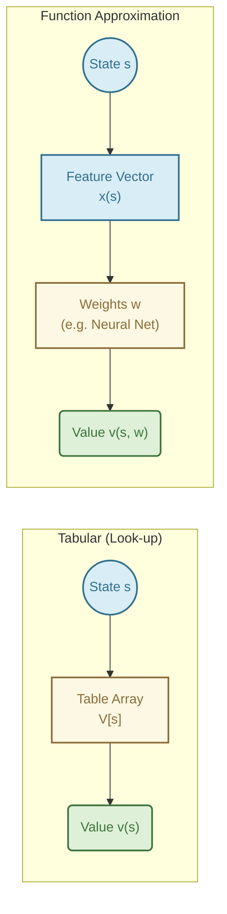
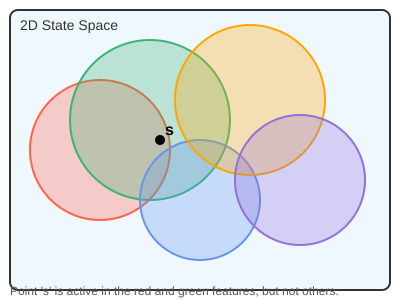
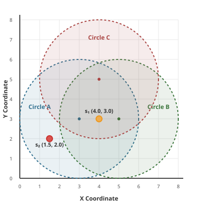
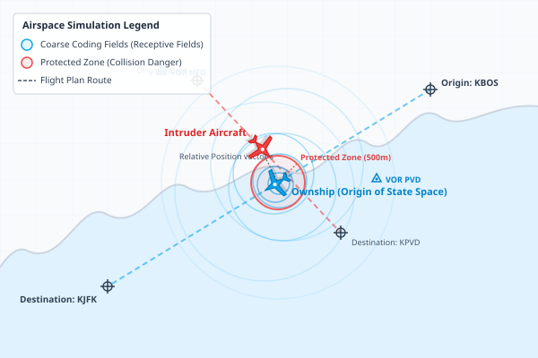
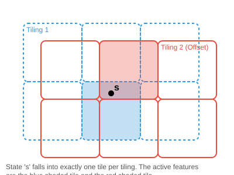
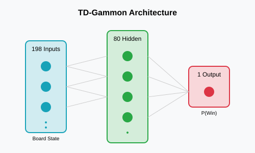
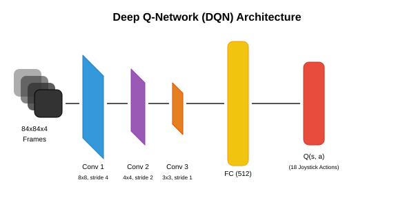
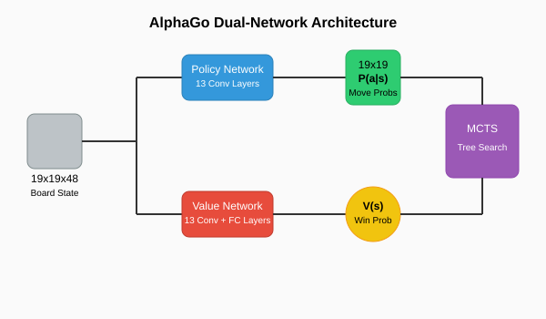

# Lecture 7: On-policy Prediction with Approximation

## 1. The Breaking Point of Tabular Methods

Up until now, we have used **Tabular Methods** (like standard Monte Carlo, SARSA, and Q-learning). In a tabular method, we keep a massive look-up table. For every single state $s$ (or state-action pair $(s,a)$), we have an exact, distinct entry in our table representing its value.

**Why this fails in the real world:**
1.  **The Curse of Dimensionality:** Imagine an agent learning to balance a bicycle. The state might consist of the bike's angle (continuous), velocity (continuous), and handlebar angle (continuous). A table cannot store infinite continuous values! Even if we discretize (e.g., 100 angles $\times$ 100 velocities $\times$ 100 handlebar angles = 1,000,000 states), the table becomes too large to fit in memory.
2.  **Lack of Generalization:** In a table, learning the value of State A tells the agent absolutely *nothing* about State B, even if State A and B are nearly identical. If you learn to balance a bike leaning $5.001^\circ$, you shouldn't have to relearn how to balance at $5.002^\circ$. Tabular methods cannot generalize.

### The Solution: Function Approximation
Instead of storing a table, we use a parameterized mathematical function to estimate the value. 

$$ \hat{v}(s, \mathbf{w}) \approx v_\pi(s) $$

Here, $\mathbf{w} \in \mathbb{R}^d$ is a weight vector. If $d \ll |\mathcal{S}|$ (the number of weights is much smaller than the number of states), updating the weights for one state automatically adjusts the estimated values of many other similar states! This provides the **generalization** we desperately need.



---

## 2. The Prediction Objective ($\overline{VE}$)

In tabular methods, we treated every state equally. In function approximation, we have fewer weights than states. **We cannot get the value of every state perfectly right.** If we adjust weights to improve the estimate for state A, we might slightly ruin the estimate for state B.

We need a metric to decide which states are most important to get right. We introduce the **Mean Squared Value Error ($\overline{VE}$)**:

$$ \overline{VE}(\mathbf{w}) \doteq \sum_{s \in \mathcal{S}} \mu(s) \big[ v_\pi(s) - \hat{v}(s, \mathbf{w}) \big]^2 $$

*   $v_\pi(s)$: The true value of the state.
*   $\hat{v}(s, \mathbf{w})$: Our estimated value.
*   $\mu(s)$: The **state distribution** (how often we visit state $s$). 

**Intuition:** We care more about minimizing the error in states we visit frequently (high $\mu(s)$) and we don't care much if we have high error in states we rarely or never visit.

---

## 3. Stochastic-gradient and Semi-gradient Methods

We want to find the weights $\mathbf{w}$ that minimize $\overline{VE}$. The standard tool from machine learning is **Stochastic Gradient Descent (SGD)**.

**What does SGD mean in Reinforcement Learning?**
- **Gradient Descent** is the mathematical process of finding the minimum of an error function by calculating the gradient (the slope) and taking a step in the opposite direction (downhill).
- **Stochastic** means "randomly determined." In traditional ML, we might calculate the exact gradient using the entire dataset at once (which is computationally expensive). In RL, the agent constantly experiences new individual transitions (states, actions, rewards). Because it updates its weights on-the-fly based on these single, sequentially occurring experiences rather than a static dataset, the process is perfectly modeled as *Stochastic* Gradient Descent.

### Mathematical Derivation of the SGD Update
For a single observed state $S_t$, we want to minimize the squared error between the true value and our estimate. We define our objective function $J(\mathbf{w})$ and multiply it by $\frac{1}{2}$ for mathematical convenience (it cancels out the exponent during differentiation):

$$ J(\mathbf{w}) = \frac{1}{2} \big[ v_\pi(S_t) - \hat{v}(S_t, \mathbf{w}) \big]^2 $$

In Gradient Descent, we update weights in the *opposite* direction of the gradient of our error function $J$ to minimize it:
$$ \mathbf{w}_{t+1} = \mathbf{w}_t - \alpha \nabla_{\mathbf{w}} J(\mathbf{w}_t) $$

Using the chain rule, let's find the gradient $\nabla_{\mathbf{w}} J(\mathbf{w})$:
1. Bring down the exponent 2 (which cancels with the $\frac{1}{2}$).
2. Take the derivative of the inside of the brackets: since $v_\pi(S_t)$ is the true environment value and doesn't depend on our weights $\mathbf{w}$, its derivative is 0. The derivative of $-\hat{v}(S_t, \mathbf{w})$ is $-\nabla \hat{v}(S_t, \mathbf{w})$.

$$ \nabla_{\mathbf{w}} J(\mathbf{w}_t) = \big[ v_\pi(S_t) - \hat{v}(S_t, \mathbf{w}_t) \big] \cdot \big( - \nabla \hat{v}(S_t, \mathbf{w}_t) \big) $$

Substituting this back into our SGD update rule, the two negative signs cancel out, leaving us with a positive addition:

$$ \mathbf{w}_{t+1} \doteq \mathbf{w}_t + \alpha \big[ v_\pi(S_t) - \hat{v}(S_t, \mathbf{w}_t) \big] \nabla \hat{v}(S_t, \mathbf{w}_t) $$

### Understanding the Gradient's Role ($\nabla \hat{v}$)
*   $\alpha$: Step-size / learning rate.
*   $\big[ v_\pi(S_t) - \hat{v}(S_t, \mathbf{w}_t) \big]$: The scalar error (how wrong our prediction was).
*   $\nabla \hat{v}(S_t, \mathbf{w}_t)$: The **gradient vector** (pronounced *nabla* v-hat). It acts as a compass, indicating the direction we should tweak the weights to make the output of $\hat{v}$ go up.
  * If we **underestimated** (Error is **positive**): The equation *adds* the gradient to the weights, moving them in the direction that *increases* our value estimate.
  * If we **overestimated** (Error is **negative**): The equation *subtracts* the gradient from the weights, moving them in the opposite direction to *decrease* our value estimate.

### The "Semi-Gradient" Problem
In RL, we *don't know* the true $v_\pi(S_t)$. We must use a **target** $U_t$ as a substitute.

*   **Monte Carlo Target:** $U_t = G_t$ (the actual return). The actual return $G_t$ is a fixed number that has already happened; it doesn't depend on our weights $\mathbf{w}$. Taking the derivative is clean, giving us true SGD.
*   **TD(0) Target:** $U_t = R_{t+1} + \gamma \hat{v}(S_{t+1}, \mathbf{w}_t)$. 

Notice the problem with TD(0): The target itself *depends* on the weights $\mathbf{w}_t$ we are trying to update! 

If we were doing *true* gradient descent, the math would require us to use the product/chain rules to calculate the derivative of the target as well (which would be $\gamma \nabla \hat{v}(S_{t+1}, \mathbf{w}_t)$). 
However, in TD learning, we explicitly **ignore the gradient of the target**. We freeze the target $R_{t+1} + \gamma \hat{v}(S_{t+1}, \mathbf{w}_t)$ and treat it as if it were a fixed, constant number. We *only* calculate the gradient of our current estimate $\hat{v}(S_t, \mathbf{w}_t)$. 

Because we only take the gradient with respect to the estimate and deliberately *ignore* the weight dependency inside the target, we are only doing "half" of a true gradient calculation. Hence, it is called **Semi-gradient descent**.

Semi-gradient methods are not guaranteed to converge as robustly as true SGD, but they learn much faster, can be online, and work for continuing problems.

---

## 4. Linear Methods

The simplest function approximator is a linear combination of features. For every state $s$, we define a feature vector $\mathbf{x}(s) = (x_1(s), x_2(s), \dots, x_d(s))^T$.

The value function is simply the dot product of the weights and features:

$$ \hat{v}(s, \mathbf{w}) \doteq \mathbf{w}^T \mathbf{x}(s) = \sum_{i=1}^d w_i x_i(s) $$

**Why use Linear Methods?**
1.  The gradient is trivial: $\nabla \hat{v}(s, \mathbf{w}) = \mathbf{x}(s)$.
2.  The Semi-gradient TD(0) update becomes wonderfully simple:
    $$ \mathbf{w}_{t+1} \doteq \mathbf{w}_t + \alpha \big[ R_{t+1} + \gamma \mathbf{w}_t^T \mathbf{x}(S_{t+1}) - \mathbf{w}_t^T \mathbf{x}(S_t) \big] \mathbf{x}(S_t) $$
3.  **Guarantee:** For linear methods, Semi-gradient TD(0) is mathematically guaranteed to converge to a unique global optimum (the TD fixed point). Complex neural networks do not have this guarantee!

### Action-Value Approximation ($q$-value)

For control tasks (where the agent needs to choose actions), we approximate the action-value function $q(s,a)$ instead of the state-value function $v(s)$. In the linear case, the approximated $q$-value is the dot product of the weight vector and a feature vector $\mathbf{x}(s, a)$ constructed for the specific state-action pair:

$$ \hat{q}(s, a, \mathbf{w}) \doteq \mathbf{w}^T \mathbf{x}(s, a) = \sum_{i=1}^d w_i x_i(s, a) $$

#### Numerical Example: Calculating $q$-values

Suppose we have a simple robot navigation task where:
*   **State $s$**: Defined by the distance to the target destination, $d = 3.0$ meters.
*   **Actions $a$**: The robot can choose either `Slow` ($a=0$, which runs at $0.0$ m/s) or `Fast` ($a=1$, which runs at $4.0$ m/s).
*   **Features $\mathbf{x}(s, a)$**: We construct a 3-dimensional feature vector $[x_1, x_2, x_3]^T$ for each state-action pair:
    *   $x_1$: Bias feature (always $1.0$, providing a baseline value).
    *   $x_2$: Distance to target ($d = 3.0$ from state $s$).
    *   $x_3$: Action-speed feature (equals the target speed associated with the chosen action: $0.0$ for `Slow` and $4.0$ for `Fast`).

Let the current weight vector be:
$$ \mathbf{w} = \begin{bmatrix} -0.5 \\ 2.0 \\ 1.5 \end{bmatrix} $$

We can calculate the estimated $q$-values for both actions at this state:

1.  **For Action $a = \text{Slow}$**:
    *   The feature vector is:
        $$ \mathbf{x}(s, \text{Slow}) = \begin{bmatrix} 1.0 \\ 3.0 \\ 0.0 \end{bmatrix} $$
    *   The estimated $q$-value is:
        $$ \hat{q}(s, \text{Slow}, \mathbf{w}) = \mathbf{w}^T \mathbf{x}(s, \text{Slow}) = (-0.5 \times 1.0) + (2.0 \times 3.0) + (1.5 \times 0.0) = -0.5 + 6.0 + 0.0 = 5.5 $$

2.  **For Action $a = \text{Fast}$**:
    *   The feature vector is:
        $$ \mathbf{x}(s, \text{Fast}) = \begin{bmatrix} 1.0 \\ 3.0 \\ 4.0 \end{bmatrix} $$
    *   The estimated $q$-value is:
        $$ \hat{q}(s, \text{Fast}, \mathbf{w}) = \mathbf{w}^T \mathbf{x}(s, \text{Fast}) = (-0.5 \times 1.0) + (2.0 \times 3.0) + (1.5 \times 4.0) = -0.5 + 6.0 + 6.0 = 11.5 $$

Under a greedy policy, the agent would choose action `Fast` because $\hat{q}(s, \text{Fast}, \mathbf{w}) > \hat{q}(s, \text{Slow}, \mathbf{w})$.


---

## 5. Feature Construction

If linear methods are so great, how do we get the features $\mathbf{x}(s)$? We can't just feed raw continuous coordinates into a linear model and expect complex behavior. We need to construct clever features.

### 5.1 Polynomials

For a multi-dimensional state $s$, the features can be constructed as combinations of its coordinates. Note that $s_1$ and $s_2$ do **not** represent two different states; instead, they represent the individual dimensions (features/coordinates) of a **single** multidimensional state $s = (s_1, s_2)^T$.

For a 2D state $s=(s_1, s_2)^T$, polynomial features of order 2 would be:
$$ \mathbf{x}(s) = \begin{bmatrix} 1 \\ s_1 \\ s_2 \\ s_1 s_2 \\ s_1^2 \\ s_2^2 \end{bmatrix} $$

This maps the low-dimensional state into a higher-dimensional feature space, allowing a linear model to represent non-linear relationships and curves (since $\hat{v}(s, \mathbf{w}) = \mathbf{w}^T\mathbf{x}(s)$ will contain quadratic terms like $s_1^2$, $s_2^2$, and interaction terms like $s_1s_2$).

#### How the Terms are Decided

A polynomial of degree (or order) $k$ in multiple variables includes all possible products of those variables where the sum of their exponents is less than or equal to $k$. For a 2D state $(s_1, s_2)$, any term $s_1^p s_2^q$ must satisfy $p + q \leq 2$ (where $p, q \geq 0$):

| Term | $p$ (Exponent of $s_1$) | $q$ (Exponent of $s_2$) | Sum ($p+q$) | Order | Category |
| :--- | :--- | :--- | :--- | :--- | :--- |
| $1$ | 0 | 0 | 0 | Order 0 | Bias / Constant |
| $s_1$ | 1 | 0 | 1 | Order 1 | Linear |
| $s_2$ | 0 | 1 | 1 | Order 1 | Linear |
| $s_1 s_2$ | 1 | 1 | 2 | Order 2 | Interaction / Cross-Product |
| $s_1^2$ | 2 | 0 | 2 | Order 2 | Quadratic |
| $s_2^2$ | 0 | 2 | 2 | Order 2 | Quadratic |

#### Why the Interaction Term ($s_1 s_2$) is Crucial

In reinforcement learning, state dimensions are rarely independent. The interaction term $s_1 s_2$ allows the linear model to capture **dependencies between dimensions**. 

For example, in autonomous driving, let $s_1$ be the "distance to the car ahead" and $s_2$ be the "braking pressure". Evaluating them independently ($s_1^2$ and $s_2^2$) can only tell the model "braking hard is uncomfortable" or "being close to a car is bad". But with the interaction term $s_1 s_2$, the model can learn: *"braking hard ($s_2$) when the distance is very small ($s_1$) is good/necessary"*.

#### Numerical Example:
Suppose a robot's state $s$ represents its 2D position $(x, y)$ on a coordinate plane:
*   $s = (s_1, s_2)^T = (2.0, 3.0)^T$ (where $s_1 = 2.0$ and $s_2 = 3.0$).

The feature vector $\mathbf{x}(s)$ is computed solely from this single state's coordinates:
$$ \mathbf{x}(s) = \begin{bmatrix} 1 \\ s_1 \\ s_2 \\ s_1 s_2 \\ s_1^2 \\ s_2^2 \end{bmatrix} = \begin{bmatrix} 1.0 \\ 2.0 \\ 3.0 \\ 2.0 \times 3.0 \\ 2.0^2 \\ 3.0^2 \end{bmatrix} = \begin{bmatrix} 1.0 \\ 2.0 \\ 3.0 \\ 6.0 \\ 4.0 \\ 9.0 \end{bmatrix} $$

If the model has weights $\mathbf{w} = \begin{bmatrix} 0.1 \\ 0.2 \\ 0.3 \\ 0.05 \\ 0.1 \\ -0.05 \end{bmatrix}$, the value estimate for this state $s$ is:
$$ \hat{v}(s, \mathbf{w}) = \mathbf{w}^T \mathbf{x}(s) = (0.1 \times 1.0) + (0.2 \times 2.0) + (0.3 \times 3.0) + (0.05 \times 6.0) + (0.1 \times 4.0) + (-0.05 \times 9.0) = 1.65 $$


### 5.2 Coarse Coding

Imagine spreading circles (receptive fields) across the state space. A feature $x_i(s)$ is $1$ if the state $s$ falls inside circle $i$, and $0$ otherwise.



*   Because circles overlap, a single state activates multiple features.
*   Moving slightly changes maybe 1 or 2 features, providing smooth generalization.

#### Why is it called "Coarse" Coding?

The term **"coarse"** refers to the low resolution (large size) of the individual features. 

1. **Coarse Features $\rightarrow$ Fine Representation**: 
   Individually, each feature is "coarse" (imprecise). Knowing that feature $x_A(s) = 1$ only tells you the state is somewhere inside a large circle. However, because these large circles overlap, the **intersection** of active features provides a very **fine** (precise) representation of the state. If features $A$, $B$, and $C$ are all $1$, the agent must be located in the tiny overlapping region shared by all three circles.
2. **Resolution and Generalization**:
   * **Larger (coarser) features** lead to broader generalization: learning at one state point updates a wide surrounding area because they share many active features.
   * **Smaller (finer) features** lead to narrow generalization: learning is localized to a small area, allowing the agent to learn finer details but requiring more data.

#### Numerical Example:

Suppose we have a 2D state space representing an agent's position on a grid. We define three overlapping circular features ($A, B, C$), each with a radius of $3.0$ units:
*   **Circle $A$**: Centered at $(3.0, 3.0)$
*   **Circle $B$**: Centered at $(5.0, 3.0)$
*   **Circle $C$**: Centered at $(4.0, 5.0)$



For any state $s = (x, y)$, the feature vector is $\mathbf{x}(s) = [x_A, x_B, x_C]^T$ where:
$$ x_i(s) = \begin{cases} 1 & \text{if } \text{distance}(s, \text{center}_i) \leq 3.0 \\ 0 & \text{otherwise} \end{cases} $$

Let's evaluate two different states:

1. **State $s_1 = (4.0, 3.0)$** (in the middle of the circles):
   *   $\text{distance to } A = \sqrt{(4.0-3.0)^2 + (3.0-3.0)^2} = 1.0 \leq 3.0 \implies x_A = 1$
   *   $\text{distance to } B = \sqrt{(4.0-5.0)^2 + (3.0-3.0)^2} = 1.0 \leq 3.0 \implies x_B = 1$
   *   $\text{distance to } C = \sqrt{(4.0-4.0)^2 + (3.0-5.0)^2} = 2.0 \leq 3.0 \implies x_C = 1$
   *   **Feature Vector**: $\mathbf{x}(s_1) = [1, 1, 1]^T$

2. **State $s_2 = (1.5, 2.0)$** (on the far left):
   *   $\text{distance to } A = \sqrt{(1.5-3.0)^2 + (2.0-3.0)^2} = \sqrt{2.25 + 1.0} \approx 1.80 \leq 3.0 \implies x_A = 1$
   *   $\text{distance to } B = \sqrt{(1.5-5.0)^2 + (2.0-3.0)^2} = \sqrt{12.25 + 1.0} \approx 3.64 > 3.0 \implies x_B = 0$
   *   $\text{distance to } C = \sqrt{(1.5-4.0)^2 + (2.0-5.0)^2} = \sqrt{6.25 + 9.0} \approx 3.91 > 3.0 \implies x_C = 0$
   *   **Feature Vector**: $\mathbf{x}(s_2) = [1, 0, 0]^T$

#### Coarse Coding vs. Raw Coordinates / Polynomials: Key Rationale

Why not just feed raw coordinate features (like $[x, y]$ or polynomial terms like $[1, x, y, xy, x^2, y^2]$) to a linear model?

1.  **Local vs. Global Generalization (Global Interference)**:
    *   **Polynomials**: Polynomial features are active *everywhere* across the state space. If the agent updates the weights based on an experience at $x = 1.0$, it changes the estimated value of states far away at $x = 100.0$. This is called **global interference** and can cause the agent to unlearn (forget) optimal behaviors in one area while training in another.
    *   **Coarse Coding**: A circular feature is only active ($1.0$) when the agent is inside that specific circle, and $0.0$ everywhere else. If you update the weights for Circle $A$ (centered at $(3,3)$), it only adjusts the values of states near $(3,3)$. A state on the other side of the map remains completely untouched. This is called **local generalization**.
2.  **Representational Capacity (Sharp Boundaries)**:
    *   **Polynomials**: Polynomial functions are smooth and continuous. They struggle to represent sharp boundaries (like cliffs or step functions). 
    *   **Coarse Coding**: Since features are defined by region membership, having many overlapping circles allows the model to approximate step-changes, cliffs, and multiple local peaks/valleys easily and stably.

#### Case Study: Aircraft Collision Avoidance in Airspace

Consider an automated collision avoidance system (similar to ACAS X) for an aircraft (the **ownship**). 

*   **State Space**: The relative 2D position $(x, y)$ of an intruder aircraft, where the ownship is always at the origin $(0, 0)$.
*   **System Value**: We want to approximate the state value function $v(s)$, where a state represents high danger (negative value) if the intruder is inside a small "Protected Zone" (radius $r_p = 500$ meters) and safe (zero value) otherwise.



##### 1. Attempting with a Raw Coordinate / Polynomial Model
If we approximate the value function using raw coordinates and a quadratic polynomial model:
$$ \hat{v}(s, \mathbf{w}) = w_0 + w_1 x + w_2 y + w_3 xy + w_4 x^2 + w_5 y^2 $$

*   **The Issue**: The polynomial model is smooth. It cannot model the sharp step drop at the 500-meter threshold. It will smooth out the danger zone boundary, making the safe zone near the border look dangerous, or underestimating the danger close to the ownship.
*   **Global Interference**: If an intruder aircraft is detected far away (e.g., at $x = 5000$ meters), the polynomial terms like $x^2$ will evaluate to a massive value ($25,000,000$). Any weight updates triggered by this safe, far-away aircraft will dominate the weight adjustments and completely destabilize the critical value predictions close to the ownship (the origin).

##### 2. Solving with Coarse Coding
Instead, we spread overlapping circular receptive fields across the airspace:
*   We can place many small circles densely clustered around $(0,0)$ (the ownship) to get highly precise, high-resolution estimates in the critical danger zone.
*   We place fewer, much larger circles further away where coarse resolution is sufficient (we only need to know "an aircraft is far away", not its exact meter coordinate).

*   **Why this is better**:
    1.  **Safety Boundaries**: The boundary of the Protected Zone can be cleanly represented by the circles matching the 500-meter radius boundary.
    2.  **Zero Interference**: An aircraft at $5000$ meters only activates far-away circles. Its value updates will only change the weights of those far-away circles, leaving the critical collision-prevention weights near $(0, 0)$ completely untouched and stable.

### 5.3 Tile Coding
Tile coding is a highly computationally efficient form of coarse coding. Instead of random circles, we use overlapping grids (tilings).



*   A state $s$ falls into exactly one square (tile) per tiling. 
*   If we have 8 tilings, exactly 8 features will be $1$, and all others will be $0$.
*   This makes computing the dot product $\mathbf{w}^T \mathbf{x}(s)$ incredibly fast—we just sum the weights of the 8 active tiles! No need to multiply thousands of numbers.
*   Tile coding is the "gold standard" for linear function approximation in RL.

---

## 6. Selecting Step-Size Parameters ($\alpha$)

Choosing $\alpha$ in tabular TD was easy: just pick a small number like 0.1.
With function approximation, $\alpha$ is trickier because a single state activates multiple features.

If you use Tile Coding with $m$ tilings (meaning exactly $m$ features are always 1), a great rule of thumb for the learning rate is:

$$ \alpha = \frac{1}{m \cdot c} $$

Where $c$ is the fraction of the way you want to move towards the target in a single step (e.g., $c=10$ means moving 1/10th of the way to the target).

---

### 5.4 Fourier Basis
The Fourier basis is another linear feature construction method. Instead of using polynomials which can be unstable, it uses combinations of sine and cosine waves. It is excellent for continuous spaces where the value function is relatively smooth and periodic.

### 5.5 Radial Basis Functions (RBFs)
RBFs are the continuous counterpart to coarse coding. Instead of a feature being strictly $1$ or $0$ (inside or outside a circle), an RBF feature takes a continuous value between $0$ and $1$ based on the distance from the center of the feature.
Typically, a Gaussian function is used:
$x_i(s) = \exp\left(-\frac{||s - c_i||^2}{2\sigma_i^2}\right)$
where $c_i$ is the center state of the feature and $\sigma_i$ is its width.

---

## 7. Non-linear Function Approximation: Artificial Neural Networks (ANNs)

While linear methods are mathematically well-understood and guarantee convergence for on-policy prediction, they are heavily restricted by the features we hand-craft for them.

**Artificial Neural Networks (ANNs)** are non-linear function approximators. 
- **No Hand-Crafting Required:** You still feed inputs into a neural network, but these inputs can be *raw data* rather than carefully engineered features. The hidden layers automatically learn and construct the complex, non-linear, high-level features for you.
- **Raw Data $\neq$ Random Data:** It is crucial to note that the raw data must still contain the necessary information (the signal) required to solve the task. You cannot feed the network random noise. For example, feeding raw RGB pixels of a video game screen works because the state of the game is visible in the pixels. Feeding the CPU temperature will fail because it contains no relevant information for playing the game. The network extracts the signal, but the signal must be present in the raw input.
- They drop the convergence guarantees of linear methods (the $\overline{VE}$ landscape has many local optima).
- Despite losing guarantees, they are the foundation of **Deep Reinforcement Learning (Deep RL)** due to their unparalleled ability to handle raw, high-dimensional inputs like pixels or continuous audio.

---

## 8. Least-Squares TD (LSTD)

For linear methods, we saw that TD(0) updates weights incrementally towards the TD fixed point. 
**Least-Squares TD (LSTD)** is an algorithm that computes the TD fixed point *directly* instead of taking small steps $\alpha$.

- **Pros:** It extracts the maximum possible information from the data. It requires no step-size parameter $\alpha$.
- **Cons:** It requires computing and inverting a $d \times d$ matrix (where $d$ is the number of features). This takes $O(d^3)$ computation time, making it impossible for very large feature spaces (like massive tile codings).

---

## 9. Memory-based Function Approximation

Instead of updating a global set of weights $\mathbf{w}$, **memory-based** methods simply save the experiences (states and their returns/values) in memory.
When the agent needs to estimate the value of a *new* state, it queries the memory for the most similar saved states and averages their values.

- Examples: Nearest-neighbor, weighted average.
- This is a **lazy learning** approach. Computation happens at query time, not at learning time.

---

## 10. Kernel-based Function Approximation

Kernel methods are a mathematical generalization of memory-based methods. A **kernel function** $k(s, s')$ measures how similar state $s$ is to state $s'$.
The value of a state is estimated as a kernel-weighted average of the values of saved states. (RBFs can be used as kernel functions).

---

## 11. Looking Deeper at On-policy Learning: Interest and Emphasis

Sometimes we care more about getting the value right in some states than others, *independent* of how often we visit them.
- **Interest $I_t$:** A non-negative scalar indicating how interested we are in accurately valuing the state at time $t$.
- **Emphasis $M_t$:** A scalar that multiplies the learning update, accumulating the interest over time while decaying by $\gamma$.

This formulation alters the objective function to prioritize states based on our explicit "interest" rather than just the natural state distribution $\mu(s)$.

---

## Summary
*   **Tabular methods** fail on continuous or massive state spaces because they cannot generalize.
*   **Function approximation** allows states to share weights, enabling generalization.
*   **$\overline{VE}$** measures how good our approximation is, weighted by how often we visit states.
*   **Semi-gradient** methods bootstrap using existing weights, making them fast but sacrificing true gradient guarantees.
*   **Linear methods** with **Tile Coding** offer a perfect balance of computational efficiency, guaranteed convergence, and powerful generalization.
*   **Non-linear methods (ANNs)** sacrifice convergence guarantees to automatically extract features from raw data.
*   **LSTD** solves for the linear TD fixed point directly but scales poorly with feature size.
*   **Memory/Kernel methods** are non-parametric, lazy-learning alternatives to maintaining global weights.

---

# Case Studies in Function Approximation (Chapter 16)

To truly appreciate the power of function approximation, we look at Chapter 16 of Sutton & Barto, which details historic breakthroughs achieved by combining Reinforcement Learning with function approximators.

## 1. TD-Gammon (1992)
Developed by Gerry Tesauro, TD-Gammon was one of the first massive successes of RL. It learned to play Backgammon at a world-class level entirely through self-play.



**Implementation Details:**
*   **State Representation:** A raw board representation consisting of 198 features. Each point on the board (24 points) had 4 features for white pieces (representing 1, 2, 3, or >3 pieces) and 4 for black, plus features for the bar and off-board pieces.
*   **Architecture:** A standard Multi-Layer Perceptron (MLP) with a single hidden layer (initially 40 hidden units, later expanded to 80). The output layer was a single unit with a sigmoid activation function estimating the probability of winning from the current state $V(s) \in [0, 1]$.
*   **Learning Algorithm:** It used episodic **TD($\lambda$)** to update the network weights. After every move, the error between successive value predictions $V(s_{t+1}) - V(s_t)$ was used to update weights via backpropagation, scaled by eligibility traces (the $\lambda$ parameter).
*   **Reward Structure:** $+1$ for a win, $0$ for a loss (only given at the terminal state).

**Algorithm (Episodic TD($\lambda$)):**
```python
Initialize weights w arbitrarily
Initialize eligibility trace z = 0

For each game episode:
    Observe initial state S
    Loop:
        Select action A based on current Value network V(s, w) (e.g., greedy move)
        Take action A, observe reward R and next state S'
        
        δ = R + γ * V(S', w) - V(S, w)  # TD Error
        z = γ * λ * z + ∇V(S, w)        # Update eligibility trace
        
        w = w + α * δ * z               # Update weights
        
        S = S'
    Until S is terminal
```

## 2. Human-Level Video Game Play (DQN, 2015)
DeepMind's DQN demonstrated an agent that could play 49 different Atari 2600 games directly from raw pixel inputs, using exactly the same architecture and hyperparameters for all games.



**Implementation Details:**
*   **State Representation:** The raw Atari screen pixels (210x160 color video at 60Hz). These were converted to grayscale, down-sampled to 84x84, and the last 4 frames were stacked together to form the state (this gave the network a sense of velocity/direction).
*   **Architecture:** A Deep Convolutional Neural Network (CNN). The input ($84 \times 84 \times 4$) passed through 3 convolutional layers to extract spatial features, followed by 2 fully connected layers. The output layer had one unit for each possible joystick/button action, outputting the $Q(s, a)$ value directly.
*   **Learning Algorithm:** A variant of **Q-learning** adapted for deep networks.
*   **Crucial Innovations:** 
    *   **Experience Replay:** Instead of learning from sequential frames (which are highly correlated and destabilize SGD), transitions $(s, a, r, s')$ were saved in a buffer of 1 million frames. The network was trained on random mini-batches from this buffer.
    *   **Target Network:** The target for Q-learning $R_{t+1} + \gamma \max_a Q(s_{t+1}, a)$ was calculated using a *separate, older copy* of the neural network. This frozen target network was only updated every 10,000 steps, preventing the "chasing a moving target" instability inherent in semi-gradient control.

**Algorithm (Deep Q-Learning with Experience Replay):**
```python
Initialize replay memory D to capacity N
Initialize action-value function Q with random weights w
Initialize target action-value function Q_target with weights w_target = w

For episode = 1 to M:
    Observe initial state image sequence s_1
    For t = 1 to T:
        With probability ε select a random action a_t
        Otherwise select a_t = argmax_a Q(s_t, a, w)
        
        Execute action a_t, observe reward r_t and next state image sequence s_{t+1}
        Store transition (s_t, a_t, r_t, s_{t+1}) in replay memory D
        
        # Experience Replay Step
        Sample random mini-batch of transitions (s_j, a_j, r_j, s_{j+1}) from D
        
        # Calculate target using Target Network
        If s_{j+1} is terminal:
            y_j = r_j
        Else:
            y_j = r_j + γ * max_a' Q_target(s_{j+1}, a', w_target)
            
        # Perform gradient descent step on (y_j - Q(s_j, a_j, w))^2
        w = w - α * ∇ (y_j - Q(s_j, a_j, w))^2
        
        # Periodically update target network
        If t % C == 0:
            w_target = w
```

## 3. Mastering the Game of Go (AlphaGo, 2016)
Go has an immense branching factor ($b \approx 250$) and depth, making standard search impossible.



**Implementation Details:**
*   **State Representation:** The $19 \times 19$ board represented as a $19 \times 19 \times 48$ image stack (encoding piece locations, liberties, legal moves, etc.).
*   **Architecture:** Two separate Deep CNNs:
    1.  **Policy Network ($p_\sigma(a|s)$):** Outputs a probability distribution over all legal moves. It was pre-trained on 30 million human expert moves (Supervised Learning) and then fine-tuned using REINFORCE (Policy Gradient RL) playing against older versions of itself.
    2.  **Value Network ($v_\theta(s)$):** Outputs a single number evaluating the probability of winning from state $s$. Trained using Monte Carlo policy evaluation on 30 million distinct self-play games.
*   **Learning Algorithm (At play-time):** Combined the neural networks with **Monte Carlo Tree Search (MCTS)**.
    *   Instead of MCTS exploring all branches, the *Policy Network* filtered the search to only the most promising moves.
    *   Instead of MCTS rolling out random games to the very end to evaluate a leaf node, the *Value Network* was used to instantly evaluate the node, cutting the search depth dramatically.

**Algorithm Concept (AlphaGo MCTS):**
```python
def AlphaGo_MCTS(root_state, policy_net, value_net, num_simulations):
    For i = 1 to num_simulations:
        # 1. Selection
        node = root_state
        while node is not a leaf:
            node = select_child_by_PUCT(node) # Combines Q-value and Policy Net prior
            
        # 2. Expansion
        If node is not terminal:
            expand_node(node)
            # Evaluate using Policy Net to get priors for new children
            action_probs = policy_net.predict(node.state) 
            
        # 3. Evaluation
        # Instead of deep random rollouts, use Value Net
        leaf_value = value_net.predict(node.state)
        
        # 4. Backup
        while node is not None:
            node.visit_count += 1
            node.total_action_value += leaf_value
            node = node.parent
            
    # Choose action with highest visit count at the root
    return most_visited_child(root_state)
```

---

## 12. Numerical Details: Value Approximation Case Study

To solidify our understanding of function approximation, let's walk through a concrete numerical example based on the **T-Rex Chrome Dino Game**. This example illustrates how to compute value errors and update weights for both on-policy (SARSA) and off-policy (Q-learning) methods using a linear function approximator. More importantly, it demonstrates the **Maximization Bias** inherent in standard Q-learning and how **Double Q-Learning** resolves it.

### Context and Problem Statement

**Environment**: T-Rex Chrome Dino Game
- **State Space**: Highly dimensional, continuous (e.g., speed, distance to obstacles).
- **Action Space**: Discrete $\mathcal{A} = \{0: \text{No-Op}, 1: \text{Jump}, 2: \text{Duck}\}$.
- **Objective**: Learn an optimal policy online with stable learning and fast convergence.

Because the state space is large, tabular methods fail. We must use **function approximation**. We will use a linear approximator:
$$ \hat{Q}(s, a, \mathbf{\theta}) \approx \mathbf{\theta}^T \mathbf{\phi}(s, a) $$

### Feature Construction
We use domain knowledge to construct a simple feature vector $\mathbf{\phi}(s, a)$ based on coarse coding:
- $F_1$: Distance to the first obstacle
- $F_2$: Height of the first obstacle
- $F_3$: The action taken (encoded directly into the feature vector for simplicity)

Consider two states:
- **State $S_1$**: No obstacle nearby. Feature vector without action is $(1, 0)$. 
  - If action $a=0$ (No-Op) is taken: $\mathbf{\phi}(S_1, a=0) = [1, 0, 0]^T$
- **State $S_2$**: Approaching an obstacle. Feature vector without action is $(1, 1)$.
  - If action $a=0$ (No-Op) is taken: $\mathbf{\phi}(S_2, a=0) = [1, 1, 0]^T$
  - If action $a=1$ (Jump) is taken: $\mathbf{\phi}(S_2, a=1) = [1, 1, 1]^T$

### Initialization & Hyperparameters
- **Discount factor**: $\gamma = 0.2$
- **Learning rate**: $\alpha = 0.9$
- **Primary weights**: $\mathbf{\theta} = [1.0, 0.5, 1.0]^T$
- **Secondary weights** (for Double Q-learning): $\mathbf{\theta}' = [0.1, 0.3, 1.0]^T$

Let's observe a single transition: 
**SARSA tuple**: $(S_1, A=0, R=2, S_2, A'=0)$

---

### Step 1: Estimating the Value Error (VE)

First, we calculate the current estimate for the starting state-action pair:
$$ \hat{Q}(S_1, a=0, \mathbf{\theta}) = \mathbf{\theta}^T \mathbf{\phi}(S_1, 0) = (1.0)(1) + (0.5)(0) + (1.0)(0) = 1.0 $$

#### On-Policy Update (SARSA)
SARSA uses the actual next action $A'=0$ to compute the target.
- Next State-Action Value: 
  $$ \hat{Q}(S_2, a'=0, \mathbf{\theta}) = \mathbf{\theta}^T \mathbf{\phi}(S_2, 0) = (1.0)(1) + (0.5)(1) + (1.0)(0) = 1.5 $$
- **SARSA Target**: $R + \gamma \hat{Q}(S_2, a'=0, \mathbf{\theta}) = 2 + 0.2(1.5) = 2 + 0.3 = 2.3$
- **Error**: $\text{Target} - \text{Estimate} = 2.3 - 1.0 = 1.3$

#### Off-Policy Update (Q-Learning)
Q-Learning evaluates all possible next actions and takes the maximum to compute the target.
- Action 0 Value: $\hat{Q}(S_2, a'=0, \mathbf{\theta}) = 1.5$
- Action 1 Value: $\hat{Q}(S_2, a'=1, \mathbf{\theta}) = (1.0)(1) + (0.5)(1) + (1.0)(1) = 2.5$
- **Max Value**: $\max(1.5, 2.5) = 2.5$
- **Q-Learning Target**: $R + \gamma \max_{a'} \hat{Q}(S_2, a', \mathbf{\theta}) = 2 + 0.2(2.5) = 2 + 0.5 = 2.5$
- **Error**: $\text{Target} - \text{Estimate} = 2.5 - 1.0 = 1.5$

---

### Step 2: Updating the Model Parameters

We use Stochastic Gradient Descent (SGD) to update our weights $\mathbf{\theta}$. The gradient of a linear function $\hat{Q}(s,a,\mathbf{\theta}) = \mathbf{\theta}^T \mathbf{\phi}(s,a)$ is simply the feature vector $\mathbf{\phi}(s,a)$.
$$ \nabla_\mathbf{\theta} \hat{Q}(S_1, a=0, \mathbf{\theta}) = \mathbf{\phi}(S_1, 0) = [1, 0, 0]^T $$

**Update Rule**: $\mathbf{\theta} \leftarrow \mathbf{\theta} + \alpha \cdot \text{Error} \cdot \nabla_\mathbf{\theta} \hat{Q}$

- **SARSA Update**:
  $$ \mathbf{\theta} \leftarrow [1.0, 0.5, 1.0]^T + 0.9 (1.3) [1, 0, 0]^T = [1.0, 0.5, 1.0]^T + [1.17, 0, 0]^T = [2.17, 0.5, 1.0]^T $$

- **Q-Learning Update**:
  $$ \mathbf{\theta} \leftarrow [1.0, 0.5, 1.0]^T + 0.9 (1.5) [1, 0, 0]^T = [1.0, 0.5, 1.0]^T + [1.35, 0, 0]^T = [2.35, 0.5, 1.0]^T $$

---

### Step 3: Understanding Maximization Bias and Double Q-Learning

Let's assume the **true value** of the next state $S_2$ is actually much lower: $Q_{true}(S_2, 0) = Q_{true}(S_2, 1) = 0.5$.
If the true value is $0.5$, the expected target should be:
$$ \text{Expected Target} = R + \gamma \max_{a'} Q_{true}(S_2, a') = 2 + 0.2(0.5) = 2.1 $$

However, our primary weight vector $\mathbf{\theta}$ is currently noisy. It estimates $\hat{Q}(S_2, 0) = 1.5$ and $\hat{Q}(S_2, 1) = 2.5$. 
Because standard Q-learning takes the `MAX` over these noisy estimates, it aggressively selects the overestimated value ($2.5$). As computed in Step 1, this results in a Q-learning target of **$2.5$**. 
This is a severe **Maximization Bias**: the computed target $2.5$ is significantly higher than the true expected target of $2.1$.

#### The Solution: Double Q-Learning
To prevent maximization bias, Double Q-learning decouples *action selection* from *action evaluation* by using two independent models ($\mathbf{\theta}$ and $\mathbf{\theta}'$).

1. **Action Selection (using $\mathbf{\theta}$)**: 
   Find the best action using the primary weights.
   $$ a^* = \arg\max_{a'} \hat{Q}(S_2, a', \mathbf{\theta}) = \arg\max_{a'}(1.5, 2.5) \rightarrow \text{Action } 1 $$

2. **Action Evaluation (using $\mathbf{\theta}'$)**: 
   Evaluate the chosen action $a^*=1$ using the secondary weights $\mathbf{\theta}' = [0.1, 0.3, 1.0]^T$.
   $$ \hat{Q}(S_2, a^*=1, \mathbf{\theta}') = \mathbf{\theta}'^T \mathbf{\phi}(S_2, 1) = (0.1)(1) + (0.3)(1) + (1.0)(1) = 1.4 $$

3. **Compute Unbiased Target and Error**:
   $$ \text{Target}_{DDQN} = R + \gamma \hat{Q}(S_2, a^*=1, \mathbf{\theta}') = 2 + 0.2(1.4) = 2 + 0.28 = 2.28 $$
   $$ \text{Error}_{DDQN} = 2.28 - 1.0 = 1.28 $$

**Conclusion**: The Double Q-Learning target ($2.28$) is much closer to the true expected target ($2.1$) than the biased standard Q-learning target ($2.5$). By evaluating the selected action with a separate set of weights, we successfully mitigated the positive bias caused by the `MAX` operation!

---

## Practice Exercises

Test your understanding of function approximation with these exercises:

- [Multiple Choice Questions (MCQs)](./assets/questions/mcqs.md)
- [Subjective Questions](./assets/questions/subjective.md)
- [Numerical Questions](./assets/questions/numericals.md)
- [Programming Questions](./assets/questions/programming.md)

*Solutions can be found in the [assets/questions/solutions/](./assets/questions/solutions/) folder.*

---
*Reference: Sutton, R. S., & Barto, A. G. (2018). Reinforcement Learning: An Introduction. MIT Press.*
