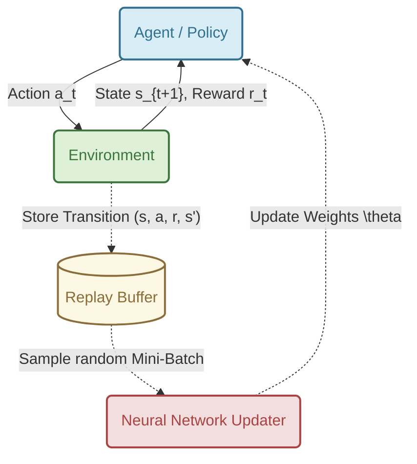

# Lecture 8: Deep Q-Learning and Double DQN

*Reference: Graesser, L., & Keng, W. L. (2019). Foundations of Deep Reinforcement Learning. Chapters 4 & 5.*

## 1. The Limits of Tabular Q-Learning

In tabular Q-learning, we maintain a table $Q(s, a)$ containing a discrete value for every single state-action pair. While mathematically guaranteed to converge for small MDPs, this completely breaks down in the real world due to the **Curse of Dimensionality**.

Consider a self-driving car. If the state is represented by a single RGB camera image of size $256 \times 256$, the number of possible states is $256^{256 \times 256 \times 3}$. This number is vastly larger than the number of atoms in the universe. We cannot store a table this large, nor can we visit every state enough times to learn its value. Discretizing the space (e.g., binning) destroys crucial nuanced information.

**The Solution:** We must use a function approximator. Specifically, we use a Deep Neural Network parameterized by weights $\theta$ to estimate the Q-value:

$$ Q(s, a; \theta) \approx q_*(s, a) $$

This allows the agent to **generalize**. If the agent learns to avoid an obstacle in one state, the neural network weights adjust, automatically updating the predicted Q-values for *all similar* states.

---

## 2. Deep Q-Networks (DQN)

A Deep Q-Network (DQN) takes the state $s$ as input and outputs a vector containing the estimated Q-value for *every* possible action simultaneously.

### 2.1 Designing the Neural Network Architecture
When formulating a neural network for a given RL problem, the architecture is strictly dictated by the environment's state and action spaces:
*   **Input Layer:** The dimensionality must exactly match the representation of the State $s$. For a grid-world, this might be a flattened 1D array of sensors. For an Atari game, this is a 3D tensor of stacked 2D pixel frames.
*   **Hidden Layers:** These are feature extractors. If the input is images, we use Convolutional layers to find spatial patterns. If the input is 1D sensors, we use dense, fully-connected (Linear) layers with non-linear activations like ReLU to discover complex relationships.
*   **Output Layer:** Unlike standard supervised classification which outputs a probability distribution (softmax), a Q-Network outputs raw, unconstrained real numbers (linear activation). The output layer has exactly one node for every possible discrete action in the environment.

By outputting all Q-values simultaneously, a single forward pass $Q(s, \cdot; \theta)$ gives us the value for every action, allowing us to instantly find $\text{argmax}_a Q(s,a)$ for our policy!

If we naively apply standard Neural Network training (Stochastic Gradient Descent) to the Q-learning update rule, we would minimize the Mean Squared Error (MSE) loss:

$$ L(\theta) = \mathbb{E} \left[ \left( \underbrace{r + \gamma \max_{a'} Q(s', a'; \theta)}_{\text{Target } y_j} - \underbrace{Q(s, a; \theta)}_{\text{Prediction}} \right)^2 \right] $$

However, if we do this naively, **the network will catastrophically fail and diverge.** Why?

### The Two Fatal Flaws of Naive Deep Q-Learning

1. **Correlated Data:** Neural networks require independent and identically distributed (i.i.d.) data to train stably. In RL, states are highly correlated (State $S_{t+1}$ is heavily dependent on State $S_t$). Training on this sequential data causes the network to "forget" past experiences and wildly overfit to the current local trajectory.
2. **Moving Targets:** In the loss function above, the target $y_j$ depends on $\theta$. As we update $\theta$ to make $Q(s,a)$ closer to the target, the target itself shifts! It's like a dog chasing its own tail, leading to severe instability and divergence.

---

## 3. The DQN Solutions (Chapter 4)

In 2015, DeepMind solved these fatal flaws with two crucial innovations that stabilized Deep Q-Learning.

### 3.1 Experience Replay
Instead of training on transitions $(s, a, r, s')$ immediately as they occur, the agent stores them in a massive circular buffer called the **Replay Buffer** (capacity $N \approx 1,000,000$). 

During training, the agent samples random mini-batches from this buffer.
* **Why it works:** Random sampling completely destroys the temporal correlation of the data, satisfying the i.i.d. requirement of neural networks. It also allows the network to learn from rare but important past transitions multiple times.



### 3.2 Target Networks
To fix the "moving target" problem, DeepMind introduced a second, separate neural network called the **Target Network** (parameterized by $\theta'$).

* The **Online Network** ($\theta$) is updated continuously via gradient descent.
* The **Target Network** ($\theta'$) is used solely to compute the target $y_j$. It is *frozen* and only updated by copying the weights from the Online Network every $C$ steps (e.g., $C=10,000$).

**The Stabilized DQN Loss Function:**
$$ L(\theta) = \mathbb{E}_{(s,a,r,s') \sim U(D)} \left[ \left( r + \gamma \max_{a'} Q(s', a'; \theta') - Q(s, a; \theta) \right)^2 \right] $$

---

## 4. The Overestimation Bias (Chapter 5)

While DQN was a massive success, researchers quickly noticed a new problem: DQN consistently and wildly **overestimates** the true action values. 


### Why does this happen?
The culprit is the $\max$ operator in the target calculation: $\max_{a'} Q(s', a'; \theta')$.

Because the Q-values are estimates produced by a neural network, they contain noise (some are accidentally too high, some are too low). The $\max$ operator acts as a filter that preferentially selects the *positive* noise. 

If you take the maximum over a set of noisy estimates, the expected maximum is strictly greater than the true maximum:
$$ \mathbb{E}[\max(X)] \ge \max(\mathbb{E}[X]) $$

Over time, these positive errors accumulate through bootstrapping, causing the Q-values to explode upwards. While uniform overestimation might not change the argmax policy, the overestimation is usually uneven, leading the agent to favor suboptimal states simply because their noise variance was higher!

---

## 5. Double Deep Q-Learning (DDQN)

To solve the overestimation bias, Hado van Hasselt (2015) introduced **Double Deep Q-Learning (DDQN)**. 

The core idea is to **decouple action selection from action evaluation.**
In standard DQN, the Target Network is used to both *select* the best next action and *evaluate* its value:
$$ y_j^{\text{DQN}} = r + \gamma Q(s', \text{argmax}_{a'} Q(s', a'; \theta'); \theta') $$

In **DDQN**, we use the *Online Network* ($\theta$) to select the best action, and the *Target Network* ($\theta'$) to evaluate it!

$$ y_j^{\text{DDQN}} = r + \gamma Q(s', \text{argmax}_{a'} Q(s', a'; \theta); \theta') $$


### Why does DDQN work?
If the Online Network overestimates an action and selects it, the Target Network (which has different weights and independent noise) is highly unlikely to have an overestimation error for that exact same action. The Target Network provides an unbiased evaluation of the action selected by the Online Network, effectively neutralizing the positive bias!

### 5.1 The Complete DDQN Algorithm

Here is the explicit pseudocode formulation for the Double Deep Q-Learning agent interaction and training loop:

```python
Initialize Replay Buffer D to capacity N
Initialize Online Network Q with random weights θ
Initialize Target Network Q_target with weights θ' = θ

For episode = 1 to M:
    Observe initial state s
    For t = 1 to T:
        # 1. Action Selection (Epsilon-Greedy)
        With probability ε select a random action a
        Otherwise select a = argmax_a Q(s, a; θ)
        
        # 2. Environment Interaction
        Execute action a in emulator and observe reward r and next state s'
        Store transition (s, a, r, s') in Replay Buffer D
        
        # 3. Learning Step
        Sample random mini-batch of transitions (s_j, a_j, r_j, s'_{j}) from D
        
        # DDQN Target Calculation
        If s'_{j} is terminal:
            y_j = r_j
        Else:
            # Online network selects best action
            best_action = argmax_a' Q(s'_{j}, a'; θ)
            # Target network evaluates that action
            y_j = r_j + γ * Q_target(s'_{j}, best_action; θ')
            
        # Perform gradient descent step on MSE Loss: (y_j - Q(s_j, a_j; θ))^2
        θ = θ - α * ∇ (y_j - Q(s_j, a_j; θ))^2
        
        # 4. Target Network Update
        If t % C == 0:
            θ' = θ
            
        s = s'
```

---

## 6. Concrete Example: Solving CartPole

To solidify these concepts, let's formulate the exact Neural Network and algorithms required to solve the classic **CartPole-v1** environment.

### 6.1 Problem Formulation
*   **The Goal:** Balance a vertical pole on a cart by pushing it left or right.
*   **The State ($S$):** An array of 4 continuous real numbers: `[Cart Position, Cart Velocity, Pole Angle, Pole Velocity At Tip]`.
*   **The Actions ($A$):** 2 discrete choices: `0` (Push Left) or `1` (Push Right).
*   **The Reward ($R$):** $+1$ for every step the pole remains upright.

### 6.2 The Neural Network Architecture
Based on the state and action space, our Multi-Layer Perceptron (MLP) must take 4 inputs and produce 2 outputs.


1.  **Input Layer:** 4 nodes receiving the raw continuous state array.
2.  **Hidden Layers:** We might choose two fully-connected dense layers of 24 neurons each, equipped with ReLU activation functions ($f(x) = \max(0, x)$).
3.  **Output Layer:** A final fully-connected dense layer with exactly 2 nodes and a Linear activation function. Node 0 outputs $Q(s, 	ext{Left})$, and Node 1 outputs $Q(s, 	ext{Right})$.

### 6.3 The Training Walkthrough

Let's trace a single iteration of the DDQN training loop for our CartPole agent.

1.  **Action Selection:**
    The agent observes the current state $S = [0.01, 0.15, -0.05, -0.2]$. It feeds this into the **Online Network** $\theta$. 
    The network outputs: `[Q(s, Left)=10.5, Q(s, Right)=8.2]`. 
    Since $10.5 > 8.2$, the agent selects `Left` (assuming it doesn't take a random $\epsilon$ action).
2.  **Environment Step:**
    The agent pushes left. The environment returns a reward of $+1$, and the cart moves to a new state $S'$. This transition $(S, 	ext{Left}, +1, S')$ is saved to the **Replay Buffer**.
3.  **Sampling:**
    To train, the agent grabs a random mini-batch of 32 past transitions from the Replay Buffer. Let's look at how it processes just *one* of those transitions: $(s_j, a_j, r_j, s'_{j})$. Let's say $r_j = 1$.
4.  **DDQN Target Calculation:**
    To find the target $y_j$, we look at the next state $s'_j$.
    *   *Step A (Selection):* The **Online Network** $\theta$ predicts values for $s'_j$: `[Q(Left)=12.0, Q(Right)=15.0]`. The max is Right (`1`). So, the Online network *selects* action `1`.
    *   *Step B (Evaluation):* The **Target Network** $\theta'$ (which has slightly older frozen weights) evaluates state $s'_j$. It predicts `[Q(Left)=11.5, Q(Right)=13.2]`. 
    *   We evaluate the *selected* action `1` using the Target Network: $13.2$.
    *   The final target is: $y_j = r_j + \gamma (13.2) = 1 + 0.99(13.2) = 14.068$.
    *(Note: If we used standard DQN, we would just take the max of the Target Network directly, ignoring the Online network's choice.)*
5.  **Loss and Update:**
    We feed the original state $s_j$ into the Online Network to get its current prediction for the action $a_j$ that was actually taken in that transition. Let's say it predicts $13.5$.
    The Mean Squared Error loss is $(14.068 - 13.5)^2$. We perform backpropagation to update the weights of the Online Network $\theta$ to minimize this error.

---

## Practice Exercises

Test your understanding of Deep Q-Learning and DDQN with these exercises:

- [Multiple Choice Questions (MCQs)](./assets/questions/mcqs.md)
- [Subjective Questions](./assets/questions/subjective.md)
- [Numerical Questions](./assets/questions/numericals.md)
- [Programming Questions](./assets/questions/programming.md)

*Solutions can be found in the [assets/questions/solutions/](./assets/questions/solutions/) folder.*
