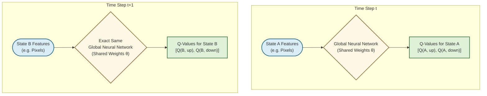
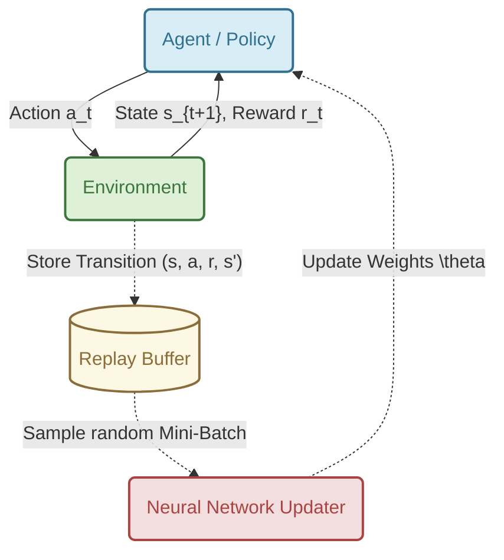
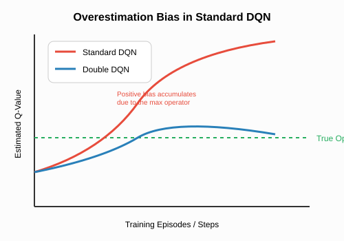
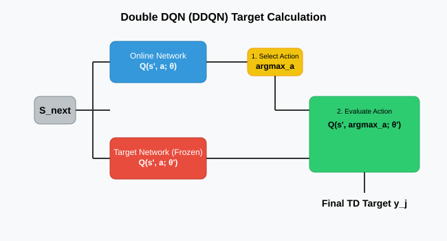
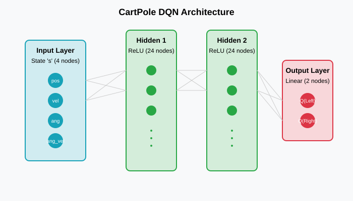
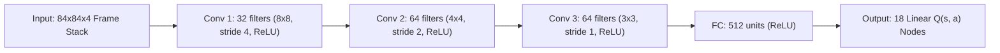

# Lecture 8: Deep Q-Learning and Double DQN

*Reference: Graesser, L., & Keng, W. L. (2019). Foundations of Deep Reinforcement Learning. Chapters 4 & 5.*

## 1. The Limits of Tabular Q-Learning

In tabular Q-learning, we maintain a table $Q(s, a)$ containing a discrete value for every single state-action pair. While mathematically guaranteed to converge for small MDPs, this completely breaks down in the real world due to the **Curse of Dimensionality**.

Consider a self-driving car. If the state is represented by a single RGB camera image of size $256 \times 256$, the number of possible states is $256^{256 \times 256 \times 3}$. This number is vastly larger than the number of atoms in the universe. We cannot store a table this large, nor can we visit every state enough times to learn its value. Discretizing the space (e.g., binning) destroys crucial nuanced information.

**The Solution:** We must use a function approximator. Specifically, we use **one single, global Deep Neural Network** parameterized by weights $\theta$ to handle every possible state in the environment. We pass the current state in as the input, and it estimates the Q-value:

$$ Q(s, a; \theta) \approx q_*(s, a) $$

This allows the agent to **generalize**. If the agent learns to avoid an obstacle in one state, the neural network weights adjust, automatically updating the predicted Q-values for *all similar* states.

### 1.1 The Generalization Magic: One Network for All States

A common misconception is that Deep RL creates a separate neural network for each state. This is incorrect and would defeat the purpose of function approximation! There is exactly **one single, global Neural Network** used for the entire environment.

Here is the step-by-step flow of how one network processes all states:
1. **Time step $t$:** The agent is in State $A$. The features of State $A$ (e.g., an array of sensor values or pixels) are fed into the input layer of the neural network. The network processes these features through its weights and outputs the Q-values specifically for State $A$.
2. **Time step $t+1$:** The agent moves to a new state, State $B$. The features of State $B$ are fed into the **exact same** neural network. It processes these new features through the *same shared weights* and outputs a new set of Q-values specifically for State $B$.



**Why is this so powerful?**
Because all states flow through the exact same network, all states share the exact same weights inside the hidden layers. 
If the agent makes a mistake in State $A$ and updates the neural network's weights $\theta$ to fix it, **those weight updates automatically apply to the entire network**. So, the next time the agent visits State $B$ (which might visually look very similar to State $A$), the neural network will naturally compute smarter Q-values for State $B$, even if the agent has never explicitly trained on State $B$ before! This is true **Generalization**.

---

## 2. Deep Q-Networks (DQN)

A Deep Q-Network (DQN) takes the state $s$ as input and outputs a vector containing the estimated Q-value for *every* possible action simultaneously.

### 2.1 Designing the Neural Network Architecture
When formulating a neural network for a given RL problem, the architecture is strictly dictated by the environment's state and action spaces:
*   **Input Layer:** The dimensionality must exactly match the representation of the State $s$. For a grid-world, this might be a flattened 1D array of sensors. For an Atari game, this is a 3D tensor of stacked 2D pixel frames.
*   **Hidden Layers:** These are feature extractors. If the input is images, we use Convolutional layers to find spatial patterns. If the input is 1D sensors, we use dense, fully-connected (Linear) layers with non-linear activations like ReLU to discover complex relationships.
*   **Output Layer:** Unlike standard supervised classification which outputs a probability distribution (softmax), a Q-Network outputs raw, unconstrained real numbers (linear activation). The output layer has exactly one node for every possible discrete action in the environment.

By outputting all Q-values simultaneously, a single forward pass $Q(s, \cdot; \theta)$ gives us the value for every action, allowing us to instantly find $\text{argmax}_a Q(s,a)$ for our policy!

If we naively apply standard Neural Network training (Stochastic Gradient Descent) to the Q-learning update rule, we would minimize the Mean Squared Error (MSE) loss:

$$ L(\theta) = \mathbb{E} \left[ \left( \underbrace{r + \gamma \max_{a'} Q(s', a'; \theta)}_{\text{Target } y_j} - \underbrace{Q(s, a; \theta)}_{\text{Prediction}} \right)^2 \right] $$

However, if we do this naively, **the network will catastrophically fail and diverge.** Why?

### The Two Fatal Flaws of Naive Deep Q-Learning

1. **Correlated Data:** Neural networks require independent and identically distributed (i.i.d.) data to train stably. In RL, states are highly correlated (State $S_{t+1}$ is heavily dependent on State $S_t$). Training on this sequential data causes the network to "forget" past experiences and wildly overfit to the current local trajectory.
2. **Moving Targets:** In the loss function above, the target $y_j$ depends on $\theta$. As we update $\theta$ to make $Q(s,a)$ closer to the target, the target itself shifts! It's like a dog chasing its own tail, leading to severe instability and divergence.

---

## 3. The DQN Solutions (Chapter 4)

In 2015, DeepMind solved these fatal flaws with two crucial innovations that stabilized Deep Q-Learning.

### 3.1 Experience Replay

Instead of training on transitions $(s, a, r, s')$ immediately as they occur, the agent stores them in a massive circular buffer called the **Replay Buffer** (capacity $N \approx 1,000,000$). 

During training, the agent samples random mini-batches from this buffer.



#### Algorithms With vs. Without Experience Replay

##### 1. Naive Deep Q-Learning (WITHOUT Experience Replay)
In this naive approach, updates are performed online using only the single current transition.

```python
Initialize Online Network Q with random weights θ
Initialize Target Network Q_target with weights θ' = θ

For episode = 1 to M:
    Observe initial state s
    For t = 1 to T:
        # Action Selection
        With probability ε select a random action a
        Otherwise select a = argmax_a Q(s, a; θ)
        
        # Environment Step
        Execute action a, observe reward r and next state s'
        
        # Direct Target Calculation (No Replay Buffer)
        If s' is terminal:
            y = r
        Else:
            y = r + γ * max_a' Q_target(s', a'; θ')
            
        # Immediate Gradient Descent Update
        # Update weights θ immediately using ONLY the single transition (s, a, r, s')
        θ = θ - α * ∇ (y - Q(s, a; θ))^2
        
        # Target Network Update
        If t % C == 0:
            θ' = θ
            
        s = s'
```

##### 2. Standard Deep Q-Learning (WITH Experience Replay)
In this stabilized approach, transitions are stored in a buffer and updates are performed on random mini-batches.

```python
Initialize Replay Buffer D to capacity N
Initialize Online Network Q with random weights θ
Initialize Target Network Q_target with weights θ' = θ

For episode = 1 to M:
    Observe initial state s
    For t = 1 to T:
        # Action Selection
        With probability ε select a random action a
        Otherwise select a = argmax_a Q(s, a; θ)
        
        # Environment Step
        Execute action a, observe reward r and next state s'
        # Store transition in buffer
        Store transition (s, a, r, s') in Replay Buffer D
        
        # Learning Step (Experience Replay)
        # Sample a random mini-batch of size B from Replay Buffer
        Sample random mini-batch of transitions (s_j, a_j, r_j, s'_{j}) from D
        
        # Target Calculation for each transition in mini-batch
        If s'_{j} is terminal:
            y_j = r_j
        Else:
            y_j = r_j + γ * max_a' Q_target(s'_{j}, a'; θ')
            
        # Gradient Descent Update on Mini-Batch Loss
        θ = θ - α * ∇ [ 1/B * Σ (y_j - Q(s_j, a_j; θ))^2 ]
        
        # Target Network Update
        If t % C == 0:
            θ' = θ
            
        s = s'
```

#### Key Benefits of Experience Replay

1. **Breaks Temporal Correlation (Satisfies the i.i.d. Assumption)**:
   * **The Mathematical Rule**: Optimization algorithms for deep neural networks (like Adam or SGD) are mathematically derived under the assumption that training data points are **independent and identically distributed (i.i.d.)**.
   * **The Problem in RL**: Reinforcement learning data is inherently sequential and highly correlated (State $S_{t+1}$ depends directly on State $S_t$). Training a network on consecutive frames causes the gradients to become heavily biased towards the current local trajectory, leading to overfitting, weight oscillations, and divergence.
   * **The Solution**: By **sampling randomly** from a large buffer of past transitions, a single training batch contains a mixture of unrelated experiences (e.g., one from 10 minutes ago, one from another episode, and one from the current step). This breaks the temporal correlation and creates an i.i.d. dataset distribution.

2. **Prevents Catastrophic Forgetting (Stable Gradient Trajectory)**:
   * **The Problem**: If an agent trains only on its immediate online stream, its learning will be dominated by its current state. For example, if a walking robot falls over, it will experience a sequence of 100 frames of being flat on the floor. Online training will force the network to overfit to "lying on the floor," which can distort and overwrite the weights previously learned for "standing and walking."
   * **The Solution**: Because the Replay Buffer stores a diverse history of experiences from all phases of learning, every random batch is guaranteed to contain a healthy mix of different scenarios (e.g., standing, walking, falling, and recovering). This keeps the gradient updates balanced and prevents the network from unlearning older skills when entering new environments.

3. **Amplifies the Value of Rare Experiences (Sample Efficiency)**:
   * **The Problem**: In many environments, positive rewards are extremely rare (e.g., finding the key to open a door in a maze). If you train online and immediately discard transitions, the network only gets **one single gradient step** to learn from that rare success before it is deleted from memory.
   * **The Solution**: Storing the successful transition in the Replay Buffer preserves it. As the agent continues to explore, that rare success will be randomly sampled and re-evaluated in multiple training batches over time, giving the network multiple opportunities to propagate that reward back to earlier states via bootstrapping.

4. **Reduces Gradient Variance (Stabilizes Convergence)**:
   * In online learning, updates are calculated based on a single step, which can be highly noisy (high variance). By averaging gradients over a randomized mini-batch, the noise cancels out, yielding a stable direction for gradient steps.

5. **Enables GPU/TPU Acceleration (Batch Parallelism)**:
   * Computing updates one transition at a time is highly inefficient for modern hardware (like GPUs/TPUs), which are optimized for parallel matrix operations. Sampling a batch of size $B$ (e.g., 32 or 64) allows the flight computer or training system to perform parallel forward and backward passes, maximizing computational throughput.

### 3.2 Target Networks
To fix the "moving target" problem, DeepMind introduced a second, separate neural network called the **Target Network** (parameterized by $\theta'$).

* The **Online Network** ($\theta$) is updated continuously via gradient descent.
* The **Target Network** ($\theta'$) is used solely to compute the target $y_j$. It is *frozen* and only updated by copying the weights from the Online Network every $C$ steps (e.g., $C=10,000$).

$$ L(\theta) = \mathbb{E}_{(s,a,r,s') \sim U(D)} \left[ \left( r + \gamma \max_{a'} Q(s', a'; \theta') - Q(s, a; \theta) \right)^2 \right] $$

### 3.3 The Complete DQN Algorithm

Here is the explicit algorithm for Deep Q-Learning (DQN) with Experience Replay and a Target Network:

```python
Initialize Replay Buffer D to capacity N
Initialize Online Network Q with random weights θ
Initialize Target Network Q_target with weights θ' = θ

For episode = 1 to M:
    Observe initial state s
    For t = 1 to T:
        # 1. Action Selection (Epsilon-Greedy)
        With probability ε select a random action a
        Otherwise select a = argmax_a Q(s, a; θ)
        
        # 2. Environment Interaction
        Execute action a, observe reward r and next state s'
        Store transition (s, a, r, s') in Replay Buffer D
        
        # 3. Learning Step (Experience Replay)
        Sample random mini-batch of transitions (s_j, a_j, r_j, s'_{j}) from D
        
        # DQN Target Calculation using Target Network (θ')
        If s'_{j} is terminal:
            y_j = r_j
        Else:
            y_j = r_j + γ * max_a' Q_target(s'_{j}, a'; θ')
            
        # Perform gradient descent step on MSE Loss: (y_j - Q(s_j, a_j; θ))^2
        θ = θ - α * ∇ (y_j - Q(s_j, a_j; θ))^2
        
        # 4. Target Network Update
        If t % C == 0:
            θ' = θ
            
        s = s'
```

### 3.4 How DQN Differs from Tabular Q-Learning

While both algorithms share the underlying Bellman equation structure, DQN modifies several core mechanisms to support deep neural networks:

| Feature | Tabular Q-Learning | Deep Q-Learning (DQN) |
| :--- | :--- | :--- |
| **Q-Value Storage** | A discrete lookup table $Q(s, a)$. | A parameterized neural network $Q(s, a; \theta)$. |
| **Target Formula** | $$ y = R + \gamma \max_{a'} Q(S', a') $$ | $$ y_j = r_j + \gamma \max_{a'} Q(s'_j, a'; \theta') $$ <br> *(Calculated using frozen Target Network weights $\theta'$)* |
| **Update Formula** | $$ Q(S, A) \leftarrow Q(S, A) + \alpha \big[ y - Q(S, A) \big] $$ | $$ \theta \leftarrow \theta + \alpha \big[ y_j - Q(s_j, a_j; \theta) \big] \nabla_{\theta} Q(s_j, a_j; \theta) $$ <br> *(Gradient descent step on Online Network weights $\theta$)* |
| **Generalization** | **None.** Learning about state $S_1$ teaches the agent nothing about state $S_2$. | **High.** Shares weights across states, allowing the model to generalize to unseen states. |
| **Data Flow** | Sequential online updates (learns from the current transition immediately). | Randomized experience replay sampling (destroys correlation to satisfy i.i.d.). |
| **State Space** | Restricted to small, discrete state spaces. | Scalable to continuous or high-dimensional states (e.g. pixels). |

---

## 4. The Overestimation Bias (Chapter 5)

While DQN was a massive success, researchers quickly noticed a new problem: DQN consistently and wildly **overestimates** the true action values. 



### Why does this happen?
The culprit is the $\max$ operator in the target calculation: $\max_{a'} Q(s', a'; \theta')$.

Because the Q-values are estimates produced by a neural network, they contain noise (some are accidentally too high, some are too low). The $\max$ operator acts as a filter that preferentially selects the *positive* noise. 

If you take the maximum over a set of noisy estimates, the expected maximum is strictly greater than the true maximum:
$$ \mathbb{E}[\max(X)] \ge \max(\mathbb{E}[X]) $$

Over time, these positive errors accumulate through bootstrapping, causing the Q-values to explode upwards. While uniform overestimation might not change the argmax policy, the overestimation is usually uneven, leading the agent to favor suboptimal states simply because their noise variance was higher!

---

## 5. Double Deep Q-Learning (DDQN)

To solve the overestimation bias, Hado van Hasselt (2015) introduced **Double Deep Q-Learning (DDQN)**. 

The core idea is to **decouple action selection from action evaluation.**
In standard DQN, the Target Network is used to both *select* the best next action and *evaluate* its value:
$$ y_j^{\text{DQN}} = r + \gamma Q(s', \text{argmax}_{a'} Q(s', a'; \theta'); \theta') $$

In **DDQN**, we use the *Online Network* ($\theta$) to select the best action, and the *Target Network* ($\theta'$) to evaluate it!

$$ y_j^{\text{DDQN}} = r + \gamma Q(s', \text{argmax}_{a'} Q(s', a'; \theta); \theta') $$



### Why does DDQN work?
If the Online Network overestimates an action and selects it, the Target Network (which has different weights and independent noise) is highly unlikely to have an overestimation error for that exact same action. The Target Network provides an unbiased evaluation of the action selected by the Online Network, effectively neutralizing the positive bias!

### 5.1 The Complete DDQN Algorithm

Here is the explicit pseudocode formulation for the Double Deep Q-Learning agent interaction and training loop:

```python
Initialize Replay Buffer D to capacity N
Initialize Online Network Q with random weights θ
Initialize Target Network Q_target with weights θ' = θ

For episode = 1 to M:
    Observe initial state s
    For t = 1 to T:
        # 1. Action Selection (Epsilon-Greedy)
        With probability ε select a random action a
        Otherwise select a = argmax_a Q(s, a; θ)
        
        # 2. Environment Interaction
        Execute action a in emulator and observe reward r and next state s'
        Store transition (s, a, r, s') in Replay Buffer D
        
        # 3. Learning Step
        Sample random mini-batch of transitions (s_j, a_j, r_j, s'_{j}) from D
        
        # DDQN Target Calculation
        If s'_{j} is terminal:
            y_j = r_j
        Else:
            # Online network selects best action
            best_action = argmax_a' Q(s'_{j}, a'; θ)
            # Target network evaluates that action
            y_j = r_j + γ * Q_target(s'_{j}, best_action; θ')
            
        # Perform gradient descent step on MSE Loss: (y_j - Q(s_j, a_j; θ))^2
        θ = θ - α * ∇ (y_j - Q(s_j, a_j; θ))^2
        
        # 4. Target Network Update
        If t % C == 0:
            θ' = θ
            
        s = s'
```

---

## 6. Concrete Example: Solving CartPole

To solidify these concepts, let's formulate the exact Neural Network and algorithms required to solve the classic **CartPole-v1** environment.

### 6.1 Problem Formulation
*   **The Goal:** Balance a vertical pole on a cart by pushing it left or right.
*   **The State ($S$):** An array of 4 continuous real numbers: `[Cart Position, Cart Velocity, Pole Angle, Pole Velocity At Tip]`.
*   **The Actions ($A$):** 2 discrete choices: `0` (Push Left) or `1` (Push Right).
*   **The Reward ($R$):** $+1$ for every step the pole remains upright.

### 6.2 The Neural Network Architecture
Based on the state and action space, our Multi-Layer Perceptron (MLP) must take 4 inputs and produce 2 outputs.



1.  **Input Layer:** 4 nodes receiving the raw continuous state array.
2.  **Hidden Layers:** We might choose two fully-connected dense layers of 24 neurons each, equipped with ReLU activation functions ($f(x) = \max(0, x)$).
3.  **Output Layer:** A final fully-connected dense layer with exactly 2 nodes and a Linear activation function. Node 0 outputs $Q(s, 	ext{Left})$, and Node 1 outputs $Q(s, 	ext{Right})$.

### 6.3 The Training Walkthrough

Let's trace a single iteration of the DDQN training loop for our CartPole agent.

1.  **Action Selection:**
    The agent observes the current state $S = [0.01, 0.15, -0.05, -0.2]$. It feeds this into the **Online Network** $\theta$. 
    The network outputs: `[Q(s, Left)=10.5, Q(s, Right)=8.2]`. 
    Since $10.5 > 8.2$, the agent selects `Left` (assuming it doesn't take a random $\epsilon$ action).
2.  **Environment Step:**
    The agent pushes left. The environment returns a reward of $+1$, and the cart moves to a new state $S'$. This transition $(S, 	ext{Left}, +1, S')$ is saved to the **Replay Buffer**.
3.  **Sampling:**
    To train, the agent grabs a random mini-batch of 32 past transitions from the Replay Buffer. Let's look at how it processes just *one* of those transitions: $(s_j, a_j, r_j, s'_{j})$. Let's say $r_j = 1$.
4.  **DDQN Target Calculation:**
    To find the target $y_j$, we look at the next state $s'_j$.
    *   *Step A (Selection):* The **Online Network** $\theta$ predicts values for $s'_j$: `[Q(Left)=12.0, Q(Right)=15.0]`. The max is Right (`1`). So, the Online network *selects* action `1`.
    *   *Step B (Evaluation):* The **Target Network** $\theta'$ (which has slightly older frozen weights) evaluates state $s'_j$. It predicts `[Q(Left)=11.5, Q(Right)=13.2]`. 
    *   We evaluate the *selected* action `1` using the Target Network: $13.2$.
    *   The final target is: $y_j = r_j + \gamma (13.2) = 1 + 0.99(13.2) = 14.068$.
    *(Note: If we used standard DQN, we would just take the max of the Target Network directly, ignoring the Online network's choice.)*
5.  **Loss and Update:**
    We feed the original state $s_j$ into the Online Network to get its current prediction for the action $a_j$ that was actually taken in that transition. Let's say it predicts $13.5$.
    The Mean Squared Error loss is $(14.068 - 13.5)^2$. We perform backpropagation to update the weights of the Online Network $\theta$ to minimize this error.

---

## 7. Seminal Research Paper: Mnih et al. (2015) - Nature

* **Title**: [Human-level control through deep reinforcement learning](https://www.nature.com/articles/nature14236)
* **Authors**: Volodymyr Mnih, Koray Kavukcuoglu, David Silver, Andrei A. Rusu, Joel Veness, Marc G. Bellemare, Alex Graves, Martin Riedmiller, Andreas K. Fidjeland, Georg Ostrovski, Stig Petersen, Charles Beattie, Amir Sadik, Ioannis Antonoglou, Helen King, Dharshan Kumaran, Daan Wierstra, Shane Legg & Demis Hassabis.
* **Published**: *Nature*, Volume 518, pages 529–533 (26 February 2015).
* **Open Access PDF Link**: [Google DeepMind Media - DQN Nature Paper](https://storage.googleapis.com/deepmind-media/dqn/DQNNaturePaper.pdf)

### 7.1 Context and Motivation
Prior to this paper, reinforcement learning algorithms were restricted to small, low-dimensional toy environments or relied on heavily engineered hand-crafted features. DeepMind's goal was to create a **single, general-purpose agent** that could learn to master a wide array of challenging tasks directly from high-dimensional sensory input (pixels) without any game-specific information, rules, or internal states.

They tested their agent on **49 Atari 2600 games** inside the Arcade Learning Environment (ALE). The exact same network architecture, hyperparameters, and learning settings were used across all 49 games, demonstrating that the agent could adapt its representations to completely different game mechanics (e.g., side-scrollers, shooters, sports games).

### 7.2 The Deep Convolutional Network (DQN) Architecture
Because the input consists of raw pixels, the paper utilized a Convolutional Neural Network (CNN) to extract spatial features directly from the screen:

* **Input Layer**: Takes an input tensor of size $84 \times 84 \times 4$. The 4 channels represent a stack of the 4 most recent video frames. Stacking frames resolves the **partial observability** of a single frame (e.g., a single image of a ball doesn't tell you which direction it is traveling or how fast; stacking 4 frames reveals velocity and trajectory).
* **Convolutional Layers**:
  1. **Layer 1**: 32 filters of size $8 \times 8$ with stride 4, followed by ReLU activation.
  2. **Layer 2**: 64 filters of size $4 \times 4$ with stride 2, followed by ReLU activation.
  3. **Layer 3**: 64 filters of size $3 \times 3$ with stride 1, followed by ReLU activation.
* **Fully Connected Layers**: A dense layer with 512 linear units, followed by ReLU.
* **Output Layer**: A dense layer with a Linear activation function, containing exactly one output node for each of the $18$ possible discrete game actions.



### 7.3 Key Engineering Decisions & Training Tricks

In addition to **Experience Replay** and **Target Networks**, the paper introduced several crucial engineering details that enabled DQN's success:

1. **Reward Clipping**:
   The scores and rewards across different Atari games vary wildly (e.g., in *Pong* you get $\pm 1$, while in *Space Invaders* you can get hundreds of points). To prevent gradient explosion and use the same learning rate across all games, the paper clipped all positive rewards to $+1$, negative rewards to $-1$, and unchanged states to $0$. While this makes it impossible for the agent to distinguish between a small reward and a huge reward, it ensures highly stable gradient descent updates.
2. **Frame Skipping**:
   Processing every frame is computationally expensive, and consecutive frames change very little. The agent only selects an action on every $k$-th frame (specifically $k = 4$ for most games), and that selected action is automatically repeated for the intermediate frames. This reduced computation by roughly $4\times$ and aligned the agent's decision speed closer to human reaction times.
3. **Huber Loss / Error Clipping**:
   The squared error loss $(y - Q)^2$ can lead to massive gradients if the target value differs greatly from the prediction. The paper used a Huber loss (which acts quadratically for small errors but switches to linear scaling for large errors), effectively clipping the gradients to $[-1, 1]$ to maintain optimization stability.

### 7.4 Key Results and Legacy
* **Human-Level Achievement**: The DQN agent achieved a score comparable to or exceeding a professional human games tester on **29 out of 49 games** (e.g., achieving over $1300\%$ of human performance in *Pinball* and $900\%$ in *Breakout*).
* **Representation Learning**: By analyzing the high-dimensional activations in the fully connected layers using t-SNE, the authors demonstrated that the network naturally clustered states based on their long-term strategic value (e.g., grouping visually distinct frames together because they shared the same number of lives or danger level).
* **Seminal Status**: This paper is widely considered the birth of **Deep Reinforcement Learning (DRL)**, bridging the gap between deep feature extraction and temporal difference control.

---

## 8. Why CNNs? The Rationale vs. Classical Feature Encodings

A common question is: *Why did DeepMind use a Convolutional Neural Network (CNN) to process the Atari screens? Can't we just feed raw pixel coordinates, or use the coarse/tile encoding techniques from earlier lectures?*

To understand the design decisions behind DQN, we must compare how CNNs extract spatial features versus how classical coordinate-based or tile coding methods scale to high-dimensional images.

### 8.1 The Limitations of Pixel Coordinates and Flat MLPs
If we flatten an image (e.g., $84 \times 84 = 7,056$ pixels) and feed it directly into a standard fully-connected Multi-Layer Perceptron (MLP) or use raw coordinates:
1. **Loss of Spatial Topology**: A flat vector treats pixels that are visually adjacent (e.g., pixel $(x, y)$ and pixel $(x, y+1)$) as completely independent. The network must spend millions of training samples just to "relearn" the basic 2D geometry of the grid.
2. **No Translation Invariance**: If an object (like a ball in *Breakout*) shifts 3 pixels to the right, its visual representation in a flat vector changes completely. An MLP or a coordinate-based model has to learn what a "ball" is at *every single coordinate* on the screen individually.

### 8.2 The Curse of Dimensionality in Tile/Coarse Coding
Tile coding and coarse coding are highly efficient for low-dimensional continuous spaces (e.g., CartPole state space of 4 dimensions). However, they completely fail when applied directly to images:
* **Exponential Scaling**: The number of tiles required scales exponentially with the number of state dimensions:
  $$ \text{Total Tiles} \approx (\text{Bins per dimension})^{\text{Dimensions}} $$
* For a tiny $84 \times 84$ grayscale image (7,056 dimensions), even if we use a binary discretization (only 2 bins per pixel, representing either black or white), the number of required tiles would be:
  $$ 2^{7056} \approx 1.5 \times 10^{2124} $$
  This is far larger than the number of atoms in the observable universe. We cannot store, let alone compute, a tile-coded representation of an image.

### 8.3 Rationale and Advantages of CNNs
CNNs solve these limitations by using three core principles:

| Principle | Explanation | RL Advantage |
| :--- | :--- | :--- |
| **Local Receptive Fields** | Neurons in a convolutional layer connect only to a small localized region of the input (e.g., a $3 \times 3$ kernel). | Captures local spatial correlations (e.g., grouping pixels into lines, edges, and small shapes). |
| **Shared Weights** | The same kernel/filter is slid (convolved) across the entire image. | Drastically reduces the number of parameters and enforces **translation invariance** (a ball is recognized as a ball regardless of its screen position). |
| **Hierarchical Representation** | Stacked layers extract progressively abstract features (early layers find edges $\rightarrow$ middle layers find shapes/paddles $\rightarrow$ deep layers find full game states). | Eliminates the need for hand-crafted feature engineering. The network *learns* what features are relevant directly from the reward signal. |

---

### 8.4 Are Coarse and Tile Coding Still Relevant in the Age of CNNs?
Yes! While CNNs dominate high-dimensional vision tasks, classical feature encoding methods (like tile coding, radial basis functions, and coarse coding) remain highly relevant in modern RL for several reasons:

1. **Ultra-Low Compute & Edge Devices**:
   * CNNs require millions of floating-point multiplications (FLOPs) per forward pass, making them power-hungry and slow on microcontrollers or embedded edge systems.
   * Tile coding requires **zero multiplications**—only index lookups and simple additions. It is the gold standard for real-time control loops in low-power robotics or IoT devices.
2. **Low-Dimensional Continuous Environments**:
   * For environments with simple state spaces (like robotic joint angles, velocity sensors, or temperature control where state size $D \le 6$), tile coding is often much faster to train and more sample-efficient than a deep neural network, reaching convergence in seconds.
3. **Explainability and Safety-Critical Systems**:
   * Deep neural networks are "black boxes"; it is very difficult to guarantee that a CNN won't make a catastrophic mistake in an unseen state.
   * Tile coding with linear function approximation is **fully explainable**. The weight of each tile represents its exact contribution to the Q-value. This transparency is crucial for safety-critical fields like aerospace, automated manufacturing, and medicine.
4. **Hybrid Architectures**:
   * Modern hybrid systems use a CNN to compress a high-dimensional image into a small, low-dimensional feature vector, which is then passed to a tile coder or RBF network for rapid, stable linear value estimation at the final layer.

### 8.5 The Conceptual Bridge: CNNs as Learnable, Hierarchical Coarse Coding

Your intuition is spot on! At a high conceptual level, **a CNN can be viewed as a learnable, multi-layered, hierarchical extension of coarse coding.** 

Here is how the concepts map directly to each other:

#### 1. Receptive Fields: Static vs. Learnable
* **In Coarse Coding**: You hand-design static, fixed receptive fields (like circles or grids in tile coding). The mapping from the state space $s$ to the feature vector $\mathbf{x}(s)$ is set in stone. The learning process only adjusts the *final output weights* $\mathbf{w}$ associated with these fixed shapes.
* **In a CNN**: A convolutional kernel (e.g., a $3 \times 3$ sliding window) is itself a **receptive field**. However, instead of being fixed, the parameters of this receptive field (the kernel weights) are **learned dynamically** via backpropagation. The network alters the "shapes" and "positions" of what it detects to maximize the reward.

#### 2. Stacking Representations: Flat vs. Hierarchical
* **In Coarse Coding**: The feature representation is "flat." You map the input directly to active shapes in a single layer.
* **In a CNN**: The representations are **hierarchical**. Layer 1 detects simple visual receptive fields (edges). Layer 2 slides its kernels over Layer 1's activations, detecting receptive fields of receptive fields (shapes, boundaries). Deep layers combine these into highly abstract concepts (paddles, enemies, paths).

#### Key Mechanical Differences
While conceptually similar, they differ in execution:

| Feature | Coarse / Tile Coding | Convolutional Neural Network (CNN) |
| :--- | :--- | :--- |
| **Receptive Field Design** | Fixed, static, hand-designed. | Learned, dynamic, data-driven. |
| **Hierarchy** | Flat (one mapping layer). | Deep (hierarchical stack of representations). |
| **Activation Values** | Binary ($0.0$ or $1.0$) and highly sparse. | Continuous (real numbers) and typically dense. |
| **Computational Cost** | Extremely low (additions and index lookups only). | High (requires intensive matrix multiplications). |
| **Generalization Source** | Overlapping shapes (geometric proximity). | Shared kernel weights (functional and visual similarity). |

---

## Practice Exercises

Test your understanding of Deep Q-Learning and DDQN with these exercises:

- [Multiple Choice Questions (MCQs)](./assets/questions/mcqs.md)
- [Subjective Questions](./assets/questions/subjective.md)
- [Numerical Questions](./assets/questions/numericals.md)
- [Programming Questions](./assets/questions/programming.md)

*Solutions can be found in the [assets/questions/solutions/](./assets/questions/solutions/) folder.*
