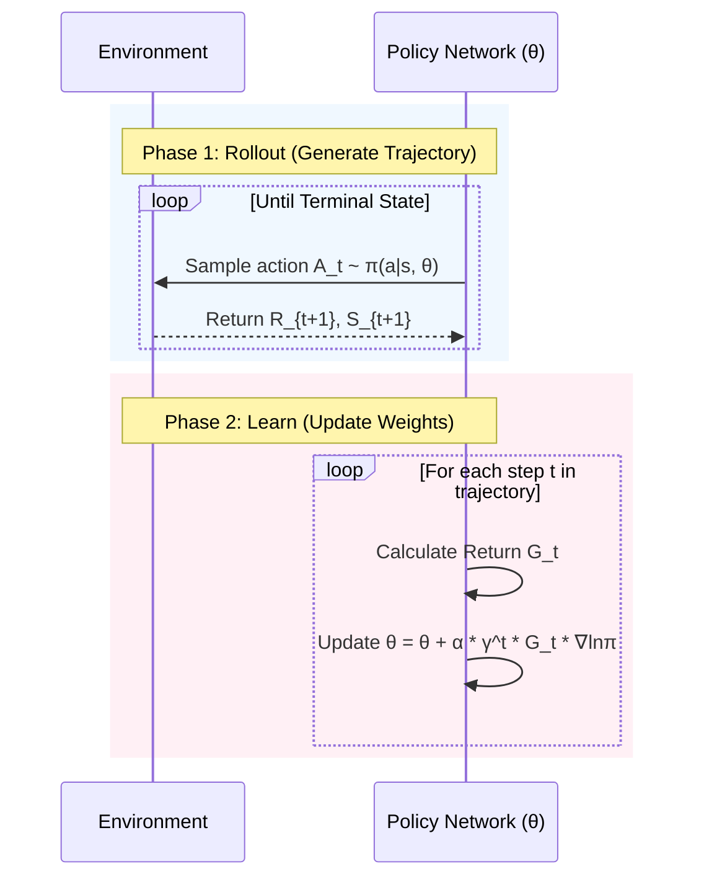
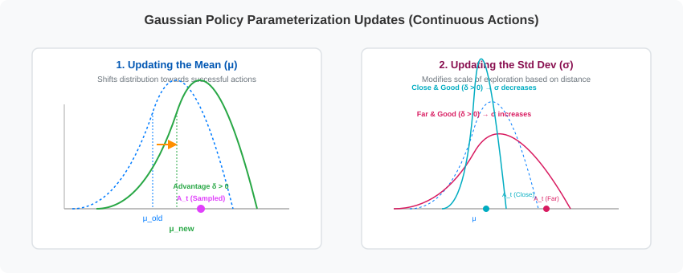

# Lecture 9: Policy Gradient Methods

*Reference: Sutton & Barto (2018). Reinforcement Learning: An Introduction. Chapter 13.*
*Reference: Graesser, L., & Keng, W. L. (2019). Foundations of Deep Reinforcement Learning. Chapter 6.*

## 1. Value-Based vs. Policy-Based Methods

Up to this point, all our algorithms (Q-learning, SARSA, DQN) have been **Value-Based**. We train a function approximator to estimate the value of an action, $Q(s,a)$, and our policy simply acts greedily with respect to those values: $\pi(s) = \text{argmax}_a Q(s,a)$.

**Policy-Based Methods** (Policy Gradients) take a completely different approach. We bypass the value function entirely and train a neural network to directly output the policy itself. 
The neural network takes the state $s$ as input, and outputs a probability distribution over all possible actions: $\pi(a|s, \theta)$.

### Why use Policy Gradients instead of DQN?
1. **Continuous Action Spaces:** DQN requires us to compute $\text{argmax}_a Q(s,a)$. If the action space is continuous (e.g., the steering wheel angle of a car), finding the exact maximum of a complex neural network over an infinite continuous space is computationally intractable. A Policy Gradient method simply outputs the mean and standard deviation of a Gaussian distribution for the steering angle.
2. **Stochastic Policies:** Q-learning always converges to a *deterministic* policy (it always picks the same action in a given state). But in games like Rock-Paper-Scissors, a deterministic policy will be crushed by an opponent. You *must* play stochastically (33% rock, 33% paper, 33% scissors) to act optimally. Policy Gradients naturally learn true stochastic probabilities.

---

## 2. The Policy Gradient Theorem

Our goal is to find the neural network weights $\theta$ that maximize the expected return $J(\theta)$ of our policy:
$$ J(\theta) = \mathbb{E}_{\tau \sim \pi_{\theta}} [G(\tau)] $$
*(where $\tau$ is a full trajectory/rollout and $G(\tau)$ is the total reward of that trajectory)*

To maximize this, we need to perform gradient ascent: 
$$ \theta_{t+1} = \theta_t + \alpha \nabla_{\theta} J(\theta_t) $$

However, taking the gradient of an expectation that *depends on the environment's unknown transition dynamics* (the physics of the environment) seems impossible! Let's walk through the mathematical derivation of how this is solved.

---

### Step-by-Step Mathematical Derivation

#### 1. Expressing the Expectation as a Sum
First, write the expectation of the return $J(\theta)$ explicitly as a sum over all possible trajectories $\tau$:
$$ J(\theta) = \sum_{\tau} P(\tau; \theta) G(\tau) $$
Where $P(\tau; \theta)$ is the probability of a trajectory $\tau$ occurring when selecting actions according to policy parameters $\theta$.

If we take the gradient with respect to $\theta$:
$$ \nabla_{\theta} J(\theta) = \nabla_{\theta} \sum_{\tau} P(\tau; \theta) G(\tau) = \sum_{\tau} \nabla_{\theta} P(\tau; \theta) G(\tau) $$

> **The Obstacle:** We cannot easily estimate this sum via simulation because $\nabla_{\theta} P(\tau; \theta)$ is *not* a probability distribution (it does not sum to $1$). We need to rewrite this so we can represent it as an expectation and estimate it using samples.

#### 2. The Likelihood Ratio / Log-Derivative Trick
Using standard calculus, the derivative of a natural logarithm is:
$$ \nabla_{\theta} \ln x = \frac{\nabla_{\theta} x}{x} \implies \nabla_{\theta} x = x \nabla_{\theta} \ln x $$

Applying this identity to the trajectory probability $P(\tau; \theta)$:
$$ \nabla_{\theta} P(\tau; \theta) = P(\tau; \theta) \nabla_{\theta} \ln P(\tau; \theta) $$

Substituting this back into our gradient equation gives:
$$ \nabla_{\theta} J(\theta) = \sum_{\tau} P(\tau; \theta) \nabla_{\theta} \ln P(\tau; \theta) G(\tau) $$

Since $P(\tau; \theta)$ is now back in the equation, we can convert this sum back into an expectation:
$$ \nabla_{\theta} J(\theta) = \mathbb{E}_{\tau \sim \pi_{\theta}} [ \nabla_{\theta} \ln P(\tau; \theta) G(\tau) ] $$

#### 3. Eliminating the Environment Transition Dynamics
A trajectory $\tau = (s_0, a_0, s_1, a_1, \dots, s_T)$ is generated by the combination of the policy choosing actions and the environment determining the next states. The probability of the trajectory is:
$$ P(\tau; \theta) = \rho_0(s_0) \prod_{t=0}^{T-1} \pi(a_t|s_t, \theta) p(s_{t+1}|s_t, a_t) $$
Where $\rho_0(s_0)$ is the initial state distribution, and $p(s_{t+1}|s_t, a_t)$ represents the environment's transition dynamics.

Taking the natural log of this product transforms it into a sum:
$$ \ln P(\tau; \theta) = \ln \rho_0(s_0) + \sum_{t=0}^{T-1} \ln \pi(a_t|s_t, \theta) + \sum_{t=0}^{T-1} \ln p(s_{t+1}|s_t, a_t) $$

Now, we take the gradient with respect to $\theta$:
$$ \nabla_{\theta} \ln P(\tau; \theta) = \nabla_{\theta} \ln \rho_0(s_0) + \sum_{t=0}^{T-1} \nabla_{\theta} \ln \pi(a_t|s_t, \theta) + \sum_{t=0}^{T-1} \nabla_{\theta} \ln p(s_{t+1}|s_t, a_t) $$

Because the initial state distribution $\rho_0$ and transition dynamics $p$ **do not depend on the policy parameters $\theta$**, their gradients are exactly $0$:
* $\nabla_{\theta} \ln \rho_0(s_0) = 0$
* $\nabla_{\theta} \ln p(s_{t+1}|s_t, a_t) = 0$

This simplifies to:
$$ \nabla_{\theta} \ln P(\tau; \theta) = \sum_{t=0}^{T-1} \nabla_{\theta} \ln \pi(a_t|s_t, \theta) $$

Thus, **the unknown dynamics of the environment completely drop out of the gradient calculation!**

---

### The Policy Gradient Theorem Formulation

Substituting our simplified trajectory gradient back, we obtain the **Policy Gradient Theorem**:
$$ \nabla J(\theta) = \mathbb{E}_{\tau \sim \pi_{\theta}} \left[ G(\tau) \sum_{t=0}^{T-1} \nabla_{\theta} \ln \pi(A_t|S_t, \theta) \right] $$

By leveraging the temporal structure (past actions cannot be caused by future rewards) and rewriting this over state-action distributions, we can express it in terms of the state-action value function $q_{\pi}(s,a)$:
$$ \nabla J(\theta) \propto \sum_{s} \mu(s) \sum_{a} q_{\pi}(s,a) \nabla_{\theta} \pi(a|s, \theta) $$

Which can also be written in expectation form as:
$$ \nabla J(\theta) = \mathbb{E}_{\pi} [ q_{\pi}(S_t, A_t) \nabla_{\theta} \ln \pi(A_t|S_t, \theta) ] $$

**Intuition:** 
* $\nabla_{\theta} \ln \pi(A_t|S_t, \theta)$ points in the parameter space direction that increases the probability of taking action $A_t$ in state $S_t$.
* If an action $A_t$ leads to a high Q-value ($q_{\pi} > 0$), we push the weights $\theta$ in the direction of the gradient to **increase** the probability of taking that action again.
* If the Q-value is low or negative, we push the probabilities **down**.
* Scaling the gradient by $q_{\pi}(S_t, A_t)$ ensures that we reinforce good actions heavily and penalize poor actions.

---

## 3. Policy Parameterizations: Softmax vs. Gaussian

A policy gradient algorithm (whether it is REINFORCE or Actor-Critic) requires a **differentiable policy parameterization** $\pi(a|s, \theta)$. The algorithm update formulas are written in terms of the abstract gradient $\nabla_{\theta} \ln \pi(A_t|S_t, \theta)$.

In practice, how we calculate this gradient and how we select actions depends entirely on the nature of the action space:

### A. Softmax Policy (Discrete Action Spaces)
For discrete action spaces, the neural network (or function approximator) outputs a real-valued preference $h(s, a, \theta) \in \mathbb{R}$ for each action $a \in \mathcal{A}$. Action probabilities are computed using the **softmax function**:
$$ \pi(a|s, \theta) \doteq \frac{e^{h(s, a, \theta)}}{\sum_{b \in \mathcal{A}} e^{h(s, b, \theta)}} $$

* **Action Selection Step:**
  1. Forward pass: Feed state $S_t$ into the network to obtain preferences $h(S_t, a, \theta)$ for all actions.
  2. Compute probabilities $\pi(a|S_t, \theta)$ using the softmax formula.
  3. Sample action $A_t$ from the resulting probability distribution.
* **Log-Gradient Update Step:**
  The gradient of the log-probability of the chosen action $A_t$ is:
  $$ \nabla_{\theta} \ln \pi(A_t|S_t, \theta) = \nabla_{\theta} h(S_t, A_t, \theta) - \sum_{b \in \mathcal{A}} \pi(b|S_t, \theta) \nabla_{\theta} h(S_t, b, \theta) $$

### B. Gaussian Policy (Continuous Action Spaces)
For continuous action spaces (where actions are real numbers), the policy is represented by a probability density function. Typically, we use a **Gaussian (Normal) distribution**:
$$ \pi(a|s, \theta) \doteq \frac{1}{\sigma(s, \theta)\sqrt{2\pi}} \exp \left( -\frac{(a - \mu(s, \theta))^2}{2\sigma(s, \theta)^2} \right) $$

* **Action Selection Step:**
  1. Forward pass: Feed state $S_t$ into the network to obtain the mean $\mu(S_t, \theta_{\mu})$ and log-variance/log-std $\eta(S_t, \theta_{\sigma})$.
  2. Compute standard deviation: $\sigma(S_t, \theta_{\sigma}) = \exp(\eta(S_t, \theta_{\sigma}))$.
  3. Sample action $A_t \sim \mathcal{N}(\mu(S_t, \theta_{\mu}), \sigma(S_t, \theta_{\sigma})^2)$ (typically using the reparameterization trick: $A_t = \mu(S_t) + \sigma(S_t) \odot \epsilon$ where $\epsilon \sim \mathcal{N}(0, 1)$).
* **Log-Gradient Update Step:**
  The gradients with respect to the mean and standard deviation parameters are computed analytically:
  * Mean: $\nabla_{\theta_{\mu}} \ln \pi(A_t|S_t, \theta) = \frac{A_t - \mu(S_t, \theta)}{\sigma(S_t, \theta)^2} \nabla_{\theta_{\mu}} \mu(S_t, \theta_{\mu})$
  * Std: $\nabla_{\theta_{\sigma}} \ln \pi(A_t|S_t, \theta) = \left( \frac{(A_t - \mu(S_t, \theta))^2}{\sigma(S_t, \theta)^2} - 1 \right) \nabla_{\theta_{\sigma}} \eta(S_t, \theta_{\sigma})$

---

## 4. The REINFORCE Algorithm (Monte Carlo Policy Gradient)

Since we don't know the exact $q_{\pi}(S_t, A_t)$, the simplest thing we can do is use a Monte Carlo sample. We play out an entire episode, and use the actual observed Return $G_t$ as an unbiased estimate for $q_{\pi}$.

This is described in **Section 13.3** of Sutton & Barto.

### The $\gamma^t$ Discount Factor in the Update
In the theoretical derivation of the discounted policy gradient, the objective is defined as the value of the start state $J(\theta) \doteq v_{\pi_{\theta}}(s_0)$. When we use discounting ($\gamma < 1$), states visited later in the episode contribute less to the start state value. 

To account for this mathematically, the update at time step $t$ is scaled by $\gamma^t$:
$$ \theta_{t+1} = \theta_t + \alpha \gamma^t G_t \nabla_{\theta} \ln \pi(A_t|S_t, \theta) $$

> **Note on Deep RL Practice:** In modern deep reinforcement learning implementations (like those using neural networks for continuous tasks), the $\gamma^t$ term is often omitted (set to 1). This is because the exponential decay of $\gamma^t$ causes updates late in long episodes to become extremely small, leading to slow training of neural networks. However, the $\gamma^t$ term is mathematically required for the gradient of the discounted start-state objective.

---

### REINFORCE Pseudo-code (Sutton & Barto 13.3)

$$
\begin{array}{l}
\textbf{Input:} \text{ a differentiable policy parameterization } \pi(a|s, \theta) \\
\textbf{Parameters:} \text{ step size } \alpha > 0 \\
\textbf{Initialize:} \text{ policy parameter } \theta \in \mathbb{R}^{d'} \\
\\
\textbf{Loop forever (for each episode):} \\
\quad \text{Generate an episode } S_0, A_0, R_1, \dots, S_{T-1}, A_{T-1}, R_T \text{ where actions are sampled as:} \\
\quad \quad \bullet \text{ Discrete: compute preferences } h(S_t, a, \theta) \xrightarrow{\text{softmax}} \pi(a|S_t, \theta) \text{ and sample } A_t \\
\quad \quad \bullet \text{ Continuous: compute } \mu(S_t, \theta), \sigma(S_t, \theta) \text{ and sample } A_t \sim \mathcal{N}(\mu, \sigma^2) \\
\quad \textbf{Loop for each step of the episode } t = 0, 1, \dots, T-1: \\
\qquad G \leftarrow \sum_{k=t+1}^{T} \gamma^{k-t-1} R_k \\
\qquad \theta \leftarrow \theta + \alpha \gamma^t G \nabla_{\theta} \ln \pi(A_t | S_t, \theta) \quad \text{(Log-gradient update computed as per Section 3)}
\end{array}
$$

### The Problem with REINFORCE: High Variance
Because REINFORCE relies on full Monte Carlo rollouts ($G_t$), it suffers from massive variance. A single action early in an episode might be brilliant, but if the agent randomly makes a terrible mistake later in the episode, $G_t$ will be negative, and the network will unfairly penalize that early brilliant action.

---

## 4. REINFORCE with Baseline (Sutton & Barto 13.4)

To fix the variance problem, we can subtract a **baseline** $b(s)$ from the return. The baseline can be any function, as long as it does not depend on the action $a$. 

$$ \theta_{t+1} = \theta_t + \alpha \gamma^t (G_t - b(S_t)) \nabla_{\theta} \ln \pi(A_t|S_t, \theta) $$

The most common baseline is a learned estimate of the state-value function, $\hat{v}(s, \mathbf{w})$.
The term $(G_t - \hat{v}(S_t, \mathbf{w}))$ is the **Advantage** (how much better this action's outcome was compared to our average expectation of the state).

### Proof of Unbiased Baseline
We want to prove that subtracting a baseline $b(s)$ that is independent of action $a$ does not introduce any bias to the expected gradient:
$$ \mathbb{E}_{A_t \sim \pi} [ b(S_t) \nabla_{\theta} \ln \pi(A_t|S_t, \theta) ] = 0 $$

**Proof:**
For a given state $s$, the expected value of the baseline gradient term is:
$$ \sum_{a} \pi(a|s, \theta) b(s) \nabla_{\theta} \ln \pi(a|s, \theta) $$

Using the identity $\nabla \ln x = \frac{\nabla x}{x}$:
$$ = \sum_{a} \pi(a|s, \theta) b(s) \frac{\nabla_{\theta} \pi(a|s, \theta)}{\pi(a|s, \theta)} $$

Simplifying (canceling $\pi(a|s, \theta)$):
$$ = \sum_{a} b(s) \nabla_{\theta} \pi(a|s, \theta) $$

Since the baseline $b(s)$ has no dependence on the action $a$, we can pull it out of the summation:
$$ = b(s) \sum_{a} \nabla_{\theta} \pi(a|s, \theta) $$

Now we swap the gradient operator and the summation:
$$ = b(s) \nabla_{\theta} \sum_{a} \pi(a|s, \theta) $$

Because $\pi(a|s, \theta)$ is a probability distribution over actions, its sum over all possible actions must be exactly $1$:
$$ \sum_{a} \pi(a|s, \theta) = 1 $$

Substituting this back:
$$ = b(s) \nabla_{\theta} (1) $$

Since the gradient of a constant is $0$:
$$ = b(s) \cdot 0 = 0 $$

Therefore, the baseline term contributes exactly $0$ to the expected gradient update. It reduces variance by centering the return values without introducing any bias.

### REINFORCE with Baseline Pseudo-code (Sutton & Barto 13.4)

$$
\begin{array}{l}
\textbf{Input:} \text{ a differentiable policy parameterization } \pi(a|s, \theta) \\
\textbf{Input:} \text{ a differentiable state-value function parameterization } \hat{v}(s, \mathbf{w}) \\
\textbf{Parameters:} \text{ step sizes } \alpha > 0, \beta > 0 \\
\textbf{Initialize:} \text{ policy parameter } \theta \in \mathbb{R}^{d'} \text{ and state-value weights } \mathbf{w} \in \mathbb{R}^d \\
\\
\textbf{Loop forever (for each episode):} \\
\quad \text{Generate an episode } S_0, A_0, R_1, \dots, S_{T-1}, A_{T-1}, R_T \text{ where actions are sampled as:} \\
\quad \quad \bullet \text{ Discrete: compute preferences } h(S_t, a, \theta) \xrightarrow{\text{softmax}} \pi(a|S_t, \theta) \text{ and sample } A_t \\
\quad \quad \bullet \text{ Continuous: compute } \mu(S_t, \theta), \sigma(S_t, \theta) \text{ and sample } A_t \sim \mathcal{N}(\mu, \sigma^2) \\
\quad \textbf{Loop for each step of the episode } t = 0, 1, \dots, T-1: \\
\qquad G \leftarrow \sum_{k=t+1}^{T} \gamma^{k-t-1} R_k \\
\qquad \delta \leftarrow G - \hat{v}(S_t, \mathbf{w}) \\
\qquad \mathbf{w} \leftarrow \mathbf{w} + \beta \delta \nabla_{\mathbf{w}} \hat{v}(S_t, \mathbf{w}) \\
\qquad \theta \leftarrow \theta + \alpha \gamma^t \delta \nabla_{\theta} \ln \pi(A_t | S_t, \theta) \quad \text{(Log-gradient update computed as per Section 3)}
\end{array}
$$

*(Where $\mathbf{w}$ weights are updated using gradient descent to minimize value estimation MSE, and $\theta$ weights are updated via policy gradient ascent).*

### Why use Policy Gradient if we are training a State-Value function anyway?

Students often ask: *If we are already training a state-value network $\hat{v}(s, \mathbf{w})$ to act as a baseline, why not just use a value-based method like Q-learning or DQN?*

The answer lies in **decoupling decision-making from update guidance**:

1. **Decoupled Architecture (Decision vs. Update):**
   * **Value-Based (DQN):** The value function is the *sole decision maker*. To choose an action, the agent must compute Q-values for all actions and run an argmax selection: $A = \text{argmax}_a Q(s,a)$.
   * **Policy Gradient with Baseline:** The value function is only a *critic/guide* for updating weights. The actual decision-making is done directly by the policy (Actor) $\pi(a|s, \theta)$. The value network $\hat{v}(s, \mathbf{w})$ is **never** used during decision-making.

2. **Key Advantages of this Decoupling:**
   * **Continuous Action Spaces:** A policy network can directly output parameters of a continuous probability distribution (e.g., the mean and variance of a Gaussian for a steering wheel angle). A value-based network cannot do this because computing $\text{argmax}$ over an infinite continuous space at every step is computationally intractable.
   * **True Stochastic Policies:** Value-based methods converge to deterministic greedy policies (making them easily exploitable in games like Rock-Paper-Scissors or stuck in partially observable environments). Policy gradients naturally learn true stochastic probabilities.
   * **Smooth Updates:** Gradient updates to policy weights $\theta$ lead to smooth, incremental changes in action probabilities. In contrast, value-based updates are discontinuous—a small change in a Q-value can cause the argmax to abruptly jump to a completely different action, causing instability.
   * **Production Efficiency:** Once training is complete, **the value network baseline can be completely discarded**. At test time, you only deploy the policy network, which drastically reduces computational overhead.

---

## 5. Actor-Critic Methods (Sutton & Barto 13.5)

### How is Actor-Critic different from REINFORCE with Baseline?

While both methods use a state-value function $V(s)$, they belong to fundamentally different classes of Reinforcement Learning algorithms:

1. **Bootstrapping (TD Learning) vs. Monte Carlo:**
   * **REINFORCE with Baseline** is a *Monte Carlo* method. The policy update is based on the actual observed return $G_t$, which requires playing out the **entire episode** before any updates can occur. 
   * **One-Step Actor-Critic** is a *bootstrapping* method. It replaces the full return $G_t$ with a local Temporal Difference (TD) target: $R_{t+1} + \gamma V(S_{t+1}, \mathbf{w})$. Updates occur **online at every single time step** without waiting for the episode to end.
2. **True Critic Role:**
   * In REINFORCE with Baseline, the value function is only used as a baseline to reduce variance. It does not affect the expectation of the gradient.
   * In Actor-Critic, the value function behaves as a **true Critic** because its estimates directly evaluate the action choice immediately via the TD error.
3. **Bias-Variance Trade-off:**
   * **REINFORCE** is unbiased but suffers from high variance (because $G_t$ depends on many random actions and states until the end of the episode).
   * **Actor-Critic** has much lower variance (only depending on a single-step transition $S_t \xrightarrow{A_t} S_{t+1}$) but is biased because the critic's value estimates $V(S_{t+1}, \mathbf{w})$ are initially inaccurate and must be learned.

### Side-by-Side Algorithm Comparison: REINFORCE with Baseline vs. One-Step Actor-Critic

To see exactly how these two architectures differ in practice, here is the episodic pseudo-code for both algorithms presented side-by-side:

$$
\begin{array}{c|c}
\textbf{REINFORCE with Baseline (Monte Carlo)} & \textbf{One-Step Actor-Critic (Temporal Difference)} \\
\hline
\begin{array}{l}
\textbf{Input:} \text{ policy } \pi(a|s, \theta), \text{ value function } \hat{v}(s, \mathbf{w}) \\
\textbf{Parameters:} \text{ step sizes } \alpha > 0, \beta > 0 \\
\textbf{Initialize:} \theta \in \mathbb{R}^{d'}, \mathbf{w} \in \mathbb{R}^d \\
\\
\textbf{Loop forever (for each episode):} \\
\quad \text{Generate episode } S_0, A_0, R_1, \dots, S_{T-1}, A_{T-1}, R_T \\
\quad \quad \text{sampling actions } A_t \text{ as described in Section 3} \\
\quad \textbf{Loop for each step of the episode } t = 0, \dots, T-1: \\
\qquad G \leftarrow \sum_{k=t+1}^{T} \gamma^{k-t-1} R_k \quad \text{(Full Return)} \\
\qquad \delta \leftarrow G - \hat{v}(S_t, \mathbf{w}) \\
\qquad \mathbf{w} \leftarrow \mathbf{w} + \beta \delta \nabla_{\mathbf{w}} \hat{v}(S_t, \mathbf{w}) \\
\qquad \theta \leftarrow \theta + \alpha \gamma^t \delta \nabla_{\theta} \ln \pi(A_t | S_t, \theta) \\
\qquad \quad \text{(Log-gradient updated as per Section 3)} \\
\\
\end{array}
&
\begin{array}{l}
\textbf{Input:} \text{ policy } \pi(a|s, \theta), \text{ value function } \hat{v}(s, \mathbf{w}) \\
\textbf{Parameters:} \text{ step sizes } \alpha > 0, \beta > 0 \\
\textbf{Initialize:} \theta \in \mathbb{R}^{d'}, \mathbf{w} \in \mathbb{R}^d \\
\\
\textbf{Loop forever (for each episode):} \\
\quad \text{Initialize state } S \text{ (first state of episode)} \\
\quad I \leftarrow 1 \\
\quad \textbf{Loop while } S \text{ is not terminal:} \\
\qquad \text{Compute policy outputs and sample } A \sim \pi(\cdot|S, \theta) \\
\qquad \quad \text{(see Section 3)} \\
\qquad \text{Take action } A, \text{ observe } R, S' \\
\qquad \delta \leftarrow R + \gamma \hat{v}(S', \mathbf{w}) - \hat{v}(S, \mathbf{w}) \quad \text{(1-Step TD Error)} \\
\qquad \mathbf{w} \leftarrow \mathbf{w} + \beta \delta \nabla_{\mathbf{w}} \hat{v}(S, \mathbf{w}) \\
\qquad \theta \leftarrow \theta + \alpha I \delta \nabla_{\theta} \ln \pi(A|S, \theta) \\
\qquad \quad \text{(Log-gradient updated as per Section 3)} \\
\qquad I \leftarrow \gamma I \\
\qquad S \leftarrow S'
\end{array}
\end{array}
$$

### Key Algorithmic Differences Explained

| Feature | REINFORCE with Baseline | One-Step Actor-Critic |
| :--- | :--- | :--- |
| **Learning Paradigm** | **Monte Carlo (MC)**: Updates are calculated offline using full episode trajectories. | **Temporal Difference (TD)**: Updates are calculated online step-by-step. |
| **Episode Requirement** | Must wait for the episode to terminate ($S_T$) before any parameters can be updated. | Updates happen at every step; can learn from incomplete episodes or continuing tasks. |
| **Target Computation** | Uses the actual complete future return:   $G_t = R_{t+1} + \gamma R_{t+2} + \gamma^2 R_{t+3} + \dots$ | Bootstraps the future return using the Critic's estimate:   $R_{t+1} + \gamma \hat{v}(S_{t+1}, \mathbf{w})$ |
| **Error Term ($\delta$)** | $\delta = G_t - \hat{v}(S_t, \mathbf{w})$   *(Difference between actual return and prediction)* | $\delta = R_{t+1} + \gamma \hat{v}(S_{t+1}, \mathbf{w}) - \hat{v}(S_t, \mathbf{w})$   *(Local 1-step TD prediction error)* |
| **Discount Tracking** | Computes the state discount factor directly based on absolute episode step $t$: $\gamma^t$. | Uses a running tracker $I$ initialized to $1$ and scaled by $\gamma$ at each step ($I \leftarrow \gamma I$). |
| **Bias / Variance Profile** | **Unbiased** updates, but suffers from **high variance** due to accumulation of random rewards. | **Biased** updates (due to bootstrapping on Critic estimates), but has **low variance**. |

---

### Step-by-Step Numerical Example (Episodic Actor-Critic)

Let's calculate a single step of the One-step Actor-Critic update.

#### 1. Setup & Initializations
* **State Feature Vectors:**
  * Current state $S_t$: $\mathbf{x}(S_t) = [1.0, 2.0]^T$
  * Next state $S_{t+1}$: $\mathbf{x}(S_{t+1}) = [0.5, 1.5]^T$
* **Critic parameter weights:** $\mathbf{w} = [0.5, 0.3]^T$. The value model is linear: $\hat{v}(s, \mathbf{w}) = \mathbf{w}^T \mathbf{x}(s)$.
* **Actor parameters:** We have 2 discrete actions ($a_1, a_2$). The preference for action $a_i$ is $h(s, a_i, \theta) = \theta_i^T \mathbf{x}(s)$.
  * $\theta_{a_1} = [0.1, -0.2]^T$
  * $\theta_{a_2} = [-0.1, 0.2]^T$
* **Environment transition:** The agent samples action $A_t = a_1$. The observed reward is $R_{t+1} = 1.0$.
* **Hyperparameters:** Discount factor $\gamma = 0.9$, learning rates $\alpha = 0.2$ (Actor), $\beta = 0.1$ (Critic). Current discount multiplier $I = 1.0$ (at $t=0$).

#### 2. Compute State Value Estimates
* $\hat{v}(S_t) = \mathbf{w}^T \mathbf{x}(S_t) = [0.5, 0.3] \cdot [1.0, 2.0]^T = 0.5(1.0) + 0.3(2.0) = 1.1$
* $\hat{v}(S_{t+1}) = \mathbf{w}^T \mathbf{x}(S_{t+1}) = [0.5, 0.3] \cdot [0.5, 1.5]^T = 0.5(0.5) + 0.3(1.5) = 0.7$

#### 3. Compute TD Error (Critic Evaluation)
$$ \delta_t = R_{t+1} + \gamma \hat{v}(S_{t+1}) - \hat{v}(S_t) $$
$$ \delta_t = 1.0 + 0.9(0.7) - 1.1 = 1.0 + 0.63 - 1.1 = 0.53 $$

#### 4. Update Critic Parameters
The gradient of a linear value function is simply the feature vector: $\nabla_{\mathbf{w}} \hat{v}(S_t) = \mathbf{x}(S_t)$.
$$ \mathbf{w} \leftarrow \mathbf{w} + \beta \delta_t \mathbf{x}(S_t) $$
$$ \mathbf{w}_{new} = \begin{bmatrix} 0.5 \\ 0.3 \end{bmatrix} + 0.1(0.53) \begin{bmatrix} 1.0 \\ 2.0 \end{bmatrix} = \begin{bmatrix} 0.5 \\ 0.3 \end{bmatrix} + \begin{bmatrix} 0.053 \\ 0.106 \end{bmatrix} = \begin{bmatrix} 0.553 \\ 0.406 \end{bmatrix} $$

#### 5. Update Actor Parameters
First, compute the action preferences and probability distribution:
* $h(S_t, a_1) = \theta_{a_1}^T \mathbf{x}(S_t) = [0.1, -0.2] \cdot [1.0, 2.0]^T = 0.1 - 0.4 = -0.3$
* $h(S_t, a_2) = \theta_{a_2}^T \mathbf{x}(S_t) = [-0.1, 0.2] \cdot [1.0, 2.0]^T = -0.1 + 0.4 = 0.3$
* Probabilities:
  * $\pi(a_1|S_t) = \frac{e^{-0.3}}{e^{-0.3} + e^{0.3}} = \frac{0.7408}{0.7408 + 1.8221} \approx 0.289$
  * $\pi(a_2|S_t) = 1 - 0.289 = 0.711$

Now, compute the log-gradient of the softmax policy for the chosen action $A_t = a_1$:
* $\nabla_{\theta_{a_1}} \ln \pi(a_1|S_t) = (1 - \pi(a_1|S_t))\mathbf{x}(S_t) = (1 - 0.289)\mathbf{x}(S_t) = 0.711 \begin{bmatrix} 1.0 \\ 2.0 \end{bmatrix} = \begin{bmatrix} 0.711 \\ 1.422 \end{bmatrix}$
* $\nabla_{\theta_{a_2}} \ln \pi(a_1|S_t) = -\pi(a_2|S_t)\mathbf{x}(S_t) = -0.711 \mathbf{x}(S_t) = -0.711 \begin{bmatrix} 1.0 \\ 2.0 \end{bmatrix} = \begin{bmatrix} -0.711 \\ -1.422 \end{bmatrix}$

Update the Actor weights:
* $\theta_{a_1} \leftarrow \theta_{a_1} + \alpha I \delta_t \nabla_{\theta_{a_1}} \ln \pi(a_1|S_t)$
  $$ \theta_{a_1} \leftarrow \begin{bmatrix} 0.1 \\ -0.2 \end{bmatrix} + 0.2(1.0)(0.53) \begin{bmatrix} 0.711 \\ 1.422 \end{bmatrix} = \begin{bmatrix} 0.1 \\ -0.2 \end{bmatrix} + \begin{bmatrix} 0.075 \\ 0.151 \end{bmatrix} = \begin{bmatrix} 0.175 \\ -0.049 \end{bmatrix} $$
* $\theta_{a_2} \leftarrow \theta_{a_2} + \alpha I \delta_t \nabla_{\theta_{a_2}} \ln \pi(a_1|S_t)$
  $$ \theta_{a_2} \leftarrow \begin{bmatrix} -0.1 \\ 0.2 \end{bmatrix} + 0.2(1.0)(0.53) \begin{bmatrix} -0.711 \\ -1.422 \end{bmatrix} = \begin{bmatrix} -0.1 \\ 0.2 \end{bmatrix} - \begin{bmatrix} 0.075 \\ 0.151 \end{bmatrix} = \begin{bmatrix} -0.175 \\ 0.049 \end{bmatrix} $$

Notice that because action $a_1$ yielded a positive TD error (better than expected), its parameter weights are updated to make it more likely to be selected in the future, while the weights for $a_2$ are adjusted downwards.

---

## 6. Policy Gradient for Continuing Problems (Sutton & Barto 13.6)

In continuing tasks (which do not terminate), there are no episode boundaries. Discounting is problematic in continuing tasks because the discounted state distribution does not depend on the policy in a way that allows a simple gradient theorem. Thus, we reformulate our objective.

### The Average Reward Objective
We define the performance objective as the **average reward rate** per time step under policy $\pi$:
$$ r(\pi) \doteq \lim_{h \to \infty} \frac{1}{h} \sum_{t=1}^{h} \mathbb{E}[R_t | A_{0:t-1} \sim \pi] = \sum_{s} d_{\pi}(s) \sum_{a} \pi(a|s) \sum_{s', r} p(s', r | s, a) r $$
Where $d_{\pi}(s) \doteq \lim_{t\to\infty} P(S_t = s | S_0, A_{0:t-1} \sim \pi)$ is the steady-state distribution of states under policy $\pi$.

### Differential Value Functions
Without episodes, values are defined relative to the average reward. These are **differential value functions**:
$$ v_{\pi}(s) \doteq \mathbb{E} \left[ \sum_{k=t+1}^{\infty} (R_k - r(\pi)) \middle| S_t = s \right] $$
$$ q_{\pi}(s,a) \doteq \mathbb{E} \left[ \sum_{k=t+1}^{\infty} (R_k - r(\pi)) \middle| S_t = s, A_t = a \right] $$

The Policy Gradient Theorem for continuing tasks holds:
$$ \nabla J(\theta) = \sum_{s} d_{\pi}(s) \sum_{a} q_{\pi}(s,a) \nabla \pi(a|s, \theta) $$
where $J(\theta) \doteq r(\pi_{\theta})$.

---

### Side-by-Side Algorithm Comparison: Episodic TD Actor-Critic vs. Continuing Differential Actor-Critic

To understand the change in update logic when moving from episodic to continuing tasks, here are the two TD-based Actor-Critic algorithms presented side-by-side:

$$
\begin{array}{c|c}
\textbf{Episodic One-Step Actor-Critic (Normal TD)} & \textbf{Continuing Differential Actor-Critic (Average Reward)} \\
\hline
\begin{array}{l}
\textbf{Input:} \text{ policy } \pi(a|s, \theta), \text{ value function } \hat{v}(s, \mathbf{w}) \\
\textbf{Parameters:} \text{ step sizes } \alpha > 0, \beta > 0 \\
\textbf{Initialize:} \theta \in \mathbb{R}^{d'}, \mathbf{w} \in \mathbb{R}^d \\
\\
\textbf{Loop forever (for each episode):} \\
\quad \text{Initialize state } S \text{ (first state of episode)} \\
\quad I \leftarrow 1 \\
\quad \textbf{Loop while } S \text{ is not terminal:} \\
\qquad \text{Compute policy outputs and sample } A \sim \pi(\cdot|S, \theta) \\
\qquad \quad \text{(see Section 3)} \\
\qquad \text{Take action } A, \text{ observe } R, S' \\
\qquad \delta \leftarrow R + \gamma \hat{v}(S', \mathbf{w}) - \hat{v}(S, \mathbf{w}) \\
\qquad \quad \text{(if } S' \text{ is terminal, } \hat{v}(S', \mathbf{w}) \doteq 0\text{)} \\
\qquad \mathbf{w} \leftarrow \mathbf{w} + \beta \delta \nabla_{\mathbf{w}} \hat{v}(S, \mathbf{w}) \\
\qquad \theta \leftarrow \theta + \alpha I \delta \nabla_{\theta} \ln \pi(A|S, \theta) \\
\qquad \quad \text{(Log-gradient updated as per Section 3)} \\
\qquad I \leftarrow \gamma I \\
\qquad S \leftarrow S' \\
\\
\end{array}
&
\begin{array}{l}
\textbf{Input:} \text{ policy } \pi(a|s, \theta), \text{ value function } \hat{v}(s, \mathbf{w}) \\
\textbf{Parameters:} \text{ step sizes } \alpha > 0, \beta > 0, \eta > 0 \\
\textbf{Initialize:} \theta \in \mathbb{R}^{d'}, \mathbf{w} \in \mathbb{R}^d, \text{ average reward estimate } \bar{R} \in \mathbb{R} \\
\\
\textbf{Initialize state } S \\
\textbf{Loop forever (for each step):} \\
\\
\qquad \text{Compute policy outputs and sample } A \sim \pi(\cdot|S, \theta) \\
\qquad \quad \text{(see Section 3)} \\
\qquad \text{Take action } A, \text{ observe } R, S' \\
\qquad \delta \leftarrow R - \bar{R} + \hat{v}(S', \mathbf{w}) - \hat{v}(S, \mathbf{w}) \\
\\
\qquad \bar{R} \leftarrow \bar{R} + \eta \delta \\
\qquad \mathbf{w} \leftarrow \mathbf{w} + \beta \delta \nabla_{\mathbf{w}} \hat{v}(S, \mathbf{w}) \\
\qquad \theta \leftarrow \theta + \alpha \delta \nabla_{\theta} \ln \pi(A|S, \theta) \\
\qquad \quad \text{(Log-gradient updated as per Section 3)} \\
\\
\qquad S \leftarrow S'
\end{array}
\end{array}
$$

### Key Algorithmic Differences Explained

| Feature | Episodic Actor-Critic (Normal TD) | Continuing Differential Actor-Critic |
| :--- | :--- | :--- |
| **Task Setting** | **Episodic**: The agent interacts in finite episodes that terminate. | **Continuing**: Interaction is infinite and has no terminal states or boundaries. |
| **Discounting ($\gamma$)** | Uses a discount factor $\gamma \in [0, 1)$ to ensure infinite sum convergence. | **No discounting ($\gamma = 1$)**: Discounting with function approximation in continuing tasks is mathematically problematic. |
| **TD Error ($\delta$)** | $\delta = R + \gamma \hat{v}(S', \mathbf{w}) - \hat{v}(S, \mathbf{w})$ | $\delta = R - \bar{R} + \hat{v}(S', \mathbf{w}) - \hat{v}(S, \mathbf{w})$   *(Average reward rate is subtracted instead of discounting)* |
| **Average Reward ($\bar{R}$)** | Not used. | Maintains a running estimate of the long-term average reward rate per step ($\bar{R}$), updated via $\bar{R} \leftarrow \bar{R} + \eta \delta$. |
| **Discount Tracker ($I$)** | Requires a running decay tracker $I$ to scale policy updates by $\gamma^t$: $\theta \leftarrow \theta + \alpha I \delta \nabla \ln \pi$. | No discount decay tracker is used; all updates are weighted equally. |
| **Value Function Meaning** | $\hat{v}(s, \mathbf{w})$ estimates the expected **discounted future return** starting from state $s$. | $\hat{v}(s, \mathbf{w})$ estimates the **differential value** (how much better/worse state $s$ is relative to the average reward rate $\bar{R}$). |

---

## 7. Continuous Action Spaces (Sutton & Barto 13.7)

In continuous action spaces, actions are real numbers (e.g., control forces, motor torques). Rather than estimating probabilities of discrete actions, the policy network parameterizes a **probability density function**.

### Gaussian Policy Parameterization
A common choice is the Gaussian (normal) distribution:
$$ \pi(a|s, \theta) = \frac{1}{\sigma(s, \theta)\sqrt{2\pi}} \exp \left( -\frac{(a - \mu(s, \theta))^2}{2\sigma(s, \theta)^2} \right) $$

To represent this, we split the parameter vector $\theta$ into two parts: $\theta = [\theta_{\mu}, \theta_{\sigma}]^T$.
* $\mu(s, \theta_{\mu})$ is the parameterized mean of the distribution.
* To guarantee that the standard deviation $\sigma(s, \theta)$ is always positive, we parameterize its logarithm: $\sigma(s, \theta) \doteq \exp(\eta(s, \theta_{\sigma}))$, where $\eta$ is the direct network output.

### Log-Gradient Derivation
Taking the natural log of the Gaussian PDF:
$$ \ln \pi(a|s, \theta) = -\ln \sigma(s, \theta) - \ln\sqrt{2\pi} - \frac{(a - \mu(s, \theta))^2}{2\sigma(s, \theta)^2} $$

* **Gradient w.r.t. Mean Parameters $\theta_{\mu}$:**
  $$ \nabla_{\theta_{\mu}} \ln \pi(a|s, \theta) = \frac{a - \mu(s, \theta)}{\sigma(s, \theta)^2} \nabla_{\theta_{\mu}} \mu(s, \theta_{\mu}) $$
* **Gradient w.r.t. Standard Deviation Parameters $\theta_{\sigma}$:**
  $$ \nabla_{\theta_{\sigma}} \ln \pi(a|s, \theta) = \left( \frac{(a - \mu(s, \theta))^2}{\sigma(s, \theta)^2} - 1 \right) \nabla_{\theta_{\sigma}} \eta(s, \theta_{\sigma}) $$

---

### Numerical Intuition of the Gaussian Update

Let's look at how the Gaussian policy changes parameters based on the advantage/TD error $\delta_t$.

Assume:
* Current mean: $\mu(s, \theta) = 5.0$
* Current standard deviation: $\sigma(s, \theta) = 2.0$
* Learning update step size: $\alpha = 0.1$
* TD error (Advantage): $\delta_t = +0.5$ (Action was better than expected)

#### Case 1: An action is sampled above the mean ($a = 7.0$)
* **Mean Update Direction:**
  $$ \nabla_{\theta_{\mu}} \ln \pi = \frac{7.0 - 5.0}{2.0^2} = \frac{2.0}{4.0} = +0.5 $$
  Since $\delta_t = +0.5$ (positive), the mean $\mu$ shifts **to the right (increases)**.
* **Standard Deviation Update Direction:**
  $$ \nabla_{\theta_{\sigma}} \ln \pi = \frac{(7.0 - 5.0)^2}{2.0^2} - 1 = \frac{4.0}{4.0} - 1 = 0 $$
  Because the action is exactly $1$ standard deviation away, the standard deviation $\sigma$ **remains unchanged**.

#### Case 2: An action is sampled far from the mean ($a = 9.0$)
* **Mean Update Direction:**
  $$ \nabla_{\theta_{\mu}} \ln \pi = \frac{9.0 - 5.0}{2.0^2} = \frac{4.0}{4.0} = +1.0 $$
  The mean $\mu$ shifts **to the right (increases)** even faster.
* **Standard Deviation Update Direction:**
  $$ \nabla_{\theta_{\sigma}} \ln \pi = \frac{(9.0 - 5.0)^2}{2.0^2} - 1 = \frac{16.0}{4.0} - 1 = +3.0 $$
  Since the direction is positive and $\delta_t > 0$, the standard deviation $\sigma$ **increases (widens the curve)**.
  * **Intuition:** A successful action occurred far away. The policy widens its search (increases exploration) to cover this high-reward region.

#### Case 3: An action is sampled very close to the mean ($a = 5.5$)
* **Mean Update Direction:**
  $$ \nabla_{\theta_{\mu}} \ln \pi = \frac{5.5 - 5.0}{2.0^2} = \frac{0.5}{4.0} = +0.125 $$
  The mean $\mu$ shifts slightly to the right.
* **Standard Deviation Update Direction:**
  $$ \nabla_{\theta_{\sigma}} \ln \pi = \frac{(5.5 - 5.0)^2}{2.0^2} - 1 = \frac{0.25}{4.0} - 1 = -0.9375 $$
  Since the direction is negative and $\delta_t > 0$, the standard deviation $\sigma$ **decreases (narrows the curve)**.
  * **Intuition:** A successful action occurred close to the mean. The policy becomes more precise (reduces exploration) around this successful mean.

---

## Practice Exercises

Test your understanding of Policy Gradients with these exercises:

- [Multiple Choice Questions (MCQs)](./assets/questions/mcqs.md)
- [Subjective Questions](./assets/questions/subjective.md)
- [Numerical Questions](./assets/questions/numericals.md)
- [Programming Questions](./assets/questions/programming.md)

*Solutions can be found in the [assets/questions/solutions/](./assets/questions/solutions/) folder.*
