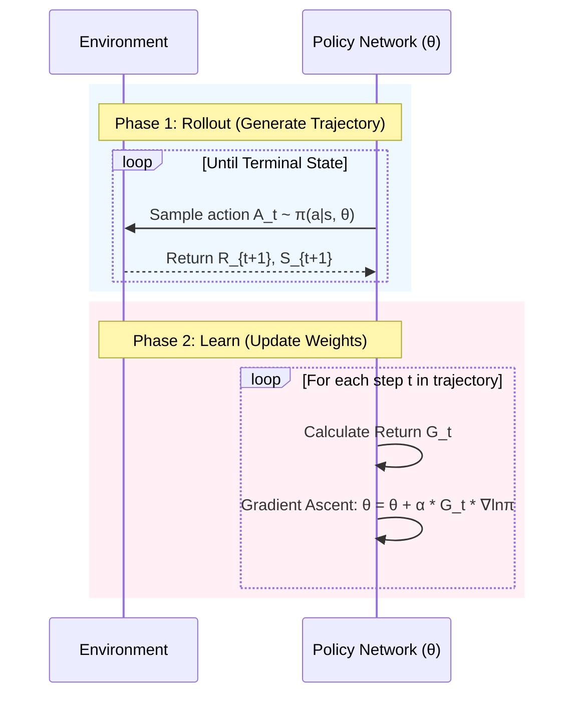

# Lecture 9: Policy Gradient Methods

*Reference: Sutton & Barto (2018). Reinforcement Learning: An Introduction. Chapter 13.*
*Reference: Graesser, L., & Keng, W. L. (2019). Foundations of Deep Reinforcement Learning. Chapter 6.*

## 1. Value-Based vs. Policy-Based Methods

Up to this point, all our algorithms (Q-learning, SARSA, DQN) have been **Value-Based**. We train a function approximator to estimate the value of an action, $Q(s,a)$, and our policy simply acts greedily with respect to those values: $\pi(s) = \text{argmax}_a Q(s,a)$.

**Policy-Based Methods** (Policy Gradients) take a completely different approach. We bypass the value function entirely and train a neural network to directly output the policy itself. 
The neural network takes the state $s$ as input, and outputs a probability distribution over all possible actions: $\pi(a|s, \theta)$.

### Why use Policy Gradients instead of DQN?
1. **Continuous Action Spaces:** DQN requires us to compute $\text{argmax}_a Q(s,a)$. If the action space is continuous (e.g., the steering wheel angle of a car), finding the exact maximum of a complex neural network over an infinite continuous space is computationally intractable. A Policy Gradient method simply outputs the mean and standard deviation of a Gaussian distribution for the steering angle.
2. **Stochastic Policies:** Q-learning always converges to a *deterministic* policy (it always picks the same action in a given state). But in games like Rock-Paper-Scissors, a deterministic policy will be crushed by an opponent. You *must* play stochastically (33% rock, 33% paper, 33% scissors) to act optimally. Policy Gradients naturally learn true stochastic probabilities.

---

## 2. The Policy Gradient Theorem

Our goal is to find the neural network weights $\theta$ that maximize the expected return $J(\theta)$ of our policy:
$$ J(\theta) = \mathbb{E}_{\tau \sim \pi_{\theta}} [G(\tau)] $$
*(where $\tau$ is a full trajectory and $G(\tau)$ is the total reward of that trajectory)*

To maximize this, we need to perform gradient ascent: $\theta_{t+1} = \theta_t + \alpha \nabla J(\theta_t)$.
However, taking the gradient of an expectation that *depends on the environment's unknown transition dynamics* seems impossible!

The **Policy Gradient Theorem** mathematically proves that we can rewrite this gradient without needing to know the environment's dynamics:

$$ \nabla J(\theta) \propto \sum_{s} \mu(s) \sum_{a} q_{\pi}(s,a) \nabla_{\theta} \pi(a|s, \theta) $$

Which can be written as an expectation:
$$ \nabla J(\theta) = \mathbb{E}_{\pi} [ q_{\pi}(S_t, A_t) \nabla_{\theta} \ln \pi(A_t|S_t, \theta) ] $$

**Intuition:** If an action $A_t$ leads to a high Q-value ($q_{\pi} > 0$), we want to push the weights $\theta$ in the direction of the gradient $\nabla_{\theta} \ln \pi$ to *increase* the probability of taking that action again. If the Q-value is low, we push the probabilities down.

---

## 3. The REINFORCE Algorithm (Monte Carlo Policy Gradient)

Since we don't know the exact $q_{\pi}(S_t, A_t)$, the simplest thing we can do is use a Monte Carlo sample. We play out an entire episode, and use the actual observed Return $G_t$ as an unbiased estimate for $q_{\pi}$.

This gives us the **REINFORCE** update rule:
$$ \theta_{t+1} = \theta_t + \alpha G_t \nabla_{\theta} \ln \pi(A_t|S_t, \theta) $$

### The Problem with REINFORCE: High Variance
Because REINFORCE relies on full Monte Carlo rollouts ($G_t$), it suffers from massive variance. A single action early in an episode might be brilliant, but if the agent randomly makes a terrible mistake later in the episode, $G_t$ will be negative, and the network will unfairly penalize that early brilliant action.

---

## 4. Reducing Variance: The Baseline

To fix the variance problem, we can subtract a **baseline** $b(s)$ from the return. Mathematically, subtracting a baseline that depends only on the state (not the action) does not change the expected value of the gradient, but it drastically reduces its variance!

$$ \nabla J(\theta) = \mathbb{E}_{\pi} [ (G_t - b(S_t)) \nabla_{\theta} \ln \pi(A_t|S_t, \theta) ] $$

The most common baseline is the State-Value function $V(s_t)$. 
The term $(G_t - V(S_t))$ is called the **Advantage**. 
* If $G_t > V(S_t)$, the action we took resulted in a return *better* than we usually expect from this state. We should increase its probability.
* If $G_t < V(S_t)$, the action was worse than average. We should decrease its probability.

---

## 5. Actor-Critic Methods

While the baseline reduces variance, REINFORCE still requires us to wait until the very end of an episode to calculate $G_t$. 

**Actor-Critic methods** solve this by using *bootstrapping* (like TD learning). Instead of using the full Monte Carlo return $G_t$, we train a second neural network (the **Critic**) to estimate the value function $V(s, w)$. We then use the TD Error as our Advantage!

$$ \text{TD Error (Advantage)}: \delta_t = R_{t+1} + \gamma V(S_{t+1}, w) - V(S_t, w) $$

* **The Critic** updates its weights $w$ to minimize the MSE of the TD Error.
* **The Actor** updates its policy weights $\theta$ using the Critic's TD Error: $\theta_{t+1} = \theta_t + \alpha \delta_t \nabla_{\theta} \ln \pi(A_t|S_t, \theta)$.

This allows the agent to learn at *every single time step* (online learning) without waiting for the episode to end, significantly speeding up training for infinite-horizon problems!

---

## Practice Exercises

Test your understanding of Policy Gradients with these exercises:

- [Multiple Choice Questions (MCQs)](./assets/questions/mcqs.md)
- [Subjective Questions](./assets/questions/subjective.md)
- [Numerical Questions](./assets/questions/numericals.md)
- [Programming Questions](./assets/questions/programming.md)

*Solutions can be found in the [assets/questions/solutions/](./assets/questions/solutions/) folder.*
