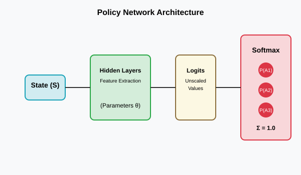
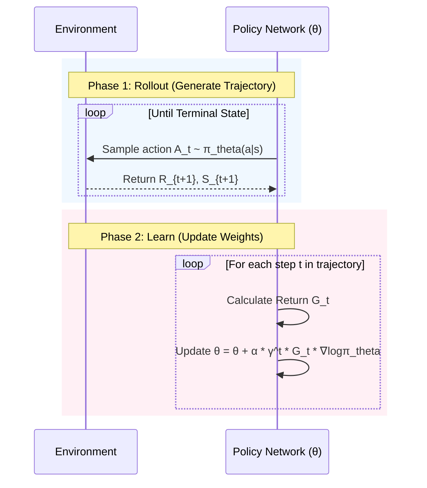
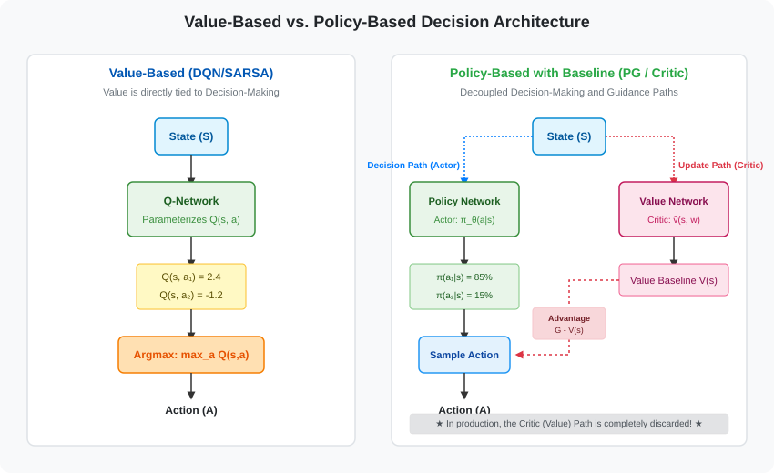
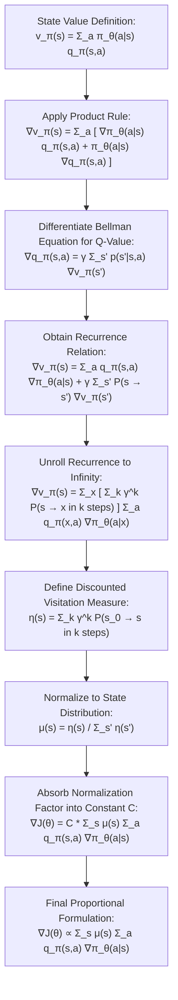
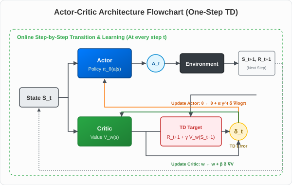
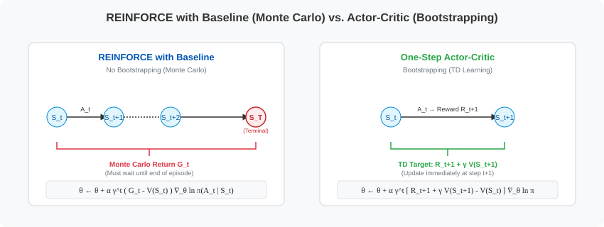
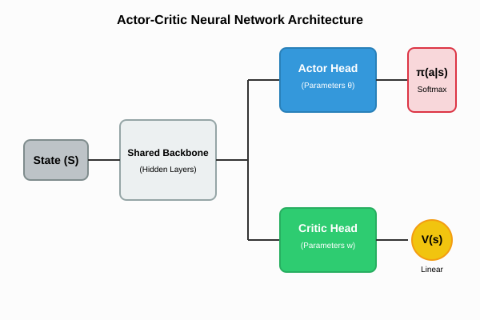

# Lecture 9: Policy Gradient Methods

*Reference: Sutton & Barto (2018). Reinforcement Learning: An Introduction. Chapter 13.*
*Reference: Graesser, L., & Keng, W. L. (2019). Foundations of Deep Reinforcement Learning. Chapter 6.*

## 1. Value-Based vs. Policy-Based Methods

Up to this point, all our algorithms (Q-learning, SARSA, DQN) have been **Value-Based**. We train a function approximator to estimate the value of an action, $Q(s,a)$, and our policy simply acts greedily with respect to those values: $\pi(s) = \text{argmax}_a Q(s,a)$.

**Policy-Based Methods** (Policy Gradients) take a completely different approach. We bypass the value function entirely and train a neural network to directly output the policy itself. 
The neural network takes the state $s$ as input, and outputs a probability distribution over all possible actions: $\pi(a|s, \theta)$.

### Why use Policy Gradients instead of DQN?
1. **Continuous Action Spaces:** DQN requires us to compute $\text{argmax}_a Q(s,a)$. If the action space is continuous (e.g., the steering wheel angle of a car), finding the exact maximum of a complex neural network over an infinite continuous space is computationally intractable. A Policy Gradient method simply outputs the mean and standard deviation of a Gaussian distribution for the steering angle.
2. **Stochastic Policies:** Q-learning always converges to a *deterministic* policy (it always picks the same action in a given state). But in games like Rock-Paper-Scissors, a deterministic policy will be crushed by an opponent. You *must* play stochastically (33% rock, 33% paper, 33% scissors) to act optimally. Policy Gradients naturally learn true stochastic probabilities.

---

## 2. The Policy Gradient Theorem

Our goal is to find the neural network weights $\theta$ that maximize the expected return $J(\theta)$ of our policy:
$$ J(\theta) = \mathbb{E}_{\tau \sim \pi_{\theta}} [G(\tau)] $$
*(where $\tau$ is a full trajectory/rollout and $G(\tau)$ is the total reward of that trajectory)*

To maximize this, we need to perform gradient ascent: 
$$ \theta_{t+1} = \theta_t + \alpha \nabla_{\theta} J(\theta_t) $$

However, taking the gradient of an expectation that *depends on the environment's unknown transition dynamics* (the physics of the environment) seems impossible! Let's walk through the mathematical derivation of how this is solved.

---

### Step-by-Step Mathematical Derivation

#### 1. Expressing the Expectation as a Sum & The Roadblock (Equation 2.6 & 2.7)
First, write the expectation of the return $J(\theta)$ explicitly as a sum over all possible trajectories $\tau$ (Equation 2.6):
$$ J(\theta) = \mathbb{E}_{\tau \sim \pi_\theta} [R(\tau)] = \sum_{\tau} P(\tau; \theta) R(\tau) \tag{Eq. 2.6 (Graesser and Keng)} $$
Where $P(\tau; \theta)$ is the probability of a trajectory $\tau$ occurring when selecting actions according to policy parameters $\theta$, and $R(\tau)$ is the return of that trajectory.

If we take the gradient with respect to $\theta$ (Equation 2.7):
$$ \nabla_{\theta} J(\theta) = \nabla_{\theta} \sum_{\tau} P(\tau; \theta) R(\tau) = \sum_{\tau} \nabla_{\theta} P(\tau; \theta) R(\tau) \tag{Eq. 2.7 (Graesser and Keng)} $$

> **The Roadblock:** In reinforcement learning, the number of possible trajectories $\tau$ is infinite or too large to sum over. The only way to compute this in practice is to **estimate it by running simulations** (sampling trajectories and averaging their values).
> 
> **Why do we want to convert the sum into an expected value?**
> Calculating the exact gradient requires summing over all possible trajectories $\tau$ (Equation 2.7). For tasks with large or continuous state/action spaces (like Chess, Atari, or driving), the number of possible trajectories is infinite or astronomically large. We cannot write a computer program to loop through and sum them all.
> 
> To bypass this, we must **approximate** the sum by taking a random sample (running a few episodes in a simulator). In statistics, the **Law of Large Numbers** allows us to estimate a sum via sampling *only* if the sum is structured as an expected value over a valid probability distribution $P(\tau; \theta)$:
> $$ \text{Expected Value} = \sum_{\tau} P(\tau; \theta) \times f(\tau) = \mathbb{E}_{\tau \sim \pi_{\theta}} [f(\tau)] \approx \frac{1}{N} \sum_{i=1}^N f(\tau_i) $$
> If it is in this form, we simply let the agent play the game $N$ times to collect sample trajectories $\tau_1, \dots, \tau_N$, compute $f(\tau_i)$ for each, and take the average.
> 
> **Why is Equation 2.7 not an expectation?**
> In our gradient equation (Equation 2.7), the scaling term is the gradient $\nabla_{\theta} P(\tau; \theta)$ rather than the probability distribution $P(\tau; \theta)$. The term $\nabla_{\theta} P(\tau; \theta)$ is **not** a valid probability distribution because:
> 1. **It can be negative:** Since it represents the derivative (rate of change) of a probability, it will be negative if tweaking parameters makes a trajectory less likely. Probabilities cannot be negative.
> 2. **It sums to $0$, not $1$:** Since the probabilities of all trajectories must sum to $1$ ($\sum_{\tau} P(\tau; \theta) = 1$), taking the gradient of both sides shows that the sum of the gradients must be $0$:
>    $$ \sum_{\tau} \nabla_{\theta} P(\tau; \theta) = \nabla_{\theta} \sum_{\tau} P(\tau; \theta) = \nabla_{\theta} (1) = 0 $$
> 
> Because $\nabla_{\theta} P(\tau; \theta)$ is not a valid probability distribution, we cannot sample trajectories from it. Therefore, we cannot estimate the sum in Equation 2.7 via simulation. We need to mathematically transform the sum to insert the probability distribution $P(\tau; \theta)$ back outside the gradient so it becomes a sampleable expected value:
> $$ \nabla_{\theta} J(\theta) = \sum_{\tau} P(\tau; \theta) \times \left[ \nabla_{\theta} \log P(\tau; \theta) R(\tau) \right] = \mathbb{E}_{\tau \sim \pi_{\theta}} [ \nabla_{\theta} \log P(\tau; \theta) R(\tau) ] $$

#### 2. The Likelihood Ratio / Log-Derivative Trick (Equation 2.8 & 2.9)
Using standard calculus, the derivative of a logarithm $\log(x)$ is $\frac{d}{dx}\log(x) = \frac{1}{x}$. Using the chain rule, this generalizes to:
$$ \nabla_{\theta} \log x = \frac{\nabla_{\theta} x}{x} \implies \nabla_{\theta} x = x \nabla_{\theta} \log x $$

Applying this identity to the trajectory probability $P(\tau; \theta)$ (Equation 2.8):
$$ \nabla_{\theta} P(\tau; \theta) = P(\tau; \theta) \nabla_{\theta} \log P(\tau; \theta) \tag{Eq. 2.8 (Graesser and Keng)} $$

Substituting this back into our gradient equation gives (Equation 2.9):
$$ \nabla_{\theta} J(\theta) = \sum_{\tau} P(\tau; \theta) \nabla_{\theta} \log P(\tau; \theta) R(\tau) = \mathbb{E}_{\tau \sim \pi_{\theta}} [ \nabla_{\theta} \log P(\tau; \theta) R(\tau) ] \tag{Eq. 2.9 (Graesser and Keng)} $$

> **Note on Expectation Conversion:** The explicit trajectory probability term $P(\tau; \theta)$ is absorbed into the expectation symbol ($\mathbb{E}_{\tau \sim \pi_{\theta}}$). In probability, the expected value of any function $f(\tau)$ over a distribution is defined as:
> $$ \mathbb{E}_{\tau \sim \pi_{\theta}} [f(\tau)] \doteq \sum_{\tau} P(\tau; \theta) f(\tau) $$
> Here, $f(\tau) = \nabla_{\theta} \log P(\tau; \theta) R(\tau)$. Bringing $P(\tau; \theta)$ back outside the gradient allows us to express the sum as an expectation.

This expectation is now **sampleable**: we can estimate the gradient simply by running our agent in the environment to collect trajectories, calculating the term inside the expectation, and averaging the results.

#### 3. Eliminating the Environment Transition Dynamics (Equation 2.10 & 2.11)
A trajectory $\tau = (s_0, a_0, s_1, a_1, \dots, s_T)$ is generated by the combination of the policy choosing actions and the environment determining the next states. The probability of the trajectory is:
$$ P(\tau; \theta) = P(s_0) \prod_{t=0}^{T-1} \pi_{\theta}(a_t|s_t) P(s_{t+1}|s_t, a_t) \tag{Eq. 2.2 (Graesser and Keng)} $$
Where $P(s_0)$ is the initial state distribution, and $P(s_{t+1}|s_t, a_t)$ represents the environment's transition dynamics.

Taking the logarithm of this product transforms it into a sum (Equation 2.10):
$$ \log P(\tau; \theta) = \log P(s_0) + \sum_{t=0}^{T-1} \log \pi_{\theta}(a_t|s_t) + \sum_{t=0}^{T-1} \log P(s_{t+1}|s_t, a_t) \tag{Eq. 2.10 (Graesser and Keng)} $$

Now, we take the gradient with respect to $\theta$:
$$ \nabla_{\theta} \log P(\tau; \theta) = \nabla_{\theta} \log P(s_0) + \sum_{t=0}^{T-1} \nabla_{\theta} \log \pi_{\theta}(a_t|s_t) + \sum_{t=0}^{T-1} \nabla_{\theta} \log P(s_{t+1}|s_t, a_t) $$

Because the initial state distribution $P(s_0)$ and transition dynamics $P(s_{t+1}|s_t, a_t)$ **do not depend on the policy parameters $\theta$**, their gradients are exactly $0$:
* $\nabla_{\theta} \log P(s_0) = 0$
* $\nabla_{\theta} \log P(s_{t+1}|s_t, a_t) = 0$

This simplifies to (Equation 2.11):
$$ \nabla_{\theta} \log P(\tau; \theta) = \sum_{t=0}^{T-1} \nabla_{\theta} \log \pi_{\theta}(a_t|s_t) \tag{Eq. 2.11 (Graesser and Keng)} $$

Thus, **the unknown dynamics of the environment completely drop out of the gradient calculation!**

---

### The Policy Gradient Theorem Formulation (Equation 2.5)

Substituting our simplified trajectory gradient (Equation 2.11) back into our expectation (Equation 2.9), we obtain the **Policy Gradient Theorem** expressed as a trajectory expectation:
$$ \nabla_{\theta} J(\theta) = \mathbb{E}_{\tau \sim \pi_{\theta}} \left[ \sum_{t=0}^{T-1} \nabla_{\theta} \log \pi_{\theta}(a_t \mid s_t) R(\tau) \right] \tag{Eq. 2.5 (Graesser and Keng)} $$

> **Why is there no explicit $P(\tau; \theta)$ here?**
> 1. **It is absorbed into the expectation symbol $\mathbb{E}_{\tau \sim \pi_{\theta}}$:** The subscript $\tau \sim \pi_{\theta}$ tells us that trajectories are generated and sampled according to the distribution $P(\tau; \theta)$.
> 2. **The $\log P(\tau; \theta)$ term inside the expectation is expanded using Equation 2.10 & 2.11:** We expand $\log P(\tau; \theta)$ using **Equation 2.10**. Its gradient simplifies to **Equation 2.11** ($\sum_{t=0}^{T-1} \nabla_{\theta} \log \pi_{\theta}(a_t \mid s_t)$) because the environment transition probabilities and the initial state distribution do not depend on the policy parameters $\theta$, so their gradients are $0$.

#### Intuition behind the Trajectory Formulation:
* **Tweaking Action Probabilities:** The policy parameters $\theta$ (e.g., neural network weights) define the policy $\pi_{\theta}(a \mid s)$. Adjusting $\theta$ shifts the action probabilities.
* **Trajectory Probability and Return:** The probability of generating a specific trajectory $\tau$ is $P(\tau; \theta)$, which depends directly on the action probabilities. Changing the policy parameters changes the distribution of trajectories generated, which in turn changes the expected return $J(\theta)$.
* **Reinforcement Multiplier:** The trajectory return $R(\tau)$ scales the update. If a trajectory leads to a high return, the gradient update takes a large step in the direction of $\nabla_\theta \log \pi_{\theta}(a_t \mid s_t)$, making those actions more probable in the future.
* **"Backtracking" (Hindsight Credit Assignment):** Since we do not have a transition model of the environment, the agent cannot predict the future while acting. Instead, it completes a rollout, looks back at the sequence of actions taken ($a_0, \dots, a_{T-1}$) in hindsight, and "backtracks" in time to adjust the parameter weights to reinforce the entire action sequence based on the final return $R(\tau)$.
* **The Log-Derivative Trick:** We cannot directly take the gradient of the expected return because the expectation itself depends on $\theta$. Applying the log-derivative trick ($\nabla_\theta P(\tau; \theta) = P(\tau; \theta) \nabla_\theta \log P(\tau; \theta)$) allows us to reformulate the gradient as an expectation. This enables us to compute gradients by sampling actions from the current policy and taking the gradient of their log-probabilities.

---

## 3. The REINFORCE Algorithm (Monte Carlo Policy Gradient)

Since we don't know the exact $q_{\pi}(S_t, A_t)$, the simplest thing we can do is use a Monte Carlo sample. We play out an entire episode, and use the actual observed Return $G_t$ as an unbiased estimate for $q_{\pi}$.

This is described in **Section 13.3** of Sutton & Barto.

### The $\gamma^t$ Discount Factor in the Update
In the theoretical derivation of the discounted policy gradient, the objective is defined as the value of the start state $J(\theta) \doteq v_{\pi_{\theta}}(s_0)$. When we use discounting ($\gamma < 1$), states visited later in the episode contribute less to the start state value. 

To account for this mathematically, the update at time step $t$ is scaled by $\gamma^t$:
$$ \theta_{t+1} = \theta_t + \alpha \gamma^t G_t \nabla_{\theta} \log \pi_{\theta}(A_t|S_t) \tag{Eq. 13.6 (Sutton and Barto)} $$

> **Note on Deep RL Practice:** In modern deep reinforcement learning implementations (like those using neural networks for continuous tasks), the $\gamma^t$ term is often omitted (set to 1). This is because the exponential decay of $\gamma^t$ causes updates late in long episodes to become extremely small, leading to slow training of neural networks. However, the $\gamma^t$ term is mathematically required for the gradient of the discounted start-state objective.

### REINFORCE Pseudo-code (Sutton & Barto 13.3)

$$
\begin{array}{l}
\textbf{Input:} \text{ a differentiable policy parameterization } \pi_{\theta}(a|s) \\
\textbf{Parameters:} \text{ step size } \alpha > 0 \\
\textbf{Initialize:} \text{ policy parameter } \theta \in \mathbb{R}^{d'} \\
\\
\textbf{Loop forever (for each episode):} \\
\quad \textbf{Phase 1: Action Selection (Rollout)} \\
\quad \text{Generate an episode } S_0, A_0, R_1, \dots, S_{T-1}, A_{T-1}, R_T \text{ where actions are sampled as:} \\
\quad \quad \bullet \text{ Discrete: compute preferences } h(S_t, a, \theta) \xrightarrow{\text{softmax}} \pi_{\theta}(a|S_t) \text{ and sample } A_t \\
\quad \quad \bullet \text{ Continuous: compute } \mu(S_t, \theta), \sigma(S_t, \theta) \text{ and sample } A_t \sim \mathcal{N}(\mu, \sigma^2) \\
\\
\quad \textbf{Phase 2: Weight Update (Learning)} \\
\quad \textbf{Loop for each step of the episode } t = 0, 1, \dots, T-1: \\
\qquad G \leftarrow \sum_{k=t+1}^{T} \gamma^{k-t-1} R_k \\
\qquad \theta \leftarrow \theta + \alpha \gamma^t G \nabla_{\theta} \log \pi_{\theta}(A_t | S_t) \quad \text{(Policy Parameter Update)}
\end{array}
$$

### The Problem with REINFORCE: High Variance
Because REINFORCE relies on full Monte Carlo rollouts ($G_t$), it suffers from massive variance. A single action early in an episode might be brilliant, but if the agent randomly makes a terrible mistake later in the episode, $G_t$ will be negative, and the network will unfairly penalize that early brilliant action.

---

## 4. REINFORCE with Baseline (Sutton & Barto 13.4)

To fix the variance problem, we can subtract a **baseline** $b(s)$ from the return. The baseline can be any function, as long as it does not depend on the action $a$. 

The **Policy Gradient Theorem with Baseline** (Sutton & Barto Equation 13.10) generalizes the policy gradient theorem to:
$$ \nabla_{\theta} J(\theta) \propto \sum_{s} d(s) \sum_{a} (q_{\pi}(s,a) - b(s)) \nabla_{\theta} \pi_{\theta}(a|s) \tag{Eq. 13.10 (Sutton and Barto)} $$

This leads directly to the REINFORCE with Baseline update rule:
$$ \theta_{t+1} = \theta_t + \alpha \gamma^t (G_t - b(S_t)) \nabla_{\theta} \log \pi_{\theta}(A_t|S_t) \tag{Eq. 13.8 (Sutton and Barto)} $$

The most common baseline is a learned estimate of the state-value function, $\hat{v}(s, \mathbf{w})$.
The term $(G_t - \hat{v}(S_t, \mathbf{w}))$ is the **Advantage** (how much better this action's outcome was compared to our average expectation of the state).

### Proof of Unbiased Baseline
We want to prove that subtracting a baseline $b(s)$ that is independent of action $a$ does not introduce any bias to the expected gradient. The proof demonstrates that the expected value of the baseline gradient term is exactly zero.

While the individual steps of this proof are not numbered as separate equations in Sutton & Barto (they are presented as inline derivation steps on Page 329), the core identity showing that the subtracted quantity is zero is:
$$ \sum_{a} b(s) \nabla_{\theta} \pi_{\theta}(a|s) = b(s) \nabla_{\theta} \sum_{a} \pi_{\theta}(a|s) = b(s) \nabla_{\theta} (1) = 0 \tag{Baseline Identity (Sutton and Barto, Page 329)} $$

Let's walk through the full expectation proof step-by-step:
$$ \mathbb{E}_{A_t \sim \pi} [ b(S_t) \nabla_{\theta} \log \pi_{\theta}(A_t|S_t) ] = 0 $$

**Proof:**
For a given state $s$, the expected value of the baseline gradient term is:
$$ \sum_{a} \pi_{\theta}(a|s) b(s) \nabla_{\theta} \log \pi_{\theta}(a|s) $$

Using the identity $\nabla \log x = \frac{\nabla x}{x}$:
$$ = \sum_{a} \pi_{\theta}(a|s) b(s) \frac{\nabla_{\theta} \pi_{\theta}(a|s)}{\pi_{\theta}(a|s)} $$

Simplifying (canceling $\pi_{\theta}(a \mid s)$):
$$ = \sum_{a} b(s) \nabla_{\theta} \pi_{\theta}(a \mid s) $$

Since the baseline $b(s)$ has no dependence on the action $a$, we can pull it out of the summation:
$$ = b(s) \sum_{a} \nabla_{\theta} \pi_{\theta}(a \mid s) $$

Now we swap the gradient operator and the summation:
$$ = b(s) \nabla_{\theta} \sum_{a} \pi_{\theta}(a \mid s) $$

Because $\pi_{\theta}(a \mid s)$ is a probability distribution over actions, its sum over all possible actions must be exactly $1$:
$$ \sum_{a} \pi_{\theta}(a \mid s) = 1 $$

Substituting this back:
$$ = b(s) \nabla_{\theta} (1) $$

Since the gradient of a constant is $0$:
$$ = b(s) \cdot 0 = 0 $$

Therefore, the baseline term contributes exactly $0$ to the expected gradient update. It reduces variance by centering the return values without introducing any bias.

### REINFORCE with Baseline Pseudo-code (Sutton & Barto 13.4)

$$
\begin{array}{l}
\textbf{Input:} \text{ a differentiable policy parameterization } \pi_{\theta}(a|s) \\
\textbf{Input:} \text{ a differentiable state-value function parameterization } \hat{v}(s, \mathbf{w}) \\
\textbf{Parameters:} \text{ step sizes } \alpha > 0, \beta > 0 \\
\textbf{Initialize:} \text{ policy parameter } \theta \in \mathbb{R}^{d'} \text{ and state-value weights } \mathbf{w} \in \mathbb{R}^d \\
\\
\textbf{Loop forever (for each episode):} \\
\quad \textbf{Phase 1: Action Selection (Rollout)} \\
\quad \text{Generate an episode } S_0, A_0, R_1, \dots, S_{T-1}, A_{T-1}, R_T \text{ where actions are sampled as:} \\
\quad \quad \bullet \text{ Discrete: compute preferences } h(S_t, a, \theta) \xrightarrow{\text{softmax}} \pi_{\theta}(a|S_t) \text{ and sample } A_t \\
\quad \quad \bullet \text{ Continuous: compute } \mu(S_t, \theta), \sigma(S_t, \theta) \text{ and sample } A_t \sim \mathcal{N}(\mu, \sigma^2) \\
\\
\quad \textbf{Phase 2: Weight Update (Learning)} \\
\quad \textbf{Loop for each step of the episode } t = 0, 1, \dots, T-1: \\
\qquad G \leftarrow \sum_{k=t+1}^{T} \gamma^{k-t-1} R_k \\
\qquad \delta \leftarrow G - \hat{v}(S_t, \mathbf{w}) \quad \text{(Compute Advantage/TD Error)} \\
\qquad \mathbf{w} \leftarrow \mathbf{w} + \beta \delta \nabla_{\mathbf{w}} \hat{v}(S_t, \mathbf{w}) \quad \text{(State-Value / Baseline Weights Update)} \\
\qquad \theta \leftarrow \theta + \alpha \gamma^t \delta \nabla_{\theta} \log \pi_{\theta}(A_t | S_t) \quad \text{(Policy Weights Update)}
\end{array}
$$

*(Where policy parameters $\theta$ are updated via gradient ascent to maximize expected return, and baseline weights $\mathbf{w}$ are updated via gradient descent to minimize mean squared error of value predictions).*

### Remark: The Role and Necessity of Baseline Weights $\mathbf{w}$ in the Algorithm

Students often ask: *Why does the algorithm require a separate set of weights $\mathbf{w}$ and a specific update step for them?*

Here is why maintaining and learning the baseline weight vector $\mathbf{w}$ is critical:
1. **Defining the Baseline $\hat{v}(s, \mathbf{w})$:** The baseline $b(s)$ in the policy gradient update is chosen to be $\hat{v}(S_t, \mathbf{w})$, our neural network's (or function approximator's) current estimate of the state value.
2. **Computing the Advantage ($\delta$):** The update scales the policy gradient by $\delta = G_t - \hat{v}(S_t, \mathbf{w})$. This acts as the **Advantage**, indicating how much better (or worse) the return from this action was compared to the expected value of that state.
3. **The Policy is a Moving Target:** The true value function of a state $v_\pi(s)$ depends on the current policy $\pi_\theta$. Because the policy parameters $\theta$ change at every step, the policy itself changes. A static baseline would quickly become obsolete. Therefore, we must continuously update the value weights $\mathbf{w}$ via stochastic gradient descent:
   $$ \mathbf{w} \leftarrow \mathbf{w} + \beta \delta_t \nabla_{\mathbf{w}} \hat{v}(S_t, \mathbf{w}) $$
   This ensures $\hat{v}(S_t, \mathbf{w})$ tracks the true expected returns under the *current* policy, keeping the advantage $\delta_t$ properly centered around $0$ and successfully reducing variance throughout training.

### Why use Policy Gradient if we are training a State-Value function anyway?

Students often ask: *If we are already training a state-value network $\hat{v}(s, \mathbf{w})$ to act as a baseline, why not just use a value-based method like Q-learning or DQN?*

The answer lies in **decoupling decision-making from update guidance**:

1. **Decoupled Architecture (Decision vs. Update):**
   * **Value-Based (DQN):** The value function is the *sole decision maker*. To choose an action, the agent must compute Q-values for all actions and run an argmax selection: $A = \text{argmax}_a Q(s,a)$.
   * **Policy Gradient with Baseline:** The value function is only a *critic/guide* for updating weights. The actual decision-making is done directly by the policy (Actor) $\pi_{\theta}(a \mid s)$. The value network $\hat{v}(s, \mathbf{w})$ is **never** used during decision-making.

2. **Key Advantages of this Decoupling:**
   * **Continuous Action Spaces:** A policy network can directly output parameters of a continuous probability distribution (e.g., the mean and variance of a Gaussian for a steering wheel angle). A value-based network cannot do this because computing $\text{argmax}$ over an infinite continuous space at every step is computationally intractable.
   * **True Stochastic Policies:** Value-based methods converge to deterministic greedy policies (making them easily exploitable in games like Rock-Paper-Scissors or stuck in partially observable environments). Policy gradients naturally learn true stochastic probabilities.
   * **Smooth Updates:** Gradient updates to policy weights $\theta$ lead to smooth, incremental changes in action probabilities. In contrast, value-based updates are discontinuous—a small change in a Q-value can cause the argmax to abruptly jump to a completely different action, causing instability.
   * **Production Efficiency:** Once training is complete, **the value network baseline can be completely discarded**. At test time, you only deploy the policy network, which drastically reduces computational overhead.

---

## 5. Policy Parameterizations: Translating Theory into Practice

In the REINFORCE and REINFORCE with Baseline algorithms, we use the abstract mathematical gradient $\nabla_{\theta} \log \pi_{\theta}(A_t \mid S_t)$. In practice, how does a neural network actually compute this gradient, and how does the agent sample actions? 

To understand this transition, let's first look at the entire **REINFORCE with Baseline** algorithm:

$$
\begin{array}{l}
\textbf{Input:} \text{ a differentiable policy parameterization } \pi_{\theta}(a|s) \\
\textbf{Input:} \text{ a differentiable state-value function parameterization } \hat{v}(s, \mathbf{w}) \\
\textbf{Parameters:} \text{ step sizes } \alpha > 0, \beta > 0 \\
\textbf{Initialize:} \text{ policy parameter } \theta \in \mathbb{R}^{d'} \text{ and state-value weights } \mathbf{w} \in \mathbb{R}^d \\
\\
\textbf{Loop forever (for each episode):} \\
\quad \color{blue}{\textbf{Phase 1: Action Selection (Rollout Loop)}} \\
\quad \text{Generate an episode } S_0, A_0, R_1, \dots, S_{T-1}, A_{T-1}, R_T \text{ where actions are sampled as:} \\
\quad \quad \bullet \text{ Discrete: compute preferences } h(S_t, a, \theta) \xrightarrow{\text{softmax}} \pi_{\theta}(a|S_t) \text{ and sample } A_t \\
\quad \quad \bullet \text{ Continuous: compute } \mu(S_t, \theta), \sigma(S_t, \theta) \text{ and sample } A_t \sim \mathcal{N}(\mu, \sigma^2) \\
\\
\quad \color{red}{\textbf{Phase 2: Weight Update (Learning Loop)}} \\
\quad \textbf{Loop for each step of the episode } t = 0, 1, \dots, T-1: \\
\qquad G \leftarrow \sum_{k=t+1}^{T} \gamma^{k-t-1} R_k \\
\qquad \delta \leftarrow G - \hat{v}(S_t, \mathbf{w}) \\
\qquad \mathbf{w} \leftarrow \mathbf{w} + \beta \delta \nabla_{\mathbf{w}} \hat{v}(S_t, \mathbf{w}) \\
\qquad \theta \leftarrow \theta + \alpha \gamma^t \delta \color{darkorange}{\nabla_{\theta} \log \pi_{\theta}(A_t \mid S_t)} \quad \text{(Abstract Gradient Term)}
\end{array}
$$

Let's point out and analyze exactly where and how parameterization is inserted at these two phases:

### Phase 1: Action Selection (Rollout Loop)
* **When:** At every time step $t$ during environment interaction.
* **Where:** Located in the rollout step `Generate an episode ... where actions are sampled as`.
* **How:** 
  1. The agent feeds the current state $S_t$ into the policy network.
  2. The network performs a forward pass to calculate either action preferences $h(S_t, a, \theta)$ (for discrete spaces) or mean and standard deviation $\mu(S_t), \sigma(S_t)$ (for continuous spaces).
  3. The agent samples $A_t$ from the resulting probability distribution and executes it in the environment.

### Phase 2: Weight Update (Learning Loop)
* **When:** In the learning loop, after the rollout is complete.
* **Where:** Located in the update step $\theta \leftarrow \theta + \alpha \gamma^t \delta \nabla_{\theta} \log \pi_{\theta}(A_t \mid S_t)$.
* **How:** 
  1. The agent retrieves the state $S_t$ and the action $A_t$ that was actually selected during the rollout.
  2. It computes the analytical derivative of the log-probability of $A_t$ under the current network parameters, $\nabla_{\theta} \log \pi_{\theta}(A_t  \mid  S_t)$.
  3. The optimizer backpropagates this gradient to adjust the weights $\theta$, shifting the distribution to make the action more likely (if advantage $\delta > 0$) or less likely (if advantage $\delta < 0$).

---

### Side-by-Side Algorithm Comparison: Softmax vs. Gaussian Implementation

To see exactly how these parameterizations are implemented in practice, here is the REINFORCE with Baseline algorithm for both Softmax and Gaussian policies side-by-side:

$$
\begin{array}{c|c}
\textbf{Softmax Policy (Discrete Action Space)} & \textbf{Gaussian Policy (Continuous Action Space)} \\
\hline
\begin{array}{l}
\color{purple}{\textbf{Input:} \text{ preference model } h(s, a, \theta)} \\
\textbf{Input:} \text{ value function } \hat{v}(s, \mathbf{w}) \\
\textbf{Parameters:} \alpha > 0, \beta > 0 \\
\color{purple}{\textbf{Initialize:} \theta \in \mathbb{R}^{d'}}, \mathbf{w} \in \mathbb{R}^d \\
\\
\textbf{Loop forever (for each episode):} \\
\quad \color{blue}{\textbf{Phase 1: Action Selection (Rollout)}} \\
\quad \text{Generate episode } S_0, A_0, R_1, \dots, R_T \text{ following } \pi_{\theta}: \\
\qquad \text{For each step } t: \\
\qquad \quad \color{purple}{h(S_t, a, \theta) \leftarrow \text{Model}(S_t)} \\
\qquad \quad \color{purple}{\pi_{\theta}(a|S_t) \leftarrow \frac{e^{h(S_t, a, \theta)}}{\sum_b e^{h(S_t, b, \theta)}}} \\
\qquad \quad \color{purple}{\text{Sample } A_t \sim \text{Categorical}(\pi_{\theta}(\cdot|S_t))} \\
\\
\quad \color{red}{\textbf{Phase 2: Weight Update (Learning)}} \\
\quad \text{For each step } t = 0, \dots, T-1: \\
\qquad G \leftarrow \sum_{k=t+1}^{T} \gamma^{k-t-1} R_k \\
\qquad \delta \leftarrow G - \hat{v}(S_t, \mathbf{w}) \\
\qquad \mathbf{w} \leftarrow \mathbf{w} + \beta \delta \nabla_{\mathbf{w}} \hat{v}(S_t, \mathbf{w}) \\
\qquad \color{purple}{\theta \leftarrow \theta + \alpha \gamma^t \delta \nabla_{\theta} \log \pi_{\theta}(A_t | S_t)} \\
\qquad \quad \color{purple}{\text{where analytical log-gradient is:}} \\
\qquad \quad \color{purple}{\nabla_{\theta} \log \pi_{\theta}(A_t \mid S_t) =} \\
\qquad \quad \color{purple}{\nabla_{\theta} h(S_t, A_t, \theta) - \sum_b \pi_{\theta}(b|S_t) \nabla_{\theta} h(S_t, b, \theta)}
\end{array}
&
\begin{array}{l}
\color{teal}{\textbf{Input:} \text{ mean model } \mu(s, \theta_{\mu}), \text{ log-std model } \eta(s, \theta_{\sigma})} \\
\textbf{Input:} \text{ value function } \hat{v}(s, \mathbf{w}) \\
\textbf{Parameters:} \alpha > 0, \beta > 0 \\
\color{teal}{\textbf{Initialize:} \theta = [\theta_{\mu}, \theta_{\sigma}]^T}, \mathbf{w} \in \mathbb{R}^d \\
\\
\textbf{Loop forever (for each episode):} \\
\quad \color{blue}{\textbf{Phase 1: Action Selection (Rollout)}} \\
\quad \text{Generate episode } S_0, A_0, R_1, \dots, R_T \text{ following } \pi_{\theta}: \\
\qquad \text{For each step } t: \\
\qquad \quad \color{teal}{\mu(S_t, \theta_{\mu}), \eta(S_t, \theta_{\sigma}) \leftarrow \text{Model}(S_t)} \\
\qquad \quad \color{teal}{\sigma(S_t, \theta_{\sigma}) \leftarrow \exp(\eta(S_t, \theta_{\sigma}))} \\
\qquad \quad \color{teal}{\text{Sample } A_t = \mu(S_t, \theta_{\mu}) + \sigma(S_t, \theta_{\sigma}) \cdot \epsilon,} \\
\qquad \quad \quad \color{teal}{\text{where } \epsilon \sim \mathcal{N}(0, 1)} \\
\\
\quad \color{red}{\textbf{Phase 2: Weight Update (Learning)}} \\
\quad \text{For each step } t = 0, \dots, T-1: \\
\qquad G \leftarrow \sum_{k=t+1}^{T} \gamma^{k-t-1} R_k \\
\qquad \delta \leftarrow G - \hat{v}(S_t, \mathbf{w}) \\
\qquad \mathbf{w} \leftarrow \mathbf{w} + \beta \delta \nabla_{\mathbf{w}} \hat{v}(S_t, \mathbf{w}) \\
\qquad \color{teal}{\theta_{\mu} \leftarrow \theta_{\mu} + \alpha \gamma^t \delta \nabla_{\theta_{\mu}} \log \pi_{\theta}(A_t | S_t)} \\
\qquad \color{teal}{\theta_{\sigma} \leftarrow \theta_{\sigma} + \alpha \gamma^t \delta \nabla_{\theta_{\sigma}} \log \pi_{\theta}(A_t | S_t)} \\
\qquad \quad \color{teal}{\text{where analytical log-gradients are:}} \\
\qquad \quad \color{teal}{\nabla_{\theta_{\mu}} \log \pi_{\theta}(A_t | S_t) = \frac{A_t - \mu(S_t)}{\sigma(S_t)^2} \nabla_{\theta_{\mu}} \mu(S_t, \theta_{\mu})} \\
\qquad \quad \color{teal}{\nabla_{\theta_{\sigma}} \log \pi_{\theta}(A_t | S_t) = \left( \frac{(A_t - \mu(S_t))^2}{\sigma(S_t)^2} - 1 \right) \nabla_{\theta_{\sigma}} \eta(S_t, \theta_{\sigma})}
\end{array}
\end{array}
$$

---

### Comparison of Parameterization Methods

Depending on the action space of the task, we handle action selection and gradient calculation using one of two parameterizations:

| Parameterization | Softmax Policy | Gaussian Policy |
| :--- | :--- | :--- |
| **Action Space** | **Discrete** (finite set of distinct choices) | **Continuous** (infinite real-valued numbers) |
| **Network Outputs** | Real-valued preferences (logits) $h(s, a, \theta)$ for each action | Mean $\mu(s, \theta_\mu)$ and log-variance/log-std $\eta(s, \theta_\sigma)$ |
| **Action Selection** | Softmax probabilities: sample $A_t \sim \text{Categorical}(\mathbf{p})$ | Reparameterization trick: $A_t = \mu(s) + \sigma(s) \odot \epsilon$, $\epsilon \sim \mathcal{N}(0, 1)$ |
| **Log-Gradient** | $\nabla_\theta h(S_t, A_t) - \sum_b \pi_\theta(b \mid S_t) \nabla_\theta h(S_t, b)$ | Analytical Gaussian log-likelihood gradients w.r.t. mean and std |

---

### A. Softmax Policy (Discrete Action Spaces)

#### 1. Use Cases & Examples
Softmax policies are used when the agent must choose from a discrete, countable set of actions.
* **Examples:**
  * **Gridworld:** Moving in 4 cardinal directions (North, South, East, West).
  * **Atari Pong:** Actions such as (Move Up, Move Down, Stay).
  * **Chess:** A finite set of legal moves on the board.
  * **Game Controllers:** Pressing or not pressing buttons (A, B, Up, Down, Left, Right).

#### 2. Practical Implementation (Rollout Loop)
The neural network outputs a vector of real numbers $h(s, a, \theta) \in \mathbb{R}$ (called **logits** or **action preferences**) for each possible action $a$. We convert these preferences into a valid probability distribution using the **softmax function**:
$$ \pi_{\theta}(a|s) \doteq \frac{e^{h(s, a, \theta)}}{\sum_{b \in \mathcal{A}} e^{h(s, b, \theta)}} \tag{Eq. 13.2 (Sutton and Barto)} $$

* **Rollout Insertion:** The agent feeds state $S_t$ into the network, computes $\pi_{\theta}(a \mid S_t)$ for all actions, and samples action $A_t \sim \pi_{\theta}(\cdot \mid S_t)$.

#### 3. Log-Gradient Calculation (Learning Loop)
When updating, we compute the gradient of the log-probability of the action $A_t$ that was actually taken:
$$ \nabla_{\theta} \log \pi_{\theta}(A_t \mid S_t) = \nabla_{\theta} h(S_t, A_t, \theta) - \sum_{b \in \mathcal{A}} \pi_{\theta}(b \mid S_t) \nabla_{\theta} h(S_t, b, \theta) $$

* **Intuition:** The gradient increases the parameter weights for the selected action $A_t$ (first term) and decreases the weights for all actions proportional to their probabilities (second term). If the return is positive, $A_t$ becomes more likely; if negative, it becomes less likely.

---

### B. Gaussian Policy (Continuous Action Spaces)

#### 1. Use Cases & Examples
Gaussian policies are used when actions are real-valued numbers representing continuous control.
* **Examples:**
  * **Self-Driving Car:** Steering wheel angle (e.g., from $-180^\circ$ to $+180^\circ$) and acceleration/braking pedal pressure (from $0.0$ to $1.0$).
  * **Robotics:** Joint torques in Newton-meters (e.g., controlling a robotic arm's motor forces).
  * **Industrial Heating/Cooling:** Continuous temperature or flow valve adjustment.

#### 2. Practical Implementation (Rollout Loop)
Because the action space is infinite, the neural network cannot output probabilities for individual actions. Instead, the network outputs the parameters of a probability density function. For a 1D continuous action, it outputs the mean $\mu(s, \theta_{\mu})$ and a parameter $\eta(s, \theta_{\sigma})$ representing the log standard deviation.
* **Why parameterize log standard deviation $\eta$?** 
  Standard deviation $\sigma$ must always be strictly positive. If the network directly outputted $\sigma$, gradient steps could make it negative. By outputting $\eta \doteq \log \sigma$, we can compute standard deviation as $\sigma(s, \theta) \doteq \exp(\eta(s, \theta_{\sigma}))$, which is guaranteed to be positive for any real number $\eta$.
* **The Reparameterization Trick:** 
  To sample an action $A_t$ from $\mathcal{N}(\mu, \sigma^2)$ in code:
  $$ A_t = \mu(S_t, \theta_\mu) + \sigma(S_t, \theta_\sigma) \cdot \epsilon \quad \text{where } \epsilon \sim \mathcal{N}(0, 1) $$
  This is critical because direct sampling is non-differentiable. Separating the stochastic noise $\epsilon$ allows gradients to flow through $\mu$ and $\sigma$ back into the network weights.

The Gaussian policy probability density function is:
$$ \pi_{\theta}(a|s) = \frac{1}{\sigma(s, \theta)\sqrt{2\pi}} \exp \left( -\frac{(a - \mu(s, \theta))^2}{2\sigma(s, \theta)^2} \right) \tag{Eq. 13.19 (Sutton and Barto)} $$

#### 3. Log-Gradient Calculation (Learning Loop)
Taking the logarithm of the Gaussian PDF:
$$ \log \pi_{\theta}(a|s) = -\log \sigma(s, \theta) - \log\sqrt{2\pi} - \frac{(a - \mu(s, \theta))^2}{2\sigma(s, \theta)^2} $$

* **Gradient w.r.t. Mean Parameters $\theta_{\mu}$:**
  $$ \nabla_{\theta_{\mu}} \log \pi_{\theta}(a|s) = \frac{a - \mu(s, \theta)}{\sigma(s, \theta)^2} \nabla_{\theta_{\mu}} \mu(s, \theta_{\mu}) $$
* **Gradient w.r.t. Standard Deviation Parameters $\theta_{\sigma}$:**
  $$ \nabla_{\theta_{\sigma}} \log \pi_{\theta}(a|s) = \left( \frac{(a - \mu(s, \theta))^2}{\sigma(s, \theta)^2} - 1 \right) \nabla_{\theta_{\sigma}} \eta(s, \theta_{\sigma}) $$

---

### Numerical Intuition of the Gaussian Update

Let's look at how the Gaussian policy changes parameters based on the advantage/TD error $\delta_t$.

Assume:
* Current mean: $\mu(s, \theta) = 5.0$
* Current standard deviation: $\sigma(s, \theta) = 2.0$
* Learning update step size: $\alpha = 0.1$
* TD error (Advantage): $\delta_t = +0.5$ (Action was better than expected)

#### Case 1: An action is sampled above the mean ($a = 7.0$)
* **Mean Update Direction:**
  $$ \nabla_{\theta_{\mu}} \log \pi = \frac{7.0 - 5.0}{2.0^2} = \frac{2.0}{4.0} = +0.5 $$
  Since $\delta_t = +0.5$ (positive), the mean $\mu$ shifts **to the right (increases)**.
* **Standard Deviation Update Direction:**
  $$ \nabla_{\theta_{\sigma}} \log \pi = \frac{(7.0 - 5.0)^2}{2.0^2} - 1 = \frac{4.0}{4.0} - 1 = 0 $$
  Because the action is exactly $1$ standard deviation away, the standard deviation $\sigma$ **remains unchanged**.

#### Case 2: An action is sampled far from the mean ($a = 9.0$)
* **Mean Update Direction:**
  $$ \nabla_{\theta_{\mu}} \log \pi = \frac{9.0 - 5.0}{2.0^2} = \frac{4.0}{4.0} = +1.0 $$
  The mean $\mu$ shifts **to the right (increases)** even faster.
* **Standard Deviation Update Direction:**
  $$ \nabla_{\theta_{\sigma}} \log \pi = \frac{(9.0 - 5.0)^2}{2.0^2} - 1 = \frac{16.0}{4.0} - 1 = +3.0 $$
  Since the direction is positive and $\delta_t > 0$, the standard deviation $\sigma$ **increases (widens the curve)**.
  * **Intuition:** A successful action occurred far away. The policy widens its search (increases exploration) to cover this high-reward region.

#### Case 3: An action is sampled very close to the mean ($a = 5.5$)
* **Mean Update Direction:**
  $$ \nabla_{\theta_{\mu}} \log \pi = \frac{5.5 - 5.0}{2.0^2} = \frac{0.5}{4.0} = +0.125 $$
  The mean $\mu$ shifts slightly to the right.
* **Standard Deviation Update Direction:**
  $$ \nabla_{\theta_{\sigma}} \log \pi = \frac{(5.5 - 5.0)^2}{2.0^2} - 1 = \frac{0.25}{4.0} - 1 = -0.9375 $$
  Since the direction is negative and $\delta_t > 0$, the standard deviation $\sigma$ **decreases (narrows the curve)**.
  * **Intuition:** A successful action occurred close to the mean. The policy becomes more precise (reduces exploration) around this successful mean.

---

## 6. Actor-Critic Methods (Sutton & Barto 13.5)

### The Limitations of REINFORCE & The Need for Improvisation
While REINFORCE (with or without baseline) is a mathematically sound policy gradient method, it has three critical limitations that create the need for improvisation:
1. **Requires Full Episode Rollouts (Offline updates):** Because it is a Monte Carlo method, REINFORCE relies on the complete future return $G_t$. The agent must wait for the episode to terminate ($S_T$) before it can compute any gradients and update the policy weights $\theta$.
2. **Cannot Learn on Continuing Tasks:** For tasks that are continuous and never-ending (no terminal state), $G_t$ cannot be computed, making REINFORCE completely unusable.
3. **High Variance:** Since $G_t$ aggregates all stochastic actions and environment transitions from time step $t$ to the end of the episode, its variance is extremely high. Even with a baseline, this variance slows down learning.

To address these limitations, we want to improvise and update the policy **online, step-by-step** (at every time step $t$), utilizing bootstrapping (Temporal Difference learning) rather than waiting for the entire episode to finish.

### Bridging the Gap: The State-Action Value Policy Gradient Theorem
To make step-by-step updates mathematically sound, we cannot use the trajectory-level Policy Gradient Theorem (Equation 2.5) because that is built on full trajectories $\tau$ and their complete returns $R(\tau)$. We must transition to a state-action value formulation.

The Policy Gradient Theorem in state-action value form (Equation 6.1) shows that we can express the gradient of our performance objective in terms of the state-action value function $q_{\pi}(s,a)$ over the normalized state distribution $\mu(s)$:
$$ \nabla_{\theta} J(\theta) \propto \sum_{s} \mu(s) \sum_{a} q_{\pi}(s,a) \nabla_{\theta} \pi_{\theta}(a|s) \tag{Eq. 6.1 (Graesser and Keng)} $$

> **How does this lead to the Actor-Critic Architecture?**
> Equation 6.1 requires the true, unknown action-value function $q_{\pi}(s,a)$. In model-free reinforcement learning, we must estimate this term.
> * **The Actor:** The policy network $\pi_{\theta}(a \mid s)$ which selects actions (we update its parameters in the direction of the policy gradient $\nabla_{\theta} \pi_{\theta}(a \mid s)$).
> * **The Critic:** Instead of waiting for full Monte Carlo returns, we parameterize a second network (the Critic) with weights $\mathbf{w}$ to approximate the action-value term, i.e., $\hat{q}(s,a; \mathbf{w}) \approx q_{\pi}(s,a)$ or $\hat{v}(s; \mathbf{w}) \approx v_{\pi}(s)$ via Temporal Difference (TD) learning.
> This division of labor defines the **Actor-Critic architecture**.

---

#### Step-by-Step Derivation & Proportionality (Equations 6.2 - 6.8)

Here is how the gradient of the policy itself ($\nabla_{\theta} \pi_{\theta}(a \mid s)$) and the proportionality symbol ($\propto$) arise.

##### 1. Differentiating the State Value Function (Product Rule) (Equation 6.2)
We define the value of a state $s$ under policy $\pi_\theta$ as:
$$ v_{\pi}(s) = \sum_{a} \pi_{\theta}(a \mid s) q_{\pi}(s,a) $$

> **Note on Environment Transition Dynamics:** While $v_{\pi}(s)$ does not write the environment's state transition probabilities $p(s' \mid s,a)$ explicitly in this step, they are implicitly contained inside the definition of the state-action value function $q_{\pi}(s,a)$. Expanding $q_{\pi}(s,a)$ completely yields $v_{\pi}(s) = \sum_{a} \pi_{\theta}(a \mid s) \sum_{s'} p(s' \mid s,a) \left[ r(s,a,s') + \gamma v_{\pi}(s') \right]$. Using the shorthand $q_{\pi}(s,a)$ keeps the initial differentiation clean.

Taking the gradient with respect to $\theta$ requires the product rule (Equation 6.2):
$$ \nabla_{\theta} v_{\pi}(s) = \sum_{a} \left[ \nabla_{\theta} \pi_{\theta}(a \mid s) q_{\pi}(s,a) + \pi_{\theta}(a \mid s) \nabla_{\theta} q_{\pi}(s,a) \right] \tag{Eq. 6.2 (Graesser and Keng)} $$
Notice that the first term already contains the policy gradient $\nabla_{\theta} \pi_{\theta}(a \mid s)$ directly without a log term.

##### 2. Unrolling the Q-value Recurrence (Equation 6.3 and 6.4)
The state-action value $q_{\pi}(s,a)$ is defined recursively by the Bellman equation:
$$ q_{\pi}(s,a) = \sum_{s'} p(s' \mid s,a) \left[ r(s,a,s') + \gamma v_{\pi}(s') \right] $$

Since the environment dynamics $p(s'|s,a)$ and rewards $r(s,a,s')$ are independent of the policy parameters $\theta$, taking the gradient yields (Equation 6.3):
$$ \nabla_{\theta} q_{\pi}(s,a) = \gamma \sum_{s'} p(s' \mid s,a) \nabla_{\theta} v_{\pi}(s') \tag{Eq. 6.3 (Graesser and Keng)} $$

Substituting this back into the derivative of $v_{\pi}(s)$ (Equation 6.4):
$$ \nabla_{\theta} v_{\pi}(s) = \sum_{a} q_{\pi}(s,a) \nabla_{\theta} \pi_{\theta}(a \mid s) + \gamma \sum_{s'} \left( \sum_a \pi_{\theta}(a \mid s) p(s' \mid s,a) \right) \nabla_{\theta} v_{\pi}(s') \tag{Eq. 6.4 (Graesser and Keng)} $$

If we denote the one-step state transition probability under policy $\pi_\theta$ as $P(s \to s') = \sum_a \pi_{\theta}(a \mid s) p(s' \mid s,a)$, this is a recurrence relation:
$$ \nabla_{\theta} v_{\pi}(s) = \sum_{a} q_{\pi}(s,a) \nabla_{\theta} \pi_{\theta}(a \mid s) + \gamma \sum_{s'} P(s \to s') \nabla_{\theta} v_{\pi}(s') $$

##### 3. Expanding the Series to Infinity (Equation 6.5)
Unrolling this recurrence indefinitely over the trajectory yields (Equation 6.5):
$$ \nabla_{\theta} v_{\pi}(s) = \sum_{x \in \mathcal{S}} \sum_{k=0}^{\infty} \gamma^k P(s \to x \text{ in } k \text{ steps}) \sum_{a} q_{\pi}(x,a) \nabla_{\theta} \pi_{\theta}(a \mid x) \tag{Eq. 6.5 (Graesser and Keng)} $$

##### 4. Defining the Discounted State Visitation Measure $\eta(s)$ (Equation 6.6 and 6.7)
For the start-state objective $J(\theta) \doteq v_{\pi}(s_0)$, the gradient is (Equation 6.7):
$$ \nabla_{\theta} J(\theta) = \sum_{s} \underbrace{\left( \sum_{k=0}^{\infty} \gamma^k P(s_0 \to s \text{ in } k \text{ steps}) \right)}_{\eta(s) \text{ (Equation 6.6)}} \sum_{a} q_{\pi}(s,a) \nabla_{\theta} \pi_{\theta}(a \mid s) \tag{Eq. 6.7 (Graesser and Keng)} $$

Where $\eta(s)$ is the **unnormalized discounted state visitation measure** (Equation 6.6):
$$ \eta(s) = \sum_{k=0}^{\infty} \gamma^k P(s_0 \to s \text{ in } k \text{ steps}) \tag{Eq. 6.6 (Graesser and Keng)} $$

Since $\eta(s)$ does not sum to $1$, it is not a valid probability distribution. In fact, summing it over all states yields a constant:
$$ \sum_{s} \eta(s) = \frac{1}{1-\gamma} \quad (\text{or the expected episode length in episodic environments}) $$

##### 5. Normalizing to $\mu(s)$ and Proportionality (Equation 6.8 and 6.1)
To convert this sum into an expectation, we define the normalized state distribution $\mu(s)$ (which sums to $1$) (Equation 6.8):
$$ \mu(s) = \frac{\eta(s)}{\sum_{s'} \eta(s')} \implies \eta(s) = \left( \sum_{s'} \eta(s') \right) \mu(s) \tag{Eq. 6.8 (Graesser and Keng)} $$

Substituting this back gives:
$$ \nabla_{\theta} J(\theta) = \underbrace{\left( \sum_{s'} \eta(s') \right)}_{\text{Constant } C > 0} \sum_{s} \mu(s) \sum_{a} q_{\pi}(s,a) \nabla_{\theta} \pi_{\theta}(a \mid s) $$

Because the constant multiplier $C$ only scales the step size in gradient ascent, we can drop it by using the proportionality symbol ($\propto$) to get the final proportional formulation (Equation 6.1):
$$ \nabla_{\theta} J(\theta) \propto \sum_{s} \mu(s) \sum_{a} q_{\pi}(s,a) \nabla_{\theta} \pi_{\theta}(a \mid s) \tag{Eq. 6.1 (Graesser and Keng)} $$

---

#### Derivation Flowchart

---

Which can also be written in expectation form as:
$$ \nabla_{\theta} J(\theta) = \mathbb{E}_{\pi} [ q_{\pi}(S_t, A_t) \nabla_{\theta} \log \pi_{\theta}(A_t \mid S_t) ] \tag{Eq. 13.5 (Sutton and Barto)} $$

**Intuition:** 
* $\nabla_{\theta} \log \pi_{\theta}(A_t \mid S_t)$ points in the parameter space direction that increases the probability of taking action $A_t$ in state $S_t$.
* If an action $A_t$ leads to a high Q-value ($q_{\pi} > 0$), we push the weights $\theta$ in the direction of the gradient to **increase** the probability of taking that action again.
* If the Q-value is low or negative, we push the probabilities **down**.
* Scaling the gradient by $q_{\pi}(S_t, A_t)$ ensures that we reinforce good actions heavily and penalize poor actions.

---

### Define and Explain from Scratch: The Evolution of Actor-Critic

To truly understand **Actor-Critic methods**, we must trace how they evolve directly from **REINFORCE with Baseline**. Let's break down this evolution from first principles.

#### 1. The Starting Point: REINFORCE with Baseline
In REINFORCE with Baseline, we use the policy gradient update:
$$ \theta_{t+1} = \theta_t + \alpha \gamma^t (G_t - \hat{v}(S_t, \mathbf{w})) \nabla_{\theta} \log \pi_{\theta}(A_t \mid S_t) $$

Here, we have two function approximators:
* **The Policy $\pi_{\theta}(a \mid s)$:** Determines which actions to take.
* **The State-Value baseline $\hat{v}(s, \mathbf{w})$:** Provides a baseline to reduce variance.

##### Architecture Diagram: REINFORCE with Baseline

#### 2. The Bottleneck: Monte Carlo Rollouts
The core limitation of REINFORCE is its reliance on the actual return $G_t$. To calculate $G_t = R_{t+1} + \gamma R_{t+2} + \gamma^2 R_{t+3} + \dots$, the agent must play out the entire episode until the terminal state $S_T$. This creates two massive problems:
1. We cannot perform any updates during the episode (offline updates only).
2. The return $G_t$ accumulates noise from all future actions, resulting in high variance.

#### 3. The Evolution: Bootstrapping and Temporal Difference (TD)
We want to update the policy weights $\theta$ at *every single time step $t$* without waiting for the episode to end. How can we replace the future return $G_t$ with something we can compute immediately?

Recall the Bellman equation relation for the true state-action value $q_{\pi}(S_t, A_t)$:
$$ q_{\pi}(S_t, A_t) = \mathbb{E}_{\pi} \left[ R_{t+1} + \gamma v_{\pi}(S_{t+1}) \mid  S_t, A_t \right] $$

Instead of estimating $q_{\pi}(S_t, A_t)$ using the sample return $G_t$ (like in REINFORCE), we can **bootstrap**: we approximate $q_{\pi}(S_t, A_t)$ using our current learned estimate of the state-value function $\hat{v}(S_{t+1}, \mathbf{w})$ at the next step:
$$ q_{\pi}(S_t, A_t) \approx R_{t+1} + \gamma \hat{v}(S_{t+1}, \mathbf{w}) $$

Now, if we substitute this estimate into the Policy Gradient Theorem with Baseline equation, our advantage/error term becomes:
$$ q_{\pi}(S_t, A_t) - \hat{v}(S_t, \mathbf{w}) \approx R_{t+1} + \gamma \hat{v}(S_{t+1}, \mathbf{w}) - \hat{v}(S_t, \mathbf{w}) $$

This is exactly the **Temporal Difference (TD) error**, denoted as $\delta_t$:
$$ \delta_t = R_{t+1} + \gamma \hat{v}(S_{t+1}, \mathbf{w}) - \hat{v}(S_t, \mathbf{w}) $$

By substituting the TD error $\delta_t$ for $(G_t - \hat{v}(S_t, \mathbf{w}))$, we arrive at the online, step-by-step **Actor-Critic update rule**:
$$ \theta_{t+1} = \theta_t + \alpha \gamma^t \delta_t \nabla_{\theta} \log \pi_{\theta}(A_t \mid S_t) $$

#### 4. Why is it called "Actor-Critic"?
This bootstrapping modification fundamentally changes the role of the state-value function, splitting the system into two interactive components:
* **The Actor (Policy $\pi_{\theta}$):** Controls the agent's behavior by selecting actions. The Actor is updated to maximize the evaluation score provided by the Critic.
* **The Critic (State-Value $\hat{v}(s, \mathbf{w})$):** Evaluates the action taken by the Actor. Rather than just acting as a passive baseline (like in REINFORCE), the Critic actively guides the Actor's updates by computing the TD error $\delta_t$.
  * If $\delta_t > 0$, the action $A_t$ led to a state that was better than expected; the Critic approves, reinforcing that action.
  * If $\delta_t < 0$, the action led to a state worse than expected; the Critic disapproves, reducing the probability of that action.

##### Architecture Diagram: Actor-Critic

---

### How is Actor-Critic different from REINFORCE with Baseline?

While both methods use a state-value function $V(s)$, they belong to fundamentally different classes of Reinforcement Learning algorithms:

1. **Bootstrapping (TD Learning) vs. Monte Carlo:**
   * **REINFORCE with Baseline** is a *Monte Carlo* method. The policy update is based on the actual observed return $G_t$, which requires playing out the **entire episode** before any updates can occur. 
   * **One-Step Actor-Critic** is a *bootstrapping* method. It replaces the full return $G_t$ with a local Temporal Difference (TD) target: $R_{t+1} + \gamma V(S_{t+1}, \mathbf{w})$. Updates occur **online at every single time step** without waiting for the episode to end.
2. **True Critic Role:**
   * In REINFORCE with Baseline, the value function is only used as a baseline to reduce variance. It does not affect the expectation of the gradient.
   * In Actor-Critic, the value function behaves as a **true Critic** because its estimates directly evaluate the action choice immediately via the TD error.
3. **Bias-Variance Trade-off:**
   * **REINFORCE** is unbiased but suffers from high variance (because $G_t$ depends on many random actions and states until the end of the episode).
   * **Actor-Critic** has much lower variance (only depending on a single-step transition $S_t \xrightarrow{A_t} S_{t+1}$) but is biased because the critic's value estimates $V(S_{t+1}, \mathbf{w})$ are initially inaccurate and must be learned.

### Side-by-Side Algorithm Comparison: REINFORCE with Baseline vs. One-Step Actor-Critic

To see exactly how these two architectures differ in practice, here is the episodic pseudo-code for both algorithms presented side-by-side:

$$
\begin{array}{c \mid c}
\textbf{REINFORCE with Baseline (Monte Carlo)} & \textbf{One-Step Actor-Critic (Temporal Difference)} \\
\hline
\begin{array}{l}
\textbf{Input:} \text{ policy } \pi_{\theta}, \text{ value function } \hat{v}(s, \mathbf{w}) \\
\textbf{Parameters:} \text{ step sizes } \alpha > 0, \beta > 0 \\
\textbf{Initialize:} \theta \in \mathbb{R}^{d'}, \mathbf{w} \in \mathbb{R}^d \\
\\
\textbf{Loop forever (for each episode):} \\
\quad \text{Generate episode } S_0, A_0, R_1, \dots, S_{T-1}, A_{T-1}, R_T \\
\quad \quad \text{sampling actions } A_t \text{ as described in Section 3} \\
\quad \textbf{Loop for each step of the episode } t = 0, \dots, T-1: \\
\qquad G \leftarrow \sum_{k=t+1}^{T} \gamma^{k-t-1} R_k \quad \text{(Full Return)} \\
\qquad \delta \leftarrow G - \hat{v}(S_t, \mathbf{w}) \\
\qquad \mathbf{w} \leftarrow \mathbf{w} + \beta \delta \nabla_{\mathbf{w}} \hat{v}(S_t, \mathbf{w}) \\
\qquad \theta \leftarrow \theta + \alpha \gamma^t \delta \nabla_{\theta} \log \pi_{\theta}(A_t  \mid  S_t) \\
\qquad \quad \text{(Log-gradient updated as per Section 3)} \\
\\
\end{array}
&
\begin{array}{l}
\textbf{Input:} \text{ policy } \pi_{\theta}, \text{ value function } \hat{v}(s, \mathbf{w}) \\
\textbf{Parameters:} \text{ step sizes } \alpha > 0, \beta > 0 \\
\textbf{Initialize:} \theta \in \mathbb{R}^{d'}, \mathbf{w} \in \mathbb{R}^d \\
\\
\textbf{Loop forever (for each episode):} \\
\quad \text{Initialize state } S \text{ (first state of episode)} \\
\quad I \leftarrow 1 \\
\quad \textbf{Loop while } S \text{ is not terminal:} \\
\qquad \text{Compute policy outputs and sample } A \sim \pi_{\theta}(\cdot \mid S) \\
\qquad \quad \text{(see Section 3)} \\
\qquad \text{Take action } A, \text{ observe } R, S' \\
\qquad \delta \leftarrow R + \gamma \hat{v}(S', \mathbf{w}) - \hat{v}(S, \mathbf{w}) \quad \text{(1-Step TD Error)} \\
\qquad \mathbf{w} \leftarrow \mathbf{w} + \beta \delta \nabla_{\mathbf{w}} \hat{v}(S, \mathbf{w}) \\
\qquad \theta \leftarrow \theta + \alpha I \delta \nabla_{\theta} \log \pi_{\theta}(A \mid S) \\
\qquad \quad \text{(Log-gradient updated as per Section 3)} \\
\qquad I \leftarrow \gamma I \\
\qquad S \leftarrow S'
\end{array}
\end{array}
$$

### Key Algorithmic Differences Explained

| Feature | REINFORCE with Baseline | One-Step Actor-Critic |
| :--- | :--- | :--- |
| **Learning Paradigm** | **Monte Carlo (MC)**: Updates are calculated offline using full episode trajectories. | **Temporal Difference (TD)**: Updates are calculated online step-by-step. |
| **Episode Requirement** | Must wait for the episode to terminate ($S_T$) before any parameters can be updated. | Updates happen at every step; can learn from incomplete episodes or continuing tasks. |
| **Target Computation** | Uses the actual complete future return:   $G_t = R_{t+1} + \gamma R_{t+2} + \gamma^2 R_{t+3} + \dots$ | Bootstraps the future return using the Critic's estimate:   $R_{t+1} + \gamma \hat{v}(S_{t+1}, \mathbf{w})$ |
| **Error Term ($\delta$)** | $\delta = G_t - \hat{v}(S_t, \mathbf{w})$   *(Difference between actual return and prediction)* | $\delta = R_{t+1} + \gamma \hat{v}(S_{t+1}, \mathbf{w}) - \hat{v}(S_t, \mathbf{w})$   *(Local 1-step TD prediction error)* |
| **Discount Tracking** | Computes the state discount factor directly based on absolute episode step $t$: $\gamma^t$. | Uses a running tracker $I$ initialized to $1$ and scaled by $\gamma$ at each step ($I \leftarrow \gamma I$). |
| **Bias / Variance Profile** | **Unbiased** updates, but suffers from **high variance** due to accumulation of random rewards. | **Biased** updates (due to bootstrapping on Critic estimates), but has **low variance**. |

---

### Step-by-Step Numerical Example (Episodic Actor-Critic)

Let's calculate a single step of the One-step Actor-Critic update.

#### 1. Setup & Initializations
* **State Feature Vectors:**
  * Current state $S_t$: $\mathbf{x}(S_t) = [1.0, 2.0]^T$
  * Next state $S_{t+1}$: $\mathbf{x}(S_{t+1}) = [0.5, 1.5]^T$
* **Critic parameter weights:** $\mathbf{w} = [0.5, 0.3]^T$. The value model is linear: $\hat{v}(s, \mathbf{w}) = \mathbf{w}^T \mathbf{x}(s)$.
* **Actor parameters:** We have 2 discrete actions ($a_1, a_2$). The preference for action $a_i$ is $h(s, a_i, \theta) = \theta_i^T \mathbf{x}(s)$.
  * $\theta_{a_1} = [0.1, -0.2]^T$
  * $\theta_{a_2} = [-0.1, 0.2]^T$
* **Environment transition:** The agent samples action $A_t = a_1$. The observed reward is $R_{t+1} = 1.0$.
* **Hyperparameters:** Discount factor $\gamma = 0.9$, learning rates $\alpha = 0.2$ (Actor), $\beta = 0.1$ (Critic). Current discount multiplier $I = 1.0$ (at $t=0$).

#### 2. Compute State Value Estimates
* $\hat{v}(S_t) = \mathbf{w}^T \mathbf{x}(S_t) = [0.5, 0.3] \cdot [1.0, 2.0]^T = 0.5(1.0) + 0.3(2.0) = 1.1$
* $\hat{v}(S_{t+1}) = \mathbf{w}^T \mathbf{x}(S_{t+1}) = [0.5, 0.3] \cdot [0.5, 1.5]^T = 0.5(0.5) + 0.3(1.5) = 0.7$

#### 3. Compute TD Error (Critic Evaluation)
$$ \delta_t = R_{t+1} + \gamma \hat{v}(S_{t+1}) - \hat{v}(S_t) $$
$$ \delta_t = 1.0 + 0.9(0.7) - 1.1 = 1.0 + 0.63 - 1.1 = 0.53 $$

#### 4. Update Critic Parameters
The gradient of a linear value function is simply the feature vector: $\nabla_{\mathbf{w}} \hat{v}(S_t) = \mathbf{x}(S_t)$.
$$ \mathbf{w} \leftarrow \mathbf{w} + \beta \delta_t \mathbf{x}(S_t) $$
$$ \mathbf{w}_{new} = \begin{bmatrix} 0.5 \\ 0.3 \end{bmatrix} + 0.1(0.53) \begin{bmatrix} 1.0 \\ 2.0 \end{bmatrix} = \begin{bmatrix} 0.5 \\ 0.3 \end{bmatrix} + \begin{bmatrix} 0.053 \\ 0.106 \end{bmatrix} = \begin{bmatrix} 0.553 \\ 0.406 \end{bmatrix} $$

#### 5. Update Actor Parameters
First, compute the action preferences and probability distribution:
* $h(S_t, a_1) = \theta_{a_1}^T \mathbf{x}(S_t) = [0.1, -0.2] \cdot [1.0, 2.0]^T = 0.1 - 0.4 = -0.3$
* $h(S_t, a_2) = \theta_{a_2}^T \mathbf{x}(S_t) = [-0.1, 0.2] \cdot [1.0, 2.0]^T = -0.1 + 0.4 = 0.3$
* Probabilities:
  * $\pi_{\theta}(a_1 \mid S_t) = \frac{e^{-0.3}}{e^{-0.3} + e^{0.3}} = \frac{0.7408}{0.7408 + 1.8221} \approx 0.289$
  * $\pi_{\theta}(a_2 \mid S_t) = 1 - 0.289 = 0.711$

Now, compute the log-gradient of the softmax policy for the chosen action $A_t = a_1$:
* $\nabla_{\theta_{a_1}} \log \pi_{\theta}(a_1 \mid S_t) = (1 - \pi_{\theta}(a_1 \mid S_t))\mathbf{x}(S_t) = (1 - 0.289)\mathbf{x}(S_t) = 0.711 \begin{bmatrix} 1.0 \\ 2.0 \end{bmatrix} = \begin{bmatrix} 0.711 \\ 1.422 \end{bmatrix}$
* $\nabla_{\theta_{a_2}} \log \pi_{\theta}(a_1 \mid S_t) = -\pi_{\theta}(a_2 \mid S_t)\mathbf{x}(S_t) = -0.711 \mathbf{x}(S_t) = -0.711 \begin{bmatrix} 1.0 \\ 2.0 \end{bmatrix} = \begin{bmatrix} -0.711 \\ -1.422 \end{bmatrix}$
 
Update the Actor weights:
* $\theta_{a_1} \leftarrow \theta_{a_1} + \alpha I \delta_t \nabla_{\theta_{a_1}} \log \pi_{\theta}(a_1 \mid S_t)$
  $$ \theta_{a_1} \leftarrow \begin{bmatrix} 0.1 \\ -0.2 \end{bmatrix} + 0.2(1.0)(0.53) \begin{bmatrix} 0.711 \\ 1.422 \end{bmatrix} = \begin{bmatrix} 0.1 \\ -0.2 \end{bmatrix} + \begin{bmatrix} 0.075 \\ 0.151 \end{bmatrix} = \begin{bmatrix} 0.175 \\ -0.049 \end{bmatrix} $$
* $\theta_{a_2} \leftarrow \theta_{a_2} + \alpha I \delta_t \nabla_{\theta_{a_2}} \log \pi_{\theta}(a_1 \mid S_t)$
  $$ \theta_{a_2} \leftarrow \begin{bmatrix} -0.1 \\ 0.2 \end{bmatrix} + 0.2(1.0)(0.53) \begin{bmatrix} -0.711 \\ -1.422 \end{bmatrix} = \begin{bmatrix} -0.1 \\ 0.2 \end{bmatrix} - \begin{bmatrix} 0.075 \\ 0.151 \end{bmatrix} = \begin{bmatrix} -0.175 \\ 0.049 \end{bmatrix} $$

Notice that because action $a_1$ yielded a positive TD error (better than expected), its parameter weights are updated to make it more likely to be selected in the future, while the weights for $a_2$ are adjusted downwards.

---

## 6. Policy Gradient for Continuing Problems (Sutton & Barto 13.6)

In continuing tasks (which do not terminate), there are no episode boundaries. Discounting is problematic in continuing tasks because the discounted state distribution does not depend on the policy in a way that allows a simple gradient theorem. Thus, we reformulate our objective.

### The Average Reward Objective
We define the performance objective as the **average reward rate** per time step under policy $\pi_\theta$:
$$ r(\pi) \doteq \lim_{h \to \infty} \frac{1}{h} \sum_{t=1}^{h} \mathbb{E}[R_t | A_{0:t-1} \sim \pi_{\theta}] = \sum_{s} d_{\pi}(s) \sum_{a} \pi_{\theta}(a|s) \sum_{s', r} p(s', r \mid s, a) r $$
Where $d_{\pi}(s) \doteq \lim_{t\to\infty} P(S_t = s \mid S_0, A_{0:t-1} \sim \pi_{\theta})$ is the steady-state distribution of states under policy $\pi_{\theta}$.

### Differential Value Functions
Without episodes, values are defined relative to the average reward. These are **differential value functions**:
$$ v_{\pi}(s) \doteq \mathbb{E} \left[ \sum_{k=t+1}^{\infty} (R_k - r(\pi)) \middle| S_t = s \right] $$
$$ q_{\pi}(s,a) \doteq \mathbb{E} \left[ \sum_{k=t+1}^{\infty} (R_k - r(\pi)) \middle| S_t = s, A_t = a \right] $$

The Policy Gradient Theorem for continuing tasks holds:
$$ \nabla_{\theta} J(\theta) = \sum_{s} d_{\pi}(s) \sum_{a} q_{\pi}(s,a) \nabla_{\theta} \pi_{\theta}(a|s) $$
where $J(\theta) \doteq r(\pi_{\theta})$.

---

### Side-by-Side Algorithm Comparison: Episodic TD Actor-Critic vs. Continuing Differential Actor-Critic

To understand the change in update logic when moving from episodic to continuing tasks, here are the two TD-based Actor-Critic algorithms presented side-by-side:

$$
\begin{array}{c|c}
\textbf{Episodic One-Step Actor-Critic (Normal TD)} & \textbf{Continuing Differential Actor-Critic (Average Reward)} \\
\hline
\begin{array}{l}
\textbf{Input:} \text{ policy } \pi_{\theta}, \text{ value function } \hat{v}(s, \mathbf{w}) \\
\textbf{Parameters:} \text{ step sizes } \alpha > 0, \beta > 0 \\
\textbf{Initialize:} \theta \in \mathbb{R}^{d'}, \mathbf{w} \in \mathbb{R}^d \\
\\
\textbf{Loop forever (for each episode):} \\
\quad \text{Initialize state } S \text{ (first state of episode)} \\
\quad I \leftarrow 1 \\
\quad \textbf{Loop while } S \text{ is not terminal:} \\
\qquad \text{Compute policy outputs and sample } A \sim \pi_{\theta}(\cdot|S) \\
\qquad \quad \text{(see Section 5)} \\
\qquad \text{Take action } A, \text{ observe } R, S' \\
\qquad \delta \leftarrow R + \gamma \hat{v}(S', \mathbf{w}) - \hat{v}(S, \mathbf{w}) \\
\qquad \quad \text{(if } S' \text{ is terminal, } \hat{v}(S', \mathbf{w}) \doteq 0\text{)} \\
\qquad \mathbf{w} \leftarrow \mathbf{w} + \beta \delta \nabla_{\mathbf{w}} \hat{v}(S, \mathbf{w}) \\
\qquad \theta \leftarrow \theta + \alpha I \delta \nabla_{\theta} \log \pi_{\theta}(A|S) \\
\qquad \quad \text{(Log-gradient updated as per Section 5)} \\
\qquad I \leftarrow \gamma I \\
\qquad S \leftarrow S' \\
\\
\end{array}
&
\begin{array}{l}
\textbf{Input:} \text{ policy } \pi_{\theta}, \text{ value function } \hat{v}(s, \mathbf{w}) \\
\textbf{Parameters:} \text{ step sizes } \alpha > 0, \beta > 0, \eta > 0 \\
\textbf{Initialize:} \theta \in \mathbb{R}^{d'}, \mathbf{w} \in \mathbb{R}^d, \text{ average reward estimate } \bar{R} \in \mathbb{R} \\
\\
\textbf{Initialize state } S \\
\textbf{Loop forever (for each step):} \\
\\
\qquad \text{Compute policy outputs and sample } A \sim \pi_{\theta}(\cdot|S) \\
\qquad \quad \text{(see Section 5)} \\
\qquad \text{Take action } A, \text{ observe } R, S' \\
\qquad \delta \leftarrow R - \bar{R} + \hat{v}(S', \mathbf{w}) - \hat{v}(S, \mathbf{w}) \\
\\
\qquad \bar{R} \leftarrow \bar{R} + \eta \delta \\
\qquad \mathbf{w} \leftarrow \mathbf{w} + \beta \delta \nabla_{\mathbf{w}} \hat{v}(S, \mathbf{w}) \\
\qquad \theta \leftarrow \theta + \alpha \delta \nabla_{\theta} \log \pi_{\theta}(A|S) \\
\qquad \quad \text{(Log-gradient updated as per Section 5)} \\
\\
\qquad S \leftarrow S'
\end{array}
\end{array}
$$

### Key Algorithmic Differences Explained

| Feature | Episodic Actor-Critic (Normal TD) | Continuing Differential Actor-Critic |
| :--- | :--- | :--- |
| **Task Setting** | **Episodic**: The agent interacts in finite episodes that terminate. | **Continuing**: Interaction is infinite and has no terminal states or boundaries. |
| **Discounting ($\gamma$)** | Uses a discount factor $\gamma \in [0, 1)$ to ensure infinite sum convergence. | **No discounting ($\gamma = 1$)**: Discounting with function approximation in continuing tasks is mathematically problematic. |
| **TD Error ($\delta$)** | $\delta = R + \gamma \hat{v}(S', \mathbf{w}) - \hat{v}(S, \mathbf{w})$ | $\delta = R - \bar{R} + \hat{v}(S', \mathbf{w}) - \hat{v}(S, \mathbf{w})$   *(Average reward rate is subtracted instead of discounting)* |
| **Average Reward ($\bar{R}$)** | Not used. | Maintains a running estimate of the long-term average reward rate per step ($\bar{R}$), updated via $\bar{R} \leftarrow \bar{R} + \eta \delta$. |
| **Discount Tracker ($I$)** | Requires a running decay tracker $I$ to scale policy updates by $\gamma^t$: $\theta \leftarrow \theta + \alpha I \delta \nabla \log \pi$. | No discount decay tracker is used; all updates are weighted equally. |
| **Value Function Meaning** | $\hat{v}(s, \mathbf{w})$ estimates the expected **discounted future return** starting from state $s$. | $\hat{v}(s, \mathbf{w})$ estimates the **differential value** (how much better/worse state $s$ is relative to the average reward rate $\bar{R}$). |

## Practice Exercises

Test your understanding of Policy Gradients with these exercises:

- [Multiple Choice Questions (MCQs)](./assets/questions/mcqs.md)
- [Subjective Questions](./assets/questions/subjective.md)
- [Numerical Questions](./assets/questions/numericals.md)
- [Programming Questions](./assets/questions/programming.md)

*Solutions can be found in the [assets/questions/solutions/](./assets/questions/solutions/) folder.*
