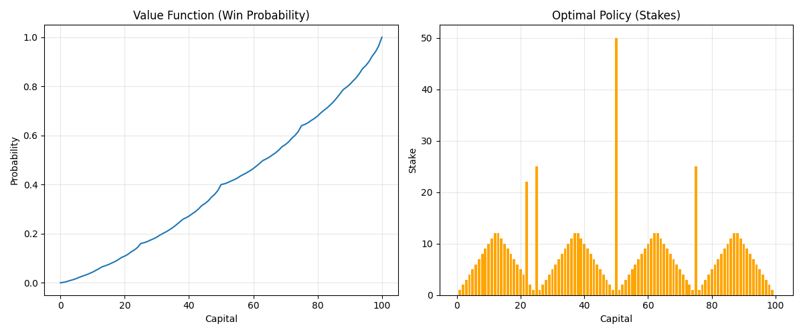

## Today's conversations - 5/9/26
## Finite Markov Decision Processes & Dynamic Programming

---

# Part 1: Finite Markov Decision Processes (Chapter 3)

The bandit problem from the previous class was **non-associative** — actions did not depend on any state, and there was no sequential structure. MDPs generalize this to the full RL setting: an agent interacts with an environment over time, actions affect future states, and the goal is to maximize long-term cumulative reward.

## The Agent-Environment Interface

At each discrete time step $t = 0, 1, 2, \ldots$, the agent:

1. Observes state $S_t \in \mathcal{S}$
2. Selects action $A_t \in \mathcal{A}(s)$
3. Receives reward $R_{t+1} \in \mathbb{R}$
4. Transitions to new state $S_{t+1} \in \mathcal{S}$

This produces a **trajectory**:

$$S_0, A_0, R_1, S_1, A_1, R_2, S_2, A_2, R_3, \ldots$$

The agent-environment boundary is **not** the physical boundary of the agent. Anything the agent **cannot arbitrarily change** is considered part of the environment. For a robot, its motors are part of the environment (they can fail, have latency). For a chess player, the board rules are the environment. The boundary is drawn at the limit of the agent's absolute control.

## The Markov Property

An MDP satisfies the **Markov property**: the future depends only on the current state, not the history:

$$\Pr\{S_{t+1} = s', R_{t+1} = r \mid S_t, A_t, S_{t-1}, A_{t-1}, \ldots, S_0, A_0\} = \Pr\{S_{t+1} = s', R_{t+1} = r \mid S_t, A_t\}$$

The current state $S_t$ captures all relevant information from the past. This is what makes the problem tractable — we don't need to remember the full history.

## The Dynamics Function

The function $p$ completely characterizes the MDP:

$$p(s', r \mid s, a) = \Pr\{S_t = s', R_t = r \mid S_{t-1} = s, A_{t-1} = a\}$$

This is a probability distribution, so it sums to 1 over all next states and rewards:

$$\sum_{s' \in \mathcal{S}} \sum_{r \in \mathcal{R}} p(s', r \mid s, a) = 1, \quad \forall s \in \mathcal{S}, a \in \mathcal{A}(s)$$

From $p(s', r \mid s, a)$, we can derive everything else we need. We'll use a running example to make the derivations concrete. Suppose from state $s$ with action $a$, the dynamics are:

| $s'$ | $r$ | $p(s', r \mid s, a)$ |
|------|-----|----------------------|
| A | +5 | 0.3 |
| B | +5 | 0.2 |
| A | -1 | 0.4 |
| B | -1 | 0.1 |
| | **Total** | **1.0** |

### State-transition probabilities

>using model dynamics **$p(s', r \mid s, a)$** to represent other parameters of the MDP like **$p(s' \mid s, a)$ and $r(s, a)$**)

To get the probability of transitioning to $s'$ regardless of which reward we receive, **marginalize out** $r$ (sum over all possible rewards):

$$p(s' \mid s, a) = \sum_{r \in \mathcal{R}} p(s', r \mid s, a)$$

From the example:
- $p(A \mid s, a) = p(A, +5 \mid s,a) + p(A, -1 \mid s,a) = 0.3 + 0.4 = 0.7$
- $p(B \mid s, a) = p(B, +5 \mid s,a) + p(B, -1 \mid s,a) = 0.2 + 0.1 = 0.3$

### Expected reward for a state-action pair

We want the average reward from taking action $a$ in state $s$, regardless of which next state we land in. By definition of expected value, $\mathbb{E}[X] = \sum_x x \cdot \Pr(X = x)$. The random variable is $R_t$ and we need $\Pr(R_t = r \mid s, a)$.

But $p(s', r \mid s, a)$ is a **joint** distribution over both $s'$ and $r$. To get the probability of reward $r$ alone, marginalize out $s'$:

$$\Pr(R_t = r \mid s, a) = \sum_{s' \in \mathcal{S}} p(s', r \mid s, a)$$

From the example:
- $\Pr(r = +5 \mid s, a) = p(A, +5 \mid s,a) + p(B, +5 \mid s,a) = 0.3 + 0.2 = 0.5$
- $\Pr(r = -1 \mid s, a) = p(A, -1 \mid s,a) + p(B, -1 \mid s,a) = 0.4 + 0.1 = 0.5$

Now plug into the expected value formula:

$$r(s, a) = \mathbb{E}[R_t \mid S_{t-1} = s, A_{t-1} = a] = \sum_{r \in \mathcal{R}} r \cdot \Pr(R_t = r \mid s, a) = \sum_{r \in \mathcal{R}} r \sum_{s' \in \mathcal{S}} p(s', r \mid s, a)$$

From the example:

$$r(s, a) = (+5)(0.5) + (-1)(0.5) = 2.5 - 0.5 = 2.0$$

### Expected reward for a state-action-next-state triple

Now we ask a more specific question: "given I took action $a$ in state $s$ **and landed in a particular next state** $s'$, what reward did I probably get?" This is a **conditional expectation**.

We need $\Pr(R_t = r \mid s, a, s')$ — the probability of reward $r$ given we know the state, action, and next state. Apply the definition of conditional probability:

$$\Pr(X \mid Y) = \frac{\Pr(X \text{ and } Y)}{\Pr(Y)}$$

Therefore:

$$\Pr(R_t = r \mid s, a, s') = \frac{\Pr(S_t = s', R_t = r \mid s, a)}{\Pr(S_t = s' \mid s, a)} = \frac{p(s', r \mid s, a)}{p(s' \mid s, a)}$$

**Why the division?** It's renormalization. When we condition on "landed in A," we restrict attention to only the outcomes where A happened:

| $s'$ | $r$ | $p(s', r \mid s, a)$ | Comment |
|------|-----|----------------------|---------|
| A | +5 | 0.3 | kept |
| ~~B~~ | ~~+5~~ | ~~0.2~~ | eliminated |
| A | -1 | 0.4 | kept |
| ~~B~~ | ~~-1~~ | ~~0.1~~ | eliminated |
| | **Total** | **0.7** | not 1.0! |

The surviving probabilities sum to 0.7, not 1.0. They describe the world where A *might or might not* happen, but we *know* A happened. To get a valid probability distribution, divide by $p(A \mid s, a) = 0.7$:

| $r$ | Raw $p(A, r \mid s, a)$ | $\div\ 0.7$ | $\Pr(r \mid s, a, A)$ |
|-----|-----|-----|------|
| +5 | 0.3 | $0.3 / 0.7$ | **0.429** |
| -1 | 0.4 | $0.4 / 0.7$ | **0.571** |
| | | **Total** | **1.0** |

Without the division, we'd be using joint probabilities (0.3 and 0.4) as if they were conditional probabilities. But 0.3 means "30% chance of both A and +5," not "30% chance of +5 given A." The division converts one into the other.

Now plug into the expected value formula — $\sum_r r \cdot \Pr(r \mid s, a, s')$ — and factor out the denominator (it doesn't depend on $r$):

$$r(s, a, s') = \mathbb{E}[R_t \mid S_{t-1} = s, A_{t-1} = a, S_t = s'] = \sum_{r \in \mathcal{R}} r \cdot \frac{p(s', r \mid s, a)}{p(s' \mid s, a)} = \frac{\sum_{r \in \mathcal{R}} r \cdot p(s', r \mid s, a)}{p(s' \mid s, a)}$$

From the example:

$$r(s, a, A) = \frac{(+5)(0.3) + (-1)(0.4)}{0.7} = \frac{1.1}{0.7} = 1.57$$

$$r(s, a, B) = \frac{(+5)(0.2) + (-1)(0.1)}{0.3} = \frac{0.9}{0.3} = 3.0$$

Landing in B is rarer (probability 0.3 vs 0.7), but when you do, you're more likely to have gotten the +5 reward (0.2 out of 0.3 = 67%) compared to landing in A (0.3 out of 0.7 = 43%). So the expected reward conditioned on reaching B is higher.

### Numerical Example: Recycling Robot

States: $\mathcal{S} = \{\text{high}, \text{low}\}$ (battery level). Actions: $\mathcal{A} = \{\text{search}, \text{wait}, \text{recharge}\}$.

| $s$ | $a$ | $s'$ | $p(s' \mid s, a)$ | $r(s, a, s')$ |
|-----|-----|------|-------------------|----------------|
| high | search | high | $\alpha$ | $r_{\text{search}}$ |
| high | search | low | $1 - \alpha$ | $r_{\text{search}}$ |
| low | search | high | $1 - \beta$ | $-3$ |
| low | search | low | $\beta$ | $r_{\text{search}}$ |
| high | wait | high | $1$ | $r_{\text{wait}}$ |
| low | wait | low | $1$ | $r_{\text{wait}}$ |
| low | recharge | high | $1$ | $0$ |

The dynamics function encodes the complete structure of the problem. Once you have $p$, you have the MDP.

## Returns: What the Agent Maximizes

The agent's goal is to maximize the **expected return** $G_t$ — the cumulative future reward from time $t$.

**Episodic tasks** (tasks that terminate):

$$G_t = R_{t+1} + R_{t+2} + R_{t+3} + \cdots + R_T$$

where $T$ is the terminal time step. Examples: a game of chess (ends in win/loss/draw), navigating a maze (ends when goal is reached).

**Continuing tasks** (tasks that go on forever):

The simple sum $R_{t+1} + R_{t+2} + \cdots$ can diverge to infinity. We introduce **discounting** with factor $\gamma \in [0, 1)$:

$$G_t = R_{t+1} + \gamma R_{t+2} + \gamma^2 R_{t+3} + \cdots = \sum_{k=0}^{\infty} \gamma^k R_{t+k+1}$$

**Why discounting works**: The geometric series converges. If rewards are bounded by some $R_{\max}$:

$$G_t \leq \sum_{k=0}^{\infty} \gamma^k R_{\max} = \frac{R_{\max}}{1 - \gamma}$$

**Recursive form** — the return satisfies a simple recursion that is fundamental to RL:

$$G_t = R_{t+1} + \gamma G_{t+1}$$

This says: the return from now = the immediate reward + the discounted return from the next step. This recursive structure is what makes dynamic programming possible.

**What $\gamma$ controls:**

| $\gamma$ | Behavior | Horizon |
|----------|----------|---------|
| $0$ | Myopic — only cares about immediate reward | 1 step |
| $0.9$ | Reward 10 steps away is worth $(0.9)^{10} = 0.35$ of immediate reward | ~10 steps |
| $0.99$ | Reward 100 steps away is worth $(0.99)^{100} = 0.37$ of immediate reward | ~100 steps |
| $\to 1$ | Far-sighted — cares about distant future almost equally | $\to \infty$ |

**Unified notation** (covers both episodic and continuing):

$$G_t = \sum_{k=t+1}^{T} \gamma^{k-t-1} R_k$$

where either $T = \infty$ (continuing, with $\gamma < 1$) or $\gamma = 1$ (episodic, with finite $T$), but **not both**.

## Policies

A **policy** $\pi$ maps states to probability distributions over actions:

$$\pi(a \mid s) = \Pr\{A_t = a \mid S_t = s\}$$

A policy is **deterministic** if it always picks one specific action in each state: $\pi(s) = a$. A policy is **stochastic** if it assigns nonzero probability to multiple actions.

In the bandit problem, there was no state, so a policy was just a distribution over arms. Now the policy conditions on the state — different states can warrant different actions.

## Value Functions

Given a policy $\pi$, how good is it to be in a particular state? Or to take a particular action in a particular state? Value functions answer these questions.

### State-Value Function $v_\pi(s)$

The **state-value function** for policy $\pi$ is the expected return starting from state $s$ and following $\pi$ thereafter:

$$v_\pi(s) = \mathbb{E}_\pi[G_t \mid S_t = s] = \mathbb{E}_\pi\left[\sum_{k=0}^{\infty} \gamma^k R_{t+k+1} \mid S_t = s\right]$$

This tells us: "How good is state $s$ if I follow policy $\pi$?"

### Action-Value Function $q_\pi(s, a)$

The **action-value function** for policy $\pi$ is the expected return starting from state $s$, taking action $a$, and then following $\pi$:

$$q_\pi(s, a) = \mathbb{E}_\pi[G_t \mid S_t = s, A_t = a] = \mathbb{E}_\pi\left[\sum_{k=0}^{\infty} \gamma^k R_{t+k+1} \mid S_t = s, A_t = a\right]$$

This tells us: "How good is it to take action $a$ in state $s$ and then follow policy $\pi$?"

### Relationship between $v_\pi$ and $q_\pi$

The state-value is the policy-weighted average of all action-values:

$$v_\pi(s) = \sum_{a \in \mathcal{A}(s)} \pi(a \mid s) \cdot q_\pi(s, a)$$

Conversely, the action-value is the immediate reward plus the discounted value of the next state:

$$q_\pi(s, a) = \sum_{s', r} p(s', r \mid s, a)\left[r + \gamma \, v_\pi(s')\right]$$

## The Bellman Equation for $v_\pi$

This is the **central equation** of this chapter. It expresses the value of a state as a function of the values of successor states:

$$\boxed{v_\pi(s) = \sum_{a} \pi(a \mid s) \sum_{s', r} p(s', r \mid s, a)\left[r + \gamma \, v_\pi(s')\right]}$$

**Derivation**: Start from the recursive return $G_t = R_{t+1} + \gamma G_{t+1}$:

$$v_\pi(s) = \mathbb{E}_\pi[G_t \mid S_t = s]$$
$$= \mathbb{E}_\pi[R_{t+1} + \gamma G_{t+1} \mid S_t = s]$$
$$= \sum_a \pi(a \mid s) \sum_{s', r} p(s', r \mid s, a)\left[r + \gamma \, \mathbb{E}_\pi[G_{t+1} \mid S_{t+1} = s']\right]$$
$$= \sum_a \pi(a \mid s) \sum_{s', r} p(s', r \mid s, a)\left[r + \gamma \, v_\pi(s')\right]$$

**Reading the equation**: For each action $a$ the policy might take (weighted by $\pi(a \mid s)$), and for each possible outcome $(s', r)$ of that action (weighted by $p(s', r \mid s, a)$), accumulate the immediate reward $r$ plus the discounted value of the next state $\gamma \, v_\pi(s')$.

This is a **system of $|\mathcal{S}|$ linear equations in $|\mathcal{S}|$ unknowns** (one equation per state). For a given policy $\pi$, there is a unique solution.

## The Bellman Equation for $q_\pi$

Similarly, for the action-value function:

$$\boxed{q_\pi(s, a) = \sum_{s', r} p(s', r \mid s, a)\left[r + \gamma \sum_{a'} \pi(a' \mid s') \, q_\pi(s', a')\right]}$$

This says: take action $a$ in state $s$, observe reward $r$ and next state $s'$, then the future value is $\sum_{a'} \pi(a' \mid s') q_\pi(s', a')$ — the expected value under $\pi$ of being in $s'$.

## Backup Diagrams

Bellman equations have a visual representation called **backup diagrams** that show how value flows from successor states back to the current state.

### State-Value Function $v_\pi$
The root is a state node (circle). It branches to action nodes (dots) weighted by $\pi(a \mid s)$. Each action node branches to next-state nodes weighted by $p(s', r \mid s, a)$. The value backs up from the leaves to the root.

```mermaid
graph TD
    S(("V_{k+1}")) --- A1( )
    S --- A2( )
    style A1 fill:#000,stroke:#333,stroke-width:1px
    style A2 fill:#000,stroke:#333,stroke-width:1px

    A1 --- S1(("V_k"))
    A1 --- S2(("V_k"))
    A2 --- S3(("V_k"))
    
    subgraph Legend
        State((State))
        Action( )
        style Action fill:#000,stroke:#333,stroke-width:1px
    end
```



### Action-Value Function $q_\pi$
The root is a state-action node (dot). It branches to next-state nodes weighted by $p(s', r \mid s, a)$. Each next-state branches to next-actions weighted by $\pi(a' \mid s')$.

```mermaid
graph TD
    SA( ) --- S1((s'))
    SA --- S2((s''))
    style SA fill:#000,stroke:#333,stroke-width:1px
    
    S1 --- A1( )
    S1 --- A2( )
    S2 --- A3( )
    style A1 fill:#000,stroke:#333,stroke-width:1px
    style A2 fill:#000,stroke:#333,stroke-width:1px
    style A3 fill:#000,stroke:#333,stroke-width:1px
```



These diagrams make the structure of the Bellman equations visual and intuitive.

## Optimal Value Functions

Among all possible policies, there exist one or more **optimal policies** that achieve the highest possible value in every state simultaneously.

### Partial Ordering of Policies

Policy $\pi$ is **better than or equal to** $\pi'$ (written $\pi \geq \pi'$) if and only if:

$$v_\pi(s) \geq v_{\pi'}(s), \quad \forall s \in \mathcal{S}$$

There always exists at least one policy that is better than or equal to all other policies. This is an **optimal policy** $\pi_*$. There may be more than one, but they all share the same value functions.

### Optimal State-Value Function

$$v_*(s) = \max_\pi v_\pi(s), \quad \forall s \in \mathcal{S}$$

### Optimal Action-Value Function

$$q_*(s, a) = \max_\pi q_\pi(s, a), \quad \forall s \in \mathcal{S}, a \in \mathcal{A}(s)$$

The relationship between them:

$$q_*(s, a) = \mathbb{E}\left[R_{t+1} + \gamma \, v_*(S_{t+1}) \mid S_t = s, A_t = a\right]$$

## Bellman Optimality Equations

The optimal value functions satisfy special Bellman equations where the $\max$ replaces the policy-weighted sum:

**For $v_*$:**

$$\boxed{v_*(s) = \max_a \sum_{s', r} p(s', r \mid s, a)\left[r + \gamma \, v_*(s')\right]}$$

The value of a state under an optimal policy equals the expected return for the **best** action from that state.

```mermaid
graph TD
    s((s)) --- M[max]
    M --- a1( )
    M --- a2( )
    style a1 fill:#000,stroke:#333,stroke-width:1px
    style a2 fill:#000,stroke:#333,stroke-width:1px
    a1 --- s1((s'))
    a1 --- s2((s''))
    a2 --- s3((s'''))
```



**For $q_*$:**

$$\boxed{q_*(s, a) = \sum_{s', r} p(s', r \mid s, a)\left[r + \gamma \max_{a'} q_*(s', a')\right]}$$

The value of taking action $a$ in state $s$ under an optimal policy equals the immediate reward plus the discounted value of the **best** action in the next state.

```mermaid
graph TD
    SA( ) --- s1((s'))
    SA --- s2((s''))
    style SA fill:#000,stroke:#333,stroke-width:1px
    
    s1 --- M1[max]
    M1 --- a1( )
    M1 --- a2( )
    style a1 fill:#000,stroke:#333,stroke-width:1px
    style a2 fill:#000,stroke:#333,stroke-width:1px
    
    s2 --- M2[max]
    M2 --- a3( )
    style a3 fill:#000,stroke:#333,stroke-width:1px
```



### From Optimal Value Functions to Optimal Policies

**From $v_*$**: Act greedily — pick the action that maximizes expected return:

$$\pi_*(s) = \argmax_a \sum_{s', r} p(s', r \mid s, a)\left[r + \gamma \, v_*(s')\right]$$

This requires knowing the dynamics $p$ to perform the one-step lookahead.

**From $q_*$**: Even simpler — just pick the action with the highest $q$-value:

$$\pi_*(s) = \argmax_a \, q_*(s, a)$$

No model needed! This is why $q_*$ is so valuable — it encodes the optimal policy directly.

### Why Not Just Solve the Bellman Optimality Equations Directly?

The Bellman optimality equations for $v_*$ form a system of $|\mathcal{S}|$ equations in $|\mathcal{S}|$ unknowns. In principle, we could solve them. In practice:

1. We rarely know the dynamics $p$ exactly
2. The state space is often enormous (or continuous)
3. The $\max$ operator makes the system **nonlinear** (unlike the Bellman equation for $v_\pi$, which is linear)

This motivates the approximate and iterative methods that form the rest of the course.

## The Reward Hypothesis

> All of what we mean by goals and purposes can be well thought of as the maximization of the expected value of the cumulative sum of a received scalar signal (called reward).

This is a **philosophical claim**, not a theorem. It asserts that any goal an agent might have can be encoded as a reward signal. Whether this is truly universal is debatable, but it provides a clean mathematical framework for defining "what the agent wants."

---

# Part 2: Dynamic Programming (Chapter 4)

Dynamic Programming (DP) provides the **foundation** for understanding all RL algorithms. DP assumes we have a **perfect model** of the environment — the complete dynamics function $p(s', r \mid s, a)$ — and uses it to compute optimal policies.

The core idea: **turn Bellman equations into iterative update rules**.

## Settings

In dynamic programming, we assume the finite MDP is fully known:

$$\mathcal{M} = \left(\mathcal{S}, \mathcal{A}, \pi(a \mid s), p(s', r \mid s, a), \gamma\right)$$

Once the MDP model $\mathcal{M}$ is known, dynamic programming uses it to compute long-term return estimates — the state-value function $V_\pi(s)$ and the action-value function $Q_\pi(s, a)$.

## Iterative Policy Evaluation (Prediction)

**Problem**: Given a policy $\pi$, compute $v_\pi$.

The Bellman equation for $v_\pi$ is a system of $|\mathcal{S}|$ linear equations. We could solve it directly (matrix inversion), but for large state spaces that's impractical. Instead, we solve it **iteratively**.

**Update rule**: Start with an arbitrary $V_0$ and repeatedly apply the Bellman equation as an update:

$$\boxed{V_{k+1}(s) = \sum_a \pi(a \mid s) \sum_{s', r} p(s', r \mid s, a)\left[r + \gamma \, V_k(s')\right], \quad \forall s \in \mathcal{S}}$$

**Update Backup Diagram**:

```mermaid
graph TD
    S(("V_{k+1}")) --- A1( )
    S --- A2( )
    style A1 fill:#000,stroke:#333,stroke-width:1px
    style A2 fill:#000,stroke:#333,stroke-width:1px

    A1 --- S1(("V_k"))
    A1 --- S2(("V_k"))
    A2 --- S3(("V_k"))
```



Each sweep updates every state using the values from the previous sweep. The sequence $\{V_k\}$ converges to $v_\pi$ as $k \to \infty$.

**Stopping criterion**: Stop when the maximum change across all states is small:

$$\max_s |V_{k+1}(s) - V_k(s)| < \theta$$

where $\theta$ is a small positive threshold.

### In-Place (Gauss-Seidel) Updates

The standard version uses two arrays: one for $V_k$ and one for $V_{k+1}$. The **in-place** version uses a single array and immediately uses updated values as they become available:

$$V(s) \leftarrow \sum_a \pi(a \mid s) \sum_{s', r} p(s', r \mid s, a)\left[r + \gamma \, V(s')\right]$$

When $V(s')$ on the right-hand side has already been updated in the current sweep, the new value is used. This typically converges **faster** than the two-array version because updated information propagates within the same sweep.

### Algorithm: Iterative Policy Evaluation

```
Input: policy π to evaluate
Initialize V(s) arbitrarily for all s ∈ S (e.g., V(s) = 0)

Repeat:
    Δ ← 0
    For each s ∈ S:
        v ← V(s)
        V(s) ← Σ_a π(a|s) Σ_{s',r} p(s',r|s,a) [r + γ V(s')]
        Δ ← max(Δ, |v - V(s)|)
Until Δ < θ

Output: V ≈ v_π
```

**Python Implementation:**

```python
import numpy as np

def policy_evaluation(env, policy, gamma=1.0, theta=1e-8):
    """
    Iterative Policy Evaluation (Prediction) using Bellman Equation.
    
    Args:
        env: Environment with a tabular transition model `env.P[s][a]`.
             Each entry is a list of (prob, next_state, reward, done).
        policy: 2D array [states, actions] where entry [s, a] is pi(a|s).
        gamma: Discount factor (default 1.0).
        theta: Small threshold to stop iterations.
        
    Returns:
        V: 1D array of values for each state.
    """
    # 1. Initialize V(s) to zeros
    V = np.zeros(env.observation_space.n)
    
    while True:
        delta = 0
        # 2. Sweep over every state
        for s in range(env.observation_space.n):
            v_new = 0
            
            # 3. Sum over all possible actions
            for a, action_prob in enumerate(policy[s]):
                # 4. Sum over all possible outcomes (s', r)
                # env.P[s][a] -> [(prob, next_state, reward, done), ...]
                for prob, next_state, reward, done in env.P[s][a]:
                    # Bellman expectation equation:
                    # v(s) = sum_a pi(a|s) * sum_{s',r} p(s',r|s,a) * [r + gamma * v(s')]
                    # Note: if done=True, the episode ends, so V(next_state) isn't added.
                    v_new += action_prob * prob * (reward + gamma * V[next_state] * (not done))
            
            # 5. Track the maximum change across all states
            delta = max(delta, np.abs(v_new - V[s]))
            
            # 6. In-place update (Gauss-Seidel)
            V[s] = v_new
            
        # 7. Convergence check
        if delta < theta:
            break
            
    return V
```

### Example: 4x4 Gridworld

Consider a 4x4 grid where the agent can move up, down, left, right (equiprobable random policy $\pi(a \mid s) = 0.25$ for all actions). Terminal states at top-left and bottom-right corners. Reward is $-1$ for every transition.

After just $k = 3$ iterations of policy evaluation, the greedy policy with respect to the intermediate value estimates is already the **optimal policy**. This illustrates that we don't always need exact convergence before extracting a useful policy.

| Iteration $k$ | Behavior |
|----------------|----------|
| $k = 0$ | $V(s) = 0$ everywhere |
| $k = 1$ | States adjacent to terminal get $V = -1$ |
| $k = 3$ | Greedy policy is already optimal |
| $k = 10$ | Values nearly converged |
| $k \to \infty$ | Exact $v_\pi$ |

## Policy Improvement

**Problem**: Given $v_\pi$ for the current policy, can we find a **better** policy?

**Idea**: For each state, check if there's an action that's better than what $\pi$ currently prescribes. Compute the action-value for every action:

$$q_\pi(s, a) = \sum_{s', r} p(s', r \mid s, a)\left[r + \gamma \, v_\pi(s')\right]$$

Then construct a new **greedy policy**:

$$\pi'(s) = \argmax_a \, q_\pi(s, a) = \argmax_a \sum_{s', r} p(s', r \mid s, a)\left[r + \gamma \, v_\pi(s')\right]$$

### Policy Improvement Theorem

If $\pi$ and $\pi'$ are any two deterministic policies such that:

$$q_\pi(s, \pi'(s)) \geq v_\pi(s), \quad \forall s \in \mathcal{S}$$

then $\pi'$ is at least as good as $\pi$:

$$\boxed{v_{\pi'}(s) \geq v_\pi(s), \quad \forall s \in \mathcal{S}}$$

**Intuition**: If, in every state, the new policy's action is at least as good as what the old policy would have done (as measured by $q_\pi$), then the new policy must be at least as good overall.

**Proof sketch**: Starting from $v_\pi(s) \leq q_\pi(s, \pi'(s))$, expand using the Bellman equation:

$$v_\pi(s) \leq q_\pi(s, \pi'(s))$$
$$= \mathbb{E}[R_{t+1} + \gamma v_\pi(S_{t+1}) \mid S_t = s, A_t = \pi'(s)]$$
$$\leq \mathbb{E}[R_{t+1} + \gamma q_\pi(S_{t+1}, \pi'(S_{t+1})) \mid S_t = s, A_t = \pi'(s)]$$
$$= \mathbb{E}[R_{t+1} + \gamma R_{t+2} + \gamma^2 v_\pi(S_{t+2}) \mid S_t = s, A_t = \pi'(s), A_{t+1} = \pi'(S_{t+1})]$$
$$\leq \cdots \leq \mathbb{E}_{\pi'}[G_t \mid S_t = s] = v_{\pi'}(s)$$

The inequality propagates forward indefinitely, yielding $v_\pi(s) \leq v_{\pi'}(s)$.

**When does improvement stop?** When $\pi' = \pi$ — the greedy policy is the same as the current policy. At that point:

$$v_\pi(s) = \max_a \sum_{s', r} p(s', r \mid s, a)\left[r + \gamma \, v_\pi(s')\right]$$

This is the **Bellman optimality equation**! So $v_\pi = v_*$ and $\pi = \pi_*$.

## Policy Iteration

**The complete algorithm**: Alternate between full policy evaluation and policy improvement until convergence:

$$\pi_0 \xrightarrow{E} v_{\pi_0} \xrightarrow{I} \pi_1 \xrightarrow{E} v_{\pi_1} \xrightarrow{I} \pi_2 \xrightarrow{E} \cdots \xrightarrow{I} \pi_* \xrightarrow{E} v_*$$

where $\xrightarrow{E}$ is policy **evaluation** and $\xrightarrow{I}$ is policy **improvement**.

### Algorithm: Policy Iteration

```
1. Initialization:
   V(s) ∈ ℝ, π(s) ∈ A(s) arbitrarily for all s

2. Policy Evaluation:
   Repeat:
       Δ ← 0
       For each s ∈ S:
           v ← V(s)
           V(s) ← Σ_{s',r} p(s',r|s,π(s)) [r + γ V(s')]
           Δ ← max(Δ, |v - V(s)|)
   Until Δ < θ

3. Policy Improvement:
   policy_stable ← true
   For each s ∈ S:
       old_action ← π(s)
       π(s) ← argmax_a Σ_{s',r} p(s',r|s,a) [r + γ V(s')]
       If old_action ≠ π(s): policy_stable ← false
   If policy_stable: stop and return V ≈ v_*, π ≈ π_*
   Else: go to step 2
```

**Python Implementation:**

```python
def policy_iteration(env, gamma=1.0, theta=1e-8):
    """
    Policy Iteration Algorithm.
    
    Args:
        env: Environment with `env.P`, `env.observation_space.n`, `env.action_space.n`.
        gamma: Discount factor.
        theta: Stopping threshold for evaluation.
        
    Returns:
        policy: Optimal 2D array [states, actions].
        V: Optimal state-value function.
    """
    def one_step_lookahead(s, V):
        """Helper to calculate values for all actions in a state."""
        A = np.zeros(env.action_space.n)
        for a in range(env.action_space.n):
            for prob, next_state, reward, done in env.P[s][a]:
                A[a] += prob * (reward + gamma * V[next_state] * (not done))
        return A

    # 1. Initialization
    # Start with a random policy (e.g., equiprobable)
    policy = np.ones([env.observation_space.n, env.action_space.n]) / env.action_space.n
    V = np.zeros(env.observation_space.n)
    
    while True:
        # 2. Policy Evaluation
        while True:
            delta = 0
            for s in range(env.observation_space.n):
                v_old = V[s]
                # Calculate v(s) for the CURRENT policy
                # V(s) = sum_a pi(a|s) * q(s,a)
                action_values = one_step_lookahead(s, V)
                V[s] = np.sum(policy[s] * action_values)
                delta = max(delta, np.abs(v_old - V[s]))
            if delta < theta:
                break
        
        # 3. Policy Improvement
        policy_stable = True
        for s in range(env.observation_space.n):
            # The best action under the current value function
            old_action = np.argmax(policy[s])
            
            action_values = one_step_lookahead(s, V)
            best_action = np.argmax(action_values)
            
            # If the greedy action changed, the policy is not yet stable
            if old_action != best_action:
                policy_stable = False
            
            # Update policy to be greedy (deterministic)
            policy[s] = np.eye(env.action_space.n)[best_action]
            
        if policy_stable:
            return policy, V
```

**Convergence guarantee**: A finite MDP has a finite number of deterministic policies ($|\mathcal{A}|^{|\mathcal{S}|}$). Each policy improvement step is guaranteed to strictly improve the policy (or reach optimality). Therefore, policy iteration must converge in a finite number of iterations.

In practice, convergence is remarkably fast — often far fewer iterations than the number of policies.

### Example 1: race car on a track (Sutton & Barto, Example 4.1)
Predicting the car to move slow or fast to balance between its states of hot, cold and over heated. 
[Car Race implementation](https://github.com/samratkar/drl/blob/main/barto-sutton-notes/lecture3-2026-05-09-mdp/assets/race-car/dp_race_car_demonstration.ipynb)
[Care Race Mathemtical Formulation](https://github.com/samratkar/drl/blob/main/barto-sutton-notes/lecture3-2026-05-09-mdp/assets/race-car/mdp_race_car.xlsx)

### Example 2: Jack's Car Rental (Sutton & Barto, Example 4.2)
Jack manages two car rental locations. This is a classic example of a complex MDP where Policy Iteration is significantly more efficient than brute-force search.
[Jack's car rental implementation](https://github.com/samratkar/drl/blob/main/barto-sutton-notes/lecture3-2026-05-09-mdp/assets/jack-car-rental/jack_car_rental_implementation.ipynb)

### Example 3 : Grid world problem 1
[Grid world 1 implementation](https://github.com/samratkar/drl/blob/main/barto-sutton-notes/lecture3-2026-05-09-mdp/assets/grid-game/dynamic_programming_case_study.ipynb)
[Grid world 1 Game](https://samratkar.github.io/assets/drl/webinars/dp-qlearning/src/dynamic_programming_game.html)

### Example 4 : Grid world problem 2
[Grid world 2 Game](https://github.com/samratkar/drl/tree/main/barto-sutton-notes/lecture3-2026-05-09-mdp/assets/policy-evaluation-dp)


#### Problem Formulation
- **States**: The number of cars at each location at the end of the day. $\mathcal{S} = \{(n_1, n_2) : 0 \leq n_1, n_2 \leq 20\}$. Total states: $21 \times 21 = 441$.
- **Actions**: The number of cars moved from Location 1 to Location 2 overnight. $a \in \{-5, -4, \ldots, 0, \ldots, 4, 5\}$. Negative values imply moving cars from Location 2 to 1.
- **Rewards**:
    - $+10$ for every car rented.
    - $-2$ for every car moved overnight.
- **Dynamics (Poisson Distribution)**:
    - Rentals and returns at each location follow Poisson distributions with parameters $\lambda$.
    - **Location 1**: $\lambda_{\text{rent}} = 3, \lambda_{\text{return}} = 3$
    - **Location 2**: $\lambda_{\text{rent}} = 4, \lambda_{\text{return}} = 2$
- **Constraints**:
    - Maximum 20 cars can be stored at each location.
    - Maximum 5 cars can be moved overnight.

#### Python Implementation

```python
import numpy as np
from scipy.stats import poisson

class JacksCarRental:
    def __init__(self):
        self.max_cars = 20
        self.max_move = 5
        self.gamma = 0.9
        self.rental_reward = 10
        self.move_cost = 2
        
        # Poisson parameters
        self.rent_loc1, self.return_loc1 = 3, 3
        self.rent_loc2, self.return_loc2 = 4, 2
        
        # Precompute Poisson probabilities for efficiency
        self.poisson_cache = {}
        
    def get_poisson(self, n, lam):
        key = (n, lam)
        if key not in self.poisson_cache:
            self.poisson_cache[key] = poisson.pmf(n, lam)
        return self.poisson_cache[key]

    def expected_return(self, state, action, V):
        """Calculates expected return for a state-action pair."""
        returns = 0
        # Cost of moving cars
        returns -= self.move_cost * abs(action)
        
        # Cars after moving
        cars_loc1 = int(min(state[0] - action, self.max_cars))
        cars_loc2 = int(min(state[1] + action, self.max_cars))
        
        # We iterate through possible rentals and returns
        # For a full implementation, we limit the Poisson range (e.g., 0 to 11)
        for rent1 in range(11):
            for rent2 in range(11):
                p_rent = self.get_poisson(rent1, self.rent_loc1) * \
                         self.get_poisson(rent2, self.rent_loc2)
                
                # Actual rentals are limited by cars available
                actual_rent1 = min(cars_loc1, rent1)
                actual_rent2 = min(cars_loc2, rent2)
                reward = (actual_rent1 + actual_rent2) * self.rental_reward
                
                for ret1 in range(11):
                    for ret2 in range(11):
                        p_ret = self.get_poisson(ret1, self.return_loc1) * \
                                self.get_poisson(ret2, self.return_loc2)
                        
                        p = p_rent * p_ret
                        
                        # New car counts
                        s1 = min(cars_loc1 - actual_rent1 + ret1, self.max_cars)
                        s2 = min(cars_loc2 - actual_rent2 + ret2, self.max_cars)
                        
                        returns += p * (reward + self.gamma * V[s1, s2])
        return returns

# Policy Iteration logic follows the standard GPI pattern
```

Policy iteration converges from $\pi_0$ to the optimal policy $\pi_4$ in just **4 improvement steps**. The resulting policy shows non-trivial behavior: if Location 1 has many cars and Location 2 has few, move the maximum (5) to Location 2 where the rental demand is higher ($\lambda=4$).

## Value Iteration

**Key insight**: Policy iteration requires **complete** policy evaluation at each step, which itself requires multiple sweeps. But do we really need exact $v_\pi$ before improving?

Value iteration combines the evaluation and improvement steps into a single update:

The policy evaluation step of policy iteration can be truncated in several ways without losing the convergence guarantees of policy iteration. One important special case is when policy evaluation is stopped after just one sweep (on update for each state). This algorithm is called value iteration. it can be written as a particular simple pudate operation that combines the policy improvement and truncated policy evaluation steps : 

$$\boxed{V_{k+1}(s) = \max_a \sum_{s', r} p(s', r \mid s, a)\left[r + \gamma \, V_k(s')\right], \quad \forall s \in \mathcal{S}}$$

**Update Backup Diagram Comparison**:

| Policy Evaluation (Policy Iteration) | Value Iteration |
|:---:|:---:|
| Updates $V$ using the current policy $\pi$. It's a weighted average over actions. | Updates $V$ by directly picking the best action. It uses a $\max$ operator. |
| $V_{k+1}(s) = \sum_a \pi(a\|s) \sum_{s', r} \dots$ | $V_{k+1}(s) = \max_a \sum_{s', r} \dots$ |

```mermaid
graph TD
    subgraph "Policy Evaluation Update"
        pe_s(("V_{k+1}")) --- pe_a1( )
        pe_s --- pe_a2( )
        style pe_a1 fill:#000,stroke:#333,stroke-width:1px
        style pe_a2 fill:#000,stroke:#333,stroke-width:1px
        pe_a1 --- pe_s1(("V_k"))
        pe_a1 --- pe_s2(("V_k"))
        pe_a2 --- pe_s3(("V_k"))
    end

    subgraph "Value Iteration Update"
        vi_s(("V_{k+1}")) --- vi_m[max]
        vi_m --- vi_a1( )
        vi_m --- vi_a2( )
        style vi_a1 fill:#000,stroke:#333,stroke-width:1px
        style vi_a2 fill:#000,stroke:#333,stroke-width:1px
        vi_a1 --- vi_s1(("V_k"))
        vi_a1 --- vi_s2(("V_k"))
        vi_a2 --- vi_s3(("V_k"))
    end
```



**Key Difference**: In Policy Evaluation, we branch to all actions according to the current policy $\pi$. In Value Iteration, we insert a **max** node to represent that we are greedily taking the best action at each update step, effectively combining evaluation and improvement.

This is the **Bellman optimality equation turned into an update rule**. Equivalently, it performs policy evaluation with just **one sweep** before improving — truncated policy iteration taken to the extreme.

### Algorithm: Value Iteration

```
Initialize V(s) arbitrarily for all s (e.g., V(s) = 0)

Repeat:
    Δ ← 0
    For each s ∈ S:
        v ← V(s)
        V(s) ← max_a Σ_{s',r} p(s',r|s,a) [r + γ V(s')]
        Δ ← max(Δ, |v - V(s)|)
Until Δ < θ

Extract policy:
    π(s) = argmax_a Σ_{s',r} p(s',r|s,a) [r + γ V(s')]

Output: V ≈ v_*, π ≈ π_*
```

**Python Implementation:**

```python
def value_iteration(env, gamma=1.0, theta=1e-8):
    """
    Value Iteration Algorithm.
    
    Args:
        env: Environment with `env.P`, `env.observation_space.n`, `env.action_space.n`.
        gamma: Discount factor.
        theta: Stopping threshold.
        
    Returns:
        policy: Optimal 2D array [states, actions].
        V: Optimal state-value function.
    """
    def one_step_lookahead(s, V):
        """Helper to calculate values for all actions in a state."""
        A = np.zeros(env.action_space.n)
        for a in range(env.action_space.n):
            for prob, next_state, reward, done in env.P[s][a]:
                A[a] += prob * (reward + gamma * V[next_state] * (not done))
        return A

    # 1. Initialize V(s) to zeros
    V = np.zeros(env.observation_space.n)
    
    while True:
        delta = 0
        # 2. Update every state
        for s in range(env.observation_space.n):
            # Bellman optimality equation:
            # V(s) = max_a sum_{s',r} p(s',r|s,a) [r + gamma * V(s')]
            action_values = one_step_lookahead(s, V)
            best_action_value = np.max(action_values)
            
            delta = max(delta, np.abs(best_action_value - V[s]))
            V[s] = best_action_value
            
        if delta < theta:
            break
    
    # 3. Extract optimal policy
    policy = np.zeros([env.observation_space.n, env.action_space.n])
    for s in range(env.observation_space.n):
        action_values = one_step_lookahead(s, V)
        best_action = np.argmax(action_values)
        # Deterministic policy
        policy[s, best_action] = 1.0
        
    return policy, V
```

**Comparison with policy iteration:**

| | Policy Iteration | Value Iteration |
|--|-----------------|-----------------|
| **Evaluation step** | Complete convergence (many sweeps) | Single sweep |
| **Improvement step** | Explicit greedy policy computation | Implicit in the $\max$ |
| **Per-iteration cost** | Higher (full evaluation) | Lower (one sweep) |
| **Number of iterations** | Fewer (each is exact) | More (each is approximate) |
| **Total work** | Often similar | Often similar |
| **Conceptual** | Two distinct phases | Single combined update |

### Example: Gambler's Problem (Sutton & Barto, Example 4.3)

A gambler bets on coin flips. If heads ($p_h = 0.4$), she wins her stake; if tails, she loses it. The goal is to reach \$100 starting from some initial capital.

#### Problem Formulation
- **States**: Capital $s \in \{1, 2, \ldots, 99\}$. The states 0 and 100 are **terminal** (loss and win).
- **Actions**: Stake $a \in \{1, 2, \ldots, \min(s, 100-s)\}$. You can't bet more than you have, and you can't bet more than needed to reach 100.
- **Reward**: $+1$ if capital reaches 100, $0$ for all other transitions.
- **Dynamics**:
    - $p(s+a, 0 \mid s, a) = p_h$
    - $p(s-a, 0 \mid s, a) = 1 - p_h$
    - (Exception: if $s+a=100$, the reward is 1).

#### Value Iteration in Action: The Gambler's Problem

[View Interactive Script (VS Code): gambler_interactive.py](assets/gambler/gambler_interactive.py)   



#### Insights and Concepts

The Gambler's Problem is a definitive showcase for **Value Iteration** because it highlights how the algorithm handles **non-linear decision boundaries** and **probabilistic risk**.

**1. The Value Function (Left Graph)**
- **Curvature and Non-linearity**: The value function (the probability of winning starting from capital $s$) is not a straight line. If it were a fair coin ($p_h=0.5$), the value function would be exactly $V(s) = s/100$. 
- **The "Sawtooth" Nature**: For an unfair coin ($p_h=0.4$), the curve is generally concave but contains small "kinks." These represent capital milestones (like 25, 50, 75) where the win probability jumps significantly because a single lucky "bold" bet can reach the next safe harbor.
- **Value Iteration's Role**: The graph shows $V(s)$ after convergence. Each iteration of Value Iteration applied the **Bellman Optimality Equation** ($V \leftarrow \max_a \sum p \dots$), effectively "scanning" all possible stakes and keeping only the one that maximized the win probability.

**2. The Optimal Policy (Right Graph)**
- **Bold Play Strategy**: The most striking feature is the **sawtooth pattern** of the stakes. 
- **Concept of Milestones**: At capital $s=25$, the optimal stake is 25. Why? Because the goal is 100, and $25$ is a divisor of $100$. Winning that bet takes you to $50$ (halfway), from which another bold bet takes you to $100$. 
- **Minimizing Exposure**: In a game with a negative expected value ($p_h < 0.5$), every bet you make is a "loss" in expectation. Therefore, the optimal policy is to **minimize the number of bets**. Making many small $1 bets gives the house edge more time to "grind" your capital to zero. One big bet gives you a single $40\%$ chance to double up.

**3. How the Graphs Describe Value Iteration**
- **Implicit Max**: Unlike Policy Iteration, which would evaluate a "safe" policy and then improve it, Value Iteration directly updates the win probability by assuming the agent will *always* take the best stake. 
- **Convergence to Optimality**: The graphs represent the stable point where no further change in $V(s)$ can be found by changing the stake. The "spiky" policy is the mathematical proof that in certain RL environments, the optimal behavior is not "smooth" or "conservative," but rather highly aggressive and state-dependent.

## Generalized Policy Iteration (GPI)

The term **Generalized Policy Iteration** refers to the general idea of interleaving policy evaluation and policy improvement, regardless of the granularity:

$$\text{GPI}: \quad V \xrightarrow{\text{evaluation (some amount)}} \approx v_\pi \xrightarrow{\text{improvement}} \pi' \xrightarrow{\text{evaluation}} \cdots$$

Almost **all** RL methods can be understood as forms of GPI:

| Method | Evaluation | Improvement |
|--------|-----------|-------------|
| Policy Iteration | Complete convergence | Greedy |
| Value Iteration | One sweep | Greedy (implicit in $\max$) |
| Monte Carlo | Sample-based episodes | Epsilon-greedy |
| TD Learning | Single-step sample updates | Epsilon-greedy |
| DQN | Neural network approximation | Epsilon-greedy |

**The GPI invariant**: Evaluation pushes $V$ toward $v_\pi$ (the true value of the current policy). Improvement pushes $\pi$ toward being greedy with respect to $V$. These two processes **compete** — improvement changes the policy, making the value estimate stale; evaluation catches up. **Stability** (neither process changes anything) is reached only at the **optimal** policy and value function.

The two processes can be visualized as two constraints:

- **Evaluation line**: $V = v_\pi$ (value function is correct for $\pi$)
- **Improvement line**: $\pi = \text{greedy}(V)$ (policy is greedy w.r.t. $V$)

The only point satisfying both is $(v_*, \pi_*)$. GPI zig-zags between these constraints, converging to the intersection.

## Asynchronous Dynamic Programming

Standard DP requires **systematic sweeps** over the entire state space. Asynchronous DP relaxes this:

- Update states in **any order**
- Some states can be updated **more frequently** than others
- Can focus computation on **relevant states** (states the agent actually visits)
- Enables **real-time** DP: update states as the agent interacts with the environment

Convergence is still guaranteed as long as all states continue to be updated (no state is starved indefinitely).

This is important for large state spaces where a full sweep is too expensive. Instead of updating all 10 million states, update the 1000 states the agent is likely to visit.

## Properties of DP

**Computational complexity**: DP is **polynomial** in $\vert\mathcal{S}\vert$ and $\vert\mathcal{A}\vert$. This is exponentially faster than brute-force policy search, which would need to evaluate $\vert\mathcal{A}\vert^{\vert\mathcal{S}\vert}$ deterministic policies.

| Approach | Complexity |
|----------|-----------|
| Direct policy search | $O(\vert\mathcal{A}\vert^{\vert\mathcal{S}\vert})$ — exponential |
| Policy Iteration | $O(\vert\mathcal{S}\vert^2 \vert\mathcal{A}\vert)$ per iteration, polynomial total |
| Value Iteration | $O(\vert\mathcal{S}\vert^2 \vert\mathcal{A}\vert)$ per iteration |

**Curse of dimensionality**: The number of states grows **exponentially** with the number of state variables. A state described by 10 variables with 100 values each has $100^{10} = 10^{20}$ states. This is a property of the **problem**, not of DP — any method must face it. DP is still the most efficient exact method.

**Expected updates**: All DP updates are **expected updates** — they compute expectations over all possible next states weighted by their transition probabilities. This contrasts with **sample updates** (Monte Carlo, TD) that use a single sampled transition. Expected updates are more expensive per step but make fuller use of the model.

**Bootstrapping**: DP methods update value estimates based on **other value estimates** (the $V(s')$ term in the update). This is called bootstrapping. Monte Carlo methods do not bootstrap — they wait for the complete return.

| Property | DP | Monte Carlo | TD |
|----------|-----|-------------|-----|
| Model required? | Yes (full $p$) | No | No |
| Bootstraps? | Yes | No | Yes |
| Update type | Expected | Sample (full episode) | Sample (one step) |

## Summary: Key Equations at a Glance

### Bellman Equations (for a given policy $\pi$)

$$v_\pi(s) = \sum_a \pi(a \mid s) \sum_{s',r} p(s',r \mid s,a)\left[r + \gamma \, v_\pi(s')\right]$$

$$q_\pi(s,a) = \sum_{s',r} p(s',r \mid s,a)\left[r + \gamma \sum_{a'} \pi(a' \mid s') q_\pi(s',a')\right]$$

### Bellman Optimality Equations

$$v_*(s) = \max_a \sum_{s',r} p(s',r \mid s,a)\left[r + \gamma \, v_*(s')\right]$$

$$q_*(s,a) = \sum_{s',r} p(s',r \mid s,a)\left[r + \gamma \max_{a'} q_*(s',a')\right]$$

### DP Update Rules

**Policy Evaluation:**

$$V(s) \leftarrow \sum_a \pi(a \mid s) \sum_{s',r} p(s',r \mid s,a)\left[r + \gamma \, V(s')\right]$$

**Value Iteration:**

$$V(s) \leftarrow \max_a \sum_{s',r} p(s',r \mid s,a)\left[r + \gamma \, V(s')\right]$$

### Policy Extraction

**From $v_*$** (requires model):

$$\pi_*(s) = \argmax_a \sum_{s',r} p(s',r \mid s,a)\left[r + \gamma \, v_*(s')\right]$$

**From $q_*$** (model-free):

$$\pi_*(s) = \argmax_a \, q_*(s,a)$$

---

## Looking Ahead

DP gives us the conceptual foundation, but it requires a **complete model** of the environment, which we rarely have in practice. The next classes will cover methods that relax this requirement:

- **Monte Carlo methods** (Chapter 5): Learn from complete episodes of experience — no model needed, but must wait for episode termination
- **Temporal Difference learning** (Chapter 6): Learn from incomplete episodes by bootstrapping — combines the model-free nature of MC with the bootstrapping of DP
- **Q-learning**: Learn $q_*$ directly from experience without knowing the dynamics — the sample-based version of value iteration
