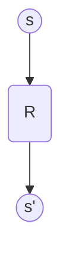

# Lecture 4: Monte Carlo Methods & Temporal-Difference Learning
**Date:** 2026-05-16  
**Reference:** Sutton & Barto, Chapters 5 & 6 (2nd Edition)

---

## Table of Contents
1. [Chapter 5: Monte Carlo Methods](#chapter-5-monte-carlo-methods)
    - [5.1 Monte Carlo Prediction](#51-monte-carlo-prediction)
    - [5.2 Monte Carlo Estimation of Action Values](#52-monte-carlo-estimation-of-action-values)
    - [5.3 Monte Carlo Control](#53-monte-carlo-control)
    - [5.4 Monte Carlo Control without Exploring Starts](#54-monte-carlo-control-without-exploring-starts)
    - [5.5 Off-policy Prediction via Importance Sampling](#55-off-policy-prediction-via-importance-sampling)
    - [5.6 Incremental Implementation](#56-incremental-implementation)
    - [5.7 Off-policy Monte Carlo Control](#57-off-policy-monte-carlo-control)
    - [5.8 *Discounting-aware Importance Sampling](#58-discounting-aware-importance-sampling)
    - [5.9 *Per-decision Importance Sampling](#59-per-decision-importance-sampling)
2. [Chapter 6: Temporal-Difference Learning](#chapter-6-temporal-difference-learning)
    - [6.1 TD Prediction](#61-td-prediction)
    - [6.2 Advantages of TD Prediction Methods](#62-advantages-of-td-prediction-methods)
    - [6.3 Optimality of TD(0)](#63-optimality-of-td0)
    - [6.4 Sarsa: On-policy TD Control](#64-sarsa-on-policy-td-control)
    - [6.5 Q-learning: Off-policy TD Control](#65-q-learning-off-policy-td-control)
    - [6.6 Expected Sarsa](#66-expected-sarsa)
    - [6.7 Maximization Bias and Double Learning](#67-maximization-bias-and-double-learning)
    - [6.8 Games, Afterstates, and Other Special Cases](#68-games-afterstates-and-other-special-cases)

---

# Chapter 5: Monte Carlo Methods

Monte Carlo (MC) methods learn from **experience**—sample sequences of states, actions, and rewards from actual or simulated interaction with an environment. Unlike Dynamic Programming, they require no model ($P$ and $R$).

### 5.1 Monte Carlo Prediction
MC prediction learns the state-value function $v_\pi$ for a given policy $\pi$ by averaging the returns observed after visiting a state.

- **First-visit MC:** Averages returns following the first visit to state $s$ in an episode.
- **Every-visit MC:** Averages returns following every visit to state $s$ in an episode.

#### Example 5.1: Blackjack
In Blackjack, the state is defined by the player's sum (12–21), the dealer's showing card (ace–10), and whether the player has a "usable ace." We evaluate a policy that sticks only on 20 or 21.

```python
# From assets/blackjack_mc.py
# First-visit MC Prediction update
idx = (p_sum - 12, d_card - 1, int(u_ace))
returns_sum[idx] += reward
returns_count[idx] += 1
V[idx] = returns_sum[idx] / returns_count[idx]
```

### 5.2 Monte Carlo Estimation of Action Values
If a model is not available, it is particularly useful to estimate **action values** ($q_*$) rather than state values ($v_*$).
- Without a model, state values alone are not sufficient for action selection (you can't see the one-step lookahead).
- **The exploration problem:** If we use a deterministic policy, some state-action pairs may never be visited. We must ensure **continual exploration**.

### 5.3 Monte Carlo Control
The general pattern of MC control is **Generalized Policy Iteration (GPI)**:
1. **Evaluation:** Use MC to estimate $q_\pi$.
2. **Improvement:** Make the policy greedy w.r.t. $q_\pi$.

#### Monte Carlo with Exploring Starts (MC ES)
To guarantee exploration, we assume that every state-action pair has a non-zero probability of being the start of an episode.
- **Example 5.3:** Blackjack with Exploring Starts converges to the optimal policy, effectively learning when to hit or stick.

### 5.4 Monte Carlo Control without Exploring Starts
To avoid the impractical assumption of exploring starts, we use **$\epsilon$-soft policies**.
- **$\epsilon$-greedy policy:** Most of the time, pick the action with the highest $q$-value. With probability $\epsilon$, pick an action at random.
- This ensures that all actions are tried infinitely often.

### 5.5 Off-policy Prediction via Importance Sampling
How can we learn about a **target policy** $\pi$ while following a different **behavior policy** $b$? This is **off-policy learning**.

- **Requirement (Coverage):** $\pi(a\mid s) > 0 \implies b(a\mid s) > 0$.
- **Importance-sampling ratio:** 
  $$\rho_{t:T-1} \doteq \prod_{k=t}^{T-1} \frac{\pi(A_k\mid S_k)}{b(A_k\mid S_k)}$$
- **Ordinary Importance Sampling:** $V(s) \doteq \frac{\sum_{t \in \mathcal{T}(s)} \rho_{t:T(t)-1} G_t}{\mid\mathcal{T}(s)\mid}$ (Unbiased, high variance).
- **Weighted Importance Sampling:** $V(s) \doteq \frac{\sum_{t \in \mathcal{T}(s)} \rho_{t:T(t)-1} G_t}{\sum_{t \in \mathcal{T}(s)} \rho_{t:T(t)-1}}$ (Biased, lower variance).

#### Example 5.5: Infinite Variance
Ordinary importance sampling can have **infinite variance**. If the importance-sampling ratio has a mean greater than 1, its variance can grow without bound.

```python
# From assets/infinite_variance.py
# Visualizes the extreme fluctuations of Ordinary IS in Example 5.5
```

### 5.6 Incremental Implementation
Weighted importance sampling can be implemented incrementally:
$$W_{n+1} \doteq W_n + \rho_n$$
$$V_{n+1} \doteq V_n + \frac{\rho_n}{C_n} [G_n - V_n]$$
Where $C_n$ is the cumulative sum of weights.

### 5.7 Off-policy Monte Carlo Control
Uses the behavior policy to generate episodes and the target policy (greedy) for learning.
- **Limitation:** It only learns from the *tails* of episodes—after the behavior policy takes an action that the target policy would not have taken, the importance-sampling ratio becomes zero.

### 5.8 *Discounting-aware Importance Sampling
Standard IS treats the return $G_t$ as a single unit. However, if $\gamma < 1$, the return is composed of discounted rewards. This section discusses how to decompose the ratio to reduce variance by acknowledging that future rewards are less affected by earlier actions.

### 5.9 *Per-decision Importance Sampling
Further refines IS by applying the ratio only to the rewards that actually depend on the actions taken at that time:
$$\mathbb{E}[\rho_{t:T-1} G_t] = \mathbb{E} \left[ \sum_{k=t}^{T-1} \rho_{t:k} R_{k+1} \right]$$

---

# Chapter 6: Temporal-Difference Learning

Temporal-Difference (TD) learning is a combination of MC and DP. Like MC, it learns from experience. Like DP, it **bootstraps**—updates estimates based on other estimates.

### 6.1 TD Prediction
The simplest TD method, **TD(0)**, updates the value of a state based on the immediate reward and the estimated value of the next state:
$$V(S_t) \leftarrow V(S_t) + \alpha [R_{t+1} + \gamma V(S_{t+1}) - V(S_t)]$$

**Backup Diagram for TD(0):**


### 6.2 Advantages of TD Prediction Methods
1. **Online learning:** Updates happen after each step, not just at the end of an episode.
2. **No model needed:** Just like MC.
3. **Efficiency:** TD often converges faster than MC on Markovian tasks.

### 6.3 Optimality of TD(0)
If we have a fixed set of experience (Batch Training), TD(0) converges to the **Certainty-Equivalence estimate**—the estimate that would be correct if the observed transitions were the true dynamics.
- **Example 6.4:** Random Walk batch results (Figure 6.2) show TD(0) outperforming MC.

```python
# From assets/batch_learning.py
# Implements Batch TD vs Batch MC for Figure 6.2
```

### 6.4 Sarsa: On-policy TD Control
Updates the action-value function based on the actions actually taken by the current policy (S, A, R, S', A'):
$$Q(S_t, A_t) \leftarrow Q(S_t, A_t) + \alpha [R_{t+1} + \gamma Q(S_{t+1}, A_{t+1}) - Q(S_t, A_t)]$$

### 6.5 Q-learning: Off-policy TD Control
One of the most important breakthroughs in RL. It learns the optimal action-value function $q_*$ directly, independent of the policy being followed:
$$Q(S_t, A_t) \leftarrow Q(S_t, A_t) + \alpha [R_{t+1} + \gamma \max_a Q(S_{t+1}, a) - Q(S_t, A_t)]$$

#### Example 6.6: Cliff Walking
Contrasts Sarsa (safe path) vs Q-learning (optimal but risky path). Sarsa accounts for the exploration it *actually* does, whereas Q-learning assumes it will eventually act optimally.

### 6.6 Expected Sarsa
Instead of using a sample action $A_{t+1}$, it uses the expected value over all actions under the current policy:
$$Q(S_t, A_t) \leftarrow Q(S_t, A_t) + \alpha [R_{t+1} + \gamma \sum_a \pi(a\mid S_{t+1}) Q(S_{t+1}, a) - Q(S_t, A_t)]$$

### 6.7 Maximization Bias and Double Learning
Algorithms that use a $\max$ (like Q-learning) or a greedy policy (like Sarsa) are subject to **Maximization Bias**—overestimating values due to taking the maximum over noisy estimates.
- **Solution:** Use two independent estimates ($Q_1$ and $Q_2$). Use one to pick the action and the other to estimate its value.

```python
# From assets/maximization_bias.py
# Double Q-learning vs Q-learning (Figure 6.5)
```

### 6.8 Games, Afterstates, and Other Special Cases
In many games (like Tic-Tac-Toe), many state-action pairs lead to the same result (the same board position). These are called **Afterstates**. Learning values for afterstates is more efficient because it generalizes across different actions that lead to the same configuration.

---

## Practice Exercises

Test your understanding of Monte Carlo and TD methods with these exercises:

- [Multiple Choice Questions (MCQs)](./assets/questions/mcqs.md)
- [Subjective Questions](./assets/questions/subjective.md)
- [Numerical Questions](./assets/questions/numericals.md)
- [Programming Questions](./assets/questions/programming.md)

*Solutions can be found in the [assets/questions/solutions/](./assets/questions/solutions/) folder.*

---
*Reference: Sutton, R. S., & Barto, A. G. (2018). Reinforcement Learning: An Introduction. MIT Press.*
