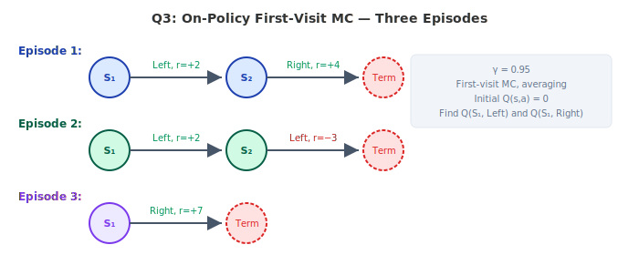
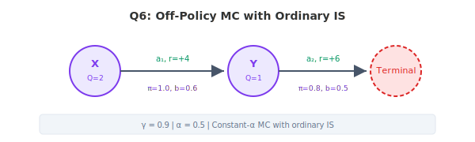
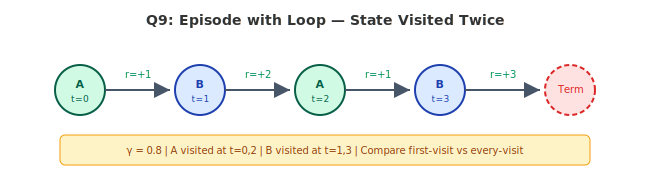
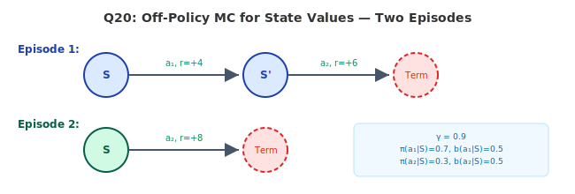

# Numerical Questions - Lecture 4 (Monte Carlo Methods)

---

## Question 1: Basic Return Calculation [3 marks]

An agent generates the following episode in a 4-state environment:

**Episode:** S₁ →(a₁, r=+3)→ S₂ →(a₂, r=−2)→ S₃ →(a₁, r=+6)→ Terminal

**Given:** γ = 0.9

Compute the return $G_t$ from each state, working backwards from the terminal state.

---

## Question 2: First-Visit vs Every-Visit MC [5 marks]

An agent generates a single episode in a 3-state environment where state B is visited twice:

**Episode:** A →(Right, r=+1)→ B →(Up, r=−1)→ A →(Right, r=+2)→ B →(Down, r=+4)→ Terminal

**Given:**
- γ = 1.0 (undiscounted)
- Initial V(s) = 0 for all states

**(a)** [2 marks] List the first-visit return for each state.

**(b)** [2 marks] List the every-visit return for each state (average all visits).

**(c)** [1 mark] Which method gives a lower estimate for V(B)? Why?

---

## Question 3: On-Policy First-Visit MC for Q-values [5 marks]

An agent following an ε-greedy policy generates three episodes:

**Episode 1:** S₁ →(Left, r=+2)→ S₂ →(Right, r=+4)→ Terminal
**Episode 2:** S₁ →(Left, r=+2)→ S₂ →(Left, r=−3)→ Terminal
**Episode 3:** S₁ →(Right, r=+7)→ Terminal

**Given:**
- γ = 0.95
- First-visit MC, simple averaging
- Initial Q(s, a) = 0 for all pairs

**(a)** [2 marks] Compute the return $G_0$ for each episode.

**(b)** [2 marks] After processing all 3 episodes, compute Q(S₁, Left) and Q(S₁, Right).

**(c)** [1 mark] Under the greedy policy derived from these Q-values, what action would be selected at S₁?

---

## Question 4: Constant-α MC Update [4 marks]

An agent uses constant-α MC to update Q-values after each episode.

**Episode 1:** S →(a, r=+10)→ Terminal
**Episode 2:** S →(a, r=+4)→ Terminal
**Episode 3:** S →(a, r=+7)→ Terminal

**Given:**
- γ = 1.0, α = 0.3
- Initial Q(S, a) = 0

**(a)** [2 marks] Compute Q(S, a) after each episode using the constant-α update rule.

**(b)** [2 marks] What would the simple-averaging (first-visit) estimate be after all 3 episodes? Why does it differ from the constant-α result?

---

## Question 5: Importance Sampling Ratio — Single Episode [4 marks]

An agent operates in a 3-state environment. One episode is generated under behavior policy b:

**Episode:** S₁ →(a₁, r=+5)→ S₂ →(a₂, r=+3)→ S₃ →(a₁, r=+2)→ Terminal

**Policy probabilities:**

| State | Action taken | π(a|s) | b(a|s) |
|-------|-------------|--------|--------|
| S₁    | a₁          | 0.9    | 0.5    |
| S₂    | a₂          | 0.6    | 0.4    |
| S₃    | a₁          | 1.0    | 0.7    |

**(a)** [2 marks] Compute the per-step importance sampling ratios.

**(b)** [2 marks] Compute the cumulative importance sampling ratio $\rho_{0:2}$ for the full episode starting from S₁.

---

## Question 6: Off-Policy MC Prediction with Ordinary IS [5 marks]

An agent generates one episode under behavior policy b:

**Episode:** X →(a₁, r=+4)→ Y →(a₂, r=+6)→ Terminal

**Given:**
- γ = 0.9, α = 0.5 (constant-α MC)
- Initial Q(X, a₁) = 2, Q(Y, a₂) = 1
- π(a₁|X) = 1.0, b(a₁|X) = 0.6
- π(a₂|Y) = 0.8, b(a₂|Y) = 0.5

**(a)** [1 mark] Compute the return G from each state.

**(b)** [2 marks] Compute the cumulative importance sampling ratios for each time step.

**(c)** [2 marks] Compute the updated Q-values using off-policy constant-α MC with ordinary importance sampling.

---

## Question 7: Weighted Importance Sampling [5 marks]

An agent generates three episodes starting from state S, all taking action a:

| Episode | Return G | Importance Ratio ρ |
|---------|----------|-------------------|
| 1       | 12       | 2.0               |
| 2       | 6        | 0.5               |
| 3       | 9        | 1.5               |

**Given:** Initial Q(S, a) = 0

**(a)** [2 marks] Compute the ordinary importance sampling estimate of Q(S, a).

**(b)** [2 marks] Compute the weighted importance sampling estimate of Q(S, a).

**(c)** [1 mark] Which estimate has lower variance? Justify briefly.

---

## Question 8: MC Control — ε-Greedy Policy Improvement [5 marks]

After running MC prediction, an agent has the following Q-table:

| State | Left | Right | Up   |
|-------|------|-------|------|
| S₁    | 4.0  | 7.0   | 2.0  |
| S₂    | 5.5  | 3.0   | 6.0  |

**Given:** ε = 0.2, 3 actions available

**(a)** [2 marks] Compute the ε-greedy policy π(a|S₁) for each action.

**(b)** [2 marks] Compute the ε-greedy policy π(a|S₂) for each action.

**(c)** [1 mark] If ε is decreased to 0, what is the resulting policy? What problem might this cause for MC methods?

---

## Question 9: Discounted Returns in a Loop [4 marks]

An agent generates an episode where it loops through a state before reaching terminal:

**Episode:** A →(r=+1)→ B →(r=+2)→ A →(r=+1)→ B →(r=+3)→ Terminal

**Given:** γ = 0.8

**(a)** [2 marks] Compute the first-visit return G(A) and G(B).

**(b)** [2 marks] Compute the every-visit returns for A and B (average over all visits).

---

## Question 10: Off-Policy MC — Zero Probability Problem [3 marks]

An agent generates an episode under behavior policy b:

**Episode:** S₁ →(a₂, r=+5)→ S₂ →(a₁, r=+8)→ Terminal

**Policy probabilities:**

| State | Action | π(a|s) | b(a|s) |
|-------|--------|--------|--------|
| S₁    | a₂     | 0.0    | 0.4    |
| S₂    | a₁     | 1.0    | 0.6    |

**(a)** [1 mark] Compute the importance sampling ratio ρ₀:₁.

**(b)** [2 marks] What does this result imply about off-policy learning from this episode? Explain intuitively why this makes sense.

---

## Question 11: Incremental MC Update Derivation [4 marks]

An agent has processed N=4 episodes for state S, obtaining returns: G₁=5, G₂=8, G₃=3, G₄=10.

**(a)** [2 marks] Show that the sample average after N episodes can be written incrementally as:
$$V_N = V_{N-1} + \frac{1}{N}[G_N - V_{N-1}]$$
by computing V₁, V₂, V₃, V₄ step by step.

**(b)** [2 marks] Verify that V₄ equals the batch average (5+8+3+10)/4.

---

## Question 12: Comparing MC and TD on Same Episode [5 marks]

An agent generates an episode in a 3-state chain:

**Episode:** S₁ →(r=+2)→ S₂ →(r=+4)→ S₃ →(r=+1)→ Terminal

**Given:**
- γ = 0.9, α = 0.5
- Initial V(S₁) = 0, V(S₂) = 0, V(S₃) = 0

**(a)** [2 marks] Compute the MC update for each state (use the full return from each state).

**(b)** [2 marks] Compute the TD(0) update for each state (one-step bootstrap).

**(c)** [1 mark] Which method gives a larger update for V(S₁)? Explain in one sentence.

---

## Question 13: Off-Policy with Non-Greedy Target Policy [5 marks]

An agent uses a stochastic target policy π (not fully greedy):

**Episode (under b):** S₁ →(a₁, r=+3)→ S₂ →(a₂, r=+5)→ Terminal

**Given:**
- γ = 1.0, α = 0.4
- Initial Q(S₁, a₁) = 0, Q(S₂, a₂) = 0
- π(a₁|S₁) = 0.7, b(a₁|S₁) = 0.5
- π(a₂|S₂) = 0.6, b(a₂|S₂) = 0.8

**(a)** [1 mark] Compute returns from each state.

**(b)** [2 marks] Compute off-policy update for Q(S₂, a₂) using ordinary IS.

**(c)** [2 marks] Compute off-policy update for Q(S₁, a₁) using ordinary IS. Show the cumulative ratio.

---

## Question 14: Variance of Ordinary vs Weighted IS [5 marks]

Five episodes from state S (action a) produce:

| Episode | Return G | ρ     |
|---------|----------|-------|
| 1       | 10       | 3.0   |
| 2       | 4        | 0.2   |
| 3       | 7        | 1.5   |
| 4       | 2        | 4.0   |
| 5       | 8        | 0.8   |

**(a)** [2 marks] Compute the ordinary IS estimate: $\hat{V}_{OIS} = \frac{1}{N}\sum_{i} \rho_i G_i$

**(b)** [2 marks] Compute the weighted IS estimate: $\hat{V}_{WIS} = \frac{\sum_i \rho_i G_i}{\sum_i \rho_i}$

**(c)** [1 mark] Which estimate is unbiased? Which typically has lower variance?

---

## Question 15: MC Exploring Starts [4 marks]

In MC with exploring starts, every state-action pair must have nonzero probability of being the starting pair.

Consider a 2-state, 2-action environment. After many episodes, the Q-table is:

| State | Action A | Action B |
|-------|----------|----------|
| S₁    | 4.2      | 4.2      |
| S₂    | 6.0      | 5.8      |

**(a)** [2 marks] What is the greedy policy derived from this Q-table? What issue arises at S₁?

**(b)** [2 marks] If we use ε-greedy with ε=0.1 instead of exploring starts, write the probability of each action at S₁ and S₂.

---

## Question 16: Multi-Step Returns and MC [4 marks]

An agent generates an episode: S₁ →(r=+1)→ S₂ →(r=+2)→ S₃ →(r=+3)→ S₄ →(r=+4)→ Terminal

**Given:** γ = 0.5

**(a)** [2 marks] Compute the MC return (full return) from S₁.

**(b)** [2 marks] Compare with the 2-step return from S₁: $G_{0:2} = r_1 + \gamma r_2 + \gamma^2 V(S_3)$ where V(S₃) = 5.5. Which is larger?

---

## Question 17: Off-Policy MC — Episode Truncation [5 marks]

An agent generates an episode of length 4 under behavior policy b:

**Episode:** S₁ →(a₁)→ S₂ →(a₃)→ S₃ →(a₁)→ S₄ →(a₂)→ Terminal

Rewards: r₁=+2, r₂=+1, r₃=+3, r₄=+5

**Policy probabilities:**

| Time | Action | π(a|s) | b(a|s) |
|------|--------|--------|--------|
| t=0  | a₁     | 0.8    | 0.4    |
| t=1  | a₃     | 0.0    | 0.3    |
| t=2  | a₁     | 1.0    | 0.5    |
| t=3  | a₂     | 0.6    | 0.6    |

**(a)** [2 marks] Compute the cumulative IS ratio ρ₀:₃. What happens?

**(b)** [2 marks] What is the effective return contribution of this episode to Q(S₁, a₁) under ordinary IS?

**(c)** [1 mark] How does weighted IS handle this situation differently from ordinary IS?

---

## Question 18: Blackjack MC Example [5 marks]

In a simplified blackjack game, the agent is in state (Player sum=18, Dealer showing=6, No usable ace). The agent has two actions: Hit or Stand.

After 100 episodes starting from this state:
- Hit was chosen 40 times, average return = −0.3
- Stand was chosen 60 times, average return = +0.6

**(a)** [2 marks] What are the MC estimates Q(state, Hit) and Q(state, Stand)?

**(b)** [2 marks] Under an ε-greedy policy with ε=0.1, what is π(Hit|state) and π(Stand|state)?

**(c)** [1 mark] If we now switch to greedy policy, which action is chosen? Does the agent ever explore Hit again?

---

## Question 19: First-Visit MC with Constant-α — Effect of α [4 marks]

An agent visits state S in consecutive episodes with returns: G₁=10, G₂=2, G₃=10, G₄=2.

**Given:** Initial V(S) = 0

**(a)** [2 marks] Compute V(S) after all 4 episodes with α = 0.1.

**(b)** [2 marks] Compute V(S) after all 4 episodes with α = 0.9. Compare the two results and explain which tracks recent returns more closely.

---

## Question 20: Off-Policy MC for State Values [5 marks]

An agent generates two episodes starting from state S under behavior policy b:

**Episode 1:** S →(a₁, r=+4)→ S' →(a₂, r=+6)→ Terminal
**Episode 2:** S →(a₂, r=+8)→ Terminal

**Given:**
- γ = 0.9

**Policies at state S:**

| Action | π(a|S) | b(a|S) |
|--------|--------|--------|
| a₁     | 0.7    | 0.5    |
| a₂     | 0.3    | 0.5    |

**Policies at state S':**

| Action | π(a|S') | b(a|S') |
|--------|---------|---------|
| a₂     | 1.0     | 0.6     |

**(a)** [1 mark] Compute the return from state S for each episode.

**(b)** [2 marks] Compute the IS ratio for each episode.

**(c)** [2 marks] Compute the ordinary IS estimate and weighted IS estimate of V(S) under π.

---

## Question 21: MC Control — Policy Oscillation [4 marks]

After collecting episodes, an agent has:

| State | Q(s, Left) | Q(s, Right) | Episodes(Left) | Episodes(Right) |
|-------|-----------|-------------|----------------|-----------------|
| S     | 5.0       | 5.1         | 50             | 3               |

**(a)** [2 marks] The greedy policy selects Right. With ε=0.1, what is the probability of selecting each action?

**(b)** [2 marks] Explain in 2-3 sentences why the estimate Q(S, Right)=5.1 based on only 3 episodes might be unreliable, and how this creates policy oscillation in MC control.

---

## Question 22: Discounting and MC Returns — Long Episode [4 marks]

An agent generates an episode of length 6 with constant reward r=+1 at each step.

**Given:** γ = 0.5

**(a)** [2 marks] Compute the return $G_0$ from the first state.

**(b)** [2 marks] What would $G_0$ be if γ = 1.0? What would it be if the episode were infinitely long with γ = 0.5 (i.e., the geometric series sum)?

---

## Question 23: Off-Policy Every-Visit MC [5 marks]

An agent generates one episode where state S is visited twice:

**Episode:** S →(a₁, r=+2)→ T →(a₁, r=+1)→ S →(a₂, r=+5)→ Terminal

**Given:**
- γ = 1.0, α = 0.5
- Initial Q(S, a₁) = 0, Q(S, a₂) = 0

**Policy probabilities:**

| State | Action | π(a|s) | b(a|s) |
|-------|--------|--------|--------|
| S (t=0) | a₁  | 0.8    | 0.5    |
| T (t=1) | a₁  | 1.0    | 0.6    |
| S (t=2) | a₂  | 0.9    | 0.4    |

**(a)** [1 mark] Compute returns from each time step.

**(b)** [2 marks] Compute IS ratios and cumulative ratios for each time step.

**(c)** [2 marks] Compute the off-policy every-visit update for Q(S, a₁) at t=0 using constant-α ordinary IS.

---

## Question 24: MC Prediction Convergence [3 marks]

An agent has run N episodes from state S, obtaining returns that average to $\bar{G} = 7.5$ with sample standard deviation σ = 3.0.

**(a)** [1 mark] What is the standard error of the MC estimate?

**(b)** [2 marks] How many total episodes would be needed to reduce the standard error below 0.5? (Use the formula SE = σ/√N)

---

## Question 25: Comparing On-Policy and Off-Policy for Same Episode [5 marks]

An agent generates one episode under behavior policy b:

**Episode:** P →(a₁, r=+3)→ Q →(a₁, r=+9)→ Terminal

**Given:**
- γ = 0.95, α = 0.3
- Initial Q(P, a₁) = 4, Q(Q, a₁) = 2
- π(a₁|P) = 1.0, b(a₁|P) = 0.4
- π(a₁|Q) = 0.8, b(a₁|Q) = 0.5

**(a)** [1 mark] Compute returns from each state.

**(b)** [2 marks] Compute on-policy MC updates (constant-α, no IS).

**(c)** [2 marks] Compute off-policy MC updates (ordinary IS, constant-α). Show how the IS ratio amplifies or dampens the update.

---

## Question 26: Weighted IS — Incremental Implementation [5 marks]

An agent uses incremental weighted IS to update Q(S, a). Episodes arrive one at a time:

| Episode | Return G | ρ    |
|---------|----------|------|
| 1       | 8        | 2.0  |
| 2       | 5        | 0.5  |
| 3       | 10       | 1.2  |

The incremental weighted IS update formula is:
$$Q_{n+1} = Q_n + \frac{\rho_n}{C_n}[G_n - Q_n]$$
where $C_n = C_{n-1} + \rho_n$ (cumulative sum of weights).

**Given:** Initial Q = 0, C₀ = 0

**(a)** [2 marks] Compute Q after episode 1.

**(b)** [2 marks] Compute Q after episode 2.

**(c)** [1 mark] Compute Q after episode 3. Verify this equals the batch weighted IS formula.

---

## Question 27: MC with Function Approximation Intuition [3 marks]

In tabular MC, V(S) is updated only when S is visited. Consider a gridworld with 100 states where an episode of length 10 visits 10 distinct states.

**(a)** [1 mark] How many state values are updated after this single episode?

**(b)** [2 marks] If we run 50 such episodes (each visiting 10 random states), what is the expected number of visits per state? What does this mean for convergence speed of rarely-visited states?

---

## Question 28: Off-Policy MC — High Variance Example [5 marks]

An agent generates 4 episodes from state S (action a) under behavior policy b:

| Episode | Return G | ρ (cumulative) |
|---------|----------|----------------|
| 1       | 5        | 0.1            |
| 2       | 3        | 8.0            |
| 3       | 7        | 0.3            |
| 4       | 4        | 6.0            |

**(a)** [2 marks] Compute the ordinary IS estimate.

**(b)** [2 marks] Compute the weighted IS estimate.

**(c)** [1 mark] Explain why the ordinary IS estimate has much higher variance in this case.

---

## Question 29: MC for Action-Value Estimation — Multiple Actions [5 marks]

An agent in state S has 3 actions. After many episodes:

| (State, Action) | Visits | Returns observed | Average return |
|-----------------|--------|-----------------|----------------|
| (S, a₁)        | 20     | sum = 140       | 7.0            |
| (S, a₂)        | 5      | sum = 45        | 9.0            |
| (S, a₃)        | 30     | sum = 180       | 6.0            |

**(a)** [2 marks] Under a greedy policy, which action is selected? Under ε-greedy with ε=0.15?

**(b)** [2 marks] The estimate for a₂ is based on only 5 visits. Compute the standard error if the sample standard deviation of the 5 returns for a₂ is 4.0.

**(c)** [1 mark] Explain the exploration-exploitation dilemma this illustrates.

---

## Question 30: Batch MC vs Online MC [4 marks]

An agent processes 4 returns for state S: G₁=10, G₂=6, G₃=8, G₄=12.

**(a)** [2 marks] Compute the batch estimate (simple average after all 4).

**(b)** [2 marks] Compute the incremental estimates V₁, V₂, V₃, V₄ using the incremental formula $V_n = V_{n-1} + \frac{1}{n}(G_n - V_{n-1})$, starting from V₀=0. Verify V₄ matches the batch estimate.

---

## Question 31: Off-Policy MC — Behavior Policy Design [4 marks]

A target policy π is deterministic: π(Left|S)=1.0. You need to design a behavior policy b for off-policy MC.

**(a)** [2 marks] If b(Left|S) = 0.9, what is the IS ratio for each episode that takes Left at S? If b(Left|S) = 0.5?

**(b)** [2 marks] Which behavior policy will produce lower variance in the IS estimate? Explain intuitively using the concept of coverage.

---

*End of Questions*
