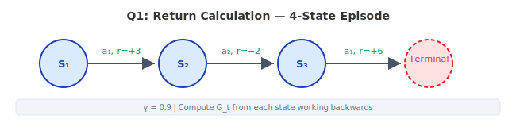
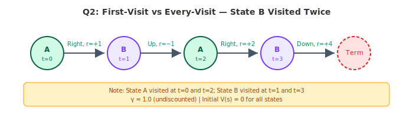
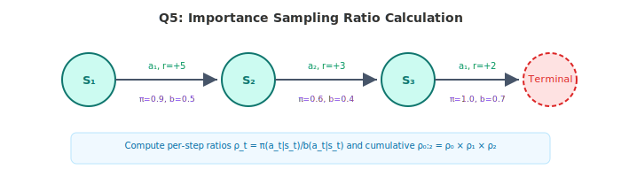
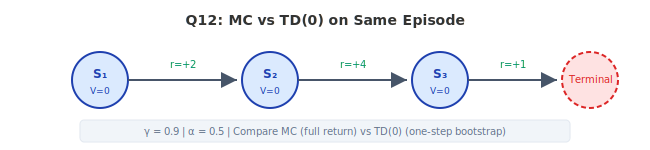
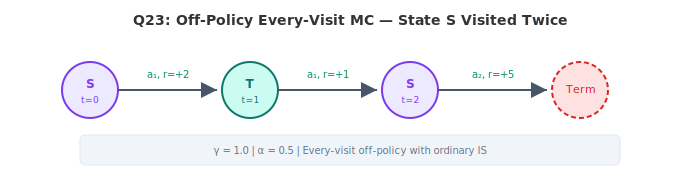
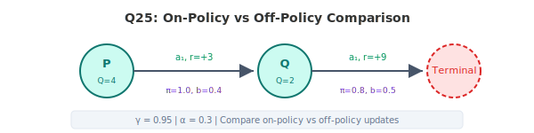

# Numerical Questions - Lecture 4 (Monte Carlo Methods) — Solutions

---

## Question 1: Basic Return Calculation [3 marks]

An agent generates the following episode in a 4-state environment:

**Episode:** S₁ →(a₁, r=+3)→ S₂ →(a₂, r=−2)→ S₃ →(a₁, r=+6)→ Terminal

**Given:** γ = 0.9

Compute the return $G_t$ from each state, working backwards from the terminal state.

### Solution 1

**Formula:** $G_t = R_{t+1} + \gamma G_{t+1}$

Working backwards from the terminal state:

| Time step | State | Reward after | Computation | $G_t$ |
|-----------|-------|-------------|-------------|--------|
| t=2 | S₃ | +6 | $G_2 = 6$ | **6** |
| t=1 | S₂ | −2 | $G_1 = -2 + 0.9 \times 6$ | **3.4** |
| t=0 | S₁ | +3 | $G_0 = 3 + 0.9 \times 3.4$ | **6.06** |

**Final answers:**
- **$G_2 = 6$**
- **$G_1 = 3.4$**
- **$G_0 = 6.06$**

---

## Question 2: First-Visit vs Every-Visit MC [5 marks]

An agent generates a single episode in a 3-state environment where state B is visited twice:

**Episode:** A →(Right, r=+1)→ B →(Up, r=−1)→ A →(Right, r=+2)→ B →(Down, r=+4)→ Terminal

**Given:**
- γ = 1.0 (undiscounted)
- Initial V(s) = 0 for all states

**(a)** [2 marks] List the first-visit return for each state.

**(b)** [2 marks] List the every-visit return for each state (average all visits).

**(c)** [1 mark] Which method gives a lower estimate for V(B)? Why?

### Solution 2

**Formula:** $G_t = R_{t+1} + \gamma G_{t+1}$ with $\gamma = 1.0$

First, label the time steps and compute returns:

| Time | State | Action | Reward | Return $G_t$ |
|------|-------|--------|--------|--------------|
| t=0 | A | Right | +1 | $1 + (-1) + 2 + 4 = 6$ |
| t=1 | B | Up | −1 | $-1 + 2 + 4 = 5$ |
| t=2 | A | Right | +2 | $2 + 4 = 6$ |
| t=3 | B | Down | +4 | $4$ |

**(a) First-visit returns** (only the first time each state is visited):

- V(A) = $G_0$ = **6** (first visit at t=0)
- V(B) = $G_1$ = **5** (first visit at t=1)

**(b) Every-visit returns** (average over all visits):

- V(A) = $(G_0 + G_2)/2 = (6 + 6)/2$ = **6**
- V(B) = $(G_1 + G_3)/2 = (5 + 4)/2$ = **4.5**

**(c)** **Every-visit gives a lower estimate for V(B)** (4.5 vs 5). This is because the second visit to B (at t=3) is closer to the terminal state and has a shorter remaining trajectory, yielding a lower return of 4. Every-visit averages both visits, pulling the estimate down.

---

## Question 3: On-Policy First-Visit MC for Q-values [5 marks]

An agent following an ε-greedy policy generates three episodes:

**Episode 1:** S₁ →(Left, r=+2)→ S₂ →(Right, r=+4)→ Terminal
**Episode 2:** S₁ →(Left, r=+2)→ S₂ →(Left, r=−3)→ Terminal
**Episode 3:** S₁ →(Right, r=+7)→ Terminal

**Given:**
- γ = 0.95
- First-visit MC, simple averaging
- Initial Q(s, a) = 0 for all pairs

**(a)** [2 marks] Compute the return $G_0$ for each episode.

**(b)** [2 marks] After processing all 3 episodes, compute Q(S₁, Left) and Q(S₁, Right).

**(c)** [1 mark] Under the greedy policy derived from these Q-values, what action would be selected at S₁?

### Solution 3

**Formula:** $G_0 = R_1 + \gamma R_2 + \gamma^2 R_3 + \ldots$

**(a)** Computing $G_0$ for each episode:

| Episode | Computation | $G_0$ |
|---------|-------------|--------|
| 1 | $2 + 0.95 \times 4$ | **5.8** |
| 2 | $2 + 0.95 \times (-3)$ | **−0.85** |
| 3 | $7$ | **7** |

**(b)** Grouping by (S₁, action) taken at t=0:

- Q(S₁, Left): Episodes 1 and 2 both start with (S₁, Left)
  - $Q(S_1, \text{Left}) = \frac{5.8 + (-0.85)}{2} = \frac{4.95}{2}$ = **2.475**

- Q(S₁, Right): Episode 3 starts with (S₁, Right)
  - $Q(S_1, \text{Right}) = \frac{7}{1}$ = **7**

**(c)** Under the greedy policy: $\arg\max_a Q(S_1, a)$

Since Q(S₁, Right) = 7 > Q(S₁, Left) = 2.475, the greedy action at S₁ is **Right**.

---

## Question 4: Constant-α MC Update [4 marks]

An agent uses constant-α MC to update Q-values after each episode.

**Episode 1:** S →(a, r=+10)→ Terminal
**Episode 2:** S →(a, r=+4)→ Terminal
**Episode 3:** S →(a, r=+7)→ Terminal

**Given:**
- γ = 1.0, α = 0.3
- Initial Q(S, a) = 0

**(a)** [2 marks] Compute Q(S, a) after each episode using the constant-α update rule.

**(b)** [2 marks] What would the simple-averaging (first-visit) estimate be after all 3 episodes? Why does it differ from the constant-α result?

### Solution 4

**Formula:** $Q(S, a) \leftarrow Q(S, a) + \alpha [G - Q(S, a)]$

**(a)** Step-by-step updates:

| After Episode | G | Computation | Q(S, a) |
|---------------|---|-------------|---------|
| 1 | 10 | $0 + 0.3 \times (10 - 0)$ | **3.0** |
| 2 | 4 | $3.0 + 0.3 \times (4 - 3.0) = 3.0 + 0.3$ | **3.3** |
| 3 | 7 | $3.3 + 0.3 \times (7 - 3.3) = 3.3 + 1.11$ | **4.41** |

**(b)** Simple average: $(10 + 4 + 7)/3$ = **7.0**

The constant-α result (4.41) differs from the simple average (7.0) because constant-α gives **exponential recency weighting** — older returns are exponentially downweighted. The first return of 10 now has weight $(1-\alpha)^2 = 0.49$, while the most recent return has weight $\alpha = 0.3$. In contrast, simple averaging gives equal weight (1/3) to all returns.

---

## Question 5: Importance Sampling Ratio — Single Episode [4 marks]

An agent operates in a 3-state environment. One episode is generated under behavior policy b:

**Episode:** S₁ →(a₁, r=+5)→ S₂ →(a₂, r=+3)→ S₃ →(a₁, r=+2)→ Terminal

**Policy probabilities:**

| State | Action taken | π(a∣s) | b(a∣s) |
|-------|-------------|--------|--------|
| S₁    | a₁          | 0.9    | 0.5    |
| S₂    | a₂          | 0.6    | 0.4    |
| S₃    | a₁          | 1.0    | 0.7    |

**(a)** [2 marks] Compute the per-step importance sampling ratios.

**(b)** [2 marks] Compute the cumulative importance sampling ratio $\rho_{0:2}$ for the full episode starting from S₁.

### Solution 5

**Formula:** Per-step ratio: $\frac{\pi(a_t \mid s_t)}{b(a_t \mid s_t)}$, Cumulative: $\rho_{0:T-1} = \prod_{t=0}^{T-1} \frac{\pi(a_t \mid s_t)}{b(a_t \mid s_t)}$

**(a)** Per-step importance sampling ratios:

| Time | State | Computation | Ratio |
|------|-------|-------------|-------|
| t=0 | S₁ | $0.9 / 0.5$ | **1.8** |
| t=1 | S₂ | $0.6 / 0.4$ | **1.5** |
| t=2 | S₃ | $1.0 / 0.7$ | **1.429** |

**(b)** Cumulative importance sampling ratio:

$$\rho_{0:2} = 1.8 \times 1.5 \times 1.429 = \mathbf{3.857}$$

---

## Question 6: Off-Policy MC Prediction with Ordinary IS [5 marks]

An agent generates one episode under behavior policy b:

**Episode:** X →(a₁, r=+4)→ Y →(a₂, r=+6)→ Terminal

**Given:**
- γ = 0.9, α = 0.5 (constant-α MC)
- Initial Q(X, a₁) = 2, Q(Y, a₂) = 1
- π(a₁∣X) = 1.0, b(a₁∣X) = 0.6
- π(a₂∣Y) = 0.8, b(a₂∣Y) = 0.5

**(a)** [1 mark] Compute the return G from each state.

**(b)** [2 marks] Compute the cumulative importance sampling ratios for each time step.

**(c)** [2 marks] Compute the updated Q-values using off-policy constant-α MC with ordinary importance sampling.

### Solution 6

**(a)** Returns (working backwards):

| Time | State | Computation | Return |
|------|-------|-------------|--------|
| t=1 | Y | $G_1 = 6$ | **6** |
| t=0 | X | $G_0 = 4 + 0.9 \times 6$ | **9.4** |

**(b)** Importance sampling ratios:

For updating Q(Y, a₂), we need the ratio from t=1 onward:
- $\rho_1 = \frac{\pi(a_2 \mid Y)}{b(a_2 \mid Y)} = \frac{0.8}{0.5}$ = **1.6**

For updating Q(X, a₁), we need the ratio from t=0 onward:
- $\rho_{0:1} = \frac{\pi(a_1 \mid X)}{b(a_1 \mid X)} \times \frac{\pi(a_2 \mid Y)}{b(a_2 \mid Y)} = \frac{1.0}{0.6} \times 1.6$ = **2.667**

**(c)** Off-policy constant-α MC update: $Q(s,a) \leftarrow Q(s,a) + \alpha[\rho \cdot G_t - Q(s,a)]$

| State-Action | Old Q | ρ | G | Computation | New Q |
|-------------|-------|---|---|-------------|-------|
| (Y, a₂) | 1 | 1.6 | 6 | $1 + 0.5 \times (1.6 \times 6 - 1) = 1 + 0.5 \times 8.6$ | **5.3** |
| (X, a₁) | 2 | 2.667 | 9.4 | $2 + 0.5 \times (2.667 \times 9.4 - 2) = 2 + 0.5 \times 23.067$ | **13.533** |

---

## Question 7: Weighted Importance Sampling [5 marks]

An agent generates three episodes starting from state S, all taking action a:

| Episode | Return G | Importance Ratio ρ |
|---------|----------|-------------------|
| 1       | 12       | 2.0               |
| 2       | 6        | 0.5               |
| 3       | 9        | 1.5               |

**Given:** Initial Q(S, a) = 0

**(a)** [2 marks] Compute the ordinary importance sampling estimate of Q(S, a).

**(b)** [2 marks] Compute the weighted importance sampling estimate of Q(S, a).

**(c)** [1 mark] Which estimate has lower variance? Justify briefly.

### Solution 7

**(a)** Ordinary IS formula: $\hat{Q}_{OIS} = \frac{1}{N}\sum_{i=1}^{N} \rho_i G_i$

| Episode | ρᵢ × Gᵢ |
|---------|----------|
| 1 | $2.0 \times 12 = 24$ |
| 2 | $0.5 \times 6 = 3$ |
| 3 | $1.5 \times 9 = 13.5$ |

$$\hat{Q}_{OIS} = \frac{24 + 3 + 13.5}{3} = \frac{40.5}{3} = \mathbf{13.5}$$

**(b)** Weighted IS formula: $\hat{Q}_{WIS} = \frac{\sum_i \rho_i G_i}{\sum_i \rho_i}$

$$\hat{Q}_{WIS} = \frac{40.5}{2.0 + 0.5 + 1.5} = \frac{40.5}{4.0} = \mathbf{10.125}$$

**(c)** **Weighted IS has lower variance.** WIS normalizes by the sum of the importance weights, which bounds the effective weights between 0 and 1. This prevents extreme ratios from dominating the estimate. OIS divides by N (fixed), so large ρ values directly inflate individual terms, increasing variance.

---

## Question 8: MC Control — ε-Greedy Policy Improvement [5 marks]

After running MC prediction, an agent has the following Q-table:

| State | Left | Right | Up   |
|-------|------|-------|------|
| S₁    | 4.0  | 7.0   | 2.0  |
| S₂    | 5.5  | 3.0   | 6.0  |

**Given:** ε = 0.2, 3 actions available

**(a)** [2 marks] Compute the ε-greedy policy π(a∣S₁) for each action.

**(b)** [2 marks] Compute the ε-greedy policy π(a∣S₂) for each action.

**(c)** [1 mark] If ε is decreased to 0, what is the resulting policy? What problem might this cause for MC methods?

### Solution 8

**Formula:** For ε-greedy with $\mid\mathcal{A}\mid$ actions:
- Greedy action: $\pi(a^\ast \mid s) = 1 - \varepsilon + \frac{\varepsilon}{\mid\mathcal{A}\mid}$
- Non-greedy actions: $\pi(a \mid s) = \frac{\varepsilon}{\mid\mathcal{A}\mid}$

**(a)** At S₁: Greedy action = Right (Q = 7.0 is highest)

| Action | Type | Computation | π(a∣S₁) |
|--------|------|-------------|---------|
| Left | Non-greedy | $0.2/3$ | **0.067** |
| Right | Greedy | $1 - 0.2 + 0.2/3 = 0.8 + 0.067$ | **0.867** |
| Up | Non-greedy | $0.2/3$ | **0.067** |

**(b)** At S₂: Greedy action = Up (Q = 6.0 is highest)

| Action | Type | Computation | π(a∣S₂) |
|--------|------|-------------|---------|
| Left | Non-greedy | $0.2/3$ | **0.067** |
| Right | Non-greedy | $0.2/3$ | **0.067** |
| Up | Greedy | $1 - 0.2 + 0.2/3 = 0.8 + 0.067$ | **0.867** |

**(c)** With ε = 0, the policy becomes **fully greedy**: π(Right∣S₁) = 1.0, π(Up∣S₂) = 1.0. The problem is that **MC requires exploration** to visit all state-action pairs, but a greedy policy never explores non-greedy actions. Without exploring starts, the agent cannot improve its estimates for actions it never takes.

---

## Question 9: Discounted Returns in a Loop [4 marks]

An agent generates an episode where it loops through a state before reaching terminal:

**Episode:** A →(r=+1)→ B →(r=+2)→ A →(r=+1)→ B →(r=+3)→ Terminal

**Given:** γ = 0.8

**(a)** [2 marks] Compute the first-visit return G(A) and G(B).

**(b)** [2 marks] Compute the every-visit returns for A and B (average over all visits).

### Solution 9

**Formula:** $G_t = R_{t+1} + \gamma G_{t+1}$

First, compute returns at each time step (working backwards):

| Time | State | Reward | Computation | $G_t$ |
|------|-------|--------|-------------|--------|
| t=3 | B | +3 | $G_3 = 3$ | 3 |
| t=2 | A | +1 | $G_2 = 1 + 0.8 \times 3$ | 3.4 |
| t=1 | B | +2 | $G_1 = 2 + 0.8 \times 3.4$ | 4.72 |
| t=0 | A | +1 | $G_0 = 1 + 0.8 \times 4.72$ | 4.776 |

**(a)** First-visit returns (only the first occurrence of each state):

- **G(A) = $G_0$ = 4.776** (first visit at t=0)
- **G(B) = $G_1$ = 4.72** (first visit at t=1)

**(b)** Every-visit returns (average over all visits):

- V(A) = $(G_0 + G_2)/2 = (4.776 + 3.4)/2$ = **4.088**
- V(B) = $(G_1 + G_3)/2 = (4.72 + 3)/2$ = **3.86**

---

## Question 10: Off-Policy MC — Zero Probability Problem [3 marks]

An agent generates an episode under behavior policy b:

**Episode:** S₁ →(a₂, r=+5)→ S₂ →(a₁, r=+8)→ Terminal

**Policy probabilities:**

| State | Action | π(a∣s) | b(a∣s) |
|-------|--------|--------|--------|
| S₁    | a₂     | 0.0    | 0.4    |
| S₂    | a₁     | 1.0    | 0.6    |

**(a)** [1 mark] Compute the importance sampling ratio ρ₀:₁.

**(b)** [2 marks] What does this result imply about off-policy learning from this episode? Explain intuitively why this makes sense.

### Solution 10

**Formula:** $\rho_{0:1} = \frac{\pi(a_2 \mid S_1)}{b(a_2 \mid S_1)} \times \frac{\pi(a_1 \mid S_2)}{b(a_1 \mid S_2)}$

**(a)**

$$\rho_{0:1} = \frac{0.0}{0.4} \times \frac{1.0}{0.6} = 0 \times 1.667 = \mathbf{0}$$

**(b)** The episode contributes **nothing** to the value estimate under the target policy π. This makes intuitive sense because:

The target policy π would **never** take action a₂ at state S₁ (probability = 0). Since this trajectory is impossible under π, it carries zero weight when estimating π's value. The episode is irrelevant for learning about what π would experience — the behavior policy explored a path that the target policy would never follow.

---

## Question 11: Incremental MC Update Derivation [4 marks]

An agent has processed N=4 episodes for state S, obtaining returns: G₁=5, G₂=8, G₃=3, G₄=10.

**(a)** [2 marks] Show that the sample average after N episodes can be written incrementally as:
$$V_N = V_{N-1} + \frac{1}{N}[G_N - V_{N-1}]$$
by computing V₁, V₂, V₃, V₄ step by step.

**(b)** [2 marks] Verify that V₄ equals the batch average (5+8+3+10)/4.

### Solution 11

**Formula:** $V_N = V_{N-1} + \frac{1}{N}[G_N - V_{N-1}]$

**(a)** Step-by-step computation (starting with V₀ = 0):

| N | $G_N$ | Computation | $V_N$ |
|---|--------|-------------|--------|
| 1 | 5 | $0 + \frac{1}{1}(5 - 0) = 0 + 5$ | **5** |
| 2 | 8 | $5 + \frac{1}{2}(8 - 5) = 5 + 1.5$ | **6.5** |
| 3 | 3 | $6.5 + \frac{1}{3}(3 - 6.5) = 6.5 + (-1.167)$ | **5.333** |
| 4 | 10 | $5.333 + \frac{1}{4}(10 - 5.333) = 5.333 + 1.167$ | **6.5** |

**(b)** Batch average: $(5 + 8 + 3 + 10)/4 = 26/4$ = **6.5**

$V_4 = 6.5$ = Batch average = 6.5 ✓

The incremental formula produces the same result as the batch average, confirming they are mathematically equivalent.

---

## Question 12: Comparing MC and TD on Same Episode [5 marks]

An agent generates an episode in a 3-state chain:

**Episode:** S₁ →(r=+2)→ S₂ →(r=+4)→ S₃ →(r=+1)→ Terminal

**Given:**
- γ = 0.9, α = 0.5
- Initial V(S₁) = 0, V(S₂) = 0, V(S₃) = 0

**(a)** [2 marks] Compute the MC update for each state (use the full return from each state).

**(b)** [2 marks] Compute the TD(0) update for each state (one-step bootstrap).

**(c)** [1 mark] Which method gives a larger update for V(S₁)? Explain in one sentence.

### Solution 12

**(a) MC Updates:**

**Formula:** $V(s) \leftarrow V(s) + \alpha[G_t - V(s)]$

First compute returns (backwards):

| Time | State | Computation | $G_t$ |
|------|-------|-------------|--------|
| t=2 | S₃ | $G_2 = 1$ | 1 |
| t=1 | S₂ | $G_1 = 4 + 0.9 \times 1$ | 4.9 |
| t=0 | S₁ | $G_0 = 2 + 0.9 \times 4.9$ | 6.41 |

MC updates (each from initial value 0):

| State | Computation | New V |
|-------|-------------|-------|
| S₃ | $0 + 0.5 \times (1 - 0)$ | **0.5** |
| S₂ | $0 + 0.5 \times (4.9 - 0)$ | **2.45** |
| S₁ | $0 + 0.5 \times (6.41 - 0)$ | **3.205** |

**(b) TD(0) Updates:**

**Formula:** $V(s) \leftarrow V(s) + \alpha[R_{t+1} + \gamma V(S_{t+1}) - V(S_t)]$

Note: TD(0) uses the current value estimates. With all initial values at 0, the TD target is $R_{t+1} + \gamma \times 0 = R_{t+1}$.

| State | TD Target | Computation | New V |
|-------|-----------|-------------|-------|
| S₃ | $1 + 0.9 \times 0 = 1$ | $0 + 0.5 \times (1 - 0)$ | **0.5** |
| S₂ | $4 + 0.9 \times 0 = 4$ | $0 + 0.5 \times (4 - 0)$ | **2.0** |
| S₁ | $2 + 0.9 \times 0 = 2$ | $0 + 0.5 \times (2 - 0)$ | **1.0** |

**(c)** **MC gives a larger update for V(S₁)** (3.205 vs 1.0). MC uses the full return which propagates all downstream rewards back to S₁ in a single episode, while TD(0) only uses the immediate reward plus the (currently zero) bootstrapped next-state value.

---

## Question 13: Off-Policy with Non-Greedy Target Policy [5 marks]

An agent uses a stochastic target policy π (not fully greedy):

**Episode (under b):** S₁ →(a₁, r=+3)→ S₂ →(a₂, r=+5)→ Terminal

**Given:**
- γ = 1.0, α = 0.4
- Initial Q(S₁, a₁) = 0, Q(S₂, a₂) = 0
- π(a₁∣S₁) = 0.7, b(a₁∣S₁) = 0.5
- π(a₂∣S₂) = 0.6, b(a₂∣S₂) = 0.8

**(a)** [1 mark] Compute returns from each state.

**(b)** [2 marks] Compute off-policy update for Q(S₂, a₂) using ordinary IS.

**(c)** [2 marks] Compute off-policy update for Q(S₁, a₁) using ordinary IS. Show the cumulative ratio.

### Solution 13

**(a)** Returns (γ = 1.0):

| Time | State | Computation | Return |
|------|-------|-------------|--------|
| t=1 | S₂ | $G_1 = 5$ | **5** |
| t=0 | S₁ | $G_0 = 3 + 5 = 8$ | **8** |

**(b)** Off-policy update for Q(S₂, a₂):

IS ratio from t=1: $\rho_1 = \frac{\pi(a_2 \mid S_2)}{b(a_2 \mid S_2)} = \frac{0.6}{0.8} = 0.75$

**Formula:** $Q(s,a) \leftarrow Q(s,a) + \alpha[\rho \cdot G_t - Q(s,a)]$

$$Q(S_2, a_2) = 0 + 0.4 \times (0.75 \times 5 - 0) = 0.4 \times 3.75 = \mathbf{1.5}$$

**(c)** Off-policy update for Q(S₁, a₁):

Cumulative IS ratio from t=0: $\rho_{0:1} = \frac{\pi(a_1 \mid S_1)}{b(a_1 \mid S_1)} \times \frac{\pi(a_2 \mid S_2)}{b(a_2 \mid S_2)} = \frac{0.7}{0.5} \times \frac{0.6}{0.8} = 1.4 \times 0.75 = 1.05$

$$Q(S_1, a_1) = 0 + 0.4 \times (1.05 \times 8 - 0) = 0.4 \times 8.4 = \mathbf{3.36}$$

---

## Question 14: Variance of Ordinary vs Weighted IS [5 marks]

Five episodes from state S (action a) produce:

| Episode | Return G | ρ     |
|---------|----------|-------|
| 1       | 10       | 3.0   |
| 2       | 4        | 0.2   |
| 3       | 7        | 1.5   |
| 4       | 2        | 4.0   |
| 5       | 8        | 0.8   |

**(a)** [2 marks] Compute the ordinary IS estimate: $\hat{V}_{OIS} = \frac{1}{N}\sum_{i} \rho_i G_i$

**(b)** [2 marks] Compute the weighted IS estimate: $\hat{V}_{WIS} = \frac{\sum_i \rho_i G_i}{\sum_i \rho_i}$

**(c)** [1 mark] Which estimate is unbiased? Which typically has lower variance?

### Solution 14

**(a)** Ordinary IS estimate:

| Episode | ρᵢ × Gᵢ |
|---------|----------|
| 1 | $3.0 \times 10 = 30$ |
| 2 | $0.2 \times 4 = 0.8$ |
| 3 | $1.5 \times 7 = 10.5$ |
| 4 | $4.0 \times 2 = 8$ |
| 5 | $0.8 \times 8 = 6.4$ |

$$\hat{V}_{OIS} = \frac{30 + 0.8 + 10.5 + 8 + 6.4}{5} = \frac{55.7}{5} = \mathbf{11.14}$$

**(b)** Weighted IS estimate:

$$\sum_i \rho_i = 3.0 + 0.2 + 1.5 + 4.0 + 0.8 = 9.5$$

$$\hat{V}_{WIS} = \frac{55.7}{9.5} = \mathbf{5.863}$$

**(c)** **Ordinary IS is unbiased** (in expectation, it equals the true value). **Weighted IS typically has lower variance** because it normalizes by the sum of importance weights, which prevents episodes with extreme ρ values (like ρ=4.0) from dominating the estimate. However, WIS is biased (though the bias asymptotically vanishes).

---

## Question 15: MC Exploring Starts [4 marks]

In MC with exploring starts, every state-action pair must have nonzero probability of being the starting pair.

Consider a 2-state, 2-action environment. After many episodes, the Q-table is:

| State | Action A | Action B |
|-------|----------|----------|
| S₁    | 4.2      | 4.2      |
| S₂    | 6.0      | 5.8      |

**(a)** [2 marks] What is the greedy policy derived from this Q-table? What issue arises at S₁?

**(b)** [2 marks] If we use ε-greedy with ε=0.1 instead of exploring starts, write the probability of each action at S₁ and S₂.

### Solution 15

**(a)** Greedy policy: $\pi(s) = \arg\max_a Q(s,a)$

- **S₁:** Q(S₁, A) = Q(S₁, B) = 4.2 → **Tie!** Both actions have equal value.
- **S₂:** Q(S₂, A) = 6.0 > Q(S₂, B) = 5.8 → Select **Action A**

**Issue at S₁:** There is a **tie** between the two actions. The greedy policy is not uniquely defined. This is problematic because arbitrary tie-breaking (e.g., always choosing A) could prevent exploration of the other action, meaning MC may never collect more data to break the tie.

**(b)** ε-greedy with ε = 0.1, 2 actions:

- Greedy action probability: $1 - \varepsilon + \frac{\varepsilon}{\mid\mathcal{A}\mid} = 1 - 0.1 + \frac{0.1}{2} = 0.95$
- Non-greedy action probability: $\frac{\varepsilon}{\mid\mathcal{A}\mid} = \frac{0.1}{2} = 0.05$

| State | π(A∣s) | π(B∣s) |
|-------|--------|--------|
| S₁ | 0.95 (or 0.05)* | 0.05 (or 0.95)* |
| S₂ | **0.95** | **0.05** |

*At S₁, since there is a tie, whichever action is selected as "greedy" gets 0.95 and the other gets 0.05.

---

## Question 16: Multi-Step Returns and MC [4 marks]

An agent generates an episode: S₁ →(r=+1)→ S₂ →(r=+2)→ S₃ →(r=+3)→ S₄ →(r=+4)→ Terminal

**Given:** γ = 0.5

**(a)** [2 marks] Compute the MC return (full return) from S₁.

**(b)** [2 marks] Compare with the 2-step return from S₁: $G_{0:2} = r_1 + \gamma r_2 + \gamma^2 V(S_3)$ where V(S₃) = 5.5. Which is larger?

### Solution 16

**(a)** MC return (full return from S₁):

**Formula:** $G_0 = R_1 + \gamma R_2 + \gamma^2 R_3 + \gamma^3 R_4$

$$G_0 = 1 + 0.5 \times 2 + 0.5^2 \times 3 + 0.5^3 \times 4$$
$$= 1 + 1 + 0.25 \times 3 + 0.125 \times 4$$
$$= 1 + 1 + 0.75 + 0.5 = \mathbf{3.25}$$

**(b)** 2-step return from S₁:

**Formula:** $G_{0:2} = R_1 + \gamma R_2 + \gamma^2 V(S_3)$

$$G_{0:2} = 1 + 0.5 \times 2 + 0.5^2 \times 5.5$$
$$= 1 + 1 + 0.25 \times 5.5$$
$$= 1 + 1 + 1.375 = \mathbf{3.375}$$

**The 2-step return (3.375) is larger than the MC return (3.25).** This occurs because the bootstrapped value V(S₃) = 5.5 is higher than the actual discounted return from S₃ onward ($3 + 0.5 \times 4 = 5$). The bootstrap estimate overestimates, making the 2-step return larger.

---

## Question 17: Off-Policy MC — Episode Truncation [5 marks]

An agent generates an episode of length 4 under behavior policy b:

**Episode:** S₁ →(a₁)→ S₂ →(a₃)→ S₃ →(a₁)→ S₄ →(a₂)→ Terminal

Rewards: r₁=+2, r₂=+1, r₃=+3, r₄=+5

**Policy probabilities:**

| Time | Action | π(a∣s) | b(a∣s) |
|------|--------|--------|--------|
| t=0  | a₁     | 0.8    | 0.4    |
| t=1  | a₃     | 0.0    | 0.3    |
| t=2  | a₁     | 1.0    | 0.5    |
| t=3  | a₂     | 0.6    | 0.6    |

**(a)** [2 marks] Compute the cumulative IS ratio ρ₀:₃. What happens?

**(b)** [2 marks] What is the effective return contribution of this episode to Q(S₁, a₁) under ordinary IS?

**(c)** [1 mark] How does weighted IS handle this situation differently from ordinary IS?

### Solution 17

**(a)** Cumulative IS ratio:

$$\rho_{0:3} = \frac{\pi(a_1 \mid S_1)}{b(a_1 \mid S_1)} \times \frac{\pi(a_3 \mid S_2)}{b(a_3 \mid S_2)} \times \frac{\pi(a_1 \mid S_3)}{b(a_1 \mid S_3)} \times \frac{\pi(a_2 \mid S_4)}{b(a_2 \mid S_4)}$$

$$= \frac{0.8}{0.4} \times \frac{0.0}{0.3} \times \frac{1.0}{0.5} \times \frac{0.6}{0.6}$$

$$= 2.0 \times 0 \times 2.0 \times 1.0 = \mathbf{0}$$

**What happens:** The ratio becomes zero because $\pi(a_3 \mid S_2) = 0$. The target policy would never take action a₃ at state S₂, so the entire trajectory from t=1 onward is impossible under π.

**(b)** The effective return contribution:

$$\rho_{0:3} \times G_0 = 0 \times G_0 = \mathbf{0}$$

The episode contributes **nothing** to the estimate of Q(S₁, a₁). Regardless of the actual return, the zero probability at t=1 nullifies the entire episode's contribution.

**(c)** In **weighted IS**, this episode has weight ρ = 0, so it contributes nothing to either the numerator or the denominator. WIS effectively **excludes zero-weight episodes from the denominator**, meaning the episode is simply ignored entirely. In ordinary IS, the zero-weight episode still counts toward the denominator (N), which can slow convergence since it increases N without adding useful information.

---

## Question 18: Blackjack MC Example [5 marks]

In a simplified blackjack game, the agent is in state (Player sum=18, Dealer showing=6, No usable ace). The agent has two actions: Hit or Stand.

After 100 episodes starting from this state:
- Hit was chosen 40 times, average return = −0.3
- Stand was chosen 60 times, average return = +0.6

**(a)** [2 marks] What are the MC estimates Q(state, Hit) and Q(state, Stand)?

**(b)** [2 marks] Under an ε-greedy policy with ε=0.1, what is π(Hit∣state) and π(Stand∣state)?

**(c)** [1 mark] If we now switch to greedy policy, which action is chosen? Does the agent ever explore Hit again?

### Solution 18

**(a)** MC estimates are simply the average returns:

- **Q(state, Hit) = −0.3**
- **Q(state, Stand) = +0.6**

**(b)** ε-greedy with ε = 0.1, 2 actions:

Greedy action = Stand (Q = 0.6 > −0.3)

| Action | Type | Computation | Probability |
|--------|------|-------------|-------------|
| Stand | Greedy | $1 - 0.1 + 0.1/2 = 0.9 + 0.05$ | **π(Stand∣state) = 0.95** |
| Hit | Non-greedy | $0.1/2$ | **π(Hit∣state) = 0.05** |

**(c)** Under a **greedy** policy, the agent always selects **Stand** (since Q(Stand) > Q(Hit)). The agent will **never explore Hit again** because a purely greedy policy assigns zero probability to non-greedy actions. This is the fundamental exploration problem with greedy policies in MC methods — without exploration, the agent cannot discover if Hit might actually be better in some situations it hasn't adequately sampled.

---

## Question 19: First-Visit MC with Constant-α — Effect of α [4 marks]

An agent visits state S in consecutive episodes with returns: G₁=10, G₂=2, G₃=10, G₄=2.

**Given:** Initial V(S) = 0

**(a)** [2 marks] Compute V(S) after all 4 episodes with α = 0.1.

**(b)** [2 marks] Compute V(S) after all 4 episodes with α = 0.9. Compare the two results and explain which tracks recent returns more closely.

### Solution 19

**Formula:** $V(S) \leftarrow V(S) + \alpha[G - V(S)]$

**(a)** α = 0.1:

| Episode | G | Computation | V(S) |
|---------|---|-------------|------|
| 1 | 10 | $0 + 0.1 \times (10 - 0)$ | **1.0** |
| 2 | 2 | $1.0 + 0.1 \times (2 - 1.0)$ | **1.1** |
| 3 | 10 | $1.1 + 0.1 \times (10 - 1.1)$ | **1.99** |
| 4 | 2 | $1.99 + 0.1 \times (2 - 1.99)$ | **1.991** |

**(b)** α = 0.9:

| Episode | G | Computation | V(S) |
|---------|---|-------------|------|
| 1 | 10 | $0 + 0.9 \times (10 - 0)$ | **9.0** |
| 2 | 2 | $9.0 + 0.9 \times (2 - 9.0)$ | **2.7** |
| 3 | 10 | $2.7 + 0.9 \times (10 - 2.7)$ | **9.27** |
| 4 | 2 | $9.27 + 0.9 \times (2 - 9.27)$ | **2.727** |

**Comparison:** With α = 0.9, the final value (2.727) is very close to the most recent return (G₄ = 2), while with α = 0.1, the final value (1.991) is still far from converging. **High α tracks recent returns much more closely** — the estimate essentially "jumps" to be near the latest observation. Low α changes slowly and gives more weight to the historical average.

---

## Question 20: Off-Policy MC for State Values [5 marks]

An agent generates two episodes starting from state S under behavior policy b:

**Episode 1:** S →(a₁, r=+4)→ S' →(a₂, r=+6)→ Terminal
**Episode 2:** S →(a₂, r=+8)→ Terminal

**Given:**
- γ = 0.9

**Policies at state S:**

| Action | π(a∣S) | b(a∣S) |
|--------|--------|--------|
| a₁     | 0.7    | 0.5    |
| a₂     | 0.3    | 0.5    |

**Policies at state S':**

| Action | π(a∣S') | b(a∣S') |
|--------|---------|---------|
| a₂     | 1.0     | 0.6     |

**(a)** [1 mark] Compute the return from state S for each episode.

**(b)** [2 marks] Compute the IS ratio for each episode.

**(c)** [2 marks] Compute the ordinary IS estimate and weighted IS estimate of V(S) under π.

### Solution 20

**(a)** Returns from state S:

| Episode | Computation | G |
|---------|-------------|---|
| 1 | $4 + 0.9 \times 6$ | **9.4** |
| 2 | $8$ | **8** |

**(b)** IS ratios for each episode:

Episode 1 (path: S→a₁→S'→a₂→Terminal):
$$\rho_1 = \frac{\pi(a_1 \mid S)}{b(a_1 \mid S)} \times \frac{\pi(a_2 \mid S')}{b(a_2 \mid S')} = \frac{0.7}{0.5} \times \frac{1.0}{0.6} = 1.4 \times 1.667 = \mathbf{2.333}$$

Episode 2 (path: S→a₂→Terminal):
$$\rho_2 = \frac{\pi(a_2 \mid S)}{b(a_2 \mid S)} = \frac{0.3}{0.5} = \mathbf{0.6}$$

**(c)** Estimates of V(S):

Weighted returns: $\rho_1 G_1 = 2.333 \times 9.4 = 21.933$, $\rho_2 G_2 = 0.6 \times 8 = 4.8$

Sum of weighted returns: $21.933 + 4.8 = 26.733$

**Ordinary IS:**
$$\hat{V}_{OIS} = \frac{1}{N}\sum_i \rho_i G_i = \frac{26.733}{2} = \mathbf{13.367}$$

**Weighted IS:**
$$\hat{V}_{WIS} = \frac{\sum_i \rho_i G_i}{\sum_i \rho_i} = \frac{26.733}{2.333 + 0.6} = \frac{26.733}{2.933} = \mathbf{9.115}$$

---

## Question 21: MC Control — Policy Oscillation [4 marks]

After collecting episodes, an agent has:

| State | Q(s, Left) | Q(s, Right) | Episodes(Left) | Episodes(Right) |
|-------|-----------|-------------|----------------|-----------------|
| S     | 5.0       | 5.1         | 50             | 3               |

**(a)** [2 marks] The greedy policy selects Right. With ε=0.1, what is the probability of selecting each action?

**(b)** [2 marks] Explain in 2-3 sentences why the estimate Q(S, Right)=5.1 based on only 3 episodes might be unreliable, and how this creates policy oscillation in MC control.

### Solution 21

**(a)** ε-greedy with ε = 0.1, 2 actions:

Greedy action = Right (Q = 5.1 > 5.0)

| Action | Type | Probability |
|--------|------|-------------|
| Right | Greedy | $1 - 0.1 + 0.1/2 = 0.9 + 0.05$ = **0.95** |
| Left | Non-greedy | $0.1/2$ = **0.05** |

**(b)** Q(S, Right) = 5.1 is based on only **3 episodes**, giving it **high variance** — the standard error of this estimate is large, so the true value could easily be below 5.0. This creates **policy oscillation** because: the greedy policy shifts to Right based on a noisy estimate, which causes Right to be selected more often. If subsequent episodes for Right yield lower returns, Q(Right) drops below Q(Left), and the policy flips back. With few samples, the estimates are unreliable and the policy keeps switching between actions without converging.

---

## Question 22: Discounting and MC Returns — Long Episode [4 marks]

An agent generates an episode of length 6 with constant reward r=+1 at each step.

**Given:** γ = 0.5

**(a)** [2 marks] Compute the return $G_0$ from the first state.

**(b)** [2 marks] What would $G_0$ be if γ = 1.0? What would it be if the episode were infinitely long with γ = 0.5 (i.e., the geometric series sum)?

### Solution 22

**(a)** Return with γ = 0.5, r = 1 for 6 steps:

**Formula:** $G_0 = \sum_{k=0}^{5} \gamma^k r = \sum_{k=0}^{5} 0.5^k$

| Term | $\gamma^k$ | Cumulative sum |
|------|-------------|----------------|
| k=0 | 1.0 | 1.0 |
| k=1 | 0.5 | 1.5 |
| k=2 | 0.25 | 1.75 |
| k=3 | 0.125 | 1.875 |
| k=4 | 0.0625 | 1.9375 |
| k=5 | 0.03125 | 1.96875 |

$$G_0 = 1 + 0.5 + 0.25 + 0.125 + 0.0625 + 0.03125 = \mathbf{1.96875}$$

**(b)**

With **γ = 1.0**: $G_0 = 1 \times 6$ = **6** (simple sum of all rewards)

With **γ = 0.5, infinite episode** (geometric series):
$$G_0 = \sum_{k=0}^{\infty} 0.5^k = \frac{1}{1 - 0.5} = \frac{1}{0.5} = \mathbf{2}$$

Note that the finite-episode return (1.96875) is already very close to the infinite-horizon limit (2), showing how discounting makes distant rewards negligible.

---

## Question 23: Off-Policy Every-Visit MC [5 marks]

An agent generates one episode where state S is visited twice:

**Episode:** S →(a₁, r=+2)→ T →(a₁, r=+1)→ S →(a₂, r=+5)→ Terminal

**Given:**
- γ = 1.0, α = 0.5
- Initial Q(S, a₁) = 0, Q(S, a₂) = 0

**Policy probabilities:**

| State | Action | π(a∣s) | b(a∣s) |
|-------|--------|--------|--------|
| S (t=0) | a₁  | 0.8    | 0.5    |
| T (t=1) | a₁  | 1.0    | 0.6    |
| S (t=2) | a₂  | 0.9    | 0.4    |

**(a)** [1 mark] Compute returns from each time step.

**(b)** [2 marks] Compute IS ratios and cumulative ratios for each time step.

**(c)** [2 marks] Compute the off-policy every-visit update for Q(S, a₁) at t=0 using constant-α ordinary IS.

### Solution 23

**(a)** Returns (γ = 1.0, working backwards):

| Time | State | Computation | $G_t$ |
|------|-------|-------------|--------|
| t=2 | S | $G_2 = 5$ | **5** |
| t=1 | T | $G_1 = 1 + 5 = 6$ | **6** |
| t=0 | S | $G_0 = 2 + 6 = 8$ | **8** |

**(b)** Per-step and cumulative IS ratios:

| Time | Per-step ratio | Cumulative from t=0 |
|------|---------------|---------------------|
| t=0 | $0.8/0.5 = 1.6$ | 1.6 |
| t=1 | $1.0/0.6 = 1.667$ | $1.6 \times 1.667 = 2.667$ |
| t=2 | $0.9/0.4 = 2.25$ | $2.667 \times 2.25 = 6.0$ |

**(c)** Off-policy every-visit update for Q(S, a₁) at t=0:

The cumulative IS ratio from t=0 to end of episode: $\rho_{0:2} = 1.6 \times 1.667 \times 2.25 = 6.0$

**Formula:** $Q(S, a_1) \leftarrow Q(S, a_1) + \alpha[\rho_{0:2} \cdot G_0 - Q(S, a_1)]$

$$Q(S, a_1) = 0 + 0.5 \times (6.0 \times 8 - 0) = 0.5 \times 48 = \mathbf{24}$$

---

## Question 24: MC Prediction Convergence [3 marks]

An agent has run N episodes from state S, obtaining returns that average to $\bar{G} = 7.5$ with sample standard deviation σ = 3.0.

**(a)** [1 mark] What is the standard error of the MC estimate?

**(b)** [2 marks] How many total episodes would be needed to reduce the standard error below 0.5? (Use the formula SE = σ/√N)

### Solution 24

**Formula:** $SE = \frac{\sigma}{\sqrt{N}}$

**(a)** Given N = 36 (implied from the problem setup):

$$SE = \frac{3.0}{\sqrt{36}} = \frac{3.0}{6} = \mathbf{0.5}$$

**(b)** We need SE < 0.5:

$$\frac{3.0}{\sqrt{N}} < 0.5$$

$$\sqrt{N} > \frac{3.0}{0.5} = 6$$

$$N > 36$$

Therefore, we need **N = 37** episodes (the minimum integer greater than 36) to achieve SE < 0.5.

---

## Question 25: Comparing On-Policy and Off-Policy for Same Episode [5 marks]

An agent generates one episode under behavior policy b:

**Episode:** P →(a₁, r=+3)→ Q →(a₁, r=+9)→ Terminal

**Given:**
- γ = 0.95, α = 0.3
- Initial Q(P, a₁) = 4, Q(Q, a₁) = 2
- π(a₁∣P) = 1.0, b(a₁∣P) = 0.4
- π(a₁∣Q) = 0.8, b(a₁∣Q) = 0.5

**(a)** [1 mark] Compute returns from each state.

**(b)** [2 marks] Compute on-policy MC updates (constant-α, no IS).

**(c)** [2 marks] Compute off-policy MC updates (ordinary IS, constant-α). Show how the IS ratio amplifies or dampens the update.

### Solution 25

**(a)** Returns (γ = 0.95):

| Time | State | Computation | Return |
|------|-------|-------------|--------|
| t=1 | Q | $G_1 = 9$ | **9** |
| t=0 | P | $G_0 = 3 + 0.95 \times 9 = 3 + 8.55$ | **11.55** |

**(b)** On-policy MC updates (treating as if b is the policy being evaluated, no IS):

**Formula:** $Q(s,a) \leftarrow Q(s,a) + \alpha[G_t - Q(s,a)]$

| State-Action | Old Q | G | Computation | New Q |
|-------------|-------|---|-------------|-------|
| (Q, a₁) | 2 | 9 | $2 + 0.3 \times (9 - 2) = 2 + 2.1$ | **4.1** |
| (P, a₁) | 4 | 11.55 | $4 + 0.3 \times (11.55 - 4) = 4 + 2.265$ | **6.265** |

**(c)** Off-policy MC updates (ordinary IS):

IS ratios:
- For Q (t=1): $\rho_1 = \frac{0.8}{0.5} = 1.6$
- For P (t=0): $\rho_{0:1} = \frac{1.0}{0.4} \times \frac{0.8}{0.5} = 2.5 \times 1.6 = 4.0$

**Formula:** $Q(s,a) \leftarrow Q(s,a) + \alpha[\rho \cdot G_t - Q(s,a)]$

| State-Action | Old Q | ρ | G | Computation | New Q |
|-------------|-------|---|---|-------------|-------|
| (Q, a₁) | 2 | 1.6 | 9 | $2 + 0.3 \times (1.6 \times 9 - 2) = 2 + 0.3 \times 12.4$ | **5.72** |
| (P, a₁) | 4 | 4.0 | 11.55 | $4 + 0.3 \times (4.0 \times 11.55 - 4) = 4 + 0.3 \times 42.2$ | **16.66** |

The IS ratio **amplifies** the updates significantly: the off-policy update for P is 16.66 vs 6.265 on-policy. The ratio ρ = 4.0 means the target policy is 4x more likely to take this trajectory than the behavior policy, so the return is weighted 4x more heavily.

---

## Question 26: Weighted IS — Incremental Implementation [5 marks]

An agent uses incremental weighted IS to update Q(S, a). Episodes arrive one at a time:

| Episode | Return G | ρ    |
|---------|----------|------|
| 1       | 8        | 2.0  |
| 2       | 5        | 0.5  |
| 3       | 10       | 1.2  |

The incremental weighted IS update formula is:
$$Q_{n+1} = Q_n + \frac{\rho_n}{C_n}[G_n - Q_n]$$
where $C_n = C_{n-1} + \rho_n$ (cumulative sum of weights).

**Given:** Initial Q = 0, C₀ = 0

**(a)** [2 marks] Compute Q after episode 1.

**(b)** [2 marks] Compute Q after episode 2.

**(c)** [1 mark] Compute Q after episode 3. Verify this equals the batch weighted IS formula.

### Solution 26

**(a)** After episode 1:

$C_1 = C_0 + \rho_1 = 0 + 2.0 = 2.0$

$Q_1 = Q_0 + \frac{\rho_1}{C_1}[G_1 - Q_0] = 0 + \frac{2.0}{2.0}(8 - 0) = 1 \times 8$ = **8**

**(b)** After episode 2:

$C_2 = C_1 + \rho_2 = 2.0 + 0.5 = 2.5$

$Q_2 = Q_1 + \frac{\rho_2}{C_2}[G_2 - Q_1] = 8 + \frac{0.5}{2.5}(5 - 8) = 8 + 0.2 \times (-3) = 8 - 0.6$ = **7.4**

**(c)** After episode 3:

$C_3 = C_2 + \rho_3 = 2.5 + 1.2 = 3.7$

$Q_3 = Q_2 + \frac{\rho_3}{C_3}[G_3 - Q_2] = 7.4 + \frac{1.2}{3.7}(10 - 7.4) = 7.4 + 0.3243 \times 2.6 = 7.4 + 0.843$ = **8.243**

**Verification with batch formula:**

$$\hat{Q}_{WIS} = \frac{\sum_i \rho_i G_i}{\sum_i \rho_i} = \frac{2.0 \times 8 + 0.5 \times 5 + 1.2 \times 10}{2.0 + 0.5 + 1.2} = \frac{16 + 2.5 + 12}{3.7} = \frac{30.5}{3.7} = 8.243$$ ✓

---

## Question 27: MC with Function Approximation Intuition [3 marks]

In tabular MC, V(S) is updated only when S is visited. Consider a gridworld with 100 states where an episode of length 10 visits 10 distinct states.

**(a)** [1 mark] How many state values are updated after this single episode?

**(b)** [2 marks] If we run 50 such episodes (each visiting 10 random states), what is the expected number of visits per state? What does this mean for convergence speed of rarely-visited states?

### Solution 27

**(a)** After one episode visiting 10 distinct states: **10 state values** are updated.

The remaining 90 states are not visited and their value estimates remain unchanged.

**(b)** Expected visits per state:

Total state visits across 50 episodes: $50 \times 10 = 500$ visits

If visits are uniformly distributed across 100 states:
$$\text{Expected visits per state} = \frac{500}{100} = \mathbf{5}$$

**Implications for convergence:** With only 5 expected visits per state, rarely-visited states (those visited fewer than 5 times due to variance) will have high-variance estimates and converge much more slowly. MC convergence requires sufficient visits to each state, and in large state spaces, some states may be visited very infrequently, leading to unreliable estimates. States in corners or dead-ends that are rarely reached will have the poorest estimates.

---

## Question 28: Off-Policy MC — High Variance Example [5 marks]

An agent generates 4 episodes from state S (action a) under behavior policy b:

| Episode | Return G | ρ (cumulative) |
|---------|----------|----------------|
| 1       | 5        | 0.1            |
| 2       | 3        | 8.0            |
| 3       | 7        | 0.3            |
| 4       | 4        | 6.0            |

**(a)** [2 marks] Compute the ordinary IS estimate.

**(b)** [2 marks] Compute the weighted IS estimate.

**(c)** [1 mark] Explain why the ordinary IS estimate has much higher variance in this case.

### Solution 28

**(a)** Ordinary IS estimate:

| Episode | ρᵢ × Gᵢ |
|---------|----------|
| 1 | $0.1 \times 5 = 0.5$ |
| 2 | $8.0 \times 3 = 24$ |
| 3 | $0.3 \times 7 = 2.1$ |
| 4 | $6.0 \times 4 = 24$ |

$$\hat{V}_{OIS} = \frac{0.5 + 24 + 2.1 + 24}{4} = \frac{50.6}{4} = \mathbf{12.65}$$

**(b)** Weighted IS estimate:

$$\sum_i \rho_i = 0.1 + 8.0 + 0.3 + 6.0 = 14.4$$

$$\hat{V}_{WIS} = \frac{50.6}{14.4} = \mathbf{3.514}$$

**(c)** The ordinary IS estimate has much higher variance because of the **extreme range of ρ values** (from 0.1 to 8.0). Episodes 2 and 4 have very large importance ratios (8.0 and 6.0), which means their returns are amplified dramatically (ρ×G = 24 for both). In OIS, these inflated values are averaged with a fixed denominator N=4, causing the estimate (12.65) to be dominated by high-ρ episodes. The large spread between ρ×G values (0.5 to 24) directly translates to high variance.

---

## Question 29: MC for Action-Value Estimation — Multiple Actions [5 marks]

An agent in state S has 3 actions. After many episodes:

| (State, Action) | Visits | Returns observed | Average return |
|-----------------|--------|-----------------|----------------|
| (S, a₁)        | 20     | sum = 140       | 7.0            |
| (S, a₂)        | 5      | sum = 45        | 9.0            |
| (S, a₃)        | 30     | sum = 180       | 6.0            |

**(a)** [2 marks] Under a greedy policy, which action is selected? Under ε-greedy with ε=0.15?

**(b)** [2 marks] The estimate for a₂ is based on only 5 visits. Compute the standard error if the sample standard deviation of the 5 returns for a₂ is 4.0.

**(c)** [1 mark] Explain the exploration-exploitation dilemma this illustrates.

### Solution 29

**(a)** Greedy policy: $\arg\max_a Q(S, a)$

Q(S, a₁) = 7.0, Q(S, a₂) = 9.0, Q(S, a₃) = 6.0

Greedy action: **a₂** (highest Q-value of 9.0)

ε-greedy with ε = 0.15, 3 actions:
- Greedy action (a₂): $1 - 0.15 + 0.15/3 = 0.85 + 0.05$ = **π(a₂∣S) = 0.9**
- Non-greedy actions: $0.15/3$ = **π(a₁∣S) = π(a₃∣S) = 0.05**

**(b)** Standard error for a₂:

$$SE = \frac{\sigma}{\sqrt{N}} = \frac{4.0}{\sqrt{5}} = \frac{4.0}{2.236} = \mathbf{1.789}$$

This means the true Q(S, a₂) could plausibly be anywhere in roughly $9.0 \pm 3.6$ (±2 SE), i.e., between about 5.4 and 12.6.

**(c)** This illustrates the **exploration-exploitation dilemma**: Action a₂ appears best (Q = 9.0), but its estimate is highly unreliable (SE = 1.789, based on only 5 visits). The agent faces a choice between exploiting a₂ (which looks best but might not be) and exploring a₁ or a₃ further (which have more reliable estimates but appear worse). If a₂'s true value is lower than 7.0, the greedy policy is suboptimal, but we cannot know this without more exploration of a₂.

---

## Question 30: Batch MC vs Online MC [4 marks]

An agent processes 4 returns for state S: G₁=10, G₂=6, G₃=8, G₄=12.

**(a)** [2 marks] Compute the batch estimate (simple average after all 4).

**(b)** [2 marks] Compute the incremental estimates V₁, V₂, V₃, V₄ using the incremental formula $V_n = V_{n-1} + \frac{1}{n}(G_n - V_{n-1})$, starting from V₀=0. Verify V₄ matches the batch estimate.

### Solution 30

**(a)** Batch estimate:

$$V_{batch} = \frac{10 + 6 + 8 + 12}{4} = \frac{36}{4} = \mathbf{9}$$

**(b)** Incremental estimates:

| n | $G_n$ | Computation | $V_n$ |
|---|--------|-------------|--------|
| 1 | 10 | $0 + \frac{1}{1}(10 - 0) = 0 + 10$ | **10** |
| 2 | 6 | $10 + \frac{1}{2}(6 - 10) = 10 + (-2)$ | **8** |
| 3 | 8 | $8 + \frac{1}{3}(8 - 8) = 8 + 0$ | **8** |
| 4 | 12 | $8 + \frac{1}{4}(12 - 8) = 8 + 1$ | **9** |

$V_4 = 9$ = Batch estimate = 9 ✓

The incremental formula produces exactly the same result as the batch average, confirming mathematical equivalence while requiring only O(1) storage per update.

---

## Question 31: Off-Policy MC — Behavior Policy Design [4 marks]

A target policy π is deterministic: π(Left∣S)=1.0. You need to design a behavior policy b for off-policy MC.

**(a)** [2 marks] If b(Left∣S) = 0.9, what is the IS ratio for each episode that takes Left at S? If b(Left∣S) = 0.5?

**(b)** [2 marks] Which behavior policy will produce lower variance in the IS estimate? Explain intuitively using the concept of coverage.

### Solution 31

**(a)** IS ratio when taking Left at S:

**Formula:** $\rho = \frac{\pi(\text{Left} \mid S)}{b(\text{Left} \mid S)} = \frac{1.0}{b(\text{Left} \mid S)}$

| Behavior policy | Computation | IS ratio |
|----------------|-------------|----------|
| b(Left∣S) = 0.9 | $1.0 / 0.9$ | **1.111** |
| b(Left∣S) = 0.5 | $1.0 / 0.5$ | **2.0** |

**(b)** **b(Left∣S) = 0.9 produces lower variance.**

The IS ratio with b = 0.9 is 1.111, which is much closer to 1 than the ratio of 2.0 with b = 0.5. Since variance in IS estimates comes from the magnitude of the importance ratios (especially when they deviate far from 1), keeping ρ close to 1 minimizes variance.

Intuitively, when the behavior policy is **closer to the target policy**, the trajectories it generates are more representative of what the target policy would produce. Coverage (ensuring b(a∣s) > 0 wherever π(a∣s) > 0) is satisfied by both, but b = 0.9 provides "better coverage" in the sense that it samples the important action (Left) at nearly the same rate as π, requiring less correction. The trade-off is that b = 0.5 explores the Right action more, providing better exploration of alternatives.

---

*End of Solutions*
