# Lecture 4: Monte Carlo Methods & Temporal-Difference Learning

**Reference:** Sutton & Barto, Chapters 5 & 6 (2nd Edition)

---

## Table of Contents

- [Lecture 4: Monte Carlo Methods \& Temporal-Difference Learning](#lecture-4-monte-carlo-methods--temporal-difference-learning)
  - [Table of Contents](#table-of-contents)
- [Lecture Map](#lecture-map)
- [Chapter 5: Monte Carlo Methods](#chapter-5-monte-carlo-methods)
  - [5.0 Deep Dive: Monte Carlo vs. Dynamic Programming](#50-deep-dive-monte-carlo-vs-dynamic-programming)
    - [1. The Model Requirement (Model-Free vs. Model-Based)](#1-the-model-requirement-model-free-vs-model-based)
      - [Concrete Example: What does a &#34;Model&#34; look like?](#concrete-example-what-does-a-model-look-like)
    - [2. Bootstrapping vs. Sampling](#2-bootstrapping-vs-sampling)
    - [3. The &#34;Lookahead&#34; Logic](#3-the-lookahead-logic)
    - [4. The Exploration Challenge](#4-the-exploration-challenge)
    - [5. Does MC use the Bellman Equation?](#5-does-mc-use-the-bellman-equation)
    - [Comparison Summary](#comparison-summary)
    - [5.1 Monte Carlo Prediction](#51-monte-carlo-prediction)
      - [First-visit vs. Every-visit MC](#first-visit-vs-every-visit-mc)
      - [Incremental (Rolling) Average](#incremental-rolling-average)
      - [The Process flow of MC](#the-process-flow-of-mc)
      - [Two variants of policy evaluation and improvement](#two-variants-of-policy-evaluation-and-improvement)
      - [Two variants of Q(s,a) updates within an episode](#two-variants-of-qsa-updates-within-an-episode)
      - [Example 5.1: Blackjack](#example-51-blackjack)
    - [5.2 Monte Carlo Estimation of Action Values](#52-monte-carlo-estimation-of-action-values)
    - [5.3 Monte Carlo Control](#53-monte-carlo-control)
      - [Monte Carlo with Exploring Starts (MC ES)](#monte-carlo-with-exploring-starts-mc-es)
    - [5.4 Monte Carlo Control without Exploring Starts](#54-monte-carlo-control-without-exploring-starts)
      - [Comparing Exploration Strategies](#comparing-exploration-strategies)
    - [5.4b Deep Dive: Prediction vs Control — Why Both Exist \& Real-Life Significance](#54b-deep-dive-prediction-vs-control--why-both-exist--real-life-significance)
      - [The Fundamental Distinction](#the-fundamental-distinction)
      - [Why Prediction Exists Separately: Real-World Significance](#why-prediction-exists-separately-real-world-significance)
      - [How This Applies Across Methods (DP, MC, TD)](#how-this-applies-across-methods-dp-mc-td)
      - [On-Policy vs Off-Policy: Why Two Approaches?](#on-policy-vs-off-policy-why-two-approaches)
      - [What Actually Happens Inside the b Loop (Iteration by Iteration)](#what-actually-happens-inside-the-b-loop-iteration-by-iteration)
    - [5.4c Complete Numerical Example: Off-Policy MC (Step-by-Step)](#54c-complete-numerical-example-off-policy-mc-step-by-step)
      - [The Environment: 3-State Chain](#the-environment-3-state-chain)
      - [The Two Policies](#the-two-policies)
      - [Episode Generated by Behavior Policy b](#episode-generated-by-behavior-policy-b)
      - [Step 1: Compute Returns (Same for On-Policy and Off-Policy)](#step-1-compute-returns-same-for-on-policy-and-off-policy)
      - [Step 2: Compute Importance Sampling Ratios](#step-2-compute-importance-sampling-ratios)
      - [Step 3: Update Q-Values](#step-3-update-q-values)
      - [Full Computation Table](#full-computation-table)
      - [What If the Beginner Took a &#34;Wrong&#34; Action?](#what-if-the-beginner-took-a-wrong-action)
      - [The Off-Policy MC Control Algorithm (Complete Walkthrough)](#the-off-policy-mc-control-algorithm-complete-walkthrough)
      - [Why ρ = 0 Makes Intuitive Sense](#why-ρ--0-makes-intuitive-sense)
      - [Summary: Off-Policy MC&#39;s Tradeoff](#summary-off-policy-mcs-tradeoff)
    - [5.5 Off-policy Prediction via Importance Sampling](#55-off-policy-prediction-via-importance-sampling)
      - [1. The Importance Sampling Ratio ($\\rho$)](#1-the-importance-sampling-ratio-rho)
      - [2. Ordinary Importance Sampling (OIS)](#2-ordinary-importance-sampling-ois)
      - [3. Weighted Importance Sampling (WIS)](#3-weighted-importance-sampling-wis)
      - [Worked Numerical Example: OIS in Action](#worked-numerical-example-ois-in-action)
      - [Example 5.5: Infinite Variance](#example-55-infinite-variance)
    - [5.6 Incremental Implementation](#56-incremental-implementation)
    - [Worked Example: On-Policy vs Off-Policy MC (Step-by-Step)](#worked-example-on-policy-vs-off-policy-mc-step-by-step)
    - [Code Examples](#code-examples)
    - [5.7 Off-policy Monte Carlo Control](#57-off-policy-monte-carlo-control)
      - [Detailed Process Flow (From Scratch)](#detailed-process-flow-from-scratch)
      - [Visual Process Flow: Off-Policy MC](#visual-process-flow-off-policy-mc)
    - [5.8 \*Discounting-aware Importance Sampling](#58-discounting-aware-importance-sampling)
    - [5.9 \*Per-decision Importance Sampling](#59-per-decision-importance-sampling)
    - [Comparison of Off-Policy MC Methods](#comparison-of-off-policy-mc-methods)
      - [The Core Problem](#the-core-problem)
      - [Method Comparison Table](#method-comparison-table)
      - [Why Each Method Exists — The Variance Reduction Chain](#why-each-method-exists--the-variance-reduction-chain)
      - [Detailed Rationale](#detailed-rationale)
      - [When to Use Which](#when-to-use-which)
      - [Numerical Example (same episode, different estimates)](#numerical-example-same-episode-different-estimates)
- [Chapter 6: Temporal-Difference Learning](#chapter-6-temporal-difference-learning)
  - [6.1 TD Prediction](#61-td-prediction)
  - [6.2 Advantages of TD Prediction Methods](#62-advantages-of-td-prediction-methods)
  - [6.3 Optimality of TD(0)](#63-optimality-of-td0)
  - [6.4 Sarsa: On-policy TD Control](#64-sarsa-on-policy-td-control)
  - [6.5 Q-learning: Off-policy TD Control](#65-q-learning-off-policy-td-control)
    - [Example 6.6: Cliff Walking](#example-66-cliff-walking)
  - [6.6 Expected Sarsa](#66-expected-sarsa)
  - [6.7 Maximization Bias and Double Learning](#67-maximization-bias-and-double-learning)
  - [6.8 Games, Afterstates, and Other Special Cases](#68-games-afterstates-and-other-special-cases)
  - [Practice Exercises](#practice-exercises)

---

# Lecture Map


# Chapter 5: Monte Carlo Methods

Monte Carlo (MC) methods learn from **experience**—sample sequences of states, actions, and rewards from actual or simulated interaction with an environment. Unlike Dynamic Programming, they require no model ($P$ and $R$).

## 5.0 Deep Dive: Monte Carlo vs. Dynamic Programming

To understand Monte Carlo, we must contrast it with the Dynamic Programming (DP) methods from the previous lecture. The transition from DP to MC represents the move from **Planning** (using a model) to **Learning** (using experience).

### 1. The Model Requirement (Model-Free vs. Model-Based)

* **DP (Model-Based):** Requires a full environment model ($P(s' \mid s,a)$ and $R(s,a)$). It \"computes\" the value function by knowing exactly where every action leads.
* **MC (Model-Free):** Requires only **experience**. It doesn't know $P$. Instead, it takes an action and \"sees\" what happens. The environment's physics replace the mathematical model.

#### Concrete Example: What does a "Model" look like?

In DP, the environment is a known **Data Structure**. In MC, the environment is a **Black Box**.

```python
# --- DYNAMIC PROGRAMMING (Model-Based) ---
# We have a dictionary telling us exactly what will happen.
# P[state][action] = [(probability, next_state, reward, is_terminal), ...]

P = {
    4: { # From State 4 (Center)
        0: [(1.0, 1, -1, False)], # Action UP leads to State 1 with 100% prob
        1: [(1.0, 7, -1, False)], # Action DOWN leads to State 7
        2: [(1.0, 3, -1, False)], # Action LEFT leads to State 3
        3: [(1.0, 5, -1, False)]  # Action RIGHT leads to State 5
    }
}

# DP Update Logic: Uses the internal dictionary
def dp_update(s, a, V, gamma=0.9):
    expected_value = 0
    for prob, next_s, reward, done in P[s][a]:
        expected_value += prob * (reward + gamma * V[next_s])
    return expected_value

# --- MONTE CARLO (Model-Free) ---
# We have NO dictionary. We just interact with an 'env' object.

def mc_experience(s, a, env):
    # We don't know where we will end up until we call .step()
    next_s, reward, done = env.step(a) 
    return next_s, reward, done
```

### 2. Bootstrapping vs. Sampling

* **DP (Bootstrapping):** Updates estimates based on other estimates. It uses the **Bellman Equation** to look one step ahead and \"borrows\" the value of the next state ($V(s')$) to update the current state ($V(s)$):
  $$
  V(s) = \sum_{a, s', r} \pi(a|s) p(s', r|s, a) [r + \gamma V(s')]
  $$
* **MC (No Bootstrapping):** Estimates are independent. The value of a state is not based on the values of other states; it is based on the **actual returns** ($G_t$) observed from that state until the terminal state:
  $$
  V(s) \approx \text{average}(G_t)
  $$

### 3. The \"Lookahead\" Logic

* **DP (One-step Lookahead):** While the *value* of a state represents an infinite future, the **update** is one-step. It looks ahead only to the immediate next states ($s'$) and then \"bootstraps\" the rest of the infinite future by using the current estimate $V(s')$. It assumes that $V(s')$ already correctly captures everything that happens after $s'$.
* **MC (Multi-step Return):** There is no bootstrapping. The update uses the **entire sequence** of rewards until the end of the episode. It doesn't \"borrow\" from the estimate of the next state; it actually waits to see every single reward that follows.

**Analogy:**

- **DP** is like asking a traveler: \"What is the total distance to the destination?\" and the traveler answers: \"It is 5 miles to the next town, plus whatever the sign in that town says the remaining distance is.\" (One-step lookahead + Bootstrapping).
- **MC** is like actually driving the entire way to the destination and then looking at your odometer to see exactly how far you traveled. (Multi-step/Full-episode experience).

### 4. The Exploration Challenge

* **DP:** \"Sweeps\" through the entire state space. Because we have a model, we can calculate the value of any state at any time.
* **MC:** Can only learn about states it actually visits. If the policy never goes to State 7, State 7 remains a mystery. This necessitates **Exploring Starts** or **Stochastic Policies** ($\\epsilon$-greedy) to ensure the agent \"sees\" the whole world.

### 5. Does MC use the Bellman Equation?

A common question is: *\"If MC doesn't bootstrap, does the Bellman Equation still matter?\"*

* **Theoretically: YES.** The Bellman Equation defines what $V(s)$ is. It is the target we are trying to reach.
* **Computationally: NO.** The MC algorithm does not use the recursive property ($V(s) \leftarrow R + V(s')$). Instead, it uses the **Law of Large Numbers**. It treats the total return $G_t$ as a random variable and simply calculates its empirical mean.

**MC "validates" the Bellman Equation through experience rather than "solving" it through recursion.**

### Comparison Summary

| Aspect                   | Dynamic Programming (DP)         | Monte Carlo (MC)                   |
| :----------------------- | :------------------------------- | :--------------------------------- |
| **Model (P, R)**   | Required (Model-Based)           | Not Required (Model-Free)          |
| **Update Rule**    | Bellman Equation (Bootstrapping) | Average Returns (No Bootstrapping) |
| **Temporal Scope** | One-step Lookahead               | Full Episode (to Terminal)         |
| **Computation**    | Expected Value (Integration)     | Sample Means (Averaging)           |
| **Prerequisite**   | Knowledge of "Physics"           | Interaction with "Physics"         |

---

### 5.1 Monte Carlo Prediction

MC prediction learns the state-value function $v_\pi$ for a given policy $\pi$ by averaging the returns observed after visiting a state.

#### First-visit vs. Every-visit MC

While both methods use the same basic averaging formula, the **set of returns** they consider is different. We estimate the action-value function $Q(s, a)$ using the count of visits $N(s, a)$:

$$
Q(s, a) = \frac{1}{N(s, a)} \sum_{i=1}^{N(s, a)} G_i(s, a)
$$

#### Incremental (Rolling) Average

In practice, storing every return $G$ in a list to calculate the average is memory-intensive. Instead, we use an **incremental update rule** (rolling average):

$$
Q(S_t, A_t) \leftarrow Q(S_t, A_t) + \frac{1}{N(S_t, A_t)} \left[ G_t - Q(S_t, A_t) \right]
$$

**Computational Superiority:**

1. **Constant Memory ($O(1)$):** We only need to store two numbers per state-action pair: the current estimate $Q$ and the visit count $N$. We do not need to store the entire history of rewards.
2. **Constant Time ($O(1)$):** The update happens in a single mathematical operation regardless of how many episodes have passed.
3. **Non-stationary Tasks:** This form easily adapts to non-stationary environments by replacing $\frac{1}{N}$ with a constant step-size parameter $\alpha$ (learning rate).

* **First-visit MC:** $N(s, a)$ increments only the **first time** $(s, a)$ is visited in an episode.
* **Every-visit MC:** $N(s, a)$ increments **every single time** $(s, a)$ is visited in an episode.

| Feature                    | First-visit MC              | Every-visit MC                                |
| :------------------------- | :-------------------------- | :-------------------------------------------- |
| **Statistical Bias** | Unbiased (Purest estimate). | Initially Biased (but converges to unbiased). |
| **Variance**         | Higher (Fewer samples).     | Lower (More samples per episode).             |
| **Simplicity**       | Requires a "visited" check. | No check needed; simpler to implement.        |

#### The Process flow of MC


#### Two variants of policy evaluation and improvement

1. **Exploration Start (ES)**: Start each episode in a random state-action pair to ensure all pairs are visited.
2. **Stochastic Policy**: Use an $\epsilon$-greedy policy to ensure continual exploration during learning. But use always first state to begin the episodes.

#### Two variants of Q(s,a) updates within an episode

1. **First-visit MC:** Averages returns following the first visit to state $s$ in an episode.
2. **Every-visit MC:** Averages returns following every visit to state $s$ in an episode.


```python
import numpy as np
from collections import defaultdict

def first_visit_mc_q_prediction(pi, env, num_episodes, gamma=1.0):
    """
    First-visit MC prediction, for estimating Q ≈ q_π
    """
    Q = defaultdict(lambda: np.zeros(env.action_space.n))
    N = defaultdict(lambda: np.zeros(env.action_space.n)) # Visit counts
    returns_sum = defaultdict(lambda: np.zeros(env.action_space.n))
  
    for _ in range(num_episodes):
        # 1. Generate an episode following policy pi
        episode = []
        state, _ = env.reset()
        done = False
        while not done:
            action = pi(state)
            next_state, reward, term, trunc, _ = env.step(action)
            episode.append((state, action, reward))
            state, done = next_state, term or trunc
  
        # 2. Process episode backwards
        G = 0
        sa_in_episode = [(x[0], x[1]) for x in episode]
        for t in range(len(episode) - 1, -1, -1):
            s_t, a_t, r_tp1 = episode[t]
            G = gamma * G + r_tp1
  
            # Check if this is the first visit to (s_t, a_t) in this episode
            if (s_t, a_t) not in sa_in_episode[:t]:
                returns_sum[s_t][a_t] += G
                N[s_t][a_t] += 1
                Q[s_t][a_t] = returns_sum[s_t][a_t] / N[s_t][a_t]
    return Q

def every_visit_mc_q_prediction(pi, env, num_episodes, gamma=1.0):
    """
    Every-visit MC prediction, for estimating Q ≈ q_π
    """
    Q = defaultdict(lambda: np.zeros(env.action_space.n))
    N = defaultdict(lambda: np.zeros(env.action_space.n))
    returns_sum = defaultdict(lambda: np.zeros(env.action_space.n))
  
    for _ in range(num_episodes):
        # 1. Generate episode (same logic as above)
        # 2. Process episode backwards
        G = 0
        for t in range(len(episode) - 1, -1, -1):
            s_t, a_t, r_tp1 = episode[t]
            G = gamma * G + r_tp1
  
            # NO CHECK: Update every time (s_t, a_t) appears
            returns_sum[s_t][a_t] += G
            N[s_t][a_t] += 1
            Q[s_t][a_t] = returns_sum[s_t][a_t] / N[s_t][a_t]
    return Q
```

#### Example 5.1: Blackjack

In Blackjack, the state is defined by the player's sum (12–21), the dealer's showing card (ace–10), and whether the player has a \"usable ace.\" We evaluate a policy that sticks only on 20 or 21.

```python
# From assets/blackjack_mc.py
# Q-value update for state s and action a
idx = (p_sum - 12, d_card - 1, int(u_ace))
returns_sum[idx][action] += G
N[idx][action] += 1
Q[idx][action] = returns_sum[idx][action] / N[idx][action]
```

### 5.2 Monte Carlo Estimation of Action Values

If a model is not available, it is particularly useful to estimate **action values** ($q_\ast$) rather than state values ($v_\ast$).

- Without a model, state values alone are not sufficient for action selection (you can't see the one-step lookahead).
- **The exploration problem:** If we use a deterministic policy, some state-action pairs may never be visited. We must ensure **continual exploration**.

### 5.3 Monte Carlo Control

The general pattern of MC control is **Generalized Policy Iteration (GPI)**:

1. **Evaluation:** Use MC to estimate $q_\pi$.
2. **Improvement:** Make the policy greedy w.r.t. $q_\pi$.

> **Common Pitfall: Average vs. Max G**
> Students often mistake MC for a search for the "single best episode."
>
> - **Wrong Logic:** "Run 10 episodes and pick the policy that gave the single highest $G$." (Vulnerable to noise/luck).
> - **Correct Logic:** "Run many episodes and update $\pi(s)$ to pick the action with the highest **average** $G$." (Robust to noise).
>
> We maximize the **Expected Return** ($\mathbb{E}[G]$), not a single sample return ($G_{sample}$).

#### Monte Carlo with Exploring Starts (MC ES)

To guarantee exploration, we assume that every state-action pair has a non-zero probability of being the start of an episode.

- **Example 5.3:** Blackjack with Exploring Starts converges to the optimal policy, effectively learning when to hit or stick.

```python
# From assets/mc_gpi_demonstration.py
# Pedagogical demonstration of GPI in Monte Carlo ES
# 1. Generate an episode with Exploring Starts
# 2. Backtrack to calculate Returns (G)
# 3. Update Policy: pi(s) = argmax_a Q(s,a)
```

### 5.4 Monte Carlo Control without Exploring Starts

In real-world applications, we cannot always teleport the agent to a random state. To ensure exploration without "Exploring Starts," we must use a **Stochastic Policy**.

#### Comparing Exploration Strategies

| Strategy               | **Exploring Starts (ES)**               | **$\epsilon$-Greedy (On-Policy)**       |
| :--------------------- | :-------------------------------------------- | :---------------------------------------------- |
| **Assumption**   | Can start the agent in ANY state/action.      | Agent must start from a FIXED state.            |
| **Policy Type**  | Deterministic (always picks `argmax`).      | Stochastic (usually `argmax`, rarely random). |
| **Logic**        | \"Force\" exploration via the starting point. | \"Force\" exploration via the action selection. |
| **Practicality** | Low (hard to reset real systems).             | High (how real robots/agents learn).            |

- **$\epsilon$-greedy policy:** Most of the time, pick the action with the highest $q$-value. With probability $\epsilon$, pick an action at random.
- This ensures that all actions are tried infinitely often even if the agent always starts at the same position.

---

### 5.4b Deep Dive: Prediction vs Control — Why Both Exist & Real-Life Significance

#### The Fundamental Distinction

|                     | **Prediction**                                    | **Control**                                         |
| ------------------- | ------------------------------------------------------- | --------------------------------------------------------- |
| **Question**  | "How good is this*specific* policy π?"               | "What is the*best* policy π*?"                         |
| **Output**    | V_π(s) or Q_π(s,a) — a number                        | π* — a policy (decision rule)                           |
| **Algorithm** | Policy Evaluation only                                  | GPI = Evaluation + Improvement (iterative)                |
| **Analogy**   | "If the CEO keeps this strategy, what will revenue be?" | "What strategy should the CEO adopt to maximize revenue?" |

Control *includes* prediction as a subroutine — you must evaluate before you can improve. But prediction is independently valuable.

#### Why Prediction Exists Separately: Real-World Significance

**1. Counterfactual Policy Evaluation (Industry's #1 Use Case)**

A company has an existing recommendation algorithm (policy π_old) running in production. They've designed a new algorithm (π_new) but deploying it is expensive and risky. Can they estimate π_new's performance *without* deploying it?

```
┌─────────────────────────────────────────────────────────┐
│  PRODUCTION SYSTEM                                      │
│                                                         │
│  π_old (current recommender) ──→ Logs: user clicks,     │
│                                     purchases, bounces  │
│                                                         │
│  Question: "What would happen if we deployed π_new?"    │
│                                                         │
│  Answer: Off-policy PREDICTION using logged data        │
│          (π_new = target, π_old = behavior)             │
│                                                         │
│  This is pure evaluation — no improvement loop needed.  │
└─────────────────────────────────────────────────────────┘
```

Real examples:

- Netflix evaluating a new ranking algorithm using old viewing logs
- A hospital estimating the effect of a new treatment protocol using historical patient records
- An ad platform estimating click-through rate of a new bidding strategy

**2. Safety-Critical Domains (Evaluate Before Deploying)**

In medical treatment, autonomous driving, or industrial control — you cannot "explore" freely. You evaluate candidate policies offline first:

| Domain   | Behavior policy b (generates data) | Target policy π (being evaluated) |
| -------- | ---------------------------------- | ---------------------------------- |
| Medicine | Doctor's historical prescriptions  | Proposed new treatment guideline   |
| Ads      | Current bidding algorithm          | Proposed new algorithm             |
| Robotics | Safe conservative controller       | Aggressive performance controller  |
| Finance  | Current trading strategy           | New ML-based strategy              |

**3. Monitoring & Auditing**

You have a deployed system. You're not trying to improve it — you just want to track its performance over time. "Is our policy degrading?" is a prediction question.

**4. Comparing Multiple Candidate Policies**

Evaluate 5 different policies, pick the best one externally (e.g., by a committee). This is prediction × 5, not control.

#### How This Applies Across Methods (DP, MC, TD)

The prediction/control split exists **identically** in all three method families:

**Prediction** (Policy Evaluation — "How good is this given π?")

| Aspect                    |                                           Dynamic Programming |            Monte Carlo            | Temporal-Difference                                        |
| ------------------------- | ------------------------------------------------------------: | :-------------------------------: | :--------------------------------------------------------- |
| **Algorithm**       |                                       Iterative Bellman sweep |      Average sampled returns      | TD(0) one-step update                                      |
| **Update rule**     | $V(s) = \sum_{a,s',r} \pi \cdot p \cdot [r + \gamma V(s')]$ | $V(s) \approx \text{mean}(G_t)$ | $V(s) \leftarrow V(s) + \alpha[R + \gamma V(s') - V(s)]$ |
| **Needs model?**    |                                                           Yes |                No                | No                                                         |
| **Needs episodes?** |                                                            No |            Yes (full)            | Yes (one step)                                             |
| **Section**         |                                                         §4.1 |               §5.1               | §6.1                                                      |

**Control** (GPI — "Find the best π*")

| Aspect               | Dynamic Programming |    Monte Carlo    | Temporal-Difference |
| -------------------- | ------------------: | :----------------: | :------------------ |
| **On-policy**  |    Policy Iteration | MC ES / ε-greedy | Sarsa               |
| **Off-policy** |                  — | Off-policy MC (IS) | Q-learning          |
| **Shortcut**   |     Value Iteration |         —         | Expected Sarsa      |
| **Section**    |          §4.2–4.4 |     §5.3–5.7     | §6.4–6.6          |

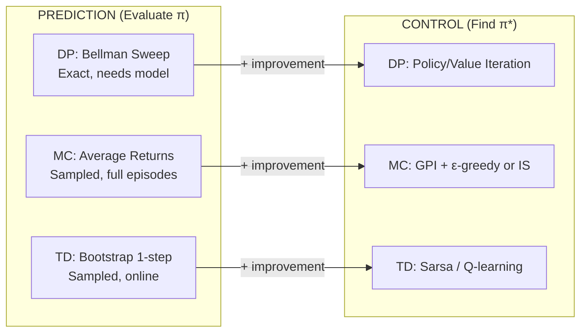

**Why it *feels* less prominent in DP:** DP prediction is computationally trivial — you have the model, so you just iterate the Bellman equation. In MC, prediction alone is non-trivial because:

- You need sufficient samples (exploration problem)
- Off-policy prediction requires importance sampling (variance/bias tradeoffs)
- You're limited to states actually visited

#### On-Policy vs Off-Policy: Why Two Approaches?

**On-Policy GPI Loop:**

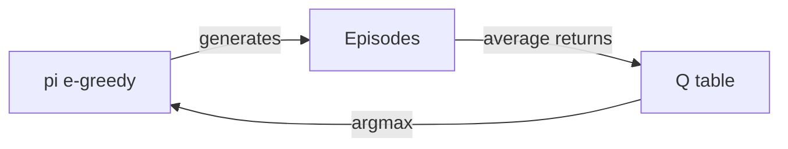

One policy does everything: generates data, gets evaluated, gets improved. Then it generates *new* episodes with the improved version, and the cycle repeats.

**Off-Policy GPI Loop:**

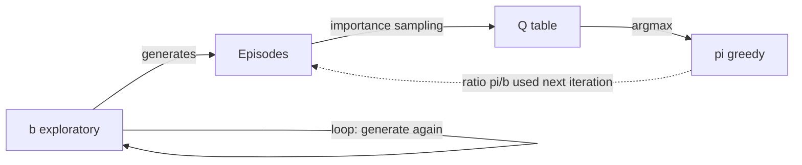

**Both iterate!** The key difference is WHO generates the next round of episodes:

| Iteration step                   | On-Policy                                           | Off-Policy                                       |
| -------------------------------- | --------------------------------------------------- | ------------------------------------------------ |
| **1. Generate episodes**   | Use current π (ε-greedy)                          | Use b (always the same exploratory policy)       |
| **2. Evaluate**            | Average returns → Q_π                             | Importance-sampled returns → Q_π               |
| **3. Improve π**          | π ← argmax Q                                      | π ← argmax Q                                   |
| **4. Loop back to step 1** | π changed → new episodes come from the UPDATED π | b unchanged → new episodes come from the SAME b |

The iteration loop is identical in both. The difference:

- **On-Policy:** When π improves, the *data source changes too* (because π IS the data source). Old episodes are stale.
- **Off-Policy:** When π improves, the *data source stays the same* (b never changes). Old episodes are still valid — only the importance sampling ratio π/b changes because π changed.

> **Why the diagram looks "non-circular" for off-policy:** The improvement of π doesn't feed back into episode generation — b generates episodes regardless of what π is doing. But π still improves iteratively over many episodes. The "iteration" happens through repeated episodes from b, each time updating Q with corrected returns, each time potentially changing which action π considers best.

#### What Actually Happens Inside the b Loop (Iteration by Iteration)

**Setup:** 3-state chain (S₀ → S₁ → S₂ → T). b = uniform random (0.5 Left, 0.5 Right at every state). b is fixed forever — it NEVER changes. π starts as "always go Right" (arbitrary initialization). Q(s,a) = 0 everywhere.

**Iteration 1:** b stumbles and happens to go Right everywhere.

| Step                    | What happens                          | Detail                                                       |
| ----------------------- | ------------------------------------- | ------------------------------------------------------------ |
| b generates episode     | S₀→R→S₁→R→S₂→R→T             | b randomly chose R three times (probability = 0.5³ = 12.5%) |
| Compute returns         | G₀=13, G₁=12, G₂=10                | Working backwards: 10, then 2+10, then 1+12                  |
| Compute ρ at each step | ρ = π(R)/b(R) = 1.0/0.5 = 2.0       | π agrees with every action taken (all R)                    |
| Update Q                | Q(S₂,R)=10, Q(S₁,R)=12, Q(S₀,R)=13 | All steps useful — ρ never hit zero                        |
| Improve π              | π(s) = argmax Q → all R             | No change (was already R)                                    |

**Iteration 2:** b stumbles and goes Left at S₁.

| Step                        | What happens                                            | Detail                                                |
| --------------------------- | ------------------------------------------------------- | ----------------------------------------------------- |
| b generates episode         | S₀→R→S₁→**L**→S₁→R→S₂→R→T             | b randomly chose L at S₁ (probability 0.5)           |
| Process backwards from tail | t=3: S₂→R→T, ρ=2.0                                  | π agrees with R. Update Q(S₂,R).                    |
| Continue backwards          | t=2: S₁→R→S₂, ρ=2.0                                | π agrees with R. Update Q(S₁,R).                    |
| Hit t=1                     | S₁→**L**, ρ = π(L)/b(L) = 0/0.5 = **0** | π would NEVER go Left. STOP.                         |
| Q(S₀,R) updated?           | **NO**                                            | The trajectory from S₀ includes an action π rejects |
| Improve π                  | π(s) = argmax Q → still all R                         | Q(s,L) still 0 everywhere                             |

**Iteration 3:** b stumbles and goes Left at S₀.

| Step                        | What happens                                            | Detail                                  |
| --------------------------- | ------------------------------------------------------- | --------------------------------------- |
| b generates episode         | S₀→**L**→S₀→R→S₁→R→S₂→R→T             | b randomly chose L at the very start    |
| Process backwards from tail | t=4,3,2: update Q(S₂,R), Q(S₁,R), Q(S₀,R)            | All R actions — π agrees, ρ=2.0 each |
| Hit t=0                     | S₀→**L**, ρ = π(L)/b(L) = 0/0.5 = **0** | STOP                                    |
| What got updated?           | Q(S₂,R), Q(S₁,R), Q(S₀,R) from the TAIL              | Steps after the bad action are fine!    |

**Iteration 4:** b goes Left twice in a row.

| Step                | What happens                                                  | Detail                                |
| ------------------- | ------------------------------------------------------------- | ------------------------------------- |
| b generates episode | S₀→**L**→S₀→**L**→S₀→R→S₁→R→S₂→R→T | Two Left actions before getting going |
| Useful updates      | Q(S₂,R), Q(S₁,R), Q(S₀,R) from tail                        | Same as iteration 3 — tail is fine   |
| Wasted steps        | The two L actions at S₀                                      | These tell us nothing about π        |

**Iteration 50:** After many episodes, Q has been updated many times from many tails.

| State | Q(s,L)                    | Q(s,R)              | π(s) |
| ----- | ------------------------- | ------------------- | ----- |
| S₀   | 0 (never useful under π) | ≈13.0 (converging) | R     |
| S₁   | 0 (never useful under π) | ≈12.0 (converging) | R     |
| S₂   | 0 (never useful under π) | ≈10.0 (converging) | R     |

**Summary: What changes vs what stays fixed across iterations**

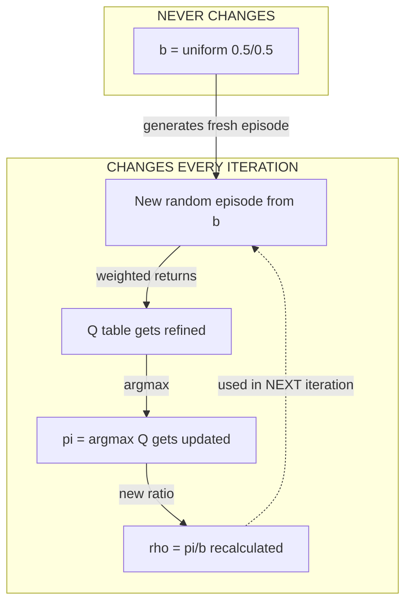

| Component           | Changes across iterations? | Role                                                     |
| ------------------- | -------------------------- | -------------------------------------------------------- |
| **b**         | NEVER                      | Dumb explorer. Keeps generating random episodes forever. |
| **Episodes**  | YES (new each time)        | Each iteration, b produces a fresh random trajectory     |
| **Q(s,a)**    | YES (refined each time)    | Accumulates weighted returns; gets more accurate         |
| **π**        | YES (improved each time)   | = argmax Q. As Q improves, π approaches optimal         |
| **ρ = π/b** | YES (because π changes)   | The numerator π(a\|s) changes as π improves            |

> **The fundamental insight:** b is like a random-walking lab rat in a maze. It generates data by stumbling around — sometimes it stumbles through a useful path, sometimes it doesn't. Over many iterations, enough useful paths accumulate in Q that π converges to optimal. The rat never gets smarter; our *interpretation* of its data gets smarter.

#### Off-Policy = On-Policy with Outsourced Episode Generation

The core GPI loop (Evaluate → Improve → Repeat) is **identical**. The only difference is where episodes come from:

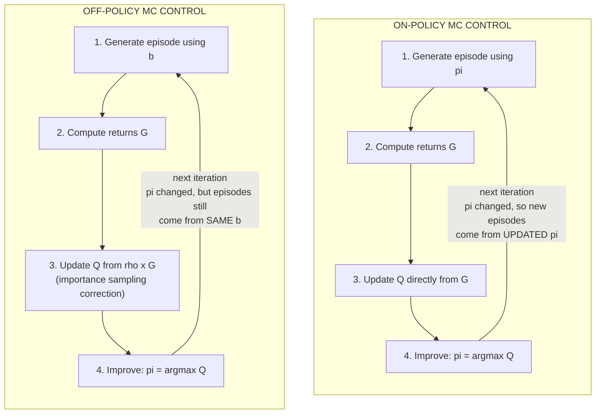

**They are the same algorithm with one substitution:**

| GPI Step              | On-Policy                       | Off-Policy                  | What changed?       |
| --------------------- | ------------------------------- | --------------------------- | ------------------- |
| **1. Generate** | π generates episodes           | b generates episodes        | WHO generates       |
| **2. Returns**  | G computed normally             | G computed normally         | Nothing             |
| **3. Evaluate** | Q ← Q + α[G − Q]             | Q ← Q + α[ρG − Q]       | Added ρ correction |
| **4. Improve**  | π = argmax Q                   | π = argmax Q               | Nothing             |
| **5. Loop**     | Use updated π for next episode | Use same b for next episode | WHO loops           |

The ρ correction in step 3 exists ONLY because episodes came from b instead of π. It mathematically converts "what b experienced" into "what π would have experienced." If b = π, then ρ = 1 everywhere and off-policy reduces exactly to on-policy.

> **Think of it this way:** Off-policy is on-policy where you hired a contractor (b) to do the field work (generate episodes). Since the contractor explores differently than you would, you must apply a correction factor (ρ) to translate their experience into what YOUR experience would have been. The core learning loop — evaluate Q, improve π, repeat — is unchanged.

| Aspect                              | On-Policy                                   | Off-Policy                                            |
| ----------------------------------- | ------------------------------------------- | ----------------------------------------------------- |
| **Who generates data?**       | π itself (must be exploratory)             | Separate behavior policy b                            |
| **Who gets evaluated?**       | The same exploratory π                     | A different target π (can be greedy)                 |
| **Can learn optimal policy?** | No — π must keep ε > 0 for exploration   | Yes — π can be fully deterministic                  |
| **Correction needed?**        | None — data matches policy being evaluated | Importance sampling (ρ = π/b)                       |
| **Variance**                  | Low (no correction)                         | High (ρ products can explode)                        |
| **Data reuse**                | No — old episodes from old π are stale    | Yes — any episode from any b works                   |
| **Real-world analogy**        | Learning to cook by cooking yourself        | Learning a chef's technique by watching cooking shows |

**The fundamental tradeoff:**

|               | On-Policy                                            | Off-Policy                                  |
| ------------- | ---------------------------------------------------- | ------------------------------------------- |
| **Pro** | Simple, stable, low variance                         | Can learn optimal policy; can reuse data    |
| **Con** | Optimal policy unreachable (ε forces suboptimality) | High variance; episodes truncated by ρ = 0 |

#### Choosing and Improving the Behavior Policy b

**How to pick b initially:** The only hard requirement is **coverage** — b(a|s) > 0 for all (s,a) where π(a|s) > 0. Beyond that, it's a practical choice:

| Choice for b                       | Coverage?      | Data quality                  | Variance of ρ             | When to use                      |
| ---------------------------------- | -------------- | ----------------------------- | -------------------------- | -------------------------------- |
| Uniform random                     | Perfect        | Poor (wastes episodes)        | High (ρ products explode) | Simple environments, teaching    |
| ε-greedy with high ε (e.g., 0.5) | Yes            | Moderate                      | Moderate                   | General purpose                  |
| ε-soft version of current Q       | Yes            | Good (follows best knowledge) | Lower                      | Practical implementations        |
| Historical logs from old policy    | Maybe (check!) | Depends on old policy         | Unpredictable              | Industry (reusing existing data) |
| Human demonstrations               | Maybe (check!) | High quality                  | Low (if human ≈ π)       | Robotics, games                  |

**Can b be improved during learning?** In the standard textbook algorithm (§5.7): **No.** b is fixed. But in practice, people do adapt b — and it creates a spectrum:

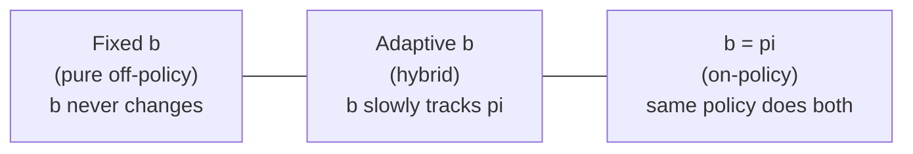

**What happens if you improve b:**

| If you make b... | Effect on ρ                  | Effect on variance          | Effect on coverage                             | You're moving toward...     |
| ---------------- | ----------------------------- | --------------------------- | ---------------------------------------------- | --------------------------- |
| Closer to π     | ρ → 1 (smaller corrections) | Lower (good!)               | Might lose coverage of actions π doesn't take | On-policy                   |
| More random      | ρ stays large                | Higher (bad!)               | Better coverage                                | Pure off-policy             |
| Exactly = π     | ρ = 1 everywhere             | Zero (no correction needed) | Only covers what π does                       | You've reinvented on-policy |

**The paradox of improving b:**

> The better b gets (closer to π), the less you need importance sampling — but you also lose the advantages that made off-policy attractive in the first place (data reuse, learning from external sources). If b = π, off-policy collapses to on-policy with unnecessary extra computation.

**This is precisely why Q-learning (Chapter 6) was a breakthrough:**

| Problem with off-policy MC             | How Q-learning solves it                            |
| -------------------------------------- | --------------------------------------------------- |
| Must choose a good b                   | Any exploratory b works — no careful design needed |
| ρ products explode over long episodes | No importance sampling at all                       |
| Episodes truncated when ρ = 0         | Learns from EVERY step (1-step bootstrap)           |
| Only learns from tails                 | Learns from every (s,a,r,s') transition             |

Q-learning achieves off-policy learning by bootstrapping one step at a time: $Q(s,a) \leftarrow Q(s,a) + \alpha[r + \gamma \max_{a'} Q(s',a') - Q(s,a)]$. The $\max_{a'}$ implicitly evaluates the greedy policy (π) while following any exploratory b — without needing ρ.

---

### 5.4c Complete Numerical Example: Off-Policy MC (Step-by-Step)

#### The Environment: 3-State Chain

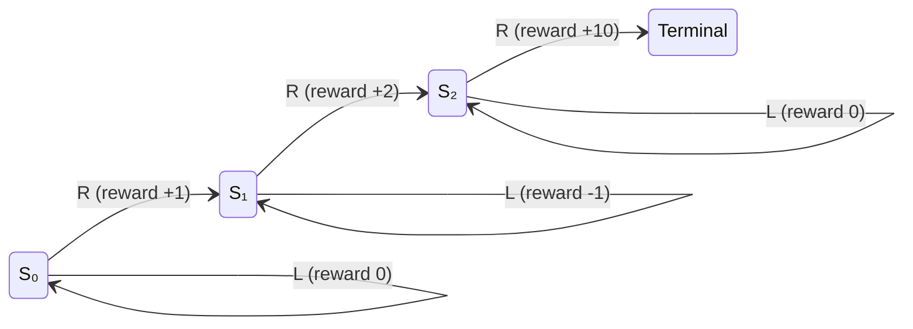

| Property              | Value                                               |
| --------------------- | --------------------------------------------------- |
| **States**      | S₀, S₁, S₂, Terminal                             |
| **Actions**     | L (left), R (right)                                 |
| **Transitions** | R moves forward, L stays in place                   |
| **Rewards**     | R(S₀→S₁) = +1, R(S₁→S₂) = +2, R(S₂→T) = +10 |
| **Discount**    | γ = 1.0 (undiscounted for clarity)                 |

#### The Two Policies

**Target Policy π** (deterministic greedy — the "professional"):

| State | π(L\|s) | π(R\|s) |
| ----- | -------- | -------- |
| S₀   | 0.0      | 1.0      |
| S₁   | 0.0      | 1.0      |
| S₂   | 0.0      | 1.0      |

π always goes Right.

**Behavior Policy b** (exploratory ε-greedy with ε=0.5 — the "beginner"):

| State | b(L\|s) | b(R\|s) |
| ----- | ------- | ------- |
| S₀   | 0.25    | 0.75    |
| S₁   | 0.25    | 0.75    |
| S₂   | 0.25    | 0.75    |

b goes Right 75% of the time, Left 25% (exploring).

**Coverage requirement satisfied:** Wherever $π(a \mid s) > 0$, we need $b(a \mid s) > 0$. Since π only picks R and b(R|s) = 0.75 > 0 ✓

#### Episode Generated by Behavior Policy b

The beginner plays and happens to take these actions:

```
Step 0: State=S₀, Action=R, Reward=+1  → moves to S₁
Step 1: State=S₁, Action=R, Reward=+2  → moves to S₂  
Step 2: State=S₂, Action=R, Reward=+10 → moves to T (terminal)
```

Episode: S₀, R, +1, S₁, R, +2, S₂, R, +10, T

#### Step 1: Compute Returns (Same for On-Policy and Off-Policy)

Working backwards from the terminal state:

```
t=2: G₂ = R₃ = +10
t=1: G₁ = R₂ + γ·G₂ = +2 + 1.0×10 = +12
t=0: G₀ = R₁ + γ·G₁ = +1 + 1.0×12 = +13
```

#### Step 2: Compute Importance Sampling Ratios

At each step, ask: "How much more likely would the professional do this vs the beginner?"

```
                    π(Aₜ|Sₜ)
Step t:  ρₜ = ─────────────
                    b(Aₜ|Sₜ)

Step 0:  ρ₀ = π(R|S₀) / b(R|S₀) = 1.0 / 0.75 = 1.333
Step 1:  ρ₁ = π(R|S₁) / b(R|S₁) = 1.0 / 0.75 = 1.333
Step 2:  ρ₂ = π(R|S₂) / b(R|S₂) = 1.0 / 0.75 = 1.333
```

**Cumulative products** (for weighting the full return from each time step):

```
ρ₀:₂ = ρ₀ × ρ₁ × ρ₂ = 1.333 × 1.333 × 1.333 = 2.370
ρ₁:₂ = ρ₁ × ρ₂ = 1.333 × 1.333 = 1.778
ρ₂:₂ = ρ₂ = 1.333
```

**Interpretation:** The professional is 2.37× more likely to produce this *exact trajectory* than the beginner. Why? Because the beginner only goes R with probability 0.75 at each step, while the professional always goes R. Over 3 steps: (1/0.75)³ = 2.37.

#### Step 3: Update Q-Values

**On-Policy Update** (if we were evaluating b itself):

$$
Q(S_0, R) \leftarrow Q(S_0, R) + \alpha[G_0 - Q(S_0, R)]
$$

$$
Q(S_0, R) \leftarrow 0 + 0.1[13 - 0] = 1.3
$$

**Off-Policy Update** (evaluating π using data from b):

Using Ordinary Importance Sampling:

$$
Q(S_0, R) \leftarrow Q(S_0, R) + \alpha[\rho_{0:2} \cdot G_0 - Q(S_0, R)]
$$

$$
Q(S_0, R) \leftarrow 0 + 0.1[2.370 \times 13 - 0] = 0.1 \times 30.81 = 3.081
$$

Using Weighted Importance Sampling (incremental):

$$
C(S_0, R) \leftarrow C(S_0, R) + \rho_{0:2} = 0 + 2.370 = 2.370
$$

$$
Q(S_0, R) \leftarrow Q(S_0, R) + \frac{\rho_{0:2}}{C(S_0, R)}[G_0 - Q(S_0, R)]
$$

$$
Q(S_0, R) \leftarrow 0 + \frac{2.370}{2.370}[13 - 0] = 13.0
$$

#### Full Computation Table

| Time | State | Action | Reward | Return G | ρₜ  | Cumulative ρ | On-policy ΔQ | Off-policy (OIS) ΔQ    |
| ---- | ----- | ------ | ------ | -------- | ----- | ------------- | ------------- | ----------------------- |
| t=2  | S₂   | R      | +10    | 10       | 1.333 | 1.333         | α·10 = 1.0  | α·(1.333×10) = 1.333 |
| t=1  | S₁   | R      | +2     | 12       | 1.333 | 1.778         | α·12 = 1.2  | α·(1.778×12) = 2.133 |
| t=0  | S₀   | R      | +1     | 13       | 1.333 | 2.370         | α·13 = 1.3  | α·(2.370×13) = 3.081 |

#### What If the Beginner Took a "Wrong" Action?

Now suppose the episode was:

```
Step 0: State=S₀, Action=R, Reward=+1  → moves to S₁
Step 1: State=S₁, Action=L, Reward=-1  → stays at S₁ (bad move!)
Step 2: State=S₁, Action=R, Reward=+2  → moves to S₂
Step 3: State=S₂, Action=R, Reward=+10 → moves to T
```

Now at Step 1, the beginner went **Left**, but π would *never* go Left:

```
ρ₁ = π(L|S₁) / b(L|S₁) = 0.0 / 0.25 = 0
```

**The cumulative ratio ρ₀:₃ = ρ₀ × ρ₁ × ρ₂ × ρ₃ = 1.333 × 0 × ... = 0**

The entire return from t=0 gets **zeroed out**. We learn NOTHING about Q(S₀, R) from this episode.

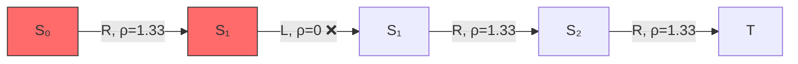

> **Zero-Ratio Truncation:** From S₀'s perspective, this episode is irrelevant to π — the professional would NEVER take action L at S₁, so the trajectory tells us nothing about how π would perform from S₀.
>
> **However!** From S₂'s perspective: t=3 happened *after* the bad action. Processing backwards: ρ₃ = 1.333, G₃ = 10 → We CAN still update Q(S₂, R).
>
> **This is why off-policy MC processes episodes BACKWARDS** — it learns from tails of episodes even when prefixes contain actions π rejects.

#### The Off-Policy MC Control Algorithm (Complete Walkthrough)

Let's trace through 2 full iterations of off-policy MC control:

**Initialization:**

- Q(s,a) = 0 for all (s,a)
- C(s,a) = 0 for all (s,a)
- π(s) = arbitrary (say, all R)
- b = uniform random: b(L|s) = b(R|s) = 0.5

**Episode 1** (generated by b): S₀→R→S₁→R→S₂→R→T, rewards: +1, +2, +10

Processing backwards (weighted IS):

```
t=2: G = 10
     ρ₂ = π(R|S₂)/b(R|S₂) = 1.0/0.5 = 2.0
     C(S₂,R) = 0 + 2.0 = 2.0
     Q(S₂,R) = 0 + (2.0/2.0)(10 - 0) = 10.0
     π(S₂) = argmax[Q(S₂,L)=0, Q(S₂,R)=10] = R ✓ (unchanged)
     Check: A₂=R = π(S₂)=R → continue ✓

t=1: G = 2 + 1.0×10 = 12
     ρ₁ = π(R|S₁)/b(R|S₁) = 1.0/0.5 = 2.0
     W = ρ₂ × ρ₁ = 2.0 × 2.0 = 4.0  (cumulative weight for this step)
     C(S₁,R) = 0 + 4.0 = 4.0
     Q(S₁,R) = 0 + (4.0/4.0)(12 - 0) = 12.0
     π(S₁) = argmax[Q(S₁,L)=0, Q(S₁,R)=12] = R ✓
     Check: A₁=R = π(S₁)=R → continue ✓

t=0: G = 1 + 1.0×12 = 13
     ρ₀ = π(R|S₀)/b(R|S₀) = 1.0/0.5 = 2.0
     W = W × ρ₀ = 4.0 × 2.0 = 8.0
     C(S₀,R) = 0 + 8.0 = 8.0
     Q(S₀,R) = 0 + (8.0/8.0)(13 - 0) = 13.0
     π(S₀) = argmax[Q(S₀,L)=0, Q(S₀,R)=13] = R ✓
     Check: A₀=R = π(S₀)=R → continue ✓
```

**After Episode 1:**

| State | Q(s,L) | Q(s,R) | π(s) |
| ----- | ------ | ------ | ----- |
| S₀   | 0      | 13.0   | R     |
| S₁   | 0      | 12.0   | R     |
| S₂   | 0      | 10.0   | R     |

**Episode 2** (generated by b): S₀→R→S₁→**L**→S₁→R→S₂→R→T, rewards: +1, -1, +2, +10

Processing backwards:

```
t=3: G = 10
     ρ₃ = π(R|S₂)/b(R|S₂) = 1.0/0.5 = 2.0
     C(S₂,R) = 2.0 + 2.0 = 4.0
     Q(S₂,R) = 10.0 + (2.0/4.0)(10 - 10.0) = 10.0 (no change, same return)
     Check: A₃=R = π(S₂)=R → continue ✓

t=2: G = 2 + 10 = 12
     ρ₂ = π(R|S₁)/b(R|S₁) = 1.0/0.5 = 2.0
     W = 2.0 × 2.0 = 4.0
     C(S₁,R) = 4.0 + 4.0 = 8.0
     Q(S₁,R) = 12.0 + (4.0/8.0)(12 - 12.0) = 12.0 (no change)
     Check: A₂=R = π(S₁)=R → continue ✓

t=1: G = -1 + 12 = 11
     Action taken: A₁ = L
     ρ₁ = π(L|S₁)/b(L|S₁) = 0.0/0.5 = 0  ← ZERO!
   
     ╔══════════════════════════════════════════════════╗
     ║  STOP PROCESSING! ρ = 0 means π would never      ║
     ║  take action L here. This episode is useless     ║
     ║  for Q(S₁,L) under π (π never goes Left).        ║
     ║  We also CANNOT update Q(S₀,R) from this         ║
     ║  episode — the trajectory from S₀ onward         ║
     ║  includes an action π rejects.                   ║
     ╚══════════════════════════════════════════════════╝
   
     EXIT inner loop. Move to next episode.
```

**After Episode 2:** Same Q-table as after Episode 1. The "wrong" action at t=1 prevented learning about earlier states. But we *did* update Q(S₂,R) and Q(S₁,R) from the tail of the episode.

#### Why ρ = 0 Makes Intuitive Sense

> **Chess Analogy:** You want to know how a chess *master* would perform. You watch a *beginner* play. At move 15, the beginner blunders (queen to a terrible square). The master would NEVER make that move (π(blunder) = 0).
>
> Everything that happened AFTER the blunder is in a game state the master would never reach from this opening. The final score tells us NOTHING about the master's performance from move 1.
>
> But — if you look at just the ENDGAME (after the blunder), the beginner might play reasonable moves the master would also play. Those tail segments are still informative for evaluating individual positions.

#### Summary: Off-Policy MC's Tradeoff

|   | Advantages                                               | Disadvantages                                        |
| - | -------------------------------------------------------- | ---------------------------------------------------- |
| 1 | Can learn optimal (greedy) policy while exploring freely | High variance from importance sampling products      |
| 2 | Can reuse data from any source (old logs, humans, etc.)  | Episodes truncated when b takes actions π wouldn't  |
| 3 | Separates exploration from exploitation completely       | Only learns from "tails" of episodes (slow learning) |
| 4 | —                                                       | Longer episodes → exponentially growing ρ products |

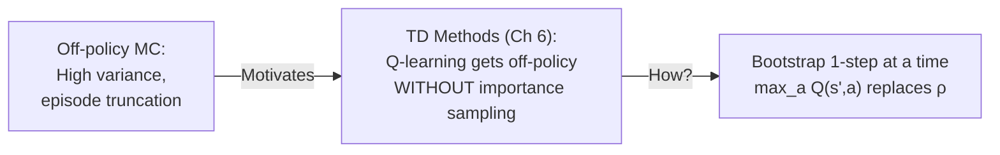

---

### 5.5 Off-policy Prediction via Importance Sampling

How can we learn about a **target policy** $\pi$ while following a different **behavior policy** $b$? This is **off-policy learning**.

Think of it as: You want to know how a Professional ($\pi$) would play, but your only data is from a Beginner ($b$).

> **Pro-Tip: Knowing vs. Estimating $b$**
> You do **not** estimate the behavior policy $b$ from the episodes. You must **define** it (e.g., as a uniform random policy). To calculate the ratio $\rho$, you need to know the **exact probability** $b(a|s)$ used to generate the data. If you don't know the exact math of the beginner, you cannot accurately estimate the professional.

#### 1. The Importance Sampling Ratio ($\rho$)

When the beginner ($b$) takes an action, we ask: *"How much more (or less) likely was the professional to take that same action?"*

$$
\rho = \frac{\pi(a|s)}{b(a|s)}
$$

For a whole episode (from time $t$ to $T$), we multiply the ratios of every action taken. The Capital Pi ($\Pi$) symbol represents a **product**:

$$
\rho_{t:T-1} \doteq \prod_{k=t}^{T-1} \frac{\pi(A_k|S_k)}{b(A_k|S_k)}
$$

**Expanded Series Form:**

$$
\rho_{t:T-1} = \frac{\pi(A_t|S_t)}{b(A_t|S_t)} \times \frac{\pi(A_{t+1}|S_{t+1})}{b(A_{t+1}|S_{t+1})} \times \dots \times \frac{\pi(A_{T-1}|S_{T-1})}{b(A_{T-1}|S_{T-1})}
$$

#### 2. Ordinary Importance Sampling (OIS)

We multiply each observed return ($G_t$) by its ratio ($\rho$) and take the standard average over $n$ episodes:

$$
V(s) = \frac{\sum_{t \in \mathcal{T}(s)} \rho_{t:T(t)-1} G_t}{|\mathcal{T}(s)|}
$$

- **Property:** Unbiased, but has **extreme/infinite variance**. A single unlikely action can blow up the ratio and make the estimate unstable.

#### 3. Weighted Importance Sampling (WIS)

Instead of dividing by the number of episodes, we divide by the **sum of the ratios**:

$$
V(s) = \frac{\sum_{t \in \mathcal{T}(s)} \rho_{t:T(t)-1} G_t}{\sum_{t \in \mathcal{T}(s)} \rho_{t:T(t)-1}}
$$

- **Property:** Biased (initially), but has **much lower variance**. It is the practical choice for most RL applications.

| Feature                | Ordinary (OIS) | Weighted (WIS)                  |
| :--------------------- | :------------- | :------------------------------ |
| **Bias**         | Unbiased       | Biased (converges to zero bias) |
| **Variance**     | High/Infinite  | Lower/Stable                    |
| **Practicality** | Low            | High                            |

#### Worked Numerical Example: OIS in Action

For a concrete step-by-step numerical demonstration of ordinary importance sampling applied to a 3-state episode, see the **[On-Policy vs Off-Policy MC Worked Solution](./assets/mc-on-off-policy-solution.html)**. It shows exactly how ρ is computed at each time step, how cumulative ρ products amplify returns, and why off-policy estimates differ from on-policy estimates — with full computation tables.

For an interactive version where you can step through the computation one click at a time (toggling between on-policy and off-policy modes), see the **[Interactive MC App](./assets/mc-interactive.html)**.

#### Example 5.5: Infinite Variance

Ordinary importance sampling can have **infinite variance**. If the importance-sampling ratio has a mean greater than 1, its variance can grow without bound.

```python
# From assets/infinite_variance.py
# Visualizes the extreme fluctuations of Ordinary IS in Example 5.5
```

### 5.6 Incremental Implementation

Weighted importance sampling can be implemented incrementally:

$$
W_{n+1} \doteq W_n + \rho_n
$$

$$
V_{n+1} \doteq V_n + \frac{\rho_n}{C_n} [G_n - V_n]
$$

Where $C_n$ is the cumulative sum of weights.

### Worked Example: On-Policy vs Off-Policy MC (Step-by-Step)

To solidify the difference between on-policy and off-policy MC, the following worked solution walks through a complete numerical example where the same episode is processed using both methods side-by-side.

**Problem Setup:** An agent navigates S₀ → S₁ → S₂ → S_T under a behavior policy b (ε-greedy, ε=0.4). We compute Q-value updates using:

1. **On-Policy MC** (constant-α, first-visit) — evaluates the behavior policy b itself
2. **Off-Policy MC** (ordinary importance sampling) — evaluates a deterministic target policy π using data from b

The solution shows:

- How returns G are computed backwards from terminal (same for both methods)
- How on-policy directly uses G in the update: $Q \leftarrow Q + \alpha[G - Q]$
- How off-policy multiplies G by the importance sampling ratio ρ: $Q \leftarrow Q + \alpha[\rho \cdot G - Q]$
- Why off-policy values are higher (ρ > 1 amplifies returns when π is more deterministic than b)
- The variance problem: ρ products grow exponentially with episode length

**[View Full Worked Solution (HTML)](./assets/mc-on-off-policy-solution.html)** — Detailed tables showing every computation step with color-coded on-policy (green) and off-policy (orange) sections.

**[Interactive Step-Through App](./assets/mc-interactive.html)** — A JavaScript application where you can:

- Toggle between On-Policy and Off-Policy modes
- Click "Next Step" to advance through the computation one step at a time
- Watch the agent move through states and see which Q-value gets updated
- In off-policy mode, see importance sampling ratios ρ revealed progressively and how they amplify returns
- Compare how both methods produce different Q-values from the same episode

> **Key Takeaway from the Worked Example:**
>
> - On-policy Q(S₀, R) = 3.875 — estimates value under behavior policy (includes exploration cost)
> - Off-policy Q(S₀, R) = 7.568 — estimates value under target policy (no exploration, hence higher)
> - The difference (95% higher for off-policy) comes entirely from ρ₀:₂ = 1.953, which nearly doubles the return because π would always choose these actions while b only does so 80% of the time.

### Code Examples

1. Monte Carlo On-policy Prediction (First-visit and Every-visit) - [code-base-mc-on-policy](./assets/mc_gpi_pedagogy.ipynb)
2. Monte Carlo Off-policy Prediction (Ordinary and Weighted IS) - [code-base-mc-off-policy](./assets/mc_off_policy_pedagogy.ipynb)
3. Monte Carlo Off-policy Control (Weighted IS) - [code-base-mc-off-policy-control](./assets/mc_off_policy_control_pedagogy.ipynb)

### 5.7 Off-policy Monte Carlo Control

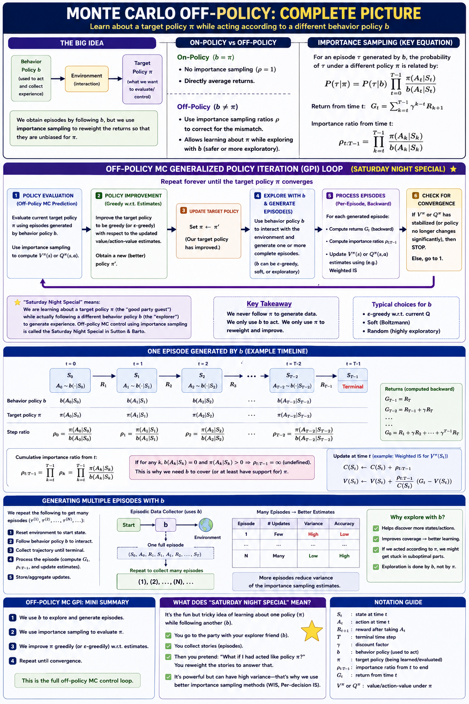
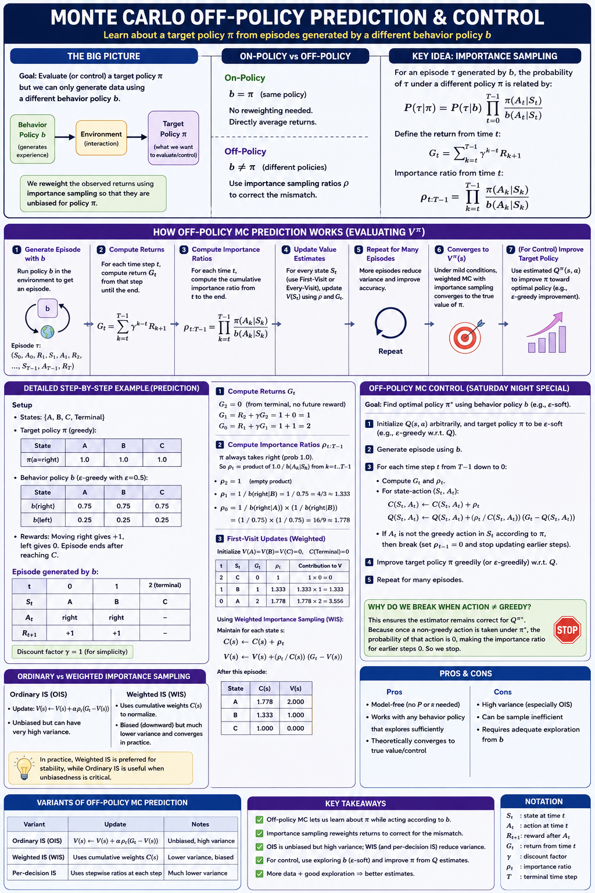
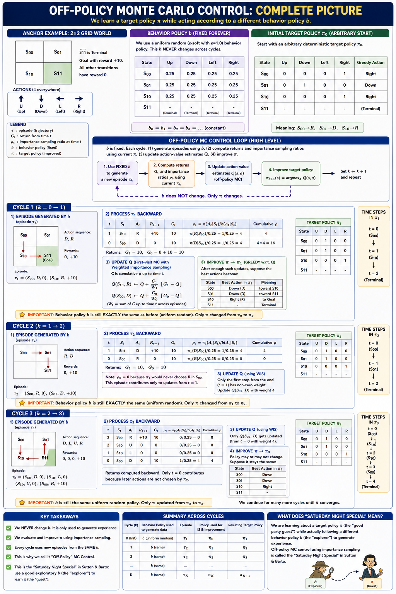

Uses the behavior policy to generate episodes and the target policy (greedy) for learning.

#### Detailed Process Flow (From Scratch)

The goal is to learn the optimal policy $\pi^*$ while following an exploratory behavior policy $b$. Here is exactly what happens in every iteration:

1. **Initialize**:

   * **Target Policy ($\pi$):** The greedy policy we want to optimize.
   * **Behavior Policy ($b$):** A stochastic policy (e.g., uniform random) used to generate data.
   * **$Q(s, a)$ & $C(s, a)$**: Action-values and cumulative weights (for weighted averaging).
2. **Generate Experience**:

   * The agent plays a **full episode** using the behavior policy $b$.
   * It records the sequence: $S_0, A_0, R_1, S_1, A_1, R_2 \dots S_T$.
3. **Process Backwards (The Learning Phase)**:

   * Start from the end of the episode and move toward the beginning.
   * For each step $t$:
     * Calculate the **Return ($G$)** from that point forward.
     * Calculate the **Importance Sampling Ratio ($\rho$)**: How much more likely was the Target $\pi$ to take action $A_t$ compared to Behavior $b$?
     * Update the **Cumulative Weight ($C$)**: $C \leftarrow C + \rho$.
     * Update **$Q(s, a)$**: Use the ratio to weight the return. $Q \leftarrow Q + \frac{\rho}{C}[G - Q]$.
     * **Policy Improvement**: Update $\pi(s) = \arg\max_a Q(s, a)$.
     * **Convergence Check**: If the action taken by the beginner ($A_t$) is **not** the action the professional ($\pi$) would take, stop learning from this episode (the ratio becomes zero).

#### Visual Process Flow: Off-Policy MC

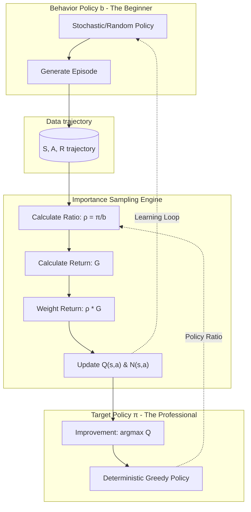

- **Limitation:** It only learns from the *tails* of episodes—after the behavior policy takes an action that the target policy would not have taken, the importance-sampling ratio becomes zero.
- **Limitation:** It only learns from the *tails* of episodes—after the behavior policy takes an action that the target policy would not have taken, the importance-sampling ratio becomes zero.

### 5.8 \*Discounting-aware Importance Sampling

Standard IS treats the return $G_t$ as a single unit. However, if $\gamma < 1$, the return is composed of discounted rewards. This section discusses how to decompose the ratio to reduce variance by acknowledging that future rewards are less affected by earlier actions.

### 5.9 *Per-decision Importance Sampling

Further refines IS by applying the ratio only to the rewards that actually depend on the actions taken at that time:

$$
\mathbb{E}[\rho_{t:T-1} G_t] = \mathbb{E} \left[ \sum_{k=t}^{T-1} \rho_{t:k} R_{k+1} \right]
$$

---

### Comparison of Off-Policy MC Methods

All off-policy MC methods share the same goal: estimate $Q^\pi$ (value under target policy $\pi$) using data generated by a different behavior policy $b$. They differ in **how** they weight and combine the returns.

#### The Core Problem

The behavior policy $b$ generates episodes, but we want $Q^\pi$. The correction factor is the importance sampling ratio:

$$
\rho_{t:T-1} = \prod_{k=t}^{T-1} \frac{\pi(A_k \mid S_k)}{b(A_k \mid S_k)}
$$

This ratio can be extremely large (product of many terms > 1) or extremely small, causing high variance. Each method below addresses this variance problem differently.

#### Method Comparison Table

| Method                                 | Formula                                                                          | Unbiased?               | Variance                | Key Idea                                                                        |
| -------------------------------------- | -------------------------------------------------------------------------------- | ----------------------- | ----------------------- | ------------------------------------------------------------------------------- |
| **Ordinary IS** (§5.5)          | Q = (1/N) Σ ρᵢGᵢ                                                             | Yes                     | Highest                 | Simple average of ρ×G. Full cumulative ρ multiplies entire return.           |
| **Weighted IS** (§5.5)          | Q = Σ(ρᵢGᵢ) / Σ(ρᵢ)                                                       | No (biased, consistent) | Low                     | Self-normalizing: divides by Σρ instead of N. Extreme ρ values cancel out.   |
| **Incremental WIS** (§5.6)      | Qₙ₊₁ = Qₙ + (ρₙ/Cₙ)(Gₙ − Qₙ), Cₙ = Cₙ₋₁ + ρₙ                     | No (same as WIS)        | Low                     | Online version of WIS. O(1) memory per (s,a). Same final result.                |
| **Per-Decision IS** (§5.9)      | Ĝₜ = Σₖ γ^(k−t) · ρₜ:ₖ · Rₖ₊₁                                      | Yes                     | Medium                  | Each reward Rₖ₊₁ multiplied by ρ only up to step k (not full trajectory).   |
| **Discounting-Aware IS** (§5.8) | γ-weighted mixture of n-step flat partials, each with truncated ρₜ:ₜ₊ₙ₋₁ | Yes                     | Lowest (among unbiased) | Treats γ as termination probability. Shorter partials use shorter ρ products. |

#### Why Each Method Exists — The Variance Reduction Chain

```
High Variance ──────────────────────────────────────────── Low Variance

 Ordinary IS   →   Per-Decision IS   →   Discounting-Aware IS
 (full ρ on       (each rₖ gets         (γ limits how far
  entire G)        only ρ up to k)       ρ needs to extend)

                   Weighted IS  ≈  Incremental WIS
                   (self-normalizing denominator,
                    biased but bounded)
```

#### Detailed Rationale

**1. Ordinary IS → Per-Decision IS (remove unnecessary ρ factors)**

The standard OIS formula applies $\rho\_{t:T-1}$ to the entire return $G\_t = R\_{t+1} + \gamma R\_{t+2} + \ldots$. But reward $R\_{k+1}$ only depends on actions up to time $k$ — future actions at $k+1, k+2, \ldots$ are irrelevant to it. The extra $\rho\_{k+1:T-1}$ factors have expectation 1 but add noise.

Per-Decision removes them: each $R\_{k+1}$ is weighted by $\rho\_{t:k}$ only.

$$
\text{OIS: } \rho\_{t:T-1} \times G\_t \quad \longrightarrow \quad \text{PDIS: } \sum\_{k=t}^{T-1} \gamma^{k-t} \rho\_{t:k} R\_{k+1}
$$

*Result:* Same expected value, strictly lower variance.

**2. Per-Decision IS → Discounting-Aware IS (exploit γ < 1)**

Even in PDIS, the reward $R\_T$ (last step) still gets the full product $\rho\_{t:T-2}$. But when $\gamma < 1$, that reward is heavily discounted anyway ($\gamma^{T-t-1}$ is small). The large $\rho$ product contributes high variance for a near-zero contribution.

Discounting-Aware IS treats the return as a $\gamma$-weighted mixture of partial returns of lengths 1, 2, ..., $H$:

- The 1-step partial uses only $\rho\_{t:t}$ (1 ratio)
- The 2-step partial uses $\rho\_{t:t+1}$ (2 ratios)
- Each weighted by $(1-\gamma)\gamma^{n-1}$ (short partials get more weight)

*Result:* Shorter $\rho$ products dominate, further reducing variance.

**3. Ordinary IS → Weighted IS (trade bias for bounded variance)**

OIS is unbiased but can produce extreme estimates (e.g., $\rho = 50$, making one episode dominate). WIS divides by $\Sigma\rho$ instead of $N$:

- With $N=1$: WIS gives exactly $G$ (the $\rho$ cancels). OIS gives $\rho \times G$.
- The estimates are bounded: WIS cannot exceed the range of observed $G$ values.
- Bias vanishes as $N \to \infty$ (consistent estimator).

In practice, WIS is almost always preferred over OIS because the variance reduction far outweighs the small-sample bias.

**4. Weighted IS → Incremental WIS (computational efficiency)**

Mathematically identical to WIS. The incremental form avoids storing all episodes:

- Maintain running $C$ (cumulative weight sum) and $Q$ per (s,a)
- After each episode: $C \leftarrow C + \rho$, $Q \leftarrow Q + \frac{\rho}{C}(G - Q)$
- The "learning rate" $\frac{\rho}{C}$ naturally decreases as more data arrives

This is what actual implementations use (Sutton & Barto Algorithm box, §5.6).

#### When to Use Which

| Situation                | Recommended Method             | Reason                                        |
| ------------------------ | ------------------------------ | --------------------------------------------- |
| General practice         | **Incremental WIS**      | Low variance, O(1) memory, well-behaved       |
| Need strict unbiasedness | **Per-Decision IS**      | Unbiased + lower variance than OIS            |
| Long episodes + γ < 1   | **Discounting-Aware IS** | Prevents ρ explosion for distant rewards     |
| Simple analysis/teaching | **Ordinary IS**          | Easiest to understand and prove convergence   |
| Single episode, N=1      | **Weighted IS**          | Returns just G (ignores unreliable single ρ) |

#### Numerical Example (same episode, different estimates)

Episode: S₀ →(a₁, r=−1)→ S₁ →(a₂, r=+10)→ T, with γ=0.9

G₀ = −1 + 0.9 × 10 = 8.0, and ρ₀:₁ = 2.4, ρ₀:₀ = 1.5, ρ₁:₁ = 1.6

| Method                      | Computation                                                         | Estimate for Q(S₀, a₁) |
| --------------------------- | ------------------------------------------------------------------- | ------------------------ |
| **OIS**               | ρ₀:₁ × G₀ = 2.4 × 8                                           | **19.2**           |
| **WIS** (N=1)         | ρG / ρ = G                                                        | **8.0**            |
| **Per-Decision**      | ρ₀:₀ × r₁ + γ × ρ₀:₁ × r₂ = 1.5(−1) + 0.9 × 2.4(10)   | **20.1**           |
| **Discounting-Aware** | (1−γ)ρ₀:₀ G̅₀:₁ + γ ρ₀:₁ G̅₀:₂ where G̅ = flat sums | **19.29**          |

> **Key Takeaway:** All methods are estimating the same quantity ($Q^\pi$). With infinite data, they all converge to the same answer. The choice is about *finite-sample behavior*: how much variance (noise) vs. bias you're willing to tolerate.

**Working Code implementation for Monte Carlo**

[https://nbviewer.org/github/samratkar/drl/blob/main/barto-sutton-notes/lecture4-montecarlo/assets/mc_gpi_pedagogy.ipynb]()

# Chapter 6: Temporal-Difference Learning

Temporal-Difference (TD) learning is a combination of MC and DP. Like MC, it learns from experience. Like DP, it **bootstraps**—updates estimates based on other estimates.

### 6.1 TD Prediction

The simplest TD method, **TD(0)**, updates the value of a state based on the immediate reward and the estimated value of the next state:

$$
V(S_t) \leftarrow V(S_t) + \alpha [R_{t+1} + \gamma V(S_{t+1}) - V(S_t)]
$$

**Backup Diagram for TD(0):**

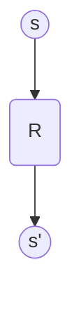

### 6.2 Advantages of TD Prediction Methods

1. **Online learning:** Updates happen after each step, not just at the end of an episode.
2. **No model needed:** Just like MC.
3. **Efficiency:** TD often converges faster than MC on Markovian tasks.

### 6.3 Optimality of TD(0)

If we have a fixed set of experience (Batch Training), TD(0) converges to the **Certainty-Equivalence estimate**—the estimate that would be correct if the observed transitions were the true dynamics.

- **Example 6.4:** Random Walk batch results (Figure 6.2) show TD(0) outperforming MC.

```python
# From assets/batch_learning.py
# Implements Batch TD vs Batch MC for Figure 6.2
```

### 6.4 Sarsa: On-policy TD Control

Updates the action-value function based on the actions actually taken by the current policy (S, A, R, S', A'):

$$
Q(S_t, A_t) \leftarrow Q(S_t, A_t) + \alpha [R_{t+1} + \gamma Q(S_{t+1}, A_{t+1}) - Q(S_t, A_t)]
$$

### 6.5 Q-learning: Off-policy TD Control

One of the most important breakthroughs in RL. It learns the optimal action-value function $q_*$ directly, independent of the policy being followed:

$$
Q(S_t, A_t) \leftarrow Q(S_t, A_t) + \alpha [R_{t+1} + \gamma \max_a Q(S_{t+1}, a) - Q(S_t, A_t)]
$$

#### Example 6.6: Cliff Walking

Contrasts Sarsa (safe path) vs Q-learning (optimal but risky path). Sarsa accounts for the exploration it *actually* does, whereas Q-learning assumes it will eventually act optimally.

### 6.6 Expected Sarsa

Instead of using a sample action $A_{t+1}$, it uses the expected value over all actions under the current policy:

$$
Q(S_t, A_t) \leftarrow Q(S_t, A_t) + \alpha [R_{t+1} + \gamma \sum_a \pi(a\mid S_{t+1}) Q(S_{t+1}, a) - Q(S_t, A_t)]
$$

### 6.7 Maximization Bias and Double Learning

Algorithms that use a $\max$ (like Q-learning) or a greedy policy (like Sarsa) are subject to **Maximization Bias**—overestimating values due to taking the maximum over noisy estimates.

- **Solution:** Use two independent estimates ($Q_1$ and $Q_2$). Use one to pick the action and the other to estimate its value.

```python
# From assets/maximization_bias.py
# Double Q-learning vs Q-learning (Figure 6.5)
```

### 6.8 Games, Afterstates, and Other Special Cases

In many games (like Tic-Tac-Toe), many state-action pairs lead to the same result (the same board position). These are called **Afterstates**. Learning values for afterstates is more efficient because it generalizes across different actions that lead to the same configuration.

---

## Practice Exercises

Test your understanding of Monte Carlo and TD methods with these exercises:

- [Multiple Choice Questions (MCQs)](./assets/questions/mcqs.md)
- [Subjective Questions](./assets/questions/subjective.md)
- [Numerical Questions](./assets/questions/numericals.md)
- [Programming Questions](./assets/questions/programming.md)

*Solutions can be found in the [assets/questions/solutions/](./assets/questions/solutions/) folder.*

---

*Reference: Sutton, R. S., & Barto, A. G. (2018). Reinforcement Learning: An Introduction. MIT Press.*
