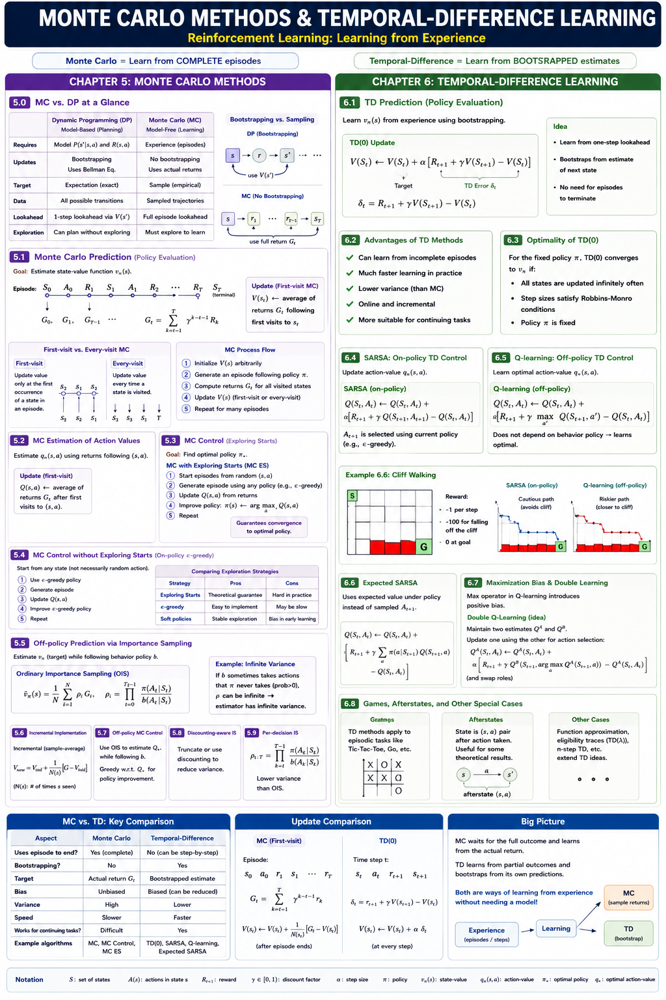
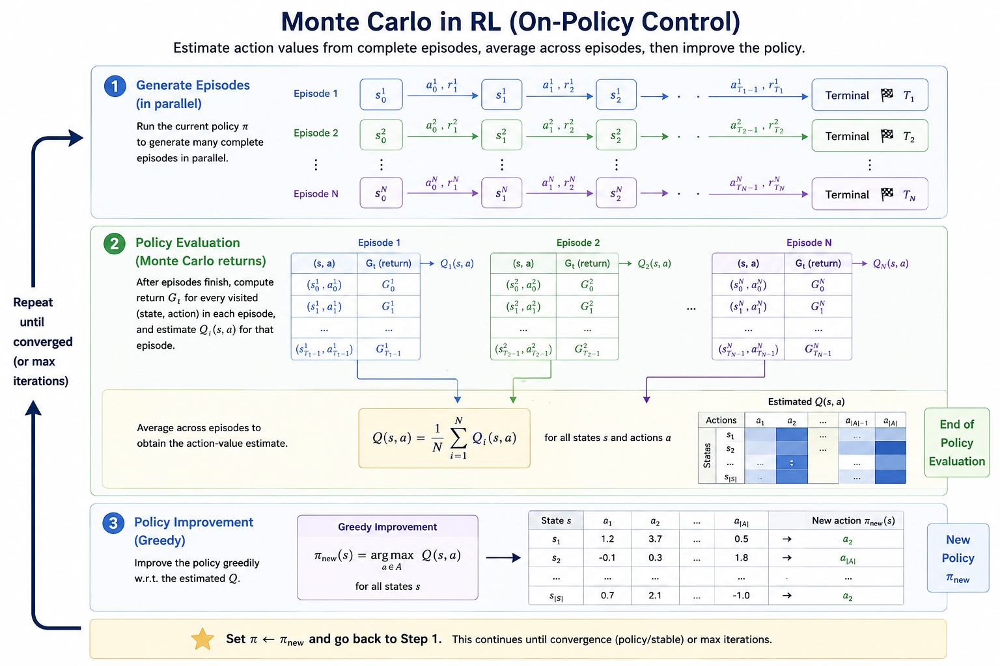
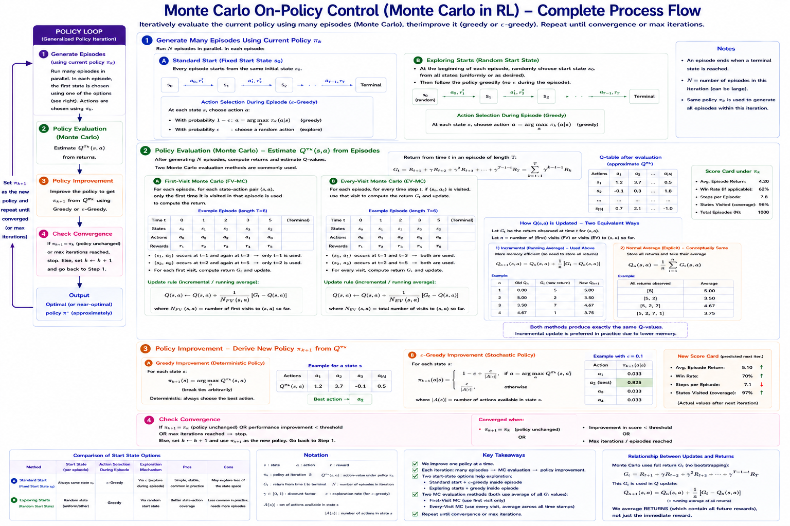
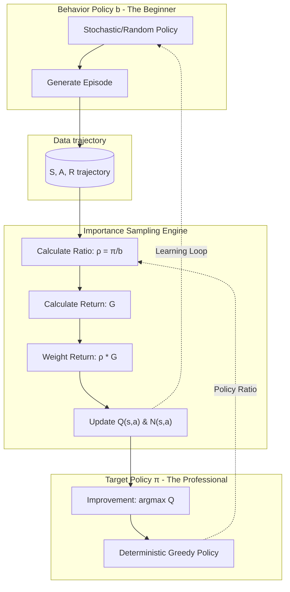
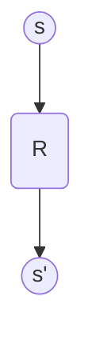

# Lecture 4: Monte Carlo Methods & Temporal-Difference Learning
**Reference:** Sutton & Barto, Chapters 5 & 6 (2nd Edition)

---

## Table of Contents
- [Lecture 4: Monte Carlo Methods \& Temporal-Difference Learning](#lecture-4-monte-carlo-methods--temporal-difference-learning)
  - [Table of Contents](#table-of-contents)
- [Lecture Map](#lecture-map)
- [Chapter 5: Monte Carlo Methods](#chapter-5-monte-carlo-methods)
  - [5.0 Deep Dive: Monte Carlo vs. Dynamic Programming](#50-deep-dive-monte-carlo-vs-dynamic-programming)
    - [1. The Model Requirement (Model-Free vs. Model-Based)](#1-the-model-requirement-model-free-vs-model-based)
      - [Concrete Example: What does a "Model" look like?](#concrete-example-what-does-a-model-look-like)
    - [2. Bootstrapping vs. Sampling](#2-bootstrapping-vs-sampling)
    - [3. The "Lookahead" Logic](#3-the-lookahead-logic)
    - [4. The Exploration Challenge](#4-the-exploration-challenge)
    - [5. Does MC use the Bellman Equation?](#5-does-mc-use-the-bellman-equation)
    - [Comparison Summary](#comparison-summary)
    - [5.1 Monte Carlo Prediction](#51-monte-carlo-prediction)
      - [First-visit vs. Every-visit MC](#first-visit-vs-every-visit-mc)
      - [Incremental (Rolling) Average](#incremental-rolling-average)
      - [The Process flow of MC](#the-process-flow-of-mc)
      - [Two variants of policy evaluation and improvement](#two-variants-of-policy-evaluation-and-improvement)
      - [Two variants of Q(s,a) updates within an episode](#two-variants-of-qsa-updates-within-an-episode)
      - [Example 5.1: Blackjack](#example-51-blackjack)
    - [5.2 Monte Carlo Estimation of Action Values](#52-monte-carlo-estimation-of-action-values)
    - [5.3 Monte Carlo Control](#53-monte-carlo-control)
      - [Monte Carlo with Exploring Starts (MC ES)](#monte-carlo-with-exploring-starts-mc-es)
    - [5.4 Monte Carlo Control without Exploring Starts](#54-monte-carlo-control-without-exploring-starts)
      - [Comparing Exploration Strategies](#comparing-exploration-strategies)
    - [5.5 Off-policy Prediction via Importance Sampling](#55-off-policy-prediction-via-importance-sampling)
      - [1. The Importance Sampling Ratio ($\\rho$)](#1-the-importance-sampling-ratio-rho)
      - [2. Ordinary Importance Sampling (OIS)](#2-ordinary-importance-sampling-ois)
      - [3. Weighted Importance Sampling (WIS)](#3-weighted-importance-sampling-wis)
      - [Example 5.5: Infinite Variance](#example-55-infinite-variance)
    - [5.6 Incremental Implementation](#56-incremental-implementation)
    - [Code Examples](#code-examples)
    - [5.7 Off-policy Monte Carlo Control](#57-off-policy-monte-carlo-control)
      - [Detailed Process Flow (From Scratch)](#detailed-process-flow-from-scratch)
      - [Visual Process Flow: Off-Policy MC](#visual-process-flow-off-policy-mc)
    - [5.8 \*Discounting-aware Importance Sampling](#58-discounting-aware-importance-sampling)
    - [5.9 \*Per-decision Importance Sampling](#59-per-decision-importance-sampling)
- [Chapter 6: Temporal-Difference Learning](#chapter-6-temporal-difference-learning)
    - [6.1 TD Prediction](#61-td-prediction)
    - [6.2 Advantages of TD Prediction Methods](#62-advantages-of-td-prediction-methods)
    - [6.3 Optimality of TD(0)](#63-optimality-of-td0)
    - [6.4 Sarsa: On-policy TD Control](#64-sarsa-on-policy-td-control)
    - [6.5 Q-learning: Off-policy TD Control](#65-q-learning-off-policy-td-control)
      - [Example 6.6: Cliff Walking](#example-66-cliff-walking)
    - [6.6 Expected Sarsa](#66-expected-sarsa)
    - [6.7 Maximization Bias and Double Learning](#67-maximization-bias-and-double-learning)
    - [6.8 Games, Afterstates, and Other Special Cases](#68-games-afterstates-and-other-special-cases)
  - [Practice Exercises](#practice-exercises)

---

# Lecture Map 


# Chapter 5: Monte Carlo Methods


Monte Carlo (MC) methods learn from **experience**—sample sequences of states, actions, and rewards from actual or simulated interaction with an environment. Unlike Dynamic Programming, they require no model ($P$ and $R$).

## 5.0 Deep Dive: Monte Carlo vs. Dynamic Programming
To understand Monte Carlo, we must contrast it with the Dynamic Programming (DP) methods from the previous lecture. The transition from DP to MC represents the move from **Planning** (using a model) to **Learning** (using experience).

### 1. The Model Requirement (Model-Free vs. Model-Based)
*   **DP (Model-Based):** Requires a full environment model ($P(s'|s,a)$ and $R(s,a)$). It \"computes\" the value function by knowing exactly where every action leads.
*   **MC (Model-Free):** Requires only **experience**. It doesn't know $P$. Instead, it takes an action and \"sees\" what happens. The environment's physics replace the mathematical model.

#### Concrete Example: What does a "Model" look like?
In DP, the environment is a known **Data Structure**. In MC, the environment is a **Black Box**.

```python
# --- DYNAMIC PROGRAMMING (Model-Based) ---
# We have a dictionary telling us exactly what will happen.
# P[state][action] = [(probability, next_state, reward, is_terminal), ...]

P = {
    4: { # From State 4 (Center)
        0: [(1.0, 1, -1, False)], # Action UP leads to State 1 with 100% prob
        1: [(1.0, 7, -1, False)], # Action DOWN leads to State 7
        2: [(1.0, 3, -1, False)], # Action LEFT leads to State 3
        3: [(1.0, 5, -1, False)]  # Action RIGHT leads to State 5
    }
}

# DP Update Logic: Uses the internal dictionary
def dp_update(s, a, V, gamma=0.9):
    expected_value = 0
    for prob, next_s, reward, done in P[s][a]:
        expected_value += prob * (reward + gamma * V[next_s])
    return expected_value

# --- MONTE CARLO (Model-Free) ---
# We have NO dictionary. We just interact with an 'env' object.

def mc_experience(s, a, env):
    # We don't know where we will end up until we call .step()
    next_s, reward, done = env.step(a) 
    return next_s, reward, done
```

### 2. Bootstrapping vs. Sampling
*   **DP (Bootstrapping):** Updates estimates based on other estimates. It uses the **Bellman Equation** to look one step ahead and \"borrows\" the value of the next state ($V(s')$) to update the current state ($V(s)$): 
    $$V(s) = \sum_{a, s', r} \pi(a|s) p(s', r|s, a) [r + \gamma V(s')]$$
*   **MC (No Bootstrapping):** Estimates are independent. The value of a state is not based on the values of other states; it is based on the **actual returns** ($G_t$) observed from that state until the terminal state:
    $$V(s) \approx \text{average}(G_t)$$

### 3. The \"Lookahead\" Logic
*   **DP (One-step Lookahead):** While the *value* of a state represents an infinite future, the **update** is one-step. It looks ahead only to the immediate next states ($s'$) and then \"bootstraps\" the rest of the infinite future by using the current estimate $V(s')$. It assumes that $V(s')$ already correctly captures everything that happens after $s'$.
*   **MC (Multi-step Return):** There is no bootstrapping. The update uses the **entire sequence** of rewards until the end of the episode. It doesn't \"borrow\" from the estimate of the next state; it actually waits to see every single reward that follows.

**Analogy:**
- **DP** is like asking a traveler: \"What is the total distance to the destination?\" and the traveler answers: \"It is 5 miles to the next town, plus whatever the sign in that town says the remaining distance is.\" (One-step lookahead + Bootstrapping).
- **MC** is like actually driving the entire way to the destination and then looking at your odometer to see exactly how far you traveled. (Multi-step/Full-episode experience).

### 4. The Exploration Challenge
*   **DP:** \"Sweeps\" through the entire state space. Because we have a model, we can calculate the value of any state at any time.
*   **MC:** Can only learn about states it actually visits. If the policy never goes to State 7, State 7 remains a mystery. This necessitates **Exploring Starts** or **Stochastic Policies** ($\\epsilon$-greedy) to ensure the agent \"sees\" the whole world.

### 5. Does MC use the Bellman Equation?
A common question is: *\"If MC doesn't bootstrap, does the Bellman Equation still matter?\"*
*   **Theoretically: YES.** The Bellman Equation defines what $V(s)$ is. It is the target we are trying to reach.
*   **Computationally: NO.** The MC algorithm does not use the recursive property ($V(s) \leftarrow R + V(s')$). Instead, it uses the **Law of Large Numbers**. It treats the total return $G_t$ as a random variable and simply calculates its empirical mean. 

**MC "validates" the Bellman Equation through experience rather than "solving" it through recursion.**

### Comparison Summary

| Aspect | Dynamic Programming (DP) | Monte Carlo (MC) |
| :--- | :--- | :--- |
| **Model (P, R)** | Required (Model-Based) | Not Required (Model-Free) |
| **Update Rule** | Bellman Equation (Bootstrapping) | Average Returns (No Bootstrapping) |
| **Temporal Scope** | One-step Lookahead | Full Episode (to Terminal) |
| **Computation** | Expected Value (Integration) | Sample Means (Averaging) |
| **Prerequisite** | Knowledge of "Physics" | Interaction with "Physics" |

---

### 5.1 Monte Carlo Prediction
MC prediction learns the state-value function $v_\pi$ for a given policy $\pi$ by averaging the returns observed after visiting a state.

#### First-visit vs. Every-visit MC
While both methods use the same basic averaging formula, the **set of returns** they consider is different. We estimate the action-value function $Q(s, a)$ using the count of visits $N(s, a)$:

$$Q(s, a) = \frac{1}{N(s, a)} \sum_{i=1}^{N(s, a)} G_i(s, a)$$

#### Incremental (Rolling) Average
In practice, storing every return $G$ in a list to calculate the average is memory-intensive. Instead, we use an **incremental update rule** (rolling average):

$$Q(S_t, A_t) \leftarrow Q(S_t, A_t) + \frac{1}{N(S_t, A_t)} \left[ G_t - Q(S_t, A_t) \right]$$

**Computational Superiority:**
1. **Constant Memory ($O(1)$):** We only need to store two numbers per state-action pair: the current estimate $Q$ and the visit count $N$. We do not need to store the entire history of rewards.
2. **Constant Time ($O(1)$):** The update happens in a single mathematical operation regardless of how many episodes have passed.
3. **Non-stationary Tasks:** This form easily adapts to non-stationary environments by replacing $\frac{1}{N}$ with a constant step-size parameter $\alpha$ (learning rate).

*   **First-visit MC:** $N(s, a)$ increments only the **first time** $(s, a)$ is visited in an episode.
*   **Every-visit MC:** $N(s, a)$ increments **every single time** $(s, a)$ is visited in an episode.

| Feature | First-visit MC | Every-visit MC |
| :--- | :--- | :--- |
| **Statistical Bias** | Unbiased (Purest estimate). | Initially Biased (but converges to unbiased). |
| **Variance** | Higher (Fewer samples). | Lower (More samples per episode). |
| **Simplicity** | Requires a "visited" check. | No check needed; simpler to implement. |

#### The Process flow of MC 




#### Two variants of policy evaluation and improvement
1. **Exploration Start (ES)**: Start each episode in a random state-action pair to ensure all pairs are visited.
2. **Stochastic Policy**: Use an $\epsilon$-greedy policy to ensure continual exploration during learning. But use always first state to begin the episodes. 

#### Two variants of Q(s,a) updates within an episode  
1. **First-visit MC:** Averages returns following the first visit to state $s$ in an episode.
2. **Every-visit MC:** Averages returns following every visit to state $s$ in an episode.




```python
import numpy as np
from collections import defaultdict

def first_visit_mc_q_prediction(pi, env, num_episodes, gamma=1.0):
    """
    First-visit MC prediction, for estimating Q ≈ q_π
    """
    Q = defaultdict(lambda: np.zeros(env.action_space.n))
    N = defaultdict(lambda: np.zeros(env.action_space.n)) # Visit counts
    returns_sum = defaultdict(lambda: np.zeros(env.action_space.n))
    
    for _ in range(num_episodes):
        # 1. Generate an episode following policy pi
        episode = []
        state, _ = env.reset()
        done = False
        while not done:
            action = pi(state)
            next_state, reward, term, trunc, _ = env.step(action)
            episode.append((state, action, reward))
            state, done = next_state, term or trunc
            
        # 2. Process episode backwards
        G = 0
        sa_in_episode = [(x[0], x[1]) for x in episode]
        for t in range(len(episode) - 1, -1, -1):
            s_t, a_t, r_tp1 = episode[t]
            G = gamma * G + r_tp1
            
            # Check if this is the first visit to (s_t, a_t) in this episode
            if (s_t, a_t) not in sa_in_episode[:t]:
                returns_sum[s_t][a_t] += G
                N[s_t][a_t] += 1
                Q[s_t][a_t] = returns_sum[s_t][a_t] / N[s_t][a_t]
    return Q

def every_visit_mc_q_prediction(pi, env, num_episodes, gamma=1.0):
    """
    Every-visit MC prediction, for estimating Q ≈ q_π
    """
    Q = defaultdict(lambda: np.zeros(env.action_space.n))
    N = defaultdict(lambda: np.zeros(env.action_space.n))
    returns_sum = defaultdict(lambda: np.zeros(env.action_space.n))
    
    for _ in range(num_episodes):
        # 1. Generate episode (same logic as above)
        # 2. Process episode backwards
        G = 0
        for t in range(len(episode) - 1, -1, -1):
            s_t, a_t, r_tp1 = episode[t]
            G = gamma * G + r_tp1
            
            # NO CHECK: Update every time (s_t, a_t) appears
            returns_sum[s_t][a_t] += G
            N[s_t][a_t] += 1
            Q[s_t][a_t] = returns_sum[s_t][a_t] / N[s_t][a_t]
    return Q
```

#### Example 5.1: Blackjack
In Blackjack, the state is defined by the player's sum (12–21), the dealer's showing card (ace–10), and whether the player has a \"usable ace.\" We evaluate a policy that sticks only on 20 or 21.

```python
# From assets/blackjack_mc.py
# Q-value update for state s and action a
idx = (p_sum - 12, d_card - 1, int(u_ace))
returns_sum[idx][action] += G
N[idx][action] += 1
Q[idx][action] = returns_sum[idx][action] / N[idx][action]
```

### 5.2 Monte Carlo Estimation of Action Values
If a model is not available, it is particularly useful to estimate **action values** ($q_*$) rather than state values ($v_*$).
- Without a model, state values alone are not sufficient for action selection (you can't see the one-step lookahead).
- **The exploration problem:** If we use a deterministic policy, some state-action pairs may never be visited. We must ensure **continual exploration**.

### 5.3 Monte Carlo Control
The general pattern of MC control is **Generalized Policy Iteration (GPI)**:
1. **Evaluation:** Use MC to estimate $q_\pi$.
2. **Improvement:** Make the policy greedy w.r.t. $q_\pi$.

> **Common Pitfall: Average vs. Max G**
> Students often mistake MC for a search for the "single best episode." 
> - **Wrong Logic:** "Run 10 episodes and pick the policy that gave the single highest $G$." (Vulnerable to noise/luck).
> - **Correct Logic:** "Run many episodes and update $\pi(s)$ to pick the action with the highest **average** $G$." (Robust to noise).
>
> We maximize the **Expected Return** ($\mathbb{E}[G]$), not a single sample return ($G_{sample}$).

#### Monte Carlo with Exploring Starts (MC ES)
To guarantee exploration, we assume that every state-action pair has a non-zero probability of being the start of an episode.
- **Example 5.3:** Blackjack with Exploring Starts converges to the optimal policy, effectively learning when to hit or stick.

```python
# From assets/mc_gpi_demonstration.py
# Pedagogical demonstration of GPI in Monte Carlo ES
# 1. Generate an episode with Exploring Starts
# 2. Backtrack to calculate Returns (G)
# 3. Update Policy: pi(s) = argmax_a Q(s,a)
```

### 5.4 Monte Carlo Control without Exploring Starts
In real-world applications, we cannot always teleport the agent to a random state. To ensure exploration without "Exploring Starts," we must use a **Stochastic Policy**.

#### Comparing Exploration Strategies

| Strategy | **Exploring Starts (ES)** | **$\epsilon$-Greedy (On-Policy)** |
| :--- | :--- | :--- |
| **Assumption** | Can start the agent in ANY state/action. | Agent must start from a FIXED state. |
| **Policy Type** | Deterministic (always picks `argmax`). | Stochastic (usually `argmax`, rarely random). |
| **Logic** | \"Force\" exploration via the starting point. | \"Force\" exploration via the action selection. |
| **Practicality** | Low (hard to reset real systems). | High (how real robots/agents learn). |

- **$\epsilon$-greedy policy:** Most of the time, pick the action with the highest $q$-value. With probability $\epsilon$, pick an action at random.
- This ensures that all actions are tried infinitely often even if the agent always starts at the same position.

---

### 5.5 Off-policy Prediction via Importance Sampling
How can we learn about a **target policy** $\pi$ while following a different **behavior policy** $b$? This is **off-policy learning**. 

Think of it as: You want to know how a Professional ($\pi$) would play, but your only data is from a Beginner ($b$).

> **Pro-Tip: Knowing vs. Estimating $b$**
> You do **not** estimate the behavior policy $b$ from the episodes. You must **define** it (e.g., as a uniform random policy). To calculate the ratio $\rho$, you need to know the **exact probability** $b(a|s)$ used to generate the data. If you don't know the exact math of the beginner, you cannot accurately estimate the professional.

#### 1. The Importance Sampling Ratio ($\rho$)
When the beginner ($b$) takes an action, we ask: *"How much more (or less) likely was the professional to take that same action?"*
$$\rho = \frac{\pi(a|s)}{b(a|s)}$$

For a whole episode (from time $t$ to $T$), we multiply the ratios of every action taken. The Capital Pi ($\Pi$) symbol represents a **product**:
$$\rho_{t:T-1} \doteq \prod_{k=t}^{T-1} \frac{\pi(A_k|S_k)}{b(A_k|S_k)}$$

**Expanded Series Form:**
$$\rho_{t:T-1} = \frac{\pi(A_t|S_t)}{b(A_t|S_t)} \times \frac{\pi(A_{t+1}|S_{t+1})}{b(A_{t+1}|S_{t+1})} \times \dots \times \frac{\pi(A_{T-1}|S_{T-1})}{b(A_{T-1}|S_{T-1})}$$

#### 2. Ordinary Importance Sampling (OIS)
We multiply each observed return ($G_t$) by its ratio ($\rho$) and take the standard average over $n$ episodes:
$$V(s) = \frac{\sum_{t \in \mathcal{T}(s)} \rho_{t:T(t)-1} G_t}{|\mathcal{T}(s)|}$$

- **Property:** Unbiased, but has **extreme/infinite variance**. A single unlikely action can blow up the ratio and make the estimate unstable.

#### 3. Weighted Importance Sampling (WIS)
Instead of dividing by the number of episodes, we divide by the **sum of the ratios**:
$$V(s) = \frac{\sum_{t \in \mathcal{T}(s)} \rho_{t:T(t)-1} G_t}{\sum_{t \in \mathcal{T}(s)} \rho_{t:T(t)-1}}$$

- **Property:** Biased (initially), but has **much lower variance**. It is the practical choice for most RL applications.

| Feature | Ordinary (OIS) | Weighted (WIS) |
| :--- | :--- | :--- |
| **Bias** | Unbiased | Biased (converges to zero bias) |
| **Variance** | High/Infinite | Lower/Stable |
| **Practicality** | Low | High |

#### Example 5.5: Infinite Variance
Ordinary importance sampling can have **infinite variance**. If the importance-sampling ratio has a mean greater than 1, its variance can grow without bound.

```python
# From assets/infinite_variance.py
# Visualizes the extreme fluctuations of Ordinary IS in Example 5.5
```

### 5.6 Incremental Implementation
Weighted importance sampling can be implemented incrementally:
$$W_{n+1} \doteq W_n + \rho_n$$
$$V_{n+1} \doteq V_n + \frac{\rho_n}{C_n} [G_n - V_n]$$
Where $C_n$ is the cumulative sum of weights.

### Code Examples 

1. Monte Carlo On-policy Prediction (First-visit and Every-visit) - [code-base-mc-on-policy](./assets/mc_gpi_pedagogy.ipynb)
2. Monte Carlo Off-policy Prediction (Ordinary and Weighted IS) - [code-base-mc-off-policy](./assets/mc_off_policy_pedagogy.ipynb)
3. Monte Carlo Off-policy Control (Weighted IS) - [code-base-mc-off-policy-control](./assets/mc_off_policy_control_pedagogy.ipynb)
   
### 5.7 Off-policy Monte Carlo Control
Uses the behavior policy to generate episodes and the target policy (greedy) for learning.

#### Detailed Process Flow (From Scratch)

The goal is to learn the optimal policy $\pi^*$ while following an exploratory behavior policy $b$. Here is exactly what happens in every iteration:

1.  **Initialize**:
    *   **Target Policy ($\pi$):** The greedy policy we want to optimize.
    *   **Behavior Policy ($b$):** A stochastic policy (e.g., uniform random) used to generate data.
    *   **$Q(s, a)$ & $C(s, a)$**: Action-values and cumulative weights (for weighted averaging).

2.  **Generate Experience**:
    *   The agent plays a **full episode** using the behavior policy $b$.
    *   It records the sequence: $S_0, A_0, R_1, S_1, A_1, R_2 \dots S_T$.

3.  **Process Backwards (The Learning Phase)**:
    *   Start from the end of the episode and move toward the beginning.
    *   For each step $t$:
        *   Calculate the **Return ($G$)** from that point forward.
        *   Calculate the **Importance Sampling Ratio ($\rho$)**: How much more likely was the Target $\pi$ to take action $A_t$ compared to Behavior $b$?
        *   Update the **Cumulative Weight ($C$)**: $C \leftarrow C + \rho$.
        *   Update **$Q(s, a)$**: Use the ratio to weight the return. $Q \leftarrow Q + \frac{\rho}{C}[G - Q]$.
        *   **Policy Improvement**: Update $\pi(s) = \arg\max_a Q(s, a)$.
        *   **Convergence Check**: If the action taken by the beginner ($A_t$) is **not** the action the professional ($\pi$) would take, stop learning from this episode (the ratio becomes zero).

#### Visual Process Flow: Off-Policy MC



- **Limitation:** It only learns from the *tails* of episodes—after the behavior policy takes an action that the target policy would not have taken, the importance-sampling ratio becomes zero.

- **Limitation:** It only learns from the *tails* of episodes—after the behavior policy takes an action that the target policy would not have taken, the importance-sampling ratio becomes zero.

### 5.8 \*Discounting-aware Importance Sampling
Standard IS treats the return $G_t$ as a single unit. However, if $\gamma < 1$, the return is composed of discounted rewards. This section discusses how to decompose the ratio to reduce variance by acknowledging that future rewards are less affected by earlier actions.

### 5.9 *Per-decision Importance Sampling
Further refines IS by applying the ratio only to the rewards that actually depend on the actions taken at that time:
$$\mathbb{E}[\rho_{t:T-1} G_t] = \mathbb{E} \left[ \sum_{k=t}^{T-1} \rho_{t:k} R_{k+1} \right]$$

---

# Chapter 6: Temporal-Difference Learning

Temporal-Difference (TD) learning is a combination of MC and DP. Like MC, it learns from experience. Like DP, it **bootstraps**—updates estimates based on other estimates.

### 6.1 TD Prediction
The simplest TD method, **TD(0)**, updates the value of a state based on the immediate reward and the estimated value of the next state:
$$V(S_t) \leftarrow V(S_t) + \alpha [R_{t+1} + \gamma V(S_{t+1}) - V(S_t)]$$

**Backup Diagram for TD(0):**


### 6.2 Advantages of TD Prediction Methods
1. **Online learning:** Updates happen after each step, not just at the end of an episode.
2. **No model needed:** Just like MC.
3. **Efficiency:** TD often converges faster than MC on Markovian tasks.

### 6.3 Optimality of TD(0)
If we have a fixed set of experience (Batch Training), TD(0) converges to the **Certainty-Equivalence estimate**—the estimate that would be correct if the observed transitions were the true dynamics.
- **Example 6.4:** Random Walk batch results (Figure 6.2) show TD(0) outperforming MC.

```python
# From assets/batch_learning.py
# Implements Batch TD vs Batch MC for Figure 6.2
```

### 6.4 Sarsa: On-policy TD Control
Updates the action-value function based on the actions actually taken by the current policy (S, A, R, S', A'):
$$Q(S_t, A_t) \leftarrow Q(S_t, A_t) + \alpha [R_{t+1} + \gamma Q(S_{t+1}, A_{t+1}) - Q(S_t, A_t)]$$

### 6.5 Q-learning: Off-policy TD Control
One of the most important breakthroughs in RL. It learns the optimal action-value function $q_*$ directly, independent of the policy being followed:
$$Q(S_t, A_t) \leftarrow Q(S_t, A_t) + \alpha [R_{t+1} + \gamma \max_a Q(S_{t+1}, a) - Q(S_t, A_t)]$$

#### Example 6.6: Cliff Walking
Contrasts Sarsa (safe path) vs Q-learning (optimal but risky path). Sarsa accounts for the exploration it *actually* does, whereas Q-learning assumes it will eventually act optimally.

### 6.6 Expected Sarsa
Instead of using a sample action $A_{t+1}$, it uses the expected value over all actions under the current policy:
$$Q(S_t, A_t) \leftarrow Q(S_t, A_t) + \alpha [R_{t+1} + \gamma \sum_a \pi(a\mid S_{t+1}) Q(S_{t+1}, a) - Q(S_t, A_t)]$$

### 6.7 Maximization Bias and Double Learning
Algorithms that use a $\max$ (like Q-learning) or a greedy policy (like Sarsa) are subject to **Maximization Bias**—overestimating values due to taking the maximum over noisy estimates.
- **Solution:** Use two independent estimates ($Q_1$ and $Q_2$). Use one to pick the action and the other to estimate its value.

```python
# From assets/maximization_bias.py
# Double Q-learning vs Q-learning (Figure 6.5)
```

### 6.8 Games, Afterstates, and Other Special Cases
In many games (like Tic-Tac-Toe), many state-action pairs lead to the same result (the same board position). These are called **Afterstates**. Learning values for afterstates is more efficient because it generalizes across different actions that lead to the same configuration.

---

## Practice Exercises

Test your understanding of Monte Carlo and TD methods with these exercises:

- [Multiple Choice Questions (MCQs)](./assets/questions/mcqs.md)
- [Subjective Questions](./assets/questions/subjective.md)
- [Numerical Questions](./assets/questions/numericals.md)
- [Programming Questions](./assets/questions/programming.md)

*Solutions can be found in the [assets/questions/solutions/](./assets/questions/solutions/) folder.*

---
*Reference: Sutton, R. S., & Barto, A. G. (2018). Reinforcement Learning: An Introduction. MIT Press.*
