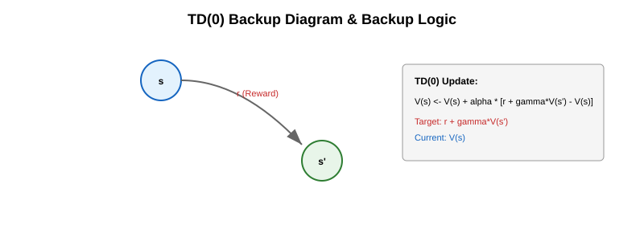
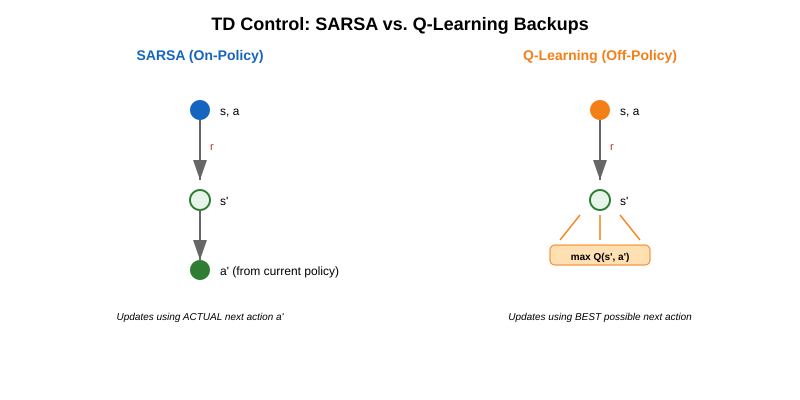
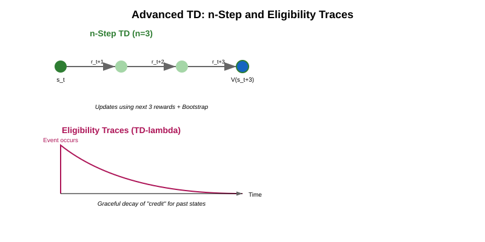
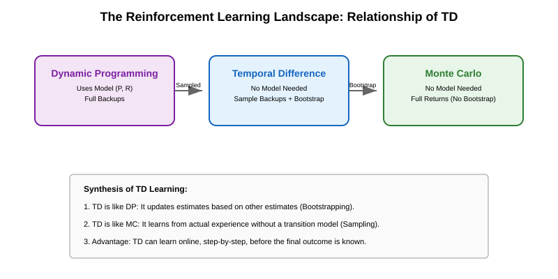

# Temporal Difference (TD) Learning - Question Set

This document contains 20 conceptual and numerical problems on Temporal Difference learning, ranging from foundational prediction to advanced control methods.

---

## Foundational TD Prediction (TD(0))

### Problem 1: The Commuter's Dilemma (MC vs. TD)
A daily commuter estimates their travel time from home to the office.
- **Agent:** The Commuter.
- **Environment:** The city traffic system.
- **Scenario:** The commuter leaves home (State $s_0$) and reaches the highway entrance (State $s_1$). They initially estimated the total trip would take 45 minutes ($V(s_0)=45$). Upon reaching $s_1$, they find the highway is clear and revise their estimate for the remainder of the trip to 20 minutes. The actual time spent from $s_0$ to $s_1$ was 15 minutes.

**Tasks:**
a) Identify the states and rewards in this backup.
b) Formulate the TD error ($\delta_t$) for the transition $s_0 \rightarrow s_1$.
c) Explain why the commuter can update their estimate $V(s_0)$ before reaching the office, unlike in Monte Carlo methods.

---

### Problem 2: Smart Thermostat (Value Prediction)
A smart thermostat uses TD(0) to predict the energy cost ($V$) required to reach a target temperature.
- **Agent:** AI Controller.
- **Environment:** A living room with external weather influence.
- **State ($s$):** Current temperature.
- **Action ($a$):** Heating intensity.
- **Transition:** From $20^\circ C$ ($s$) to $22^\circ C$ ($s'$) using "Low Heat".
- **Parameters:** $\alpha = 0.2$, $\gamma = 0.9$.
- **Current Estimates:** $V(20^\circ C) = 50$ units, $V(22^\circ C) = 30$ units.
- **Observed Reward:** Energy cost of $-5$ units for the step.

**Task:**
Compute the updated value $V(20^\circ C)$ after this single transition.

---

### Problem 3: The "Wait" Reward (TD Error)
In a stock trading scenario, an agent decides to "Hold" a stock.
- **State $s_t$:** Stock price is $\$100$.
- **State $s_{t+1}$:** Stock price is $\$102$.
- **Estimate $V(s_t)$:** Expects a future profit of $\$10$.
- **Estimate $V(s_{t+1})$:** Expects a future profit of $\$12$.
- **Reward $r_{t+1}$:** $0$ (unrealized gain is not a reward until sale).

**Task:**
Assuming $\gamma = 1.0$ (undiscounted), calculate the TD error $\delta_t$. Does the agent feel "surprised" positively or negatively?

---

### Problem 4: Autonomous Braking (Safety Margin)
An autonomous vehicle predicts the "Safety Score" ($V$) of its current distance from the car ahead.
- **State $s$:** Distance = 10 meters.
- **Transition:** Suddenly, the car ahead brakes. New state $s'$: Distance = 5 meters.
- **Reward $r$:** $-100$ (triggered by a proximity alert).
- **Previous Estimates:** $V(10m) = 0$, $V(5m) = -200$.

**Task:**
Using TD(0) with $\alpha = 0.5$ and $\gamma = 0.8$, calculate the new $V(10m)$. How does this update help the agent realize that "10 meters" is more dangerous than previously thought?

---

### Problem 5: Delivery Drone (Path Prediction)
A delivery drone is navigating a grid.
- **State $s_1$:** Intersection A. Initial $V(s_1) = 10$.
- **State $s_2$:** Intersection B. Initial $V(s_2) = 15$.
- **Observed:** Drone flies $s_1 \rightarrow s_2$, receives $r = -1$ (battery use).
- **Parameters:** $\alpha = 1.0$, $\gamma = 1.0$.

**Task:**
a) Calculate the updated $V(s_1)$.
b) If the drone repeats this path 100 times and $s_2$ is always followed by a goal state with $r=+100$, what will $V(s_1)$ eventually converge to?

---

## TD Control (SARSA, Q-Learning, Expected SARSA)

### Problem 6: The Cliff Walking Safety (Concept)
In the famous "Cliff Walking" task:
- **Environment:** A grid where one edge is a cliff. Falling off the cliff ($r = -100$) resets the agent to the start.
- **Goal:** Reach the target state ($r = 0$) with minimal steps ($r = -1$ per step).
- **Policies:**
    - **SARSA:** Learns a "safer" path away from the cliff.
    - **Q-Learning:** Learns the "optimal" path along the very edge.

**Tasks:**
a) Classify SARSA and Q-learning as on-policy or off-policy.
b) Explain why SARSA's path is safer during training if the agent uses $\epsilon$-greedy exploration.
c) Which algorithm learns the true optimal policy, and which learns a policy that is optimal *given* its exploration strategy?

---

### Problem 7: E-commerce Discounts (Q-Learning)
An AI agent manages dynamic pricing for a subscription service.
- **State ($s$):** User engagement level \{Low, Med, High\}.
- **Action ($a$):** Discount level \{0%, 10%, 20%\}.
- **Transition:** A "Med" engagement user ($s$) is given a "10% discount" ($a$). The user moves to "High" engagement ($s'$) and pays for a month ($r = +50$).
- **Next State ($s'$):** At "High" engagement, the estimated values for actions are:
    - $Q(High, 0\%) = 100$
    - $Q(High, 10\%) = 80$
    - $Q(High, 20\%) = 60$
- **Parameters:** $\alpha = 0.1$, $\gamma = 0.9$.
- **Initial Estimate:** $Q(Med, 10\%) = 40$.

**Task:**
Compute the updated $Q(Med, 10\%)$ using the Q-learning update rule.

---

### Problem 8: Robotic Warehouse (SARSA Update)
A warehouse robot learns to pick items.
- **State $s$:** At Shelf 5.
- **Action $a$:** Move to Packing Station.
- **Outcome:** Moves to packing station ($s'$), receives $r = -2$ (battery use).
- **Next Action $a'$:** The robot's $\epsilon$-greedy policy *actually chooses* "Identify Item" as the next action from $s'$.
- **Estimates:**
    - $Q(s, a) = 10$
    - $Q(s', \text{Identify}) = 20$
    - $Q(s', \text{Move to Shelf 6}) = 25$ (The greedy action, but not chosen).
- **Parameters:** $\alpha = 0.5$, $\gamma = 0.8$.

**Task:**
Calculate the updated $Q(s, a)$ using SARSA.

---

### Problem 9: Stochastic Wind (Expected SARSA)
A sailboat controller is in state $s$.
- **Action $a$:** Set sail North.
- **Environment:** Due to wind, the boat reaches $s'$ with reward $r = +10$.
- **Next State Policy:** In $s'$, the agent's policy $\pi$ is:
    - $P(a_1 \mid s') = 0.8$ (Greedy)
    - $P(a_2 \mid s') = 0.2$ (Exploratory)
- **Next State Estimates:** $Q(s', a_1) = 50$, $Q(s', a_2) = 20$.
- **Current State:** $Q(s, a) = 30$, $\alpha = 0.2$, $\gamma = 1.0$.

**Task:**
Compute the Expected SARSA update for $Q(s, a)$. How does it differ from a standard SARSA update that would have picked only one of $a_1$ or $a_2$?

---

### Problem 10: Maximization Bias (The Double-Door Mystery)
An agent is in a hallway with two doors, A and B. 
- **States:** $s$ (Hallway), $s_A$ (Room A), $s_B$ (Room B).
- **Actions:** Open Door A, Open Door B.
- **True Values:** Both doors lead to rooms where the average reward is $0$, but the rewards are noisy (e.g., normal distribution with mean 0, variance 10).
- **Current Estimates:** After a few trials, the agent sees:
    - $Q(s, \text{Open A}) = +2$ (due to lucky noise).
    - $Q(s, \text{Open B}) = -1$ (due to unlucky noise).

**Tasks:**
a) Explain why Q-learning will favor Door A despite both being equally "good" in reality.
b) What is this phenomenon called?
c) Briefly state how **Double Q-Learning** solves this using two independent estimators ($Q_1$ and $Q_2$).

---

## Advanced TD Concepts

### Problem 11: Ride-Sharing ETA (n-Step TD)
A ride-sharing app predicts the "Wait Time" ($V$) for a user.
- **Scenario:** The user requests a ride ($t=0$). 
- **Sequence:**
    - $t=1$: Driver accepts ($r_1 = -2$ min delay).
    - $t=2$: Driver reaches traffic signal ($r_2 = -3$ min delay).
    - $t=3$: Driver reaches user's street ($r_3 = -1$ min delay).
- **Estimates:**
    - $V(t=0) = 15$ min.
    - $V(t=3) = 8$ min (remaining time).
- **Parameters:** $\gamma = 1.0$.

**Tasks:**
a) Compute the 3-step TD target ($G_{t:t+3}$) for $t=0$.
b) Formulate the general $n$-step return equation.
c) If $\alpha = 0.5$, calculate the updated $V(t=0)$ using this 3-step return.

---

### Problem 12: Packet Routing (Off-Policy Prediction)
A network router predicts the delay ($V$) for packets following a "Fast Path" policy $\pi$.
- **Data Collection:** The router currently uses a "Random Exploration" policy $b$ to collect data.
- **Scenario:** A packet takes a path $s_t \rightarrow s_{t+1}$ with reward $r_{t+1} = -10ms$.
- **Action Probabilities:**
    - Target policy $\pi(\text{this action} \mid s_t) = 0.9$.
    - Behavior policy $b(\text{this action} \mid s_t) = 0.3$.
- **Estimates:** $V(s_t) = -50ms, V(s_{t+1}) = -35ms, \gamma = 1.0$.

**Task:**
Calculate the off-policy TD(0) update for $V(s_t)$. Hint: Use the importance sampling ratio $\rho_t = \frac{\pi(a_t \mid s_t)}{b(a_t \mid s_t)}$.

---

### Problem 13: Credit Assignment (Eligibility Traces)
In a digital card game, an agent plays a "Boost" card in Turn 2, which eventually leads to a huge win in Turn 10 ($r_{10} = +100$).
- **Concept:** The agent needs to know that the Turn 2 action was important.
- **Parameters:** $\lambda = 0.8, \gamma = 0.9$.

**Tasks:**
a) Define the **Eligibility Trace** $z_t(s)$.
b) If Turn 2 is the first time state $s$ is visited, what is $z_2(s)$?
c) What will be the value of $z_3(s)$ if state $s$ is not visited in Turn 3?
d) Qualitatively explain how TD($\lambda$) bridges the gap between TD(0) and Monte Carlo methods.

---

### Problem 14: Batch TD (Offline Stability)
A medical AI is trained on a "batch" of 100 patient history episodes.
- **Approach:** Instead of updating $V$ after every step, the AI calculates all updates for the batch and applies them together.
- **Concept:** The AI finds the value function that minimizes the sum of squared TD errors over the whole batch.

**Task:**
Explain why "Batch TD" is more stable than "Online TD" for high-stakes medical predictions. What does the value function converge to in the batch case?

---

### Problem 15: The Deadly Triad
RL researchers warn about the "Deadly Triad" which causes TD learning to diverge.
- **Components:**
    1. Function Approximation.
    2. Bootstrapping.
    3. Off-policy Training.

**Tasks:**
a) Identify which of these components are present in standard tabular Q-learning.
b) Why does the combination of these three often lead to instability in Deep RL (like DQN)?

---

## Special Cases & Final Synthesis

### Problem 16: TD vs. DP (Relationship)
Dynamic Programming (DP) and Temporal Difference (TD) learning both rely on bootstrapping.
- **Scenario:** A robot in a grid world.
- **DP Update:** $V(s) \leftarrow \sum_{a, s'} \pi(a \mid s) P(s' \mid s, a) [R(s, a, s') + \gamma V(s')]$
- **TD Update:** $V(s) \leftarrow V(s) + \alpha [R + \gamma V(s') - V(s)]$

**Task:**
Explain how the TD update is essentially a "sampled" version of the DP update. Why can TD be used when the transition model $P(s' \mid s, a)$ is unknown?

---

### Problem 17: Learning Rate Impact (Alpha)
A startup uses Q-learning for dynamic pricing in a highly volatile market (non-stationary).
- **Condition A:** $\alpha = 0.01$
- **Condition B:** $\alpha = 0.8$

**Task:**
Compare how the agent will behave in both conditions. Which one is better for tracking sudden market shifts, and which one is better for handling random noise?

---

### Problem 18: Online vs. Offline Updates
Consider a long episode of 1,000 steps.
- **Online TD:** Updates the value function after every step.
- **Offline TD:** Stores all 1,000 transitions and updates the value function only at the end of the episode (but still using TD targets).

**Task:**
Identify one computational advantage of Online TD and one conceptual reason why Offline TD might reach a better "fit" for the specific data in that episode.

---

### Problem 19: The TD-MC Spectrum (Hybrid returns)
An RL researcher is designing a value prediction system for weather patterns. They want to use something between TD(0) and Monte Carlo.
- **Option 1:** 5-step TD.
- **Option 2:** TD($\lambda$) with $\lambda = 0.5$.

**Task:**
Briefly describe how both options accomplish the goal of "looking further ahead" than TD(0) without waiting for the full season to end (MC).

---

### Problem 20: Self-Improving Chatbot (Comprehensive Case)
A company wants to build a chatbot that learns to minimize the "Customer Effort Score" (CES).
- **Agent:** Chatbot.
- **Goal:** Reach a solution in fewer turns and with less customer frustration.
- **Interaction Sequence:**
    - State $s_0$: User asks a question.
    - Action $a_0$: Bot asks for clarification.
    - State $s_1$: User provides details (High frustration detected).
    - Action $a_1$: Bot provides a link.
    - State $s_2$: User clicks link and leaves (Goal reached).

**Final Tasks:**
a) Define a suitable reward function $r$ for this agent.
b) Which TD algorithm (SARSA or Q-learning) would you choose if the bot must explore risky/creative answers during training without permanently damaging its performance? Justify.
c) Formulate the state space $S$ for this bot.

---
