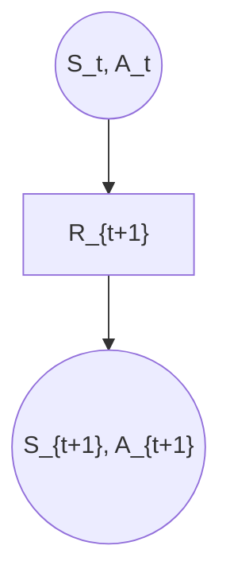
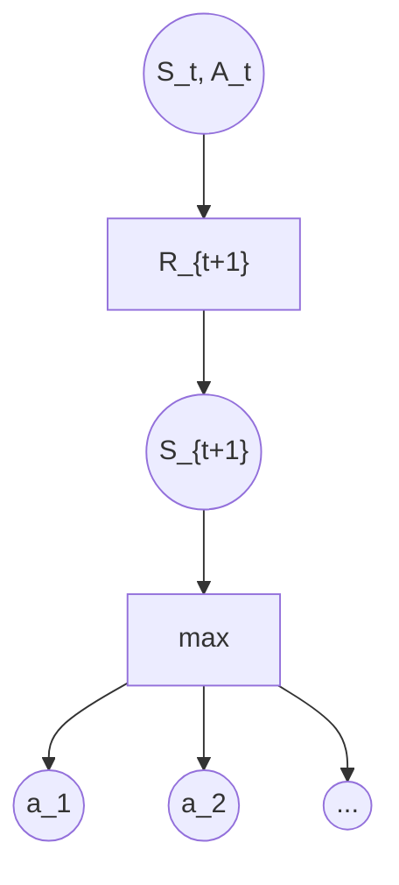
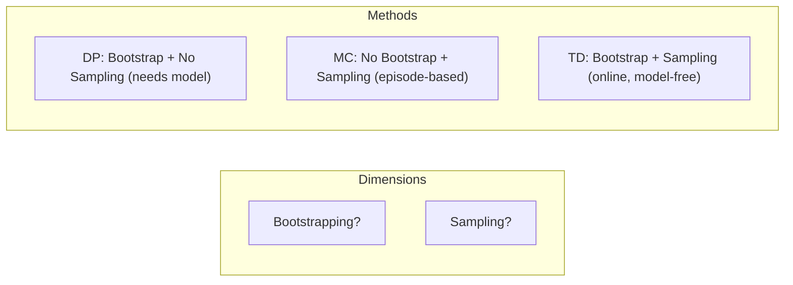
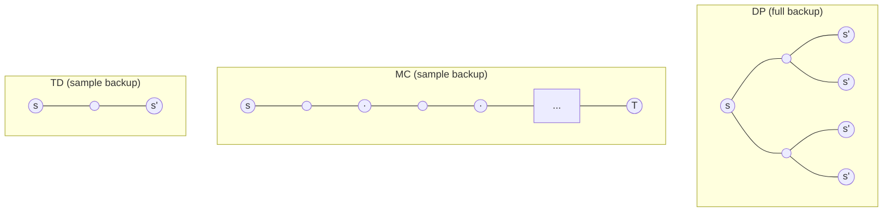

## Table of Contents

- [Context: V(s) vs Q(s,a) — Prediction vs Control](#context-vs-vs-qsa--prediction-vs-control)
- [Unified Comparison: DP, MC, and TD Update Rules](#unified-comparison-dp-mc-and-td-update-rules)
- [TD Prediction](#td-prediction)
  - [The TD(0) Update](#the-td0-update)
  - [TD Error](#td-error)
  - [MC Error as Sum of TD Errors](#mc-error-as-sum-of-td-errors)
  - [Algorithm: Tabular TD(0)](#algorithm-tabular-td0)
- [Advantages of TD Prediction Methods](#advantages-of-td-prediction-methods)
  - [1. No model required (like MC, unlike DP)](#1-no-model-required-like-mc-unlike-dp)
  - [2. Online, incremental (unlike MC)](#2-online-incremental-unlike-mc)
  - [3. Provably convergent](#3-provably-convergent)
  - [4. Empirically faster on Markov tasks](#4-empirically-faster-on-markov-tasks)
- [Optimality of TD(0) — Batch Methods](#optimality-of-td0--batch-methods)
  - [Certainty-Equivalence Estimate](#certainty-equivalence-estimate)
  - [Example: Random Walk](#example-random-walk)
    - [The 5-State Random Walk (Example 6.2)](#the-5-state-random-walk-example-62)
- [TD Control](#td-control)
  - [Sarsa: On-policy TD Control](#sarsa-on-policy-td-control)
    - [Algorithm: Sarsa](#algorithm-sarsa)
    - [Backup Diagram for Sarsa](#backup-diagram-for-sarsa)
    - [Derivation of the SARSA Update Rule from First Principles](#derivation-of-the-sarsa-update-rule-from-first-principles)
  - [Q-learning: Off-policy TD Control](#q-learning-off-policy-td-control)
    - [Algorithm: Q-learning](#algorithm-q-learning)
    - [Backup Diagram for Q-learning](#backup-diagram-for-q-learning)
    - [Why is Q-learning Off-policy?](#why-is-q-learning-off-policy)
  - [Expected Sarsa](#expected-sarsa)
    - [Unifying the Three TD Control Methods](#unifying-the-three-td-control-methods)
  - [Example: Cliff Walking](#example-cliff-walking)
- [Maximization Bias and Double Learning](#maximization-bias-and-double-learning)
  - [The Problem: Maximization Bias](#the-problem-maximization-bias)
    - [Example: The Two-Action MDP (Example 6.7)](#example-the-two-action-mdp-example-67)
  - [Double Q-learning](#double-q-learning)
    - [Algorithm: Double Q-learning](#algorithm-double-q-learning)
- [Unified View: TD, MC, DP](#unified-view-td-mc-dp)
  - [The Backup Diagrams](#the-backup-diagrams)
- [Summary: Key Equations at a Glance](#summary-key-equations-at-a-glance)
  - [Convergence Guarantees](#convergence-guarantees)

---

## Temporal-Difference Learning

Temporal-Difference (TD) learning is the central and most novel idea in reinforcement learning. It combines two ideas:

- From **Monte Carlo**: learn directly from experience without a model of the environment.
- From **Dynamic Programming**: update estimates based on other learned estimates (bootstrapping) without waiting for a final outcome.

The key innovation: TD methods update their value estimates **at every time step**, using the observed reward and the estimated value of the next state — rather than waiting until the end of an episode to compute the actual return.

---

## Context: V(s) vs Q(s,a) — Prediction vs Control

Before diving into TD, it's important to understand **why** this lecture starts with V(s) and later moves to Q(s,a).

**The fundamental problem:** In model-free RL, an agent cannot improve its policy using V(s) alone. To pick the best action at state s, you'd need to compute:

$$
\pi(s) = \arg\max_a \sum_{s',r} p(s',r \mid s,a)\left[r + \gamma V(s')\right]
$$

This requires the transition model p(s',r∣s,a), which we don't have. That's why all model-free **control** methods (SARSA, Q-learning) estimate Q(s,a) — you can directly pick argmax_a Q(s,a) without any model.

**So why learn V(s) at all?**

1. **Pedagogical clarity** — the TD bootstrapping idea is easier to grasp with V before introducing the (s,a) pair indexing
2. **Actor-Critic methods** — the critic learns V(s) via TD, and the TD error δ = R + γV(S') − V(S) serves as an advantage signal for the actor (used in A2C, PPO, etc.)
3. **With a known model** — if you do have p, you can do DP-style policy improvement over TD-learned V(s)

**The journey through this lecture:**

- **TD Prediction (V):** Learn the core idea — bootstrapping from one-step experience
- **TD Control (Q):** Apply the same idea to Q(s,a) → SARSA, Q-learning — now you can act optimally without a model

---

## Unified Comparison: DP, MC, and TD Update Rules

The table below shows how all major methods relate. They differ in: (1) what they estimate, (2) whether they need a model, (3) whether they bootstrap, and (4) how they do policy evaluation and improvement.

| Method                               | Estimates | Policy Evaluation (update rule)                                           | Policy Improvement                                                              |      Needs Model?      | Bootstraps? |
| ------------------------------------ | --------- | ------------------------------------------------------------------------- | ------------------------------------------------------------------------------- | :--------------------: | :---------: |
| **DP (Policy Eval)**           | V(s)      | $V(s) \leftarrow \sum_{s',r} p(s',r \mid s,\pi(s))[r + \gamma V(s')]$   | $\pi(s) \leftarrow \arg\max_a \sum_{s',r} p(s',r \mid s,a)[r + \gamma V(s')]$ |          Yes          |     Yes     |
| **MC On-Policy**               | Q(s,a)    | $Q(s,a) \leftarrow Q(s,a) + \alpha[G_t - Q(s,a)]$                       | $\pi(s) \leftarrow \arg\max_a Q(s,a)$ with ε-greedy                          |           No           |     No     |
| **MC Off-Policy (OIS)**        | Q(s,a)    | $Q(s,a) \leftarrow Q(s,a) + \alpha[\rho \cdot G_t - Q(s,a)]$            | $\pi(s) \leftarrow \arg\max_a Q(s,a)$ (greedy)                                |           No           |     No     |
| **TD(0) Prediction**           | V(s)      | $V(S) \leftarrow V(S) + \alpha[R + \gamma V(S') - V(S)]$                | Cannot improve without model (used in Actor-Critic as critic)                   |           No           |     Yes     |
| **SARSA (On-policy TD)**       | Q(s,a)    | $Q(S,A) \leftarrow Q(S,A) + \alpha[R + \gamma Q(S',A') - Q(S,A)]$       | $\pi(s) \leftarrow \arg\max_a Q(s,a)$ with ε-greedy                          |           No           |     Yes     |
| **Q-learning (Off-policy TD)** | Q(s,a)    | $Q(S,A) \leftarrow Q(S,A) + \alpha[R + \gamma \max_a Q(S',a) - Q(S,A)]$ | $\pi(s) \leftarrow \arg\max_a Q(s,a)$ (greedy, built into update)             |           No           |     Yes     |
| **TD + Model (Dyna-style)**    | V(s)      | $V(S) \leftarrow V(S) + \alpha[R + \gamma V(S') - V(S)]$                | $\pi(s) \leftarrow \arg\max_a \sum_{s',r} p(s',r \mid s,a)[r + \gamma V(s')]$ | Yes (learned or given) |     Yes     |

**Key observations:**

1. **DP uses V(s) because it has the model** — it can enumerate all actions and their outcomes via p(s',r∣s,a), so V(s) is sufficient for both evaluation and improvement. The improvement step explicitly needs p to compute the argmax over actions.
2. **MC and TD control use Q(s,a) because they are model-free** — without p, you cannot determine which action leads where from V(s) alone. With Q(s,a), improvement is trivial: just pick argmax_a Q(s,a) — no model needed.
3. **TD(0) prediction uses V(s) but cannot do improvement alone** — it teaches bootstrapping. On its own, V(s) cannot drive policy improvement without a model. However, it's essential in Actor-Critic architectures where the actor selects actions and the critic (V) provides the TD error δ as an advantage signal.
4. **Q-learning merges evaluation and improvement** — the max in its update target means it's always evaluating the greedy (optimal) policy, regardless of what the behavior policy does. Evaluation and improvement happen simultaneously in every update.
5. **The update structure is identical across all methods** — whether V or Q, the pattern is always: estimate ← estimate + α[target − estimate]. Only the target and the improvement mechanism change.
6. **TD + Model is the hybrid (Dyna)** — uses TD's efficient sample-based evaluation (no need for full sweeps over all states), but leverages the model for DP-style improvement. The model can be *given* (game rules, physics simulator) or *learned* from experience. This gives: fast evaluation from TD + exact improvement from model. Examples: Dyna-Q (Sutton Ch.8), AlphaGo (known game rules + TD-learned value function), robotics with physics simulators.

---

# TD Prediction

## The TD(0) Update

Given an experience transition $S_t \xrightarrow{A_t} R_{t+1}, S_{t+1}$, the simplest TD method updates:

$$
\boxed{V(S_t) \leftarrow V(S_t) + \alpha \left[ R_{t+1} + \gamma\, V(S_{t+1}) - V(S_t) \right]}
$$

Let's dissect this term by term:

| Term                                       | Meaning                                                                |
| ------------------------------------------ | ---------------------------------------------------------------------- |
| $V(S_t)$                                 | Current estimate of value at state$S_t$                              |
| $\alpha$                                 | Learning rate (step size) — how much to adjust                        |
| $R_{t+1} + \gamma\, V(S_{t+1})$          | **TD target** — a better estimate of what $V(S_t)$ should be  |
| $R_{t+1} + \gamma\, V(S_{t+1}) - V(S_t)$ | **TD error** ($\delta_t$) — how wrong our current estimate is |

**Why is the TD target a better estimate?** It incorporates one step of real experience ($R_{t+1}$) and then bootstraps from the current estimate of the successor ($V(S_{t+1})$). It's an estimate because: (1) it samples the expected value (single transition, not the full sum over all $s', r$), and (2) it uses $V(S_{t+1})$ rather than the true $v_\pi(S_{t+1})$.

**Comparison with MC target:**

| Method | Target                                                                | Must wait for         |
| ------ | --------------------------------------------------------------------- | --------------------- |
| MC     | $G_t = R_{t+1} + \gamma R_{t+2} + \gamma^2 R_{t+3} + \cdots$        | End of episode        |
| TD(0)  | $R_{t+1} + \gamma\, V(S_{t+1})$                                     | Next time step        |
| DP     | $\sum_{s',r} p(s',r \mid s, \pi(s))\left[r + \gamma\, V(s')\right]$ | Nothing (needs model) |

## TD Error

The **TD error** at time step $t$ is:

$$
\delta_t = R_{t+1} + \gamma\, V(S_{t+1}) - V(S_t)
$$

This is the discrepancy between:

- What we now think $S_t$ is worth: $V(S_t)$
- A one-step-better estimate: $R_{t+1} + \gamma\, V(S_{t+1})$

If $\delta_t > 0$: the transition was **better** than expected — increase $V(S_t)$.
If $\delta_t < 0$: the transition was **worse** than expected — decrease $V(S_t)$.
If $\delta_t = 0$: our prediction was exactly right — no update.

The TD error plays a fundamental role throughout RL. It corresponds to the dopamine signal in the brain (reward prediction error — see Chapter 15).

## MC Error as Sum of TD Errors

There is a beautiful relationship between the MC error and TD errors. If $V$ is not updated during the episode (or equivalently, if we save the errors before any updates), then:

$$
G_t - V(S_t) = \sum_{k=t}^{T-1} \gamma^{k-t}\, \delta_k
$$

**Derivation:**

$$
\delta_t = R_{t+1} + \gamma\, V(S_{t+1}) - V(S_t)
$$

$$
\delta_{t+1} = R_{t+2} + \gamma\, V(S_{t+2}) - V(S_{t+1})
$$

Summing with discount factors:

$$
\sum_{k=t}^{T-1} \gamma^{k-t}\, \delta_k = \sum_{k=t}^{T-1} \gamma^{k-t} \left[R_{k+1} + \gamma\, V(S_{k+1}) - V(S_k)\right]
$$

The $\gamma V(S_{k+1})$ of one term cancels with $-V(S_k)$ of the next (telescoping). What remains:

$$
= -V(S_t) + \sum_{k=t}^{T-1} \gamma^{k-t}\, R_{k+1} + \gamma^{T-t}\, V(S_T)
$$

Since $V(S_T) = 0$ (terminal state) and $\sum_{k=t}^{T-1} \gamma^{k-t}\, R_{k+1} = G_t$:

$$
= G_t - V(S_t)
$$

This means: **the MC update (using $G_t$) is equivalent to summing all the TD corrections along the trajectory.** MC does it all at once at the end; TD does it incrementally step by step. If $V$ doesn't change during the episode, they would produce the same total update.

## Algorithm: Tabular TD(0)

```
Input: policy π to evaluate
Initialize V(s) arbitrarily for all s (V(terminal) = 0)
Parameters: step size α ∈ (0, 1]

For each episode:
    Initialize S
    For each step of episode:
        A ← action given by π for S
        Take action A, observe R, S'
        V(S) ← V(S) + α [R + γ V(S') - V(S)]
        S ← S'
    Until S is terminal
```

**Python Implementation:**

```python
def td_0_prediction(env, policy, gamma=1.0, alpha=0.1, num_episodes=1000):
    """
    TD(0) Prediction: Estimate V for a given policy.
  
    Args:
        env: Gymnasium environment.
        policy: Function mapping state -> action.
        gamma: Discount factor.
        alpha: Learning rate.
        num_episodes: Number of episodes to run.
      
    Returns:
        V: Estimated state-value function (dict).
    """
    V = defaultdict(float)
  
    for _ in range(num_episodes):
        state, _ = env.reset()
        done = False
      
        while not done:
            action = policy(state)
            next_state, reward, terminated, truncated, _ = env.step(action)
            done = terminated or truncated
          
            # TD(0) update
            td_target = reward + gamma * V[next_state] * (not done)
            td_error = td_target - V[state]
            V[state] += alpha * td_error
          
            state = next_state
  
    return V
```

---

# Advantages of TD Prediction Methods

## 1. No model required (like MC, unlike DP)

TD learns from raw experience. It does not need $p(s', r \mid s, a)$.

## 2. Online, incremental (unlike MC)

TD updates after **every step**. MC must wait until episode termination to compute $G_t$. This has major practical consequences:

- **Continuing tasks**: MC cannot be applied at all to tasks without terminal states. TD can.
- **Long episodes**: In a 1000-step episode, MC makes zero updates for 999 steps then one big update. TD makes 1000 small updates.
- **Early detection of errors**: If a bad state is reached, TD immediately starts correcting — MC only corrects after the episode finishes (possibly much later).

## 3. Provably convergent

TD(0) converges to $v_\pi$ with probability 1 if:

- Step sizes satisfy the Robbins-Monro conditions: $\sum_t \alpha_t = \infty$ and $\sum_t \alpha_t^2 < \infty$
- Or with constant $\alpha$: converges in the mean

## 4. Empirically faster on Markov tasks

On tasks that satisfy the Markov property, TD typically converges faster than MC because it exploits the structure: the value of a state relates systematically to the values of successor states.

---

# Optimality of TD(0) — Batch Methods

What happens if we have a fixed, finite set of experience and repeatedly apply TD or MC to it?

## Certainty-Equivalence Estimate

Given a batch of episodes, we can repeatedly present the experience:

- **Batch MC**: Converges to the values that minimize the mean-squared error on the observed returns: $\min_V \sum_t (G_t - V(S_t))^2$.
- **Batch TD(0)**: Converges to the **certainty-equivalence estimate** — the correct values for the maximum-likelihood MDP model estimated from the data.

These are different! Batch TD computes the values that would be correct **if the observed transition frequencies were the true dynamics**. It builds an implicit model.

## Example: Random Walk

Consider this batch of experience:

```
Episode 1:  A → 0, B      (from A, got reward 0, went to B)
Episode 2:  B → 1          (from B, got reward 1, terminated)
Episode 3:  B → 1
Episode 4:  B → 1
Episode 5:  B → 1
Episode 6:  B → 1
Episode 7:  B → 1
Episode 8:  B → 0          (from B, got reward 0, terminated)
```

What is $V(A)$?

- **Batch MC**: $A$ appeared once, got return $G = 0 + 1 = 1$ (wait... A went to B with reward 0, and B eventually gave reward... but A only appeared in Episode 1). Actually, $A$'s return in Episode 1 is $0 + V(B)$... No: MC uses the actual return. In episode 1, A transitions to B with reward 0, then B gives reward 1. So $G_A = 0 + 1 = 1$... Hmm, but actually we only saw A once, and that one time the return was 0 (if episode ended at B). This depends on the specific setup.

Let's use the classic example from the book (Example 6.4, p. 127):

**Batch MC** gives $V(A) = 0$ (the one time A was seen, the return was 0).

**Batch TD** gives $V(A) = 0.75$. Why? TD builds the implicit model: A always goes to B (probability 1), and B gives reward 1 with probability 6/8 = 0.75. So $V(A) = 0 + V(B) = 0.75$.

Batch TD is better for **future prediction** because it exploits the Markov structure: the value of A should depend on the value of B, which we have 8 observations of. Batch MC only has 1 observation of A's return and ignores the Markov link.

### The 5-State Random Walk (Example 6.2)

```
          A     B     C     D     E
    ←─────┼─────┼─────┼─────┼─────┼─────→
 Terminal                              Terminal
 (reward 0)                           (reward 1)
```

- 5 non-terminal states, each with equal probability of stepping left or right
- Left terminal gives reward 0, right terminal gives reward 1, all other rewards are 0
- True values: $V(A) = 1/6$, $V(B) = 2/6$, $V(C) = 3/6$, $V(D) = 4/6$, $V(E) = 5/6$
- **Result**: TD(0) consistently produces lower RMS error than MC across all reasonable learning rates

---

# TD Control

TD prediction gives us a way to estimate $V_\pi$. For **control** (finding the optimal policy), we need action values $Q(s,a)$ and we use the familiar GPI (Generalized Policy Iteration) framework: evaluate → improve → evaluate → ...

## Sarsa: On-policy TD Control

**Named after the quintuple**: $(S_t, A_t, R_{t+1}, S_{t+1}, A_{t+1})$ — everything needed for one update.

$$
\boxed{Q(S_t, A_t) \leftarrow Q(S_t, A_t) + \alpha \left[ R_{t+1} + \gamma\, Q(S_{t+1}, A_{t+1}) - Q(S_t, A_t) \right]}
$$

**Key property**: Sarsa is **on-policy** — it evaluates and improves the policy it is currently following. If the policy explores (e.g., $\varepsilon$-greedy), Sarsa's Q-values reflect the cost of that exploration.

### Algorithm: Sarsa

```
Initialize Q(s,a) arbitrarily for all s, a (Q(terminal, ·) = 0)
Parameters: step size α ∈ (0, 1], small ε > 0

For each episode:
    Initialize S
    Choose A from S using policy derived from Q (e.g., ε-greedy)
    For each step of episode:
        Take action A, observe R, S'
        Choose A' from S' using policy derived from Q (ε-greedy)
        Q(S,A) ← Q(S,A) + α [R + γ Q(S',A') - Q(S,A)]
        S ← S';  A ← A'
    Until S is terminal
```

**Python Implementation:**

```python
def sarsa(env, gamma=1.0, alpha=0.1, epsilon=0.1, num_episodes=1000):
    """
    Sarsa: On-policy TD Control.
    """
    Q = defaultdict(lambda: np.zeros(env.action_space.n))
  
    def epsilon_greedy(state):
        if np.random.random() < epsilon:
            return env.action_space.sample()
        return np.argmax(Q[state])
  
    for _ in range(num_episodes):
        state, _ = env.reset()
        action = epsilon_greedy(state)
        done = False
      
        while not done:
            next_state, reward, terminated, truncated, _ = env.step(action)
            done = terminated or truncated
            next_action = epsilon_greedy(next_state)
          
            # Sarsa update: use the action actually taken next
            td_target = reward + gamma * Q[next_state][next_action] * (not done)
            td_error = td_target - Q[state][action]
            Q[state][action] += alpha * td_error
          
            state = next_state
            action = next_action
  
    return Q
```

### Backup Diagram for Sarsa



The update uses the **specific** next action $A_{t+1}$ that was actually selected by the policy. This is what makes it on-policy.

---

### Derivation of the SARSA Update Rule from First Principles

The SARSA update rule is not arbitrary — it emerges necessarily from three foundational components:

1. The **Bellman equation** for action-values (what we want to estimate)
2. **Sampling** (replacing the intractable expectation with a single observed transition)
3. **Stochastic approximation** (the Robbins-Monro framework for iterative convergence)

Below we derive the rule rigorously, showing exactly where each piece of the formula comes from.

---

#### Foundation 1: The Action-Value Function

The action-value function under policy $\pi$ is defined as:

$$
Q^\pi(s, a) \doteq \mathbb{E}_\pi\left[G_t \mid S_t = s, A_t = a\right]
$$

where $G_t$ is the infinite-horizon discounted return:

$$
G_t = R_{t+1} + \gamma R_{t+2} + \gamma^2 R_{t+3} + \cdots = \sum_{k=0}^{\infty} \gamma^k R_{t+k+1}
$$

This is the quantity we wish to estimate. It tells us: "If I'm in state $s$, I take action $a$, and then follow $\pi$ forever — what is the expected cumulative discounted reward?"

---

#### Foundation 2: The Bellman Equation for Q

We decompose $G_t$ by separating the first reward from the rest:

$$
G_t = R_{t+1} + \gamma G_{t+1}
$$

Substituting into the definition of $Q^\pi$:

$$
Q^\pi(s, a) = \mathbb{E}_\pi\left[R_{t+1} + \gamma G_{t+1} \mid S_t = s, A_t = a\right]
$$

Now, $G_{t+1}$ depends on the next state $S_{t+1}$ and the next action $A_{t+1}$ chosen by $\pi$. By the tower property of conditional expectation:

$$
G_{t+1} \text{ given } S_{t+1} = s', A_{t+1} = a' \text{ has expectation } Q^\pi(s', a')
$$

Therefore:

$$
\boxed{Q^\pi(s, a) = \mathbb{E}_\pi\left[R_{t+1} + \gamma\, Q^\pi(S_{t+1}, A_{t+1}) \mid S_t = s, A_t = a\right]}
$$

This is the **Bellman equation for the action-value function**. It is exact — if we could solve it, we'd have the true $Q^\pi$.

**What this equation says:** The value of being in $(s, a)$ equals the expected immediate reward plus the discounted value of wherever you end up next and whatever action you take there.

**Expanding the expectation explicitly** (showing what makes this intractable):

$$
Q^\pi(s, a) = \sum_{s', r} p(s', r \mid s, a) \left[ r + \gamma \sum_{a'} \pi(a' \mid s')\, Q^\pi(s', a') \right]
$$

This requires:

- The transition model $p(s', r \mid s, a)$ — which we don't have (model-free setting)
- Summation over all possible next states — which may be enormous or continuous

---

#### Foundation 3: From Expectation to Sampling

Since we cannot compute the expectation (no model, potentially infinite state space), we replace it with a **single sample**. This is the key step from DP → TD.

At time $t$, the agent experiences one actual transition:

$$
(S_t, A_t) \xrightarrow{} R_{t+1}, S_{t+1} \xrightarrow{\pi} A_{t+1}
$$

This gives us ONE realization of what's inside the expectation. We form the **sample-based target**:

$$
\hat{q}_t \doteq R_{t+1} + \gamma\, Q(S_{t+1}, A_{t+1})
$$

**Why is this a valid estimator?** Under the Bellman equation:

$$
\mathbb{E}\left[\hat{q}_t \mid S_t = s, A_t = a\right] = Q^\pi(s, a)
$$

provided $Q = Q^\pi$. So $\hat{q}_t$ is an **unbiased estimate** of the true Q-value (when Q is converged). During learning, it's biased (since Q is itself an estimate — this is the bootstrapping bias), but it still gives a useful learning signal.

**The relationship to DP:**

| Quantity                                                                                | What it computes | Requires       |
| --------------------------------------------------------------------------------------- | ---------------- | -------------- |
| DP target:$\sum_{s',r} p(s',r\mid s,a)[r + \gamma \sum_{a'} \pi(a'\mid s') Q(s',a')]$ | Full expectation | Model$p$     |
| TD target:$R_{t+1} + \gamma\, Q(S_{t+1}, A_{t+1})$                                    | Single sample    | One transition |

The TD target is a **Monte Carlo sample** of the DP target. Each individual sample is noisy, but on average (over many visits to $(s, a)$) it equals the DP target.

---

#### Foundation 4: Stochastic Approximation (Robbins-Monro)

We now have a noisy estimate $\hat{q}_t$ of the true $Q^\pi(s,a)$. How do we iteratively converge to the correct value?

The **Robbins-Monro stochastic approximation** theorem (1951) provides the answer. Given:

- A quantity $\theta^\ast$ we want to find
- Noisy observations $X_n$ such that $\mathbb{E}[X_n \mid \theta_n] = f(\theta_n)$ where $f(\theta^\ast) = 0$

The iterative scheme:

$$
\theta_{n+1} = \theta_n + \alpha_n\, X_n
$$

converges to $\theta^\ast$ provided:

1. $\sum_{n} \alpha_n = \infty$ (step sizes are large enough to eventually reach any value)
2. $\sum_{n} \alpha_n^2 < \infty$ (step sizes decrease fast enough to dampen noise)

**Applying this to our problem:**

We want to find $Q^\pi(s,a)$ such that $\mathbb{E}[\hat{q}_t - Q(s,a)] = 0$ (the error is zero on average when Q is correct).

Let $X_n = \hat{q}_t - Q(S_t, A_t)$ be the "error signal." Then:

$$
Q(S_t, A_t) \leftarrow Q(S_t, A_t) + \alpha\, \underbrace{\left[\hat{q}_t - Q(S_t, A_t)\right]}_{\text{error signal}}
$$

Expanding $\hat{q}_t$:

$$
\boxed{Q(S_t, A_t) \leftarrow Q(S_t, A_t) + \alpha \left[ R_{t+1} + \gamma\, Q(S_{t+1}, A_{t+1}) - Q(S_t, A_t) \right]}
$$

This is the **SARSA update rule**.

---

#### Anatomy of the Final Formula

$$
Q(S_t, A_t) \leftarrow Q(S_t, A_t) + \alpha \left[ \underbrace{R_{t+1} + \gamma\, Q(S_{t+1}, A_{t+1})}_{\text{TD target (where we should be)}} - \underbrace{Q(S_t, A_t)}_{\text{current estimate (where we are)}} \right]
$$

| Component                                  | Origin              | Role                                                           |
| ------------------------------------------ | ------------------- | -------------------------------------------------------------- |
| $Q(S_t, A_t)$                            | Current estimate    | Starting point — what we currently believe                    |
| $R_{t+1}$                                | Observed reward     | One step of ground truth from the environment                  |
| $\gamma\, Q(S_{t+1}, A_{t+1})$           | Bootstrapped future | Estimated value of what comes next (from the Bellman equation) |
| $R_{t+1} + \gamma Q(S_{t+1}, A_{t+1})$   | TD target           | Sample-based estimate of the true$Q^\pi(S_t, A_t)$           |
| $\delta_t = \text{target} - Q(S_t, A_t)$ | TD error            | How wrong we are — the surprise signal                        |
| $\alpha$                                 | Learning rate       | How much to trust the new evidence vs. old belief              |
| $\alpha\, \delta_t$                      | Increment           | The actual adjustment to our estimate                          |

---

#### Why Each Piece is Necessary

**Without $R_{t+1}$ (no real experience):** We'd be updating estimates from estimates alone — no grounding in reality. The update would circulate in a self-reinforcing loop.

**Without $\gamma Q(S_{t+1}, A_{t+1})$ (no bootstrapping):** We'd need to wait for the entire return $G_t$ — this becomes Monte Carlo. Bootstrapping lets us update at every step.

**Without $-Q(S_t, A_t)$ (no error term):** The update would always add to Q regardless of whether the current estimate is already correct. The error term ensures convergence: when $Q = Q^\pi$, the expected error is zero and updates average out.

**Without $\alpha$ (full replacement):** A single noisy sample would completely overwrite the estimate. With stochastic transitions, consecutive samples from the same $(s,a)$ give different targets. $\alpha < 1$ smooths across samples.

---

#### The Derivation Chain (Summary)

```
┌─────────────────────────────────────────────────────────────────┐
│ WHAT WE WANT                                                     │
│   Q^π(s,a) = E_π[R + γQ^π(S',A') | s, a]   (Bellman equation) │
└─────────────────────────────────┬───────────────────────────────┘
                                  │
                                  ▼ PROBLEM: Can't compute E[...] 
                                  │          (no model, huge state space)
                                  │
┌─────────────────────────────────┴───────────────────────────────┐
│ APPROXIMATION 1: Replace expectation with single sample          │
│   Target ≈ r + γQ(s', a')    where (s,a,r,s',a') is observed   │
└─────────────────────────────────┬───────────────────────────────┘
                                  │
                                  ▼ PROBLEM: Single sample is noisy.
                                  │          Can't just set Q = target.
                                  │
┌─────────────────────────────────┴───────────────────────────────┐
│ APPROXIMATION 2: Robbins-Monro stochastic approximation          │
│   Move Q partway toward sample target:                           │
│   Q(s,a) ← Q(s,a) + α [target - Q(s,a)]                       │
└─────────────────────────────────┬───────────────────────────────┘
                                  │
                                  ▼ RESULT
                                  │
┌─────────────────────────────────┴───────────────────────────────┐
│ SARSA UPDATE RULE:                                               │
│   Q(S,A) ← Q(S,A) + α [R + γQ(S',A') - Q(S,A)]               │
└─────────────────────────────────────────────────────────────────┘
```

---

#### Convergence Guarantee

Under the following conditions, SARSA converges to $Q^\pi$ (for a fixed $\pi$) or to $Q^\ast$ (with GLIE policy):

1. **All state-action pairs visited infinitely often:** Every $(s,a)$ must be sampled enough times for the law of large numbers to take effect.
2. **Step-size conditions (Robbins-Monro):**

   $$
   \sum_{t=1}^{\infty} \alpha_t(s,a) = \infty \quad \text{and} \quad \sum_{t=1}^{\infty} \alpha_t^2(s,a) < \infty
   $$
3. **GLIE condition** (for convergence to $Q^\ast$): The policy must be Greedy in the Limit with Infinite Exploration — e.g., $\varepsilon$-greedy with $\varepsilon_t \to 0$.

With a **constant** $\alpha$ (standard practice), exact convergence is not guaranteed, but the algorithm converges in the mean and tracks non-stationary targets — which is often more useful in practice.

---

#### Historical Context

The SARSA algorithm was first described by Rummery & Niranjan (1994) as "Modified Connectionist Q-learning" and later named SARSA by Sutton (1996). It is the natural on-policy counterpart to Q-learning (Watkins, 1989), which replaces $A_{t+1}$ with $\arg\max_a Q(S_{t+1}, a)$ — a single change that makes the algorithm off-policy.

The derivation above applies identically to Q-learning — the only difference is what we substitute for the next action:

- **SARSA**: $A_{t+1} \sim \pi(\cdot \mid S_{t+1})$ (actual action taken)
- **Q-learning**: $A_{t+1} = \arg\max_a Q(S_{t+1}, a)$ (hypothetical best action)

Both are instances of the same Bellman equation + sampling + stochastic approximation framework. The choice of $A_{t+1}$ determines whether we estimate $Q^\pi$ (on-policy) or $Q^\ast$ (off-policy).

---

## Q-learning: Off-policy TD Control

One of the most important breakthroughs in RL (Watkins, 1989). Q-learning learns $q_\ast$ directly — the optimal action-value function — regardless of what policy is being followed:

$$
\boxed{Q(S_t, A_t) \leftarrow Q(S_t, A_t) + \alpha \left[ R_{t+1} + \gamma\, \max_a Q(S_{t+1}, a) - Q(S_t, A_t) \right]}
$$

**The critical difference from Sarsa**: instead of using $Q(S_{t+1}, A_{t+1})$ (the value of the action actually taken next), Q-learning uses $\max_a Q(S_{t+1}, a)$ (the value of the **best** action available). It doesn't matter what action was actually taken — the update always assumes optimal future behavior.

### Algorithm: Q-learning

```
Initialize Q(s,a) arbitrarily for all s, a (Q(terminal, ·) = 0)
Parameters: step size α ∈ (0, 1], small ε > 0

For each episode:
    Initialize S
    For each step of episode:
        Choose A from S using policy derived from Q (e.g., ε-greedy)
        Take action A, observe R, S'
        Q(S,A) ← Q(S,A) + α [R + γ max_a Q(S',a) - Q(S,A)]
        S ← S'
    Until S is terminal
```

**Python Implementation:**

```python
def q_learning(env, gamma=1.0, alpha=0.1, epsilon=0.1, num_episodes=1000):
    """
    Q-learning: Off-policy TD Control.
    """
    Q = defaultdict(lambda: np.zeros(env.action_space.n))
  
    def epsilon_greedy(state):
        if np.random.random() < epsilon:
            return env.action_space.sample()
        return np.argmax(Q[state])
  
    for _ in range(num_episodes):
        state, _ = env.reset()
        done = False
      
        while not done:
            action = epsilon_greedy(state)
            next_state, reward, terminated, truncated, _ = env.step(action)
            done = terminated or truncated
          
            # Q-learning update: use max over next actions
            td_target = reward + gamma * np.max(Q[next_state]) * (not done)
            td_error = td_target - Q[state][action]
            Q[state][action] += alpha * td_error
          
            state = next_state
  
    return Q
```

### Backup Diagram for Q-learning



The $\max$ node makes this off-policy: we bootstrap from the best action regardless of what the behavior policy does.

### Why is Q-learning Off-policy?

In Q-learning, there are two policies:

- **Behavior policy** (the one generating experience): typically $\varepsilon$-greedy
- **Target policy** (the one being learned): greedy ($\arg\max_a Q(s,a)$)

The update target $R + \gamma \max_a Q(S', a)$ uses the greedy (target) policy for the bootstrap, while the agent actually follows the $\varepsilon$-greedy (behavior) policy. These are different policies — hence "off-policy."

Sarsa, by contrast, uses $Q(S', A')$ where $A'$ is the actual next action taken — behavior and target are the same policy.

---

## Expected Sarsa

Instead of sampling a single $A_{t+1}$ (Sarsa) or taking the max (Q-learning), Expected Sarsa uses the **expected value** over all actions under the current policy:

$$
\boxed{Q(S_t, A_t) \leftarrow Q(S_t, A_t) + \alpha \left[ R_{t+1} + \gamma\, \sum_a \pi(a \mid S_{t+1})\, Q(S_{t+1}, a) - Q(S_t, A_t) \right]}
$$

**Why is this better?** It eliminates the variance that comes from randomly selecting $A_{t+1}$. Instead of depending on which action happens to be sampled, it uses the exact expectation.

### Unifying the Three TD Control Methods

| Method         | Bootstrap target for$S_{t+1}$                                       | On/Off-policy |
| -------------- | --------------------------------------------------------------------- | ------------- |
| Sarsa          | $Q(S_{t+1}, A_{t+1})$ — one sample action                          | On-policy     |
| Q-learning     | $\max_a Q(S_{t+1}, a)$ — best action                               | Off-policy    |
| Expected Sarsa | $\sum_a \pi(a \mid S_{t+1})\, Q(S_{t+1}, a)$ — average over policy | Either        |

Expected Sarsa **subsumes** Q-learning as a special case: if the target policy $\pi$ is greedy, then $\sum_a \pi(a \mid s)\, Q(s,a) = \max_a Q(s,a)$, and Expected Sarsa becomes exactly Q-learning.

Expected Sarsa is computationally more expensive per step (must sum over all actions), but it generally performs better because of reduced variance.

---

## Example: Cliff Walking

The Cliff Walking problem (Example 6.6) perfectly illustrates the difference between Sarsa and Q-learning.

```
┌────┬────┬────┬────┬────┬────┬────┬────┬────┬────┬────┬────┐
│    │    │    │    │    │    │    │    │    │    │    │    │
├────┼────┼────┼────┼────┼────┼────┼────┼────┼────┼────┼────┤
│    │    │    │    │    │    │    │    │    │    │    │    │
├────┼────┼────┼────┼────┼────┼────┼────┼────┼────┼────┼────┤
│    │    │    │    │    │    │    │    │    │    │    │    │
├────┼────┼────┼────┼────┼────┼────┼────┼────┼────┼────┼────┤
│ S  │XXXX│XXXX│XXXX│XXXX│XXXX│XXXX│XXXX│XXXX│XXXX│XXXX│ G  │
└────┴────┴────┴────┴────┴────┴────┴────┴────┴────┴────┴────┘
      ↑ The Cliff (reward = -100, resets to S)
```

- Grid: 4×12. Start (S) at bottom-left, Goal (G) at bottom-right.
- The bottom row between S and G is the **cliff**: stepping on it gives reward $-100$ and resets to S.
- All other moves give reward $-1$.

**Q-learning** learns the **optimal path** — along the cliff edge (shortest path, total reward = $-13$). But during learning with $\varepsilon$-greedy, the agent occasionally slips into the cliff, earning terrible rewards during training.

**Sarsa** learns a **safer path** — along the top row, far from the cliff. It gets a longer path (reward $\approx -17$) but avoids catastrophic cliff-falls during training. Because Sarsa accounts for the $\varepsilon$ probability of random exploration in its Q-values, it learns that "near the cliff" is dangerous for the policy-as-actually-executed.

```
Q-learning (optimal):     Sarsa (safe):
→ → → → → → → → → → → ↓     → → → → → → → → → → → ↓
                    ↓         ↑                         ↓
                    ↓         ↑                         ↓
S . . . . . . . . . . G     S . . . . . . . . . . . G
```

**Key insight**: Q-learning finds what's optimal if you act greedily (which you don't during training). Sarsa finds what's optimal given that you will continue to explore. If $\varepsilon \to 0$ eventually, both converge to the same optimal policy.

---

# Maximization Bias and Double Learning

## The Problem: Maximization Bias

Consider a state $s$ where all true action values are zero: $q_\ast(s, a) = 0$ for all $a$. If we estimate these from noisy samples, some estimates will be positive and some negative due to noise. Taking $\max_a Q(s,a)$ will select a positive value — but this is **noise, not signal**.

$$
\mathbb{E}\left[\max_a Q(s,a)\right] \geq \max_a \mathbb{E}\left[Q(s,a)\right] = 0
$$

The max of estimated values **overestimates** the max of true values. This is maximization bias.

### Example: The Two-Action MDP (Example 6.7)

```
        left        right
  S ──────────→ B ──────────→ Terminal (reward = 0)
                │
                │ many actions, each with
                │ reward ~ N(-0.1, 1.0)
                ↓
            Terminal
```

From state B, all actions have expected reward $-0.1$ (slightly negative). The optimal action from S is clearly **right** (expected return = 0 > expected of going left = $-0.1$).

But Q-learning with $\max_a Q(B,a)$ picks the highest of many noisy estimates at B. With many actions, some will be positive by chance. Q-learning therefore overestimates the value of going left and chooses it ~75% of the time early in training.

## Double Q-learning

**Solution**: Decouple action selection from value estimation by maintaining two independent Q-tables.

$$
Q_1(S, A) \leftarrow Q_1(S, A) + \alpha \left[ R + \gamma\, Q_2\!\left(S', \arg\max_a Q_1(S', a)\right) - Q_1(S, A) \right]
$$

- **$Q_1$ selects** the best action: $A^\ast = \arg\max_a Q_1(S', a)$
- **$Q_2$ evaluates** that action: $Q_2(S', A^\ast)$

Since $Q_1$ and $Q_2$ are learned from different experience (or updated on alternate steps), the selection is unbiased by the evaluation's noise.

With probability 0.5, update $Q_1$ (using $Q_2$ to evaluate); with probability 0.5, update $Q_2$ (using $Q_1$ to evaluate).

### Algorithm: Double Q-learning

```
Initialize Q_1(s,a), Q_2(s,a) arbitrarily for all s, a
Parameters: step size α ∈ (0, 1], small ε > 0

For each episode:
    Initialize S
    For each step of episode:
        Choose A from S using ε-greedy on Q_1 + Q_2
        Take action A, observe R, S'
        With probability 0.5:
            Q_1(S,A) ← Q_1(S,A) + α [R + γ Q_2(S', argmax_a Q_1(S',a)) - Q_1(S,A)]
        Else:
            Q_2(S,A) ← Q_2(S,A) + α [R + γ Q_1(S', argmax_a Q_2(S',a)) - Q_2(S,A)]
        S ← S'
    Until S is terminal
```

**Python Implementation:**

```python
def double_q_learning(env, gamma=1.0, alpha=0.1, epsilon=0.1, num_episodes=1000):
    """
    Double Q-learning: Eliminates maximization bias.
    """
    Q1 = defaultdict(lambda: np.zeros(env.action_space.n))
    Q2 = defaultdict(lambda: np.zeros(env.action_space.n))
  
    def epsilon_greedy(state):
        combined = Q1[state] + Q2[state]
        if np.random.random() < epsilon:
            return env.action_space.sample()
        return np.argmax(combined)
  
    for _ in range(num_episodes):
        state, _ = env.reset()
        done = False
      
        while not done:
            action = epsilon_greedy(state)
            next_state, reward, terminated, truncated, _ = env.step(action)
            done = terminated or truncated
          
            if np.random.random() < 0.5:
                # Update Q1, use Q2 for evaluation
                best_next = np.argmax(Q1[next_state])
                td_target = reward + gamma * Q2[next_state][best_next] * (not done)
                Q1[state][action] += alpha * (td_target - Q1[state][action])
            else:
                # Update Q2, use Q1 for evaluation
                best_next = np.argmax(Q2[next_state])
                td_target = reward + gamma * Q1[next_state][best_next] * (not done)
                Q2[state][action] += alpha * (td_target - Q2[state][action])
          
            state = next_state
  
    return Q1, Q2
```

---

# Unified View: TD, MC, DP

All three methods solve the same problem (computing value functions) but make different tradeoffs:



| Dimension                             | DP                      | MC                   | TD                   |
| ------------------------------------- | ----------------------- | -------------------- | -------------------- |
| **Requires model?**             | Yes                     | No                   | No                   |
| **Bootstraps?**                 | Yes                     | No                   | Yes                  |
| **Works for continuing tasks?** | Yes                     | No                   | Yes                  |
| **Updates after**               | Full sweep              | Episode end          | Each step            |
| **Uses actual returns?**        | No (expected)           | Yes ($G_t$)        | No (estimated)       |
| **Bias**                        | None (if model correct) | None                 | Yes (from bootstrap) |
| **Variance**                    | None (full expectation) | High (single return) | Lower (one-step)     |

### The Backup Diagrams



- **DP**: considers ALL possible next states and actions (full width, one step depth)
- **MC**: follows ONE trajectory all the way to the end (one sample, full depth)
- **TD**: follows ONE transition to the next state (one sample, one step depth)

---

# Summary: Key Equations at a Glance

| Algorithm                   | Update Rule                                                                                                | Type               |
| --------------------------- | ---------------------------------------------------------------------------------------------------------- | ------------------ |
| **TD(0) Prediction**  | $V(S) \leftarrow V(S) + \alpha\left[R + \gamma V(S') - V(S)\right]$                                      | Prediction         |
| **Sarsa**             | $Q(S,A) \leftarrow Q(S,A) + \alpha\left[R + \gamma Q(S', A') - Q(S,A)\right]$                            | On-policy control  |
| **Q-learning**        | $Q(S,A) \leftarrow Q(S,A) + \alpha\left[R + \gamma \max_a Q(S', a) - Q(S,A)\right]$                      | Off-policy control |
| **Expected Sarsa**    | $Q(S,A) \leftarrow Q(S,A) + \alpha\left[R + \gamma \sum_a \pi(a\mid S') Q(S', a) - Q(S,A)\right]$        | Either             |
| **Double Q-learning** | $Q_1(S,A) \leftarrow Q_1(S,A) + \alpha\left[R + \gamma Q_2(S', \arg\max_a Q_1(S', a)) - Q_1(S,A)\right]$ | Off-policy control |

### Convergence Guarantees

| Algorithm         | Converges to                  | Conditions                                                                |
| ----------------- | ----------------------------- | ------------------------------------------------------------------------- |
| TD(0)             | $v_\pi$                     | Decreasing$\alpha$ (Robbins-Monro) or constant $\alpha$ (in the mean) |
| Sarsa             | $q_\ast$                    | All state-action pairs visited$\infty$ often, GLIE policy               |
| Q-learning        | $q_\ast$                    | All state-action pairs visited$\infty$ often                            |
| Expected Sarsa    | $q_\ast$ (if target greedy) | Same as Q-learning                                                        |
| Double Q-learning | $q_\ast$                    | Same as Q-learning                                                        |

---

*Reference: Sutton, R. S., & Barto, A. G. (2018). Reinforcement Learning: An Introduction, Chapter 6. MIT Press.*
