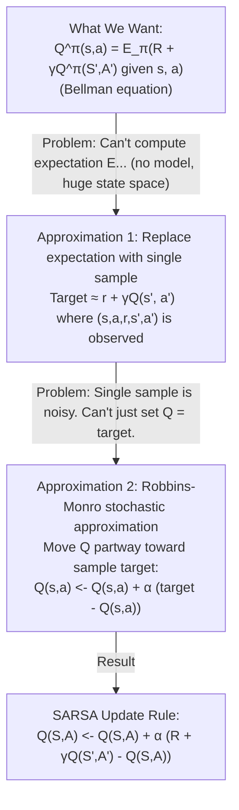
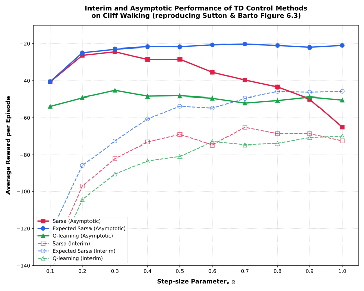
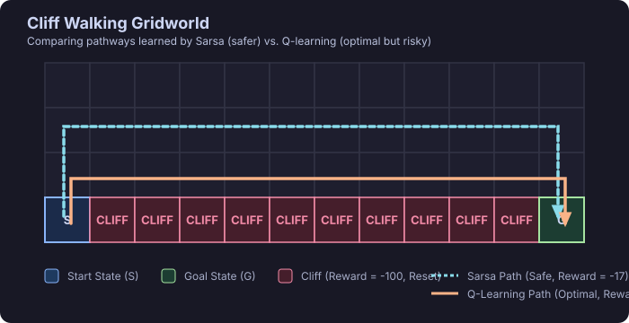
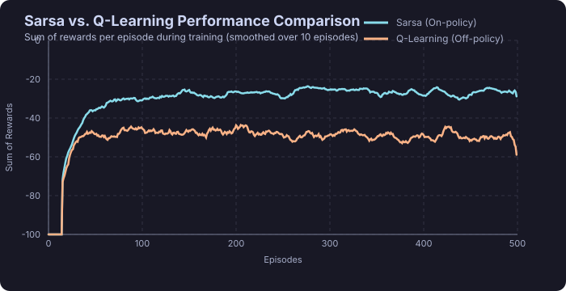
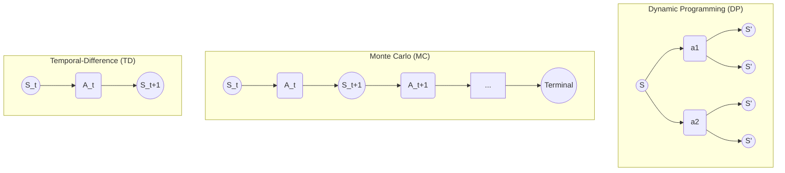

## Table of Contents

- [Context: V(s) vs Q(s,a) — Prediction vs Control](#context-vs-vs-qsa--prediction-vs-control)
- [Unified Comparison: DP, MC, and TD Update Rules](#unified-comparison-dp-mc-and-td-update-rules)
- [TD Prediction](#td-prediction)
  - [The TD(0) Update](#the-td0-update)
  - [TD Error](#td-error)
  - [MC Error as Sum of TD Errors](#mc-error-as-sum-of-td-errors)
  - [Algorithm: Tabular TD(0)](#algorithm-tabular-td0)
- [Advantages of TD Prediction Methods](#advantages-of-td-prediction-methods)
  - [1. No model required (like MC, unlike DP)](#1-no-model-required-like-mc-unlike-dp)
  - [2. Online, incremental (unlike MC)](#2-online-incremental-unlike-mc)
  - [3. Provably convergent](#3-provably-convergent)
  - [4. Empirically faster on Markov tasks](#4-empirically-faster-on-markov-tasks)
- [Optimality of TD(0) — Batch Methods](#optimality-of-td0--batch-methods)
  - [Standard (Incremental) TD(0) vs. Batch TD(0)](#standard-incremental-td0-vs-batch-td0)
  - [Algorithm: Batch TD(0)](#algorithm-batch-td0)
  - [Certainty-Equivalence Estimate](#certainty-equivalence-estimate)
  - [The A-B Example (Example 6.4)](#the-a-b-example-example-64)
  - [The 5-State Random Walk (Example 6.2)](#the-5-state-random-walk-example-62)
- [TD Control](#td-control)
  - [Sarsa: On-policy TD Control](#sarsa-on-policy-td-control)
    - [Algorithm: Sarsa](#algorithm-sarsa)
    - [What does "policy derived from Q" mean?](#what-does-policy-derived-from-q-mean)
    - [Sarsa vs. Q-learning: How the "Max" Action is Handled](#sarsa-vs-q-learning-how-the-max-action-is-handled)
    - [Backup Diagram for Sarsa](#backup-diagram-for-sarsa)
    - [Derivation of the SARSA Update Rule from First Principles](#derivation-of-the-sarsa-update-rule-from-first-principles)
  - [Q-learning: Off-policy TD Control](#q-learning-off-policy-td-control)
    - [Algorithm: Q-learning](#algorithm-q-learning)
    - [Backup Diagram for Q-learning](#backup-diagram-for-q-learning)
    - [Why is Q-learning Off-policy?](#why-is-q-learning-off-policy)
  - [Expected Sarsa](#expected-sarsa)
    - [Unifying the Three TD Control Methods](#unifying-the-three-td-control-methods)
  - [Example: Cliff Walking](#example-cliff-walking)
- [Maximization Bias and Double Learning](#maximization-bias-and-double-learning)
  - [The Problem: Maximization Bias](#the-problem-maximization-bias)
    - [Example: The Two-Action MDP (Example 6.7)](#example-the-two-action-mdp-example-67)
  - [Double Q-learning](#double-q-learning)
    - [Algorithm: Double Q-learning](#algorithm-double-q-learning)
- [Unified View: TD, MC, DP](#unified-view-td-mc-dp)
  - [The Backup Diagrams](#the-backup-diagrams)
- [Convergence Theory: TD vs MC](#convergence-theory-td-vs-mc)
- [Summary: Key Equations at a Glance](#summary-key-equations-at-a-glance)
  - [Convergence Guarantees](#convergence-guarantees)

---

## Temporal-Difference Learning

Temporal-Difference (TD) learning is the central and most novel idea in reinforcement learning. It combines two ideas:

- From **Monte Carlo**: learn directly from experience without a model of the environment.
- From **Dynamic Programming**: update estimates based on other learned estimates (bootstrapping) without waiting for a final outcome.

The key innovation: TD methods update their value estimates **at every time step**, using the observed reward and the estimated value of the next state — rather than waiting until the end of an episode to compute the actual return.

---

## Context: V(s) vs Q(s,a) — Prediction vs Control

Before diving into TD, it's important to understand **why** this lecture starts with V(s) and later moves to Q(s,a).

**The fundamental problem:** In model-free RL, an agent cannot improve its policy using V(s) alone. To pick the best action at state s, you'd need to compute:

$$
\pi(s) = \arg\max_a \sum_{s',r} p(s',r \mid s,a)\left[r + \gamma V(s')\right]
$$

This requires the transition model p(s',r∣s,a), which we don't have. That's why all model-free **control** methods (SARSA, Q-learning) estimate Q(s,a) — you can directly pick argmax_a Q(s,a) without any model.

**So why learn V(s) at all?**

1. **Pedagogical clarity** — the TD bootstrapping idea is easier to grasp with V before introducing the (s,a) pair indexing
2. **Actor-Critic methods** — the critic learns V(s) via TD, and the TD error δ = R + γV(S') − V(S) serves as an advantage signal for the actor (used in A2C, PPO, etc.)
3. **With a known model** — if you do have p, you can do DP-style policy improvement over TD-learned V(s)

**The journey through this lecture:**

- **TD Prediction (V):** Learn the core idea — bootstrapping from one-step experience
- **TD Control (Q):** Apply the same idea to Q(s,a) → SARSA, Q-learning — now you can act optimally without a model

---

## Unified Comparison: DP, MC, and TD Update Rules

The table below shows how all major methods relate. They differ in: (1) what they estimate, (2) whether they need a model, (3) whether they bootstrap, and (4) how they do policy evaluation and improvement.

| Method                               | Estimates | Policy Evaluation (update rule)                                           | Policy Improvement                                                              |      Needs Model?      | Bootstraps? |
| ------------------------------------ | --------- | ------------------------------------------------------------------------- | ------------------------------------------------------------------------------- | :--------------------: | :---------: |
| **DP (Policy Eval)**           | V(s)      | $V(s) \leftarrow \sum_{s',r} p(s',r \mid s,\pi(s))[r + \gamma V(s')]$   | $\pi(s) \leftarrow \arg\max_a \sum_{s',r} p(s',r \mid s,a)[r + \gamma V(s')]$ |          Yes          |     Yes     |
| **MC On-Policy**               | Q(s,a)    | $Q(s,a) \leftarrow Q(s,a) + \alpha[G_t - Q(s,a)]$                       | $\pi(s) \leftarrow \arg\max_a Q(s,a)$ with ε-greedy                          |           No           |     No     |
| **MC Off-Policy (OIS)**        | Q(s,a)    | $Q(s,a) \leftarrow Q(s,a) + \alpha[\rho \cdot G_t - Q(s,a)]$            | $\pi(s) \leftarrow \arg\max_a Q(s,a)$ (greedy)                                |           No           |     No     |
| **TD(0) Prediction**           | V(s)      | $V(S) \leftarrow V(S) + \alpha[R + \gamma V(S') - V(S)]$                | Cannot improve without model (used in Actor-Critic as critic)                   |           No           |     Yes     |
| **SARSA (On-policy TD)**       | Q(s,a)    | $Q(S,A) \leftarrow Q(S,A) + \alpha[R + \gamma Q(S',A') - Q(S,A)]$       | $\pi(s) \leftarrow \arg\max_a Q(s,a)$ with ε-greedy                          |           No           |     Yes     |
| **Q-learning (Off-policy TD)** | Q(s,a)    | $Q(S,A) \leftarrow Q(S,A) + \alpha[R + \gamma \max_a Q(S',a) - Q(S,A)]$ | $\pi(s) \leftarrow \arg\max_a Q(s,a)$ (greedy, built into update)             |           No           |     Yes     |
| **TD + Model (Dyna-style)**    | V(s)      | $V(S) \leftarrow V(S) + \alpha[R + \gamma V(S') - V(S)]$                | $\pi(s) \leftarrow \arg\max_a \sum_{s',r} p(s',r \mid s,a)[r + \gamma V(s')]$ | Yes (learned or given) |     Yes     |

**Key observations:**

1. **DP uses V(s) because it has the model** — it can enumerate all actions and their outcomes via p(s',r∣s,a), so V(s) is sufficient for both evaluation and improvement. The improvement step explicitly needs p to compute the argmax over actions.
2. **MC and TD control use Q(s,a) because they are model-free** — without p, you cannot determine which action leads where from V(s) alone. With Q(s,a), improvement is trivial: just pick argmax_a Q(s,a) — no model needed.
3. **TD(0) prediction uses V(s) but cannot do improvement alone** — it teaches bootstrapping. On its own, V(s) cannot drive policy improvement without a model. However, it's essential in Actor-Critic architectures where the actor selects actions and the critic (V) provides the TD error δ as an advantage signal.
4. **Q-learning merges evaluation and improvement** — the max in its update target means it's always evaluating the greedy (optimal) policy, regardless of what the behavior policy does. Evaluation and improvement happen simultaneously in every update.
5. **The update structure is identical across all methods** — whether V or Q, the pattern is always: estimate ← estimate + α[target − estimate]. Only the target and the improvement mechanism change.
6. **TD + Model is the hybrid (Dyna)** — uses TD's efficient sample-based evaluation (no need for full sweeps over all states), but leverages the model for DP-style improvement. The model can be *given* (game rules, physics simulator) or *learned* from experience. This gives: fast evaluation from TD + exact improvement from model. Examples: Dyna-Q (Sutton Ch.8), AlphaGo (known game rules + TD-learned value function), robotics with physics simulators.

---

# TD Prediction

## The TD(0) Update

Given an experience transition $S_t \xrightarrow{A_t} R_{t+1}, S_{t+1}$, the simplest TD method updates:

$$
\boxed{V(S_t) \leftarrow V(S_t) + \alpha \left[ R_{t+1} + \gamma\, V(S_{t+1}) - V(S_t) \right]}
$$

Let's dissect this term by term:

| Term                                       | Meaning                                                                |
| ------------------------------------------ | ---------------------------------------------------------------------- |
| $V(S_t)$                                 | Current estimate of value at state$S_t$                              |
| $\alpha$                                 | Learning rate (step size) — how much to adjust                        |
| $R_{t+1} + \gamma\, V(S_{t+1})$          | **TD target** — a better estimate of what $V(S_t)$ should be  |
| $R_{t+1} + \gamma\, V(S_{t+1}) - V(S_t)$ | **TD error** ($\delta_t$) — how wrong our current estimate is |

**Why is the TD target a better estimate?** It incorporates one step of real experience ($R_{t+1}$) and then bootstraps from the current estimate of the successor ($V(S_{t+1})$). It's an estimate because: (1) it samples the expected value (single transition, not the full sum over all $s', r$), and (2) it uses $V(S_{t+1})$ rather than the true $v_\pi(S_{t+1})$.

**Comparison with MC target:**

| Method | Target                                                                | Must wait for         |
| ------ | --------------------------------------------------------------------- | --------------------- |
| MC     | $G_t = R_{t+1} + \gamma R_{t+2} + \gamma^2 R_{t+3} + \cdots$        | End of episode        |
| TD(0)  | $R_{t+1} + \gamma\, V(S_{t+1})$                                     | Next time step        |
| DP     | $\sum_{s',r} p(s',r \mid s, \pi(s))\left[r + \gamma\, V(s')\right]$ | Nothing (needs model) |

## TD Error

The **TD error** at time step $t$ is:

$$
\delta_t = R_{t+1} + \gamma\, V(S_{t+1}) - V(S_t)
$$

This is the discrepancy between:

- What we now think $S_t$ is worth: $V(S_t)$
- A one-step-better estimate: $R_{t+1} + \gamma\, V(S_{t+1})$

If $\delta_t > 0$: the transition was **better** than expected — increase $V(S_t)$.
If $\delta_t < 0$: the transition was **worse** than expected — decrease $V(S_t)$.
If $\delta_t = 0$: our prediction was exactly right — no update.

The TD error plays a fundamental role throughout RL. It corresponds to the dopamine signal in the brain (reward prediction error — see Chapter 15).

## MC Error as Sum of TD Errors

There is a beautiful relationship between the MC error and TD errors. If $V$ is not updated during the episode (or equivalently, if we save the errors before any updates), then:

$$
G_t - V(S_t) = \sum_{k=t}^{T-1} \gamma^{k-t}\, \delta_k
$$

**Derivation:**

$$
\delta_t = R_{t+1} + \gamma\, V(S_{t+1}) - V(S_t)
$$

$$
\delta_{t+1} = R_{t+2} + \gamma\, V(S_{t+2}) - V(S_{t+1})
$$

Summing with discount factors:

$$
\sum_{k=t}^{T-1} \gamma^{k-t}\, \delta_k = \sum_{k=t}^{T-1} \gamma^{k-t} \left[R_{k+1} + \gamma\, V(S_{k+1}) - V(S_k)\right]
$$

The $\gamma V(S_{k+1})$ of one term cancels with $-V(S_k)$ of the next (telescoping). What remains:

$$
= -V(S_t) + \sum_{k=t}^{T-1} \gamma^{k-t}\, R_{k+1} + \gamma^{T-t}\, V(S_T)
$$

Since $V(S_T) = 0$ (terminal state) and $\sum_{k=t}^{T-1} \gamma^{k-t}\, R_{k+1} = G_t$:

$$
= G_t - V(S_t)
$$

This means: **the MC update (using $G_t$) is equivalent to summing all the TD corrections along the trajectory.** MC does it all at once at the end; TD does it incrementally step by step. If $V$ doesn't change during the episode, they would produce the same total update.

## Algorithm: Tabular TD(0)

```
Input: policy π to evaluate
Initialize V(s) arbitrarily for all s (V(terminal) = 0)
Parameters: step size α ∈ (0, 1]

For each episode:
    Initialize S
    For each step of episode:
        A ← action given by π for S
        Take action A, observe R, S'
        V(S) ← V(S) + α [R + γ V(S') - V(S)]
        S ← S'
    Until S is terminal
```

**Python Implementation:**

```python
def td_0_prediction(env, policy, gamma=1.0, alpha=0.1, num_episodes=1000):
    """
    TD(0) Prediction: Estimate V for a given policy.
  
    Args:
        env: Gymnasium environment.
        policy: Function mapping state -> action.
        gamma: Discount factor.
        alpha: Learning rate.
        num_episodes: Number of episodes to run.
      
    Returns:
        V: Estimated state-value function (dict).
    """
    V = defaultdict(float)
  
    for _ in range(num_episodes):
        state, _ = env.reset()
        done = False
      
        while not done:
            action = policy(state)
            next_state, reward, terminated, truncated, _ = env.step(action)
            done = terminated or truncated
          
            # TD(0) update
            td_target = reward + gamma * V[next_state] * (not done)
            td_error = td_target - V[state]
            V[state] += alpha * td_error
          
            state = next_state
  
    return V
```

---

# Advantages of TD Prediction Methods

## 1. No model required (like MC, unlike DP)

TD learns from raw experience. It does not need $p(s', r \mid s, a)$.

## 2. Online, incremental (unlike MC)

TD updates after **every step**. MC must wait until episode termination to compute $G_t$. This has major practical consequences:

- **Continuing tasks**: MC cannot be applied at all to tasks without terminal states. TD can.
- **Long episodes**: In a 1000-step episode, MC makes zero updates for 999 steps then one big update. TD makes 1000 small updates.
- **Early detection of errors**: If a bad state is reached, TD immediately starts correcting — MC only corrects after the episode finishes (possibly much later).

## 3. Provably convergent

TD(0) converges to $v_\pi$ with probability 1 if:

- Step sizes satisfy the Robbins-Monro conditions: $\sum_t \alpha_t = \infty$ and $\sum_t \alpha_t^2 < \infty$
- Or with constant $\alpha$: converges in the mean

## 4. Empirically faster on Markov tasks

On tasks that satisfy the Markov property, TD typically converges faster than MC because it exploits the structure: the value of a state relates systematically to the values of successor states.

---

# Optimality of TD(0) — Batch Methods

What happens if we have a fixed, finite set of experience (a batch of episodes) and repeatedly apply TD or MC updates to it? 

Under **batch training**, updates are accumulated over the entire dataset, and the value function is updated only after a complete pass (sweep/epoch). This process is repeated until convergence.

## Standard (Incremental) TD(0) vs. Batch TD(0)

The main difference between standard online TD(0) and batch TD(0) lies in the timing of the value function updates and the stability of learning:

*   **Standard TD(0) (Online/Incremental)**:
    *   Updates $V(S)$ immediately after every single transition step: $V(S) \leftarrow V(S) + \alpha [R + \gamma V(S') - V(S)]$.
    *   The new value $V(S)$ is immediately used in the next transition step's update calculation.
    *   Learning is path-dependent and can be noisy on small datasets since individual outliers immediately skew the active value function.
*   **Batch TD(0)**:
    *   Traverses all transitions across all episodes in the batch using a **frozen** value function, accumulating the updates (increments) for each state.
    *   Only updates $V(S)$ once at the end of the full pass (sweep/epoch): $V(S) \leftarrow V(S) + \sum_{t} \Delta_t(S)$.
    *   Repeatedly sweeps through the same batch of data until the value function converges.
    *   Since updates are aggregated before application, learning is order-independent and highly stable.

## Algorithm: Batch TD(0)

```
Given: A fixed batch of episodes D
Initialize V(s) arbitrarily for all states s (V(terminal) = 0)
Parameters: step size α ∈ (0, 1], convergence threshold tolerance > 0

Repeat until convergence (max change in V < tolerance):
    For all states s:
        ΔV(s) ← 0  (Initialize accumulated updates)
        
    For each episode in batch D:
        For each step (S, R, S') in the episode:
            # Accumulate TD error using the frozen value function V
            ΔV(S) ← ΔV(S) + α [R + γ V(S') - V(S)]
            
    # Apply accumulated updates and track max change
    max_delta ← 0
    For each state s:
        max_delta ← max(max_delta, |ΔV(s)|)
        V(s) ← V(s) + ΔV(s)
        
    If max_delta < tolerance:
        Terminate and output V
```

**Python Implementation:**

```python
def batch_td_0_prediction(batch_data, states, gamma=1.0, alpha=0.1, tolerance=1e-4):
    """
    Batch TD(0) Prediction: Estimate V for a fixed batch of episodes.
    
    Args:
        batch_data: List of episodes, where each episode is a list of 
                    (state, reward, next_state, done) tuples.
        states: Set of all non-terminal and terminal states.
        gamma: Discount factor.
        alpha: Learning rate.
        tolerance: Threshold for convergence.
        
    Returns:
        V: Estimated state-value function (dict).
    """
    V = {s: 0.0 for s in states}
    
    while True:
        delta_V = {s: 0.0 for s in states}
        
        # Sweep through the entire batch using the current (frozen) V
        for episode in batch_data:
            for state, reward, next_state, done in episode:
                val_next = 0.0 if done else V[next_state]
                td_error = reward + gamma * val_next - V[state]
                delta_V[state] += alpha * td_error
                
        # Update V after the complete sweep
        max_change = 0.0
        for s in states:
            max_change = max(max_change, abs(delta_V[s]))
            V[s] += delta_V[s]
            
        # Check for convergence
        if max_change < tolerance:
            break
            
    return V
```

## Certainty-Equivalence Estimate

When trained on a batch until convergence:

*   **Batch MC**: Converges to the values that minimize the mean-squared error on the observed returns in the training data:
    $$\min_V \sum_t (G_t - V(S_t))^2$$
*   **Batch TD(0)**: Converges to the **certainty-equivalence estimate** — the correct values for the maximum-likelihood MDP model estimated from the data.
    *   Even though TD is model-free, batch TD(0) converges to the exact solution of the Bellman equations for an empirical MDP model whose transition probabilities $\hat{P}_{ss'}^a$ and expected rewards $\hat{R}_s^a$ are computed from transition frequencies in the dataset.

## The A-B Example (Example 6.4)

Consider this batch of 8 episodes of experience:

```
Episode 1:  A, 0, B, 0   (From state A, get reward 0, transition to B, get reward 0, terminate)
Episode 2:  B, 1         (From state B, get reward 1, terminate)
Episode 3:  B, 1
Episode 4:  B, 1
Episode 5:  B, 1
Episode 6:  B, 1
Episode 7:  B, 1
Episode 8:  B, 0         (From state B, get reward 0, terminate)
```

What is the estimated value of state $A$, $V(A)$?

*   **Batch MC** gives $V(A) = 0$. 
    *   State $A$ was seen only once (in Episode 1), and the actual return following it was $0$. MC fits this training return perfectly, minimizing the MSE.
*   **Batch TD(0)** gives $V(A) = 0.75$.
    *   State $B$ was visited 8 times, and 6 times it transitioned to termination with a reward of 1. So, the empirical estimate is $V(B) = 6/8 = 0.75$.
    *   The empirical transition model indicates $A$ always goes to $B$ with reward $0$ (probability 1.0).
    *   Under the Markov assumption and setting $\gamma = 1$, the Bellman equation is $V(A) = R(A \to B) + \gamma V(B) = 0 + 0.75 = 0.75$.

Batch TD is superior for **future prediction** when the environment is Markovian because it exploits state-to-state transition structure, leveraging the larger sample size of state $B$ to construct a more accurate estimate for state $A$.

## The 5-State Random Walk (Example 6.2)

```
          A     B     C     D     E
    ←─────┼─────┼─────┼─────┼─────┼─────→
 Terminal                              Terminal
 (reward 0)                           (reward 1)
```

- 5 non-terminal states, each with equal probability of stepping left or right
- Left terminal gives reward 0, right terminal gives reward 1, all other rewards are 0
- True values: $V(A) = 1/6$, $V(B) = 2/6$, $V(C) = 3/6$, $V(D) = 4/6$, $V(E) = 5/6$
- **Result**: TD(0) consistently produces lower RMS error than MC across all reasonable learning rates

---

# TD Control

TD prediction gives us a way to estimate $V_\pi$. For **control** (finding the optimal policy), we need action values $Q(s,a)$ and we use the familiar GPI (Generalized Policy Iteration) framework: evaluate → improve → evaluate → ...

## Sarsa: On-policy TD Control

**Named after the quintuple**: $(S_t, A_t, R_{t+1}, S_{t+1}, A_{t+1})$ — everything needed for one update.

$$
\boxed{Q(S_t, A_t) \leftarrow Q(S_t, A_t) + \alpha \left[ R_{t+1} + \gamma\, Q(S_{t+1}, A_{t+1}) - Q(S_t, A_t) \right]}
$$

**Key property**: Sarsa is **on-policy** — it evaluates and improves the policy it is currently following. If the policy explores (e.g., $\varepsilon$-greedy), Sarsa's Q-values reflect the cost of that exploration.

### Algorithm: Sarsa

```
Initialize Q(s,a) arbitrarily for all s, a (Q(terminal, ·) = 0)
Parameters: step size α ∈ (0, 1], small ε > 0

For each episode:
    Initialize S
    Choose A from S using policy derived from Q (e.g., ε-greedy)
    For each step of episode:
        Take action A, observe R, S'
        Choose A' from S' using policy derived from Q (ε-greedy)
        Q(S,A) ← Q(S,A) + α [R + γ Q(S',A') - Q(S,A)]
        S ← S';  A ← A'
    Until S is terminal
```

### What does "policy derived from Q" mean?

In Sarsa, the instruction **"Choose action $A$ using a policy derived from $Q$"** can be broken down into three key aspects:

1. **How the choice is made at a single time step:**
   * At any given decision point, the agent does **not** execute multiple actions. It must select and execute exactly **one** discrete action $A$ from the set of available actions.
   * The policy $\pi(a \mid s)$ defines a probability distribution over actions based on the current estimated values $Q(s, a)$. The agent samples a single action $A \sim \pi(a \mid S)$ to execute.
   * The most common derivation is the **$\varepsilon$-greedy policy**:
     * With probability $1 - \varepsilon$: Choose the greedy action $A = \arg\max_a Q(S, a)$.
     * With probability $\varepsilon$: Choose a random action uniformly from all possible actions in $S$.
   * Another example is the **softmax (Boltzmann) policy**, where selection probability is proportional to action values:
     $$\pi(a \mid s) = \frac{e^{Q(s, a) / \tau}}{\sum_{a'} e^{Q(s, a') / \tau}}$$

2. **Why we say "all actions will be selected" (Exploration over time):**
   * Even though the agent chooses only one action at each step, to guarantee convergence to the optimal values, it must visit every state-action pair infinitely many times during training. 
   * The exploratory mechanism (like the $\varepsilon$ random choice) ensures that **over the long run of many steps/episodes**, every action has a non-zero probability of being tried, so we can correctly estimate all $Q(s, a)$ values.

3. **The "On-Policy" Connection:**
   * In Sarsa, the action $A'$ used to calculate the TD target in the update rule:
     $$Q(S, A) \leftarrow Q(S, A) + \alpha [R + \gamma Q(S', A') - Q(S, A)]$$
     is the **exact same action** that was selected by the policy and actually executed in the next step. Sarsa updates its value estimates based on the action it *actually* took, including exploratory errors.

### Sarsa vs. Q-learning: How the "Max" Action is Handled

Although both algorithms often use an $\varepsilon$-greedy policy to select actions in the environment, they differ in how they calculate their TD targets:

*   **Sarsa (On-Policy)**:
    *   Updates using the action $A'$ **actually taken** on the next step:
        $$Q(S, A) \leftarrow Q(S, A) + \alpha [R + \gamma Q(S', A') - Q(S, A)]$$
    *   If the agent chooses to explore and takes a random action $A'$ (with probability $\varepsilon$), the update uses that random action's value $Q(S', A')$.
    *   Therefore, Sarsa learns the value of the exploratory policy and will avoid risky areas (like cliff edges) because it factors in the risk of random exploratory steps.
*   **Q-learning (Off-Policy)**:
    *   Updates using the **theoretical maximum** action value, regardless of what next action $A'$ was actually executed in the environment:
        $$Q(S, A) \leftarrow Q(S, A) + \alpha [R + \gamma \max_a Q(S', a) - Q(S, A)]$$
    *   Even if the agent behaves exploratory and takes a sub-optimal random step next, the Q-learning update assumes future optimal choices.
    *   Therefore, Q-learning learns the value of the $100\%$ greedy policy directly, ignoring any exploration penalty.
*   **Equivalence when $\varepsilon = 0$ (Completely Greedy)**:
    *   If Sarsa is run with $\varepsilon = 0$, the chosen action $A'$ is always the greedy action: $A' = \arg\max_a Q(S', a)$.
    *   Substituting this in, Sarsa's update target $Q(S', A')$ becomes $Q(S', \arg\max_a Q(S', a)) = \max_a Q(S', a)$.
    *   Therefore, **completely greedy Sarsa is mathematically identical to Q-learning**. They only differ in practice when exploration is enabled ($\varepsilon > 0$).

**Python Implementation:**

```python
def sarsa(env, gamma=1.0, alpha=0.1, epsilon=0.1, num_episodes=1000):
    """
    Sarsa: On-policy TD Control.
    """
    Q = defaultdict(lambda: np.zeros(env.action_space.n))
  
    def epsilon_greedy(state):
        if np.random.random() < epsilon:
            return env.action_space.sample()
        return np.argmax(Q[state])
  
    for _ in range(num_episodes):
        state, _ = env.reset()
        action = epsilon_greedy(state)
        done = False
      
        while not done:
            next_state, reward, terminated, truncated, _ = env.step(action)
            done = terminated or truncated
            next_action = epsilon_greedy(next_state)
          
            # Sarsa update: use the action actually taken next
            td_target = reward + gamma * Q[next_state][next_action] * (not done)
            td_error = td_target - Q[state][action]
            Q[state][action] += alpha * td_error
          
            state = next_state
            action = next_action
  
    return Q
```

### Backup Diagram for Sarsa


```mermaid
graph TD
    sa1( ) -->|"R_{t+1}"| s2(("S_{t+1}"))
    s2 -->|"A_{t+1} (ε-greedy)"| sa3( )
    s2 -.-> sa_other1( )
    s2 -.-> sa_other2( )

    style sa1 fill:#000,stroke:#333,stroke-width:1px
    style sa3 fill:#000,stroke:#333,stroke-width:1px
    style sa_other1 fill:#000,stroke:#333,stroke-width:1px
    style sa_other2 fill:#000,stroke:#333,stroke-width:1px
```

The update uses the **specific** next action $A_{t+1}$ that was actually selected by the policy. This is what makes it on-policy.

---

### Derivation of the SARSA Update Rule from First Principles

The SARSA update rule is not arbitrary — it emerges necessarily from three foundational components:

1. The **Bellman equation** for action-values (what we want to estimate)
2. **Sampling** (replacing the intractable expectation with a single observed transition)
3. **Stochastic approximation** (the Robbins-Monro framework for iterative convergence)

Below we derive the rule rigorously, showing exactly where each piece of the formula comes from.

---

#### Foundation 1: The Action-Value Function

The action-value function under policy $\pi$ is defined as:

$$
Q^\pi(s, a) \doteq \mathbb{E}_\pi\left[G_t \mid S_t = s, A_t = a\right]
$$

where $G_t$ is the infinite-horizon discounted return:

$$
G_t = R_{t+1} + \gamma R_{t+2} + \gamma^2 R_{t+3} + \cdots = \sum_{k=0}^{\infty} \gamma^k R_{t+k+1}
$$

This is the quantity we wish to estimate. It tells us: "If I'm in state $s$, I take action $a$, and then follow $\pi$ forever — what is the expected cumulative discounted reward?"

---

#### Foundation 2: The Bellman Equation for Q

We decompose $G_t$ by separating the first reward from the rest:

$$
G_t = R_{t+1} + \gamma G_{t+1}
$$

Substituting into the definition of $Q^\pi$:

$$
Q^\pi(s, a) = \mathbb{E}_\pi\left[R_{t+1} + \gamma G_{t+1} \mid S_t = s, A_t = a\right]
$$

Now, $G_{t+1}$ depends on the next state $S_{t+1}$ and the next action $A_{t+1}$ chosen by $\pi$. By the tower property of conditional expectation:

$$
G_{t+1} \text{ given } S_{t+1} = s', A_{t+1} = a' \text{ has expectation } Q^\pi(s', a')
$$

Therefore:

$$
\boxed{Q^\pi(s, a) = \mathbb{E}_\pi\left[R_{t+1} + \gamma\, Q^\pi(S_{t+1}, A_{t+1}) \mid S_t = s, A_t = a\right]}
$$

This is the **Bellman equation for the action-value function**. It is exact — if we could solve it, we'd have the true $Q^\pi$.

**What this equation says:** The value of being in $(s, a)$ equals the expected immediate reward plus the discounted value of wherever you end up next and whatever action you take there.

**Expanding the expectation explicitly** (showing what makes this intractable):

$$
Q^\pi(s, a) = \sum_{s', r} p(s', r \mid s, a) \left[ r + \gamma \sum_{a'} \pi(a' \mid s')\, Q^\pi(s', a') \right]
$$

This requires:

- The transition model $p(s', r \mid s, a)$ — which we don't have (model-free setting)
- Summation over all possible next states — which may be enormous or continuous

---

#### Foundation 3: From Expectation to Sampling

Since we cannot compute the expectation (no model, potentially infinite state space), we replace it with a **single sample**. This is the key step from DP → TD.

At time $t$, the agent experiences one actual transition:

$$
(S_t, A_t) \xrightarrow{} R_{t+1}, S_{t+1} \xrightarrow{\pi} A_{t+1}
$$

This gives us ONE realization of what's inside the expectation. We form the **sample-based target**:

$$
\hat{q}_t \doteq R_{t+1} + \gamma\, Q(S_{t+1}, A_{t+1})
$$

**Why is this a valid estimator?** Under the Bellman equation:

$$
\mathbb{E}\left[\hat{q}_t \mid S_t = s, A_t = a\right] = Q^\pi(s, a)
$$

provided $Q = Q^\pi$. So $\hat{q}_t$ is an **unbiased estimate** of the true Q-value (when Q is converged). During learning, it's biased (since Q is itself an estimate — this is the bootstrapping bias), but it still gives a useful learning signal.

**The relationship to DP:**

| Quantity                                                                                | What it computes | Requires       |
| --------------------------------------------------------------------------------------- | ---------------- | -------------- |
| DP target:$\sum_{s',r} p(s',r\mid s,a)[r + \gamma \sum_{a'} \pi(a'\mid s') Q(s',a')]$ | Full expectation | Model$p$     |
| TD target:$R_{t+1} + \gamma\, Q(S_{t+1}, A_{t+1})$                                    | Single sample    | One transition |

The TD target is a **Monte Carlo sample** of the DP target. Each individual sample is noisy, but on average (over many visits to $(s, a)$) it equals the DP target.

---

#### Foundation 4: Stochastic Approximation (Robbins-Monro)

We now have a noisy estimate $\hat{q}_t$ of the true $Q^\pi(s,a)$. How do we iteratively converge to the correct value?

The **Robbins-Monro stochastic approximation** theorem (1951) provides the answer. Given:

- A quantity $\theta^\ast$ we want to find
- Noisy observations $X_n$ such that $\mathbb{E}[X_n \mid \theta_n] = f(\theta_n)$ where $f(\theta^\ast) = 0$

The iterative scheme:

$$
\theta_{n+1} = \theta_n + \alpha_n\, X_n
$$

converges to $\theta^\ast$ provided:

1. $\sum_{n} \alpha_n = \infty$ (step sizes are large enough to eventually reach any value)
2. $\sum_{n} \alpha_n^2 < \infty$ (step sizes decrease fast enough to dampen noise)

**Applying this to our problem:**

We want to find $Q^\pi(s,a)$ such that $\mathbb{E}[\hat{q}_t - Q(s,a)] = 0$ (the error is zero on average when Q is correct).

Let $X_n = \hat{q}_t - Q(S_t, A_t)$ be the "error signal." Then:

$$
Q(S_t, A_t) \leftarrow Q(S_t, A_t) + \alpha\, \underbrace{\left[\hat{q}_t - Q(S_t, A_t)\right]}_{\text{error signal}}
$$

Expanding $\hat{q}_t$:

$$
\boxed{Q(S_t, A_t) \leftarrow Q(S_t, A_t) + \alpha \left[ R_{t+1} + \gamma\, Q(S_{t+1}, A_{t+1}) - Q(S_t, A_t) \right]}
$$

This is the **SARSA update rule**.

---

#### Anatomy of the Final Formula

$$
Q(S_t, A_t) \leftarrow Q(S_t, A_t) + \alpha \left[ \underbrace{R_{t+1} + \gamma\, Q(S_{t+1}, A_{t+1})}_{\text{TD target (where we should be)}} - \underbrace{Q(S_t, A_t)}_{\text{current estimate (where we are)}} \right]
$$

| Component                                  | Origin              | Role                                                           |
| ------------------------------------------ | ------------------- | -------------------------------------------------------------- |
| $Q(S_t, A_t)$                            | Current estimate    | Starting point — what we currently believe                    |
| $R_{t+1}$                                | Observed reward     | One step of ground truth from the environment                  |
| $\gamma\, Q(S_{t+1}, A_{t+1})$           | Bootstrapped future | Estimated value of what comes next (from the Bellman equation) |
| $R_{t+1} + \gamma Q(S_{t+1}, A_{t+1})$   | TD target           | Sample-based estimate of the true$Q^\pi(S_t, A_t)$           |
| $\delta_t = \text{target} - Q(S_t, A_t)$ | TD error            | How wrong we are — the surprise signal                        |
| $\alpha$                                 | Learning rate       | How much to trust the new evidence vs. old belief              |
| $\alpha\, \delta_t$                      | Increment           | The actual adjustment to our estimate                          |

---

#### Why Each Piece is Necessary

**Without $R_{t+1}$ (no real experience):** We'd be updating estimates from estimates alone — no grounding in reality. The update would circulate in a self-reinforcing loop.

**Without $\gamma Q(S_{t+1}, A_{t+1})$ (no bootstrapping):** We'd need to wait for the entire return $G_t$ — this becomes Monte Carlo. Bootstrapping lets us update at every step.

**Without $-Q(S_t, A_t)$ (no error term):** The update would always add to Q regardless of whether the current estimate is already correct. The error term ensures convergence: when $Q = Q^\pi$, the expected error is zero and updates average out.

**Without $\alpha$ (full replacement):** A single noisy sample would completely overwrite the estimate. With stochastic transitions, consecutive samples from the same $(s,a)$ give different targets. $\alpha < 1$ smooths across samples.

---

#### The Derivation Chain (Summary)


```mermaid
graph TD
    A["What We Want:<br>Q^π(s,a) = E_π(R + γQ^π(S',A') given s, a)<br>(Bellman equation)"]
    
    A -->|"Problem: Can't compute expectation E... (no model, huge state space)"| B["Approximation 1: Replace expectation with single sample<br>Target ≈ r + γQ(s', a')  where (s,a,r,s',a') is observed"]
    
    B -->|"Problem: Single sample is noisy. Can't just set Q = target."| C["Approximation 2: Robbins-Monro stochastic approximation<br>Move Q partway toward sample target:<br>Q(s,a) <- Q(s,a) + α (target - Q(s,a))"]
    
    C -->|"Result"| D["SARSA Update Rule:<br>Q(S,A) <- Q(S,A) + α (R + γQ(S',A') - Q(S,A))"]
```

---

#### Convergence Guarantee

Under the following conditions, SARSA converges to $Q^\pi$ (for a fixed $\pi$) or to $Q^\ast$ (with GLIE policy):

1. **All state-action pairs visited infinitely often:** Every $(s,a)$ must be sampled enough times for the law of large numbers to take effect.
2. **Step-size conditions:** The step sizes must satisfy the Robbins-Monro conditions: $\sum_t \alpha_t = \infty$ and $\sum_t \alpha_t^2 < \infty$.

---

## Q-learning: Off-policy TD Control

One of the most important breakthroughs in reinforcement learning is Q-learning (Watkins, 1989), an off-policy TD control algorithm.

The update rule for Q-learning is:

$$
\boxed{Q(S_t, A_t) \leftarrow Q(S_t, A_t) + \alpha \left[ R_{t+1} + \gamma \max_a Q(S_{t+1}, a) - Q(S_t, A_t) \right]}
$$

### Algorithm: Q-learning

```
Initialize Q(s,a) arbitrarily for all s, a (Q(terminal, ·) = 0)
Parameters: step size α ∈ (0, 1], small ε > 0

For each episode:
    Initialize S
    For each step of episode:
        Choose A from S using policy derived from Q (e.g., ε-greedy)
        Take action A, observe R, S'
        Q(S,A) ← Q(S,A) + α [R + γ max_a Q(S',a) - Q(S,A)]
        S ← S'
    Until S is terminal
```

**Python Implementation:**

```python
def q_learning(env, gamma=1.0, alpha=0.1, epsilon=0.1, num_episodes=1000):
    """
    Q-learning: Off-policy TD Control.
    """
    Q = defaultdict(lambda: np.zeros(env.action_space.n))
  
    def epsilon_greedy(state):
        if np.random.random() < epsilon:
            return env.action_space.sample()
        return np.argmax(Q[state])
  
    for _ in range(num_episodes):
        state, _ = env.reset()
        done = False
      
        while not done:
            action = epsilon_greedy(state)
            next_state, reward, terminated, truncated, _ = env.step(action)
            done = terminated or truncated
          
            # Q-learning update: use the max value over next actions
            best_next_action = np.argmax(Q[next_state])
            td_target = reward + gamma * Q[next_state][best_next_action] * (not done)
            td_error = td_target - Q[state][action]
            Q[state][action] += alpha * td_error
          
            state = next_state
            
    return Q
```

### Backup Diagram for Q-learning


```mermaid
graph TD
    sa1( ) -->|"R_{t+1}"| s2(("S_{t+1}"))
    s2 -->|"max"| sa_max( )
    s2 -.-> sa_other1( )
    s2 -.-> sa_other2( )

    style sa1 fill:#000,stroke:#333,stroke-width:1px
    style sa_max fill:#000,stroke:#333,stroke-width:1px
    style sa_other1 fill:#000,stroke:#333,stroke-width:1px
    style sa_other2 fill:#000,stroke:#333,stroke-width:1px
```

*   **Sarsa Backup Diagram (On-Policy)**: Connects $(S_t, A_t) \to S_{t+1} \to (S_{t+1}, A_{t+1})$, representing that Sarsa propagates the value of the action that was actually chosen by the behavior policy.
*   **Q-learning Backup Diagram (Off-Policy)**: Connects $(S_t, A_t) \to S_{t+1}$ and then branches to all next state-action pairs, taking the maximum value. The solid line to $(S_{t+1}, a^\ast)$ represents the action chosen by the greedy target policy, while the dotted lines represent other possible actions.

### Why is Q-learning Off-policy?

In Q-learning:
*   The **behavior policy** (the one that decides how to act in the environment and generate samples) is exploratory, e.g., $\varepsilon$-greedy.
*   The **target policy** (the policy whose value function is being estimated and optimized) is completely greedy: $\pi(a \mid s) = 1$ if $a = \arg\max_{a'} Q(s, a')$, and $0$ otherwise.
*   Because the update target uses $\max_a Q(S_{t+1}, a)$, it behaves as if it always follows the greedy target policy, regardless of what exploratory action the behavior policy actually chose.

---

## Expected Sarsa

Expected Sarsa is an elegant temporal-difference (TD) control algorithm that bridges the gap between Sarsa and Q-learning. Instead of updating the action-value function $Q(S_t, A_t)$ toward a sample value $Q(S_{t+1}, A_{t+1})$ (as in Sarsa) or a maximum value $\max_a Q(S_{t+1}, a)$ (as in Q-learning), Expected Sarsa updates it toward the **mathematical expectation** of the next state-action values under the target policy.

### The Update Rule

The update equation for Expected Sarsa is:

$$
\boxed{Q(S_t, A_t) \leftarrow Q(S_t, A_t) + \alpha \left[ R_{t+1} + \gamma \sum_a \pi(a \mid S_{t+1})\, Q(S_{t+1}, a) - Q(S_t, A_t) \right]}
$$

Where:
*   $\pi(a \mid S_{t+1})$ is the probability of selecting action $a$ in state $S_{t+1}$ under the target policy.
*   $\sum_a \pi(a \mid S_{t+1})\, Q(S_{t+1}, a)$ represents the expected value of the next state, given the policy.

---

### Core Mechanics & Theoretical Advantages

#### 1. On-Policy and Off-Policy Flexibility
Expected Sarsa is a highly versatile algorithm because it separates the **behavior policy** (used to generate actions and explore the environment) from the **target policy** (the policy being evaluated and updated).
*   **On-Policy Expected Sarsa**: When the target policy $\pi$ is identical to the behavior policy (e.g., the exploratory $\varepsilon$-greedy policy). Even though the agent explores, the updates are computed as the expected value over the exploratory action probabilities, rather than sampling a single exploratory action.
*   **Off-Policy Expected Sarsa**: When the target policy $\pi$ is different from the behavior policy. For instance, the behavior policy could be highly exploratory ($\varepsilon = 0.5$ or completely random) while the target policy is nearly greedy ($\varepsilon = 0.05$ or $\varepsilon = 0$).
*   **Generalization of Q-learning**: If the target policy is completely greedy ($\pi(a \mid S_{t+1}) = 1$ for the maximizing action and $0$ otherwise), the summation term simplifies to:
    $$
    \sum_a \pi(a \mid S_{t+1})\, Q(S_{t+1}, a) = \max_a Q(S_{t+1}, a)
    $$
    This is exactly the Q-learning update. Thus, Expected Sarsa is a generalized algorithm that subsumes Q-learning as a special case.

#### 2. Variance Reduction
Standard Sarsa is subject to high variance in its updates because it samples the next action $A_{t+1}$ using a stochastic exploratory policy. If the agent accidentally takes a bad exploratory action, Sarsa propagates that bad value into $Q(S_t, A_t)$, even if the bad action is rarely selected.
By analytically computing the expectation over all next actions, Expected Sarsa **integrates out** the random selection of $A_{t+1}$. This significantly reduces variance in the TD target, leading to more stable updates and faster, more robust convergence.

#### 3. Computational Cost Trade-off
The primary disadvantage of Expected Sarsa is computational complexity. 
*   **Sarsa / Q-learning**: Require looking up a single action value ($Q(S_{t+1}, A_{t+1})$ or $\max_a Q(S_{t+1}, a)$), which is an $O(1)$ operation.
*   **Expected Sarsa**: Requires computing the sum over all possible actions in the action space $|A(S_{t+1})|$. If the action space is large (or continuous), computing the expectation becomes computationally expensive. However, in discrete environments with small action spaces (such as gridworlds), the reduction in variance and improvement in sample efficiency far outweigh the minor computational overhead.

---

### Cliff Walking Performance Comparison (Figure 6.3 / 6.6)

Sutton & Barto (2nd Edition, page 134, Figure 6.3) compares Sarsa, Q-learning, and Expected Sarsa on the **Cliff Walking Gridworld** as a function of the step-size parameter $\alpha$. 

The simulation tracks two distinct evaluation metrics to measure the learning characteristics of the agents:

| Feature | Interim Performance | Asymptotic Performance |
| :--- | :--- | :--- |
| **Measurement Window** | **Early stages** of training (e.g., the first 100 episodes). | **Limiting behavior** in the long run (e.g., after 100,000 episodes). |
| **Core Concept** | Evaluates **learning speed** and **sample efficiency**. | Evaluates **policy quality** and **limiting stability**. |
| **Real-world Analogy** | How quickly a student picks up a new skill in week 1. | The student's final score on a comprehensive exam. |
| **RL Significance** | Critical for minimizing online exploration costs/risks. | Critical for maximizing the quality of the final deployed policy. |

Here is a detailed breakdown of these two performance phases:

#### 1. Interim Performance (The Learning Phase)
*   **Definition**: Interim performance measures how well the algorithm performs **during the early stages of training** while it is actively learning. In Sutton & Barto (Figure 6.3), it is calculated as the average reward per episode obtained over the **first 100 episodes** of learning.
*   **What it Represents**: It is a direct indicator of **learning speed (sample efficiency)** and **early-stage stability**. 
*   **Why it Matters**: In real-world applications (e.g., physical robotics, autonomous driving, or financial trading), learning online is expensive and mistakes are costly. We want an algorithm that achieves high rewards quickly and safely without requiring millions of exploratory trials. Expected Sarsa excels in interim performance because its analytical expectation averages out exploration noise, preventing the policy from destabilizing early on.

#### 2. Asymptotic Performance (The Converged Phase)
*   **Definition**: Asymptotic performance evaluates the **ultimate capability** of the algorithm in the limit (as training episodes approach infinity), after the value function estimates and policy have fully converged. In Sutton & Barto, it is calculated as the average reward per episode obtained over a very large number of episodes (e.g., **100,000 episodes**).
*   **What it Represents**: It represents the **quality, optimality, and stability of the final policy** that the algorithm is capable of sustaining.
*   **Why it Matters**: It shows the final performance limit of the algorithm once training is complete. Sarsa and Expected Sarsa both theoretically converge to the "safe path" (yielding an optimal baseline of $-17$ reward plus exploration penalties). However, Sarsa's asymptotic performance degrades severely at large step sizes ($\alpha \ge 0.5$) because high learning rates combine with action-selection sampling noise to destabilize the value estimates, causing the agent to repeatedly walk off the cliff. Expected Sarsa's asymptotic performance remains flat near $-21$ even at $\alpha = 1.0$, demonstrating complete robustness to the step-size parameter.

The plot below represents the reproduced results of this simulation:



#### Detailed Analysis of the Curves

##### 1. Asymptotic Performance (Solid Lines)
*   **Expected Sarsa (Asymptotic - Blue Circle Line)**: 
    Expected Sarsa achieves the best performance and is remarkably robust across the entire range of step-sizes. It maintains an average reward of $\approx -21$ to $-22$ even when the learning rate $\alpha$ is pushed all the way to $1.0$. Because it eliminates action-selection variance, its updates remain stable and do not oscillate, preventing the learned policy from deteriorating at high step-sizes.
*   **Sarsa (Asymptotic - Red Square Line)**: 
    Sarsa performs well at small step-sizes ($\alpha \approx 0.1 - 0.2$), achieving a peak reward of $\approx -24$ (Sarsa learns the "safe path" one row away from the cliff, which has a length of 17 steps and yields $\approx -22$ reward, plus exploration penalties). However, as $\alpha$ increases towards $1.0$, Sarsa's asymptotic performance degrades catastrophically, dropping below $-65$. High step-sizes combine with the variance of sampling the next action to make the policy highly unstable, causing Sarsa to frequently fall off the cliff during learning.
*   **Q-learning (Asymptotic - Green Triangle Line)**: 
    Q-learning's asymptotic performance is flat and poor, remaining around $-50$ across all values of $\alpha$. This is because Q-learning is off-policy and evaluates the greedy target policy, which walks directly along the edge of the cliff (reward of $-13$). However, the behavior policy actually followed is $\varepsilon$-greedy with $\varepsilon = 0.1$. The $10\%$ exploration rate causes the agent to frequently take exploratory steps into the cliff (getting $-100$ reward and resetting). Because Q-learning's updates do not account for the exploration steps actually taken, the agent continues to follow the optimal edge path and repeatedly falls off the cliff during training.

##### 2. Interim Performance (Dashed Lines)
*   **Expected Sarsa (Interim - Blue Dashed Circle Line)**: 
    Expected Sarsa dominates the interim phase for all step-sizes. It starts around $-120$ at $\alpha=0.1$, rises rapidly to a peak of $\approx -45$ around $\alpha \ge 0.5$, and remains stable. This indicates that Expected Sarsa learns much faster and more safely than the other methods from the very beginning of training.
*   **Sarsa (Interim - Red Dashed Square Line)**: 
    Sarsa starts around $-135$ at $\alpha=0.1$, rises to a peak of $\approx -65$ at $\alpha \approx 0.7$, and then begins to degrade. It is consistently worse than Expected Sarsa due to the high variance of early-stage exploration.
*   **Q-learning (Interim - Green Dashed Triangle Line)**: 
    Q-learning is the worst-performing algorithm during the interim phase. It starts around $-143$ at $\alpha=0.1$ and only reaches a peak of $\approx -70$ at $\alpha = 1.0$. The combination of learning the risky cliff-edge path and having no variance reduction makes Q-learning extremely unstable in early training.

##### Summary of Findings:
In this environment, **Expected Sarsa is clearly the best method**. It retains Sarsa's key advantage (learning the safe path because it evaluates the exploratory behavior policy) while eliminating the action-selection variance, making it highly robust to the step-size parameter $\alpha$. In fact, at $\alpha = 1.0$, Expected Sarsa achieves its asymptotic performance, which is better than Sarsa's best performance at any step-size.

### Interactive Jupyter Notebook Comparison

To see these concepts in action with a complete implementation, run the [Cliff Walking Comparison Notebook](./cliff_walking_comparison.ipynb).

#### Content of the Code:
*   **Environment Setup**: Uses Gymnasium's `CliffWalking-v1` gridworld environment.
*   **TD Agent Class (`TDAgent`)**: Implements the state-action value table ($Q$-table) and functions for action selection ($\varepsilon$-greedy behavior policy) and TD updates.
    *   `choose_action(state)`: Selects exploratory actions with probability $\varepsilon$ and greedy actions (with random tie-breaking) with probability $1 - \varepsilon$.
    *   `get_action_probabilities(state)`: Analytical probability vector $\pi(\cdot \mid S_{t+1})$ of selecting each action under the target policy.
    *   `update_sarsa(...)`: Standard on-policy Sarsa update using the sampled next state-action value $Q(S_{t+1}, A_{t+1})$.
    *   `update_q_learning(...)`: Off-policy Q-learning update using the maximum action value $\max_a Q(S_{t+1}, a)$.
    *   `update_expected_sarsa(...)`: Expected Sarsa update using the dot product of action probabilities $\pi(a \mid S_{t+1})$ and their corresponding values $Q(S_{t+1}, a)$.
*   **Backup Diagrams**: Markdown cells in the notebook embed custom-drawn SVG backup diagrams illustrating the lookahead trees:
    *   [Sarsa Backup Diagram](./assets/diagrams/sarsa_backup.svg)
    *   [Q-learning Backup Diagram](./assets/diagrams/q_learning_backup.svg)
    *   [Expected Sarsa Backup Diagram](./assets/diagrams/expected_sarsa_backup.svg)
*   **Simulation Loop**: Runs multiple independent runs (to average out random noise) of Sarsa, Q-learning, and Expected Sarsa across a range of learning rates $\alpha \in [0.1, 1.0]$ over 250 episodes.
*   **Performance Visualization**: Ploting function utilizing Matplotlib to render and display the interim and asymptotic performance curves, verifying the theoretical results.

---

### Unifying the Three TD Control Methods

We can understand Sarsa, Q-learning, and Expected Sarsa under a unified framework. Each algorithm updates $Q(S_t, A_t)$ toward a target:

$$
\text{Target} = R_{t+1} + \gamma\, \Phi(S_{t+1})
$$

Where the future value estimate $\Phi(S_{t+1})$ is defined as:

| Algorithm | Future Value Estimate $\Phi(S_{t+1})$ | Target Policy $\pi(a \mid S_{t+1})$ | Update Type |
| :--- | :--- | :--- | :--- |
| **Sarsa** | $Q(S_{t+1}, A_{t+1})$ | On-policy (Exploratory / Behavior Policy) | Sampled action value |
| **Q-learning** | $\max_a Q(S_{t+1}, a)$ | Off-policy (Greedy Policy: $\pi(A^*) = 1$) | Maximum value |
| **Expected Sarsa** | $\sum_a \pi(a \mid S_{t+1})\, Q(S_{t+1}, a)$ | Arbitrary (typically Exploratory / Behavior Policy) | Mathematical Expectation |

---

## Example: Cliff Walking

The Cliff Walking environment (Sutton & Barto, Example 6.6) is a classic gridworld task that illustrates the differences between on-policy and off-policy TD control.



### Environment Rules:
*   **Grid:** $4 \times 12$ gridworld.
*   **States:** Start state at $S = (3,0)$ (bottom-left) and Goal state at $G = (3,11)$ (bottom-right).
*   **The Cliff:** The bottom row cells $(3, 1)$ through $(3, 10)$. Stepping into the cliff gives a reward of **$-100$** and resets the agent to $S$.
*   **Normal Step:** All other transitions yield a reward of **$-1$**.
*   **Actions:** 4 discrete movements: Up, Down, Left, and Right.

### Pathways and Policies Learned:
1.  **Q-learning (Off-policy)**: Learns the **optimal path** (the lower path, right along the edge of the cliff). This path has a length of 13 steps (expected reward of **$-13$**).
2.  **Sarsa (On-policy)**: Learns the **safe path** (the upper path, curving one row away from the cliff). This path has a length of 17 steps (expected reward of **$-17$**).

---

### Detailed Mathematical Comparison

During training, both agents act using an $\epsilon$-greedy policy with $\epsilon = 0.1$. This means at any step, there is a $10\%$ chance of taking a random action, meaning a $\frac{\epsilon}{4} = 2.5\%$ chance of choosing any specific action (like Down).

#### 1. Why Q-learning performs poorly online (Falls off the cliff)
Since Q-learning learns the greedy policy that walks directly along the edge of the cliff:
*   At each of the 12 steps along the cliff edge, the cliff lies directly below the agent.
*   The greedy action is **Right**.
*   The action **Down** is sub-optimal and will only be chosen during exploration.
*   The probability of selecting **Down** on a single step is:
    $$
    P(\text{Down}) = \epsilon \times \frac{1}{\text{number of actions}} = 0.1 \times 0.25 = 0.025 \quad (2.5\%)
    $$
*   The probability of **not falling** on a single step is $1 - 0.025 = 0.975$ ($97.5\%$).
*   The probability of successfully navigating all $N = 12$ steps along the edge without falling even once is:
    $$
    P(\text{No Fall}) = (0.975)^{12} \approx 0.738 \quad (73.8\%)
    $$
*   Therefore, the probability of **falling off the cliff at least once** during an episode is:
    $$
    P(\text{Fall}) = 1 - P(\text{No Fall}) = 1 - 0.738 = 0.262 \quad (26.2\%)
    $$

Every time the agent falls, it incurs a **$-100$** penalty and is sent back to the start. Mathematically, this forces Q-learning's average reward per episode during training down to around **$-50$**.

#### 2. Why Sarsa performs better online
Sarsa is on-policy and evaluates the actual exploratory policy. It "sees" the $-100$ rewards from falling off the cliff during exploration. 
*   To avoid this, Sarsa learns the safe path one row up.
*   On this path, a random action (like Down) merely moves the agent to the edge of the cliff, not into it. To fall, it would need to take two consecutive Down actions, which is extremely rare ($P \approx 0.025^2 = 0.000625$, or $0.06\%$).
*   Thus, Sarsa rarely falls during training, achieving a stable average online reward of around **$-22$** (reflecting the safe path's length of 17 plus minor exploration penalties).

---

### Empirical Training Curves

The following plot shows the sum of rewards accumulated per episode by both algorithms during training. Sarsa maintains a much higher online reward, even though Q-learning has discovered the shorter path.



### Performance Summary:
*   **On-line Performance (During Training)**: **Sarsa is better**. By factoring in the risk of its own random exploration, Sarsa avoids the cliff and achieves a much higher average reward ($\approx -22$ vs. $\approx -50$).
*   **Off-line Performance (Post-Training)**: **Q-learning is better**. If we set $\epsilon = 0$ after training and run the greedy policy, Q-learning travels the optimal path (reward **$-13$**), whereas Sarsa travels a sub-optimal path (reward **$-17$**).

---

## Maximization Bias and Double Learning

### The Problem: Maximization Bias

In many control algorithms (including Sarsa and Q-learning), action selection or target updates involve a maximization step. For example, Q-learning uses:
$$
\text{Target} = R_{t+1} + \gamma \max_a Q(S_{t+1}, a)
$$

If the estimated values $Q(s, a)$ are noisy or have high variance, the maximum of the estimates is a biased estimator of the maximum of the true values. Specifically:

$$
\mathbb{E}\left[\max_a Q(s, a)\right] \ge \max_a \mathbb{E}\left[Q(s, a)\right] = \max_a q(s, a)
$$

This positive bias is called **maximization bias**. It can lead to poor performance because the agent overestimates the value of state-action pairs that happen to receive positive noise, leading to sub-optimal action selection.

#### Example: The Two-Action MDP (Example 6.7)
Consider an MDP starting in state A with two actions: Left and Right.
*   **Right** leads directly to a terminal state with reward 0.
*   **Left** leads to state B with reward 0.
*   From state B, there are many actions (e.g., 10 actions), all of which lead to a terminal state and have true expected rewards of **$-0.1$** (rewards drawn from a normal distribution $\mathcal{N}(-0.1, 1.0)$).

The optimal action from state A is **Right** (expected reward $0$). However, because state B has many noisy actions, the maximum of the estimated Q-values $\max_a Q(B, a)$ will almost always be positive due to noise. Q-learning will therefore overestimate the value of state B and choose to go **Left**, showing clear maximization bias.

---

### Double Q-learning

To solve maximization bias, we use **Double Q-learning** (Hasselt, 2010). The key idea is to decouple the action selection from the action evaluation by maintaining two independent Q-value estimates: $Q_1$ and $Q_2$.

*   We use one estimate ($Q_1$) to find the greedy action: $A^* = \arg\max_a Q_1(S_{t+1}, a)$.
*   We use the other estimate ($Q_2$) to evaluate its value: $Q_2(S_{t+1}, A^*)$.

Because $Q_1$ and $Q_2$ are updated using independent sets of experience, the estimate $Q_2(S_{t+1}, A^*)$ is unbiased:

$$
\mathbb{E}\left[Q_2(S_{t+1}, A^*)\right] = q(S_{t+1}, A^*)
$$

### Algorithm: Double Q-learning

```
Initialize Q1(s,a) and Q2(s,a) arbitrarily for all s, a (Q(terminal, ·) = 0)
Parameters: step size α ∈ (0, 1], small ε > 0

For each episode:
    Initialize S
    For each step of episode:
        Choose A from S using policy derived from Q1 and Q2 (e.g., ε-greedy in Q1 + Q2)
        Take action A, observe R, S'
        With probability 0.5:
            A* ← argmax_a Q1(S', a)
            Q1(S,A) ← Q1(S,A) + α [R + γ Q2(S', A*) - Q1(S,A)]
        Else:
            A* ← argmax_a Q2(S', a)
            Q2(S,A) ← Q2(S,A) + α [R + γ Q1(S', A*) - Q2(S,A)]
        S ← S'
    Until S is terminal
```

---

## Unified View: TD, MC, DP

We can understand the relationships between Dynamic Programming (DP), Monte Carlo (MC), and Temporal-Difference (TD) methods by looking at their backup diagrams and update styles:


```mermaid
graph TD
    subgraph "Dynamic Programming (DP)"
        dp_s((S)) --> dp_a1(a1)
        dp_s --> dp_a2(a2)
        dp_a1 --> dp_s1_1((S'))
        dp_a1 --> dp_s1_2((S'))
        dp_a2 --> dp_s2_1((S'))
        dp_a2 --> dp_s2_2((S'))
    end
    
    subgraph "Monte Carlo (MC)"
        mc_s((S_t)) --> mc_a(A_t) --> mc_s1((S_t+1)) --> mc_a1(A_t+1) --> mc_dots[...] --> mc_term((Terminal))
    end
    
    subgraph "Temporal-Difference (TD)"
        td_s((S_t)) --> td_a(A_t) --> td_s1((S_t+1))
    end
```

### The Backup Diagrams
*   **DP backups** are **full sweeps** (broad but shallow): they branch to all possible next states under all actions, calculating the mathematical expectation. This requires a transition model.
*   **MC backups** are **deep sample backups**: they go all the way to the end of the episode. They do not branch (they follow a single sample path) and do not bootstrap (they update using the actual final return $G_t$).
*   **TD backups** are **shallow sample backups** (one-step lookahead): they branch to the next state-action pair, but only update based on a single-step transition. They bootstrap (update using the next state's estimate) and do not require a model.

---

## Convergence Theory: TD vs MC

### Standard vs. Batch Training
Under batch training (where the agent repeatedly trains on a fixed, finite set of experiences):
*   **Monte Carlo** converges to the parameter values that minimize the **mean-squared error** on the training set:
    $$\sum_{t=1}^T (G_t - V(S_t))^2$$
    This is the best fit to the observed returns.
*   **TD(0)** converges to the **certainty-equivalence estimate**. This is the value function of the maximum-likelihood estimate of the underlying MDP. TD(0) assumes the environment is Markovian and fits the process model.

### Markov vs. Non-Markov environments
*   **TD methods** exploit the Markov property. In Markovian environments, TD converges faster and is more sample-efficient than MC.
*   **MC methods** do not assume the Markov property. In non-Markovian environments, MC can perform better because it is unbiased by state representations that violate the Markov assumption.

---

## Summary: Key Equations at a Glance

Here is a summary of the TD control update rules:

### Sarsa (On-policy TD Control)
$$
Q(S_t, A_t) \leftarrow Q(S_t, A_t) + \alpha \left[ R_{t+1} + \gamma\, Q(S_{t+1}, A_{t+1}) - Q(S_t, A_t) \right]
$$

### Q-learning (Off-policy TD Control)
$$
Q(S_t, A_t) \leftarrow Q(S_t, A_t) + \alpha \left[ R_{t+1} + \gamma \max_a Q(S_{t+1}, a) - Q(S_t, A_t) \right]
$$

### Expected Sarsa (On/Off-policy TD Control)
$$
Q(S_t, A_t) \leftarrow Q(S_t, A_t) + \alpha \left[ R_{t+1} + \gamma \sum_a \pi(a \mid S_{t+1})\, Q(S_{t+1}, a) - Q(S_t, A_t) \right]
$$

### Double Q-learning (Unbiased Off-policy TD Control)
$$
Q_1(S_t, A_t) \leftarrow Q_1(S_t, A_t) + \alpha \left[ R_{t+1} + \gamma\, Q_2\left(S_{t+1}, \arg\max_a Q_1(S_{t+1}, a)\right) - Q_1(S_t, A_t) \right]
$$
*(and symmetrically for $Q_2$)*

## Handwritten notes 

1. [Session 1 TD](./assets/TDSession1_7-4-26.pdf)

## Code Implementations

1. [Expected Sarsa Python Script](./assets/expected_sarsa.py)
2. [Cliff Walking Comparison Notebook](./cliff_walking_comparison.ipynb)
