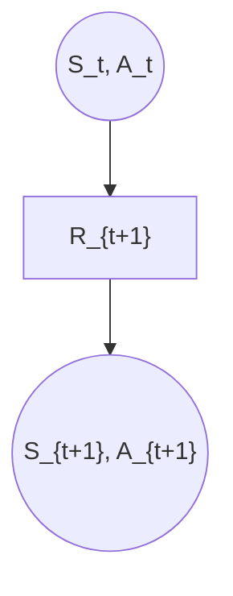
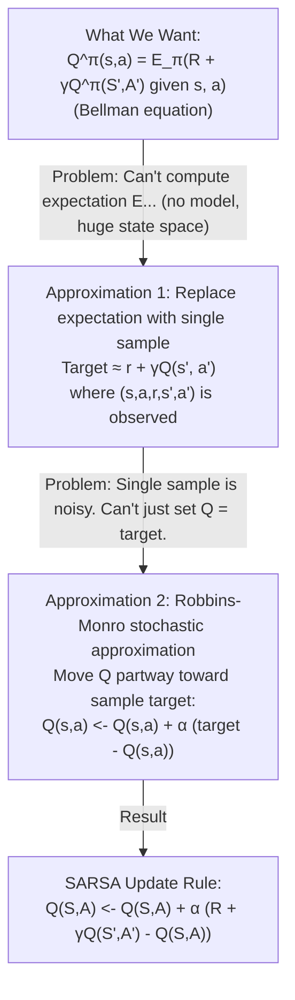

## Table of Contents

- [Context: V(s) vs Q(s,a) — Prediction vs Control](#context-vs-vs-qsa--prediction-vs-control)
- [Unified Comparison: DP, MC, and TD Update Rules](#unified-comparison-dp-mc-and-td-update-rules)
- [TD Prediction](#td-prediction)
  - [The TD(0) Update](#the-td0-update)
  - [TD Error](#td-error)
  - [MC Error as Sum of TD Errors](#mc-error-as-sum-of-td-errors)
  - [Algorithm: Tabular TD(0)](#algorithm-tabular-td0)
- [Advantages of TD Prediction Methods](#advantages-of-td-prediction-methods)
  - [1. No model required (like MC, unlike DP)](#1-no-model-required-like-mc-unlike-dp)
  - [2. Online, incremental (unlike MC)](#2-online-incremental-unlike-mc)
  - [3. Provably convergent](#3-provably-convergent)
  - [4. Empirically faster on Markov tasks](#4-empirically-faster-on-markov-tasks)
- [Optimality of TD(0) — Batch Methods](#optimality-of-td0--batch-methods)
  - [Standard (Incremental) TD(0) vs. Batch TD(0)](#standard-incremental-td0-vs-batch-td0)
  - [Algorithm: Batch TD(0)](#algorithm-batch-td0)
  - [Certainty-Equivalence Estimate](#certainty-equivalence-estimate)
  - [The A-B Example (Example 6.4)](#the-a-b-example-example-64)
  - [The 5-State Random Walk (Example 6.2)](#the-5-state-random-walk-example-62)
- [TD Control](#td-control)
  - [Sarsa: On-policy TD Control](#sarsa-on-policy-td-control)
    - [Algorithm: Sarsa](#algorithm-sarsa)
    - [What does "policy derived from Q" mean?](#what-does-policy-derived-from-q-mean)
    - [Backup Diagram for Sarsa](#backup-diagram-for-sarsa)
    - [Derivation of the SARSA Update Rule from First Principles](#derivation-of-the-sarsa-update-rule-from-first-principles)
  - [Q-learning: Off-policy TD Control](#q-learning-off-policy-td-control)
    - [Algorithm: Q-learning](#algorithm-q-learning)
    - [Backup Diagram for Q-learning](#backup-diagram-for-q-learning)
    - [Why is Q-learning Off-policy?](#why-is-q-learning-off-policy)
  - [Expected Sarsa](#expected-sarsa)
    - [Unifying the Three TD Control Methods](#unifying-the-three-td-control-methods)
  - [Example: Cliff Walking](#example-cliff-walking)
- [Maximization Bias and Double Learning](#maximization-bias-and-double-learning)
  - [The Problem: Maximization Bias](#the-problem-maximization-bias)
    - [Example: The Two-Action MDP (Example 6.7)](#example-the-two-action-mdp-example-67)
  - [Double Q-learning](#double-q-learning)
    - [Algorithm: Double Q-learning](#algorithm-double-q-learning)
- [Unified View: TD, MC, DP](#unified-view-td-mc-dp)
  - [The Backup Diagrams](#the-backup-diagrams)
- [Convergence Theory: TD vs MC](#convergence-theory-td-vs-mc)
- [Summary: Key Equations at a Glance](#summary-key-equations-at-a-glance)
  - [Convergence Guarantees](#convergence-guarantees)

---

## Temporal-Difference Learning

Temporal-Difference (TD) learning is the central and most novel idea in reinforcement learning. It combines two ideas:

- From **Monte Carlo**: learn directly from experience without a model of the environment.
- From **Dynamic Programming**: update estimates based on other learned estimates (bootstrapping) without waiting for a final outcome.

The key innovation: TD methods update their value estimates **at every time step**, using the observed reward and the estimated value of the next state — rather than waiting until the end of an episode to compute the actual return.

---

## Context: V(s) vs Q(s,a) — Prediction vs Control

Before diving into TD, it's important to understand **why** this lecture starts with V(s) and later moves to Q(s,a).

**The fundamental problem:** In model-free RL, an agent cannot improve its policy using V(s) alone. To pick the best action at state s, you'd need to compute:

$$
\pi(s) = \arg\max_a \sum_{s',r} p(s',r \mid s,a)\left[r + \gamma V(s')\right]
$$

This requires the transition model p(s',r∣s,a), which we don't have. That's why all model-free **control** methods (SARSA, Q-learning) estimate Q(s,a) — you can directly pick argmax_a Q(s,a) without any model.

**So why learn V(s) at all?**

1. **Pedagogical clarity** — the TD bootstrapping idea is easier to grasp with V before introducing the (s,a) pair indexing
2. **Actor-Critic methods** — the critic learns V(s) via TD, and the TD error δ = R + γV(S') − V(S) serves as an advantage signal for the actor (used in A2C, PPO, etc.)
3. **With a known model** — if you do have p, you can do DP-style policy improvement over TD-learned V(s)

**The journey through this lecture:**

- **TD Prediction (V):** Learn the core idea — bootstrapping from one-step experience
- **TD Control (Q):** Apply the same idea to Q(s,a) → SARSA, Q-learning — now you can act optimally without a model

---

## Unified Comparison: DP, MC, and TD Update Rules

The table below shows how all major methods relate. They differ in: (1) what they estimate, (2) whether they need a model, (3) whether they bootstrap, and (4) how they do policy evaluation and improvement.

| Method                               | Estimates | Policy Evaluation (update rule)                                           | Policy Improvement                                                              |      Needs Model?      | Bootstraps? |
| ------------------------------------ | --------- | ------------------------------------------------------------------------- | ------------------------------------------------------------------------------- | :--------------------: | :---------: |
| **DP (Policy Eval)**           | V(s)      | $V(s) \leftarrow \sum_{s',r} p(s',r \mid s,\pi(s))[r + \gamma V(s')]$   | $\pi(s) \leftarrow \arg\max_a \sum_{s',r} p(s',r \mid s,a)[r + \gamma V(s')]$ |          Yes          |     Yes     |
| **MC On-Policy**               | Q(s,a)    | $Q(s,a) \leftarrow Q(s,a) + \alpha[G_t - Q(s,a)]$                       | $\pi(s) \leftarrow \arg\max_a Q(s,a)$ with ε-greedy                          |           No           |     No     |
| **MC Off-Policy (OIS)**        | Q(s,a)    | $Q(s,a) \leftarrow Q(s,a) + \alpha[\rho \cdot G_t - Q(s,a)]$            | $\pi(s) \leftarrow \arg\max_a Q(s,a)$ (greedy)                                |           No           |     No     |
| **TD(0) Prediction**           | V(s)      | $V(S) \leftarrow V(S) + \alpha[R + \gamma V(S') - V(S)]$                | Cannot improve without model (used in Actor-Critic as critic)                   |           No           |     Yes     |
| **SARSA (On-policy TD)**       | Q(s,a)    | $Q(S,A) \leftarrow Q(S,A) + \alpha[R + \gamma Q(S',A') - Q(S,A)]$       | $\pi(s) \leftarrow \arg\max_a Q(s,a)$ with ε-greedy                          |           No           |     Yes     |
| **Q-learning (Off-policy TD)** | Q(s,a)    | $Q(S,A) \leftarrow Q(S,A) + \alpha[R + \gamma \max_a Q(S',a) - Q(S,A)]$ | $\pi(s) \leftarrow \arg\max_a Q(s,a)$ (greedy, built into update)             |           No           |     Yes     |
| **TD + Model (Dyna-style)**    | V(s)      | $V(S) \leftarrow V(S) + \alpha[R + \gamma V(S') - V(S)]$                | $\pi(s) \leftarrow \arg\max_a \sum_{s',r} p(s',r \mid s,a)[r + \gamma V(s')]$ | Yes (learned or given) |     Yes     |

**Key observations:**

1. **DP uses V(s) because it has the model** — it can enumerate all actions and their outcomes via p(s',r∣s,a), so V(s) is sufficient for both evaluation and improvement. The improvement step explicitly needs p to compute the argmax over actions.
2. **MC and TD control use Q(s,a) because they are model-free** — without p, you cannot determine which action leads where from V(s) alone. With Q(s,a), improvement is trivial: just pick argmax_a Q(s,a) — no model needed.
3. **TD(0) prediction uses V(s) but cannot do improvement alone** — it teaches bootstrapping. On its own, V(s) cannot drive policy improvement without a model. However, it's essential in Actor-Critic architectures where the actor selects actions and the critic (V) provides the TD error δ as an advantage signal.
4. **Q-learning merges evaluation and improvement** — the max in its update target means it's always evaluating the greedy (optimal) policy, regardless of what the behavior policy does. Evaluation and improvement happen simultaneously in every update.
5. **The update structure is identical across all methods** — whether V or Q, the pattern is always: estimate ← estimate + α[target − estimate]. Only the target and the improvement mechanism change.
6. **TD + Model is the hybrid (Dyna)** — uses TD's efficient sample-based evaluation (no need for full sweeps over all states), but leverages the model for DP-style improvement. The model can be *given* (game rules, physics simulator) or *learned* from experience. This gives: fast evaluation from TD + exact improvement from model. Examples: Dyna-Q (Sutton Ch.8), AlphaGo (known game rules + TD-learned value function), robotics with physics simulators.

---

# TD Prediction

## The TD(0) Update

Given an experience transition $S_t \xrightarrow{A_t} R_{t+1}, S_{t+1}$, the simplest TD method updates:

$$
\boxed{V(S_t) \leftarrow V(S_t) + \alpha \left[ R_{t+1} + \gamma\, V(S_{t+1}) - V(S_t) \right]}
$$

Let's dissect this term by term:

| Term                                       | Meaning                                                                |
| ------------------------------------------ | ---------------------------------------------------------------------- |
| $V(S_t)$                                 | Current estimate of value at state$S_t$                              |
| $\alpha$                                 | Learning rate (step size) — how much to adjust                        |
| $R_{t+1} + \gamma\, V(S_{t+1})$          | **TD target** — a better estimate of what $V(S_t)$ should be  |
| $R_{t+1} + \gamma\, V(S_{t+1}) - V(S_t)$ | **TD error** ($\delta_t$) — how wrong our current estimate is |

**Why is the TD target a better estimate?** It incorporates one step of real experience ($R_{t+1}$) and then bootstraps from the current estimate of the successor ($V(S_{t+1})$). It's an estimate because: (1) it samples the expected value (single transition, not the full sum over all $s', r$), and (2) it uses $V(S_{t+1})$ rather than the true $v_\pi(S_{t+1})$.

**Comparison with MC target:**

| Method | Target                                                                | Must wait for         |
| ------ | --------------------------------------------------------------------- | --------------------- |
| MC     | $G_t = R_{t+1} + \gamma R_{t+2} + \gamma^2 R_{t+3} + \cdots$        | End of episode        |
| TD(0)  | $R_{t+1} + \gamma\, V(S_{t+1})$                                     | Next time step        |
| DP     | $\sum_{s',r} p(s',r \mid s, \pi(s))\left[r + \gamma\, V(s')\right]$ | Nothing (needs model) |

## TD Error

The **TD error** at time step $t$ is:

$$
\delta_t = R_{t+1} + \gamma\, V(S_{t+1}) - V(S_t)
$$

This is the discrepancy between:

- What we now think $S_t$ is worth: $V(S_t)$
- A one-step-better estimate: $R_{t+1} + \gamma\, V(S_{t+1})$

If $\delta_t > 0$: the transition was **better** than expected — increase $V(S_t)$.
If $\delta_t < 0$: the transition was **worse** than expected — decrease $V(S_t)$.
If $\delta_t = 0$: our prediction was exactly right — no update.

The TD error plays a fundamental role throughout RL. It corresponds to the dopamine signal in the brain (reward prediction error — see Chapter 15).

## MC Error as Sum of TD Errors

There is a beautiful relationship between the MC error and TD errors. If $V$ is not updated during the episode (or equivalently, if we save the errors before any updates), then:

$$
G_t - V(S_t) = \sum_{k=t}^{T-1} \gamma^{k-t}\, \delta_k
$$

**Derivation:**

$$
\delta_t = R_{t+1} + \gamma\, V(S_{t+1}) - V(S_t)
$$

$$
\delta_{t+1} = R_{t+2} + \gamma\, V(S_{t+2}) - V(S_{t+1})
$$

Summing with discount factors:

$$
\sum_{k=t}^{T-1} \gamma^{k-t}\, \delta_k = \sum_{k=t}^{T-1} \gamma^{k-t} \left[R_{k+1} + \gamma\, V(S_{k+1}) - V(S_k)\right]
$$

The $\gamma V(S_{k+1})$ of one term cancels with $-V(S_k)$ of the next (telescoping). What remains:

$$
= -V(S_t) + \sum_{k=t}^{T-1} \gamma^{k-t}\, R_{k+1} + \gamma^{T-t}\, V(S_T)
$$

Since $V(S_T) = 0$ (terminal state) and $\sum_{k=t}^{T-1} \gamma^{k-t}\, R_{k+1} = G_t$:

$$
= G_t - V(S_t)
$$

This means: **the MC update (using $G_t$) is equivalent to summing all the TD corrections along the trajectory.** MC does it all at once at the end; TD does it incrementally step by step. If $V$ doesn't change during the episode, they would produce the same total update.

## Algorithm: Tabular TD(0)

```
Input: policy π to evaluate
Initialize V(s) arbitrarily for all s (V(terminal) = 0)
Parameters: step size α ∈ (0, 1]

For each episode:
    Initialize S
    For each step of episode:
        A ← action given by π for S
        Take action A, observe R, S'
        V(S) ← V(S) + α [R + γ V(S') - V(S)]
        S ← S'
    Until S is terminal
```

**Python Implementation:**

```python
def td_0_prediction(env, policy, gamma=1.0, alpha=0.1, num_episodes=1000):
    """
    TD(0) Prediction: Estimate V for a given policy.
  
    Args:
        env: Gymnasium environment.
        policy: Function mapping state -> action.
        gamma: Discount factor.
        alpha: Learning rate.
        num_episodes: Number of episodes to run.
      
    Returns:
        V: Estimated state-value function (dict).
    """
    V = defaultdict(float)
  
    for _ in range(num_episodes):
        state, _ = env.reset()
        done = False
      
        while not done:
            action = policy(state)
            next_state, reward, terminated, truncated, _ = env.step(action)
            done = terminated or truncated
          
            # TD(0) update
            td_target = reward + gamma * V[next_state] * (not done)
            td_error = td_target - V[state]
            V[state] += alpha * td_error
          
            state = next_state
  
    return V
```

---

# Advantages of TD Prediction Methods

## 1. No model required (like MC, unlike DP)

TD learns from raw experience. It does not need $p(s', r \mid s, a)$.

## 2. Online, incremental (unlike MC)

TD updates after **every step**. MC must wait until episode termination to compute $G_t$. This has major practical consequences:

- **Continuing tasks**: MC cannot be applied at all to tasks without terminal states. TD can.
- **Long episodes**: In a 1000-step episode, MC makes zero updates for 999 steps then one big update. TD makes 1000 small updates.
- **Early detection of errors**: If a bad state is reached, TD immediately starts correcting — MC only corrects after the episode finishes (possibly much later).

## 3. Provably convergent

TD(0) converges to $v_\pi$ with probability 1 if:

- Step sizes satisfy the Robbins-Monro conditions: $\sum_t \alpha_t = \infty$ and $\sum_t \alpha_t^2 < \infty$
- Or with constant $\alpha$: converges in the mean

## 4. Empirically faster on Markov tasks

On tasks that satisfy the Markov property, TD typically converges faster than MC because it exploits the structure: the value of a state relates systematically to the values of successor states.

---

# Optimality of TD(0) — Batch Methods

What happens if we have a fixed, finite set of experience (a batch of episodes) and repeatedly apply TD or MC updates to it? 

Under **batch training**, updates are accumulated over the entire dataset, and the value function is updated only after a complete pass (sweep/epoch). This process is repeated until convergence.

## Standard (Incremental) TD(0) vs. Batch TD(0)

The main difference between standard online TD(0) and batch TD(0) lies in the timing of the value function updates and the stability of learning:

*   **Standard TD(0) (Online/Incremental)**:
    *   Updates $V(S)$ immediately after every single transition step: $V(S) \leftarrow V(S) + \alpha [R + \gamma V(S') - V(S)]$.
    *   The new value $V(S)$ is immediately used in the next transition step's update calculation.
    *   Learning is path-dependent and can be noisy on small datasets since individual outliers immediately skew the active value function.
*   **Batch TD(0)**:
    *   Traverses all transitions across all episodes in the batch using a **frozen** value function, accumulating the updates (increments) for each state.
    *   Only updates $V(S)$ once at the end of the full pass (sweep/epoch): $V(S) \leftarrow V(S) + \sum_{t} \Delta_t(S)$.
    *   Repeatedly sweeps through the same batch of data until the value function converges.
    *   Since updates are aggregated before application, learning is order-independent and highly stable.

## Algorithm: Batch TD(0)

```
Given: A fixed batch of episodes D
Initialize V(s) arbitrarily for all states s (V(terminal) = 0)
Parameters: step size α ∈ (0, 1], convergence threshold tolerance > 0

Repeat until convergence (max change in V < tolerance):
    For all states s:
        ΔV(s) ← 0  (Initialize accumulated updates)
        
    For each episode in batch D:
        For each step (S, R, S') in the episode:
            # Accumulate TD error using the frozen value function V
            ΔV(S) ← ΔV(S) + α [R + γ V(S') - V(S)]
            
    # Apply accumulated updates and track max change
    max_delta ← 0
    For each state s:
        max_delta ← max(max_delta, |ΔV(s)|)
        V(s) ← V(s) + ΔV(s)
        
    If max_delta < tolerance:
        Terminate and output V
```

**Python Implementation:**

```python
def batch_td_0_prediction(batch_data, states, gamma=1.0, alpha=0.1, tolerance=1e-4):
    """
    Batch TD(0) Prediction: Estimate V for a fixed batch of episodes.
    
    Args:
        batch_data: List of episodes, where each episode is a list of 
                    (state, reward, next_state, done) tuples.
        states: Set of all non-terminal and terminal states.
        gamma: Discount factor.
        alpha: Learning rate.
        tolerance: Threshold for convergence.
        
    Returns:
        V: Estimated state-value function (dict).
    """
    V = {s: 0.0 for s in states}
    
    while True:
        delta_V = {s: 0.0 for s in states}
        
        # Sweep through the entire batch using the current (frozen) V
        for episode in batch_data:
            for state, reward, next_state, done in episode:
                val_next = 0.0 if done else V[next_state]
                td_error = reward + gamma * val_next - V[state]
                delta_V[state] += alpha * td_error
                
        # Update V after the complete sweep
        max_change = 0.0
        for s in states:
            max_change = max(max_change, abs(delta_V[s]))
            V[s] += delta_V[s]
            
        # Check for convergence
        if max_change < tolerance:
            break
            
    return V
```

## Certainty-Equivalence Estimate

When trained on a batch until convergence:

*   **Batch MC**: Converges to the values that minimize the mean-squared error on the observed returns in the training data:
    $$\min_V \sum_t (G_t - V(S_t))^2$$
*   **Batch TD(0)**: Converges to the **certainty-equivalence estimate** — the correct values for the maximum-likelihood MDP model estimated from the data.
    *   Even though TD is model-free, batch TD(0) converges to the exact solution of the Bellman equations for an empirical MDP model whose transition probabilities $\hat{P}_{ss'}^a$ and expected rewards $\hat{R}_s^a$ are computed from transition frequencies in the dataset.

## The A-B Example (Example 6.4)

Consider this batch of 8 episodes of experience:

```
Episode 1:  A, 0, B, 0   (From state A, get reward 0, transition to B, get reward 0, terminate)
Episode 2:  B, 1         (From state B, get reward 1, terminate)
Episode 3:  B, 1
Episode 4:  B, 1
Episode 5:  B, 1
Episode 6:  B, 1
Episode 7:  B, 1
Episode 8:  B, 0         (From state B, get reward 0, terminate)
```

What is the estimated value of state $A$, $V(A)$?

*   **Batch MC** gives $V(A) = 0$. 
    *   State $A$ was seen only once (in Episode 1), and the actual return following it was $0$. MC fits this training return perfectly, minimizing the MSE.
*   **Batch TD(0)** gives $V(A) = 0.75$.
    *   State $B$ was visited 8 times, and 6 times it transitioned to termination with a reward of 1. So, the empirical estimate is $V(B) = 6/8 = 0.75$.
    *   The empirical transition model indicates $A$ always goes to $B$ with reward $0$ (probability 1.0).
    *   Under the Markov assumption and setting $\gamma = 1$, the Bellman equation is $V(A) = R(A \to B) + \gamma V(B) = 0 + 0.75 = 0.75$.

Batch TD is superior for **future prediction** when the environment is Markovian because it exploits state-to-state transition structure, leveraging the larger sample size of state $B$ to construct a more accurate estimate for state $A$.

## The 5-State Random Walk (Example 6.2)

```
          A     B     C     D     E
    ←─────┼─────┼─────┼─────┼─────┼─────→
 Terminal                              Terminal
 (reward 0)                           (reward 1)
```

- 5 non-terminal states, each with equal probability of stepping left or right
- Left terminal gives reward 0, right terminal gives reward 1, all other rewards are 0
- True values: $V(A) = 1/6$, $V(B) = 2/6$, $V(C) = 3/6$, $V(D) = 4/6$, $V(E) = 5/6$
- **Result**: TD(0) consistently produces lower RMS error than MC across all reasonable learning rates

---

# TD Control

TD prediction gives us a way to estimate $V_\pi$. For **control** (finding the optimal policy), we need action values $Q(s,a)$ and we use the familiar GPI (Generalized Policy Iteration) framework: evaluate → improve → evaluate → ...

## Sarsa: On-policy TD Control

**Named after the quintuple**: $(S_t, A_t, R_{t+1}, S_{t+1}, A_{t+1})$ — everything needed for one update.

$$
\boxed{Q(S_t, A_t) \leftarrow Q(S_t, A_t) + \alpha \left[ R_{t+1} + \gamma\, Q(S_{t+1}, A_{t+1}) - Q(S_t, A_t) \right]}
$$

**Key property**: Sarsa is **on-policy** — it evaluates and improves the policy it is currently following. If the policy explores (e.g., $\varepsilon$-greedy), Sarsa's Q-values reflect the cost of that exploration.

### Algorithm: Sarsa

```
Initialize Q(s,a) arbitrarily for all s, a (Q(terminal, ·) = 0)
Parameters: step size α ∈ (0, 1], small ε > 0

For each episode:
    Initialize S
    Choose A from S using policy derived from Q (e.g., ε-greedy)
    For each step of episode:
        Take action A, observe R, S'
        Choose A' from S' using policy derived from Q (ε-greedy)
        Q(S,A) ← Q(S,A) + α [R + γ Q(S',A') - Q(S,A)]
        S ← S';  A ← A'
    Until S is terminal
```

### What does "policy derived from Q" mean?

In Sarsa, the instruction **"Choose action $A$ using a policy derived from $Q$"** can be broken down into three key aspects:

1. **How the choice is made at a single time step:**
   * At any given decision point, the agent does **not** execute multiple actions. It must select and execute exactly **one** discrete action $A$ from the set of available actions.
   * The policy $\pi(a \mid s)$ defines a probability distribution over actions based on the current estimated values $Q(s, a)$. The agent samples a single action $A \sim \pi(a \mid S)$ to execute.
   * The most common derivation is the **$\varepsilon$-greedy policy**:
     * With probability $1 - \varepsilon$: Choose the greedy action $A = \arg\max_a Q(S, a)$.
     * With probability $\varepsilon$: Choose a random action uniformly from all possible actions in $S$.
   * Another example is the **softmax (Boltzmann) policy**, where selection probability is proportional to action values:
     $$\pi(a \mid s) = \frac{e^{Q(s, a) / \tau}}{\sum_{a'} e^{Q(s, a') / \tau}}$$

2. **Why we say "all actions will be selected" (Exploration over time):**
   * Even though the agent chooses only one action at each step, to guarantee convergence to the optimal values, it must visit every state-action pair infinitely many times during training. 
   * The exploratory mechanism (like the $\varepsilon$ random choice) ensures that **over the long run of many steps/episodes**, every action has a non-zero probability of being tried, so we can correctly estimate all $Q(s, a)$ values.

3. **The "On-Policy" Connection:**
   * In Sarsa, the action $A'$ used to calculate the TD target in the update rule:
     $$Q(S, A) \leftarrow Q(S, A) + \alpha [R + \gamma Q(S', A') - Q(S, A)]$$
     is the **exact same action** that was selected by the policy and actually executed in the next step. Sarsa updates its value estimates based on the action it *actually* took, including exploratory errors.

**Python Implementation:**

```python
def sarsa(env, gamma=1.0, alpha=0.1, epsilon=0.1, num_episodes=1000):
    """
    Sarsa: On-policy TD Control.
    """
    Q = defaultdict(lambda: np.zeros(env.action_space.n))
  
    def epsilon_greedy(state):
        if np.random.random() < epsilon:
            return env.action_space.sample()
        return np.argmax(Q[state])
  
    for _ in range(num_episodes):
        state, _ = env.reset()
        action = epsilon_greedy(state)
        done = False
      
        while not done:
            next_state, reward, terminated, truncated, _ = env.step(action)
            done = terminated or truncated
            next_action = epsilon_greedy(next_state)
          
            # Sarsa update: use the action actually taken next
            td_target = reward + gamma * Q[next_state][next_action] * (not done)
            td_error = td_target - Q[state][action]
            Q[state][action] += alpha * td_error
          
            state = next_state
            action = next_action
  
    return Q
```

### Backup Diagram for Sarsa


```mermaid
graph TD
    sa(("S_t, A_t")) --> r["R_{t+1}"]
    r --> sa_next(("S_{t+1}, A_{t+1}"))
```

The update uses the **specific** next action $A_{t+1}$ that was actually selected by the policy. This is what makes it on-policy.

---

### Derivation of the SARSA Update Rule from First Principles

The SARSA update rule is not arbitrary — it emerges necessarily from three foundational components:

1. The **Bellman equation** for action-values (what we want to estimate)
2. **Sampling** (replacing the intractable expectation with a single observed transition)
3. **Stochastic approximation** (the Robbins-Monro framework for iterative convergence)

Below we derive the rule rigorously, showing exactly where each piece of the formula comes from.

---

#### Foundation 1: The Action-Value Function

The action-value function under policy $\pi$ is defined as:

$$
Q^\pi(s, a) \doteq \mathbb{E}_\pi\left[G_t \mid S_t = s, A_t = a\right]
$$

where $G_t$ is the infinite-horizon discounted return:

$$
G_t = R_{t+1} + \gamma R_{t+2} + \gamma^2 R_{t+3} + \cdots = \sum_{k=0}^{\infty} \gamma^k R_{t+k+1}
$$

This is the quantity we wish to estimate. It tells us: "If I'm in state $s$, I take action $a$, and then follow $\pi$ forever — what is the expected cumulative discounted reward?"

---

#### Foundation 2: The Bellman Equation for Q

We decompose $G_t$ by separating the first reward from the rest:

$$
G_t = R_{t+1} + \gamma G_{t+1}
$$

Substituting into the definition of $Q^\pi$:

$$
Q^\pi(s, a) = \mathbb{E}_\pi\left[R_{t+1} + \gamma G_{t+1} \mid S_t = s, A_t = a\right]
$$

Now, $G_{t+1}$ depends on the next state $S_{t+1}$ and the next action $A_{t+1}$ chosen by $\pi$. By the tower property of conditional expectation:

$$
G_{t+1} \text{ given } S_{t+1} = s', A_{t+1} = a' \text{ has expectation } Q^\pi(s', a')
$$

Therefore:

$$
\boxed{Q^\pi(s, a) = \mathbb{E}_\pi\left[R_{t+1} + \gamma\, Q^\pi(S_{t+1}, A_{t+1}) \mid S_t = s, A_t = a\right]}
$$

This is the **Bellman equation for the action-value function**. It is exact — if we could solve it, we'd have the true $Q^\pi$.

**What this equation says:** The value of being in $(s, a)$ equals the expected immediate reward plus the discounted value of wherever you end up next and whatever action you take there.

**Expanding the expectation explicitly** (showing what makes this intractable):

$$
Q^\pi(s, a) = \sum_{s', r} p(s', r \mid s, a) \left[ r + \gamma \sum_{a'} \pi(a' \mid s')\, Q^\pi(s', a') \right]
$$

This requires:

- The transition model $p(s', r \mid s, a)$ — which we don't have (model-free setting)
- Summation over all possible next states — which may be enormous or continuous

---

#### Foundation 3: From Expectation to Sampling

Since we cannot compute the expectation (no model, potentially infinite state space), we replace it with a **single sample**. This is the key step from DP → TD.

At time $t$, the agent experiences one actual transition:

$$
(S_t, A_t) \xrightarrow{} R_{t+1}, S_{t+1} \xrightarrow{\pi} A_{t+1}
$$

This gives us ONE realization of what's inside the expectation. We form the **sample-based target**:

$$
\hat{q}_t \doteq R_{t+1} + \gamma\, Q(S_{t+1}, A_{t+1})
$$

**Why is this a valid estimator?** Under the Bellman equation:

$$
\mathbb{E}\left[\hat{q}_t \mid S_t = s, A_t = a\right] = Q^\pi(s, a)
$$

provided $Q = Q^\pi$. So $\hat{q}_t$ is an **unbiased estimate** of the true Q-value (when Q is converged). During learning, it's biased (since Q is itself an estimate — this is the bootstrapping bias), but it still gives a useful learning signal.

**The relationship to DP:**

| Quantity                                                                                | What it computes | Requires       |
| --------------------------------------------------------------------------------------- | ---------------- | -------------- |
| DP target:$\sum_{s',r} p(s',r\mid s,a)[r + \gamma \sum_{a'} \pi(a'\mid s') Q(s',a')]$ | Full expectation | Model$p$     |
| TD target:$R_{t+1} + \gamma\, Q(S_{t+1}, A_{t+1})$                                    | Single sample    | One transition |

The TD target is a **Monte Carlo sample** of the DP target. Each individual sample is noisy, but on average (over many visits to $(s, a)$) it equals the DP target.

---

#### Foundation 4: Stochastic Approximation (Robbins-Monro)

We now have a noisy estimate $\hat{q}_t$ of the true $Q^\pi(s,a)$. How do we iteratively converge to the correct value?

The **Robbins-Monro stochastic approximation** theorem (1951) provides the answer. Given:

- A quantity $\theta^\ast$ we want to find
- Noisy observations $X_n$ such that $\mathbb{E}[X_n \mid \theta_n] = f(\theta_n)$ where $f(\theta^\ast) = 0$

The iterative scheme:

$$
\theta_{n+1} = \theta_n + \alpha_n\, X_n
$$

converges to $\theta^\ast$ provided:

1. $\sum_{n} \alpha_n = \infty$ (step sizes are large enough to eventually reach any value)
2. $\sum_{n} \alpha_n^2 < \infty$ (step sizes decrease fast enough to dampen noise)

**Applying this to our problem:**

We want to find $Q^\pi(s,a)$ such that $\mathbb{E}[\hat{q}_t - Q(s,a)] = 0$ (the error is zero on average when Q is correct).

Let $X_n = \hat{q}_t - Q(S_t, A_t)$ be the "error signal." Then:

$$
Q(S_t, A_t) \leftarrow Q(S_t, A_t) + \alpha\, \underbrace{\left[\hat{q}_t - Q(S_t, A_t)\right]}_{\text{error signal}}
$$

Expanding $\hat{q}_t$:

$$
\boxed{Q(S_t, A_t) \leftarrow Q(S_t, A_t) + \alpha \left[ R_{t+1} + \gamma\, Q(S_{t+1}, A_{t+1}) - Q(S_t, A_t) \right]}
$$

This is the **SARSA update rule**.

---

#### Anatomy of the Final Formula

$$
Q(S_t, A_t) \leftarrow Q(S_t, A_t) + \alpha \left[ \underbrace{R_{t+1} + \gamma\, Q(S_{t+1}, A_{t+1})}_{\text{TD target (where we should be)}} - \underbrace{Q(S_t, A_t)}_{\text{current estimate (where we are)}} \right]
$$

| Component                                  | Origin              | Role                                                           |
| ------------------------------------------ | ------------------- | -------------------------------------------------------------- |
| $Q(S_t, A_t)$                            | Current estimate    | Starting point — what we currently believe                    |
| $R_{t+1}$                                | Observed reward     | One step of ground truth from the environment                  |
| $\gamma\, Q(S_{t+1}, A_{t+1})$           | Bootstrapped future | Estimated value of what comes next (from the Bellman equation) |
| $R_{t+1} + \gamma Q(S_{t+1}, A_{t+1})$   | TD target           | Sample-based estimate of the true$Q^\pi(S_t, A_t)$           |
| $\delta_t = \text{target} - Q(S_t, A_t)$ | TD error            | How wrong we are — the surprise signal                        |
| $\alpha$                                 | Learning rate       | How much to trust the new evidence vs. old belief              |
| $\alpha\, \delta_t$                      | Increment           | The actual adjustment to our estimate                          |

---

#### Why Each Piece is Necessary

**Without $R_{t+1}$ (no real experience):** We'd be updating estimates from estimates alone — no grounding in reality. The update would circulate in a self-reinforcing loop.

**Without $\gamma Q(S_{t+1}, A_{t+1})$ (no bootstrapping):** We'd need to wait for the entire return $G_t$ — this becomes Monte Carlo. Bootstrapping lets us update at every step.

**Without $-Q(S_t, A_t)$ (no error term):** The update would always add to Q regardless of whether the current estimate is already correct. The error term ensures convergence: when $Q = Q^\pi$, the expected error is zero and updates average out.

**Without $\alpha$ (full replacement):** A single noisy sample would completely overwrite the estimate. With stochastic transitions, consecutive samples from the same $(s,a)$ give different targets. $\alpha < 1$ smooths across samples.

---

#### The Derivation Chain (Summary)


```mermaid
graph TD
    A["What We Want:<br>Q^π(s,a) = E_π(R + γQ^π(S',A') given s, a)<br>(Bellman equation)"]
    
    A -->|"Problem: Can't compute expectation E... (no model, huge state space)"| B["Approximation 1: Replace expectation with single sample<br>Target ≈ r + γQ(s', a')  where (s,a,r,s',a') is observed"]
    
    B -->|"Problem: Single sample is noisy. Can't just set Q = target."| C["Approximation 2: Robbins-Monro stochastic approximation<br>Move Q partway toward sample target:<br>Q(s,a) <- Q(s,a) + α (target - Q(s,a))"]
    
    C -->|"Result"| D["SARSA Update Rule:<br>Q(S,A) <- Q(S,A) + α (R + γQ(S',A') - Q(S,A))"]
```

---

#### Convergence Guarantee

Under the following conditions, SARSA converges to $Q^\pi$ (for a fixed $\pi$) or to $Q^\ast$ (with GLIE policy):

1. **All state-action pairs visited infinitely often:** Every $(s,a)$ must be sampled enough times for the law of large numbers to take effect.
2. **Step-size conditions