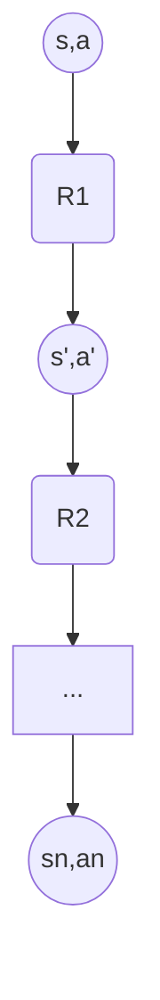
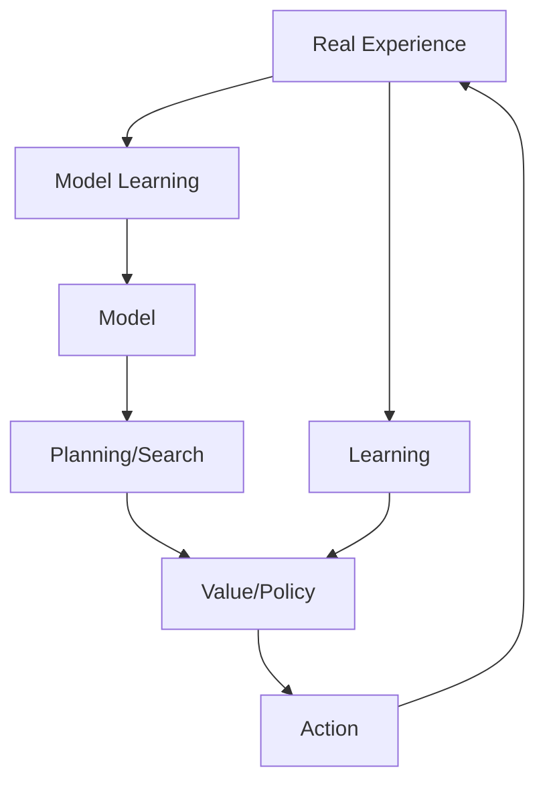

# Lecture 5: n-step Bootstrapping & Planning with Tabular Methods
**Date:** 2026-05-23  
**Reference:** Sutton & Barto, Chapters 7 & 8 (2nd Edition)

---

## Table of Contents
- [Lecture 5: n-step Bootstrapping \& Planning with Tabular Methods](#lecture-5-n-step-bootstrapping--planning-with-tabular-methods)
  - [Table of Contents](#table-of-contents)
- [Chapter 7: n-step Bootstrapping](#chapter-7-n-step-bootstrapping)
    - [7.1 n-step TD Prediction](#71-n-step-td-prediction)
      - [Figure 7.2: 19-state Random Walk](#figure-72-19-state-random-walk)
    - [7.2 n-step Sarsa](#72-n-step-sarsa)
    - [7.3 n-step Off-policy Learning](#73-n-step-off-policy-learning)
    - [7.4 \*Per-decision Methods with Control Variates](#74-per-decision-methods-with-control-variates)
    - [7.5 Off-policy Learning Without Importance Sampling: The n-step Tree Backup Algorithm](#75-off-policy-learning-without-importance-sampling-the-n-step-tree-backup-algorithm)
    - [7.6 \*A Unifying Algorithm: n-step Q(σ)](#76-a-unifying-algorithm-n-step-qσ)
- [Chapter 8: Planning and Learning with Tabular Methods](#chapter-8-planning-and-learning-with-tabular-methods)
    - [8.1 Models and Planning](#81-models-and-planning)
    - [8.2 Dyna: Integrated Planning, Acting, and Learning](#82-dyna-integrated-planning-acting-and-learning)
      - [Figure 8.2: Dyna-Q Maze](#figure-82-dyna-q-maze)
    - [8.3 When the Model is Wrong](#83-when-the-model-is-wrong)
    - [8.4 Prioritized Sweeping](#84-prioritized-sweeping)
    - [8.5 Expected vs. Sample Updates](#85-expected-vs-sample-updates)
    - [8.6 Trajectory Sampling](#86-trajectory-sampling)
    - [8.7 Real-time Dynamic Programming (RTDP)](#87-real-time-dynamic-programming-rtdp)
    - [8.8 Planning at Decision Time](#88-planning-at-decision-time)
    - [8.11 Monte Carlo Tree Search (MCTS)](#811-monte-carlo-tree-search-mcts)
- [Summary: The Dimensions of Reinforcement Learning](#summary-the-dimensions-of-reinforcement-learning)
  - [Practice Exercises](#practice-exercises)

---

# Chapter 7: n-step Bootstrapping

n-step methods unify **Monte Carlo (MC)** and **Temporal-Difference (TD)** methods. Instead of updating based on just the next reward (1-step TD) or the entire episode (MC), we update based on $n$ steps of experience.

### 7.1 n-step TD Prediction
The n-step return $G_{t:t+n}$ is defined as:
$$G_{t:t+n} \doteq R_{t+1} + \gamma R_{t+2} + \dots + \gamma^{n-1} R_{t+n} + \gamma^n V_{t+n-1}(S_{t+n})$$

**Update Rule:**
$$V_{t+n}(S_t) \doteq V_{t+n-1}(S_t) + \alpha [G_{t:t+n} - V_{t+n-1}(S_t)]$$

- **n=1:** Reduces to standard TD(0).
- **n=∞:** Reduces to Monte Carlo.
- **Error Reduction Property:** The n-step return is a better estimate of the true value than $V$ itself, with the error being reduced by at least $\gamma^n$.

#### Figure 7.2: 19-state Random Walk
Intermediate values of $n$ (like $n=4$ or $n=8$) typically perform better than both 1-step TD and MC. This creates a "U-shaped" curve when plotting error against the step-size $\alpha$.

```python
# From assets/n_step_td_random_walk.py
# Simulates Figure 7.2
```

### 7.2 n-step Sarsa
n-step Sarsa extends the n-step return to action values:
$$G_{t:t+n} \doteq R_{t+1} + \dots + \gamma^{n-1} R_{t+n} + \gamma^n Q_{t+n-1}(S_{t+n}, A_{t+n})$$

**Backup Diagram:**


### 7.3 n-step Off-policy Learning
To learn about a target policy $\pi$ from behavior policy $b$, we use the importance sampling ratio for the $n$ steps:
$$\rho_{t:t+n-1} \doteq \prod_{k=t}^{\min(t+n-1, T-1)} \frac{\pi(A_k\mid S_k)}{b(A_k\mid S_k)}$$

### 7.4 *Per-decision Methods with Control Variates
A more sophisticated way to handle off-policy n-step learning that reduces variance by applying importance sampling to individual rewards rather than the whole return.

### 7.5 Off-policy Learning Without Importance Sampling: The n-step Tree Backup Algorithm
The Tree Backup algorithm performs an update by branching at each step, considering all possible actions at each state, weighted by their probability under the target policy. It does **not** require importance sampling.

### 7.6 *A Unifying Algorithm: n-step Q(σ)
Unifies Sarsa (full sample), Expected Sarsa (full expectation), and Tree Backup by introducing a parameter $\sigma_t$ at each step to decide whether to sample or take an expectation.

---

# Chapter 8: Planning and Learning with Tabular Methods

This chapter integrates **learning** (from real experience) and **planning** (from simulated experience using a model).

### 8.1 Models and Planning
- **Distribution Model:** Provides the full probability distribution $p(s', r \mid s, a)$.
- **Sample Model:** Provides a single sample $(s', r)$ following the distribution.
- **Planning:** Any process that takes a model as input and produces or improves a policy.

### 8.2 Dyna: Integrated Planning, Acting, and Learning
**Dyna-Q** is the classic architecture where real experience is used to:
1. Update the value function (Learning).
2. Update the model (Model Learning).
3. Generate "imaginary" experience to update the value function (Planning).



#### Figure 8.2: Dyna-Q Maze
More planning steps ($n$) per real step lead to dramatically faster convergence in terms of the number of episodes.

### 8.3 When the Model is Wrong
If the environment is non-stationary, the model becomes stale.
- **Dyna-Q+:** Adds an exploration bonus $\kappa\sqrt{\tau}$ to the reward in planning, where $\tau$ is the time since a state-action pair was last tried. This encourages the agent to re-examine "old" transitions.

### 8.4 Prioritized Sweeping
Instead of sampling state-action pairs uniformly during planning, we prioritize those whose values are likely to change significantly (based on the magnitude of the TD error in previous updates).

### 8.5 Expected vs. Sample Updates
- **Expected updates (DP):** Compute a full expectation over all next states. Accurate but expensive as the branching factor $b$ increases.
- **Sample updates (TD):** Use a single sample. Cheaper and often more efficient when computation is the bottleneck.

### 8.6 Trajectory Sampling
Focuses planning on states that the agent is likely to actually visit by following its current policy, rather than updating all states in the state space uniformly.

### 8.7 Real-time Dynamic Programming (RTDP)
An on-policy trajectory-sampling version of value iteration. It converges to optimal values only for states that are reachable from the start states.

### 8.8 Planning at Decision Time
Planning can be done just-in-time when a decision is needed, rather than background planning.

### 8.11 Monte Carlo Tree Search (MCTS)
A powerful rollout algorithm that builds a tree of possible future trajectories, focusing on the most promising ones.
1. **Selection:** Traverse the tree to a leaf using a selection rule (e.g., UCB).
2. **Expansion:** Add one or more child nodes.
3. **Simulation:** Run a "rollout" to the end of the episode using a default policy.
4. **Backup:** Propagate the result back up the tree.

---

# Summary: The Dimensions of Reinforcement Learning

Part I of the book identifies the fundamental dimensions of RL methods:

| Dimension | Option A | Option B |
| :--- | :--- | :--- |
| **Update Type** | Sample (MC, TD) | Expected (DP) |
| **Bootstrapping** | No (MC) | Yes (TD, DP) |
| **Policy** | On-policy (Sarsa) | Off-policy (Q-learning) |
| **Horizon** | 1-step | n-step / Infinity (MC) |
| **Experience Source** | Real (Learning) | Simulated (Planning) |

The **Dyna** architecture and **n-step bootstrapping** are the key tools that allow us to navigate these dimensions and find the best algorithm for a given problem.

---

## Practice Exercises

Test your understanding of $n$-step bootstrapping and planning with these exercises:

- [Multiple Choice Questions (MCQs)](./assets/questions/mcqs.md)
- [Subjective Questions](./assets/questions/subjective.md)
- [Numerical Questions](./assets/questions/numericals.md)
- [Programming Questions](./assets/questions/programming.md)

*Solutions can be found in the [assets/questions/solutions/](./assets/questions/solutions/) folder.*

---
*Reference: Sutton, R. S., & Barto, A. G. (2018). Reinforcement Learning: An Introduction. MIT Press.*
