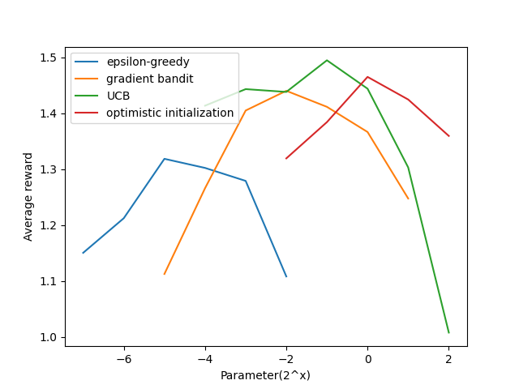

## Today's conversations - 5/2/26 
## MAB - multi arm bandit - K armed bandit problem

### Evaluative Approach 
The most important feature distinguishing RL from other types of learning is that it uses training information to evaluate policies (Actions) instead of instructing (supervised learning) what is the correct action. This creates the need for active exploration and explicit search for an specific objective. Purely evaluative feedback indicates how good the action taken was but not whether it was the best and worst action. Note V(s) was stochastic distribution. And a high value of V(s) at any state is basically giving an average value indicator of how good is that state. but it does not give us a way to find the best and worst value V*. Same is the case with Q(s,a) and Q*(s,a).

### K-armed Bandit Problem or Multi Armed Bandit Problem 
It is a non-associative, evaluative feedback problem. You are faced repeatedly with a choice **among k different options (Actions)**. After each choice you receive a numerical reward chosen from a **stationary probability distribution** that depends on the action that you selected. your objective is to maximize total expected reward over **some time period**, for example over 1000 action selections, or time steps. Through repeated action selections you are to maximize your winnings by concentrating your actions on the best levers. 

### $q_*(a,s)$ vs $Q(a,s)$ 
Each of the k-actions has an expected or mean reward given that that action is selected; this is called **value** of the action - **$q_*(a)$**. This is the true value of the action, which is unknown to the agent.  
$$\mathbb{E}[R_t | A_t = a] = q_*(a)$$
The agent estimates the value of each action based on the rewards received when that action was selected. This estimate is denoted as **$Q_t(a)$**, which is the estimated value of action a at time t. The agent updates this estimate based on the rewards received after selecting action a.

### Greedy actions / exploitation / exploration
If you maintain the **estimates of the action values $Q(s,a)$**, then at any time step, there is at-least one action whose estimated value is greatest. We call that **greedy action**. If you select one of these actions, we say that you are **exploiting your current knowledge of the values of the actions**.
if instead you select one of the non-greedy actions, then we say you are **exploring**, because this enables you to improve your estimate of the non greedy action's value. 
**Exploitation** is the right thing to do to maximize the expected reward on the one step. But **Exploration** may produce the greater total reward in the long run. If you have many time steps ahead on which to make action selections, then it may be better to explore the non greedy actions and discover which of them are better than the greedy actions. Exploitation and Exploration need to be balanced. 

### Action Value Methods
The average of all past rewards is known as the action value at any given time step t.
$$ Q_t(a) = \frac{sum \ of \ rewards \ when \ action \ a \ taken \ prior \ to \ t }{number \ of \ times \ action \ a \ taken \ prior \ to \ t} = \frac{\sum_{i=1}^{t-1} R_i \cdot \mathbb{1}_{A_i=a}}{\sum_{i=1}^{t-1}\mathbb{1}_{A_i=a}} $$

### Greedy action 
$$ A_t = \argmax_a Q_t(a)$$

### $\epsilon$ greedy method - Exploration Vs Exploitation

**Exploration** is about randomly selecting any action without paying any heed to its $Q(a,s)$

**Exploitation** is about selecting the **greedy action**, i.e., selecting the action whoose $Q(a,s)$ is the highest. 

We need to exploit actively, i.e. $\epsilon$ should be bigger, if the following is true - 
1. high variance in the rewards. 
2. $q_*(s,a)$ changes over time. 

But in most of the practical cases, we might have to keep adjusting $\epsilon$ 

### 10-Armed Testbed (Section 2.3)

*Code: [ten_armed_testbed.py](./assets/ten_armed_testbed.py) — generates all figures below (2000 runs × 1000 steps each)*

#### How the testbed is constructed

The `Bandit` class models one instance of the 10-armed bandit problem:

- **True action values** $q_*(a)$ are sampled once per run from $\mathcal{N}(0, 1)$.
- When action $a$ is selected, the **reward** is drawn from $\mathcal{N}(q_*(a), 1)$ — a noisy version of the true value.

The violin plot below (Figure 2.1) shows one such randomly generated problem. Each violin represents the reward distribution for one arm. The center sits at $q_*(a)$, and the spread reflects the unit-variance noise.

The agent does **not** see these distributions. It must estimate them from sampled rewards. The overlap between distributions means a single reward sample can be misleading — an inferior arm can occasionally return a higher reward than the best arm.

#### Figure 2.2: $\epsilon$-Greedy Methods Compared

Three settings are compared, all using **sample averages** to estimate action values:

| Strategy | $\epsilon$ | Behavior |
|----------|-----------|----------|
| Pure greedy | 0.00 | Never explores — always exploits current estimates |
| Moderate exploration | 0.10 | Explores 10% of the time |
| Light exploration | 0.01 | Explores 1% of the time |

**Results:**
- **Greedy ($\epsilon = 0$)**: Learns quickly at first but gets stuck. It locks onto whichever action *happened* to look best early on and never corrects. Finds the optimal action only ~35% of the time.
- **$\epsilon = 0.10$**: Explores frequently, reliably discovers the best arm. Achieves highest long-run % optimal action (~80%). But even after finding the best action, it still wastes 10% of steps on random arms.
- **$\epsilon = 0.01$**: Slower but steadier. Given enough time, it would likely match or surpass $\epsilon = 0.10$ in average reward because it wastes less on known-bad arms.

**Takeaway**: Some exploration is essential. A purely greedy agent performs significantly worse in the long run.

#### Figure 2.4: Upper-Confidence-Bound (UCB) Action Selection (Section 2.7)

*Code: [ucb_action_selection.py](./assets/ucb_action_selection.py) — standalone UCB vs $\epsilon$-greedy comparison*

**The key difference**: $\epsilon$-greedy has two separate branches — exploit (greedy) vs explore (random). UCB **merges both into a single argmax** by adding an uncertainty bonus to each action's value estimate. There is no random branch at all.

**$\epsilon$-greedy (vanilla) — two separate branches:**

$$A_t = \begin{cases} \argmax_a Q_t(a) & \text{with probability } 1 - \epsilon \quad \textbf{(exploit: pick best estimate)} \\ \text{random action from } \{1, \ldots, k\} & \text{with probability } \epsilon \quad \textbf{(explore: blind random choice)} \end{cases}$$

The exploration branch knows **nothing** about which arms need more exploration — it picks uniformly at random. An arm tried once gets the same probability as an arm tried 500 times.

**UCB — single branch, no randomness:**

$$A_t = \argmax_a \underbrace{\left[ \underbrace{Q_t(a)}_{\text{exploitation}} + \underbrace{c \sqrt{\frac{\ln t}{N_t(a)}}}_{\text{exploration bonus}} \right]}_{\text{combined score for each arm}}$$

- $Q_t(a)$ = estimated value (same as the greedy term in $\epsilon$-greedy)
- $N_t(a)$ = number of times action $a$ has been selected
- $t$ = total steps so far
- $c > 0$ = controls exploration degree (here $c = 2$)

There is **no coin flip**, no random selection. Every step is a greedy argmax — but over a **modified score** that inflates the value of under-explored arms.

**How the bonus works:**
- An arm tried **rarely** ($N_t(a)$ small) → $\sqrt{\ln t / N_t(a)}$ is **large** → bonus inflates its score → gets selected even if $Q_t(a)$ is low
- An arm tried **often** ($N_t(a)$ large) → bonus **shrinks** → arm must win on its own merit via $Q_t(a)$
- As $t$ grows, $\ln t$ grows slowly → even well-explored arms eventually get a non-zero bonus, ensuring every arm is revisited occasionally

**Side-by-side comparison:**

| | $\epsilon$-greedy | UCB |
|--|-------------------|-----|
| **Exploration mechanism** | Random coin flip ($\epsilon$) | Uncertainty bonus $c\sqrt{\ln t / N_t(a)}$ |
| **Explore branch** | Uniform random — any arm equally | No separate branch — directed via bonus |
| **Exploit branch** | $\argmax_a Q_t(a)$ | Same $Q_t(a)$, but augmented with bonus |
| **Knows which arms need exploring?** | No | Yes — targets under-sampled arms |
| **Action selection** | Stochastic (random with prob $\epsilon$) | Deterministic (always argmax of combined score) |
| **Suited for** | Stationary and non-stationary | **Stationary only** |

**Results**: UCB consistently outperforms $\epsilon$-greedy, especially in the first few hundred steps where **directed** exploration matters most. Its limitation: UCB is designed for **stationary** bandits — the confidence term $c\sqrt{\ln t / N_t(a)}$ shrinks as $N_t(a)$ grows, assuming more samples means better estimates. In a non-stationary environment, old samples are misleading but UCB still trusts them. It is also harder to extend to full RL with large state spaces.

#### Figure 2.5: Gradient Bandit Algorithms (Section 2.8)

Instead of estimating action *values*, learn a **preference** $H_t(a)$ for each action and select via softmax:

$$\Pr(A_t = a) = \frac{e^{H_t(a)}}{\sum_b e^{H_t(b)}} = \pi_t(a)$$

Update rule (stochastic gradient ascent on expected reward):

$$H_{t+1}(a) = H_t(a) + \alpha (R_t - \bar{R}_t)(\mathbb{1}_{A_t=a} - \pi_t(a))$$

where $\bar{R}_t$ is the average of all past rewards (the **baseline**). Tested with true reward shifted to $+4$ to make the baseline critical:

| Config | $\alpha$ | Baseline? |
|--------|---------|-----------|
| 1 | 0.1 | Yes |
| 2 | 0.1 | No |
| 3 | 0.4 | Yes |
| 4 | 0.4 | No |

**Results**: Without a baseline, all rewards are positive (true means ~4), so the algorithm treats *every* outcome as positive reinforcement and fails to differentiate good from bad. The baseline is not optional — it is essential for the algorithm to work.

#### Figure 2.6: Parameter Study — Comparing All Methods (Section 2.10)

Each method's key parameter is swept over a range ($2^x$), run for 1000 steps × 2000 runs:

| Method | Parameter swept | Range ($2^x$) |
|--------|----------------|---------------|
| $\epsilon$-greedy | $\epsilon$ | $2^{-7}$ to $2^{-2}$ |
| Gradient bandit | $\alpha$ | $2^{-5}$ to $2^{1}$ |
| UCB | $c$ | $2^{-4}$ to $2^{2}$ |
| Optimistic greedy | $Q_1$ | $2^{-2}$ to $2^{2}$ |

**Results**: No single method dominates across all parameter settings. The inverted-U shape reflects the fundamental tradeoff — too little exploration (left) misses the best arm; too much (right) wastes time on suboptimal arms. UCB tends to be the strongest default for stationary problems.

---

[exercise 2.1](./assets/exercises/chap2/2.2-bandit-example.xlsx)

### What happens when the Bandits are non-stationary. 

#### First, the stationary case: Sample-Average with step-size $1/n$ (Section 2.4)

When reward distributions are **fixed** (stationary), the incremental update is:

$$Q_{n+1} = Q_n + \frac{1}{n}[R_n - Q_n]$$

Expanding this gives the simple average — **all rewards are weighted equally**:

$$Q_{n+1} = \frac{1}{n} \sum_{i=1}^{n} R_i$$

Every past reward $R_i$ contributes weight $\frac{1}{n}$, regardless of when it was observed. This is optimal for stationary problems: as $n \to \infty$, $Q_n \to q_*(a)$ by the law of large numbers. The step-size $\alpha_n = 1/n$ satisfies both convergence conditions ($\sum \alpha_n = \infty$, $\sum \alpha_n^2 < \infty$), guaranteeing convergence to the true value.

**Problem**: If the reward distribution **changes over time**, old rewards from the previous distribution pollute the estimate and the $1/n$ weighting makes it very slow to adapt.

#### Now, the non-stationary case: Exponential Recency-Weighted Average (Section 2.5)

When reward distributions change over time, the sample-average method gives equal weight to all past rewards — including stale ones from a distribution that no longer applies. We need a method that forgets old data and tracks the current distribution.

#### Exponential Recency-Weighted Average (Section 2.5, Eq 2.5-2.6)

Using a **constant step-size** $\alpha \in (0,1]$ instead of $1/n$:

$$Q_{n+1} = Q_n + \alpha [R_n - Q_n]$$

Expanding this recursively gives:

$$Q_{n+1} = (1-\alpha)^n Q_1 + \sum_{i=1}^{n} \alpha (1-\alpha)^{n-i} R_i$$

**Recent rewards get exponentially more weight than older ones.** The weight on reward $R_i$ is $\alpha(1-\alpha)^{n-i}$:

| Reward | Age | Weight |
|--------|-----|--------|
| $R_n$ (most recent) | 0 | $\alpha(1-\alpha)^0 = \alpha$ **(largest)** |
| $R_{n-1}$ | 1 | $\alpha(1-\alpha)^1$ |
| $R_{n-2}$ | 2 | $\alpha(1-\alpha)^2$ |
| ... | ... | ... |
| $R_1$ (oldest) | $n-1$ | $\alpha(1-\alpha)^{n-1}$ **(smallest)** |

Since $(1-\alpha) < 1$, each additional step into the past multiplies the weight by $(1-\alpha)$, causing **exponential decay**. That's why it's called "recency-weighted" — it naturally **forgets** old observations and tracks the current reward distribution.

#### General Step-Size Framework and Convergence Conditions (Eq 2.7)

The update rule $Q_{n+1} = Q_n + \alpha_n(a)[R_n - Q_n]$ is a general form where $\alpha_n(a)$ can be **any** sequence. Both the stationary and non-stationary methods are specific choices within this family. The convergence conditions from stochastic approximation theory state that $Q_n$ is guaranteed to converge to the true value $q_*(a)$ if:

$$\sum_{n=1}^{\infty} \alpha_n(a) = \infty \quad \text{and} \quad \sum_{n=1}^{\infty} \alpha_n^2(a) < \infty$$

- **First condition** ($\sum \alpha_n = \infty$): Steps must be large enough to overcome any initial condition or random fluctuation.
- **Second condition** ($\sum \alpha_n^2 < \infty$): Steps must eventually shrink small enough to settle down.

#### Conclusion: Step-size and weighting are not independent knobs

| Choice | $\sum \alpha_n$ | $\sum \alpha_n^2$ | Converges? | Weighting | Best for |
|--------|---------|----------|------------|-----------|----------|
| $\alpha_n = 1/n$ | $= \infty$ | $< \infty$ | Yes | Equal (simple average) | **Stationary** |
| $\alpha_n = \alpha$ (constant) | $= \infty$ | $= \infty$ | No | Exponential recency | **Non-stationary** |

The exponential recency weighting is **a direct consequence** of choosing a constant step-size — not a separate mechanism. You don't tune them independently. Picking $\alpha_n = \alpha$ automatically produces the weighting $\alpha(1-\alpha)^{n-i}$ on reward $R_i$.

For stationary problems, $1/n$ is optimal — it uses all data equally and converges to the true value. For non-stationary problems, constant $\alpha$ intentionally **violates** the second convergence condition so the estimate **never fully settles**, allowing it to continuously track a changing reward distribution. In practice, sequences satisfying both conditions converge too slowly and are rarely used in RL.

### Optimistic Initial Values (Section 2.6)

#### Why does initial bias disappear in sample-average but persist with constant $\alpha$?

**Sample-average ($\alpha_n = 1/n$): Bias vanishes after one observation.**

The first step-size is $1/1 = 1$, which completely replaces $Q_1$:

$$Q_2 = Q_1 + \frac{1}{1}[R_1 - Q_1] = R_1$$
$$Q_3 = \frac{R_1 + R_2}{2}, \quad Q_4 = \frac{R_1 + R_2 + R_3}{3}, \quad \ldots$$

$Q_1$ never appears again. The estimate is purely $\frac{1}{n}\sum R_i$ — the initial value has **zero weight** after the first reward.

**Constant $\alpha$: Bias decays but never fully vanishes.**

$$Q_{n+1} = (1-\alpha)^n Q_1 + \sum_{i=1}^{n} \alpha(1-\alpha)^{n-i} R_i$$

The weight on $Q_1$ is $(1-\alpha)^n$ — it shrinks exponentially but **never reaches zero**. For example with $Q_1 = 5$ and $\alpha = 0.1$:

| After step $n$ | Weight on $Q_1$ = $(1-\alpha)^n$ | Contribution of $Q_1$ |
|----------------|----------------------------------|----------------------|
| 1 | $0.9^1 = 0.90$ | $4.50$ |
| 5 | $0.9^5 = 0.59$ | $2.95$ |
| 10 | $0.9^{10} = 0.35$ | $1.74$ |
| 20 | $0.9^{20} = 0.12$ | $0.61$ |
| 50 | $0.9^{50} = 0.005$ | $0.03$ |

The optimistic initial bias **lingers** — this is exactly what makes optimistic initialization useful as an exploration trick with constant $\alpha$. The inflated $Q_1$ keeps the agent "disappointed" by real rewards for many steps, forcing it to try other actions.

**Key takeaway**: Optimistic initial values ($Q_1 = +5$) combined with **constant $\alpha$** and greedy selection cause systematic early exploration — every action looks disappointing compared to the optimistic start, so the agent keeps trying new ones. With sample-average, this effect vanishes after a single observation per action, making it far less useful as an exploration mechanism.

#### Figure 2.3: Optimistic Greedy vs Realistic $\epsilon$-Greedy (10-Armed Testbed)

The figure below reproduces **Figure 2.3** from Sutton & Barto (p. 34), comparing two strategies on the 10-armed testbed over 2000 independent runs:

| Setting | $Q_1$ | $\epsilon$ | $\alpha$ | Strategy |
|---------|--------|------------|----------|----------|
| **Optimistic greedy** | 5 | 0 (pure greedy) | 0.1 | Explores via "disappointment" — all initial estimates are wildly above true values (~0), so every real reward feels bad, pushing the agent to try other arms |
| **Realistic $\epsilon$-greedy** | 0 | 0.1 | 0.1 | Explores via random action selection 10% of the time |

**What the graph shows:**

- **Top panel (% Optimal Action)**: The optimistic greedy agent starts *worse* — it wastes early steps cycling through all arms because every reward disappoints relative to $Q_1 = 5$. But this forced broad exploration pays off: it eventually **surpasses** the $\epsilon$-greedy agent and converges closer to 100% optimal action selection. The $\epsilon$-greedy agent plateaus lower because it never stops exploring (10% random actions forever).

- **Bottom panel (Average Reward)**: Both methods converge to similar average reward levels, but the optimistic agent's early rewards are lower due to the initial exploration burst.

**Why the crossover happens**: Around step ~50-100, the optimistic agent has tried every arm enough times that $(1-\alpha)^n Q_1$ has decayed sufficiently — the bias is mostly gone and the estimates reflect reality. From this point, the greedy policy locks onto the best arm. The $\epsilon$-greedy agent, meanwhile, is permanently forced to pull random suboptimal arms 10% of the time.

**Limitation**: Optimistic initialization is a **one-shot trick** — it only drives exploration at the start. If the environment changes later (non-stationary), the agent has no mechanism to re-explore. It is also not well-suited for non-stationary problems because the exploration incentive is front-loaded and doesn't adapt.

*Source: [optimistic_initial_values.py](./assets/optimistic_initial_values.py) — 2000 runs × 1000 steps, constant $\alpha = 0.1$*

