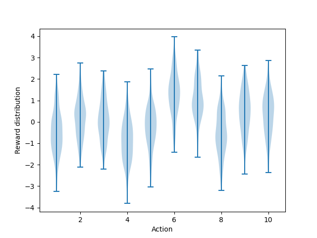
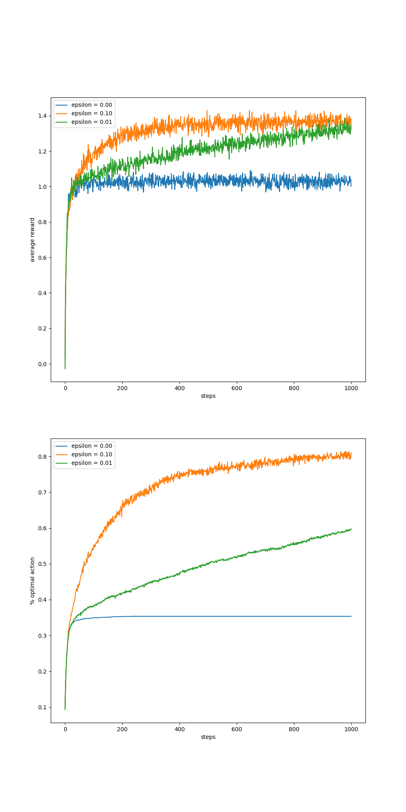
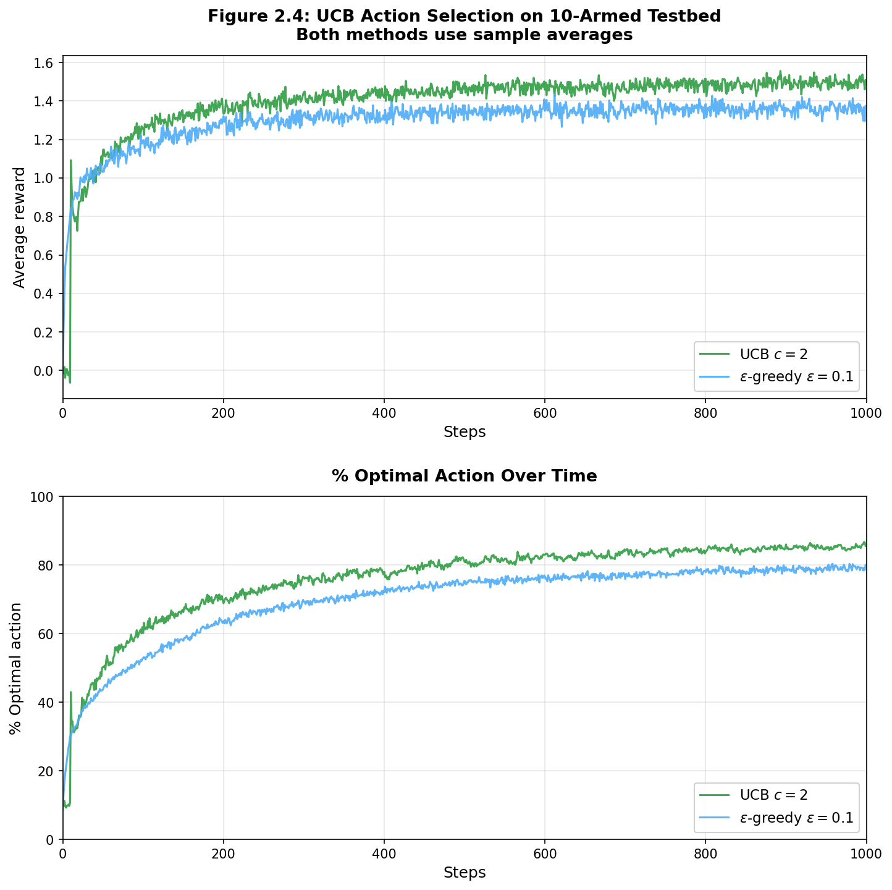
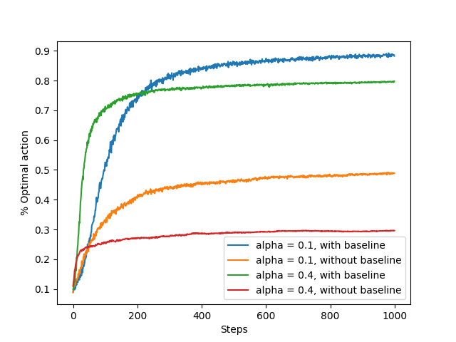
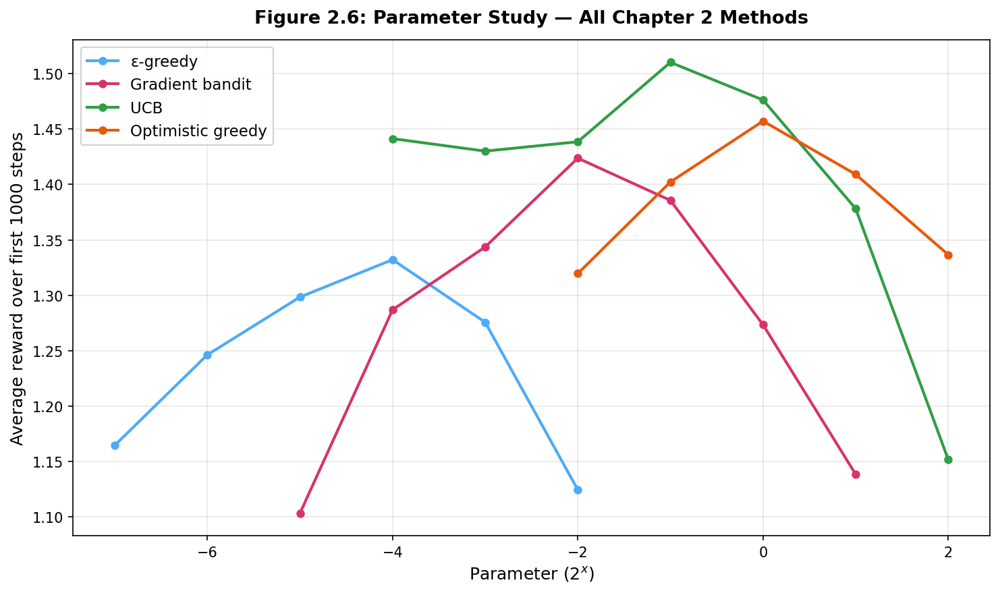
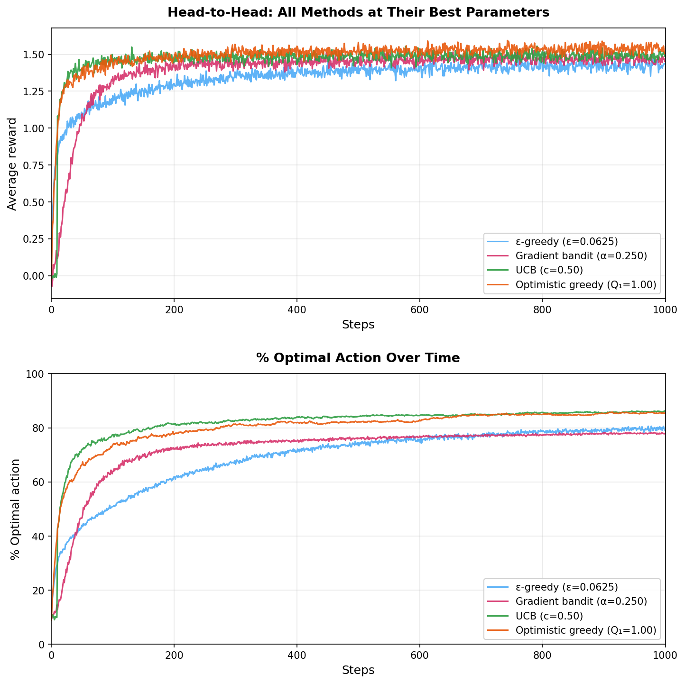
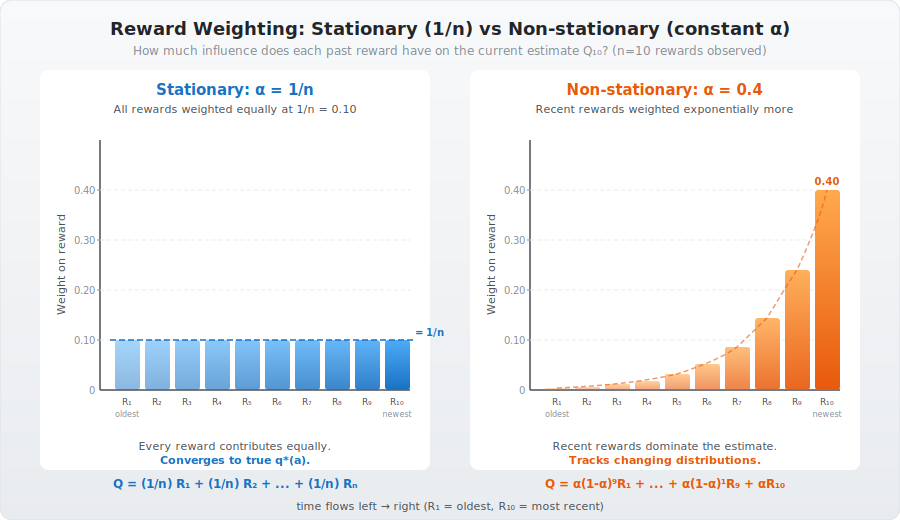
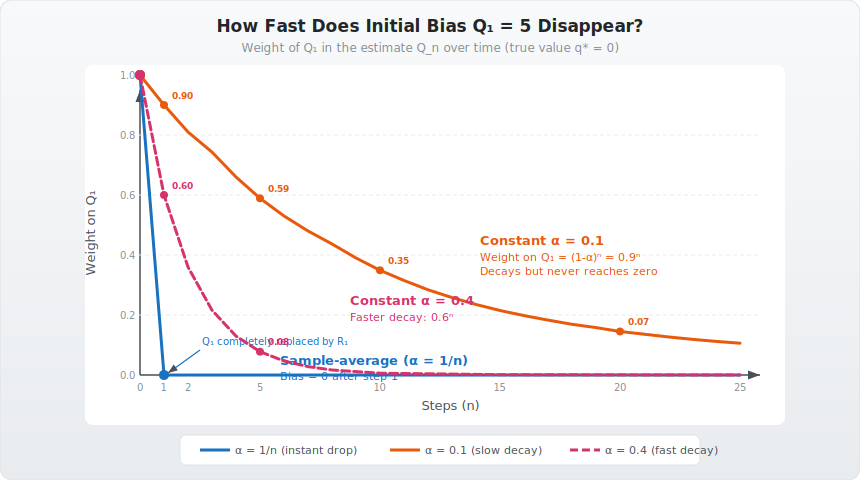
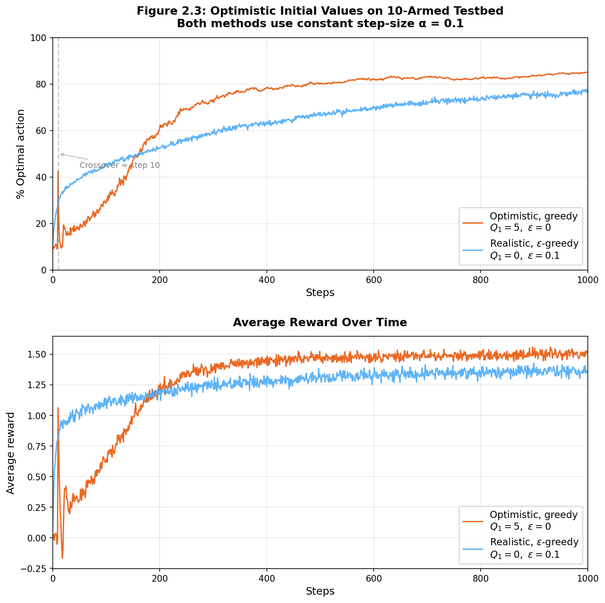

## Today's conversations - 5/2/26 
## MAB - multi arm bandit - K armed bandit problem

## Today's Anthem

> Ten arms beckon, each with a grin,   
"Pull me! Pull me! I'm sure to win!"  
The greedy fool grabs the first that pays,  
The wise one wanders through uncertain haze—  
For the arm that stings you at the start,  
May hold the treasure closest to its heart.  

> So epsilon flips a coin to roam,  
While optimistic starts far from home,  
UCB peeks where uncertainty's rife,  
And gradient climbs the slope of life—  
Each a compass through the bandit's maze,  
Trading today's gold for tomorrow's praise.   

### Evaluative Approach 
The most important feature distinguishing RL from other types of learning is that it uses training information to evaluate policies (Actions) instead of instructing (supervised learning) what is the correct action. This creates the need for active exploration and explicit search for an specific objective. Purely evaluative feedback indicates how good the action taken was but not whether it was the best and worst action. Note V(s) was stochastic distribution. And a high value of V(s) at any state is basically giving an average value indicator of how good is that state. but it does not give us a way to find the best and worst value V*. Same is the case with Q(s,a) and Q*(s,a).

### K-armed Bandit Problem or Multi Armed Bandit Problem 
It is a non-associative, evaluative feedback problem. You are faced repeatedly with a choice **among k different options (Actions)**. After each choice you receive a numerical reward chosen from a **stationary probability distribution** that depends on the action that you selected. your objective is to maximize total expected reward over **some time period**, for example over 1000 action selections, or time steps. Through repeated action selections you are to maximize your winnings by concentrating your actions on the best levers. 

### $q_*(a,s)$ vs $Q(a,s)$ 
Each of the k-actions has an expected or mean reward given that that action is selected; this is called **value** of the action - **$q_*(a)$**. This is the true value of the action, which is unknown to the agent.  
$$\mathbb{E}[R_t | A_t = a] = q_*(a)$$
The agent estimates the value of each action based on the rewards received when that action was selected. This estimate is denoted as **$Q_t(a)$**, which is the estimated value of action a at time t. The agent updates this estimate based on the rewards received after selecting action a.

### Greedy actions / exploitation / exploration
If you maintain the **estimates of the action values $Q(s,a)$**, then at any time step, there is at-least one action whose estimated value is greatest. We call that **greedy action**. If you select one of these actions, we say that you are **exploiting your current knowledge of the values of the actions**.
if instead you select one of the non-greedy actions, then we say you are **exploring**, because this enables you to improve your estimate of the non greedy action's value. 
**Exploitation** is the right thing to do to maximize the expected reward on the one step. But **Exploration** may produce the greater total reward in the long run. If you have many time steps ahead on which to make action selections, then it may be better to explore the non greedy actions and discover which of them are better than the greedy actions. Exploitation and Exploration need to be balanced. 

### Action Value Methods
The average of all past rewards is known as the action value at any given time step t.
$$ Q_t(a) = \frac{sum \ of \ rewards \ when \ action \ a \ taken \ prior \ to \ t }{number \ of \ times \ action \ a \ taken \ prior \ to \ t} = \frac{\sum_{i=1}^{t-1} R_i \cdot \mathbb{1}_{A_i=a}}{\sum_{i=1}^{t-1}\mathbb{1}_{A_i=a}} $$

### Greedy action 
$$ A_t = \argmax_a Q_t(a)$$

### $\epsilon$ greedy method - Exploration Vs Exploitation

**Exploration** is about randomly selecting any action without paying any heed to its $Q(a,s)$

**Exploitation** is about selecting the **greedy action**, i.e., selecting the action whoose $Q(a,s)$ is the highest. 

We need to exploit actively, i.e. $\epsilon$ should be bigger, if the following is true - 
1. high variance in the rewards. 
2. $q_*(s,a)$ changes over time. 

But in most of the practical cases, we might have to keep adjusting $\epsilon$ 

### 10-Armed Testbed (Section 2.3)

*Code: [ten_armed_testbed.py](./assets/ten_armed_testbed.py) — generates all figures below (2000 runs × 1000 steps each)*

#### How the testbed is constructed

The `Bandit` class models one instance of the 10-armed bandit problem:

- **True action values** $q_*(a)$ are sampled once per run from $\mathcal{N}(0, 1)$.
- When action $a$ is selected, the **reward** is drawn from $\mathcal{N}(q_*(a), 1)$ — a noisy version of the true value.

The violin plot below (Figure 2.1) shows one such randomly generated problem. Each violin represents the reward distribution for one arm. The center sits at $q_*(a)$, and the spread reflects the unit-variance noise.

The agent does **not** see these distributions. It must estimate them from sampled rewards. The overlap between distributions means a single reward sample can be misleading — an inferior arm can occasionally return a higher reward than the best arm.

#### Figure 2.2: $\epsilon$-Greedy Methods Compared

Three settings are compared, all using **sample averages** to estimate action values:

| Strategy | $\epsilon$ | Behavior |
|----------|-----------|----------|
| Pure greedy | 0.00 | Never explores — always exploits current estimates |
| Moderate exploration | 0.10 | Explores 10% of the time |
| Light exploration | 0.01 | Explores 1% of the time |

**Results:**
- **Greedy ($\epsilon = 0$)**: Learns quickly at first but gets stuck. It locks onto whichever action *happened* to look best early on and never corrects. Finds the optimal action only ~35% of the time.
- **$\epsilon = 0.10$**: Explores frequently, reliably discovers the best arm. Achieves highest long-run % optimal action (~80%). But even after finding the best action, it still wastes 10% of steps on random arms.
- **$\epsilon = 0.01$**: Slower but steadier. Given enough time, it would likely match or surpass $\epsilon = 0.10$ in average reward because it wastes less on known-bad arms.

**Takeaway**: Some exploration is essential. A purely greedy agent performs significantly worse in the long run.

#### Figure 2.4: Upper-Confidence-Bound (UCB) Action Selection (Section 2.7)

*Code: [ucb_action_selection.py](./assets/ucb_action_selection.py) — standalone UCB vs $\epsilon$-greedy comparison*

**The key difference**: $\epsilon$-greedy has two separate branches — exploit (greedy) vs explore (random). UCB **merges both into a single argmax** by adding an uncertainty bonus to each action's value estimate. There is no random branch at all.

**$\epsilon$-greedy (vanilla) — two separate branches:**

$$A_t = \begin{cases} \argmax_a Q_t(a) & \text{with probability } 1 - \epsilon \quad \textbf{(exploit: pick best estimate)} \\ \text{random action from } \{1, \ldots, k\} & \text{with probability } \epsilon \quad \textbf{(explore: blind random choice)} \end{cases}$$

The exploration branch knows **nothing** about which arms need more exploration — it picks uniformly at random. An arm tried once gets the same probability as an arm tried 500 times.

**UCB — single branch, no randomness:**

$$A_t = \argmax_a \underbrace{\left[ \underbrace{Q_t(a)}_{\text{exploitation}} + \underbrace{c \sqrt{\frac{\ln t}{N_t(a)}}}_{\text{exploration bonus}} \right]}_{\text{combined score for each arm}}$$

- $Q_t(a)$ = estimated value (same as the greedy term in $\epsilon$-greedy)
- $N_t(a)$ = number of times action $a$ has been selected
- $t$ = total steps so far
- $c > 0$ = controls exploration degree (here $c = 2$)

There is **no coin flip**, no random selection. Every step is a greedy argmax — but over a **modified score** that inflates the value of under-explored arms.

**Detailed intuition: how the formula balances exploration and exploitation**

The UCB score for each arm is: $\text{Score}(a) = Q_t(a) + c\sqrt{\frac{\ln t}{N_t(a)}}$

Think of this as: **"What's my best guess of this arm's value, plus how uncertain am I about that guess?"** The agent always picks the arm with the highest combined score. Let's trace through how this handles both the greedy case (well-explored arms) and the exploration case (under-explored arms).

**Case 1 — Well-explored arm (large $N_t(a)$): exploitation dominates**

Suppose arm 3 has been pulled 200 times at step $t = 500$, with $Q_t(3) = 1.8$:

$$\text{Bonus} = c\sqrt{\frac{\ln 500}{200}} = 2 \times \sqrt{\frac{6.21}{200}} = 2 \times 0.176 = 0.35$$

$$\text{Score}(3) = 1.8 + 0.35 = 2.15$$

The bonus is **small** relative to $Q_t(3)$. The score is dominated by the estimated value — this arm wins or loses based on whether $Q_t(3)$ is actually good. This is effectively the **greedy case**: the arm has been tried enough that the uncertainty is low, so the agent trusts the estimate.

**Case 2 — Under-explored arm (small $N_t(a)$): exploration dominates**

Suppose arm 7 has been pulled only 3 times at the same step $t = 500$, with $Q_t(7) = 0.5$:

$$\text{Bonus} = c\sqrt{\frac{\ln 500}{3}} = 2 \times \sqrt{\frac{6.21}{3}} = 2 \times 1.44 = 2.88$$

$$\text{Score}(7) = 0.5 + 2.88 = 3.38$$

Even though the estimated value (0.5) is much lower than arm 3's (1.8), arm 7 **wins** because its uncertainty bonus is huge. The agent says: *"I don't know enough about this arm — the true value could be much higher than 0.5. I should try it."* This is the **exploration case**, and it happens automatically without any random coin flip.

**Case 3 — Never-tried arm ($N_t(a) = 0$): forced exploration**

If an arm has never been tried, $N_t(a) = 0$, so $\ln t / N_t(a) \to \infty$ and the bonus is infinite. UCB will **always** try untested arms first before anything else. This guarantees that every arm is sampled at least once — similar to how optimistic initial values force early exploration, but built into the selection rule itself.

**Why $\ln t$ in the numerator?**

As total steps $t$ grow, $\ln t$ slowly increases. This means that even a well-explored arm's bonus **gradually creeps up** over time if it hasn't been selected recently. Eventually the bonus becomes large enough that the arm gets re-tried. This prevents the agent from permanently ignoring any arm — it guarantees that every arm is revisited infinitely often as $t \to \infty$.

But $\ln t$ grows **very slowly** (logarithmically), so an arm that was tried recently doesn't get an inflated bonus. The agent spends most of its time on high-value arms and only occasionally revisits others.

**Why is it accurate? — Connection to confidence intervals**

The formula comes from the theory of **upper confidence bounds** in statistics. For a sample mean $Q_t(a)$ computed from $N_t(a)$ observations, a confidence interval on the true mean $q_*(a)$ has width proportional to $1/\sqrt{N_t(a)}$. The term $c\sqrt{\ln t / N_t(a)}$ is the **upper end** of such an interval (with the $\ln t$ factor adjusted to guarantee correctness over all time steps simultaneously — this comes from Hoeffding's inequality applied with a union bound over time).

The agent acts as if the true value is at the **optimistic end** of the confidence interval. Arms with wide intervals (few samples) get optimistic estimates; arms with narrow intervals (many samples) are evaluated close to their sample mean. Over time, every arm's interval shrinks, and the optimistic estimates converge to the true values — so UCB naturally transitions from exploration to exploitation.

**Numerical walkthrough with 3 arms at $t = 20$, $c = 2$:**

| Arm | $Q_t(a)$ | $N_t(a)$ | Bonus $= 2\sqrt{\ln 20 / N_t(a)}$ | Score | Interpretation |
|-----|-----------|-----------|-------------------------------------|-------|----------------|
| 1 | 1.5 | 12 | $2\sqrt{3.0/12} = 1.0$ | **2.5** | Well-explored, modest bonus |
| 2 | 0.8 | 2 | $2\sqrt{3.0/2} = 2.45$ | **3.25** | Under-explored — **selected!** |
| 3 | 2.0 | 6 | $2\sqrt{3.0/6} = 1.41$ | **3.41** | Moderate — **actually selected!** |

Arm 3 wins here — it has the best combination of a strong estimated value and moderate uncertainty. Arm 2 has a huge bonus but its estimated value is too low. Arm 1 is well-known and its bonus is small. The formula naturally weighs both factors.

**Side-by-side comparison:**

| | $\epsilon$-greedy | UCB |
|--|-------------------|-----|
| **Exploration mechanism** | Random coin flip ($\epsilon$) | Uncertainty bonus $c\sqrt{\ln t / N_t(a)}$ |
| **Explore branch** | Uniform random — any arm equally | No separate branch — directed via bonus |
| **Exploit branch** | $\argmax_a Q_t(a)$ | Same $Q_t(a)$, but augmented with bonus |
| **Knows which arms need exploring?** | No | Yes — targets under-sampled arms |
| **Action selection** | Stochastic (random with prob $\epsilon$) | Deterministic (always argmax of combined score) |
| **Suited for** | Stationary and non-stationary | **Stationary only** |

**Results**: UCB consistently outperforms $\epsilon$-greedy, especially in the first few hundred steps where **directed** exploration matters most. Its limitation: UCB is designed for **stationary** bandits — the confidence term $c\sqrt{\ln t / N_t(a)}$ shrinks as $N_t(a)$ grows, assuming more samples means better estimates. In a non-stationary environment, old samples are misleading but UCB still trusts them. It is also harder to extend to full RL with large state spaces.

#### Figure 2.5: Gradient Bandit Algorithms (Section 2.8)

All previous methods ($\epsilon$-greedy, optimistic, UCB) estimate action **values** $Q_t(a)$ and derive a policy from them. The gradient bandit takes a fundamentally different approach: it learns a **preference** $H_t(a)$ for each action directly and selects actions via a **softmax** (Gibbs) distribution:

$$\Pr(A_t = a) = \frac{e^{H_t(a)}}{\sum_b e^{H_t(b)}} = \pi_t(a)$$

Preferences are **not** reward estimates — only the relative differences between $H_t(a)$ values matter. Adding 100 to all preferences changes nothing. An arm with a higher preference simply gets selected more often.

**What is stochastic gradient ascent?**

The goal is to maximize the **expected reward**:

$$\mathbb{E}[R_t] = \sum_a \pi_t(a) \, q_*(a)$$

This is just the definition of expected value. At each step, you pick arm $a$ with probability $\pi_t(a)$, and the average reward from that arm is $q_*(a)$. So the overall expected reward is the probability-weighted sum:

$$\mathbb{E}[R_t] = \pi_t(1) \cdot q_*(1) + \pi_t(2) \cdot q_*(2) + \ldots + \pi_t(k) \cdot q_*(k)$$

Example with 3 arms:

| Arm $a$ | $\pi_t(a)$ (selection prob) | $q_*(a)$ (true value) | Contribution |
|---------|------------------------------|----------------------|--------------|
| 1 | 0.6 | 2.0 | $0.6 \times 2.0 = 1.2$ |
| 2 | 0.3 | 1.0 | $0.3 \times 1.0 = 0.3$ |
| 3 | 0.1 | 3.0 | $0.1 \times 3.0 = 0.3$ |
| **Total** | 1.0 | | **$\mathbb{E}[R_t] = 1.8$** |

Arm 3 has the best true value (3.0), but the policy only selects it 10% of the time. The **optimal** policy would put all probability on arm 3, giving $\mathbb{E}[R_t] = 3.0$. Gradient ascent tries to adjust $\pi_t(a)$ (via preferences $H_t$) to shift probability mass toward high-$q_*$ arms, maximizing this sum.

**Gradient descent vs gradient ascent:**

The gradient $\nabla f$ always points in the direction of steepest **increase** of $f$. Whether you follow it or go against it depends on whether you want to maximize or minimize:

| | Gradient Descent | Gradient Ascent |
|--|-----------------|-----------------|
| **Goal** | Minimize $L(\theta)$ | Maximize $J(\theta)$ |
| **Update** | $\theta \leftarrow \theta - \alpha \nabla L$ | $\theta \leftarrow \theta + \alpha \nabla J$ |
| **Direction** | Opposite to gradient (downhill) | Along the gradient (uphill) |
| **Used in** | Neural network training (minimize loss) | Gradient bandit (maximize expected reward) |

The math is identical except for the **sign**: $-\alpha$ to minimize, $+\alpha$ to maximize. In deep learning we minimize cross-entropy loss → descent. Here we maximize expected reward → ascent.

In regular gradient ascent, you compute the gradient $\nabla \mathbb{E}[R_t]$ with respect to the preferences $H_t(a)$ and take a step uphill:

$$H_{t+1}(a) = H_t(a) + \alpha \, \nabla_{H_t(a)} \mathbb{E}[R_t]$$

**Problem**: We don't know $q_*(a)$ — that's the whole point of the bandit problem. We can't compute the true gradient.

**Solution — stochastic gradient ascent**: Instead of the true gradient, use a **single sample** as a noisy estimate of the gradient. On each step, you take one action $A_t$, observe one reward $R_t$, and update all preferences using that single observation. The update is "stochastic" because each step uses a **random sample** (one action, one reward) rather than the full expectation. The key mathematical result (Sutton & Barto, Section 2.8) is that the expected value of this stochastic update **equals** the true gradient:

$$\mathbb{E}\left[\text{stochastic update}\right] = \nabla_{H_t(a)} \mathbb{E}[R_t]$$

This is what makes it gradient ascent — on average, you're moving uphill on the expected reward surface, even though each individual step is noisy.

**The update rule (derived from the gradient):**

$$H_{t+1}(a) = H_t(a) + \alpha (R_t - \bar{R}_t)(\mathbb{1}_{A_t=a} - \pi_t(a))$$

Let's break down every term:

- $R_t - \bar{R}_t$: **Was this reward better or worse than average?** $\bar{R}_t$ is the baseline (average of all past rewards). If $R_t > \bar{R}_t$, this is positive ("good reward"). If $R_t < \bar{R}_t$, this is negative ("bad reward").

- $\mathbb{1}_{A_t=a}$: Is 1 for the action that was actually taken, 0 for all others.

- $\mathbb{1}_{A_t=a} - \pi_t(a)$: **Direction of the update.** For the action that was taken: $1 - \pi_t(a) > 0$ (positive). For all other actions: $0 - \pi_t(a) < 0$ (negative).

**Putting it together — what happens in each case:**

| Scenario | $R_t - \bar{R}_t$ | Action taken ($A_t$) | Other actions |
|----------|-------------------|---------------------|---------------|
| **Good reward** ($R_t > \bar{R}_t$) | $+$ | $H_t(A_t)$ **increases** (preference goes up) | $H_t(a)$ **decreases** (probability shifts away) |
| **Bad reward** ($R_t < \bar{R}_t$) | $-$ | $H_t(A_t)$ **decreases** ("I regret this choice") | $H_t(a)$ **increases** (probability shifts toward alternatives) |

This is intuitive: if an action gave a better-than-average reward, make it more likely next time. If it gave worse-than-average, make it less likely and shift probability toward other actions.

**Numerical example with 3 arms:**

Current state: $H_t = [2.0, 1.0, 0.5]$, so $\pi_t = [0.59, 0.22, 0.13]$ (via softmax). We select $A_t = 1$ (arm 1), observe $R_t = 3.0$, baseline $\bar{R}_t = 2.0$, step-size $\alpha = 0.1$.

- $R_t - \bar{R}_t = 1.0$ (good reward)
- Arm 1 (taken): $H_{t+1}(1) = 2.0 + 0.1 \times 1.0 \times (1 - 0.59) = 2.0 + 0.041 = 2.041$ (preference up)
- Arm 2 (not taken): $H_{t+1}(2) = 1.0 + 0.1 \times 1.0 \times (0 - 0.22) = 1.0 - 0.022 = 0.978$ (preference down)
- Arm 3 (not taken): $H_{t+1}(3) = 0.5 + 0.1 \times 1.0 \times (0 - 0.13) = 0.5 - 0.013 = 0.487$ (preference down)

Arm 1 got a good reward, so its preference increased and the others decreased — probability mass shifted toward it.

**Why the baseline $\bar{R}_t$ is critical:**

The baseline is the average of all past rewards: $\bar{R}_t = \frac{1}{t}\sum_{i=1}^{t} R_i$. It turns the update from "was this reward positive?" to "was this reward **better than usual**?"

**Without baseline** ($\bar{R}_t = 0$), the update uses raw $R_t$:

$$H_{t+1}(a) = H_t(a) + \alpha \cdot R_t \cdot (\mathbb{1}_{A_t=a} - \pi_t(a))$$

Suppose true values are $q_*(1) = 3.5$, $q_*(2) = 4.0$, $q_*(3) = 4.5$. Every reward is around +4. Without a baseline, $R_t$ is always positive, so the selected action's preference **always increases**. The algorithm says "that was good!" every single time — it can't tell arm 1 (mediocre at 3.5) from arm 3 (best at 4.5), because both give positive rewards.

**With baseline**, suppose $\bar{R}_t = 4.0$ after many steps:

| Arm pulled | Reward $R_t$ | $R_t - \bar{R}_t$ | Effect on selected arm's preference |
|-----------|-------------|-------------------|--------------------------------------|
| Arm 1 ($q_* = 3.5$) | 3.2 | $3.2 - 4.0 = -0.8$ | **Decreases** ("worse than usual") |
| Arm 2 ($q_* = 4.0$) | 4.1 | $4.1 - 4.0 = +0.1$ | Slight **increase** ("about average") |
| Arm 3 ($q_* = 4.5$) | 4.8 | $4.8 - 4.0 = +0.8$ | **Increases** ("better than usual") |

Now the algorithm differentiates! Arm 3 gets reinforced, arm 1 gets penalized — probability mass shifts toward the best arm over time.

**Does the baseline change the answer?** No — mathematically, the baseline does not change the **expected** gradient. Both with and without baseline converge to the same optimum in theory. But the baseline **dramatically reduces variance** of the updates, making learning much faster and more stable in practice. Without it, the noisy positive-everywhere signal causes preferences to wander aimlessly.

That's why in Figure 2.5 (with true reward shifted to +4), the without-baseline curves are nearly flat — the algorithm reinforces everything equally and learns nothing useful.

Tested with true reward shifted to $+4$ to make the baseline critical:

| Config | $\alpha$ | Baseline? |
|--------|---------|-----------|
| 1 | 0.1 | Yes |
| 2 | 0.1 | No |
| 3 | 0.4 | Yes |
| 4 | 0.4 | No |

**Results**: Without a baseline, all rewards are positive (true means ~4), so the algorithm treats *every* outcome as positive reinforcement and fails to differentiate good from bad. The baseline is not optional — it is essential for the algorithm to work.

#### Figure 2.6: Parameter Study — Comparing All Methods (Section 2.10)

*Code: [parameter_study.py](./assets/parameter_study.py) — parameter sweep + head-to-head comparison at best parameters*

**The question**: Each method has a key hyperparameter. How do we fairly compare them? We sweep each method's parameter over a range ($2^x$), run 1000 steps × 2000 independent runs for each setting, and plot the average reward over the entire run.

| Method | Parameter swept | What it controls | Range ($2^x$) |
|--------|----------------|-----------------|---------------|
| $\epsilon$-greedy | $\epsilon$ | Fraction of random exploration | $2^{-7}$ to $2^{-2}$ |
| Gradient bandit | $\alpha$ | Step-size for preference updates | $2^{-5}$ to $2^{1}$ |
| UCB | $c$ | Exploration bonus strength | $2^{-4}$ to $2^{2}$ |
| Optimistic greedy | $Q_1$ | Initial value (drives early exploration) | $2^{-2}$ to $2^{2}$ |

**Reading the parameter study curve:**

Every method shows an **inverted-U** shape. This reflects the universal exploration-exploitation tradeoff:
- **Left side** (parameter too small): too little exploration → agent locks onto a suboptimal arm early
- **Peak**: sweet spot — enough exploration to find the best arm, not so much that it wastes time
- **Right side** (parameter too large): too much exploration → agent keeps trying bad arms it already knows are bad

**Best parameter for each method:**

| Method | Best parameter | Best avg reward | Exploration mechanism |
|--------|---------------|----------------|----------------------|
| $\epsilon$-greedy | $\epsilon = 2^{-4} = 0.0625$ | 1.34 | Random coin flip |
| Gradient bandit | $\alpha = 2^{-2} = 0.25$ | 1.42 | Preference-based softmax |
| UCB | $c = 2^{-1} = 0.5$ | 1.51 | Uncertainty bonus |
| Optimistic greedy | $Q_1 = 2^0 = 1.0$ | 1.46 | Disappointment from inflated starts |

#### Head-to-Head: All Methods at Their Best Parameters

The parameter study tells us which parameter is best for each method. Now we run all four methods at their best settings on the **same** testbed and compare their learning curves directly.

**Performance summary (2000 runs × 1000 steps):**

| Method | Avg Reward (all 1000 steps) | Avg Reward (last 100 steps) | % Optimal (all) | % Optimal (last 100) |
|--------|----------------------------|-----------------------------|-----------------|---------------------|
| $\epsilon$-greedy ($\epsilon = 0.0625$) | 1.341 | 1.421 | 69.3% | 79.5% |
| Gradient bandit ($\alpha = 0.25$) | 1.391 | 1.466 | 72.2% | 77.9% |
| UCB ($c = 0.5$) | **1.461** | 1.492 | **81.8%** | **85.9%** |
| Optimistic greedy ($Q_1 = 1.0$) | 1.492 | **1.536** | 80.1% | 85.5% |

#### Detailed Analysis of Each Method

**1. $\epsilon$-greedy — simplest, but weakest ceiling**

The most basic approach: flip a coin, explore randomly $\epsilon$% of the time. Its strength is simplicity — easy to implement and understand, works for both stationary and non-stationary problems (with constant $\alpha$). Its weakness is that exploration is **blind**: when it explores, it picks any arm uniformly at random, including arms it already knows are terrible. This wastes exploration budget. At its best parameter ($\epsilon = 0.0625$), it still only reaches ~80% optimal action by step 1000 — the worst of all four methods. The permanent random exploration also means it **never stops** pulling suboptimal arms.

**2. Gradient bandit — different paradigm, moderate performance**

The only method that doesn't estimate action values at all — it learns preferences and converts them to probabilities via softmax. This is a fundamentally different approach (policy-based rather than value-based). It performs better than $\epsilon$-greedy in average reward, but its % optimal action at the end (~78%) is lower than UCB and optimistic. The softmax never puts 100% probability on any arm, so there's always some residual exploration happening. Its real advantage shows up in problems where action **probabilities** matter more than a hard argmax — and it's the precursor to policy gradient methods used in full RL (Chapter 13).

**3. UCB — strongest overall on stationary bandits**

Achieves the highest % optimal action (85.9% in the last 100 steps) and the best average reward across the full 1000 steps. Its directed exploration (targeting uncertain arms) is far more efficient than random exploration. The uncertainty bonus naturally decays as arms are sampled, so it automatically transitions from exploration to exploitation without any parameter scheduling. **Weakness**: designed strictly for stationary problems. The confidence term assumes more samples = better estimates, which breaks down if reward distributions shift.

**4. Optimistic greedy — fastest convergence, best late-game reward**

Achieves the highest average reward in the last 100 steps (1.536), meaning it **converges the most tightly** onto the best arm. Once the initial bias decays and the agent has tried all arms, it becomes pure greedy with no wasted exploration. This gives it the highest asymptotic performance. **Weakness**: exploration is front-loaded — it's a one-shot trick that only works at the start. If the environment changes later, the agent has no mechanism to re-explore. Also sensitive to the choice of $Q_1$: too low and it doesn't explore; too high and it wastes too many steps cycling through all arms.

#### Summary: Which method to use?

| Scenario | Best method | Why |
|----------|------------|-----|
| **Stationary, need overall best** | UCB | Directed exploration, strong across full run |
| **Stationary, care about final performance** | Optimistic greedy | Tightest convergence after exploration phase |
| **Non-stationary** | $\epsilon$-greedy (with constant $\alpha$) | Only method that continuously explores and can use recency-weighted updates |
| **Want probability-based policy** | Gradient bandit | Learns a distribution over actions, precursor to policy gradient |
| **Need simplicity** | $\epsilon$-greedy | One parameter, easy to understand, works everywhere |

No single method dominates in all settings — the right choice depends on the problem structure.

---

[exercise 2.1](./assets/exercises/chap2/2.2-bandit-example.xlsx)

### What happens when the Bandits are non-stationary. 

#### First, the stationary case: Sample-Average with step-size $1/n$ (Section 2.4)

When reward distributions are **fixed** (stationary), the incremental update is:

$$Q_{n+1} = Q_n + \frac{1}{n}[R_n - Q_n]$$

Expanding this gives the simple average — **all rewards are weighted equally**:

$$Q_{n+1} = \frac{1}{n} \sum_{i=1}^{n} R_i$$

Every past reward $R_i$ contributes weight $\frac{1}{n}$, regardless of when it was observed. This is optimal for stationary problems: as $n \to \infty$, $Q_n \to q_*(a)$ by the law of large numbers. The step-size $\alpha_n = 1/n$ satisfies both convergence conditions ($\sum \alpha_n = \infty$, $\sum \alpha_n^2 < \infty$), guaranteeing convergence to the true value.

**Problem**: If the reward distribution **changes over time**, old rewards from the previous distribution pollute the estimate and the $1/n$ weighting makes it very slow to adapt.

#### Now, the non-stationary case: Exponential Recency-Weighted Average (Section 2.5)

When reward distributions change over time, the sample-average method gives equal weight to all past rewards — including stale ones from a distribution that no longer applies. We need a method that forgets old data and tracks the current distribution.

#### Exponential Recency-Weighted Average (Section 2.5, Eq 2.5-2.6)

Using a **constant step-size** $\alpha \in (0,1]$ instead of $1/n$:

$$Q_{n+1} = Q_n + \alpha [R_n - Q_n]$$

Expanding this recursively gives:

$$Q_{n+1} = (1-\alpha)^n Q_1 + \sum_{i=1}^{n} \alpha (1-\alpha)^{n-i} R_i$$

**Recent rewards get exponentially more weight than older ones.** The weight on reward $R_i$ is $\alpha(1-\alpha)^{n-i}$:

| Reward | Age | Weight |
|--------|-----|--------|
| $R_n$ (most recent) | 0 | $\alpha(1-\alpha)^0 = \alpha$ **(largest)** |
| $R_{n-1}$ | 1 | $\alpha(1-\alpha)^1$ |
| $R_{n-2}$ | 2 | $\alpha(1-\alpha)^2$ |
| ... | ... | ... |
| $R_1$ (oldest) | $n-1$ | $\alpha(1-\alpha)^{n-1}$ **(smallest)** |

Since $(1-\alpha) < 1$, each additional step into the past multiplies the weight by $(1-\alpha)$, causing **exponential decay**. That's why it's called "recency-weighted" — it naturally **forgets** old observations and tracks the current reward distribution.

#### General Step-Size Framework and Convergence Conditions (Eq 2.7)

The update rule $Q_{n+1} = Q_n + \alpha_n(a)[R_n - Q_n]$ is a general form where $\alpha_n(a)$ can be **any** sequence. Both the stationary and non-stationary methods are specific choices within this family. The convergence conditions from stochastic approximation theory state that $Q_n$ is guaranteed to converge to the true value $q_*(a)$ if:

$$\sum_{n=1}^{\infty} \alpha_n(a) = \infty \quad \text{and} \quad \sum_{n=1}^{\infty} \alpha_n^2(a) < \infty$$

- **First condition** ($\sum \alpha_n = \infty$): Steps must be large enough to overcome any initial condition or random fluctuation.
- **Second condition** ($\sum \alpha_n^2 < \infty$): Steps must eventually shrink small enough to settle down.

#### Conclusion: Step-size and weighting are not independent knobs

| Choice | $\sum \alpha_n$ | $\sum \alpha_n^2$ | Converges? | Weighting | Best for |
|--------|---------|----------|------------|-----------|----------|
| $\alpha_n = 1/n$ | $= \infty$ | $< \infty$ | Yes | Equal (simple average) | **Stationary** |
| $\alpha_n = \alpha$ (constant) | $= \infty$ | $= \infty$ | No | Exponential recency | **Non-stationary** |

The exponential recency weighting is **a direct consequence** of choosing a constant step-size — not a separate mechanism. You don't tune them independently. Picking $\alpha_n = \alpha$ automatically produces the weighting $\alpha(1-\alpha)^{n-i}$ on reward $R_i$.

For stationary problems, $1/n$ is optimal — it uses all data equally and converges to the true value. For non-stationary problems, constant $\alpha$ intentionally **violates** the second convergence condition so the estimate **never fully settles**, allowing it to continuously track a changing reward distribution. In practice, sequences satisfying both conditions converge too slowly and are rarely used in RL.

### Optimistic Initial Values (Section 2.6)

#### Why does initial bias disappear in sample-average but persist with constant $\alpha$?

**Sample-average ($\alpha_n = 1/n$): Bias vanishes after one observation.**

The first step-size is $1/1 = 1$, which completely replaces $Q_1$:

$$Q_2 = Q_1 + \frac{1}{1}[R_1 - Q_1] = R_1$$
$$Q_3 = \frac{R_1 + R_2}{2}, \quad Q_4 = \frac{R_1 + R_2 + R_3}{3}, \quad \ldots$$

$Q_1$ never appears again. The estimate is purely $\frac{1}{n}\sum R_i$ — the initial value has **zero weight** after the first reward.

**Constant $\alpha$: Bias decays but never fully vanishes.**

$$Q_{n+1} = (1-\alpha)^n Q_1 + \sum_{i=1}^{n} \alpha(1-\alpha)^{n-i} R_i$$

The weight on $Q_1$ is $(1-\alpha)^n$ — it shrinks exponentially but **never reaches zero**. For example with $Q_1 = 5$ and $\alpha = 0.1$:

| After step $n$ | Weight on $Q_1$ = $(1-\alpha)^n$ | Contribution of $Q_1$ |
|----------------|----------------------------------|----------------------|
| 1 | $0.9^1 = 0.90$ | $4.50$ |
| 5 | $0.9^5 = 0.59$ | $2.95$ |
| 10 | $0.9^{10} = 0.35$ | $1.74$ |
| 20 | $0.9^{20} = 0.12$ | $0.61$ |
| 50 | $0.9^{50} = 0.005$ | $0.03$ |

The optimistic initial bias **lingers** — this is exactly what makes optimistic initialization useful as an exploration trick with constant $\alpha$. The inflated $Q_1$ keeps the agent "disappointed" by real rewards for many steps, forcing it to try other actions.

**Key takeaway**: Optimistic initial values ($Q_1 = +5$) combined with **constant $\alpha$** and greedy selection cause systematic early exploration — every action looks disappointing compared to the optimistic start, so the agent keeps trying new ones. With sample-average, this effect vanishes after a single observation per action, making it far less useful as an exploration mechanism.

#### Figure 2.3: Optimistic Greedy vs Realistic $\epsilon$-Greedy (10-Armed Testbed)

The figure below reproduces **Figure 2.3** from Sutton & Barto (p. 34), comparing two strategies on the 10-armed testbed over 2000 independent runs:

| Setting | $Q_1$ | $\epsilon$ | $\alpha$ | Strategy |
|---------|--------|------------|----------|----------|
| **Optimistic greedy** | 5 | 0 (pure greedy) | 0.1 | Explores via "disappointment" — all initial estimates are wildly above true values (~0), so every real reward feels bad, pushing the agent to try other arms |
| **Realistic $\epsilon$-greedy** | 0 | 0.1 | 0.1 | Explores via random action selection 10% of the time |

**What the graph shows:**

- **Top panel (% Optimal Action)**: The optimistic greedy agent starts *worse* — it wastes early steps cycling through all arms because every reward disappoints relative to $Q_1 = 5$. But this forced broad exploration pays off: it eventually **surpasses** the $\epsilon$-greedy agent and converges closer to 100% optimal action selection. The $\epsilon$-greedy agent plateaus lower because it never stops exploring (10% random actions forever).

- **Bottom panel (Average Reward)**: Both methods converge to similar average reward levels, but the optimistic agent's early rewards are lower due to the initial exploration burst.

**Why the crossover happens**: Around step ~50-100, the optimistic agent has tried every arm enough times that $(1-\alpha)^n Q_1$ has decayed sufficiently — the bias is mostly gone and the estimates reflect reality. From this point, the greedy policy locks onto the best arm. The $\epsilon$-greedy agent, meanwhile, is permanently forced to pull random suboptimal arms 10% of the time.

**Limitation**: Optimistic initialization is a **one-shot trick** — it only drives exploration at the start. If the environment changes later (non-stationary), the agent has no mechanism to re-explore. It is also not well-suited for non-stationary problems because the exploration incentive is front-loaded and doesn't adapt.

*Source: [optimistic_initial_values.py](./assets/optimistic_initial_values.py) — 2000 runs × 1000 steps, constant $\alpha = 0.1$*

